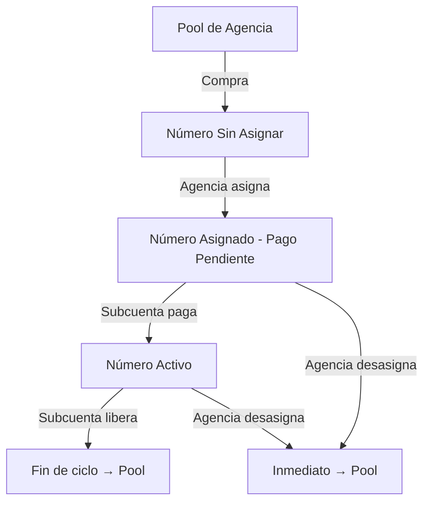

<Callout kind="info" title="¿Qué lograrás con esta guía?">
Al finalizar, podrás comprar números telefónicos desde tu agencia, asignarlos a cualquier subcuenta aprobada, configurar el margen de ganancia mensual por número y gestionar devoluciones inmediatas o por fin de ciclo. Todo con cobro automatizado vía Stripe.
</Callout>

## Modelo de Facturación

El modelo de distribución de números telefónicos en E-SMART360 sigue una secuencia de tres pasos que automatiza completamente el cobro y elimina la necesidad de perseguir pagos manualmente:

<Steps>
<Step title="La agencia compra el número (pago único)">
Adquieres un número telefónico dentro del pool de tu agencia. El costo de la operadora se cobra una sola vez a la tarjeta registrada de la agencia.
</Step>

<Step title="La agencia asigna el número a una subcuenta">
E-SMART360 crea automáticamente una suscripción recurrente en Stripe sobre la subcuenta del cliente.
</Step>

<Step title="La subcuenta paga la suscripción mensual">
Cada mes la subcuenta recibe el cobro de: **costo de operadora + Precio del Número** (definido por ti en el plan de esa subcuenta).
</Step>
</Steps>

<Callout kind="success" title="Tu margen de ganancia">
Tú fijas el **Precio del Número** en el plan de cada subcuenta. La diferencia entre lo que pagaste al comprar el número y lo que cobras mensualmente es tu margen. Mientras más alto el Precio del Número, mayor tu ganancia recurrente por número asignado.
</Callout>

Solo los miembros del equipo de la agencia pueden **asignar** números. Una subcuenta puede **liberar** un número que ya no desee, pero la liberación surte efecto al final de su ciclo de facturación actual. La agencia puede **desasignar forzadamente** en cualquier momento para un retorno inmediato al pool.

## Prerrequisitos

Antes de comenzar, verifica que se cumplan todas estas condiciones:

<Callout kind="warning" title="Requisitos indispensables">
<ul>
<li>Haber comprado al menos un número telefónico en el pool de tu agencia</li>
<li>Que la subcuenta exista bajo tu agencia</li>
<li>Que el usuario de la subcuenta tenga estado <strong>aprobado</strong></li>
<li>Que la subcuenta tenga una suscripción <strong>activa o en prueba</strong> con un método de pago válido registrado</li>
</ul>
Si alguno de estos requisitos no se cumple, la subcuenta no aparecerá en el menú desplegable de asignación.
</Callout>

## Paso 1 — Compra un Número en el Pool de tu Agencia

Sigue estos pasos para adquirir un número telefónico desde tu panel de agencia:

1. Abre el **Panel de Agencia** y ve a **Números Telefónicos**.
2. Haz clic en **Comprar Número**.
3. Elige el país, código de área y capacidades (voz, SMS o ambas).
4. Confirma la compra. La tarjeta registrada de tu agencia se cobrará inmediatamente por el costo de la operadora.
5. El nuevo número aparece en tu pool con estado **Sin Asignar**.

> Los números que compras son propiedad de tu agencia. Puedes reasignarlos entre subcuentas en cualquier momento sin necesidad de volver a comprarlos.

## Paso 2 — Abre la Sección de Números en el Panel de Agencia

Desde el **Panel de Agencia**, haz clic en **Números Telefónicos**. Verás cada número de tu pool con su estado, la subcuenta a la que está asignado (si aplica) y qué agente lo está utilizando.

La tabla incluye las siguientes columnas:

| Columna | Descripción |
|---------|-------------|
| **Número** | El número telefónico completo |
| **Estado** | Sin Asignar, Pendiente de Pago o Activo |
| **Asignado a** | Subcuenta que posee el número |
| **Agente** | Agente de voz vinculado (si existe) |
| **Acciones** | Menú ⋯ para asignar, desasignar o gestionar |

## Paso 3 — Asigna un Número a una Subcuenta

1. Busca un número sin asignar en la lista.
2. Haz clic en el menú `⋯` de esa fila.
3. Selecciona **Asignar**.

Se abrirá el diálogo **Asignar número telefónico**.

<Callout kind="tip" title="Consejo práctico">
Si tienes muchos números en tu pool, usa el campo de búsqueda o los filtros por estado para encontrar rápidamente los números disponibles.
</Callout>

## Paso 4 — Selecciona el Usuario de la Subcuenta

En el diálogo, elige el usuario de la subcuenta que debe ser propietario de este número. El menú desplegable solo muestra usuarios aprobados de tus subcuentas que tengan un plan activo.

<Callout kind="warning" title="¿No aparece el usuario esperado?">
Si el usuario de la subcuenta no aparece en el menú desplegable, verifica:
<ul>
<li>Que el estado del usuario sea <strong>aprobado</strong>, no pendiente ni bloqueado.</li>
<li>Que su suscripción esté <strong>activa</strong> o en <strong>período de prueba</strong>.</li>
<li>Que tenga un método de pago válido guardado en su cuenta.</li>
</ul>
</Callout>

## Paso 5 — Confirma la Asignación y Prepara el Cobro

Haz clic en **Asignar**. E-SMART360 realizará las siguientes acciones automáticas:

- Reservará el número para el usuario de la subcuenta seleccionada.
- Preparará una suscripción mensual en Stripe por: **costo de operadora + Precio del Número** (según el plan de la subcuenta).
- Notificará al usuario de la subcuenta que tiene un número pendiente de activación.

<Callout kind="info" title="¿De dónde viene el Precio del Número?">
El **Precio del Número** se define en el plan de la subcuenta. Tú lo configuraste al crear el plan para esa subcuenta. Así controlas tu margen por cliente: un Precio del Número más alto significa mayor margen por cada número asignado.
</Callout>

## Paso 6 — La Subcuenta Activa el Número al Pagar

El número asignado **aún no es utilizable**. La subcuenta debe completar el pago para activarlo.

Del lado de la subcuenta, el usuario deberá:

1. Abrir su página de **Números Telefónicos**.
2. Ver el número recién asignado con estado **Pago Pendiente** y un botón **Pagar Ahora**.
3. Hacer clic en el botón para abrir el checkout de Stripe correspondiente a la suscripción mensual (costo de operadora + Precio del Número).
4. Completar el pago con su tarjeta.

<Callout kind="success" title="Una vez que el pago se completa">
<ul>
<li>El estado del número cambia a <strong>Activo</strong>.</li>
<li>La suscripción mensual en Stripe queda activa; la subcuenta será facturada el mismo día cada mes.</li>
<li>La subcuenta puede ahora asociar el número a agentes, campañas y flujos de trabajo.</li>
</ul>
</Callout>

Si la subcuenta no paga, el número permanece reservado pero inutilizable. Puedes desasignarlo en cualquier momento para devolverlo a tu pool y asignarlo a otra subcuenta.

## Liberación de Números

Existen dos formas de devolver un número al pool de la agencia. Cada una tiene un comportamiento distinto.

### Liberación por Subcuenta (Fin de Ciclo)

El usuario de la subcuenta puede cancelar la suscripción del número desde su página de **Números Telefónicos**. Al hacerlo:

- La suscripción se marca para cancelar al **final del período**.
- El número **permanece asignado y utilizable** hasta el final del ciclo de facturación actual pagado.
- No hay reembolso por el período restante — la subcuenta conserva acceso completo durante el tiempo ya pagado.
- Al finalizar el ciclo, la suscripción termina, el número se desvincula de cualquier agente y regresa al pool de la agencia como **Sin Asignar**.

<Callout kind="info" title="Caso de uso típico">
Esta es la ruta predeterminada cuando una subcuenta ya no necesita un número pero ya pagó el mes en curso. Sigue disfrutándolo hasta que termine el período pagado.
</Callout>

### Desasignación por Agencia (Inmediata)

La agencia puede forzar el retorno inmediato del número al pool en cualquier momento. Para hacerlo:

1. En la lista de **Números Telefónicos** de la agencia, haz clic en el menú `⋯` del número asignado.
2. Selecciona **Desasignar**.
3. Confirma la acción.

E-SMART360 realizará las siguientes acciones **de inmediato**:

- Cancelará la suscripción en Stripe de la subcuenta para ese número (sin cargos mensuales futuros).
- Enviará un correo de notificación de desasignación al usuario de la subcuenta.
- Desvinculará el número de cualquier agente al que estuviera asociado.
- Devolverá el número a tu pool de agencia como **Sin Asignar**, listo para asignar a otra subcuenta de inmediato.

<Callout kind="danger" title="Precaución importante">
Si el número está activamente conectado a un agente, la desasignación (por cualquiera de las dos vías) lo eliminará de la configuración de ese agente. Cualquier campaña activa que use el número dejará de poder realizar o recibir llamadas.
</Callout>

## Restricciones

<Callout kind="alert" title="Reglas del sistema">
<ul>
<li>Un número solo puede asignarse a una subcuenta a la vez.</li>
<li>No puedes asignar un número que esté actualmente vinculado a un agente — primero desvincula el agente.</li>
<li>La subcuenta debe tener facturación activa con un método de pago válido.</li>
<li>Solo los miembros del equipo de la agencia pueden <strong>asignar</strong> números.</li>
<li>Las subcuentas pueden <strong>liberar</strong> un número por sí mismas, pero la liberación se efectúa al final del ciclo de facturación actual.</li>
<li>Solo la agencia puede <strong>desasignar forzadamente</strong> para un retorno inmediato al pool.</li>
</ul>
</Callout>

## Solución de Problemas

<Tabs>
<Tab title="Problemas comunes">
| Problema | Causa Probable | Solución |
|----------|---------------|----------|
| No aparecen números para asignar | El pool de la agencia está vacío | Compra un número (Paso 1) |
| El usuario de subcuenta no aparece en el menú | Usuario no aprobado o plan inactivo | Aprueba al usuario y confirma que el plan esté activo |
| La asignación falla con "ya vinculado a un agente" | El número está asociado a un agente | Desvincula el número del agente y vuelve a intentar |
| La subcuenta no ve "Pagar para Activar" | Página en caché | Indícale que refresque la página de Números Telefónicos |
| Número atascado en Pago Pendiente | La subcuenta no ha completado el checkout de Stripe | Pídele que abra Números Telefónicos y realice el pago |
| El checkout de Stripe falla para la subcuenta | Método de pago faltante o rechazado | La subcuenta agrega o actualiza su tarjeta y reintenta desde Números Telefónicos |
| La subcuenta aún ve el número tras desasignar | Caché de página | Refresca la página de Números Telefónicos de la subcuenta |
</Tab>
<Tab title="Diagrama del flujo completo">

</Tab>
</Tabs>

<Callout kind="success" title="Resumen">
Ya tienes todo lo necesario para distribuir números entre tus clientes, mantener la facturación en piloto automático y recuperar números cuando las subcuentas se den de baja o ya no los necesiten.
</Callout>

## Preguntas Frecuentes

<ExpandableGroup>

<Expandable title="¿Puedo cambiar el Precio del Número después de asignarlo?" defaultOpen="true">
El Precio del Número se define en el plan de la subcuenta. Si modificas el plan, los cambios aplicarán a partir del siguiente ciclo de facturación para los números ya asignados. Los números nuevos que asignes usarán el precio actualizado de inmediato.
</Expandable>

<Expandable title="¿Qué pasa si la subcuenta no paga el primer mes?">
El número se queda en estado **Pago Pendiente** y no es utilizable. La subcuenta no puede asociarlo a agentes ni campañas. Puedes desasignarlo en cualquier momento para liberarlo a tu pool y asignarlo a otra subcuenta. No hay cargos para la agencia por números no activados.
</Expandable>

<Expandable title="¿Puedo transferir un número entre dos subcuentas sin comprar uno nuevo?">
Sí. Desasigna el número de la primera subcuenta (el número vuelve al pool como Sin Asignar) y luego asígnalo a la segunda subcuenta siguiendo los pasos 3 a 6. La segunda subcuenta activará el número al pagar su suscripción mensual.
</Expandable>

<Expandable title="¿Cuánto tiempo tengo para activar un número antes de que se pierda?">
No hay un límite de tiempo fijo. El número permanece en estado **Pago Pendiente** hasta que la subcuenta pague o la agencia decida desasignarlo. Sin embargo, mientras esté en Pago Pendiente, ese número no está generando ingresos y no puede ser usado por nadie más.
</Expandable>

<Expandable title="¿Necesitas ayuda con la asignación de números telefónicos?">
<Callout kind="info" title="Contacta a soporte">
Si encuentras algún problema durante el proceso de asignación o necesitas asistencia personalizada, nuestro equipo de soporte está listo para ayudarte. Escríbenos a través del panel de agencia o desde tu correo registrado y te responderemos a la brevedad.
</Callout>
</Expandable>

</ExpandableGroup>
