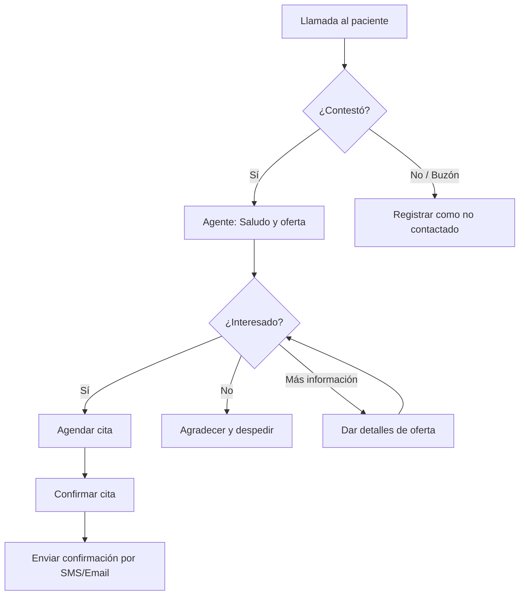

import { Callout } from 'nextra/components'
import { Steps, Step } from 'nextra/components'
import { Tabs, Tab } from 'nextra/components'
import { Columns, Card } from 'nextra/components'
import { Expandable, ExpandableGroup } from 'nextra/components'
import { CodeGroup } from 'nextra/components'

<Callout kind="info" emoji="📞">
Las campañas de llamadas salientes te permiten automatizar la comunicación con tus clientes a gran escala. Ya sea para promocionar ofertas, enviar recordatorios de citas o realizar encuestas de satisfacción, los agentes de voz de E-SMART360 pueden hacer las llamadas por ti de forma inteligente y personalizada.
</Callout>

## ¿Qué son las Campañas de Llamadas Salientes?

Una campaña de llamadas salientes es una estrategia automatizada en la que tu agente de voz realiza llamadas a una lista de contactos predefinida. Cada llamada sigue el prompt y workflow configurados para tu agente, adaptando la conversación según las respuestas de cada cliente.

<Columns cols="2">
<Card title="📢 Ofertas y Promociones" icon="🎯">
Comunica descuentos por tiempo limitado, nuevos servicios o promociones estacionales a tus clientes de forma masiva y personalizada.
</Card>
<Card title="📅 Recordatorios de Citas" icon="⏰">
Reduce las inasistencias llamando automáticamente a tus pacientes o clientes un día antes de su cita para confirmar su asistencia.
</Card>
<Card title="📊 Encuestas de Satisfacción" icon="📋">
Realiza llamadas post-servicio para recopilar feedback de tus clientes y mejorar la calidad de tu atención.
</Card>
<Card title="🔄 Reactivación de Clientes" icon="🔄">
Vuelve a conectar con clientes inactivos ofreciéndoles promociones especiales o informándoles sobre novedades de tu negocio.
</Card>
</Columns>

## Requisitos Previos

Antes de crear tu primera campaña, asegúrate de tener:

-   Una cuenta activa en E-SMART360 con créditos disponibles
-   Al menos un agente de voz configurado
-   Una lista de contactos subida al sistema (formato CSV)
-   Un prompt y workflow definidos para tu agente

## Guía Paso a Paso

<Steps>
<Step title="Inicia Sesión en tu Cuenta de E-SMART360" icon="🔑">
Usa tus credenciales para iniciar sesión en el portal de E-SMART360. Una vez dentro, accederás al panel principal donde podrás gestionar todas las funcionalidades de la plataforma.
</Step>

<Step title="Navega a la Pestaña de Campañas" icon="📊">
En la barra lateral izquierda, haz clic en **"Campaigns"** (Campañas). Esto abrirá el Panel de Campañas, donde se listan todas las campañas actuales y pasadas.

Aquí podrás ver:
-   **Active:** Campañas que están actualmente en ejecución
-   **Drafts:** Campañas guardadas pero no lanzadas
-   **Completed:** Campañas que ya han finalizado
</Step>

<Step title="Crea una Nueva Campaña" icon="➕">
En el centro de la pantalla, haz clic en el botón **"Create Campaign"** (Crear Campaña). Aparecerá un formulario emergente donde definirás los detalles de tu campaña.

<Callout kind="tip" emoji="💡">
Antes de crear la campaña, ten claros tu objetivo, el público objetivo y el agente que utilizarás. Una campaña bien planificada tiene muchas más probabilidades de éxito.
</Callout>
</Step>

<Step title="Completa los Detalles de la Campaña" icon="📝">
Para este ejemplo, supongamos que estás lanzando una campaña de oferta dental de Acción de Gracias (15–25% de descuento en citas dentales).

Completa los siguientes campos:

| Campo | Descripción | Ejemplo |
|-------|-------------|---------|
| **Campaign Name** | Nombre identificativo | "Thanksgiving Dental Promo" |
| **Purpose of Campaign** | Propósito de la campaña | "Promover descuento por tiempo limitado en servicios dentales" |
| **Contact group** | Lista de contactos a targetizar | Seleccionar grupo de contactos previamente cargado |
| **Select Agent** | Agente de voz a utilizar | Agente Dental IA |
| **Schedule Date & Time** | Fecha y hora de inicio | 2025-11-20 09:00 |
| **Timezone** | Zona horaria | America/New_York |

<Callout kind="warning" emoji="⚠️">
**IMPORTANTE — Zona Horaria:** Para asegurarte de que tu agente llame a la hora correcta, elige la zona horaria del país donde están tus clientes, no la tuya. Por ejemplo, si tu campaña se dirige a clientes en Reino Unido pero la configuras desde Estados Unidos, selecciona la zona horaria del Reino Unido para que las llamadas se realicen durante el horario laboral británico.
</Callout>
</Step>

<Step title="Guarda y Lanza la Campaña" icon="🚀">
Después de completar todos los campos, haz clic en **"Save"** (Guardar). Tu campaña quedará programada y lista para ejecutarse en la fecha y hora seleccionadas.

<Callout kind="success" emoji="✅">
Una vez guardada, la campaña se ejecutará automáticamente según lo programado. No necesitas supervisión constante, aunque te recomendamos monitorear los primeros resultados.
</Callout>
</Step>

<Step title="Monitorea y Crea Campañas Adicionales" icon="📈">
Después de guardar, accederás a la página de análisis de la campaña, donde podrás ver todos los detalles relacionados:

-   **Total Calls:** Número total de llamadas realizadas
-   **Connected Calls:** Llamadas que fueron respondidas
-   **Avg Call Time:** Duración promedio de las llamadas
-   **Max Engagement Time Slot:** Horario con mayor participación
-   **Lead Calls:** Llamadas que resultaron en leads calificados

Desde este mismo panel puedes crear campañas adicionales para futuras ejecuciones, facilitando la gestión de alcances recurrentes o estacionales.

</Step>
</Steps>

## Estrategias para una Campaña Exitosa

### 1. Segmentación de Contactos

No todos los clientes son iguales. Segmenta tu lista de contactos según:

-   **Historial de compras:** Clientes frecuentes vs. ocasionales
-   **Ubicación geográfica:** Campañas localizadas por región
-   **Intereses previos:** Basados en interacciones anteriores
-   **Estado del cliente:** Activos, inactivos, nuevos

### 2. Personalización del Mensaje

Un mensaje genérico tiene baja efectividad. Personaliza el prompt de tu agente para que:

-   Mencione el nombre del cliente
-   Haga referencia a compras o visitas anteriores
-   Adapte la oferta según el perfil del cliente
-   Use el tono adecuado para cada segmento

### 3. Timing Óptimo

El momento de la llamada es crucial para el éxito:

| Tipo de Campaña | Mejor Horario | Días Recomendados |
|-----------------|---------------|-------------------|
| Ofertas y promociones | 10:00 - 12:00 / 15:00 - 17:00 | Martes a Jueves |
| Recordatorios de citas | 09:00 - 11:00 | 1-2 días antes de la cita |
| Encuestas post-servicio | 11:00 - 14:00 | 24-48h después del servicio |
| Reactivación | 16:00 - 18:00 | Miércoles a Viernes |

### 4. Prueba A/B

Realiza pruebas A/B para optimizar tus campañas:

-   **Variante A:** Mensaje directo y conciso
-   **Variante B:** Mensaje más detallado y emocional

Compara las tasas de conversión de cada variante y ajusta tu estrategia según los resultados.

### 5. Monitoreo Continuo

No configures y olvides. Revisa periódicamente:

-   Tasa de respuesta (calls answered / calls attempted)
-   Duración promedio de llamada
-   Tasa de conversión (leads generados / calls connected)
-   Horarios con mejor rendimiento

<Callout kind="tip" emoji="🎯">
**Consejo profesional:** Asegúrate siempre de que el agente seleccionado esté alineado con el propósito de la campaña. Esto mantiene el tono de voz, el guión y la relevancia del público consistentes.
</Callout>

## Ejemplo Práctico: Campaña Dental de Acción de Gracias

### Configuración del Agente

**Nombre del Agente:** Dental Assistant Pro

**Prompt del agente:**
```
Eres un asistente dental amable y profesional. Llama a los pacientes para informarles sobre una promoción especial de Acción de Gracias: 15-25% de descuento en todos los servicios dentales.

Saludo: "Hola [NOMBRE], soy [AGENTE] de [CLÍNICA DENTAL]. Te llamamos para compartir una oferta especial que tenemos para ti."

Objetivos:
1. Informar sobre la promoción
2. Preguntar si están interesados en agendar una cita
3. Si aceptan: buscar disponibilidad y agendar
4. Si no están interesados: agradecer y despedirse cordialmente
5. Si piden más información: proporcionar detalles de la oferta
```

### Flujo de Conversación Esperado



### Dashboard de Monitoreo

Después de lanzar la campaña, el panel te mostrará:

```
Campaña: Thanksgiving Dental Promo
Estado: Active
Total de contactos: 1,500
Llamadas realizadas: 1,200 (80%)
Llamadas respondidas: 780 (65%)
Duración promedio: 2:45 min
Citas agendadas: 234 (30% de conversión)
Mejor horario: 10:30 - 11:30 AM
```

## Casos de Uso por Industria

### Clínicas y Consultorios
- Recordatorio de citas médicas 24h antes
- Promoción de chequeos preventivos
- Seguimiento post-consulta

### Bienes Raíces
- Notificación de nuevas propiedades
- Seguimiento de leads después de una visita
- Invitación a open houses

### Comercio Electrónico
- Ofertas personalizadas basadas en historial
- Recordatorio de carritos abandonados
- Encuestas de satisfacción post-compra

### Servicios para el Hogar
- Recordatorio de citas de mantenimiento
- Promoción de servicios estacionales
- Seguimiento post-servicio

## Preguntas Frecuentes

<ExpandableGroup>
<Expandable title="¿Puedo pausar o detener una campaña después de lanzarla?" default-open="true">
Sí, puedes pausar o detener cualquier campaña activa en cualquier momento desde el Panel de Campañas. Las llamadas en curso se completarán, pero no se iniciarán nuevas llamadas. Esta funcionalidad es útil si necesitas ajustar el mensaje o si detectas algún problema.
</Expandable>
<Expandable title="¿Cuántas llamadas puede realizar mi agente por hora?">
La velocidad de las llamadas depende de tu plan y la configuración de tu agente. En general, los agentes de E-SMART360 pueden realizar entre 30 y 60 llamadas por hora, dependiendo de la duración promedio de cada conversación. Para campañas masivas, recomiendamos programar las llamadas en bloques horarios para una distribución óptima.
</Expandable>
<Expandable title="¿Qué sucede si un cliente pide no ser contactado nuevamente?">
El agente está configurado para respetar las solicitudes de no contacto. Si un cliente lo solicita, el agente lo registrará automáticamente y ese contacto será excluido de futuras campañas. También puedes gestionar listas de exclusión manualmente desde el panel de administración.
</Expandable>
<Expandable title="¿Puedo programar campañas recurrentes?">
Sí, puedes crear campañas recurrentes para acciones periódicas como recordatorios semanales de citas, promociones mensuales o seguimientos trimestrales. Al crear la campaña, selecciona la opción de repetición y define la frecuencia deseada.
</Expandable>
<Expandable title="¿Necesitas ayuda para lanzar tu primera campaña saliente?">
<Callout kind="info" emoji="🆘">
Si tienes dudas sobre cómo configurar tu campaña de llamadas salientes o necesitas ayuda para segmentar tu lista de contactos, nuestro equipo de soporte está disponible. Escríbenos a **team@e-smart360.com** y te ayudaremos a diseñar la campaña perfecta para tu negocio.
</Callout>
</Expandable>
</ExpandableGroup>
