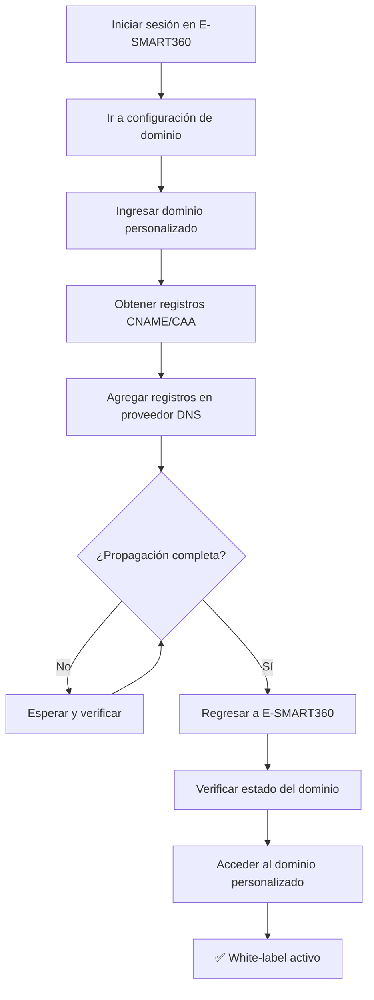

<Callout kind="info" emoji="🔧">
Al configurar un dominio personalizado en tu portal de agencia E-SMART360, obtienes white-labeling completo de la plataforma, ofreciendo a tus clientes y equipo una experiencia profesional y con tu propia marca. Este proceso abarca pasos tanto dentro de tu cuenta de E-SMART360 como en el panel de tu proveedor de dominio externo.
</Callout>

## Introducción

Configurar un dominio personalizado para tu aplicación de agencia E-SMART360 te permite realizar white-labeling completo de la plataforma, brindando a tus clientes y equipo una experiencia profesional y alineada con tu marca. El proceso involucra configuraciones tanto en E-SMART360 como en tu proveedor de dominio externo (GoDaddy, Namecheap, Cloudflare, etc.).

<Callout kind="tip" emoji="🎥">
**¿Prefieres una guía visual?** Mira el video tutorial completo: [How to Set Up a Custom Domain for Your E-SMART360 Agency](https://www.youtube.com/watch?v=QYaeJr7btTI) en nuestro canal de YouTube.
</Callout>

## Paso 1: Iniciar la Configuración del Dominio en E-SMART360

Primero, debes indicarle a E-SMART360 qué dominio personalizado deseas utilizar.

1. Inicia sesión en tu cuenta de agencia de E-SMART360.
2. Ve a la sección de configuración de dominio (busca el botón **Setup Domain**).
3. Ingresa tu dominio personalizado deseado (por ejemplo, `app.tuagencia.com` o `portal.tuagencia.com`).

<Callout kind="tip" emoji="💡">
**Mejor práctica:** Se recomienda usar un subdominio (como `app.tuagencia.com`) en lugar del dominio raíz (`tuagencia.com`), ya que el dominio raíz puede entrar en conflicto con otros registros DNS existentes.
</Callout>

4. Haz clic en **Submit** (o el botón de guardar correspondiente).
5. E-SMART360 mostrará los registros DNS requeridos (registros CNAME) que debes agregar en tu proveedor de dominio. **Mantén esta página abierta** — necesitarás copiar estos registros exactamente como se muestran.

### Paso 1.1: Configurar Registro CAA

Si tu dominio tiene registros CAA existentes, es posible que necesites agregar los registros CAA faltantes antes de que podamos desplegar la aplicación. La siguiente pantalla mostrará los registros CAA faltantes que debes agregar en tu proveedor de dominio.

<Callout kind="warning" emoji="⚠️">
Los registros CAA (Certification Authority Authorization) son importantes para la seguridad SSL/TLS. Si tu dominio ya tiene registros CAA, asegúrate de incluir también la autoridad certificadora que utiliza E-SMART360.
</Callout>

Una vez agregados los registros CAA, puede tomar entre 3 y 8 minutos para que los cambios se propaguen. Después de ese tiempo, puedes continuar con el siguiente paso.

## Paso 2: Configurar Registros CNAME en tu Proveedor de Dominio

A continuación, debes iniciar sesión en el sitio web donde compraste tu dominio (GoDaddy, Namecheap, Cloudflare, etc.) para modificar la configuración de tu Sistema de Nombres de Dominio (DNS).

1. Inicia sesión en tu cuenta del registrador/proveedor de dominio.
2. Ve a la sección **DNS Management** o **Advanced DNS Settings** para el dominio que estás utilizando.
3. Crea los registros CNAME según lo proporcionado por la página de configuración de E-SMART360. Generalmente son cuatro registros CNAME.

### Acción para Cada Registro CNAME

<ParamField path="Type" type="string" required>
  El tipo de registro DNS. Selecciona **CNAME** (Canonical Name).
</ParamField>

<ParamField path="Host/Name" type="string" required>
  El nombre o valor de host proporcionado por E-SMART360 (ej: `app`). Copia el **Valor de Host** exactamente desde E-SMART360.
</ParamField>

<ParamField path="Value/Target" type="string" required>
  La URL de destino a la que apunta el host (ej: `cname.esmart360.com`). Copia la **URL de Datos** exactamente desde E-SMART360.
</ParamField>

<ParamField path="TTL" type="number" default="3600">
  Time to Live — tiempo que los servidores almacenan en caché el registro. Usa el valor por defecto o elige un TTL corto (ej: 30 minutos o 1 hora = 3600 segundos).
</ParamField>

### Ejemplo Visual de Registros CNAME

A continuación se muestra un ejemplo representativo de cómo se verían los registros CNAME en tu panel DNS:

<Tabs>
  <Tab title="GoDaddy">
    ```
    Tipo: CNAME
    Host: app
    Apunta a: cname.esmart360.com
    TTL: 1 hora
    ```
  </Tab>
  <Tab title="Cloudflare">
    ```
    Tipo: CNAME
    Nombre: app
    Destino: cname.esmart360.com
    Proxy status: DNS only
    TTL: Auto
    ```
  </Tab>
  <Tab title="Namecheap">
    ```
    Type: CNAME Record
    Host: app
    Value: cname.esmart360.com
    TTL: 30 min
    ```
  </Tab>
</Tabs>

Repite este proceso hasta que todos los registros CNAME requeridos (generalmente cuatro) desde E-SMART360 estén ingresados y guardados en la configuración DNS de tu proveedor de dominio. **Guarda todos los cambios** en el administrador DNS de tu proveedor de dominio.

<Callout kind="success" emoji="✅">
**Dato importante:** La propagación de DNS puede tomar desde unos minutos hasta 48 horas en casos excepcionales. No te preocupes si no ves los cambios de inmediato. Puedes usar herramientas como `whatsmydns.net` para verificar el estado de propagación global.
</Callout>

## Paso 3: Verificar la Conexión en E-SMART360

Después de agregar los registros DNS, debes esperar a que los cambios se propaguen a través de internet.

1. Regresa a la página de configuración de dominio de E-SMART360 (del Paso 1).
2. El estado de tu dominio aparecerá inicialmente como **verificando** o en estado de verificación.
3. Espera unos minutos (o más, dependiendo de la propagación) y **refresca la página**.
4. Una vez que los registros se hayan propagado y apunten correctamente a la plataforma E-SMART360, el estado cambiará a **Verified** o **Live**.

<Steps>
  <Step emoji="🔄" title="Estado inicial: Verificando">
    Después de agregar los registros CNAME, el dominio aparecerá en estado de verificación. Esto es normal y esperado.
  </Step>
  <Step emoji="⏳" title="Esperar propagación">
    El tiempo de propagación varía. Puede ser desde 3 minutos hasta 48 horas. Utiliza herramientas de verificación DNS para monitorear el progreso.
  </Step>
  <Step emoji="✅" title="Estado final: Verificado/En Vivo">
    Una vez que los registros CNAME apunten correctamente a E-SMART360, el estado cambiará a "Verified" o "Live".
  </Step>
</Steps>

## Paso 4: Acceder a tu Aplicación en el Dominio Personalizado

Una vez completada la verificación, tu aplicación de agencia E-SMART360 será accesible en tu nuevo dominio personalizado.

1. Abre tu navegador web y navega a tu dominio personalizado (ej: `app.tuagencia.com`).
2. La página debería cargar la pantalla de inicio de sesión white-label con tu propia marca.
3. Podrás iniciar sesión como usuario de la agencia y operar la aplicación completamente desde tu dominio personalizado.

<Callout kind="success" emoji="🎉">
**¡Felicidades!** Tu aplicación de agencia E-SMART360 ahora está completamente white-labelizada y accesible a través de tu dominio personalizado. Tus clientes verán únicamente tu marca, lo que fortalece la identidad de tu negocio.
</Callout>

## Consideraciones Adicionales

### Verificación de Propagación DNS

Puedes verificar el estado de propagación de tus registros DNS utilizando herramientas en línea como:

- **whatsmydns.net** — Verificación global de propagación DNS
- **dnschecker.org** — Comprobación de registros desde múltiples ubicaciones
- **dig** (terminal) — `dig CNAME app.tudominio.com` para verificar localmente

### Solución de Problemas Comunes

<Tabs>
  <Tab title="El dominio no se verifica">
    <Callout kind="warning" emoji="🔍">
      **Causas posibles:**
      - Los registros CNAME no se copiaron exactamente
      - La propagación DNS aún no ha terminado (espera más tiempo)
      - Existen registros DNS conflictivos (A, AAAA, NS)
      - Los registros CAA faltantes están bloqueando el despliegue
    </Callout>
  </Tab>
  <Tab title="Error de certificado SSL">
    <Callout kind="warning" emoji="🔒">
      **Causas posibles:**
      - El registro CNAME no apunta correctamente
      - El certificado SSL aún se está aprovisionando (puede tomar hasta 15 minutos después de la verificación)
      - Hay un firewall o proxy que interfiere
    </Callout>
  </Tab>
  <Tab title="La página no carga">
    <Callout kind="warning" emoji="🌐">
      **Causas posibles:**
      - El subdominio no se configuró correctamente
      - El navegador tiene caché DNS antiguo (limpiar caché o usar modo incógnito)
      - El dominio fue recién registrado y aún no está completamente activo
    </Callout>
  </Tab>
</Tabs>

### Requisitos del Dominio

<Columns cols="2">
  <Card title="✅ Requisito" icon="check-circle">
    Subdominio (recomendado): `app.tuagencia.com`, `portal.tuagencia.com`, `admin.tuagencia.com`
  </Card>
  <Card title="⚠️ No recomendado" icon="x-circle">
    Dominio raíz: `tuagencia.com` (puede conflictuar con otros registros DNS existentes)
  </Card>
</Columns>

### Diagrama del Flujo de Configuración



<ExpandableGroup>
  <Expandable title="¿Cuánto tiempo tarda la propagación DNS?" defaultOpen="true">
    La propagación DNS puede tomar desde **3 minutos hasta 48 horas**, aunque generalmente se completa en menos de 1 hora. El tiempo depende del proveedor de dominio y del valor TTL configurado. Un TTL más bajo (30 minutos) acelera la propagación. Puedes verificar el estado usando herramientas como `whatsmydns.net`.
  </Expandable>

  <Expandable title="¿Puedo usar un dominio raíz (sin subdominio)?">
    Técnicamente es posible, pero **no es recomendado**. Usar el dominio raíz puede crear conflictos con otros registros DNS existentes (registros A, MX, NS). La práctica recomendada es usar un subdominio como `app.tuagencia.com` o `portal.tuagencia.com`.
  </Expandable>

  <Expandable title="¿Qué hago si los registros CAA están bloqueando mi configuración?">
    Si tu dominio ya tiene registros CAA, debes agregar la autoridad certificadora que utiliza E-SMART360. La interfaz de configuración te mostrará exactamente qué registros CAA faltan. Agrégualos en tu proveedor de dominio y espera 3-8 minutos antes de continuar.
  </Expandable>

  <Expandable title="¿Puedo cambiar el dominio personalizado después de configurarlo?">
    Sí, puedes cambiar el dominio personalizado en cualquier momento desde la configuración de tu agencia E-SMART360. Solo debes repetir el proceso: agregar los nuevos registros CNAME en tu proveedor de dominio y eliminar los anteriores para evitar conflictos.
  </Expandable>

  <Expandable title="¿Necesitas ayuda con la configuración de tu dominio personalizado?" defaultOpen="false">
    <Callout kind="info" emoji="🆘">
      Si encuentras dificultades durante el proceso, nuestro equipo de soporte está listo para ayudarte. Escríbenos a través del chat de ayuda en tu panel de E-SMART360 o consulta nuestra sección de soporte técnico para asistencia personalizada.
    </Callout>
  </Expandable>
</ExpandableGroup>
