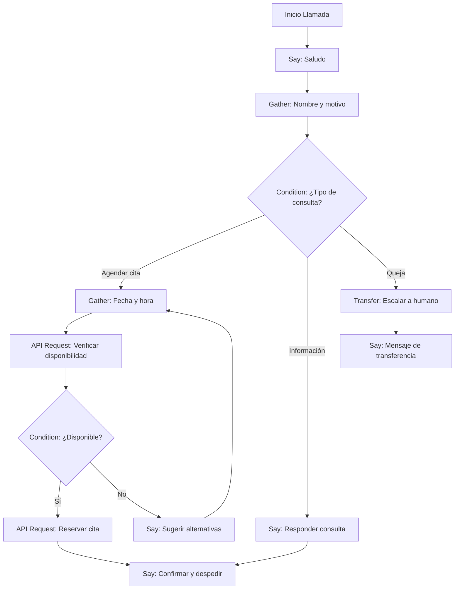

import { Callout } from 'nextra/components'
import { Steps, Step } from 'nextra/components'
import { Tabs, Tab } from 'nextra/components'
import { Columns, Card } from 'nextra/components'
import { Expandable, ExpandableGroup } from 'nextra/components'
import { CodeGroup } from 'nextra/components'

<Callout kind="info" emoji="⚡">
Los Workflows (flujos de trabajo) te permiten personalizar cómo tu agente de voz maneja las conversaciones: desde lo que dice hasta cómo recopila datos, enruta llamadas o interactúa con herramientas externas. Con los workflows, tienes el control total sobre la experiencia de cada llamada.
</Callout>

## ¿Qué es un Workflow Personalizado?

Un workflow es una secuencia de pasos que define el comportamiento de tu agente de voz durante una llamada. Cada paso es un bloque de acción que el agente ejecuta en orden, permitiéndote crear conversaciones dinámicas y adaptativas.

<Columns cols="2">
<Card title="🤖 Conversaciones Estructuradas" icon="📋">
Diseña el flujo exacto que seguirá tu agente: saludo, recopilación de información, toma de decisiones y cierre.
</Card>
<Card title="🔗 Integraciones Inteligentes" icon="🔌">
Conecta tu agente con CRMs, calendarios y otras herramientas mediante llamadas API en momentos específicos de la conversación.
</Card>
</Columns>

<Callout kind="tip" emoji="💡">
Puedes combinar y mezclar bloques para crear conversaciones inteligentes y dinámicas. Empieza simple, pruébalo en vivo, y luego añade lógica, captura de datos e integraciones para hacer tu agente más poderoso.
</Callout>

## Guía Paso a Paso

<Steps>
<Step title="Ve a la Sección de Workflows" icon="🔧">
- Inicia sesión en tu panel de control de E-SMART360
- En el panel izquierdo, desplázate hasta ver **Workflows** y haz clic en él
- Haz clic en el botón **"Create Workflow"** (Crear Workflow) en el centro de la pantalla

Esta sección es el centro de control donde podrás ver todos tus workflows existentes y crear nuevos.
</Step>

<Step title="Comienza a Construir tu Workflow" icon="🏗️">
Verás un nodo **Start** (Inicio) en la pantalla. Este es el punto de partida de tu flujo de trabajo.

Haz clic en el signo **+** (más) debajo de Start para comenzar a añadir pasos. Cada nuevo bloque se conecta al anterior, formando una secuencia lógica.

Puedes organizar los bloques de forma lineal o crear ramificaciones usando el bloque Condition.
</Step>

<Step title="Elige las Acciones del Workflow" icon="🎯">
Aparecerá un menú con los siguientes bloques de acción disponibles:

| Bloque | Función | Cuándo Usarlo |
|--------|---------|---------------|
| **Say** | El agente dice algo | Saludos, despedidas, confirmaciones |
| **Gather** | Pregunta y captura respuestas | Recopilar nombre, email, motivo |
| **Condition** | Lógica de ramificación | Sí/No, opciones múltiples |
| **API Request** | Llamada a API externa | Conectar con CRM, calendario |
| **Transfer Call** | Transferir a humano | Escalar llamadas complejas |

Cada bloque tiene su propio editor donde puedes configurar los detalles específicos.
</Step>
</Steps>

## Ejemplos Detallados de Cada Bloque

<Tabs>
<Tab title="Say — El Agente Habla">
El bloque **Say** permite que el agente diga un mensaje específico en ese punto de la llamada.

**Cómo usarlo:**
1. Haz clic en **Say** del menú
2. Haz clic en **Edit** (Editar)
3. Ingresa el mensaje o prompt que quieres que el agente diga

**Ejemplo de saludo:**
```
¡Hola! Gracias por llamar a [Nombre de tu Empresa]. Soy [Nombre del Agente], tu asistente virtual. ¿En qué puedo ayudarte hoy?
```

**Ejemplo de confirmación:**
```
Perfecto, he agendado tu cita para el [FECHA] a las [HORA]. Recibirás un mensaje de confirmación. ¿Hay algo más en lo que pueda ayudarte?
```

**Ejemplo de despedida:**
```
Ha sido un placer ayudarte. ¡Que tengas un excelente día! Si necesitas algo más, no dudes en llamarnos.
```

<Callout kind="tip" emoji="🗣️">
Personaliza los mensajes con el tono de voz de tu marca. Un tono amigable y profesional genera más confianza en tus clientes.
</Callout>
</Tab>
<Tab title="Gather — Recopilar Información">
El bloque **Gather** se usa cuando quieres preguntar al cliente información específica (nombre, email, tipo de servicio, etc.).

**Cómo usarlo:**
1. Haz clic en **Gather** del menú
2. Ingresa tu(s) pregunta(s)
3. La IA recopilará las respuestas durante la llamada

**Ejemplos de recopilación:**
```
Pregunta: "¿Podrías decirme tu nombre completo?"
Campo a capturar: nombre_completo
---
Pregunta: "¿Cuál es tu correo electrónico para enviarte la confirmación?"
Campo a capturar: email
---
Pregunta: "¿Qué tipo de servicio estás buscando?"
Campo a capturar: tipo_servicio
Opciones: Reparación, Mantenimiento, Consulta
```

<Callout kind="info" emoji="📝">
Los datos recopilados con Gather pueden usarse en bloques posteriores del workflow, como en una llamada API o una condición.
</Callout>
</Tab>
<Tab title="Condition — Lógica de Decisión">
El bloque **Condition** te permite crear ramificaciones basadas en las respuestas del usuario. Es el bloque más poderoso para crear conversaciones adaptativas.

**Ejemplo 1: Decisión Sí/No**
```
Si el usuario dice "Sí" → Ruta al bloque de Confirmación
Si el usuario dice "No" → Ruta al bloque de Seguimiento
```

**Ejemplo 2: Selección de servicio**
```
Si el usuario elige "Reparación" → Ruta al bloque de detalles del problema
Si el usuario elige "Mantenimiento" → Ruta al bloque de programación de cita
Si el usuario elige "Consulta" → Ruta al bloque de información general
```

**Ejemplo 3: Calificación de lead**
```
Si el usuario está "Interesado" y presupuesto > $500 → Ruta a Transferir a Ventas
Si el usuario está "Solo informándose" → Ruta a Enviar catálogo por email
```

<Callout kind="success" emoji="🎯">
Las condiciones son el corazón de un workflow inteligente. Úsalas para crear rutas personalizadas según las necesidades de cada cliente.
</Callout>
</Tab>
<Tab title="API Request — Integración">
El bloque **API Request** permite que tu workflow interactúe con herramientas externas como CRMs, sistemas de reserva o calendarios.

**Cómo configurarlo:**
1. Selecciona el método HTTP (GET, POST, PUT, DELETE)
2. Ingresa la URL del endpoint
3. Configura los encabezados y el cuerpo de la solicitud
4. Define cómo manejar la respuesta

**Ejemplo: Crear un lead en CRM**
```
Método: POST
URL: https://api.tucrm.com/contacts
Headers:
  Content-Type: application/json
  Authorization: Bearer TU_TOKEN
Body:
{
  "name": "{{nombre_completo}}",
  "email": "{{email}}",
  "phone": "{{telefono}}",
  "source": "Llamada E-SMART360",
  "notes": "Interesado en {{tipo_servicio}}"
}
```

**Ejemplo: Consultar disponibilidad en calendario**
```
Método: GET
URL: https://api.calendario.com/availability?date={{fecha_solicitada}}
Headers:
  Authorization: Bearer TU_TOKEN
```

<Callout kind="warning" emoji="🔒">
Asegúrate de que tus tokens de API estén almacenados de forma segura. Nunca expongas credenciales en las configuraciones del workflow.
</Callout>
</Tab>
<Tab title="Transfer Call — Escalar a Humano">
Cuando la llamada requiere asistencia humana, añade un bloque **Transfer Call** en cualquier etapa del workflow.

**Cómo configurarlo:**
1. Añade el bloque Transfer Call en el punto deseado
2. Ingresa el número de teléfono y código de país donde quieres enrutar la llamada
3. Opcionalmente, añade un mensaje de preaviso para el cliente

**Ejemplo:**
```
Mensaje de preaviso: "Déjame transferirte con uno de nuestros agentes especializados. Por favor, espera un momento..."
Número de transferencia: +52XXXXXXXXXX
```

**¿Cuándo transferir?**
- Cuando el cliente solicita hablar con un humano
- Cuando la consulta es demasiado compleja para el agente
- Cuando se requiere una autorización especial
- En situaciones de queja o reclamo escalado

<Callout kind="info" emoji="📞">
La transferencia a humano es una excelente estrategia de respaldo. Incluso los mejores agentes de IA necesitan apoyo humano en casos específicos.
</Callout>
</Tab>
</Tabs>

## Ejemplo Completo: Workflow de Atención al Cliente

A continuación, un ejemplo completo de cómo sería un workflow típico de atención al cliente:

### Flujo del Workflow



## Consejos Profesionales

<Columns cols="2">
<Card title="🌟 Empieza Simple" icon="🚀">
Comienza con workflows básicos de 3-4 bloques y ve añadiendo complejidad gradualmente. Es más fácil depurar un workflow simple que uno complejo.
</Card>
<Card title="🧪 Prueba en Vivo" icon="🔬">
Usa la función de vista previa para probar cada bloque antes de ponerlo en producción. Escucha las respuestas del agente y ajusta los mensajes según sea necesario.
</Card>
<Card title="📊 Analiza y Optimiza" icon="📈">
Revisa las grabaciones de las llamadas para identificar dónde los clientes se confunden o cuelgan. Ajusta tu workflow en consecuencia.
</Card>
<Card title="🔄 Workflows Anidados" icon="🔗">
Puedes crear workflows que llamen a otros workflows, permitiendo reutilizar lógica compleja en múltiples agentes.
</Card>
</Columns>

## Errores Comunes y Cómo Evitarlos

| Error | Consecuencia | Solución |
|-------|-------------|----------|
| Workflow demasiado largo | Clientes se aburren y cuelgan | Limita a 5-7 bloques máximo |
| Sin bloque de transferencia | Clientes frustrados sin salida | Siempre incluye opción de hablar con humano |
| Preguntas ambiguas en Gather | Datos incorrectos o incompletos | Sé específico en las preguntas |
| API sin manejo de errores | Workflow se rompe sin previo aviso | Añade bloques Condition después de API Request |
| Sin mensaje de cortesía | Experiencia robótica | Intercala mensajes naturales entre bloques |

## Preguntas Frecuentes

<ExpandableGroup>
<Expandable title="¿Puedo tener múltiples workflows para un mismo agente?" default-open="true">
Sí, puedes crear múltiples workflows y asignarlos a diferentes contextos dentro de un mismo agente. Por ejemplo, un workflow para manejo de citas, otro para soporte técnico y otro para ventas. El agente usará el workflow apropiado según el motivo de la llamada.
</Expandable>
<Expandable title="¿Los workflows pueden ejecutarse en paralelo?">
Los workflows se ejecutan de forma secuencial, pero puedes usar el bloque Condition para crear ramificaciones. Esto significa que puedes tener diferentes rutas dentro de un mismo workflow, pero cada llamada sigue una sola ruta a la vez.
</Expandable>
<Expandable title="¿Puedo editar un workflow mientras está en uso?">
Sí, puedes editar un workflow en cualquier momento. Los cambios se aplicarán a las nuevas llamadas que ingresen después de guardar los cambios. Las llamadas que ya están en progreso continuarán con la versión anterior del workflow hasta que finalicen.
</Expandable>
<Expandable title="¿Existe un límite en la cantidad de bloques por workflow?">
Recomendamos mantener los workflows entre 5 y 10 bloques para una experiencia óptima. Workflows más largos pueden resultar en conversaciones tediosas para los clientes. Si necesitas más pasos, considera dividir el flujo en múltiples workflows más pequeños.
</Expandable>
<Expandable title="¿Necesitas ayuda para diseñar tu workflow?">
<Callout kind="info" emoji="🆘">
Si necesitas asistencia para diseñar workflows complejos o integrarlos con tus herramientas existentes, nuestro equipo de soporte está listo para ayudarte. Escríbenos a **team@e-smart360.com** con una descripción de tu caso de uso y te guiaremos en el proceso.
</Callout>
</Expandable>
</ExpandableGroup>
