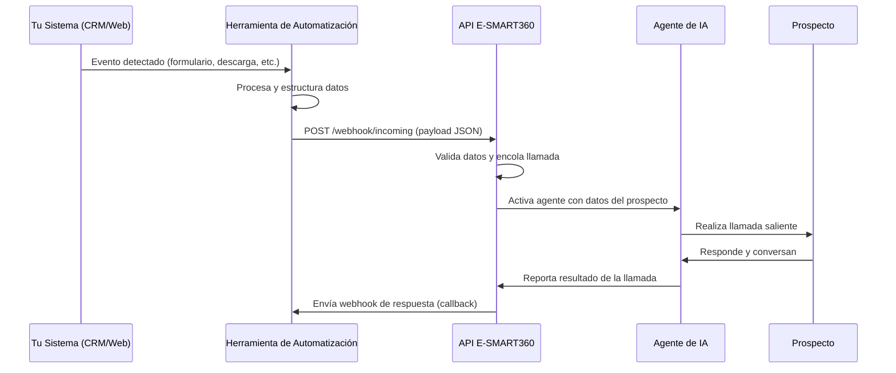

<Callout kind="info">
  Los webhooks son el puente que conecta tus herramientas de automatización (Make.com, Zapier, Pabbly, etc.) con los agentes de voz de E-SMART360. Te explicamos cómo funcionan de forma simple y directa.
</Callout>

## Flujo de Trabajo de un Webhook

El funcionamiento de los webhooks en E-SMART360 sigue un flujo secuencial de cinco pasos. Cada paso representa una etapa crítica en el ciclo de vida de una llamada automatizada.

### 1. Ocurre un Evento

Todo comienza cuando un contacto realiza una acción en tu sistema. Puede ser cualquiera de los siguientes eventos:

<Columns cols="2">
  <Card title="Formulario Completado" icon="file-text">
    Un prospecto llena un formulario de contacto, registro o descarga en tu sitio web.
  </Card>
  <Card title="Descarga de Contenido" icon="download">
    Un usuario descarga un ebook, whitepaper o cualquier recurso de tu página.
  </Card>
  <Card title="Compra o Transacción" icon="shopping-cart">
    Un cliente realiza una compra, solicita un presupuesto o agenda una cita.
  </Card>
  <Card title="Acción Personalizada" icon="settings">
    Cualquier otra acción definida por tu equipo dentro de tu CRM o sistema interno.
  </Card>
</Columns>

<Callout kind="tip" title="Identifica tus eventos">
  Elige cuidadosamente qué eventos activarán tu webhook. Los mejores resultados se obtienen cuando el evento indica una intención clara de compra o consulta por parte del prospecto.
</Callout>

### 2. La Herramienta de Automatización Procesa el Evento

Una vez que el evento ocurre, tu herramienta de automatización —ya sea Make.com, Zapier, Pabbly, n8n o cualquier otra— captura la información y la prepara para enviarla.

<CodeGroup tabs="Make.com, Zapier, Pabbly, n8n">
  ```json
  {
    "module": "Webhook",
    "capture": {
      "trigger": "Form submitted",
      "fields": ["name", "phone", "email", "product_interest"]
    }
  }
  ```
  ```json
  {
    "app": "Webhooks by Zapier",
    "trigger": "Catch Hook",
    "output": {
      "name": "{{name}}",
      "phone": "{{phone}}",
      "email": "{{email}}"
    }
  }
  ```
  ```json
  {
    "app": "Pabbly Connect",
    "trigger": "Webhook Response",
    "capture": "Raw data from form submission"
  }
  ```
  ```json
  {
    "node": "Webhook node",
    "method": "POST",
    "path": "/webhook/e-smart360/trigger"
  }
  ```
</CodeGroup>

### 3. El Webhook se Dispara

Tu automatización envía los datos al endpoint de webhook de E-SMART360 mediante una solicitud HTTP POST. Esta solicitud contiene la información del evento en formato JSON.

#### Endpoint del Webhook

<Request>
  POST https://api.e-smart360.com/webhook/incoming

  <ParamField body="phone" type="string" required>
    Número de teléfono del prospecto en formato E.164 (ej. +521234567890).
  </ParamField>
  <ParamField body="name" type="string" required>
    Nombre del contacto para personalizar la llamada.
  </ParamField>
  <ParamField body="agent_id" type="string" required>
    Identificador único del agente de voz que realizará la llamada.
  </ParamField>
  <ParamField body="variables" type="object" required>
    Variables adicionales que el agente utilizará durante la conversación.
  </ParamField>
</Request>

<Callout kind="warning" title="Importante">
  Asegúrate de que el payload JSON esté correctamente formateado. Un error de sintaxis puede hacer que el webhook falle y la llamada no se realice.
</Callout>

### 4. E-SMART360 Responde

E-SMART360 recibe los datos y activa al agente de IA correspondiente. El sistema verifica la información, valida el número telefónico y prepara la llamada saliente.

<Response>
  ```json
  {
    "status": "success",
    "call_id": "call_abc123def456",
    "message": "Llamada encolada exitosamente",
    "agent": "Agente de Ventas - Inmobiliaria",
    "estimated_wait": "< 5 segundos"
  }
  ```
</Response>

<Callout kind="success">
  El tiempo de respuesta típico es inferior a 2 segundos. La llamada se encola y se inicia casi de inmediato, siempre que el agente esté activo y el número sea válido.
</Callout>

### 5. La Llamada se Ejecuta

El prospecto recibe una llamada desde el número configurado de tu agente de IA. La conversación se desarrolla con el prompt y la personalidad que hayas definido.

#### Diagrama del Flujo Completo



## Componentes Clave del Sistema

### Eventos Entrantes

Los eventos pueden provenir de cualquier sistema que tenga capacidad de enviar solicitudes HTTP. Las fuentes más comunes incluyen:

| Fuente | Tipo de Evento | Ejemplo de Uso |
|--------|---------------|----------------|
| Formularios web (Typeform, Gravity Forms) | Nuevo lead | Lead calificado solicita información |
| Plataformas de email (Mailchimp, ActiveCampaign) | Apertura o clic | Suscriptor hace clic en oferta |
| CRM (HubSpot, Salesforce, Pipedrive) | Cambio de etapa | Deal pasa a "negociación" |
| E-commerce (Shopify, WooCommerce) | Carrito abandonado | Usuario deja productos sin comprar |
| Calendario (Cal.com, Google Calendar) | Cita agendada | Cliente agenda una demostración |

### Datos Enviados al Webhook

El payload debe incluir, como mínimo, el número telefónico del prospecto. Los campos adicionales enriquecen la conversación del agente.

<ParamField body="phone" type="string" required>
  Número telefónico en formato E.164. Este es el campo más crítico: sin un número válido, la llamada no puede realizarse.
</ParamField>
<ParamField body="name" type="string" required>
  Nombre del contacto. Se utiliza para personalizar el saludo inicial y las referencias durante la conversación.
</ParamField>
<ParamField body="agent_id" type="string" required>
  ID del agente de voz que ejecutará la llamada. Cada agente tiene un prompt, voz y comportamiento distintos.
</ParamField>
<ParamField body="variables" type="object" required>
  Objeto con variables personalizadas que el agente usará como contexto para la conversación.
</ParamField>

### Respuesta de E-SMART360

Una vez procesado el webhook, E-SMART360 devuelve una respuesta con el estado de la operación y un identificador único para seguimiento.

<Response>
  <ResponseField name="status" type="string" required>
    Indica si la operación fue exitosa. Valores posibles: `success` o `error`.
  </ResponseField>
  <ResponseField name="call_id" type="string" required>
    Identificador único de la llamada. Puedes usarlo para consultar el estado posteriormente.
  </ResponseField>
  <ResponseField name="message" type="string" required>
    Mensaje descriptivo del resultado de la operación.
  </ResponseField>
  <ResponseField name="agent" type="string">
    Nombre del agente de IA asignado a la llamada.
  </ResponseField>
  <ResponseField name="estimated_wait" type="string">
    Tiempo estimado de espera antes de que la llamada comience.
  </ResponseField>
</Response>

## Configuración del Webhook Paso a Paso

<Steps>
  <Step title="Identifica tu evento desencadenante">
    Determina qué acción del usuario iniciará el flujo. Puede ser la descarga de un recurso, el envío de un formulario, la compra de un producto o cualquier otra acción medible.
  </Step>
  <Step title="Configura tu herramienta de automatización">
    En Make.com, Zapier, Pabbly o tu herramienta preferida, crea un nuevo escenario que escuche el evento identificado.
  </Step>
  <Step title="Obtén tu URL de webhook">
    Copia la URL del webhook desde el panel de agentes de E-SMART360. Esta URL es única para cada agente y configuración.
  </Step>
  <Step title="Configura el payload">
    Asegúrate de que los datos enviados incluyan al menos `phone`, `name` y `agent_id` en el formato JSON correcto.
  </Step>
  <Step title="Prueba la integración">
    Activa manualmente el evento (por ejemplo, enviando un formulario de prueba) y verifica que la llamada se realice correctamente.
  </Step>
  <Step title="Monitorea los resultados">
    Revisa el panel de reportes de E-SMART360 para ver el estado de las llamadas generadas por el webhook.
  </Step>
</Steps>

## Buenas Prácticas

<Callout kind="tip" title="Recomendaciones clave">
  - **Valida los números telefónicos** antes de enviarlos al webhook para evitar fallos de marcación.
  - **Incluye contexto adicional** en las variables para que el agente tenga información valiosa desde el primer segundo de la llamada.
  - **Prueba con un número de prueba** antes de activar el flujo en producción.
  - **Monitorea los logs** de tu herramienta de automatización para detectar errores de conexión.
</Callout>

## Diferencias entre Webhooks y Llamadas Directas

<Tabs>
  <Tab title="Webhooks">
    - Activados por eventos externos
    - Flujo automatizado sin intervención manual
    - Se integran con herramientas como Make, Zapier o Pabbly
    - Ideales para campañas masivas y secuencias automatizadas
    - El payload define el contexto de la llamada
  </Tab>
  <Tab title="Llamadas Directas (API)">
    - Activadas por llamadas a la API REST
    - Control programático total
    - Mayor flexibilidad en la personalización
    - Ideales para integraciones con sistemas propietarios
    - Requieren desarrollo backend
  </Tab>
</Tabs>

## Preguntas Frecuentes

<ExpandableGroup>
  <Expandable title="¿Qué pasa si mi herramienta de automatización no puede conectarse a E-SMART360?" defaultOpen="true">
    Si tu herramienta de automatización no puede conectarse al endpoint de E-SMART360, verifica que la URL del webhook esté correcta y que no haya bloqueos de firewall. Algunas herramientas empresariales requieren que agregues la IP del servidor de E-SMART360 a una lista de permitidos. También puedes usar un servicio como webhook.site para hacer pruebas de conectividad.
  </Expandable>
  <Expandable title="¿Puedo enviar múltiples llamadas desde un solo webhook?">
    Sí. Si tu evento genera múltiples prospectos (por ejemplo, una carga masiva de contactos), puedes enviar un payload por cada prospecto o configurar tu automatización para que itere sobre la lista. E-SMART360 procesará cada solicitud de forma independiente. Te recomendamos espaciar las solicitudes con al menos 1 segundo de diferencia para evitar sobrecargar el sistema.
  </Expandable>
  <Expandable title="¿Qué formato debe tener el número de teléfono en el webhook?">
    El número debe estar en formato E.164, que incluye el código de país seguido del número sin espacios ni guiones. Por ejemplo: +521234567890 para México, +34911234567 para España, o +541123456789 para Argentina. Si envías un número en otro formato, el webhook lo rechazará con un error de validación.
  </Expandable>
  <Expandable title="¿Cuánto tiempo tarda en ejecutarse una llamada después del webhook?">
    En condiciones normales, la llamada comienza en menos de 5 segundos después de que E-SMART360 recibe el webhook. El tiempo puede variar según la disponibilidad del agente, la validación del número y la carga del sistema. Si la llamada no se inicia después de 30 segundos, te recomendamos verificar los logs de tu herramienta de automatización y el panel de agentes.
  </Expandable>
  <Expandable title="¿Necesitas ayuda con la configuración de webhooks?">
    <Callout kind="info" title="Contacta a soporte">
      Si tienes dudas sobre cómo configurar tus webhooks o encuentras errores en la integración, nuestro equipo de soporte técnico está disponible para ayudarte. Escríbenos a través del panel de ayuda en tu cuenta de E-SMART360 o consulta nuestra documentación de integración con Make.com y Zapier.
    </Callout>
  </Expandable>
</ExpandableGroup>
