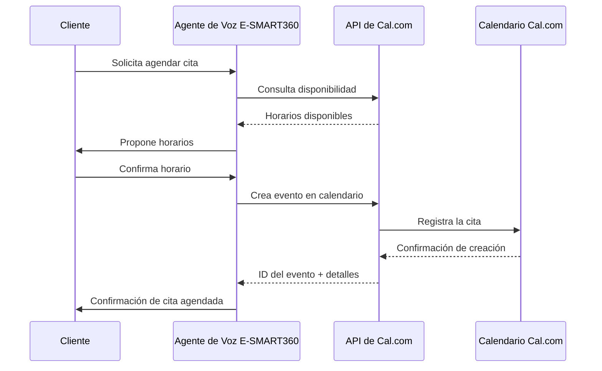

Sigue estos pasos para conectar tu calendario de Cal.com con tu agente de voz de E-SMART360 y habilitar la programación de citas en tiempo real.

## Paso 1: Obtén tu Clave API de Cal.com

1. Inicia sesión en tu cuenta de [Cal.com](https://cal.com/).
2. En el panel lateral izquierdo, desplázate hacia abajo y haz clic en **Settings**.
3. En el nuevo panel de control, mira nuevamente el panel izquierdo y haz clic en **Developers**.
4. Dentro de la sección Developer, haz clic en **API Keys**.
5. Haz clic en **Create API Key**, asígnale un nombre (por ejemplo, "Integración E-SMART360") y genera la clave.
6. Copia la clave API generada. La necesitarás para configurarla en E-SMART360.

<Callout kind="tip">
  **Guarda tu clave de forma segura.** La clave API de Cal.com solo se muestra una vez
  durante la creación. Si la pierdes, tendrás que generar una nueva desde el panel de
  Cal.com.
</Callout>

## Paso 2: Conecta Cal.com con E-SMART360

1. Inicia sesión en tu panel de control de [E-SMART360](https://e-smart360.com/).
2. Ve a la pestaña **Integraciones** en la navegación principal.
3. Busca **Cal.com** en la lista de integraciones y haz clic en ella.
4. Pega la clave API que copiaste desde Cal.com.
5. Haz clic en **Guardar Cambios**.

<Callout kind="info">
  Una vez guardada, tu cuenta de Cal.com queda vinculada con E-SMART360. Puedes
  verificar la conexión viendo si aparece un indicador verde de "Conectado" junto
  al nombre de la integración.
</Callout>

## Paso 3: Configura tu Agente con Cal.com

1. En E-SMART360, ve a la sección **Agentes** y selecciona el agente de voz que deseas conectar con Cal.com.
2. Haz clic en **Configuración Avanzada**.
3. Desplázate hasta la sección llamada **Integración y Actualización de Datos**.
4. Haz clic en el menú de **Cal.com**.
5. Completa los detalles de la reunión:

<ParamField body="preferredMeetingTimes" type="array" required>
  Horarios preferidos para las reuniones. Define los rangos de hora en los que
  tu agente puede agendar citas, por ejemplo: `["09:00-12:00", "14:00-18:00"]`.
</ParamField>

<ParamField body="timeZones" type="array" required>
  Zonas horarias aplicables. Especifica las zonas horarias que tu agente debe
  considerar, como `["America/Mexico_City", "America/New_York"]`.
</ParamField>

<ParamField body="customRules" type="object" required={false}>
  Reglas personalizadas de disponibilidad. Puedes definir reglas adicionales como
  duración mínima de la reunión, tiempo entre citas o días excluidos.
</ParamField>

### Ejemplo de Configuración

<CodeGroup>
```json Configuración típica
{
  "preferredMeetingTimes": [
    "09:00-13:00",
    "14:00-18:00"
  ],
  "timeZones": [
    "America/Mexico_City",
    "America/New_York"
  ],
  "customRules": {
    "minDurationMinutes": 15,
    "bufferBetweenMeetings": 10,
    "excludedDays": ["Saturday", "Sunday"]
  }
}
```

```yaml Formato alternativo
preferred_meeting_times:
  - "09:00-13:00"
  - "14:00-18:00"
time_zones:
  - "America/Mexico_City"
  - "America/New_York"
custom_rules:
  min_duration_minutes: 15
  buffer_between_meetings: 10
  excluded_days:
    - Saturday
    - Sunday
```
</CodeGroup>

Una vez configurado, tu agente de IA programará citas automáticamente a través de tu cuenta de Cal.com sin necesidad de coordinación humana.

## Flujo de Trabajo Completo

El siguiente diagrama muestra cómo fluye la información cuando un cliente programa una cita a través de tu agente de voz:



## Beneficios de la Integración

<Tabs>
  <Tab title="Ahorro de Tiempo">
    Elimina la coordinación manual de agendas. Tu agente de voz maneja todo el
    proceso de principio a fin, desde consultar disponibilidad hasta confirmar
    la cita con el cliente.
  </Tab>
  <Tab title="Disponibilidad 24/7">
    Los clientes pueden agendar citas en cualquier momento del día, incluso
    fuera del horario laboral. El agente de voz está disponible las 24 horas.
  </Tab>
  <Tab title="Reducción de Errores">
    Al automatizar la programación, se eliminan los errores de doble reserva
    y los conflictos de horario comunes en la coordinación manual.
  </Tab>
  <Tab title="Experiencia del Cliente">
    Tus clientes disfrutan de una experiencia fluida y profesional. El agente
    habla con lenguaje natural y confirma todos los detalles de la cita.
  </Tab>
</Tabs>

## Casos de Uso Comunes

<Columns cols="2">
  <Card title="Consultas Profesionales" icon="briefcase">
    Abogados, contadores y consultores pueden delegar la agenda de citas
    iniciales y seguimientos directamente a su agente de voz.
  </Card>
  <Card title="Servicios de Salud" icon="heart">
    Clínicas y consultorios médicos pueden programar citas de pacientes
    sin saturar las líneas telefónicas.
  </Card>
  <Card title="Bienes Raíces" icon="home">
    Agentes inmobiliarios pueden agendar visitas a propiedades de forma
    automática cuando los clientes llaman.
  </Card>
  <Card title="Servicios Técnicos" icon="wrench">
    Empresas de soporte técnico pueden agendar ventanas de servicio
    directamente desde la llamada del cliente.
  </Card>
</Columns>

<Callout kind="success">
  **Integración lista para producir.** Una vez realizada la configuración inicial,
  tu agente de voz comenzará a programar citas automáticamente. Te recomendamos
  hacer una llamada de prueba para verificar que todo funciona correctamente
  antes de ponerlo en producción.
</Callout>

## Preguntas Frecuentes

<ExpandableGroup>
  <Expandable title="¿Puedo conectar múltiples calendarios de Cal.com?" default-open="true">
    Sí, puedes configurar integraciones de Cal.com de forma independiente para
    cada agente de voz. Esto es útil si necesitas que diferentes agentes manejen
    calendarios distintos (por ejemplo, un agente para citas de ventas y otro
    para soporte técnico). Solo repite el proceso de configuración para cada
    agente, usando las claves API correspondientes.
  </Expandable>

  <Expandable title="¿Qué sucede si mi clave API de Cal.com expira?">
    Cal.com permite crear claves API con fecha de expiración. Si tu clave
    expira, el agente de voz dejará de poder programar citas. E-SMART360 te
    notificará cuando detecte una clave expirada. Para solucionarlo, genera
    una nueva clave en Cal.com y actualízala en la sección de Integraciones
    del panel de E-SMART360.
  </Expandable>

  <Expandable title="¿El agente puede reprogramar o cancelar citas existentes?">
    Sí, el agente de voz tiene capacidades completas de gestión de citas.
    Puede consultar disponibilidad, crear nuevas citas, reprogramar citas
    existentes y cancelar citas según las indicaciones del cliente durante
    la conversación. Todo se refleja automáticamente en tu calendario de
    Cal.com.
  </Expandable>

  <Expandable title="¿Se sincronizan los cambios hechos directamente en Cal.com?">
    Absolutamente. Cualquier cambio realizado directamente en tu calendario de
    Cal.com —ya sea una cita nueva, una modificación o una cancelación— se
    refleja inmediatamente en el agente de voz. La integración consulta la
    disponibilidad en tiempo real, por lo que nunca habrá reservas duplicadas
    ni conflictos.
  </Expandable>

  <Expandable title="¿Necesitas ayuda con la integración de Cal.com?">
    <Callout kind="info">
      Si encuentras algún problema durante la configuración o necesitas
      asistencia adicional, contacta a nuestro equipo de soporte en
      [soporte@e-smart360.com](mailto:soporte@e-smart360.com). Estamos
      para ayudarte a sacar el máximo provecho de tu agente de voz.
    </Callout>
  </Expandable>
</ExpandableGroup>
