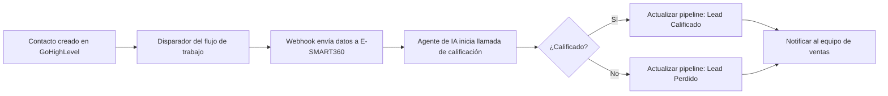

<Callout kind="info">
  Esta guía te proporciona instrucciones detalladas con referencias visuales para integrar GoHighLevel con E-SMART360. Al finalizar, tendrás un sistema totalmente automatizado de calificación de leads que realiza llamadas de IA y actualiza tu pipeline según los resultados de cada conversación.
</Callout>

## Descripción General

La integración entre GoHighLevel y E-SMART360 permite crear un sistema automatizado de calificación de leads donde los agentes de voz con inteligencia artificial realizan llamadas de calificación entrantes y actualizan automáticamente el pipeline de ventas según los resultados de cada conversación. Esto elimina el trabajo manual de calificación, reduce los tiempos de respuesta y permite que tu equipo de ventas se enfoque únicamente en los leads más calificados.

<Callout kind="success" title="Beneficios clave">
  - **Automatización total**: desde la creación del contacto hasta la actualización del pipeline
  - **Calificación consistente**: todos los leads pasan por el mismo proceso de evaluación
  - **Ahorro de tiempo**: elimina llamadas manuales de calificación
  - **Actualización en tiempo real**: el pipeline se actualiza automáticamente tras cada llamada
</Callout>

## Requisitos Previos

Antes de comenzar el proceso de integración, asegúrate de contar con lo siguiente:

<Callout kind="warning" title="Requisitos necesarios">
  - Una cuenta activa en GoHighLevel con acceso a la sección de Oportunidades
  - Una cuenta activa en E-SMART360 con un número telefónico adquirido para las operaciones del agente
  - Credenciales de API de GoHighLevel (Location ID y API Key)
  - Acceso a la configuración de automatizaciones y webhooks en GoHighLevel
</Callout>

## Configuración del Pipeline en GoHighLevel

El primer paso consiste en crear un pipeline de ventas dedicado en GoHighLevel para rastrear tus leads y oportunidades durante todo el proceso de calificación.

### Paso 1: Crear un Nuevo Pipeline

<Steps>
  <Step title="Accede al panel de GoHighLevel">
    Inicia sesión en tu cuenta de GoHighLevel y navega a la sección **Oportunidades** en el menú lateral izquierdo.
  </Step>
  <Step title="Navega a la gestión de pipelines">
    Haz clic en la pestaña **Pipelines** en la parte superior de la página. Luego presiona el botón verde **Crear nuevo pipeline** en la esquina superior derecha.
  </Step>
  <Step title="Configura tu pipeline">
    En la ventana emergente "Agregar pipeline", ingresa un nombre descriptivo (por ejemplo, "Pipeline E-SMART360") y define las etapas de tu flujo de trabajo, como "Nuevo Lead". Haz clic en **Guardar** para crear el pipeline.
  </Step>
  <Step title="Verifica la creación">
    Confirma que tu nuevo pipeline aparezca en la lista de pipelines. El pipeline ya está listo para integrarse con el flujo de trabajo de E-SMART360.
  </Step>
</Steps>

<Callout kind="tip" title="Consejo">
  Puedes crear múltiples pipelines para diferentes tipos de leads o productos. Cada pipeline puede tener sus propias etapas personalizadas según tu proceso de ventas.
</Callout>

## Obtención de Credenciales de GoHighLevel

A continuación, necesitas localizar y almacenar de forma segura la información de autenticación clave de tu cuenta de GoHighLevel para habilitar la conexión con E-SMART360.

### Paso 2: Localizar tu Location ID y API Key

<Steps>
  <Step title="Accede a la configuración de la cuenta">
    Desde el panel de GoHighLevel, haz clic en **Configuración** en el menú principal y selecciona **Perfil de negocio** en la barra lateral izquierda.
  </Step>
  <Step title="Recolecta las credenciales requeridas">
    - **Location ID**: se encuentra en la parte superior de la página de Perfil de negocio. Este identificador único representa tu subcuenta de GoHighLevel.
    - **API Key**: se encuentra más abajo en la misma página. Es necesaria para conexiones con aplicaciones externas.
  </Step>
  <Step title="Almacena las credenciales de forma segura">
    Copia y guarda tanto el Location ID como la API Key en un lugar seguro. Estas credenciales serán necesarias durante la configuración de la integración en E-SMART360.
  </Step>
</Steps>

<Callout kind="danger" title="Seguridad de credenciales">
  Mantén estas credenciales confidenciales y úsalas únicamente para integraciones autorizadas. No las compartas por correo electrónico ni las almacenes en repositorios públicos de código.
</Callout>

## Conexión de E-SMART360 con GoHighLevel

Con las credenciales de GoHighLevel preparadas, puedes completar la integración conectando tu cuenta de E-SMART360.

### Paso 3: Completar la Configuración de Integración

<Steps>
  <Step title="Prepara tu cuenta de E-SMART360">
    Inicia sesión en tu cuenta de E-SMART360 y asegúrate de haber adquirido un número telefónico para las operaciones del agente.
  </Step>
  <Step title="Accede a la configuración de integraciones">
    Navega a la pestaña **Integraciones** en el menú lateral izquierdo. Localiza la opción de integración con GoHighLevel y haz clic en el botón de configuración correspondiente.
  </Step>
  <Step title="Ingresa los detalles de autenticación">
    En la ventana emergente titulada "Ingresa el token de API para conectar con GoHighLevel", introduce tu Location ID en el campo correspondiente y tu API Key en el campo designado. Haz clic en **Guardar cambios** para establecer la conexión.
  </Step>
  <Step title="Verifica la conexión">
    Confirma que tu cuenta de GoHighLevel esté conectada exitosamente a E-SMART360. El estado de la integración debería mostrar "Activo".
  </Step>
</Steps>

## Creación del Flujo de Trabajo de Calificación de Leads

Con la conexión establecida, configura la plantilla predefinida de E-SMART360 para calificar automáticamente los leads provenientes de tu pipeline de GoHighLevel.

### Paso 4: Configurar la Plantilla de Calificación de Leads

<Steps>
  <Step title="Accede a la biblioteca de plantillas">
    En tu cuenta de E-SMART360, haz clic en la pestaña **Plantillas** en el menú lateral izquierdo. Selecciona la plantilla **Calificación de Leads desde CRM**.
  </Step>
  <Step title="Configura la integración con CRM">
    En la ventana emergente "Calificar Lead Caliente", en la sección de **Selección de CRM**, elige **GoHighLevel** y haz clic en **Guardar y siguiente** para continuar.
  </Step>
  <Step title="Define la configuración del agente">
    Completa la pantalla de Detalles del Agente con la siguiente información:
    - **Nombre de la empresa**: ingresa el nombre de tu negocio
    - **Nombre del agente**: proporciona un nombre profesional para tu agente de IA
    - **Número telefónico del agente**: selecciona el número telefónico para las operaciones del agente
    - **Objetivos del agente**: define objetivos claros para las conversaciones de calificación de leads
  </Step>
  <Step title="Configura el mapeo del pipeline del CRM">
    En la sección de Configuración del CRM, usa los menús desplegables para conectar la plantilla:
    - **Pipeline**: selecciona tu pipeline de GoHighLevel (ej. "Pipeline E-SMART360")
    - **Etapa de lead calificado**: elige la etapa para leads calificados exitosamente
    - **Etapa de lead perdido/no calificado**: selecciona la etapa para leads no calificados
  </Step>
  <Step title="Finaliza la configuración de la plantilla">
    Haz clic en **Guardar y siguiente** para ir a la pantalla de previsualización. Revisa todos los detalles de configuración cuidadosamente y presiona **Crear lead** para activar la plantilla.
  </Step>
</Steps>

<Callout kind="tip" title="Personalización de objetivos del agente">
  Los objetivos del agente son fundamentales para una calificación efectiva. Algunos ejemplos:
  - "Calificar al lead según presupuesto, autoridad, necesidad y tiempo (BANT)"
  - "Determinar si el lead tiene interés de compra en los próximos 30 días"
  - "Recopilar información de contacto adicional y mejores horarios para llamar"
</Callout>

Tu plantilla de calificación de leads de E-SMART360 ya está activa y lista para procesar leads.

## Creación del Flujo de Trabajo en GoHighLevel

El paso final crea un flujo de trabajo automatizado en GoHighLevel que envía la información de contactos nuevos a E-SMART360 mediante integración por webhook.

### Paso 5: Configurar la Integración por Webhook y Construir la Automatización

<Steps>
  <Step title="Obtén la URL del webhook de E-SMART360">
    Navega a la pestaña **Agentes** en tu cuenta de E-SMART360. Selecciona el agente que creaste y haz clic en **Configuración avanzada**.
  </Step>
  <Step title="Copia la URL del webhook">
    Desplázate hacia abajo hasta la sección **Integración y actualización de datos**. Localiza la herramienta **Creación de leads en GoHighLevel** y haz clic en el botón de copiar para copiar la URL única del webhook.
  </Step>
  <Step title="Construye la automatización en GoHighLevel">
    Vuelve a iniciar sesión en tu cuenta de GoHighLevel. Navega a **Automatización → Flujos de trabajo** en el menú lateral izquierdo y haz clic en **Crear flujo de trabajo** en la esquina superior derecha.
  </Step>
  <Step title="Configura el disparador de contacto creado">
    En el lienzo del flujo de trabajo, haz clic en **Agregar nuevo disparador**. En la barra lateral derecha, busca y selecciona **Contacto creado**. Este disparador se activa cada vez que se agrega un nuevo contacto a tu cuenta. Haz clic en **Guardar disparador**.
  </Step>
  <Step title="Agrega la acción de webhook">
    Haz clic en el icono de más (+) debajo del disparador. Busca y selecciona **Webhook** en la barra lateral. Configura los ajustes del webhook:
    - **Método**: selecciona POST
    - **URL**: pega la URL del webhook de E-SMART360
    - Haz clic en **Guardar acción**
  </Step>
  <Step title="Publica el flujo de trabajo">
    Revisa la configuración completa de tu flujo de trabajo y haz clic en **Publicar** para activar la automatización. Verifica que el estado del flujo de trabajo muestre "Activo".
  </Step>
</Steps>

<Tabs>
  <Tab title="Configuración del Webhook">
    | Campo | Valor |
    |-------|-------|
    | Método HTTP | POST |
    | URL | URL del webhook copiada de E-SMART360 |
    | Formato | JSON |
    | Disparador | Contacto creado |
  </Tab>
  <Tab title="Datos enviados por el webhook">
    ```json
    {
      "contact_id": "ID del contacto en GoHighLevel",
      "name": "Nombre completo del contacto",
      "phone": "Número telefónico del contacto",
      "email": "Correo electrónico del contacto",
      "source": "Origen del contacto",
      "custom_fields": {}
    }
    ```
  </Tab>
</Tabs>

<Callout kind="warning" title="Verificación importante">
  Asegúrate de que la URL del webhook esté copiada correctamente, sin espacios adicionales ni caracteres faltantes. Un error en la URL es la causa más común de fallos en la automatización.
</Callout>

## Resultados Finales y Operación del Sistema

### Flujo de Trabajo de Integración Completo

Tu sistema totalmente automatizado ahora funciona de la siguiente manera:



### Resultados Esperados

Con la integración completa, ahora cuentas con un sistema de calificación de leads totalmente automatizado. Cuando se crean nuevos contactos en GoHighLevel:

1. El flujo de trabajo se activa automáticamente y envía los detalles del contacto a E-SMART360
2. Tu agente de E-SMART360 inicia llamadas de calificación
3. Según los resultados de la conversación, los contactos se mueven automáticamente a las etapas apropiadas del pipeline
4. Tu equipo de ventas recibe leads precalificados con un historial detallado de interacción

<Callout kind="success" title="Sistema en funcionamiento">
  La integración completa opera de forma autónoma: la creación de un nuevo contacto en GoHighLevel dispara el flujo de trabajo, los datos se transfieren a E-SMART360, el agente de IA realiza la llamada de calificación y el pipeline se actualiza automáticamente con el resultado, moviendo la tarjeta de oportunidad a la etapa correspondiente (Contactado, Calificado o Perdido).
</Callout>

### Pasos de Verificación

<Steps>
  <Step title="Prueba la integración">
    Agrega un contacto de prueba en GoHighLevel usando un número telefónico que puedas contestar.
  </Step>
  <Step title="Monitorea el flujo de trabajo">
    Verifica que el flujo de trabajo se active y que el webhook se ejecute correctamente.
  </Step>
  <Step title="Confirma la llamada del agente">
    Contesta la llamada de calificación de tu agente de E-SMART360.
  </Step>
  <Step title="Verifica la actualización del pipeline">
    Confirma que el contacto se mueva a la etapa correcta del pipeline según el resultado de la calificación.
  </Step>
</Steps>

### Solución de Problemas Comunes

<Tabs>
  <Tab title="Webhook no se dispara">
    <Callout kind="warning">
      **Causa posible**: URL del webhook incorrecta o servicio de E-SMART360 inactivo.
      **Solución**: Verifica que la URL del webhook esté copiada correctamente y que tu cuenta de E-SMART360 esté activa.
    </Callout>
  </Tab>
  <Tab title="Errores de autenticación">
    <Callout kind="warning">
      **Causa posible**: Location ID o API Key incorrectos.
      **Solución**: Vuelve a verificar la precisión del Location ID y la API Key en la configuración de integración.
    </Callout>
  </Tab>
  <Tab title="Actualizaciones de pipeline fallidas">
    <Callout kind="warning">
      **Causa posible**: Los nombres de las etapas no coinciden exactamente entre las plataformas.
      **Solución**: Asegúrate de que los nombres de las etapas coincidan exactamente en ambos sistemas.
    </Callout>
  </Tab>
  <Tab title="No se realizan llamadas del agente">
    <Callout kind="warning">
      **Causa posible**: Número telefónico mal configurado o créditos insuficientes en la cuenta.
      **Solución**: Verifica la configuración del número telefónico y el saldo de créditos en tu cuenta de E-SMART360.
    </Callout>
  </Tab>
</Tabs>

## Ejemplos de Casos de Uso

<Columns cols="2">
  <Card title="Atención al Cliente 24/7" icon="headphones">
    Los leads creados fuera del horario laboral son calificados automáticamente durante la noche. A la mañana siguiente, tu equipo encuentra los leads calificados listos para cerrar.
  </Card>
  <Card title="Campañas de Marketing" icon="megaphone">
    Integra formularios de captura de leads con GoHighLevel. Cada nuevo lead registrado recibe una llamada de calificación en cuestión de segundos.
  </Card>
  <Card title="Ventas Multicanal" icon="globe">
    Unifica leads provenientes de Facebook Ads, Google Ads y tu sitio web en un solo pipeline. Todos son calificados por el mismo agente de IA con criterios consistentes.
  </Card>
  <Card title="Seguimiento Automatizado" icon="refresh">
    Los leads que no contestan la primera llamada reciben un seguimiento programado automáticamente sin intervención manual.
  </Card>
</Columns>

## Preguntas Frecuentes

<ExpandableGroup>
  <Expandable title="¿Puedo usar múltiples pipelines de GoHighLevel con un solo agente de E-SMART360?" default-open="true">
    Sí, es posible. Sin embargo, cada plantilla de calificación está vinculada a un pipeline y conjunto de etapas específicos. Si necesitas trabajar con múltiples pipelines, te recomendamos crear una plantilla de calificación independiente para cada pipeline y, si es necesario, agentes separados para mantener la organización y claridad en los resultados.
  </Expandable>
  <Expandable title="¿Qué información recopila el agente durante la llamada de calificación?">
    El agente recopila la información que definas en sus objetivos. Por defecto, puede obtener: confirmación de interés, disponibilidad presupuestaria, autoridad para tomar decisiones, necesidades específicas y disponibilidad temporal. Toda esta información queda registrada en el historial de la interacción y puede ser consultada en cualquier momento desde el panel de E-SMART360.
  </Expandable>
  <Expandable title="¿El webhook envía los datos del contacto inmediatamente después de crearse?">
    Sí, el disparador "Contacto creado" en GoHighLevel se activa inmediatamente cuando un nuevo contacto es agregado a la cuenta. El webhook envía los datos a E-SMART360 en tiempo real, y el agente inicia la llamada de calificación en los segundos siguientes. El tiempo total desde la creación del contacto hasta el inicio de la llamada es generalmente inferior a 30 segundos.
  </Expandable>
  <Expandable title="¿Puedo personalizar el guión de la llamada de calificación?">
    Absolutamente. El agente de E-SMART360 utiliza un guión de conversación totalmente personalizable. Desde la configuración del agente, puedes definir el tono, las preguntas específicas, la duración máxima de la llamada y los criterios exactos para determinar si un lead está calificado o no. Incluso puedes proporcionar un prompt detallado con el comportamiento deseado del agente.
  </Expandable>
  <Expandable title="¿Qué sucede si el contacto no contesta la llamada?">
    Puedes configurar el comportamiento para llamadas no contestadas directamente desde la configuración del agente. Las opciones incluyen: reintentar automáticamente después de un intervalo definido, enviar un mensaje de texto de seguimiento, programar una llamada para otro horario, o simplemente marcar el lead como "No contactado" en el pipeline. E-SMART360 ofrece flexibilidad total para manejar estos casos.
  </Expandable>
  <Expandable title="¿Necesitas ayuda con tu integración?">
    <Callout kind="info" title="Soporte disponible">
      Si encuentras dificultades durante la configuración o necesitas asistencia personalizada, nuestro equipo de soporte técnico está disponible para ayudarte. Accede a la sección de Ayuda desde tu panel de E-SMART360 o consulta nuestra documentación adicional sobre integraciones con otros CRM y plataformas.
    </Callout>
  </Expandable>
</ExpandableGroup>
