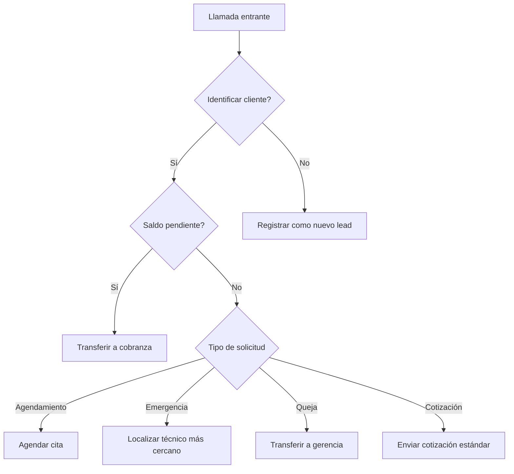
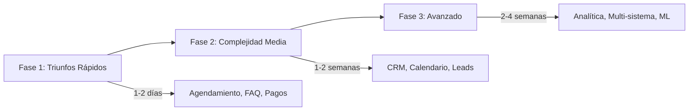

Implementar agentes de voz en tu negocio es un proceso que debe hacerse de forma estratégica. No todos los casos de uso tienen la misma complejidad ni el mismo impacto. Esta **matriz de prioridades** te ayudará a decidir por dónde empezar y cómo escalar.

<Callout type="info" title="La estrategia correcta marca la diferencia">
  Las empresas que siguen una implementación por fases (de lo simple a lo complejo) reportan un 60% más de adopción exitosa que aquellas que intentan implementar todo a la vez.
</Callout>

## Fase 1: Triunfos Rápidos — Implementar Primero

Estos casos de uso son de **baja complejidad y alto impacto**. Se pueden implementar en días y ofrecen un retorno inmediato. Empieza aquí.

| Caso de Uso | Tiempo Estimado | Complejidad | Impacto | Requisitos |
|-------------|-----------------|-------------|---------|------------|
| **Agendamiento de Citas** | 1-2 días | Baja | Alto | Solo el agente de voz |
| **FAQ básicas** | 1 día | Baja | Alto | Base de conocimiento |
| **Recordatorios de Pago** | 1-2 días | Baja | Alto | Integración con sistema de facturación |
| **Llamadas de Confirmación** | Horas | Mínima | Alto | Ninguno |
| **Recolección de Datos Simple** | 1 día | Baja | Medio | Formulario o webhook |

<Tabs>
  <Tab title="Agendamiento de Citas">
    <Callout type="success" title="Por qué empezar aquí">
      Es el caso de uso más sencillo y con el ROI más rápido. Los clientes llaman, el agente revisa disponibilidad y agenda. Sin integraciones complejas. Implementación en 1-2 días.
    </Callout>
  </Tab>
  <Tab title="FAQ Básicas">
    <Callout type="success" title="Fácil y efectivo">
      Carga las preguntas frecuentes de tu negocio en la base de conocimiento. El agente responde instantáneamente sin transferir a humanos. Reduce llamadas repetitivas hasta en un 40%.
    </Callout>
  </Tab>
  <Tab title="Recordatorios de Pago">
    <Callout type="success" title="Impacto en flujo de caja">
      Automatiza llamadas de cobranza amistosa. Configura el agente para llamar con 1, 3 y 7 días de retraso. Mejora la cobranza en un 30%.
    </Callout>
  </Tab>
</Tabs>

### ¿Por qué empezar con triunfos rápidos?

<Callout type="tip" title="Beneficios de la Fase 1">
  - Resultados visibles en días, no meses
  - Bajo riesgo de implementación
  - El equipo se familiariza con la herramienta
  - Datos concretos para justificar las siguientes fases
  - Recuperación rápida de la inversión inicial
</Callout>

## Fase 2: Complejidad Media — Implementar en Segunda Etapa

Una vez que los triunfos rápidos están funcionando, es momento de abordar casos de uso de **complejidad media** que requieren integraciones.

| Caso de Uso | Tiempo Estimado | Complejidad | Impacto | Requisitos |
|-------------|-----------------|-------------|---------|------------|
| **Flujos Multi-paso** | 3-5 días | Media | Alto | Prompt avanzado, webhooks |
| **Integración con CRM** | 3-7 días | Media | Alto | API del CRM (HubSpot, Salesforce, Pipedrive) |
| **Optimización de Calendario** | 2-3 días | Media | Medio | Integración con Google Calendar, Cal.com |
| **Calificación de Leads** | 3-5 días | Media | Alto | Prompt estructurado + CRM |
| **Secuencias de Seguimiento** | 2-4 días | Media | Alto | Webhooks + automatización |

### Prepare your CRM integration

```yaml
# Ejemplo de configuración de webhook para CRM
flujo_seguimiento_lead:
  evento: "lead_cualificado"
  acciones:
    - crear_contacto_en_crm
    - asignar_vendedor
    - enviar_email_bienvenida
    - programar_llamada_seguimiento
  condiciones:
    - si_calificacion > 80: "transferir a ventas inmediatamente"
    - si_calificacion > 50: "enviar a nurturing automático"
    - si_calificacion < 50: "registrar para campaña futura"
```

<Callout type="warning" title="Preparación para la Fase 2">
  Asegúrate de tener acceso a las APIs de tus sistemas (CRM, calendario, facturación) antes de comenzar esta fase. La integración técnica es el cuello de botella más común.
</Callout>

## Fase 3: Avanzado — Implementar en Tercera Etapa

Estos casos de uso requieren **orquestación multi-sistema y lógica avanzada**. Son los de mayor impacto pero también los más complejos.

| Caso de Uso | Tiempo Estimado | Complejidad | Impacto | Requisitos |
|-------------|-----------------|-------------|---------|------------|
| **Analítica Predictiva** | 1-3 semanas | Alta | Alto | Historial de datos, modelos ML |
| **Enrutamiento Complejo** | 1-2 semanas | Alta | Alto | Lógica de negocio multi-variable |
| **Orquestación Multi-sistema** | 2-4 semanas | Muy Alta | Muy Alto | APIs de múltiples sistemas |
| **Árboles de Decisión con IA** | 1-2 semanas | Alta | Alto | Prompt avanzado, datos de entrenamiento |
| **Optimización en Tiempo Real** | 2-4 semanas | Muy Alta | Muy Alto | Infraestructura de datos en tiempo real |

### Ejemplo de lógica de enrutamiento complejo



## Resumen de la matriz de implementación



## Recomendaciones por tamaño de empresa

| Tamaño de Empresa | Enfoque Recomendado | Prioridades | Tiempo Total Estimado |
|------------------|---------------------|-------------|----------------------|
| **Pequeña (1-10 empleados)** | Solo Fase 1 | Agendamiento + FAQ + Confirmaciones | 1-2 semanas |
| **Mediana (11-50 empleados)** | Fase 1 + Fase 2 parcial | Agendamiento + CRM + Seguimiento | 3-6 semanas |
| **Empresa (51-200 empleados)** | Fase 1 + Fase 2 completa | Todo lo anterior + Calificación de leads | 6-10 semanas |
| **Gran Empresa (200+ empleados)** | Todas las fases | Priorizar por departamento | 8-16 semanas |

## Preguntas frecuentes

<ExpandableGroup>
  <Expandable title="¿Puedo saltarme fases si tengo un caso de uso complejo desde el inicio?" default-open="true">
    Técnicamente sí, pero no lo recomendamos. Las fases están diseñadas para que tu equipo aprenda gradualmente. Empezar con un caso avanzado sin haber dominado los básicos puede resultar en una mala experiencia y baja adopción. Te sugerimos implementar al menos 2 casos de la Fase 1 antes de pasar a la Fase 3.
  </Expandable>

  <Expandable title="¿Cuánto tiempo toma ver resultados después de implementar la Fase 1?">
    Los resultados son casi inmediatos. Desde el primer día de implementación, tu agente comenzará a tomar llamadas, agendar citas y recolectar datos. En la primera semana ya tendrás datos concretos para medir el ROI: número de llamadas atendidas, citas agendadas y reducción de carga administrativa.
  </Expandable>

  <Expandable title="¿Qué pasa si mi empresa no tiene un CRM o sistema de facturación para la Fase 2?">
    No es un problema. Los casos de uso de la Fase 1 no requieren integraciones externas. Puedes comenzar con ellos mientras implementas un CRM. E-SMART360 también puede funcionar con herramientas simples como Google Sheets o tablas de base de datos básicas, aunque las integraciones nativas ofrecen mejor rendimiento.
  </Expandable>

  <Expandable title="¿Cómo mido el éxito de cada fase?">
    Define KPIs claros antes de empezar cada fase:
    - **Fase 1**: % de llamadas atendidas automáticamente, citas agendadas, satisfacción del cliente
    - **Fase 2**: % de leads calificados, integraciones funcionales, reducción de tiempo administrativo
    - **Fase 3**: Automatización completa de procesos, ahorro en horas-hombre, incremento en ventas
  </Expandable>

  <Expandable title="¿Necesitas ayuda para definir tu estrategia de implementación?">
    <Callout type="alert" title="Soporte técnico y consultoría">
      Nuestro equipo de soluciones puede ayudarte a diseñar una hoja de ruta personalizada para tu negocio, identificando los casos de uso con mayor impacto y creando un plan de implementación por fases. Contáctanos desde el panel de administración en la sección de Ayuda para agendar una consultoría gratuita.
    </Callout>
  </Expandable>
</ExpandableGroup>
