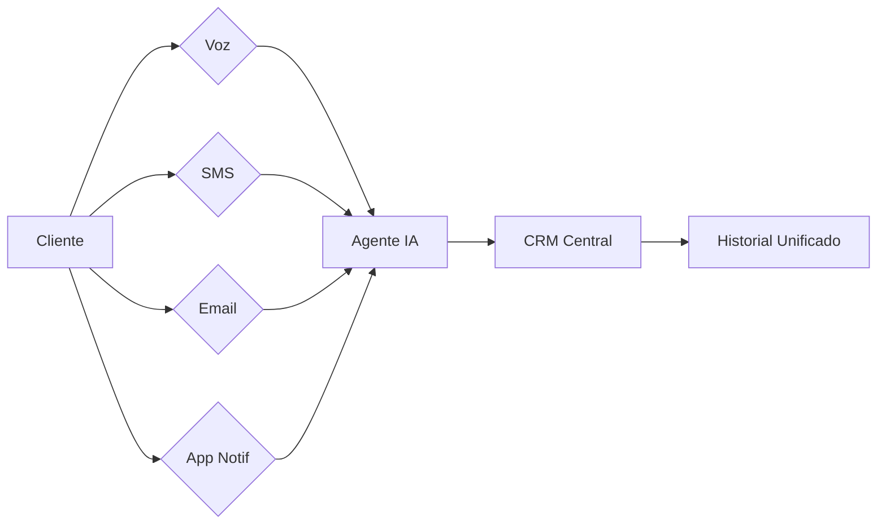
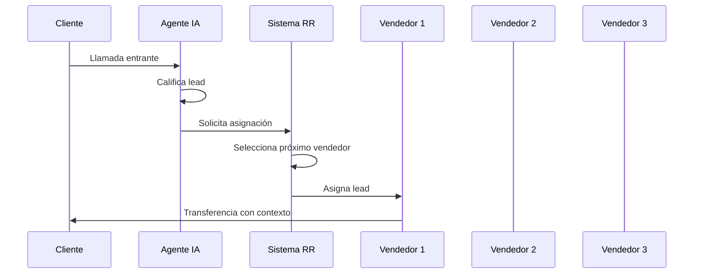
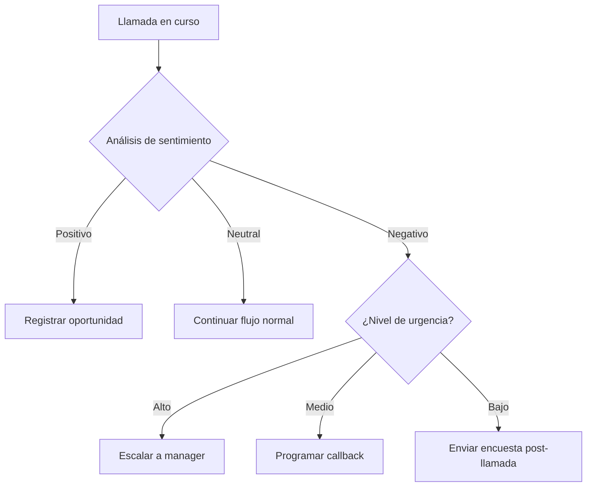

<Callout kind="info">
Los patrones de integración avanzada te permiten extender las capacidades de tus agentes de voz más allá de las funcionalidades básicas. Estos patrones están diseñados para empresas que necesitan orquestación multicanal, analítica predictiva y automatización inteligente de procesos.
</Callout>

## Orquestación Multicanal

La orquestación multicanal permite coordinar interacciones a través de múltiples canales de comunicación, asegurando una experiencia coherente para el cliente sin importar cómo o dónde se comunique.



### Flujos de Escalamiento Inteligente

<Steps>
  <Step title="Nivel 1: IA Autónoma" icon="cpu">
    El agente de IA maneja la interacción de forma autónoma. Resuelve preguntas frecuentes, agenda citas y califica leads sin intervención humana.
  </Step>
  <Step title="Nivel 2: IA Avanzada" icon="zap">
    Si el agente detecta que el caso requiere análisis más profundo, escala a un agente de IA con capacidades avanzadas (análisis de sentimiento, contexto histórico, razonamiento complejo).
  </Step>
  <Step title="Nivel 3: Humano" icon="users">
    Cuando la IA determina que se necesita intervención humana (quejas complejas, negociaciones, escalaciones regulatorias), transfiere al cliente con un resumen completo del contexto.
  </Step>
  <Step title="Nivel 4: Especialista" icon="star">
    Para casos que requieren conocimiento de dominio específico (médico, legal, financiero), el agente humano escala al especialista correspondiente con toda la documentación del caso.
  </Step>
</Steps>

<Callout kind="tip">
Cada nivel de escalamiento debe incluir un resumen ejecutivo de la interacción para que el siguiente nivel pueda retomar el caso sin necesidad de que el cliente repita información.
</Callout>

## Enrutamiento Inteligente

### Round-Robin

Distribuye leads entrantes entre los miembros del equipo de forma equitativa:



### Enrutamiento por Zona Horaria

Para negocios globales, el enrutamiento debe considerar la zona horaria del cliente:

| Zona Horaria del Cliente | Ventana de Contacto | Equipo Asignado |
|--------------------------|-------------------|-----------------|
| UTC-8 a UTC-5 (América) | 8:00 - 20:00 local | Equipo América |
| UTC+0 a UTC+3 (Europa) | 8:00 - 20:00 local | Equipo Europa |
| UTC+5 a UTC+8 (Asia) | 8:00 - 20:00 local | Equipo Asia-Pacífico |
| Fuera de ventana | Mensaje asíncrono | Programar para siguiente ventana |

### Detección de Idioma

<CodeGroup tabs="Flujo,Configuración">
```text
1. Cliente llama
2. Agente detecta idioma (ES/EN/FR)
3. Enruta al agente con ese idioma
4. Transfiere contexto en el idioma detectado
5. Si no hay agente disponible → mensaje en ese idioma con horarios
```

```javascript
const routingConfig = {
  languageDetection: {
    enabled: true,
    fallbackLanguage: "es",
    languages: ["es", "en", "fr", "pt"],
    routingStrategy: "language_first",
    noAgentAction: "async_message"
  }
};
```
</CodeGroup>

## Analítica Impulsada por IA

### Acciones Basadas en Sentimiento



<ExpandableGroup>
  <Expandable title="Acciones Disparadas por Sentimiento" default-open="true">
    Cuando el análisis de sentimiento detecta emociones fuertes (enojo, frustración), el sistema puede:
    
    - **Cliente enojado** → Escalar automáticamente a un manager con un callback prioritario
    - **Cliente interesado** → Activar flujo de ventas con descuentos personalizados
    - **Cliente confundido** → Simplificar el lenguaje y ofrecer transferencia a humano
    - **Cliente satisfecho** → Solicitar testimonio o referencia
    - **Cliente indeciso** → Enviar material informativo por SMS/email
  </Expandable>
  <Expandable title="Predicción de Cancelación" default-open="false">
    El modelo de IA analiza patrones de llamadas previas para identificar clientes en riesgo de cancelación:
    
    - Clientes con 3+ llamadas de soporte en 30 días
    - Clientes que mencionan palabras clave como "cancelar", "queja", "insatisfecho"
    - Clientes con tickets abiertos sin resolver por más de 48 horas
    - Clientes que han reducido su frecuencia de uso
  </Expandable>
  <Expandable title="Detección de Oportunidades de Upsell" default-open="false">
    Identifica señales de compra durante las llamadas:
    
    - Menciones de necesidades no cubiertas
    - Preguntas sobre funcionalidades premium
    - Comparaciones con competidores
    - Crecimiento reportado del negocio del cliente
    
    Cuando se detectan estas señales, el sistema activa un flujo de ventas con ofertas personalizadas.
  </Expandable>
  <Expandable title="Aseguramiento de Calidad Automatizado" default-open="false">
    El sistema monitorea y evalúa automáticamente las llamadas:
    
    - Precisión de respuestas del agente IA
    - Tiempo promedio de resolución por tipo de caso
    - Tasa de escalamiento innecesario
    - Satisfacción del cliente post-llamada
    - Cumplimiento de guiones y protocolos
    
    Las llamadas que no cumplen con los umbrales de calidad se marcan para revisión humana.
  </Expandable>
  <Expandable title="Programación Predictiva de Personal" default-open="false">
    El sistema anticipa volúmenes de llamadas para optimizar la asignación de agentes:
    
    - Predice horas pico basadas en datos históricos
    - Sugiere ajustes de personal para periodos de alta demanda
    - Identifica patrones estacionales (días festivos, temporadas)
    - Recomienda horarios óptimos para campañas salientes
    
    Reduce costos operativos al evitar sobre-asignación de personal en horas valle.
  </Expandable>
</ExpandableGroup>

## Cuadro de Prioridades de Implementación

| Patrón | Impacto | Esfuerzo | Prioridad |
|--------|---------|----------|-----------|
| Enrutamiento por zona horaria | Alto | Bajo | ⭐⭐⭐⭐⭐ |
| Acciones basadas en sentimiento | Muy Alto | Medio | ⭐⭐⭐⭐⭐ |
| Flujo de escalamiento inteligente | Alto | Medio | ⭐⭐⭐⭐ |
| Round-robin de leads | Medio | Bajo | ⭐⭐⭐⭐ |
| Detección de oportunidades de upsell | Muy Alto | Medio-Alto | ⭐⭐⭐ |
| Predicción de cancelación | Alto | Alto | ⭐⭐⭐ |
| Programación predictiva | Medio | Alto | ⭐⭐ |

## Configuración Avanzada

<Callout kind="alert">
Los patrones avanzados requieren configuración adicional en tu cuenta de E-SMART360. Contacta a nuestro equipo de ventas para habilitar funcionalidades empresariales como analítica predictiva y orquestación multicanal completa.
</Callout>

### Ejemplo: Configuración de Acción por Sentimiento

```javascript show-lines="true" highlight="2,5,8"
const sentimentConfig = {
  minConfidence: 0.75,
  actions: {
    anger: { 
      action: "escalate_to_manager", 
      priority: "high",
      message: "Cliente reporta insatisfacción. Transferido a manager."
    },
    interest: { 
      action: "trigger_sales_flow",
      campaign: "upsell_premium",
      delay: "immediate"
    },
    confusion: { 
      action: "simplify_response",
      maxAttempts: 3,
      fallback: "transfer_to_human"
    },
    satisfaction: {
      action: "request_testimonial",
      channel: "sms",
      delay: "1h"
    }
  }
};
```

<Callout kind="success">
Implementar estos patrones de integración avanzada transforma tu operación de llamadas de un centro de atención reactivo a un motor proactivo de ventas y retención. Comienza con los patrones de alto impacto y bajo esfuerzo, y escala gradualmente.
</Callout>
