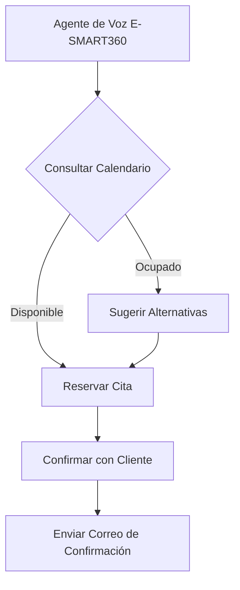
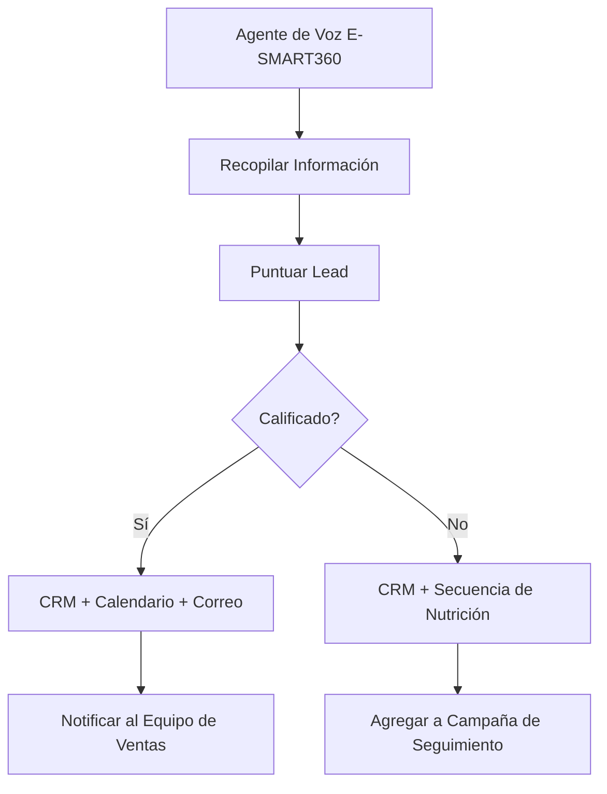
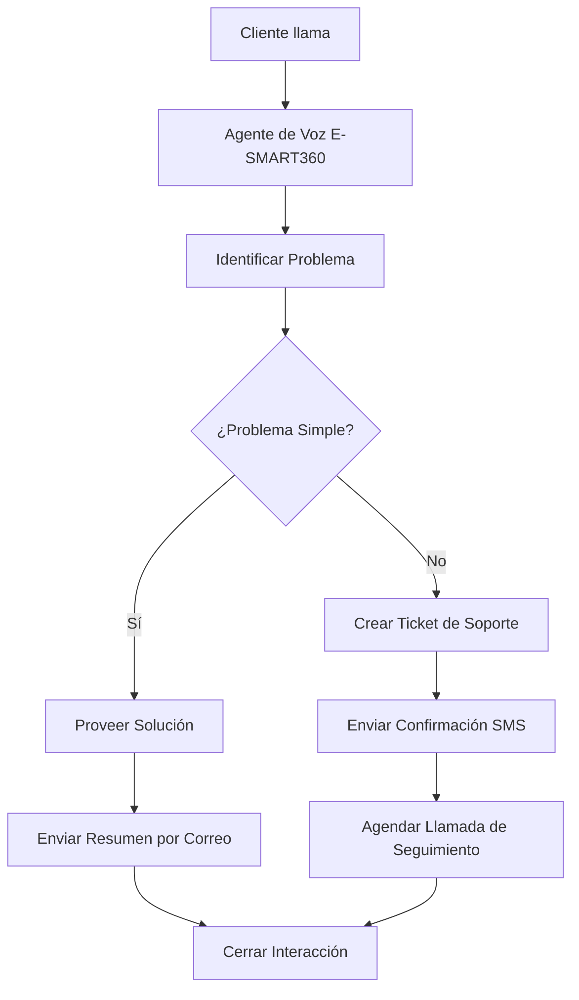
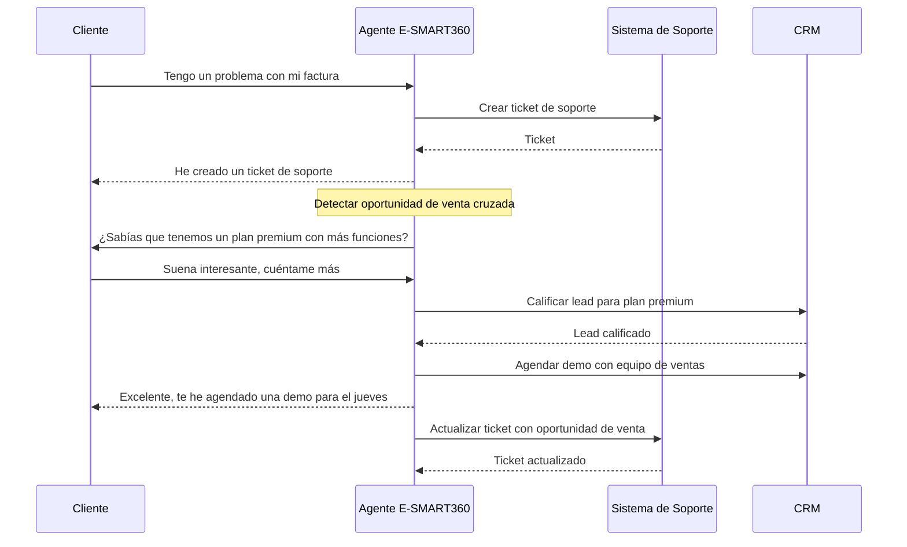

<Callout kind="info">
  Los patrones de integración son arquitecturas reutilizables que resuelven problemas recurrentes en la automatización de agentes de voz. A continuación presentamos los tres patrones más comunes que puedes implementar con E-SMART360, cada uno con su diagrama de flujo y guía de implementación.
</Callout>

## Patrón 1: Verificación de Disponibilidad

### Flujo del Patrón

Este patrón permite que el agente de voz verifique disponibilidad en tiempo real y ofrezca alternativas si la fecha solicitada no está disponible.



### Implementación

<Steps>
<Step title="El agente consulta disponibilidad" icon="calendar">
  El agente pregunta al cliente la fecha y hora deseadas. E-SMART360 envía un webhook a tu sistema de calendario (Google Calendar, Calendly, etc.) para verificar disponibilidad.
  
  **Payload de consulta:**
  ```json
  {
    "action": "check_availability",
    "date": "2025-06-15",
    "time": "14:00",
    "duration": 30
  }
  ```
</Step>
<Step title="Evaluar respuesta" icon="check-circle">
  - **Si está disponible**: el flujo continúa a la reserva directa.
  - **Si está ocupado**: el agente debe sugerir alternativas. Por ejemplo: "Esas fechas están completas, pero tengo disponible el jueves a las 10:00 o el viernes a las 14:00. ¿Cuál prefieres?"
</Step>
<Step title="Confirmar y reservar" icon="check">
  Una vez que el cliente acepta una opción, el agente procede a crear el evento en el calendario y envía la confirmación por correo electrónico.
</Step>
</Steps>

<Callout kind="tip">
  Programa al agente para que siempre tenga **3 opciones de horario** listas antes de preguntar. Esto evita pausas incómodas mientras el sistema consulta disponibilidad secuencialmente.
</Callout>

## Patrón 2: Calificación de Leads

### Flujo del Patrón

Este patrón permite que el agente de voz evalúe la calidad de un lead durante la conversación y ejecute acciones diferentes según su puntuación.



### Criterios de Calificación

<Columns cols="2">
<Card title="Lead Calificado" icon="star">
  El lead cumple con los criterios definidos: presupuesto adecuado, autoridad para decidir, necesidad clara y un plazo definido (criterios BANT).
  
  **Acciones:**
  - Crear/actualizar contacto en CRM
  - Crear deal en etapa de calificación
  - Agendar reunión con ventas
  - Enviar correo con información detallada
  - Notificar al equipo por Slack
</Card>
<Card title="Lead No Calificado" icon="users">
  El lead no cumple todos los criterios pero tiene potencial futuro.
  
  **Acciones:**
  - Crear/actualizar contacto en CRM (segmento frío)
  - Agregar a secuencia de nutrición automatizada
  - Enviar correo con recursos informativos
  - Programar seguimiento en 30 días
</Card>
</Columns>

### Ejemplo de Webhook de Calificación

```json
{
  "action": "qualify_lead",
  "lead_score": 85,
  "criteria": {
    "budget": true,
    "authority": true,
    "need": true,
    "timeline": true
  },
  "qualified": true,
  "caller": {
    "name": "Ana Martínez",
    "email": "ana@empresa.com",
    "phone": "+525512345678",
    "company": "Tech Solutions MX"
  },
  "actions": ["create_contact", "create_deal", "schedule_meeting", "notify_sales"]
}
```

<Callout kind="success">
  La puntuación del lead se calcula en tiempo real durante la conversación. Cada respuesta positiva suma puntos. Si el lead alcanza el umbral de calificación (por ejemplo, 70/100), el sistema dispara automáticamente las acciones de lead calificado.
</Callout>

## Patrón 3: Gestión de Tickets de Soporte

### Flujo del Patrón

Este patrón permite que el agente de voz identifique el problema del cliente y determine si puede resolverlo automáticamente o si necesita escalarlo a un agente humano.



### Problemas Simples vs. Complejos

<Tabs>
<Tab title="Problemas Simples (Resolución Automática)">
  El agente de voz puede resolver estos problemas sin intervención humana:
  
  - **Consultas de horario**: "¿A qué hora abren?"
  - **Información de precios**: "¿Cuánto cuesta el servicio X?"
  - **Cambios de cita**: "¿Puedo mover mi cita del martes al jueves?"
  - **Estado de cuenta**: "¿Cuál es el saldo de mi cuenta?"
  - **Instrucciones básicas**: "¿Cómo accedo al portal?"
  
  **Flujo:** El agente consulta la base de conocimiento de E-SMART360, responde al cliente y envía un resumen por correo electrónico.
</Tab>
<Tab title="Problemas Complejos (Escalamiento)">
  El agente de voz debe escalar estos problemas a un agente humano:
  
  - **Quejas o reclamaciones**: "Quiero cancelar mi servicio y pedir un reembolso"
  - **Problemas técnicos avanzados**: "El sistema no sincroniza mis datos"
  - **Solicitudes fuera de lo estándar**: "Necesito una cotización personalizada para 500 usuarios"
  - **Problemas de facturación**: "Me cobraron dos veces el mismo mes"
  
  **Flujo:** E-SMART360 crea un ticket en el sistema de soporte, envía una confirmación SMS al cliente y agenda una llamada de seguimiento con un agente humano.
</Tab>
</Tabs>

### Webhook de Creación de Ticket

```json
{
  "action": "create_ticket",
  "priority": "alta",
  "issue_type": "facturacion",
  "summary": "Cliente reporta doble cobro en el mes de mayo",
  "caller": {
    "name": "Roberto García",
    "email": "roberto@cliente.com",
    "phone": "+34612345678"
  },
  "transcript_summary": "El cliente indica que recibió dos cargos por $49.99 USD en su tarjeta. El primer cobro fue el 2 de mayo y el segundo el 15 de mayo. Solicita el reembolso del segundo cargo.",
  "actions": [
    "create_ticket_zendesk",
    "send_sms_confirmation",
    "schedule_callback_2hours"
  ]
}
```

## Combinación de Patrones

<Callout kind="info">
  Los patrones no son excluyentes. Una misma llamada puede combinar múltiples patrones. Por ejemplo: un lead calificado que agenda una cita (Patrón 1 + Patrón 2), o un ticket de soporte que crea un lead de venta cruzada (Patrón 2 + Patrón 3).
</Callout>

### Ejemplo: Llamada de Soporte + Venta Cruzada



## Guía Rápida para Elegir el Patrón Correcto

<Columns cols="2">
<Card title="¿Tu agente gestiona citas?" icon="calendar">
  Usa el **Patrón 1: Verificación de Disponibilidad**. Ideal para consultorios, salones de belleza, servicios profesionales y cualquier negocio que requiera agenda.
</Card>
<Card title="¿Tu agente califica prospectos?" icon="trending-up">
  Usa el **Patrón 2: Calificación de Leads**. Perfecto para equipos de ventas, agencias inmobiliarias y empresas B2B.
</Card>
<Card title="¿Tu agente da soporte técnico?" icon="headphones">
  Usa el **Patrón 3: Gestión de Tickets**. Recomendado para centros de soporte, SaaS y servicios técnicos.
</Card>
<Card title="¿Tu agente hace de todo?" icon="layers">
  **Combina patrones**. E-SMART360 permite que un mismo agente detecte el tipo de llamada y active el patrón correcto automáticamente.
</Card>
</Columns>

## Preguntas Frecuentes

<ExpandableGroup>
<Expandable title="¿Puedo crear mis propios patrones de integración?" default-open="true">
  Sí. Los patrones presentados son puntos de partida, no reglas fijas. Puedes modificarlos, combinarlos o crear patrones completamente nuevos según las necesidades de tu negocio. E-SMART360 te permite personalizar los webhooks, prompts y flujos de automatización para adaptarse a cualquier caso de uso. La clave es mantener la estructura: disparador → proceso → acciones.
</Expandable>

<Expandable title="¿Qué hago si mi flujo necesita más de 3 patrones?">
  Puedes combinar todos los patrones que necesites. Sin embargo, te recomendamos mantener la lógica clara: cada patrón debe tener un objetivo específico. Si tu flujo se vuelve demasiado complejo, considera dividirlo en agentes de voz especializados (uno para ventas, otro para soporte, otro para agenda) que compartan la misma base de datos.
</Expandable>

<Expandable title="¿Cómo manejo los errores cuando un patrón falla?">
  Cada patrón debe incluir una ruta de fallback. Por ejemplo, si el calendario no responde en el Patrón 1, el agente debe decir: "Estoy teniendo dificultades para consultar la disponibilidad. ¿Te parece bien si tomo tus datos y te confirmo por correo electrónico?" Esta estrategia mantiene la conversación fluida incluso cuando hay problemas técnicos.
</Expandable>

<Expandable title="¿Necesitas ayuda para diseñar el patrón de integración ideal para tu negocio?">
  <Callout kind="info">
    El equipo de E-SMART360 puede ayudarte a diseñar e implementar patrones de integración personalizados para tu industria. Compártenos tu caso de uso y recibirás una propuesta de arquitectura, los webhooks necesarios y los prompts optimizados para tu agente de voz.
  </Callout>
</Expandable>
</ExpandableGroup>
