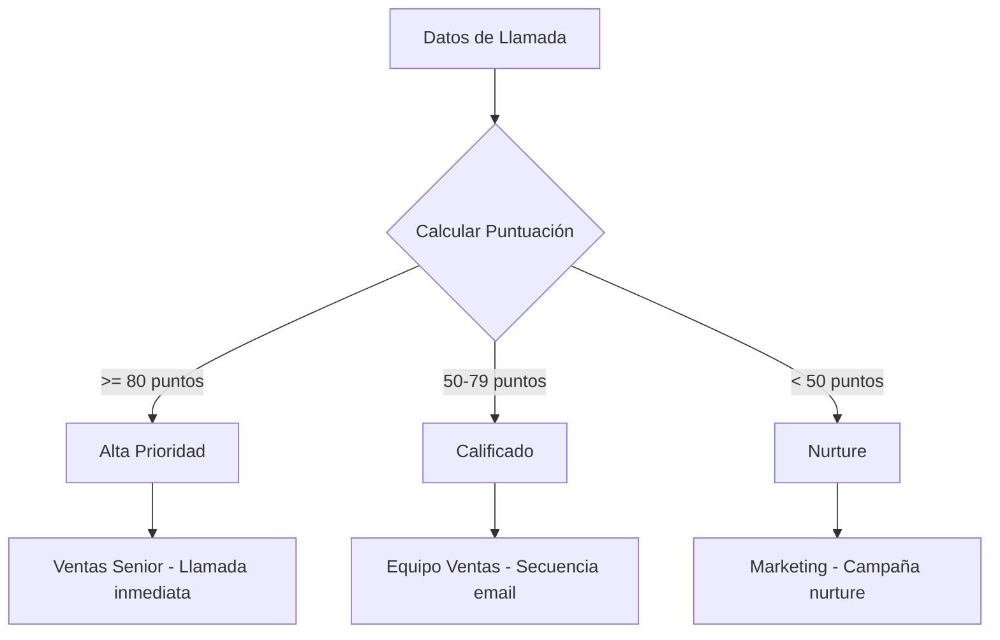
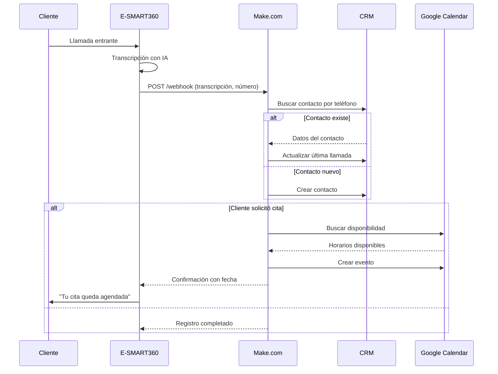
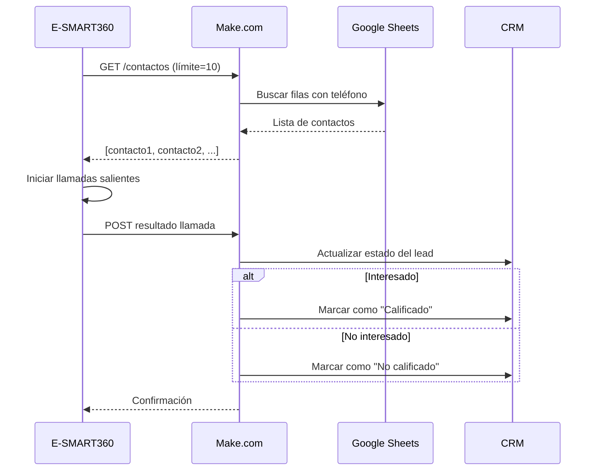
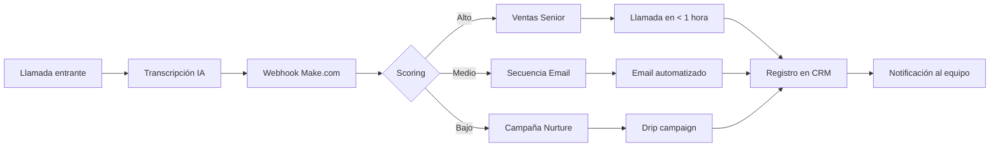

<Callout kind="info" emoji="📋">
Esta guía contiene **11 plantillas JSON blueprint** listas para importar en Make.com. Cada plantilla es un escenario completo y funcional. Solo necesitas reemplazar los valores placeholder con tus propias credenciales y conectar tus cuentas (HubSpot, Google Calendar, Twilio, Salesforce, Pipedrive, HighLevel, Google Sheets, etc.).
</Callout>

## Cómo Usar Estas Plantillas

<Steps>
<Step title="Copia el contenido JSON">
Selecciona el bloque JSON completo de cada escenario y pégalo en un archivo con extensión `.json`.
</Step>
<Step title="Importa en Make.com">
En Make.com, ve a **Escenarios** → **Importar Blueprint** y selecciona tu archivo JSON.
</Step>
<Step title="Conecta tus cuentas">
En el editor de Make.com, conéctate a tus cuentas de Google Calendar, HubSpot, Salesforce, Twilio, Google Sheets y otros servicios que uses.
</Step>
<Step title="Reemplaza valores placeholder">
Sustituye los valores de ejemplo como IDs de webhook, direcciones de correo o IDs de hojas de Google por tus datos reales.
</Step>
<Step title="Prueba con datos de E-SMART360">
Realiza una prueba enviando datos desde E-SMART360 a tu webhook para verificar que todo funcione correctamente antes de activarlo.
</Step>
</Steps>

<Callout kind="warning" title="⚠️ Antes de poner en producción">
Prueba cada escenario con datos de muestra de E-SMART360 antes de activarlo en producción. Verifica que los mapeos de campos sean correctos y que las conexiones a tus servicios estén activas. Los IDs de webhook incluidos en estas plantillas son ejemplos; deberás reemplazarlos por los IDs reales generados por Make.com al importar el blueprint.
</Callout>

---

## 1. Reserva de Calendario con Detección de Conflictos

**Nombre del Escenario:** E-SMART360 Smart Calendar Booking

Este escenario recibe una solicitud de reserva desde E-SMART360, verifica conflictos en Google Calendar y agenda automáticamente. Si hay conflicto, genera alternativas de horario para ofrecer al cliente.

<CodeGroup>
```json Blueprint
{
  "modules": [
    {
      "module": "webhook",
      "name": "E-SMART360 Trigger",
      "webhook_url": "https://hook.eu1.make.com/[YOUR_UNIQUE_ID]"
    },
    {
      "module": "google_calendar.searchEvents",
      "name": "Check Conflicts",
      "parameters": {
        "calendar": "primary",
        "timeMin": "{{payload.requested_start}}",
        "timeMax": "{{payload.requested_end}}"
      }
    },
    {
      "module": "router",
      "routes": [
        {
          "condition": "{{length(2.events) = 0}}",
          "path": "booking_available"
        },
        {
          "condition": "{{length(2.events) > 0}}",
          "path": "suggest_alternatives"
        }
      ]
    },
    {
      "module": "google_calendar.createEvent",
      "name": "Book Meeting",
      "route": "booking_available"
    },
    {
      "module": "tools.setVariable",
      "name": "Find Alternatives",
      "route": "suggest_alternatives",
      "value": "{{generateAlternativeSlots()}}"
    },
    {
      "module": "http.makeRequest",
      "name": "Callback to E-SMART360",
      "url": "{{esmart360_callback_url}}",
      "method": "POST",
      "body": "{{booking_result}}"
    }
  ]
}
```
```text Flujo del Escenario
1. Webhook recibe solicitud de E-SMART360
2. Busca eventos existentes en Google Calendar
3. Router: si no hay conflictos → agenda la cita
4. Router: si hay conflictos → busca alternativas
5. Responde a E-SMART360 con el resultado
```
</CodeGroup>

<Callout kind="tip">
Puedes modificar la duración de la ventana de búsqueda cambiando los parámetros `timeMin` y `timeMax`. El formato debe ser ISO 8601, por ejemplo: `2025-01-15T09:00:00Z`.
</Callout>

---

## 2. Secuencia de Seguimiento Multicanal

**Nombre del Escenario:** E-SMART360 Omnichannel Follow-Up

Gestiona el seguimiento automático después de una llamada. Determina si el contacto existe en tu CRM y lo enruta al flujo correspondiente: bienvenida, nurture o campaña.

<CodeGroup>
```json Blueprint
{
  "name": "E-SMART360 Omnichannel Follow-Up",
  "flow": [
    {
      "id": 1,
      "module": "gateway:CustomWebHook",
      "version": 1,
      "parameters": { "hook": 1234566, "maxResults": 1 },
      "mapper": {},
      "metadata": { "designer": { "x": 0, "y": 0 } }
    },
    {
      "id": 2,
      "module": "hubspot:SearchContacts",
      "version": 1,
      "parameters": {},
      "mapper": { "query": "{{1.caller_number}}", "limit": 1 },
      "metadata": { "designer": { "x": 300, "y": 0 } }
    },
    {
      "id": 3,
      "module": "builtin:BasicRouter",
      "version": 1,
      "mapper": {},
      "metadata": { "designer": { "x": 600, "y": 0 } },
      "routes": [
        {
          "flow": [
            {
              "id": 4,
              "module": "hubspot:CreateContact",
              "version": 1,
              "parameters": {},
              "mapper": {
                "properties": { "phone": "{{1.caller_number}}", "email": "{{1.caller_email}}" }
              },
              "metadata": { "designer": { "x": 900, "y": -100 } }
            },
            {
              "id": 5,
              "module": "mailchimp:Subscribe",
              "version": 1,
              "parameters": {},
              "mapper": { "list_id": "your_list_id", "email": "{{1.caller_email}}" },
              "metadata": { "designer": { "x": 1200, "y": -100 } }
            }
          ],
          "filter": {
            "name": "New Contact",
            "conditions": [
              [{ "a": "{{length(2.contacts)}}", "o": "equal", "b": "0" }]
            ]
          }
        },
        {
          "flow": [
            {
              "id": 6,
              "module": "hubspot:UpdateContact",
              "version": 1,
              "parameters": {},
              "mapper": {
                "id": "{{2.contacts[1].id}}",
                "properties": { "last_contacted_date": "{{1.timestamp}}" }
              },
              "metadata": { "designer": { "x": 900, "y": 100 } }
            }
          ],
          "filter": {
            "name": "Existing Contact",
            "conditions": [
              [{ "a": "{{length(2.contacts)}}", "o": "gt", "b": "0" }]
            ]
          }
        }
      ]
    },
    {
      "id": 7,
      "module": "gateway:WebhookRespond",
      "version": 1,
      "parameters": {},
      "mapper": {
        "status": 200,
        "body": "{\"status\": \"processed\"}"
      },
      "metadata": { "designer": { "x": 1500, "y": 0 } }
    }
  ],
  "metadata": {
    "instant": false, "version": 1,
    "scenario": {
      "roundtrips": 1, "maxErrors": 3, "autoCommit": true,
      "autoCommitTriggerLast": true, "sequential": false,
      "confidential": false, "dataloss": false, "dlq": false,
      "freshVariables": false
    },
    "designer": { "orphans": [] },
    "zone": "eu1.make.com",
    "notes": []
  }
}
```
```text Campos Esperados del Payload
caller_number: Número telefónico del cliente
caller_email: Correo electrónico del cliente
transcription: Transcripción completa de la llamada
call_type: inbound / outbound
timestamp: Fecha y hora en formato ISO
```
</CodeGroup>

### Requisitos
- Cuenta de HubSpot conectada en Make.com
- Lista de Mailchimp configurada (opcional, puedes omitir este módulo)
- Webhook activo en E-SMART360

---

## 3. Scoring Inteligente de Leads y Enrutamiento

Evalúa los datos de la llamada, asigna una puntuación a cada lead y lo enruta automáticamente al equipo de ventas o marketing según su nivel de interés.

<CodeGroup>
```javascript Función de Scoring
// Módulo de Scoring de Leads - E-SMART360
function scoreAndRoute(callData) {
  let score = 0;

  // Criterios de puntuación configurables
  if (callData.company_size > 100) score += 30;
  if (callData.budget > 10000) score += 40;
  if (callData.timeline === "immediate") score += 30;
  if (callData.decision_maker === true) score += 20;

  // Enrutamiento basado en puntuación
  if (score >= 80) {
    return { route: "high_priority", assignTo: "senior_sales", action: "immediate_callback" };
  } else if (score >= 50) {
    return { route: "qualified", assignTo: "sales_team", action: "email_sequence" };
  } else {
    return { route: "nurture", assignTo: "marketing", action: "drip_campaign" };
  }
}
```

</CodeGroup>

<Tabs>
  <Tab title="🔴 Alta Prioridad (>=80)">
    Lead caliente con alta intención de compra. Se asigna a un vendedor senior para llamada de seguimiento inmediata. Tiempo de respuesta recomendado: menos de 1 hora.
  </Tab>
  <Tab title="🟡 Medio (50-79)">
    Lead calificado con interés demostrado. Pasa al equipo de ventas para secuencia automatizada de correos. Tiempo de respuesta recomendado: 24 horas.
  </Tab>
  <Tab title="🟢 Bajo (<50)">
    Lead en etapa temprana de investigación. Va a marketing para campaña de nurture automatizada. Tiempo de respuesta recomendado: 48-72 horas.
  </Tab>
</Tabs>

<Callout kind="tip" title="Personalización de Umbrales">
Ajusta los valores de puntuación según tu industria. Negocios B2B con tickets altos (>$10K) pueden usar umbrales más altos (100+ pts). Negocios B2C con ciclos de venta cortos pueden reducir los umbrales a la mitad. También puedes agregar criterios adicionales como ubicación geográfica, sector industrial o fuente del lead.
</Callout>

---

## 4. Agendar Cita desde Transcripción de Llamada

**Escenario:** E-SMART360 Crear Evento en Google Calendar

Recibe la transcripción de una llamada, extrae la intención de agendar usando expresiones regulares, parsea fecha y hora, y crea el evento en Google Calendar automáticamente.

<CodeGroup>
```json Blueprint
{
  "name": "E-SMART360 Create Google Calendar Event",
  "flow": [
    {
      "id": 1,
      "module": "gateway:CustomWebHook",
      "version": 1,
      "parameters": { "hook": 1234568, "maxResults": 1 },
      "mapper": {},
      "metadata": { "designer": { "x": 0, "y": 0 } }
    },
    {
      "id": 2,
      "module": "util:TextParserMatchPattern",
      "version": 1,
      "parameters": {},
      "mapper": {
        "text": "{{1.transcription}}",
        "pattern": "(book|schedule) (appointment|meeting) for (?<date>\\w+) at (?<time>\\d+:\\d+)"
      },
      "metadata": { "designer": { "x": 300, "y": 0 } }
    },
    {
      "id": 3,
      "module": "builtin:DateFormat",
      "version": 1,
      "parameters": {},
      "mapper": { "date": "{{2.date}} {{2.time}}", "format": "YYYY-MM-DD HH:mm" },
      "metadata": { "designer": { "x": 600, "y": 0 } }
    },
    {
      "id": 4,
      "module": "google-calendar:CreateEvent",
      "version": 5,
      "parameters": {},
      "mapper": {
        "summary": "Cita con {{1.caller_number}}",
        "start": { "dateTime": "{{3.date}}" },
        "end": { "dateTime": "{{add(3.date; 3600)}}" },
        "description": "Transcripción: {{1.transcription}}\
Grabación: {{1.recording_url}}"
      },
      "metadata": { "designer": { "x": 900, "y": 0 } }
    },
    {
      "id": 5,
      "module": "gateway:WebhookRespond",
      "version": 1,
      "parameters": {},
      "mapper": {
        "status": 200,
        "body": "{\"appointment_id\": \"{{4.id}}\", \"status\": \"booked\"}"
      },
      "metadata": { "designer": { "x": 1200, "y": 0 } }
    }
  ],
  "metadata": {
    "instant": false, "version": 1,
    "scenario": {
      "roundtrips": 1, "maxErrors": 3, "autoCommit": true,
      "autoCommitTriggerLast": true, "sequential": false,
      "confidential": false, "dataloss": false, "dlq": false,
      "freshVariables": false
    },
    "designer": { "orphans": [] },
    "zone": "eu1.make.com",
    "notes": []
  }
}
```
```text Patrón Regex para Extracción
(buscar|agendar|programar) (cita|reunión|llamada) para (?<fecha>\w+) a las (?<hora>\d+:\d+)
```
</CodeGroup>

<Steps>
<Step title="Webhook recibe datos">
E-SMART360 envía la transcripción de la llamada al webhook de Make.com con el número del cliente.
</Step>
<Step title="TextParser extrae información">
El módulo de expresión regular identifica frases como "agendar cita para el lunes a las 15:00" y extrae la fecha y hora.
</Step>
<Step title="Formato de fecha">
El módulo DateFormat convierte la fecha extraída al formato ISO 8601 requerido por Google Calendar.
</Step>
<Step title="Creación del evento">
Google Calendar crea un evento de 1 hora con el número del cliente como título y la transcripción como descripción.
</Step>
<Step title="Confirmación a E-SMART360">
Se devuelve el ID del evento creado para que el agente pueda confirmar la cita al cliente durante la llamada.
</Step>
</Steps>

<Callout kind="info">
El patrón de expresión regular es configurable. Si tus clientes hablan en varios idiomas, puedes crear múltiples patrones o usar un único patrón con OR: `(agendar|reservar|programar|book|schedule)`.
</Callout>

---

## 5. Enviar Email o SMS Según Clasificación de la Llamada

**Escenario:** E-SMART360 Enviar Seguimiento Inteligente

Clasifica la llamada usando OpenAI y envía el canal de seguimiento apropiado: email si el lead está interesado, SMS si necesita recordatorio.

<CodeGroup>
```json Blueprint
{
  "name": "E-SMART360 Send Follow-Up",
  "flow": [
    {
      "id": 1,
      "module": "gateway:CustomWebHook",
      "version": 1,
      "parameters": { "hook": 1234569, "maxResults": 1 },
      "mapper": {},
      "metadata": { "designer": { "x": 0, "y": 0 } }
    },
    {
      "id": 2,
      "module": "openai:ClassifyText",
      "version": 1,
      "parameters": {},
      "mapper": {
        "text": "{{1.transcription}}",
        "prompt": "Classify call as: interested, followup_needed, closed."
      },
      "metadata": { "designer": { "x": 300, "y": 0 } }
    },
    {
      "id": 3,
      "module": "builtin:BasicRouter",
      "version": 1,
      "mapper": {},
      "metadata": { "designer": { "x": 600, "y": 0 } },
      "routes": [
        {
          "flow": [
            {
              "id": 4,
              "module": "gmail:SendEmail",
              "version": 1,
              "parameters": {},
              "mapper": {
                "to": "{{1.caller_email}}",
                "subject": "Gracias por tu llamada - Próximos pasos",
                "content": "Hola, gracias por contactarnos. Aquí tienes los próximos pasos..."
              },
              "metadata": { "designer": { "x": 900, "y": -100 } }
            }
          ],
          "filter": {
            "name": "Interesado",
            "conditions": [
              [{ "a": "{{2.classification}}", "o": "textcontains", "b": "interested" }]
            ]
          }
        },
        {
          "flow": [
            {
              "id": 5,
              "module": "twilio:SendMessage",
              "version": 1,
              "parameters": {},
              "mapper": {
                "to": "{{1.caller_number}}",
                "body": "Gracias por tu llamada. Te contactaremos pronto con más información."
              },
              "metadata": { "designer": { "x": 900, "y": 100 } }
            }
          ],
          "filter": {
            "name": "Requiere Seguimiento",
            "conditions": [
              [{ "a": "{{2.classification}}", "o": "textcontains", "b": "followup_needed" }]
            ]
          }
        }
      ]
    },
    {
      "id": 6,
      "module": "gateway:WebhookRespond",
      "version": 1,
      "parameters": {},
      "mapper": {
        "status": 200,
        "body": "{\"followup_sent\": true}"
      },
      "metadata": { "designer": { "x": 1200, "y": 0 } }
    }
  ],
  "metadata": {
    "instant": false, "version": 1,
    "scenario": {
      "roundtrips": 1, "maxErrors": 3, "autoCommit": true,
      "autoCommitTriggerLast": true, "sequential": false,
      "confidential": false, "dataloss": false, "dlq": false,
      "freshVariables": false
    },
    "designer": { "orphans": [] },
    "zone": "eu1.make.com",
    "notes": []
  }
}
```
</CodeGroup>

<Callout kind="info">
Puedes reemplazar el módulo de clasificación de OpenAI por una expresión regular simple si prefieres no depender de la API externa. Por ejemplo, busca palabras clave como "interesado", "gracias", "demo" o "llámame" directamente en la transcripción usando TextParser.
</Callout>

---

## 6. Actualizar Estado de Lead en Salesforce

**Escenario:** E-SMART360 Actualizar Lead en Salesforce

Después de una llamada saliente, busca el lead en Salesforce por número telefónico, analiza la transcripción para detectar intención y actualiza el estado del lead automáticamente.

<CodeGroup>
```json Blueprint
{
  "name": "E-SMART360 Update Salesforce Lead",
  "flow": [
    {
      "id": 1,
      "module": "gateway:CustomWebHook",
      "version": 1,
      "parameters": { "hook": 1234570, "maxResults": 1 },
      "mapper": {},
      "metadata": { "designer": { "x": 0, "y": 0 } }
    },
    {
      "id": 2,
      "module": "util:SetVariable",
      "version": 1,
      "parameters": {},
      "mapper": { "name": "call_type", "scope": "roundtrip", "value": "{{1.call_type}}" },
      "metadata": { "designer": { "x": 300, "y": 0 } }
    },
    {
      "id": 3,
      "module": "salesforce:SearchRecords",
      "version": 1,
      "parameters": {},
      "mapper": { "object": "Lead", "query": "Phone = '{{1.caller_number}}'" },
      "metadata": { "designer": { "x": 600, "y": 0 } }
    },
    {
      "id": 4,
      "module": "util:TextParserExtractText",
      "version": 1,
      "parameters": {},
      "mapper": { "text": "{{1.transcription}}", "pattern": "interested|booked demo" },
      "metadata": { "designer": { "x": 900, "y": 0 } }
    },
    {
      "id": 5,
      "module": "salesforce:UpdateRecord",
      "version": 1,
      "parameters": {},
      "mapper": {
        "object": "Lead",
        "id": "{{3.records[1].Id}}",
        "fields": { "Status": "{{if(contains(4.text; \"demo\"); \"Demo Scheduled\"; \"Qualified\")}}" }
      },
      "metadata": { "designer": { "x": 1200, "y": 0 } }
    },
    {
      "id": 6,
      "module": "gateway:WebhookRespond",
      "version": 1,
      "parameters": {},
      "mapper": { "status": 200, "body": "{\"status_updated\": \"qualified\"}" },
      "metadata": { "designer": { "x": 1500, "y": 0 } }
    }
  ],
  "metadata": {
    "instant": false, "version": 1,
    "scenario": {
      "roundtrips": 1, "maxErrors": 3, "autoCommit": true,
      "autoCommitTriggerLast": true, "sequential": false,
      "confidential": false, "dataloss": false, "dlq": false,
      "freshVariables": false
    },
    "designer": { "orphans": [] },
    "zone": "eu1.make.com",
    "notes": []
  }
}
```
```text Ejemplo de Payload de Entrada
{
  "caller_number": "+1234567890",
  "call_type": "outbound",
  "transcription": "El cliente dijo: estoy interesado en agendar un demo",
  "call_result": "interested"
}
```
</CodeGroup>

<Callout kind="tip" title="Adaptación a otros CRMs">
Puedes reemplazar los módulos de Salesforce por sus equivalentes en otros CRMs: Pipedrive (Search Persons y Update Person), HubSpot (Search Contacts y Update Contact), o HighLevel (Search Contacts y Update Contact). La lógica de búsqueda por número y actualización de estado es idéntica.
</Callout>

---

## 7. Consultar Disponibilidad de Calendario en Tiempo Real

**Escenario:** E-SMART360 Verificar Disponibilidad en Google Calendar

Consulta Google Calendar durante una llamada activa para obtener los horarios disponibles del día. El agente puede comunicar las opciones al cliente en tiempo real.

<CodeGroup>
```json Blueprint
{
  "name": "E-SMART360 Check Google Calendar Availability",
  "flow": [
    {
      "id": 1,
      "module": "gateway:CustomWebHook",
      "version": 1,
      "parameters": { "hook": 1234571, "maxResults": 1 },
      "mapper": {},
      "metadata": { "designer": { "x": 0, "y": 0 } }
    },
    {
      "id": 2,
      "module": "google-calendar:SearchEvents",
      "version": 1,
      "parameters": {},
      "mapper": { "timeMin": "{{1.date}}T00:00:00Z", "timeMax": "{{1.date}}T23:59:59Z" },
      "metadata": { "designer": { "x": 300, "y": 0 } }
    },
    {
      "id": 3,
      "module": "builtin:ArrayAggregator",
      "version": 1,
      "parameters": {},
      "mapper": { "source": "{{2.events}}", "target": "busy_times" },
      "metadata": { "designer": { "x": 600, "y": 0 } }
    },
    {
      "id": 4,
      "module": "builtin:Iterator",
      "version": 1,
      "parameters": {},
      "mapper": { "array": "{{generateAvailableSlots(9:00-17:00; 30 minutes; exclude 3.busy_times)}}" },
      "metadata": { "designer": { "x": 900, "y": 0 } }
    },
    {
      "id": 5,
      "module": "gateway:WebhookRespond",
      "version": 1,
      "parameters": {},
      "mapper": { "status": 200, "body": "{\"available_slots\": {{4.array}}}" },
      "metadata": { "designer": { "x": 1200, "y": 0 } }
    }
  ],
  "metadata": {
    "instant": false, "version": 1,
    "scenario": {
      "roundtrips": 1, "maxErrors": 3, "autoCommit": true,
      "autoCommitTriggerLast": true, "sequential": false,
      "confidential": false, "dataloss": false, "dlq": false,
      "freshVariables": false
    },
    "designer": { "orphans": [] },
    "zone": "eu1.make.com",
    "notes": []
  }
}
```
```text Ejemplo de Respuesta
{
  "available_slots": [
    "2025-01-15T09:00:00",
    "2025-01-15T09:30:00",
    "2025-01-15T10:00:00",
    "2025-01-15T11:00:00",
    "2025-01-15T14:00:00"
  ]
}
```
</CodeGroup>

<Callout kind="info">
El horario laboral configurable (9:00-17:00) y la duración de los slots (30 minutos) pueden ajustarse según las necesidades de tu negocio modificando los parámetros en el módulo Iterator.
</Callout>

---

## 8. Buscar Contactos desde Google Sheets para Outbound

**Escenario:** E-SMART360 Obtener Contactos desde Google Sheets

E-SMART360 solicita contactos vía webhook, Make busca en Google Sheets las filas con números telefónicos válidos y responde sincrónicamente con la lista para marcar.

<CodeGroup>
```json Blueprint
{
  "name": "E-SMART360 Fetch Contacts from Google Sheets",
  "flow": [
    {
      "id": 1,
      "module": "gateway:CustomWebHook",
      "version": 1,
      "parameters": { "hook": 1234572, "maxResults": 1 },
      "mapper": {},
      "metadata": { "designer": { "x": 0, "y": 0 } }
    },
    {
      "id": 2,
      "module": "google-sheets:SearchRows",
      "version": 1,
      "parameters": {},
      "mapper": {
        "spreadsheetId": "your_spreadsheet_id",
        "sheetName": "Contacts",
        "filter": "Phone IS NOT NULL",
        "limit": "{{ifempty(1.limit; 5)}}"
      },
      "metadata": { "designer": { "x": 300, "y": 0 } }
    },
    {
      "id": 3,
      "module": "builtin:ArrayAggregator",
      "version": 1,
      "parameters": {},
      "mapper": { "source": "{{2.rows}}", "target": "contacts" },
      "metadata": { "designer": { "x": 600, "y": 0 } }
    },
    {
      "id": 4,
      "module": "gateway:WebhookRespond",
      "version": 1,
      "parameters": {},
      "mapper": { "status": 200, "body": "{\"contacts\": {{3.array}}}" },
      "metadata": { "designer": { "x": 900, "y": 0 } }
    }
  ],
  "metadata": {
    "instant": false, "version": 1,
    "scenario": {
      "roundtrips": 1, "maxErrors": 3, "autoCommit": true,
      "autoCommitTriggerLast": true, "sequential": false,
      "confidential": false, "dataloss": false, "dlq": false,
      "freshVariables": false
    },
    "designer": { "orphans": [] },
    "zone": "eu1.make.com",
    "notes": []
  }
}
```
```text Payload de Solicitud (desde E-SMART360)
{
  "action": "fetch_contacts",
  "limit": 5
}
```
</CodeGroup>

<Callout kind="tip">
Asegúrate de que tu hoja de Google Sheets tenga columnas como **Name**, **Phone** y **Email**. Si tu hoja tiene una estructura diferente, mapea las columnas correctas en el módulo de Google Sheets. También puedes usar filtros adicionales como "LastContacted < TODAY()-30" para contactos no contactados recientemente.
</Callout>

---

## 9. Registrar Transcripción de Llamada en HubSpot

**Escenario:** E-SMART360 Registrar Llamada en HubSpot

Busca el contacto en HubSpot por número telefónico. Si existe, agrega una nota con la transcripción y el enlace a la grabación. Si no existe, crea el contacto automáticamente y luego registra la llamada.

<CodeGroup>
```json Blueprint
{
  "name": "E-SMART360 Log Call to HubSpot",
  "flow": [
    {
      "id": 1,
      "module": "gateway:CustomWebHook",
      "version": 1,
      "parameters": { "hook": 1234567, "maxResults": 1 },
      "mapper": {},
      "metadata": {
        "x": 0, "y": 0,
        "parameters": [
          { "name": "hook", "type": "hook:gateway-webhook", "label": "Webhook", "required": true }
        ]
      }
    },
    {
      "id": 2,
      "module": "hubspot:SearchContacts",
      "version": 1,
      "parameters": {},
      "mapper": { "query": "{{1.caller_number}}", "limit": 1 },
      "metadata": {
        "x": 300, "y": 0,
        "expect": [ { "name": "query", "type": "text", "label": "Search Query" } ]
      }
    },
    {
      "id": 3,
      "module": "builtin:BasicRouter",
      "version": 1,
      "mapper": {},
      "metadata": { "x": 600, "y": 0 },
      "routes": [
        {
          "flow": [
            {
              "id": 4,
              "module": "hubspot:CreateEngagement",
              "version": 1,
              "parameters": {},
              "mapper": {
                "type": "NOTE",
                "body": "Transcripción: {{1.transcription}}\
Grabación: {{1.recording_url}}",
                "associations": [
                  { "associationType": "contact", "id": "{{2.contacts[1].id}}" }
                ]
              },
              "metadata": { "x": 900, "y": -100 }
            }
          ],
          "filter": {
            "name": "Contacto Existe",
            "conditions": [
              [{ "a": "{{length(2.contacts)}}", "o": "gt", "b": "0" }]
            ]
          }
        },
        {
          "flow": [
            {
              "id": 5,
              "module": "hubspot:CreateContact",
              "version": 1,
              "parameters": {},
              "mapper": { "properties": { "phone": "{{1.caller_number}}" } },
              "metadata": { "x": 900, "y": 100 }
            },
            {
              "id": 6,
              "module": "hubspot:CreateEngagement",
              "version": 1,
              "parameters": {},
              "mapper": {
                "type": "NOTE",
                "body": "Transcripción: {{1.transcription}}\
Grabación: {{1.recording_url}}",
                "associations": [
                  { "associationType": "contact", "id": "{{5.id}}" }
                ]
              },
              "metadata": { "x": 1200, "y": 100 }
            }
          ],
          "filter": {
            "name": "Contacto Nuevo",
            "conditions": [
              [{ "a": "{{length(2.contacts)}}", "o": "equal", "b": "0" }]
            ]
          }
        }
      ]
    },
    {
      "id": 7,
      "module": "gateway:WebhookRespond",
      "version": 1,
      "parameters": {},
      "mapper": { "status": 200, "body": "{\"status\": \"logged\"}" },
      "metadata": { "x": 1500, "y": 0 }
    }
  ],
  "metadata": {
    "instant": false, "version": 1,
    "scenario": {
      "roundtrips": 1, "maxErrors": 3, "autoCommit": true,
      "autoCommitTriggerLast": true, "sequential": false,
      "confidential": false, "dataloss": false, "dlq": false,
      "freshVariables": false
    },
    "designer": { "orphans": [] },
    "zone": "eu1.make.com",
    "notes": []
  }
}
```
```text Payload de Entrada Esperado
{
  "caller_number": "+1234567890",
  "transcription": "Hola, estoy llamando para agendar una cita...",
  "recording_url": "https://api.esmart360.com/recordings/abc123.mp3"
}
```
</CodeGroup>

<Callout kind="tip">
Este patrón de "crear si no existe" se puede replicar en cualquier CRM. Es especialmente útil cuando recibes llamadas de clientes nuevos que aún no están registrados en tu base de datos.
</Callout>

---

## 10. Buscar Contactos desde HubSpot para Llamadas Salientes

**Escenario:** E-SMART360 Obtener Contactos desde HubSpot CRM

Similar al escenario de Google Sheets, pero obtiene los contactos directamente desde HubSpot CRM. E-SMART360 solicita un lote de contactos vía webhook y Make responde con los datos listos para la campaña saliente.

<CodeGroup>
```json Blueprint
{
  "name": "E-SMART360 Fetch Contacts from HubSpot",
  "flow": [
    {
      "id": 1,
      "module": "gateway:CustomWebHook",
      "version": 1,
      "parameters": { "hook": 1234573, "maxResults": 1 },
      "mapper": {},
      "metadata": { "designer": { "x": 0, "y": 0 } }
    },
    {
      "id": 2,
      "module": "hubspot:SearchContacts",
      "version": 1,
      "parameters": {},
      "mapper": {
        "query": "lifecycle_stage:lead",
        "limit": "{{ifempty(1.limit; 5)}}"
      },
      "metadata": { "designer": { "x": 300, "y": 0 } }
    },
    {
      "id": 3,
      "module": "builtin:ArrayAggregator",
      "version": 1,
      "parameters": {},
      "mapper": { "source": "{{2.contacts}}", "target": "contacts" },
      "metadata": { "designer": { "x": 600, "y": 0 } }
    },
    {
      "id": 4,
      "module": "gateway:WebhookRespond",
      "version": 1,
      "parameters": {},
      "mapper": { "status": 200, "body": "{\"contacts\": {{3.array}}}" },
      "metadata": { "designer": { "x": 900, "y": 0 } }
    }
  ],
  "metadata": {
    "instant": false, "version": 1,
    "scenario": {
      "roundtrips": 1, "maxErrors": 3, "autoCommit": true,
      "autoCommitTriggerLast": true, "sequential": false,
      "confidential": false, "dataloss": false, "dlq": false,
      "freshVariables": false
    },
    "designer": { "orphans": [] },
    "zone": "eu1.make.com",
    "notes": []
  }
}
```
</CodeGroup>

<Callout kind="info" title="Adaptación a otros CRMs">
Puedes intercambiar el módulo de HubSpot por Salesforce (Search Records), Pipedrive (Search Persons) o HighLevel (Search Contacts) según tu infraestructura. El filtro de búsqueda se ajusta al campo equivalente en cada plataforma.
</Callout>

---

## 11. Actualizar Contacto y Registrar Llamada en HubSpot

**Escenario:** E-SMART360 Actualizar Contacto HubSpot y Registrar Llamada

Después de la llamada, recibe datos actualizados del contacto, busca el registro existente por número telefónico, actualiza los campos (email, apellido) y crea un engagement con la transcripción como nota.

<CodeGroup>
```json Blueprint
{
  "name": "E-SMART360 Update HubSpot Contact and Log Call",
  "flow": [
    {
      "id": 1,
      "module": "gateway:CustomWebHook",
      "version": 1,
      "parameters": { "hook": 1234574, "maxResults": 1 },
      "mapper": {},
      "metadata": { "designer": { "x": 0, "y": 0 } }
    },
    {
      "id": 2,
      "module": "hubspot:SearchContacts",
      "version": 1,
      "parameters": {},
      "mapper": { "query": "{{1.caller_number}}", "limit": 1 },
      "metadata": { "designer": { "x": 300, "y": 0 } }
    },
    {
      "id": 3,
      "module": "hubspot:UpdateContact",
      "version": 1,
      "parameters": {},
      "mapper": {
        "contactId": "{{2.contacts[1].id}}",
        "properties": {
          "email": "{{1.updated_email}}",
          "lastname": "{{1.updated_lastname}}"
        }
      },
      "metadata": { "designer": { "x": 600, "y": 0 } }
    },
    {
      "id": 4,
      "module": "hubspot:CreateEngagement",
      "version": 1,
      "parameters": {},
      "mapper": {
        "type": "CALL",
        "body": "Registro de Llamada: {{1.transcription}}\
Grabación: {{1.recording_url}}",
        "associations": [
          { "associationType": "contact", "id": "{{3.id}}" }
        ]
      },
      "metadata": { "designer": { "x": 900, "y": 0 } }
    },
    {
      "id": 5,
      "module": "gateway:WebhookRespond",
      "version": 1,
      "parameters": {},
      "mapper": { "status": 200, "body": "{\"status\": \"updated\"}" },
      "metadata": { "designer": { "x": 1200, "y": 0 } }
    }
  ],
  "metadata": {
    "instant": false, "version": 1,
    "scenario": {
      "roundtrips": 1, "maxErrors": 3, "autoCommit": true,
      "autoCommitTriggerLast": true, "sequential": false,
      "confidential": false, "dataloss": false, "dlq": false,
      "freshVariables": false
    },
    "designer": { "orphans": [] },
    "zone": "eu1.make.com",
    "notes": []
  }
}
```
</CodeGroup>

---

## 12. Actualizar Lead y Registrar Llamada en Salesforce

**Escenario:** E-SMART360 Actualizar Lead en Salesforce y Registrar

Versión para Salesforce del escenario anterior. Actualiza el Lead o Contacto en Salesforce y crea una Tarea para el registro de llamada con la transcripción.

<CodeGroup>
```json Blueprint
{
  "name": "E-SMART360 Update Salesforce Lead and Log Call",
  "flow": [
    {
      "id": 1,
      "module": "gateway:CustomWebHook",
      "version": 1,
      "parameters": { "hook": 1234575, "maxResults": 1 },
      "mapper": {},
      "metadata": { "designer": { "x": 0, "y": 0 } }
    },
    {
      "id": 2,
      "module": "salesforce:SearchRecords",
      "version": 1,
      "parameters": {},
      "mapper": { "object": "Lead", "query": "Phone = '{{1.caller_number}}'" },
      "metadata": { "designer": { "x": 300, "y": 0 } }
    },
    {
      "id": 3,
      "module": "salesforce:UpdateRecord",
      "version": 1,
      "parameters": {},
      "mapper": {
        "object": "Lead",
        "id": "{{2.records[1].Id}}",
        "fields": {
          "Email": "{{1.updated_email}}",
          "LastName": "{{1.updated_lastname}}"
        }
      },
      "metadata": { "designer": { "x": 600, "y": 0 } }
    },
    {
      "id": 4,
      "module": "salesforce:CreateRecord",
      "version": 1,
      "parameters": {},
      "mapper": {
        "object": "Task",
        "fields": {
          "Subject": "Registro de Llamada",
          "Description": "{{1.transcription}}\
Grabación: {{1.recording_url}}",
          "WhoId": "{{3.Id}}"
        }
      },
      "metadata": { "designer": { "x": 900, "y": 0 } }
    },
    {
      "id": 5,
      "module": "gateway:WebhookRespond",
      "version": 1,
      "parameters": {},
      "mapper": { "status": 200, "body": "{\"status\": \"updated\"}" },
      "metadata": { "designer": { "x": 1200, "y": 0 } }
    }
  ],
  "metadata": {
    "instant": false, "version": 1,
    "scenario": {
      "roundtrips": 1, "maxErrors": 3, "autoCommit": true,
      "autoCommitTriggerLast": true, "sequential": false,
      "confidential": false, "dataloss": false, "dlq": false,
      "freshVariables": false
    },
    "designer": { "orphans": [] },
    "zone": "eu1.make.com",
    "notes": []
  }
}
```
</CodeGroup>

---

## 13. Actualizar Persona y Agregar Nota en Pipedrive

**Escenario:** E-SMART360 Actualizar Persona en Pipedrive

Después de una llamada, busca la persona en Pipedrive, actualiza sus datos (email, nombre) y agrega una nota con la transcripción de la llamada.

<CodeGroup>
```json Blueprint
{
  "name": "E-SMART360 Update Pipedrive Person and Add Note",
  "flow": [
    {
      "id": 1,
      "module": "gateway:CustomWebHook",
      "version": 1,
      "parameters": { "hook": 1234576, "maxResults": 1 },
      "mapper": {},
      "metadata": { "designer": { "x": 0, "y": 0 } }
    },
    {
      "id": 2,
      "module": "pipedrive:SearchPersons",
      "version": 1,
      "parameters": {},
      "mapper": { "term": "{{1.caller_number}}", "limit": 1 },
      "metadata": { "designer": { "x": 300, "y": 0 } }
    },
    {
      "id": 3,
      "module": "pipedrive:UpdatePerson",
      "version": 1,
      "parameters": {},
      "mapper": {
        "id": "{{2.items[1].id}}",
        "email": "{{1.updated_email}}",
        "name": "{{1.updated_name}}"
      },
      "metadata": { "designer": { "x": 600, "y": 0 } }
    },
    {
      "id": 4,
      "module": "pipedrive:CreateNote",
      "version": 1,
      "parameters": {},
      "mapper": {
        "content": "Transcripción: {{1.transcription}}\
Grabación: {{1.recording_url}}",
        "person_id": "{{3.id}}"
      },
      "metadata": { "designer": { "x": 900, "y": 0 } }
    },
    {
      "id": 5,
      "module": "gateway:WebhookRespond",
      "version": 1,
      "parameters": {},
      "mapper": { "status": 200, "body": "{\"status\": \"updated\"}" },
      "metadata": { "designer": { "x": 1200, "y": 0 } }
    }
  ],
  "metadata": {
    "instant": false, "version": 1,
    "scenario": {
      "roundtrips": 1, "maxErrors": 3, "autoCommit": true,
      "autoCommitTriggerLast": true, "sequential": false,
      "confidential": false, "dataloss": false, "dlq": false,
      "freshVariables": false
    },
    "designer": { "orphans": [] },
    "zone": "eu1.make.com",
    "notes": []
  }
}
```
</CodeGroup>

---

## 14. Actualizar Contacto y Agregar Nota en HighLevel

**Escenario:** E-SMART360 Actualizar Contacto en HighLevel

Versión para HighLevel (GoHighLevel) del mismo patrón de actualización post-llamada.

<CodeGroup>
```json Blueprint
{
  "name": "E-SMART360 Update HighLevel Contact and Add Note",
  "flow": [
    {
      "id": 1,
      "module": "gateway:CustomWebHook",
      "version": 1,
      "parameters": { "hook": 1234577, "maxResults": 1 },
      "mapper": {},
      "metadata": { "designer": { "x": 0, "y": 0 } }
    },
    {
      "id": 2,
      "module": "highlevel:SearchContacts",
      "version": 1,
      "parameters": {},
      "mapper": { "query": "{{1.caller_number}}" },
      "metadata": { "designer": { "x": 300, "y": 0 } }
    },
    {
      "id": 3,
      "module": "highlevel:UpdateContact",
      "version": 1,
      "parameters": {},
      "mapper": {
        "id": "{{2.contacts[1].id}}",
        "email": "{{1.updated_email}}",
        "last_name": "{{1.updated_lastname}}"
      },
      "metadata": { "designer": { "x": 600, "y": 0 } }
    },
    {
      "id": 4,
      "module": "highlevel:CreateNote",
      "version": 1,
      "parameters": {},
      "mapper": {
        "body": "Transcripción: {{1.transcription}}\
Grabación: {{1.recording_url}}",
        "contactId": "{{3.id}}"
      },
      "metadata": { "designer": { "x": 900, "y": 0 } }
    },
    {
      "id": 5,
      "module": "gateway:WebhookRespond",
      "version": 1,
      "parameters": {},
      "mapper": { "status": 200, "body": "{\"status\": \"updated\"}" },
      "metadata": { "designer": { "x": 1200, "y": 0 } }
    }
  ],
  "metadata": {
    "instant": false, "version": 1,
    "scenario": {
      "roundtrips": 1, "maxErrors": 3, "autoCommit": true,
      "autoCommitTriggerLast": true, "sequential": false,
      "confidential": false, "dataloss": false, "dlq": false,
      "freshVariables": false
    },
    "designer": { "orphans": [] },
    "zone": "eu1.make.com",
    "notes": []
  }
}
```
</CodeGroup>


## Matriz de Integraciones Compatibles

| Escenario | Google Calendar | HubSpot | Salesforce | Pipedrive | HighLevel | Twilio | Gmail | Google Sheets |
|---|---|---|---|---|---|---|---|
| 1. Reserva con Conflictos | ✅ | ❌ | ❌ | ❌ | ❌ | ❌ | ❌ | ❌ |
| 2. Seguimiento Multicanal | ❌ | ✅ | ✅ | ✅ | ✅ | ❌ | ❌ | ❌ |
| 3. Scoring de Leads | ❌ | ❌ | ❌ | ❌ | ❌ | ❌ | ❌ | ❌ |
| 4. Cita desde Transcripción | ✅ | ❌ | ❌ | ❌ | ❌ | ❌ | ❌ | ❌ |
| 5. Seguimiento Inteligente | ❌ | ❌ | ❌ | ❌ | ❌ | ✅ | ✅ | ❌ |
| 6. Actualizar Lead Salesforce | ❌ | ❌ | ✅ | ❌ | ❌ | ❌ | ❌ | ❌ |
| 7. Disponibilidad Calendario | ✅ | ❌ | ❌ | ❌ | ❌ | ❌ | ❌ | ❌ |
| 8. Contactos Google Sheets | ❌ | ❌ | ❌ | ❌ | ❌ | ❌ | ❌ | ✅ |
| 9. Llamada a HubSpot | ❌ | ✅ | ❌ | ❌ | ❌ | ❌ | ❌ | ❌ |
| 10. Contactos desde CRM | ❌ | ✅ | ✅ | ✅ | ✅ | ❌ | ❌ | ❌ |
| 11. Actualizar HubSpot | ❌ | ✅ | ❌ | ❌ | ❌ | ❌ | ❌ | ❌ |
| 12. Actualizar Salesforce | ❌ | ❌ | ✅ | ❌ | ❌ | ❌ | ❌ | ❌ |
| 13. Actualizar Pipedrive | ❌ | ❌ | ❌ | ✅ | ❌ | ❌ | ❌ | ❌ |
| 14. Actualizar HighLevel | ❌ | ❌ | ❌ | ❌ | ✅ | ❌ | ❌ | ❌ |

<Callout kind="info" title="Flexibilidad Multi-CRM">
Todos los escenarios que usan un CRM específico pueden adaptarse fácilmente a cualquier otro CRM disponible en Make.com. Los patrones de búsqueda por número telefónico, actualización de campos y creación de notas son universales. Solo cambia el módulo de Make.com por el equivalente de tu CRM.
</Callout>

## Glosario de Campos en los Payloads

Los siguientes campos son enviados por E-SMART360 a través del webhook. Asegúrate de mapearlos correctamente en cada escenario.

<CodeGroup>
```json Payload Completo de E-SMART360
{
  "caller_number": "+521234567890",      // Número del cliente (formato E.164)
  "caller_email": "cliente@email.com",   // Email capturado durante la llamada
  "caller_name": "Juan Pérez",           // Nombre del cliente (si se identificó)
  "transcription": "Texto completo...",  // Transcripción generada por IA
  "recording_url": "https://...",       // URL de la grabación de audio
  "call_type": "inbound",               // inbound | outbound
  "call_duration": 245,                 // Duración en segundos
  "timestamp": "2025-01-15T14:30:00Z",  // Fecha/hora ISO 8601
  "call_result": "interested",          // interested | not_interested | callback | voicemail
  "sentiment": "positive",              // positive | neutral | negative
  "updated_email": "nuevo@email.com",   // Email actualizado durante la llamada
  "updated_name": "Juan Pérez López",   // Nombre corregido por el cliente
  "updated_lastname": "Pérez López",    // Apellido corregido
  "company_name": "TechCorp",           // Empresa del cliente
  "company_size": 50,                   // Tamaño de la empresa (empleados)
  "budget": 15000,                      // Presupuesto estimado
  "timeline": "immediate",              // immediate | 1_month | 3_months | 6_months
  "decision_maker": true,               // ¿El contacto es quien decide?
  "requested_date": "2025-01-20",       // Fecha solicitada para cita
  "requested_start": "2025-01-20T10:00:00Z", // Inicio de ventana solicitada
  "requested_end": "2025-01-20T11:00:00Z"   // Fin de ventana solicitada
}
```
</CodeGroup>

<Callout kind="warning" title="Campos Opcionales">
</Callout>

## Especificación Detallada de Parámetros por Escenario

### Escenario 1: Reserva de Calendario

<ParamField body="payload" type="object" required>
Objeto JSON enviado por E-SMART360 al webhook de Make.com.

<ResponseField name="requested_start" type="string" required=True>
Inicio de la ventana a reservar. Formato: ISO 8601.
</ResponseField>

<ResponseField name="requested_end" type="string" required=True>
Fin de la ventana a reservar. Formato: ISO 8601.
</ResponseField>

</ParamField>

### Escenario 2: Seguimiento Multicanal

<ParamField body="payload" type="object" required>
Objeto JSON enviado por E-SMART360 al webhook de Make.com.

<ResponseField name="caller_number" type="string" required=True>
Número telefónico para búsqueda en CRM. Formato: E.164.
</ResponseField>

<ResponseField name="caller_email" type="string" required=False>
Email para suscripción Mailchimp. Formato: email.
</ResponseField>

<ResponseField name="timestamp" type="string" required=True>
Marca de tiempo de la llamada. Formato: ISO 8601.
</ResponseField>

</ParamField>

### Escenario 4: Cita desde Transcripción

<ParamField body="payload" type="object" required>
Objeto JSON enviado por E-SMART360 al webhook de Make.com.

<ResponseField name="transcription" type="string" required=True>
Transcripción de la llamada para extraer fecha. Formato: texto.
</ResponseField>

<ResponseField name="caller_number" type="string" required=True>
Identificador del cliente. Formato: E.164.
</ResponseField>

<ResponseField name="recording_url" type="string" required=False>
Enlace a la grabación para la descripción. Formato: URL.
</ResponseField>

</ParamField>

### Escenario 5: Seguimiento Inteligente

<ParamField body="payload" type="object" required>
Objeto JSON enviado por E-SMART360 al webhook de Make.com.

<ResponseField name="transcription" type="string" required=True>
Texto para clasificar con OpenAI. Formato: texto.
</ResponseField>

<ResponseField name="caller_email" type="string" required=False>
Destino del email si está interesado. Formato: email.
</ResponseField>

<ResponseField name="caller_number" type="string" required=True>
Destino del SMS si requiere seguimiento. Formato: E.164.
</ResponseField>

</ParamField>

### Escenario 6-7: CRM y Calendario

<ParamField body="payload" type="object" required>
Objeto JSON enviado por E-SMART360 al webhook de Make.com.

<ResponseField name="caller_number" type="string" required=True>
Identificador único para búsqueda en CRM. Formato: E.164.
</ResponseField>

<ResponseField name="call_type" type="string" required=True>
inbound / outbound para contexto. Formato: texto.
</ResponseField>

<ResponseField name="date" type="string" required=True>
Fecha para consultar disponibilidad. Formato: YYYY-MM-DD.
</ResponseField>

<ResponseField name="call_result" type="string" required=False>
Resultado de la llamada para actualizar CRM. Formato: texto.
</ResponseField>

</ParamField>

## Diagramas de Flujo de Integración

### Flujo Completo: Llamada → CRM → Calendario



### Flujo: Campaña Saliente Automatizada



### Flujo: Scoring y Enrutamiento Inteligente



## Mejores Prácticas para Blueprints en Make.com

<Tabs>
  <Tab title="Nomenclatura">
- Usa nombres descriptivos para cada módulo (Ej: "Buscar Lead en Salesforce" en vez de "Salesforce 1").
- Incluye el nombre del escenario en el título del blueprint para identificarlo fácilmente.
- Documenta los mapeos de campos usando notas en Make.com.
- Usa prefijos como "E-SMART360_" en los nombres de webhook para organizar tus escenarios.
  </Tab>
  <Tab title="Pruebas">
- Crea un entorno de pruebas separado en Make.com antes de importar a producción.
- Usa datos de muestra generados desde E-SMART360 para validar cada ruta del router.
- Verifica que los mapeos de arrays funcionen correctamente con el ArrayAggregator.
- Prueba con volúmenes pequeños (1-3 contactos) antes de escalar a campañas completas.
  </Tab>
  <Tab title="Monitoreo">
- Configura alertas en Make.com para notificarte cuando un escenario falle más de 3 veces seguidas.
- Revisa el historial de ejecuciones semanalmente para identificar cuellos de botella.
- Usa el módulo Inspector de Make.com para registrar logs detallados en cada paso.
- Implementa un webhook de health check que verifique periódicamente que todos los escenarios estén activos.
  </Tab>
  <Tab title="Rendimiento">
- Limita las búsquedas en CRM a los campos estrictamente necesarios (no traigas toda la base de datos).
- Usa Data Stores para cachear información de contacto y reducir llamadas a APIs externas.
- Programa los escenarios de campañas salientes en horarios de bajo tráfico para evitar contention.
- Ajusta el `maxResults` según el volumen de tu campaña para evitar timeouts (5-20 contactos por lote).
  </Tab>
</Tabs>

<Callout kind="success" title="Checklist de Implementación Rápida">
☑️ Conecta tus cuentas en Make.com (CRM, calendario, email, SMS)

☑️ Importa los blueprints desde los bloques JSON de esta guía

☑️ Reemplaza los IDs de webhook placeholder por los reales

☑️ Configura el webhook en E-SMART360 apuntando a Make.com

☑️ Prueba con una llamada de muestra desde el panel de E-SMART360

☑️ Verifica que los datos lleguen correctamente a tu CRM o calendario

☑️ Activa el escenario y monitorea las primeras 10 ejecuciones
</Callout>

## Consejos Avanzados para Escenarios en Make.com

<Tabs>
  <Tab title="Optimización de Rendimiento">
    - Usa ArrayAggregator en lugar de múltiples llamadas individuales cuando proceses listas.
    - Configura autoCommit=true para confirmaciones automáticas sin intervención manual.
    - Limita el número de resultados (maxResults) para evitar timeouts en campañas grandes.
    - Usa la función `ifempty()` para valores por defecto y evitar errores por datos faltantes.
  </Tab>
  <Tab title="Manejo de Errores">
    - Cada escenario incluye `maxErrors: 3` para reintentos automáticos ante fallos temporales.
    - Configura notificaciones de error en Make.com para recibir alertas cuando un escenario falle.
    - Usa módulos Router con rutas de respaldo para manejar casos edge (contacto no encontrado, etc.).
    - Habilita la opción "Incomplete execution" para pausar escenarios con errores y revisarlos.
  </Tab>
  <Tab title="Seguridad">
    - Almacena API keys y tokens en las conexiones de Make.com, no en los blueprints.
    - Los webhooks de Make.com son únicos y aleatorios — no los compartas públicamente.
    - Usa variables de entorno en Make.com para datos sensibles como contraseñas o tokens.
    - Verifica que los webhooks expuestos a E-SMART360 solo acepten peticiones HTTPS.
  </Tab>
</Tabs>

<Callout kind="success" title="Resumen de Capacidades">
Con estas 11 plantillas puedes cubrir los escenarios de automatización más comunes al integrar E-SMART360 con Make.com: gestión de calendarios, seguimiento multicanal, scoring de leads, registro en CRMs y obtención de contactos. Todas son totalmente personalizables y escalables.
</Callout>

---


## Escenarios Adicionales de Automatización

### Enviar Recordatorio Automático de Cita por SMS

**Escenario Opcional:** E-SMART360 Recordatorio de Cita

Este escenario se ejecuta de forma programada en Make.com (trigger Schedule) y envía recordatorios SMS a clientes que tienen citas agendadas para el día siguiente. Ideal para reducir las ausencias en consultorios médicos, salones de belleza y talleres mecánicos.

<CodeGroup>
```text Flujo del Escenario
1. Schedule se ejecuta diariamente a las 8:00 AM
2. Busca en Google Calendar los eventos del día siguiente
3. Para cada evento, busca el teléfono en HubSpot
4. Envía SMS recordatorio vía Twilio
5. Registra el envío en una hoja de Google Sheets
```
```text Ejemplo de Mensaje SMS
Hola {{nombre}}, te recordamos que tienes una cita
mañana a las {{hora}}. Confirma tu asistencia respondiendo
"SÍ" a este mensaje. - {{nombre_empresa}}
```
</CodeGroup>

<Callout kind="tip" title="Aumenta tu tasa de asistencia hasta un 40%">
Los recordatorios automáticos por SMS tienen una tasa de apertura del 98% y pueden reducir las ausencias en citas hasta en un 40%. Combínalos con un enlace de cancelación fácil para que los clientes puedan reagendar sin llamar.
</Callout>

### Sincronización Bidireccional de Contactos

**Escenario Opcional:** Sincronizar Contactos entre E-SMART360 y tu CRM

Mantén tu base de datos de contactos siempre actualizada. Cuando se agregue un contacto nuevo en tu CRM o en E-SMART360, este escenario sincroniza los cambios en ambas direcciones.

<Columns cols="2">
<Card title="Dirección CRM → E-SMART360" icon="📥">
Cuando se crea un contacto en HubSpot (trigger webhook de HubSpot), Make.com envía los datos a E-SMART360 para que esté disponible en campañas salientes.
</Card>
<Card title="Dirección E-SMART360 → CRM" icon="📤">
Cuando E-SMART360 procesa una llamada de un número nuevo, Make.com crea el contacto en tu CRM automáticamente.
</Card>
</Columns>

## Guía de Solución de Problemas Comunes

<Tabs>
  <Tab title="Webhook no responde">
    **Síntoma:** Make.com no recibe datos desde E-SMART360.
    **Causas y soluciones:**
    - La URL del webhook en E-SMART360 no coincide con la de Make.com. Copia la URL exacta desde Make.com.
    - El escenario no está activo en Make.com. Verifica que el interruptor esté en ON.
    - Firewall corporativo bloqueando la conexión. Prueba desde una red diferente o con HTTPS.
    - Timeout de conexión. Aumenta el tiempo de espera en E-SMART360 (configuración de webhook).
  </Tab>
  <Tab title="Error de mapeo de campos">
    **Síntoma:** Make.com recibe datos pero los módulos fallan con errores de undefined.
    **Causas y soluciones:**
    - El nombre del campo en el payload no coincide con el mapeado. Verifica el payload real en las herramientas de desarrollo de Make.com.
    - El campo es opcional y no se envió. Usa `ifempty()` para valores por defecto.
    - El formato del campo es incorrecto (número vs string). Usa el módulo SetVariable o ParseDate para convertir.
  </Tab>
  <Tab title="Error de autenticación con CRM">
    **Síntoma:** Los módulos de HubSpot/Salesforce/Pipedrive muestran error 401.
    **Causas y soluciones:**
    - Token de API expirado. Re-autoriza la conexión en Make.com.
    - Permisos insuficientes. Verifica que el token tenga acceso a los objetos que estás consultando/modificando.
    - Límite de tasa de API superado. Agrega un módulo Sleep entre módulos de CRM.
  </Tab>
  <Tab title="Router no enruta correctamente">
    **Síntoma:** Todas las llamadas toman la misma ruta aunque tengan diferentes características.
    **Causas y soluciones:**
    - La condición del filtro no es correcta. Revisa la sintaxis de las expresiones de Make.com.
    - El campo evaluado es null/undefined. Usa `ifempty()` para manejar el caso nulo.
    - El orden de las rutas importa. Make.com evalúa la primera ruta que coincide. Reordena si es necesario.
  </Tab>
</Tabs>

<Callout kind="danger" title="⚠️ Error Frecuente: Payload Truncado en Webhook">
Si las transcripciones largas se cortan al llegar a Make.com, verifica que el límite de tamaño del webhook en E-SMART360 sea al menos 5 MB. También revisa que Make.com no tenga límites de tamaño de payload en tu plan (los planes gratuitos limitan a 1 MB). Si tu plan lo permite, puedes comprimir el payload usando gzip antes de enviarlo.
</Callout>

## Personalización Avanzada de Funciones de Scoring

La función de scoring de leads del Escenario 3 se puede ampliar para incluir más criterios según tu industria:

| Criterio | Peso Recomendado | Descripción |
|---|---|---|
| Tamaño de empresa | 10-30 pts | Más empleados = mayor potencial |
| Presupuesto declarado | 20-40 pts | Presupuesto > $5K aumenta el score |
| Tiempo de compra | 20-30 pts | "Inmediato" suma más que "3 meses" |
| Toma de decisiones | 15-20 pts | Quien decide tiene más peso |
| Industria | 5-15 pts | Prioriza industrias objetivo |
| Ubicación geográfica | 5-10 pts | Zonas de servicio prioritarias |
| Fuente del lead | 5-15 pts | Referidos pesan más que llamadas entrantes |
| Interacción previa | 10-20 pts | Clientes recurrentes tienen prioridad |

<Callout kind="info" title="Personaliza tu Fórmula de Scoring">
No existe una fórmula universal de scoring. Recomendamos comenzar con los pesos sugeridos, analizar los resultados después de 100 llamadas y ajustar según la tasa de conversión real de cada segmento. Puedes usar el módulo Data Store de Make.com para registrar y analizar históricamente los scores.
</Callout>

## Referencia Rápida: Acciones de Webhook desde E-SMART360

| Acción | Endpoint | Payload | Respuesta Esperada |
|---|---|---|---|
| Obtener contactos | POST /webhook | `{"action": "fetch_contacts", "limit": 5}` | `{"contacts": [...]}` |
| Agendar cita | POST /webhook | `{"action": "book", "date": "...", "time": "..."}` | `{"appointment_id": "...", "status": "booked"}` |
| Verificar disponibilidad | POST /webhook | `{"action": "check_availability", "date": "..."}` | `{"available_slots": [...]}` |
| Registrar llamada | POST /webhook | `{"caller_number": "...", "transcription": "..."}` | `{"status": "logged"}` |
| Clasificar lead | POST /webhook | `{"transcription": "...", "call_data": {...}}` | `{"classification": "interested", "score": 85}` |
| Actualizar CRM | POST /webhook | `{"caller_number": "...", "updated_email": "..."}` | `{"status": "updated"}` |

<Callout kind="info" title="Acciones Personalizadas">
Puedes agregar acciones adicionales al webhook según tus necesidades. Cada acción corresponde a una ruta diferente en el router de Make.com. Si tu escenario requiere lógica compleja, puedes combinar múltiples acciones en un mismo flujo usando Data Store para mantener el estado entre llamadas.
</Callout>

## Notas Técnicas Adicionales

- **Formato de teléfono**: E-SMART360 envía los números en formato E.164 (+521234567890). Asegúrate de que tu CRM acepte este formato o agrega un módulo de transformación en Make.com.
- **IDs de webhook**: Los IDs incluidos (1234566, 1234567, etc.) son ejemplos. Al importar el blueprint, Make.com generará IDs únicos. Deberás actualizar la URL del webhook en E-SMART360 con el nuevo ID.
- **Zonas geográficas**: Make.com tiene servidores en EU (eu1), US (us1, us2), AU (au1) y JP (jp1). Usa la zona más cercana a tu infraestructura para minimizar latencia.
- **Límites de ejecución**: Make.com tiene límites según tu plan (desde 1,000 operaciones/mes en el plan gratis hasta operaciones ilimitadas en planes empresariales). Revisa tu plan antes de poner en producción escenarios de alto volumen.
- **Retry automático**: Los módulos de Make.com reintentan automáticamente 3 veces ante errores de conexión. Los errores de lógica (404, validación) no se reintentan.
- **Logging**: Para depuración, agrega módulos Slack o Webhook Respond con datos de diagnóstico antes de cada paso crítico. Puedes desactivarlos cuando el escenario esté estable.

<Callout kind="warning" title="Compatibilidad con Versiones de Make.com">
Estos blueprints están diseñados para Make.com (antes Integromat). Si usas una versión anterior (Integromat legacy), algunos nombres de módulos pueden diferir. En general, los módulos `gateway:CustomWebHook` y `builtin:*` son compatibles con todas las versiones recientes.
</Callout>

## Preguntas Frecuentes

<ExpandableGroup>

<Expandable title="¿Puedo usar estas plantillas en la zona de EE. UU. de Make.com?" default-open="true">
Sí. Solo cambia la URL del webhook de `hook.eu1.make.com` a `hook.us1.make.com` (o `hook.us2.make.com` según tu región). Todas las demás configuraciones de módulos y mapeos son idénticos. Make.com también ofrece zonas en Australia (`au1`) y Japón (`jp1`).
</Expandable>

<Expandable title="¿Qué pasa si mi CRM no está en la lista de plantillas?">
Puedes usar los módulos HTTP genéricos de Make.com para conectar cualquier CRM que tenga API REST. El patrón es siempre el mismo: (1) webhook recibe datos → (2) busca contacto por teléfono → (3) actualiza o crea registro → (4) responde a E-SMART360. Consulta la documentación de la API de tu CRM para los endpoints específicos.
</Expandable>

<Expandable title="¿Cómo configuro el webhook en E-SMART360 para que envíe datos a Make.com?">
En el panel de E-SMART360, ve a la sección de **Integraciones > Webhooks** y crea un nuevo webhook con la URL que Make.com te proporciona al crear un Custom WebHook. Selecciona los eventos que quieres enviar (llamada completada, nueva transcripción, etc.) y E-SMART360 comenzará a enviar los datos automáticamente.
</Expandable>

<Expandable title="¿Puedo combinar varios escenarios en un solo flujo de Make.com?">
Sí. Make.com permite crear escenarios complejos que combinen múltiples rutas. Por ejemplo, puedes tener un flujo que: (1) reciba la llamada, (2) clasifique el sentimiento, (3) si es positivo, agende cita y envíe email, (4) si es negativo, registre en CRM y programe seguimiento. La arquitectura modular de los blueprints facilita esta combinación.
</Expandable>

<Expandable title="¿Necesitas ayuda con la configuración de Make.com para E-SMART360?">
<Callout kind="alert">
Si tienes dudas sobre cómo adaptar estas plantillas a tu infraestructura específica, contacta al equipo de soporte de E-SMART360. Podemos ayudarte a configurar los webhooks, mapear los campos de tu CRM y optimizar los escenarios para tu caso de uso particular.
</Callout>
</Expandable>

</ExpandableGroup>


<Callout kind="info" title="Integración Continua">
Estas plantillas se actualizan periódicamente con nuevos escenarios y mejoras. Si tienes una sugerencia para un nuevo blueprint o encuentras algún error en los existentes, notifícalo al equipo de soporte de E-SMART360 para que lo incorporemos en la próxima actualización.
</Callout>

---

<Callout kind="success" title="Documentación Relacionada">
Para complementar esta guía, consulta también:
- Guía de configuración de webhooks en E-SMART360
- Integración con Twilio para canales de comunicación
- Patrones de integración avanzados con múltiples servicios
- Framework de pruebas para escenarios automatizados
</Callout>
