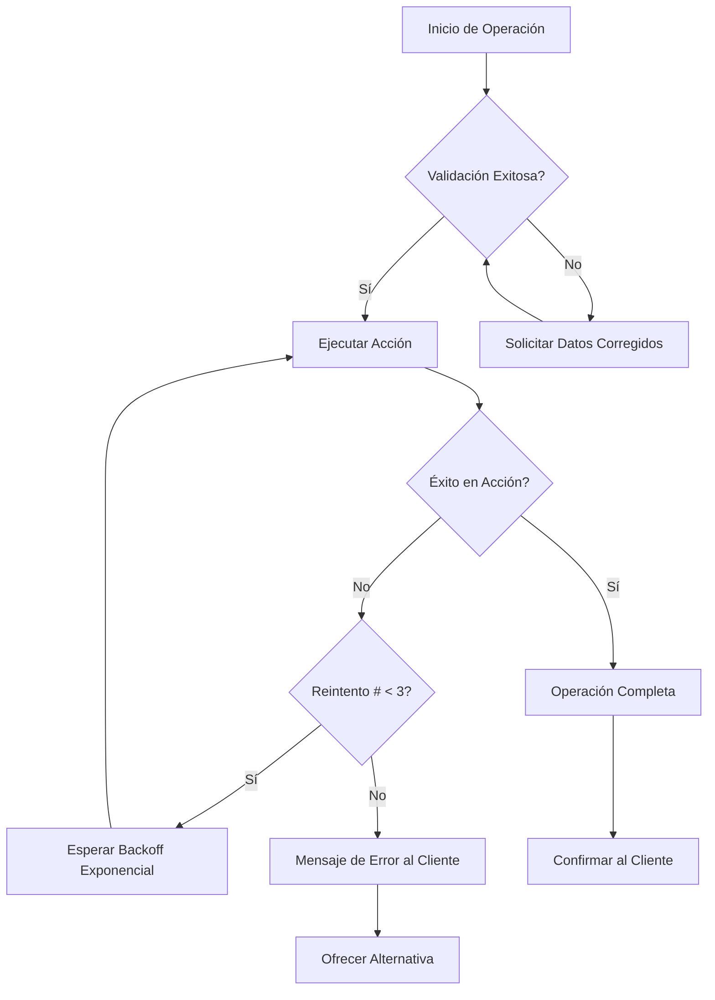

<Callout kind="info">
Esta guía forma parte del conjunto de plantillas de automatización de E-SMART360. Asegúrate de haber revisado las <a href="/recursos/plantillas-automatizacion">Plantillas de Automatización</a> antes de continuar.
</Callout>

Las integraciones entre tu agente de voz y herramientas externas pueden fallar por múltiples razones: timeouts de API, direcciones de correo inválidas, conflictos de calendario o registros duplicados en CRM. Contar con una estrategia de manejo de errores bien definida es fundamental para mantener una experiencia de usuario fluida y profesional.

En esta guía encontrarás plantillas listas para usar que cubren los escenarios de error más comunes, con mecanismos de recuperación automática y mensajes de fallback diseñados para que el cliente nunca sienta que el sistema falló.

<Callout kind="tip">
**Buenas prácticas:** Siempre registra los errores en un log para auditoría posterior. Un error que no se registra es una oportunidad perdida de mejora continua.
</Callout>

## Recuperación de Errores en Zapier

Zapier es una de las herramientas de automatización más utilizadas. El siguiente bloque de código debe añadirse como un paso **Code by Zapier** en tu integración. Este script maneja los tipos de error más frecuentes y devuelve una respuesta contextual para cada uno.

<CodeGroup>
```javascript
// Añade este código como un paso de Code by Zapier
// Gestiona errores comunes de automatización con respuestas contextuales

const handleAutomationError = (error, context) => {
  const fallbackResponses = {
    calendar_conflict: "Esa hora no está disponible. ¿Busco otro horario?",
    email_bounce: "Parece que ese correo es incorrecto. ¿Podría deletrearlo?",
    sms_failed: "Falló el envío del mensaje de texto. ¿Intento con el correo electrónico?",
    crm_duplicate: "Encontré un registro existente. Estoy actualizando su información.",
    api_timeout: "Está tomando un poco más de tiempo de lo esperado. Un momento, por favor."
  };

  return {
    esmart360_response: fallbackResponses[error.type] ||
                     "Estoy teniendo un problema técnico. ¿Puedo llamarle de nuevo en 5 minutos?",
    retry_action: error.retryable || false,
    log_error: true
  };
};
```
</CodeGroup>

<Callout kind="success">
**Uso recomendado:** Conecta este paso antes de cualquier acción crítica en tu flujo de Zapier (envío de emails, creación de eventos en calendario o registro en CRM). Así, si ocurre un error, el agente responde de forma natural sin interrumpir la conversación.
</Callout>

### Tipos de Error Soportados

| Tipo de Error | Descripción | Acción del Agente |
|---|---|---|
| `calendar_conflict` | Conflicto de horario en calendario | Ofrece buscar otro horario |
| `email_bounce` | Correo electrónico rebotado | Solicita deletrear dirección |
| `sms_failed` | Fallo en envío de SMS | Propone usar correo alternativo |
| `crm_duplicate` | Registro duplicado en CRM | Actualiza registro existente |
| `api_timeout` | Timeout en API externa | Pide esperar un momento |

### Configuración de Zapier Paso a Paso

<Steps>
<Step title="Agregar un paso Code by Zapier">
En tu flujo de Zapier, después del desencadenante (trigger) y antes de la acción principal, haz clic en **+** y selecciona **Code by Zapier** como paso intermedio.
</Step>
<Step title="Pegar el código de manejo de errores">
Copia el bloque de código proporcionado arriba. Asegúrate de que las variables `error` y `context` estén correctamente mapeadas desde los pasos anteriores de tu Zap.
</Step>
<Step title="Configurar las salidas">
Define las tres variables de salida: `esmart360_response` (texto), `retry_action` (booleano) y `log_error` (booleano). Estas se usarán en los pasos siguientes para decidir el flujo.
</Step>
<Step title="Conectar con la respuesta del agente">
Usa la salida `esmart360_response` como entrada para el mensaje que el agente de voz reproducirá al cliente. Si `retry_action` es `true`, el agente puede intentar la operación nuevamente.
</Step>
</Steps>

## Módulo de Manejo de Errores en Make.com

Make.com (antes Integromat) ofrece una arquitectura modular que permite implementar manejo de errores de forma elegante. La siguiente configuración define políticas de timeout, validación y reintento.

```json
{
  "error_handler": {
    "timeout": {
      "max_wait": 5000,
      "fallback_message": "Todavía estoy procesando su solicitud..."
    },
    "validation": {
      "email": "regex:^[a-zA-Z0-9._%+-]+@[a-zA-Z0-9.-]+\\.[a-zA-Z]{2,}$",
      "phone": "regex:^[+]?[(]?[0-9]{3}[)]?[-\\s\\.]?[0-9]{3}[-\\s\\.]?[0-9]{4,6}$",
      "date": "future_date_only"
    },
    "retry_policy": {
      "max_attempts": 3,
      "backoff": "exponential"
    }
  }
}
```

<Callout kind="info">
**Explicación de la configuración:** El módulo valida automáticamente formatos de correo electrónico, números telefónicos y fechas antes de enviar los datos a servicios externos. Si la validación falla, el agente puede solicitar datos corregidos sin llegar a ejecutar la acción problemática.
</Callout>

### Configuración del Módulo en Make.com

<Tabs>
<Tab title="Validación de Email">
Utiliza la expresión regular proporcionada para verificar que el correo electrónico tenga un formato válido antes de enviarlo. Si no coincide, el agente solicita una dirección correcta antes de continuar.
</Tab>
<Tab title="Validación de Teléfono">
La expresión regular acepta formatos internacionales con o sin código de país. Detecta números inválidos antes de intentar enviar un SMS o realizar una llamada.
</Tab>
<Tab title="Validación de Fecha">
La regla `future_date_only` garantiza que las fechas de citas o eventos sean posteriores al momento actual, evitando agendamientos en el pasado.
</Tab>
</Tabs>

### Política de Reintentos

La política de reintentos está configurada con **backoff exponencial** para evitar sobrecargar servicios externos:

<Columns cols="2">
<Card title="Intento 1" icon="one">
Espera 1 segundo antes del primer reintento.
</Card>
<Card title="Intento 2" icon="two">
Espera 2 segundos antes del segundo reintento (backoff exponencial).
</Card>
<Card title="Intento 3" icon="three">
Espera 4 segundos antes del tercer y último reintento.
</Card>
<Card title="Máximo 3 intentos" icon="shield">
Si los 3 reintentos fallan, el agente informa al cliente y ofrece una alternativa.
</Card>
</Columns>



## Integración de Manejo de Errores en Flujos Complejos

<Callout kind="tip">
**Arquitectura recomendada:** Para entornos productivos, te sugerimos implementar una capa de manejo de errores en cada punto de integración. Esto aísla los fallos y evita que un error en un servicio afecte todo el flujo de conversación.
</Callout>

Cuando trabajes con múltiples integraciones simultáneas (por ejemplo, CRM + calendario + email), es recomendable usar una arquitectura de manejo de errores por capas:

1. **Capa de validación:** Verifica formatos antes de cualquier llamada externa.
2. **Capa de ejecución:** Realiza la operación con timeout y captura de excepciones.
3. **Capa de reintento:** Aplica backoff exponencial para errores recuperables.
4. **Capa de fallback:** Proporciona una respuesta amigable al cliente si todo falla.

### Ejemplo: Flujo de Agendamiento con Manejo de Errores

```javascript
// Flujo completo de agendamiento con manejo de errores multicapa

const scheduleAppointment = async (customerData) => {
  // Capa 1: Validación
  if (!validateEmail(customerData.email)) {
    return { error: "email_invalid", message: "El formato del correo no es válido." };
  }
  if (!validatePhone(customerData.phone)) {
    return { error: "phone_invalid", message: "El formato del teléfono no es válido." };
  }

  // Capa 2: Ejecución con timeout
  try {
    const result = await createCalendarEvent(customerData, { timeout: 5000 });
    return { success: true, data: result };
  } catch (error) {
    // Capa 3: Reintento
    if (error.retryable) {
      for (let attempt = 1; attempt <= 3; attempt++) {
        await delay(Math.pow(2, attempt) * 1000);
        try {
          const result = await createCalendarEvent(customerData, { timeout: 5000 });
          return { success: true, data: result };
        } catch (retryError) {
          if (attempt === 3) {
            // Capa 4: Fallback
            return {
              error: "api_timeout",
              message: "El servicio de calendario no está disponible en este momento.",
              fallback: "¿Prefiere que le enviemos los horarios disponibles por correo?"
            };
          }
        }
      }
    }
    return { error: "unexpected", message: "Ocurrió un error inesperado." };
  }
};
```

<Callout kind="warning">
**Importante:** Siempre define un mensaje de fallback genérico como último recurso. Un "Estoy teniendo un problema técnico, ¿puedo llamarle de nuevo en 5 minutos?" es mejor que un silencio incómodo o un error técnico expuesto al cliente.
</Callout>

## Mejores Prácticas para el Manejo de Errores

<Columns cols="2">
<Card title="Registra todos los errores" icon="clipboard">
Mantén un log centralizado de errores con timestamp, tipo de error y contexto. Esto permite identificar patrones y mejorar tus integraciones.
</Card>
<Card title="Respuestas naturales" icon="message-circle">
Los mensajes de error deben sonar naturales, no técnicos. El cliente no necesita saber que hubo un "timeout de API".
</Card>
<Card title="Reintentos inteligentes" icon="refresh-cw">
No todos los errores son recuperables. Distingue entre errores transitorios (timeout) y permanentes (registro duplicado).
</Card>
<Card title="Pruebas exhaustivas" icon="check-circle">
Simula escenarios de error en tu entorno de pruebas antes de desplegar a producción. Cada tipo de error debe tener una respuesta definida.
</Card>
</Columns>

## Preguntas Frecuentes

<ExpandableGroup>
<Expandable title="¿Qué hago si mi integración con Zapier no detecta el error?" default-open="true">
<Callout kind="info">
Verifica que el paso **Code by Zapier** esté correctamente conectado entre el trigger y la acción. Además, asegúrate de que la salida `esmart360_response` esté siendo utilizada como entrada en el paso de respuesta del agente. Si el error no se captura, puede deberse a que el mapeo de variables no está completo.
</Callout>
</Expandable>
<Expandable title="¿Cómo configuro el backoff exponencial en Make.com?">
Make.com no tiene un módulo nativo de backoff exponencial, pero puedes implementarlo usando el módulo **Repeater** combinado con **Sleep**. Configura el repeater para 3 iteraciones y usa un sleep de 1000ms, 2000ms y 4000ms respectivamente. Alternativamente, puedes usar el código JSON proporcionado en esta guía dentro de un módulo **JSON Parse** para centralizar la configuración.
</Expandable>
<Expandable title="¿Puedo usar estas plantillas con herramientas distintas a Zapier y Make.com?">
Sí, absolutamente. Los principios de manejo de errores presentados aquí (validación, timeout, reintento con backoff y fallback) son universales y aplicables a cualquier plataforma de automatización como n8n, Workato, Tray.io o incluso implementaciones personalizadas con Node.js o Python. Solo necesitas adaptar la sintaxis al lenguaje de tu plataforma.
</Expandable>
<Expandable title="¿Qué tipos de errores debería manejar prioritariamente?">
Recomendamos comenzar con estos 5 tipos críticos: (1) timeouts de conexión — los más frecuentes en integraciones cloud, (2) validaciones de formato — evitan ejecutar acciones con datos incorrectos, (3) conflictos de calendario — esenciales para agendamiento, (4) duplicados en CRM — mantienen la calidad de datos, y (5) fallos de entrega de notificaciones — críticos para comunicación con clientes.
</Expandable>
<Expandable title="¿Necesitas ayuda para implementar el manejo de errores en tus agentes de voz?">
<Callout kind="alert">
Si tienes dudas sobre cómo adaptar estas plantillas a tu caso de uso específico, nuestro equipo de soporte técnico está listo para ayudarte. Escríbenos a través del portal de ayuda de E-SMART360 o consulta la sección de <a href="/recursos/guia-configuracion-rapida">configuración rápida</a> para empezar.
</Callout>
</Expandable>
</ExpandableGroup>
