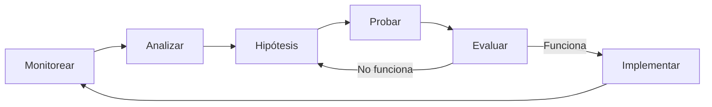

import { Callout } from 'nextra/components'
import { Steps, Step } from 'nextra/components'
import { Tabs, Tab } from 'nextra/components'
import { Columns, Card } from 'nextra/components'
import { Expandable, ExpandableGroup } from 'nextra/components'

<Callout kind="success" emoji="🎉">
¡Felicidades! Ahora que entiendes cómo funcionan los webhooks de E-SMART360, es momento de dar los siguientes pasos para maximizar el valor de tu integración. Esta guía te ayudará a escalar de forma inteligente.
</Callout>

## Tu Plan de Acción para los Próximos Días

<Steps>
<Step title="Configura tu Primera Automatización" icon="⚡">
Usa Make.com, Zapier o tu herramienta preferida para crear tu primer flujo de automatización. Conecta tu CRM, calendario o sistema de gestión con E-SMART360 para que las llamadas se disparen automáticamente basadas en eventos de tu negocio.

**Ejemplo práctico:** Configura un escenario en Make.com que:
1. Observe nuevas reservas en tu calendario
2. Extraiga los datos del cliente
3. Envíe una solicitud al webhook de E-SMART360
4. El agente llame al cliente para confirmar la cita
</Step>

<Step title="Prueba con un Conjunto Pequeño de Datos" icon="🧪">
Antes de escalar a producción completa, realiza pruebas con un conjunto limitado de contactos (10-20). Esto te permitirá:

- ✅ Verificar que la automatización funciona correctamente
- ✅ Identificar y corregir errores sin impacto masivo
- ✅ Ajustar el prompt del agente según los resultados
- ✅ Medir la tasa de éxito inicial

**Recomendación:** Usa los números de prueba (+1555000001 al +1555000099) para las primeras pruebas y luego prueba con 5-10 contactos reales antes de lanzar a gran escala.
</Step>

<Step title="Monitorea el Rendimiento de las Llamadas" icon="📊">
Utiliza el panel de análisis de E-SMART360 para monitorear:

| Métrica | Qué Indica | Objetivo Ideal |
|---------|------------|----------------|
| **Tasa de respuesta** | % de llamadas respondidas | > 60% |
| **Duración promedio** | Tiempo en la llamada | 2-5 minutos |
| **Tasa de conversión** | % que resultan en acción deseada | > 30% |
| **Transferencias a humano** | % que requieren asistencia humana | < 20% |

**Optimización:** Basado en estas métricas, ajusta:
- El prompt del agente para mejorar las respuestas
- El horario de las llamadas para aumentar la tasa de respuesta
- El workflow para reducir transferencias innecesarias

</Step>

<Step title="Expande a Múltiples Casos de Uso" icon="🚀">
Una vez que tu primera automatización esté funcionando sin problemas, expande a otros casos de uso. E-SMART360 es versátil y puede aplicarse a múltiples áreas de tu negocio:

<Columns cols="2">
<Card title="📅 Recordatorios de Citas" icon="⏰">
Reduce las inasistencias llamando automáticamente 24-48h antes de cada cita para confirmar asistencia.
</Card>
<Card title="📢 Campañas de Marketing" icon="📣">
Lanza campañas promocionales a segmentos específicos de clientes con ofertas personalizadas.
</Card>
<Card title="📋 Encuestas Post-Servicio" icon="📝">
Realiza llamadas automáticas después de un servicio para recopilar feedback y mejorar la calidad.
</Card>
<Card title="🔄 Reactivación de Clientes" icon="🔄">
Vuelve a conectar con clientes inactivos ofreciéndoles promociones especiales o novedades.
</Card>
</Columns>
</Step>

<Step title="Escala Gradualmente" icon="📈">
La clave del éxito con E-SMART360 es escalar de forma gradual e inteligente:

**Fase 1 — Fundación (Semana 1-2)**
- 1 agente, 1 caso de uso, 50-100 llamadas/día
- Enfoque: Aprender y optimizar

**Fase 2 — Expansión (Semana 3-4)**
- 2-3 agentes, 2-3 casos de uso, 200-500 llamadas/día
- Enfoque: Automatizar procesos manuales

**Fase 3 — Escala (Mes 2+)**
- Múltiples agentes, casos de uso variados, 1000+ llamadas/día
- Enfoque: Integración completa con sistemas existentes

</Step>
</Steps>

## Mejores Prácticas para Escalar

### 1. Documenta tus Automatizaciones

Mantén un registro de cada automatización que configures:

- **Propósito:** ¿Qué problema resuelve?
- **Configuración:** ¿Qué herramientas usa y cómo están conectadas?
- **Métricas:** ¿Cuáles son los indicadores de éxito?
- **Historial:** ¿Qué cambios se han hecho y por qué?

### 2. Establece Alertas

Configura notificaciones para eventos importantes:

- 📉 Caída en la tasa de respuesta por debajo del 40%
- ❌ Aumento de errores en el webhook
- 💰 Saldo de cuenta por debajo del umbral mínimo
- 🚀 Picos inesperados en el volumen de llamadas

### 3. Revisa y Optimiza Periódicamente

<Callout kind="tip" emoji="🔄">
Programa revisiones periódicas (semanal o mensual) para analizar las métricas de rendimiento y hacer ajustes. Lo que funciona hoy puede no ser óptimo mañana a medida que cambian las necesidades de tu negocio y el comportamiento de tus clientes.
</Callout>

### 4. Mantén un Flujo de Mejora Continua

## Ejemplos de Roadmaps por Industria

<Tabs>
<Tab title="Clínicas y Consultorios">

**Semana 1:** Recordatorio de citas (reduce inasistencias un 40%)

**Semana 2:** Confirmación post-consulta con encuesta de satisfacción

**Semana 3:** Promoción de servicios preventivos a pacientes inactivos

**Mes 2:** Gestión completa de agenda con integración a calendario
</Tab>
<Tab title="Servicios para el Hogar">

**Semana 1:** Confirmación de citas de servicio programadas

**Semana 2:** Seguimiento post-servicio con solicitud de reseña

**Semana 3:** Campaña de mantenimiento preventivo estacional

**Mes 2:** Outreach automatizado para clientes recurrentes
</Tab>
<Tab title="Bienes Raíces">

**Semana 1:** Seguimiento de leads después de visita a propiedad

**Semana 2:** Notificación de nuevas propiedades según preferencias

**Semana 3:** Invitación a open houses y eventos

**Mes 2:** Campaña de reactivación de leads fríos
</Tab>
</Tabs>

## Resumen

Recuerda: El poder de los webhooks de E-SMART360 reside en su simplicidad y fiabilidad.

<Columns cols="3">
<Card title="🌟 Empieza Simple" icon="🚀">
Comienza con un caso de uso y un agente. Domínalo antes de expandir.
</Card>
<Card title="🔬 Prueba a Fondo" icon="🧪">
Prueba con datos pequeños, verifica resultados, ajusta y repite.
</Card>
<Card title="📈 Escala Gradualmente" icon="📊">
Incrementa el volumen progresivamente. Monitorea cada paso del camino.
</Card>
</Columns>

<Callout kind="info" emoji="💪">
**El mejor momento para empezar es ahora.** Configura tu primer webhook, haz una prueba, y descubre cómo E-SMART360 puede transformar la comunicación con tus clientes.
</Callout>

## Preguntas Frecuentes

<ExpandableGroup>
<Expandable title="¿Cuánto tiempo toma ver resultados después de implementar la automatización?" default-open="true">
Los resultados pueden verse desde el primer día. Una vez que configures tu webhook y automatización, las llamadas comenzarán a realizarse según lo programado. Recomendamos revisar las métricas después de la primera semana para tener una muestra significativa de datos y hacer los ajustes necesarios.
</Expandable>
<Expandable title="¿Puedo cambiar de caso de uso sin afectar las automatizaciones existentes?">
Sí, puedes tener múltiples automatizaciones funcionando en paralelo sin que se afecten entre sí. Cada webhook y cada agente son independientes. Te recomendamos crear un agente y webhook separados para cada caso de uso para mantener la organización y facilitar el monitoreo.
</Expandable>
<Expandable title="¿Qué hago si mi volumen de llamadas crece más rápido de lo esperado?">
E-SMART360 está diseñado para escalar. Si anticipas un crecimiento significativo, contacta a nuestro equipo de soporte para asegurarte de que tu plan tenga la capacidad adecuada. También te recomendamos implementar sistemas de colas y límites de tasa en tu automatización para evitar picos abruptos.
</Expandable>
<Expandable title="¿Necesitas orientación para planificar tus próximos pasos?">
<Callout kind="info" emoji="🆘">
Si no estás seguro por dónde continuar después de tu configuración inicial, nuestro equipo de soporte puede ayudarte a diseñar un roadmap personalizado para tu negocio. Escríbenos a **team@e-smart360.com** con una descripción de tu negocio y tus objetivos, y te guiaremos en el proceso.
</Callout>
</Expandable>
</ExpandableGroup>
