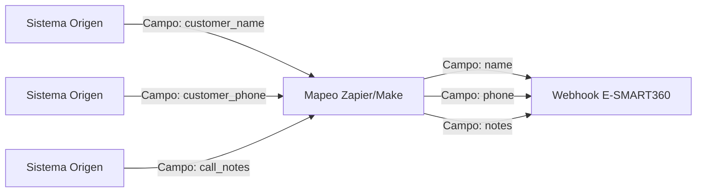
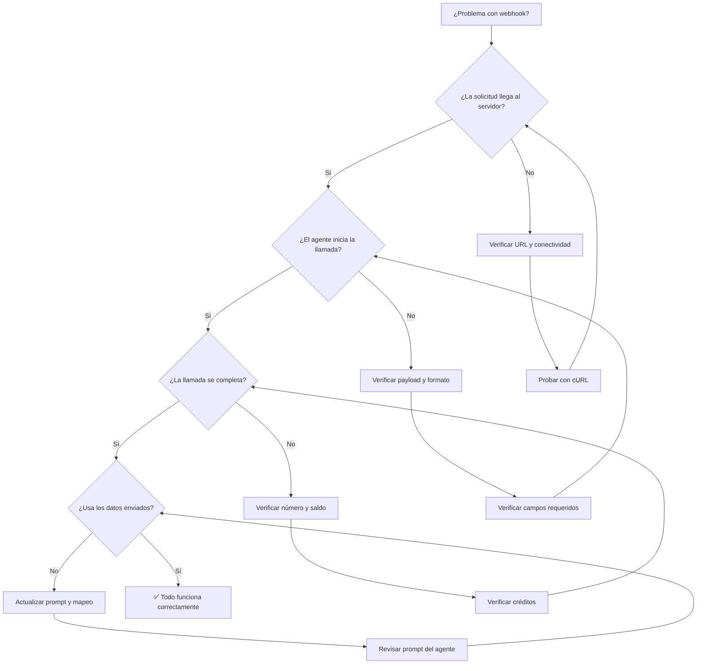

import { Callout } from 'nextra/components'
import { Steps, Step } from 'nextra/components'
import { Tabs, Tab } from 'nextra/components'
import { Columns, Card } from 'nextra/components'
import { Expandable, ExpandableGroup } from 'nextra/components'
import { CodeGroup } from 'nextra/components'

<Callout kind="danger" emoji="🔧">
Si estás teniendo problemas con tu integración de webhook o con tus agentes de voz, esta guía te ayudará a diagnosticar y resolver los problemas más comunes de forma rápida y eficiente.
</Callout>

## Problema: Las Llamadas No se Disparan

Este es uno de los problemas más frecuentes al configurar un webhook por primera vez. Si enviaste una solicitud a tu webhook pero el agente no realiza la llamada, sigue estos pasos de diagnóstico:

### Causas Posibles

<Columns cols="2">
<Card title="🔗 URL del Webhook Incorrecta" icon="❌">
La URL configurada en tu sistema de automatización no coincide exactamente con la URL proporcionada en E-SMART360. Un solo carácter incorrecto hará que la solicitud falle.
</Card>
<Card title="📋 Campos Requeridos Faltantes" icon="⚠️">
Falta el campo "name" o "phone" en el payload JSON. Estos campos son obligatorios para que el sistema procese la solicitud.
</Card>
<Card title="📞 Formato de Número Inválido" icon="📱">
El número de teléfono no incluye el código de país o tiene un formato incorrecto. Los números deben incluir el prefijo internacional (+).
</Card>
<Card title="🌐 Problemas de Conectividad" icon="🔌">
Problemas de red entre tu sistema y los servidores de E-SMART360, o firewalls que bloquean las solicitudes salientes.
</Card>
</Columns>

### Soluciones

<Tabs>
<Tab title="Verificar la URL del Webhook">
**Paso 1:** Accede al panel de E-SMART360 y navega a la configuración avanzada de tu agente.

**Paso 2:** Localiza la URL del webhook en la sección de configuración. Cópiala exactamente como aparece.

**Paso 3:** Compara la URL en tu sistema de automatización con la URL copiada. Asegúrate de que:
- No haya espacios adicionales al inicio o final
- El protocolo sea correcto (https://, no http://)
- El ID del webhook coincida exactamente

**Paso 4:** Actualiza la URL en tu sistema si es necesario y realiza una nueva prueba.
</Tab>
<Tab title="Verificar los Campos Requeridos">
Asegúrate de que tu payload JSON incluya al menos estos campos:

```json
{
  "name": "Nombre del Contacto",
  "phone": "+1234567890"
}
```

**Campos recomendados adicionales:**
- `email` — Correo electrónico del contacto
- `notes` — Notas adicionales para el agente
- `external_id` — ID de referencia externa

<Callout kind="info" emoji="ℹ️">
El campo "phone" debe ser un string, no un número. Si envías `"phone": 1234567890` (sin comillas), el sistema lo rechazará. Siempre usa formato string con el símbolo +.
</Callout>
</Tab>
<Tab title="Verificar el Formato del Número">
Los números de teléfono deben seguir el formato E.164:

| Formato Válido | Formato Inválido | Explicación |
|----------------|------------------|-------------|
| +15551234567 | 5551234567 | Falta el código de país (+) |
| +525512345678 | 55 5123 4567 | Tiene espacios |
| +34911234567 | +34 91 123 45 67 | Tiene espacios y guiones |
| +15551234567 | (555) 123-4567 | Formato no estándar |

**Solución:** Limpia el número antes de enviarlo. Elimina espacios, guiones, paréntesis y cualquier otro carácter no numérico. Mantén solo el signo + y los dígitos.
</Tab>
<Tab title="Probar con cURL">
Realiza una prueba simple usando cURL para descartar problemas de red o de configuración:

```bash
curl -X POST https://api.e-smart360.com/webhooks/agents/TU_WEBHOOK_ID/trigger \
  -H "Content-Type: application/json" \
  -d '{
    "name": "Prueba Diagnóstico",
    "phone": "+1555000001"
  }'
```

**Si la prueba con cURL funciona:** El problema está en tu sistema de automatización (Zapier, Make, etc.), no en el webhook.

**Si la prueba con cURL falla:** El problema puede estar en la URL del webhook o en la configuración del agente.
</Tab>
</Tabs>

## Problema: Las Llamadas Fallan

Si el webhook recibe la solicitud correctamente pero la llamada no se completa o falla durante la ejecución:

### Causas y Soluciones

| Síntoma | Causa Posible | Solución |
|---------|---------------|----------|
| La llamada se inicia pero se cuelga inmediatamente | Número de teléfono inválido o fuera de servicio | Verifica el número con una llamada manual |
| El agente no responde o da respuestas incoherentes | Agente no configurado correctamente | Revisa el prompt, la base de conocimiento y el workflow del agente |
| La llamada no se conecta | Saldo insuficiente en la cuenta | Verifica tus créditos en el panel de E-SMART360 |
| Error "Number not reachable" | El número está en una lista de bloqueo o es un número restringido | Revisa la configuración de bloqueo de números |
| La llamada se corta después de unos segundos | Problema con el proveedor de voz | Cambia temporalmente a otro proveedor de voz para diagnosticar |

### Verificación de Saldo

```bash title="Verificar saldo vía API (ejemplo)"
curl -s https://api.e-smart360.com/v1/account/balance \
  -H "Authorization: Bearer TU_TOKEN" \
  | jq '.balance'
```

<Callout kind="warning" emoji="💰">
Si tu saldo es insuficiente, las llamadas no se completarán. Recarga créditos desde el panel de facturación de E-SMART360 antes de continuar.
</Callout>

## Problema: Los Datos No se Están Usando

Si el webhook funciona y las llamadas se realizan, pero el agente no utiliza la información que enviaste en el payload:

### Causas Posibles

**1. La base de conocimiento del agente no referencia los datos del webhook**

El agente solo usará la información que le indiques en su prompt. Si el prompt no menciona cómo usar los campos `name`, `phone`, `notes`, etc., el agente los ignorará.

**Solución:** Actualiza el prompt de tu agente para que haga referencia explícita a los datos del webhook:

```
Eres un asistente de ventas. Cuando recibas una llamada, usa la siguiente información
del contacto:
- Nombre: {{name}}
- Notas: {{notes}}
- Email: {{email}}

Saluda al cliente por su nombre y menciona las notas relevantes durante la conversación.
```

**2. Mapeo incorrecto de campos en la herramienta de automatización**

Si usas Zapier, Make.com u otra herramienta similar, verifica que los campos de tu sistema de origen estén correctamente mapeados a los campos del webhook de E-SMART360.

**Solución:** Revisa el mapeo de campos en tu automatización:



Asegúrate de que:
- `customer_name` → se mapea a `name`
- `customer_phone` → se mapea a `phone`
- `call_notes` → se mapea a `notes`

## Problema: Errores HTTP Específicos

### Error 400 — Bad Request

```json
{
  "error": "Bad Request",
  "message": "Invalid JSON payload"
}
```

**Causa:** El payload JSON está mal formateado. Revisa que todas las comillas, llaves y corchetes estén correctamente balanceados.

**Solución:** Usa un validador JSON online o la herramienta `jq` para verificar:

```bash
echo '{"name": "Test", "phone": "+1555000001"}' | jq .
```

### Error 401 — Unauthorized

```json
{
  "error": "Unauthorized",
  "message": "Invalid webhook ID or expired token"
}
```

**Causa:** La URL del webhook contiene un ID inválido o el webhook ha expirado.

**Solución:** Regenera la URL del webhook desde el panel de configuración avanzada del agente y actualiza todos los sistemas que la utilizan.

### Error 429 — Too Many Requests

```json
{
  "error": "Too Many Requests",
  "message": "Rate limit exceeded. Please retry after 60 seconds"
}
```

**Causa:** Has enviado demasiadas solicitudes en un período corto de tiempo.

**Solución:** Implementa un sistema de colas o reduce la frecuencia de las solicitudes. El límite estándar es de 10 solicitudes por minuto por webhook.

## Guía Rápida de Diagnóstico

Sigue este flujo para diagnosticar cualquier problema:



## Preguntas Frecuentes

<ExpandableGroup>
<Expandable title="¿Cómo puedo ver si mi webhook está recibiendo solicitudes?" default-open="true">
E-SMART360 proporciona logs detallados de todas las solicitudes de webhook en el panel de administración. Ve a la sección de logs de tu agente y filtra por "webhook" para ver todas las solicitudes entrantes, incluyendo el payload recibido, la respuesta enviada y cualquier error ocurrido. Esta es la herramienta de diagnóstico más valiosa.
</Expandable>
<Expandable title="¿Puedo probar mi webhook con datos reales sin hacer llamadas reales?">
Actualmente, las pruebas con datos reales dispararán llamadas reales y consumirán créditos. Te recomendamos usar los números de prueba reservados (+1555000001 al +1555000099) para minimizar el consumo durante las pruebas. Si necesitas hacer pruebas sin consumir créditos, contacta a nuestro equipo de soporte para explorar opciones de entorno de pruebas.
</Expandable>
<Expandable title="¿Qué hago si el problema persiste después de seguir esta guía?">
Si has seguido todos los pasos de diagnóstico y el problema persiste, recopila la siguiente información antes de contactar a soporte: 1) La URL del webhook (sin exponer tokens sensibles), 2) El payload JSON que enviaste, 3) La respuesta exacta que recibiste (código HTTP y mensaje), 4) Los logs relevantes del panel de E-SMART360. Con esta información, nuestro equipo podrá diagnosticar el problema rápidamente.
</Expandable>
<Expandable title="¿Necesitas ayuda adicional para resolver un problema?">
<Callout kind="info" emoji="🆘">
Si después de seguir esta guía aún no has podido resolver tu problema, nuestro equipo de soporte técnico está listo para ayudarte. Escríbenos a **team@e-smart360.com** incluyendo los detalles de diagnóstico que hayas recopilado y te ayudaremos a resolverlo lo antes posible.
</Callout>
</Expandable>
</ExpandableGroup>
