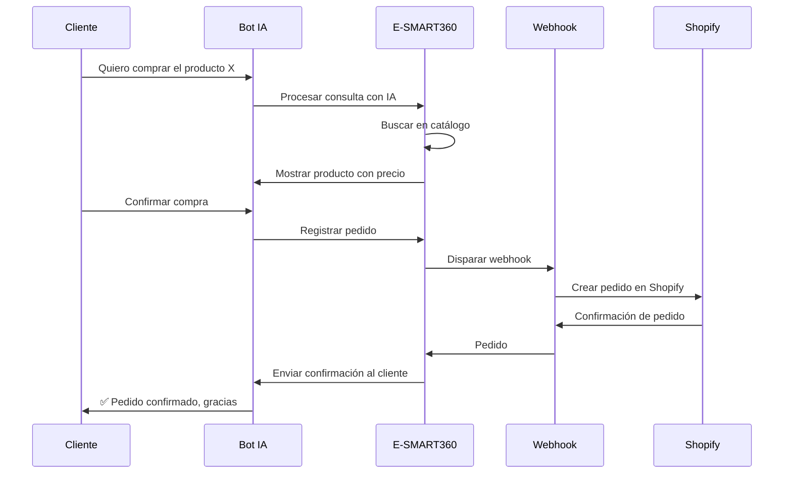

import { Callout, Steps, Step, Expandable, Columns, Card, Tabs, Tab, CodeGroup, CodeGroupItem, Update } from '/src/components/mdx';

<Update title="Actualización" date="2026-02-18">
  Esta guía ha sido actualizada con los últimos cambios en la integración de WhatsApp Cloud API, el nuevo entrenamiento de IA con URLs y archivos, y las mejores prácticas para la automatización de ventas en eCommerce.
</Update>

Tus ventas están volando. ¡Excelente! Pero tu bandeja de entrada también está volando junto con ellas. Terminas respondiendo las mismas preguntas día tras día: "¿Está en existencia?", "¿Cuál es tu política de devolución?", "¿Dónde está mi pedido?"

Cada minuto que pasas escribiendo estas respuestas es tiempo que no estás dedicando a estrategias, marketing o hacer crecer tu marca. Esta rutina manual no es solo un cuello de botella: es un asesino silencioso de tu crecimiento. Respuestas tardías, clientes frustrados y ventas que se escapan entre los dedos.

Deja de gestionar tu negocio manualmente. ¡Automatízalo! Imagina tener un asistente de ventas inteligente disponible 24/7 a través de WhatsApp, la aplicación favorita de tus clientes. Un asistente que no solo responde preguntas, sino que también muestra productos de tu catálogo de WhatsApp y guía a los clientes hasta el momento de la compra.

Esto no es una herramienta cualquiera. Es tu nueva ventaja competitiva. Y puedes construirla hoy mismo con E-SMART360.

<Callout type="success">
  Según estudios recientes, las empresas que implementan chatbots con IA en WhatsApp reducen su tiempo de respuesta en un 80% y aumentan sus tasas de conversión hasta en un 35%. La clave está en la inmediatez y la personalización. Con E-SMART360 puedes lograr estos resultados en cuestión de minutos.
</Callout>

## Por qué tu tienda en línea necesita un catálogo de WhatsApp y un chatbot con IA

El potencial en WhatsApp es enorme. Con más de 2 mil millones de usuarios activos y tasas de apertura que a menudo superan el 90%, es tu canal directo hacia los clientes. Pero la oportunidad también trae expectativas: los clientes de hoy esperan respuestas inmediatas.

Un tiempo de respuesta bajo es esencial para el éxito del negocio. Un retraso de apenas unos minutos puede marcar la diferencia entre una compra completada y un carrito abandonado. Aquí es donde la automatización del servicio al cliente realmente brilla.

Un chatbot impulsado por IA ofrece:

<Columns cols="3">
  <Card title="⚡ Gratificación instantánea">
    Responde las consultas de los clientes 24/7, incluso mientras duermes. No importa la hora del día, tu asistente siempre estará disponible para atender a cada cliente que escriba.
  </Card>
  <Card title="🎯 Precisión impecable">
    Informa al público de manera consistente y precisa sobre tus productos, políticas y envíos. Elimina los errores humanos y la información contradictoria que tanto dañan la confianza del cliente.
  </Card>
  <Card title="📈 Mayor eficiencia">
    Te permite a ti y a tu equipo concentrarse en los problemas complejos y de alto valor que requieren un toque humano. La IA maneja lo repetitivo, tu equipo maneja lo estratégico.
  </Card>
</Columns>

<Callout type="tip">
  La combinación de un chatbot con IA y tu catálogo de productos en WhatsApp crea una experiencia de compra conversacional que los clientes amarán. Cuando un cliente puede preguntar "¿Tienen zapatos rojos en talla 8?" y recibir al instante imágenes, precios y disponibilidad, la probabilidad de compra se dispara significativamente.
</Callout>

### Los 3 componentes básicos que necesitarás

Prepara tus herramientas. El proceso es sencillo y solo requiere tres cosas para empezar:

<Tabs>
  <Tab title="📱 WhatsApp Business API">
    Es lo que permite a las empresas usar WhatsApp a escala. Con la API oficial de WhatsApp Business puedes enviar mensajes programáticos, usar plantillas de mensajes, mostrar catálogos de productos y automatizar conversaciones con chatbots. No hay problema, E-SMART360 tiene una solución rápida para conectarte sin complicaciones.
  </Tab>
  <Tab title="📦 Catálogo de productos en Meta">
    Este es tu inventario digital de productos dentro del ecosistema de Meta. Lo creas en Meta Business Manager (Commerce Manager) y contiene todas las fichas de tus productos: imágenes, descripciones, precios, SKUs y disponibilidad. La IA lo usará para mostrar productos a los clientes en la conversación.
  </Tab>
  <Tab title="🤖 Cuenta de E-SMART360">
    Aquí es donde conectamos tu número de WhatsApp, tu catálogo y entrenamos el cerebro de tu asistente de IA. E-SMART360 es la plataforma unificada que orquesta toda la automatización, desde la sincronización del catálogo hasta el entrenamiento del modelo de IA y la gestión conversacional.
  </Tab>
</Tabs>

## Guía paso a paso: construye tu asistente de ventas potenciado con IA

¿Listo para poner tu servicio al cliente en piloto automático? Vamos a construir tu bot siguiendo estos pasos detallados.

### Paso 1: Configurar el catálogo en Meta Business Manager

Antes de la sincronización, debes crear un Catálogo de Meta. Este será el repositorio del cual extraerás la información de productos para mostrarlos en WhatsApp.

<Steps>
  <Step title="Accede a Commerce Manager">
    Aquí es donde te conectarás. Inicia sesión en tu Meta Business Manager y busca Commerce Manager en el menú de herramientas comerciales.
  </Step>
  <Step title="Crear un nuevo catálogo">
    Haz clic en el signo "+" para agregar un catálogo. Se abrirá un asistente de configuración. Selecciona **Comercio electrónico** como tipo de catálogo, ya que tu negocio se dedica a la venta de productos. Haz clic en "Siguiente" para continuar.
  </Step>
  <Step title="Configurar los ajustes del catálogo">
    Selecciona un método para subir productos. "Subir información de productos" es un buen punto de partida, aunque también puedes conectarte a plataformas asociadas como Shopify o WooCommerce mediante un píxel. Especifica la cuenta que será propietaria del catálogo y asígnale un nombre descriptivo, como "Tienda_Online".
  </Step>
  <Step title="Agregar productos al catálogo">
    Después de crear el catálogo, ve a la página "Productos" y selecciona "Agregar productos". Tienes varios métodos disponibles:
    - **Conectar con seguimiento**: Usa el píxel de Meta para agregar automáticamente productos de tu sitio web según la interacción de los usuarios.
    - **Fuente de datos**: Sube una hoja de cálculo con los detalles de los productos. Es ideal para inventarios grandes.
    - **Agregar productos manualmente**: Óptimo para pocos productos. Debes ingresar el título, la descripción, las imágenes, el precio y asignar una ID de contenido (SKU) a cada producto.
  </Step>
</Steps>

<Callout type="info">
  **Importante**: Si utilizas Shopify o WooCommerce, puedes conectar tu tienda directamente a Meta Commerce Manager para sincronizar automáticamente los productos, precios y existencias sin necesidad de subir archivos manualmente. Esta integración bidireccional mantiene tu catálogo siempre actualizado en tiempo real.
</Callout>

### Paso 2: Conectar tu cuenta de WhatsApp y asignar el catálogo

En este paso debes vincular el canal de comunicación (WhatsApp) con el inventario de productos (el catálogo que acabas de crear).

<Steps>
  <Step title="Accede a la configuración empresarial">
    En tu Meta Business Manager, ve a Configuración empresarial > Cuentas de WhatsApp. Aquí verás todas las cuentas de WhatsApp Business asociadas a tu negocio.
  </Step>
  <Step title="Selecciona tu cuenta de WhatsApp">
    Identifica la cuenta de WhatsApp Business donde deseas continuar y actívala si es necesario. Asegúrate de que sea la cuenta principal de tu negocio.
  </Step>
  <Step title="Accede al WhatsApp Manager">
    En la cuenta de WhatsApp, selecciona la pestaña "Configuración" y luego ve a "WhatsApp Manager". Esto abrirá el panel de administración de WhatsApp Business.
  </Step>
  <Step title="Vincula tu catálogo">
    Ve a la sección "Catálogo". En el menú desplegable, selecciona el catálogo que configuraste en el Paso 1. Asegúrate de elegir el correcto si tienes varios catálogos configurados.
  </Step>
  <Step title="Conectar y verificar">
    Haz clic en "Conectar catálogo". Esto permite que el número de WhatsApp vinculado pueda ver y compartir productos del catálogo conectado. Verifica que aparezca como conectado correctamente antes de continuar al siguiente paso.
  </Step>
</Steps>

<Callout type="warning">
  Asegúrate de que el catálogo esté correctamente vinculado antes de continuar. Si no ves tu catálogo en el menú desplegable, verifica que hayas creado el catálogo en la misma cuenta de Meta Business Manager donde gestionas tu WhatsApp Business. Un error común es tenerlos en cuentas diferentes de Meta.
</Callout>

### Paso 3: Sincronizar tu tienda en línea con E-SMART360

Una vez que hayas configurado Meta, puedes transferir la configuración a E-SMART360.

<Steps>
  <Step title="Inicia sesión en E-SMART360">
    Ingresa al panel principal de E-SMART360 con tus credenciales. Si aún no tienes una cuenta, puedes crear una en pocos minutos desde la página principal.
  </Step>
  <Step title="Conecta tu cuenta de WhatsApp">
    Navega a la sección "Conectar cuenta" desde el menú lateral. Selecciona el bot de WhatsApp y sigue las instrucciones para sincronizar tu cuenta de WhatsApp Business. El proceso es guiado paso a paso.
  </Step>
  <Step title="Sincroniza el catálogo de productos">
    En la sección del menú, haz clic en "WhatsApp" y luego en "Catálogo de comercio electrónico". Selecciona la cuenta de WhatsApp correspondiente y haz clic en el botón "Sincronizar". E-SMART360 utilizará Meta Business Manager para obtener los productos del catálogo conectado automáticamente.
  </Step>
</Steps>

Tan pronto como los productos estén sincronizados, estarán listos en E-SMART360 para usarse en flujos de chat automatizados con los clientes. Puedes verificar que los productos aparecen correctamente en el panel de gestión de catálogos.

### Paso 4: Crear el "cerebro" de tu IA (los datos de entrenamiento)

Tu chatbot con IA es inteligente, pero debe aprender sobre tu negocio y productos en particular. Un documento de preguntas frecuentes (FAQ) es el método más efectivo para lograr este objetivo.

Piensa en las 10 a 20 preguntas principales que respondes cada día. Escríbelas en un documento con preguntas y respuestas. Por ejemplo:

<Tabs>
  <Tab title="📝 FAQ para tienda de ropa">
    <CodeGroup>
      <CodeGroupItem title="faq-ropa.txt">
```text
Pregunta: ¿De qué material están hechas tus camisetas?
Respuesta: Nuestras camisetas premium están hechas de algodón 100% ring-spun para una sensación suave y cómoda.

Pregunta: ¿Cómo funciona tu política de devolución?
Respuesta: Ofrecemos una política de devolución de 30 días sin hacer preguntas. Si no estás satisfecho, contáctanos para un reembolso completo o cambio.

Pregunta: ¿Hacen envíos internacionales?
Respuesta: ¡Sí, enviamos a todo el mundo! Los costos de envío dependen de tu ubicación y se calculan al finalizar la compra.

Pregunta: ¿Cuánto tarda en llegar mi pedido?
Respuesta: Los envíos nacionales tardan de 3 a 5 días hábiles. Los envíos internacionales pueden tardar de 7 a 14 días hábiles.

Pregunta: ¿Aceptan pagos contra entrega?
Respuesta: Sí, aceptamos pagos contra entrega en zonas seleccionadas. Verifica la disponibilidad durante el proceso de compra.

Pregunta: ¿Tienen descuentos por compras al por mayor?
Respuesta: Sí, ofrecemos descuentos progresivos: 5% en compras de 3 a 5 unidades, 10% en compras de 6 a 10 unidades y 15% en compras de más de 10 unidades.
```
      </CodeGroupItem>
    </CodeGroup>
  </Tab>
  <Tab title="📝 FAQ para tienda de electrónica">
    <CodeGroup>
      <CodeGroupItem title="faq-electronica.txt">
```text
Pregunta: ¿Qué laptop recomiendas para edición de video?
Respuesta: Recomendamos laptops con al menos 16 GB de RAM, procesador Intel i7 o superior y tarjeta gráfica dedicada. Nuestra línea ProEdit cumple con estos requisitos.

Pregunta: ¿Tienen garantía tus productos?
Respuesta: Todos nuestros productos tienen garantía de 1 año contra defectos de fábrica. Ofrecemos extensiones de garantía de hasta 3 años.

Pregunta: ¿Aceptan tarjetas de crédito?
Respuesta: Sí, aceptamos todas las tarjetas de crédito y débito principales, además de PayPal, transferencia bancaria y pagos en cuotas sin interés.

Pregunta: ¿Hacen envíos a todo el país?
Respuesta: Sí, realizamos envíos a todo el territorio nacional con un tiempo de entrega de 2 a 7 días hábiles dependiendo de la ubicación.

Pregunta: ¿Puedo cancelar mi pedido?
Respuesta: Puedes cancelar tu pedido dentro de las primeras 24 horas después de realizada la compra sin ningún costo adicional.
```
      </CodeGroupItem>
    </CodeGroup>
  </Tab>
</Tabs>

<Callout type="tip">
  Tu bot se volverá más inteligente cuanto más completo y detallado sea este documento. Incluye variaciones de las mismas preguntas para que la IA reconozca diferentes formas de preguntar lo mismo. Por ejemplo: "¿Cuándo llega mi pedido?" y "¿Cuál es el tiempo de entrega?" deberían tener respuestas consistentes entre sí.
</Callout>

#### Métodos de entrenamiento adicionales con IA

Además de las FAQ manuales, E-SMART360 te permite entrenar a tu asistente de IA de tres formas adicionales para que tenga un conocimiento más completo de tu negocio:

<Columns cols="3">
  <Card title="🔗 Entrenamiento por URL">
    Proporciona la URL de una página de tu sitio web (políticas de envío, preguntas frecuentes, guías de productos, términos y condiciones) y la IA extraerá automáticamente el contenido relevante para entrenarse. Solo necesitas pegar el enlace y seleccionar el tipo de selector (ID o Class) basado en la estructura de la página web.
  </Card>
  <Card title="📄 Entrenamiento por archivo">
    Sube archivos PDF, Word (.doc) o TXT con información detallada de tu negocio. La IA procesará el documento completo y extraerá el conocimiento necesario. Puedes elegir entre "Generar respuesta completa" para respuestas detalladas o "Generar FAQ" para dividir el contenido en preguntas y respuestas estructuradas.
  </Card>
  <Card title="📊 FAQ estructurada">
    El formato más eficiente y económico en tokens. Carga tus preguntas y respuestas en un formato estructurado para respuestas rápidas y precisas. Es ideal para información concreta como políticas de devolución, horarios de atención, precios y especificaciones técnicas de productos.
  </Card>
</Columns>

### Paso 5: Entrenar y activar tu IA en E-SMART360

Cuando tu material de entrenamiento esté listo, ¡ya puedes construir tu IA! Sigue estos pasos para crear y activar tu asistente inteligente:

<Steps>
  <Step title="Crear una campaña de entrenamiento de IA">
    Ve al área de entrenamiento de IA en E-SMART360: Dashboard > Configuración > Campaña de entrenamiento de IA. Haz clic en "Crear" para iniciar una nueva campaña. Ponle un nombre descriptivo como "FAQ Tienda Principal" y define un mensaje de presentación que establezca el rol y tono de tu asistente virtual. Por ejemplo: "Eres un asistente de ventas amigable y profesional para una tienda de ropa en línea."
  </Step>
  <Step title="Cargar los datos de entrenamiento">
    Ahora tienes varias opciones para alimentar a tu IA: copia el contenido de preguntas y respuestas que creaste en el paso anterior en el campo de datos de entrenamiento. También puedes cargar URLs de tu sitio web o subir archivos PDF, Word o TXT. Selecciona el modo de procesamiento que prefieras:
    - **Resumen**: Proporciona respuestas ricas y sensibles al contexto, pero consume más tokens.
    - **FAQ**: Formato rentable y estructurado para respuestas rápidas y precisas con menor consumo de tokens.
    Guarda la campaña cuando hayas terminado de cargar toda la información.
  </Step>
  <Step title="Configurar el comportamiento de la IA">
    Dentro del gestor de bots de E-SMART360, encontrarás opciones para afinar cómo responde tu asistente:
    - **Respuesta sin coincidencia (No Match Reply)**: Configura qué hacer cuando el bot no encuentra una respuesta exacta. Puedes vincular la campaña de IA como respaldo para estos casos.
    - **Tono y personalidad**: Ajusta el prompt predeterminado para definir cómo se comunica tu bot: formal, casual, divertido, profesional, etc.
    - **Límites de tokens**: Controla la longitud máxima de las respuestas para mantener conversaciones ágiles y naturales.
  </Step>
  <Step title="Activar la IA en el bot de WhatsApp">
    Dentro del gestor de bots de E-SMART360, busca la opción "Asistente de IA". Actívalo con el interruptor correspondiente y selecciona la campaña de entrenamiento que creaste desde el menú desplegable. Luego elige el modo de respuesta que prefieras:
    - **Asistente de IA para todas las consultas**: La IA maneja cada pregunta que los clientes envían al número de WhatsApp.
    - **IA como respaldo opcional**: La IA interviene solo cuando las reglas predefinidas (palabras clave, flujos condicionales) no encuentran una coincidencia.
    Guarda los cambios. ¡Tu IA ya está activa y lista para ayudar a los clientes!
  </Step>
</Steps>

<Callout type="success">
  Tu asistente de IA ahora está funcionando. Cada vez que un cliente pregunte algo relacionado con tu negocio, el bot responderá en tiempo real con la información exacta que le proporcionaste. Cuando sea apropiado, recuperará productos de tu catálogo sincronizado para mostrarlos en la conversación con imágenes, precios y descripciones detalladas.
</Callout>

### Configuración avanzada del comportamiento de la IA

Para sacar el máximo provecho de tu asistente virtual, E-SMART360 ofrece opciones avanzadas de configuración que te permiten personalizar cada aspecto de la interacción:

<Expandable title="Configurar respuesta cuando no hay coincidencia (No Match Reply)">
  Si el chatbot no puede encontrar una coincidencia para la consulta del usuario, puedes configurarlo para que responda con la IA entrenada en lugar de dar una respuesta genérica automática:
  1. Ve a Gestor de Bots > Botones de acción > Sin coincidencia.
  2. Selecciona "Respuesta de IA" en el menú de acciones disponibles.
  3. Vincula la campaña de IA entrenada que creaste anteriormente.
  4. Habilita la opción "Respuesta sin coincidencia" en la sección de configuración.
  5. Guarda los cambios.
  De esta forma, incluso si la consulta no coincide exactamente con una regla predefinida, la IA utilizará su entrenamiento completo para ofrecer una respuesta útil y relevante al cliente.
</Expandable>

<Expandable title="Integrar con bandeja compartida para escalar a humanos">
  La función "Asignar miembro del equipo o agente por IA" garantiza que las consultas complejas se envíen automáticamente al miembro del equipo adecuado. Esta integración mejora significativamente la experiencia del cliente porque combina lo mejor de ambos mundos:
  - **Escalado inteligente**: La IA detecta cuándo un usuario necesita ayuda humana (por ejemplo, cuando el cliente escribe "Necesito hablar con una persona" o "Estoy frustrado") y asigna la conversación automáticamente al agente correcto.
  - **Colaboración eficiente**: Los miembros del equipo pueden ver y responder a las consultas escaladas en tiempo real desde la bandeja compartida, asegurando transiciones suaves entre IA y humano sin perder el contexto.
  - **Mejor experiencia del cliente**: La IA maneja consultas rutinarias mientras los agentes humanos se enfocan en problemas complejos, entregando soporte rápido y personalizado en todo momento.
  - **Sin pérdida de contexto**: Cuando una conversación se escala a un humano, el agente ve todo el historial completo de la conversación previa con la IA, evitando que el cliente tenga que repetir información.
</Expandable>

<Expandable title="Usar el Asistente de IA en múltiples canales">
  E-SMART360 no se limita solo a WhatsApp. El mismo asistente de IA que entrenaste puede funcionar simultáneamente en múltiples canales de comunicación:
  - **WhatsApp**: El canal principal para ventas conversacionales y atención al cliente.
  - **Facebook Messenger**: Ideal para captar leads desde tu página de Facebook empresarial.
  - **Instagram DM**: Perfecto para tiendas visuales que reciben consultas directamente por Instagram.
  - **Telegram**: Canal adicional útil para mercados donde Telegram tiene alta penetración.
  - **Chat de sitio web**: El mismo asistente inteligente integrado directamente en tu tienda en línea.
  La gran ventaja es que entrenas una sola vez y tu IA trabaja en todos los canales donde están tus clientes, manteniendo consistencia en las respuestas.
</Expandable>

## Cómo funciona en la práctica y gestión de pedidos

Para usar tu nuevo asistente de IA, debes usar WhatsApp Web en el navegador, ya que la aplicación de escritorio oficial de WhatsApp no admite la visualización del catálogo de productos en el chat de escritorio de forma nativa.

Envía un mensaje a tu número de negocio y prueba hacer una de las preguntas entrenadas, o pregunta sobre un producto específico. La IA te responderá en tiempo real y, cuando sea adecuado, recuperará el producto del catálogo sincronizado para mostrarlo al cliente con su imagen, precio y descripción detallada.

<Callout type="info">
  Todos los pedidos y conversaciones que el bot inicie se capturan y gestionan desde el panel central de E-SMART360, proporcionándote una vista única de todas tus actividades automatizadas de ventas y soporte al cliente. Esta automatización de comercio electrónico puede acortar drásticamente tu tiempo de respuesta y organizar tus interacciones con los clientes de manera eficiente y profesional.
</Callout>

### Automatización de conversaciones de ventas

Una vez que tu chatbot esté activo, manejará automáticamente las consultas de los clientes, sugerirá productos relevantes y los guiará a través del proceso de compra completo. Puedes guardar el flujo de tu chatbot y activarlo en el constructor de flujos para interactuar con los clientes de manera estructurada y predecible.

<Columns cols="2">
  <Card title="🛒 Ejemplo: Cliente preguntando por un producto">
    **Cliente**: "Hola, ¿tienen camisetas negras disponibles?"<br/><br/>
    **Bot**: "¡Hola! 😊 Sí, tenemos camisetas negras disponibles en varios estilos. Aquí te muestro algunas opciones:"<br/><br/>
    *[El bot envía 3 productos del catálogo con imágenes, precios y descripciones]*<br/><br/>
    **Bot**: "¿Te gusta alguna en particular? Puedo ayudarte con la talla y el proceso de compra."<br/><br/>
    **Cliente**: "Me gusta la básica, ¿tienen en talla M?"<br/><br/>
    **Bot**: "Sí, tenemos la camiseta negra básica en talla M. El precio es $19.99. ¿Te gustaría proceder con la compra? Puedo pasarte los datos de pago para completar tu pedido."<br/><br/>
    **Cliente**: "Sí, adelante."<br/><br/>
    **Bot**: "Perfecto. Para procesar tu pedido necesito confirmar tu dirección de envío. ¿Podrías proporcionármela?"
  </Card>
  <Card title="📦 Ejemplo: Seguimiento de pedido">
    **Cliente**: "¿Dónde está mi pedido #12345?"<br/><br/>
    **Bot**: "Déjame verificar el estado de tu pedido #12345..."<br/><br/>
    *[El bot consulta el sistema de gestión de pedidos a través de la API y responde]*<br/><br/>
    **Bot**: "Tu pedido #12345 está actualmente en tránsito. Fue enviado el 15 de febrero y la fecha estimada de entrega es el 18 de febrero. Puedes hacer clic aquí para rastrearlo: [enlace de seguimiento]. ¿Necesitas algo más?"<br/><br/>
    **Cliente**: "Gracias, eso es todo."<br/><br/>
    **Bot**: "¡De nada! Si tienes más preguntas en el futuro, estoy aquí para ayudarte. Que tengas un excelente día 🎉"
  </Card>
</Columns>

### Creación de flujos conversacionales avanzados con el gestor de bots

Más allá de las respuestas automáticas básicas, E-SMART360 te permite diseñar flujos conversacionales complejos que guían al cliente a través de experiencias de compra completas y personalizadas.

#### Componentes básicos de un flujo conversacional

<Columns cols="2">
  <Card title="🎯 Palabras clave y disparadores">
    Define palabras clave específicas que activan respuestas o flujos determinados. Por ejemplo, si un cliente escribe "catálogo", "productos" o "comprar", el bot puede iniciar automáticamente el flujo de presentación de productos.<br/><br/>
    **Ejemplo**: Palabras clave "horario", "abierto", "cuándo atienden" → disparan la respuesta con el horario de atención de la tienda.
  </Card>
  <Card title="🔀 Flujos condicionales">
    Crea ramificaciones inteligentes donde la respuesta del bot depende de lo que el cliente haya respondido anteriormente. Esto permite personalizar la experiencia en tiempo real.<br/><br/>
    **Ejemplo**: "¿Buscas ropa de hombre o mujer?" Si el cliente responde "hombre", el bot muestra productos masculinos; si responde "mujer", muestra productos femeninos.
  </Card>
  <Card title="🏷️ Etiquetado y segmentación">
    Cada interacción puede etiquetar automáticamente al cliente según sus respuestas e intereses. Estas etiquetas permiten segmentar tu audiencia para campañas de marketing dirigidas.<br/><br/>
    **Ejemplo**: Cliente que pregunta por ofertas → etiqueta "interesado_en_ofertas". Cliente que compra → etiqueta "cliente_recurrente".
  </Card>
  <Card title="📊 Variables de conversación">
    Guarda información que el cliente proporciona durante la conversación para usarla más adelante: nombre, producto de interés, presupuesto, dirección, etc. Estas variables se pueden usar para personalizar mensajes y crear experiencias únicas.<br/><br/>
    **Ejemplo**: El bot pregunta el nombre y luego usa "{{nombre}}" en todas las respuestas siguientes: "Gracias {{nombre}}, he registrado tu pedido."
  </Card>
</Columns>

#### Ejemplo de flujo avanzado: Asistente de ventas completo

A continuación se muestra un ejemplo de cómo estructurar un flujo conversacional completo para ventas utilizando el gestor de bots de E-SMART360:

<Steps>
  <Step title="Disparador: Saludo inicial">
    Cuando un cliente escribe cualquier mensaje, el bot responde con un saludo amigable y ofrece opciones claras: "¡Hola! 👋 Bienvenido a [nombre de tienda]. ¿En qué puedo ayudarte hoy? Escribe el número de la opción que prefieras: 1 - Ver catálogo de productos, 2 - Consultar estado de pedido, 3 - Hablar con un asesor."
  </Step>
  <Step title="Captura de información del cliente">
    Antes de mostrar productos, el bot puede hacer preguntas de calificación: "¿Qué tipo de producto te interesa?", "¿Cuál es tu presupuesto aproximado?", "¿Es para uso personal o regalo?" Las respuestas se guardan como variables y etiquetas en el perfil del cliente.
  </Step>
  <Step title="Presentación inteligente de productos">
    Basado en las respuestas del cliente, el bot presenta productos relevantes del catálogo sincronizado. Si hay varios productos, puede enviarlos en un carrusel multimedia o preguntar primero por categorías para refinar la búsqueda.
  </Step>
  <Step title="Manejo de objeciones y preguntas frecuentes">
    Cuando el cliente tiene dudas sobre el producto (talla, color, disponibilidad, envío), la IA entrenada responde automáticamente con información precisa. Esta es una de las funciones más valiosas del asistente: nunca deja una pregunta sin responder.
  </Step>
  <Step title="Cierre de venta con confirmación">
    Cuando el cliente está listo para comprar, el bot confirma todos los detalles: producto, cantidad, precio total, dirección de envío y método de pago. Una vez confirmado, registra el pedido y envía un mensaje de confirmación con el número de seguimiento.
  </Step>
  <Step title="Post-venta y seguimiento">
    Después de la compra, el bot envía automáticamente actualizaciones del estado del pedido, solicita feedback y ofrece productos complementarios. También puede programar recordatorios de reposición para productos consumibles.
  </Step>
</Steps>

<Callout type="info">
  El gestor de bots de E-SMART360 te permite visualizar y editar estos flujos mediante una interfaz visual de arrastrar y soltar, sin necesidad de programar. Puedes ver el flujo completo de principio a fin como un diagrama interactivo, agregar nuevas ramificaciones fácilmente y modificar respuestas en cualquier momento sin interrumpir el funcionamiento del bot ni afectar las conversaciones activas.
</Callout>

#### Diferencias entre el modo IA total vs. IA como respaldo

Es importante entender las dos formas principales en que puede operar tu asistente de ventas con IA en E-SMART360:

<Columns cols="2">
  <Card title="🤖 Modo: IA para todas las consultas">
    En este modo, la inteligencia artificial maneja cada mensaje que los clientes envían a tu número de WhatsApp. Esto significa que todas las conversaciones pasan primero por la IA entrenada, que analiza el mensaje, busca la mejor respuesta basada en su entrenamiento (FAQ, URLs, archivos) y responde de forma autónoma.<br/><br/>
    **Ideal para**: Negocios que quieren automatización completa, startups con recursos humanos limitados, o empresas que reciben un alto volumen de consultas similares. La IA aprende y mejora con cada interacción.
  </Card>
  <Card title="🔄 Modo: IA como respaldo (fallback)">
    Aquí, el bot primero intenta responder usando reglas predefinidas, palabras clave y flujos condicionales que hayas creado manualmente. Solo cuando no encuentra una coincidencia exacta en las reglas, la IA entrenada interviene para proporcionar una respuesta inteligente basada en su conocimiento.<br/><br/>
    **Ideal para**: Negocios que ya tienen flujos de bot manuales establecidos y quieren complementarlos con IA, o empresas que necesitan control granular sobre respuestas específicas mientras delegan lo imprevisto a la IA.
  </Card>
</Columns>

<Callout type="tip">
  **Recomendación**: Si estás empezando, usa el modo "IA para todas las consultas" para maximizar la automatización. A medida que identifiques patrones y necesites respuestas muy específicas para ciertas palabras clave, puedes complementar con reglas manuales y cambiar al modo "IA como respaldo" para tener un control más fino.
</Callout>

### Enviar catálogos de productos con carruseles multimedia

Para hacer la experiencia de compra aún más atractiva y visual, E-SMART360 te permite crear y enviar plantillas de carrusel con múltiples productos en un solo mensaje deslizable:

<Steps>
  <Step title="Crear una plantilla de carrusel">
    En el panel de E-SMART360, ve a Gestor de Bots > Plantillas de mensajes y haz clic en "Crear". Selecciona "Plantilla de carrusel multimedia" como tipo de plantilla. Nombra tu plantilla de forma descriptiva y selecciona "Marketing" como categoría para la aprobación de WhatsApp.
  </Step>
  <Step title="Configurar las tarjetas del carrusel">
    Para cada tarjeta del carrusel, agrega un encabezado multimedia (puede ser imagen o video), el texto del cuerpo descriptivo y hasta dos botones de acción por tarjeta. Puedes elegir entre botones de URL (para enlazar directamente a la página del producto) o botones de respuesta rápida (para que el cliente pueda responder con un clic sin escribir). Es fundamental mantener el mismo orden y tipo de botones en todas las tarjetas.
  </Step>
  <Step title="Usar productos del catálogo automáticamente">
    Si tienes tu tienda en línea conectada y sincronizada, puedes seleccionar productos directamente desde tu catálogo en lugar de agregar imágenes manualmente. Esto ahorra tiempo y garantiza que la información de precios, disponibilidad y descripciones esté siempre actualizada y sincronizada con tu inventario real.
  </Step>
  <Step title="Enviar para aprobación y activar">
    Una vez creada la plantilla, envíala para aprobación de WhatsApp. La revisión generalmente toma entre 24 y 48 horas. Una vez aprobada, ve a la sección de flujos del bot, agrega una palabra clave y vincula tu plantilla de carrusel. Cuando un cliente escriba esa palabra clave, el carrusel con tus productos aparecerá automáticamente en la conversación.
  </Step>
</Steps>

<Callout type="tip">
  **Consejos para carruseles efectivos:**
  - Usa imágenes de alta calidad que llamen la atención del cliente inmediatamente
  - Mantén el texto breve, directo y fácil de leer en dispositivos móviles
  - Agrega llamadas a la acción (CTA) convincentes como "Ver producto", "Comprar ahora" u "Obtener oferta"
  - Usa el mismo diseño, formato y orden de botones en todas las tarjetas para mantener la consistencia visual
  - Prueba el carrusel exhaustivamente antes de enviarlo a tus clientes para asegurarte de que todo funcione correctamente
  - Los carruseles que incluyen video pueden aumentar el engagement hasta un 40% más que los que solo usan imágenes estáticas
</Callout>

## Secuencia de ventas automatizada

Puedes configurar secuencias de ventas completas para hacer seguimiento automático con clientes potenciales que aún no han realizado una compra o que necesitan un empujón adicional. Una secuencia típica de ventas automatizada podría verse así:

<Steps>
  <Step title="Mensaje de bienvenida y calificación del cliente">
    Cuando un cliente envía un mensaje por primera vez a tu número de WhatsApp, el bot responde inmediatamente con un saludo personalizado y amigable. La IA hace preguntas estratégicas para entender qué busca exactamente el cliente: tipo de producto de interés, presupuesto aproximado, urgencia de la compra. Toda esta información valiosa se guarda automáticamente como etiquetas en el perfil del cliente dentro de E-SMART360 para segmentación y seguimiento futuro.
  </Step>
  <Step title="Presentación inteligente de productos con el catálogo">
    Basado en las respuestas y preferencias del cliente, la IA selecciona inteligentemente los productos más relevantes del catálogo sincronizado y los presenta en la conversación de forma natural. Dependiendo de la cantidad de productos que coincidan, puede enviarlos uno por uno con sus detalles completos o usando la plantilla de carrusel para mostrar varios productos a la vez de forma visual y atractiva.
  </Step>
  <Step title="Seguimiento programado post-contacto">
    Si el cliente muestra interés pero no compra de inmediato, el sistema puede enviar mensajes de seguimiento automáticos en intervalos predefinidos y estratégicos:
    - **A las 24 horas**: "Hola [nombre], ¿tuviste oportunidad de revisar los productos que te mostré anteriormente? ¿Te quedó alguna duda?"
    - **A los 3 días**: "Tenemos una oferta especial en [producto] por tiempo limitado. ¿Te gustaría aprovecharla?"
    - **A la semana**: "¿Hay algo más en lo que pueda ayudarte? Estoy aquí para lo que necesites, cuando lo necesites."
    Estos mensajes de seguimiento se envían utilizando plantillas de mensaje previamente aprobadas por WhatsApp para cumplir con todas las políticas de la plataforma.
  </Step>
  <Step title="Cierre de venta y escalado inteligente a humano">
    Cuando el cliente está listo y decidido a comprar, la IA guía todo el proceso de cierre: confirma el producto exacto, la cantidad deseada, la dirección de envío y el método de pago preferido. Si la compra requiere intervención humana (productos personalizados, cotizaciones especiales, pago manual), la conversación se escala automáticamente a un agente humano con todo el contexto completo de la conversación previa, sin que el cliente tenga que repetir nada.
  </Step>
</Steps>

<Callout type="info">
  Las secuencias de ventas automatizadas son especialmente efectivas para recuperar carritos abandonados. E-SMART360 se integra nativamente con plataformas como Shopify y WooCommerce para detectar en tiempo real cuándo un cliente abandona un carrito de compras y enviarle automáticamente un recordatorio personalizado por WhatsApp con los productos específicos que dejó pendientes y un enlace directo para completar la compra.
</Callout>

### Beneficios de usar E-SMART360 para ventas en WhatsApp

<Columns cols="3">
  <Card title="🔄 Compromiso sin esfuerzo">
    Automatiza respuestas instantáneas a las consultas de los clientes sin importar la hora del día o la cantidad de conversaciones activas. Tu asistente maneja múltiples conversaciones simultáneamente, reduciendo los tiempos de espera de tus clientes a cero.
  </Card>
  <Card title="🎯 Recomendaciones personalizadas">
    Basado en las preferencias explícitas y el historial de navegación del cliente, la IA sugiere productos relevantes que aumentan significativamente las probabilidades de compra. Cada interacción con el cliente hace que las recomendaciones sean más inteligentes y precisas.
  </Card>
  <Card title="📈 Escalabilidad total del negocio">
    Tu asistente de ventas puede atender a cientos de clientes al mismo tiempo sin perder calidad ni consistencia en las respuestas. Lo que antes requería un equipo completo de 10 personas ahora lo maneja una sola IA, permitiendo que tu negocio crezca sin límites.
  </Card>
</Columns>

## Casos de uso prácticos para diferentes industrias

<Columns cols="2">
  <Card title="👕 Ropa y moda">
    **Escenario**: Una tienda de ropa recibe decenas de consultas diarias sobre tallas, disponibilidad de colores y políticas de envío.<br/><br/>
    **Solución**: El chatbot de IA responde automáticamente sobre tallas disponibles y existencia de colores. Cuando un cliente pregunta por "vestidos rojos talla M", la IA busca en el catálogo sincronizado y muestra las opciones disponibles con imágenes, precios y variantes. El cliente puede seleccionar y comprar directamente desde el chat de WhatsApp sin salir de la aplicación.<br/><br/>
    **Resultado**: Reducción del 70% en consultas repetitivas al equipo de soporte y aumento del 25% en ventas gracias a las recomendaciones automatizadas y la disponibilidad 24/7.
  </Card>
  <Card title="💻 Electrónica y tecnología">
    **Escenario**: Una tienda de electrónica necesita explicar especificaciones técnicas complejas de sus productos y ayudar a los clientes a elegir el equipo adecuado según sus necesidades.<br/><br/>
    **Solución**: Se entrena a la IA con un manual técnico completo y FAQ detalladas sobre especificaciones. Cuando un cliente pregunta "¿qué laptop me recomiendas para edición de video?", la IA hace preguntas de calificación sobre presupuesto y uso, y recomienda productos específicos del catálogo con sus especificaciones técnicas detalladas.<br/><br/>
    **Resultado**: Los clientes reciben recomendaciones técnicas precisas 24/7 y el equipo de ventas se enfoca exclusivamente en cerrar las transacciones de alto valor que realmente requieren intervención humana.
  </Card>
  <Card title="🍕 Restaurantes y comida a domicilio">
    **Escenario**: Un restaurante concurrido quiere recibir y gestionar pedidos por WhatsApp sin saturar a su personal durante las horas pico.<br/><br/>
    **Solución**: La IA muestra el menú digital completo con imágenes de los platillos y precios actualizados, toma pedidos completos, confirma direcciones de entrega, calcula tiempos estimados basados en la distancia y pasa los pedidos automáticamente al sistema de cocina.<br/><br/>
    **Resultado**: El restaurante procesa 3 veces más pedidos en hora pico sin contratar más personal, reduciendo errores en los pedidos y mejorando la satisfacción del cliente.
  </Card>
  <Card title="🏪 Tiendas de belleza y cuidado personal">
    **Escenario**: Una tienda de cosméticos recibe consultas sobre ingredientes, tonos de productos y recomendaciones personalizadas para diferentes tipos de piel.<br/><br/>
    **Solución**: Se entrena a la IA con las fichas técnicas de todos los productos, incluyendo ingredientes, tipos de piel recomendados y tutoriales de uso. La IA puede recomendar rutinas completas de cuidado facial basadas en las necesidades específicas de cada cliente.<br/><br/>
    **Resultado**: Incremento del 40% en el valor promedio del pedido gracias a las ventas cruzadas y el upselling automatizado basado en las necesidades del cliente.
  </Card>
</Columns>

## De estar abrumado a estar automatizado

Acabas de transformar tu servicio al cliente de un cuello de botella manual y lento en un sistema automatizado profesional que mejora la experiencia del cliente e impulsa las ventas de forma consistente.

Por la pequeña inversión de tiempo que toma configurar tu motor de comercio electrónico en WhatsApp con un chatbot de IA, recuperas innumerables horas de trabajo. No más preguntas repetitivas consumiendo tu día. No más ventas perdidas porque estabas ocupado resolviendo otro problema. Solo una operación profesional, escalable y eficiente que ahorra tiempo, reduce costos y mantiene a los clientes satisfechos y regresando por más.

<Callout type="success">
  ¿Estás listo para liberar más tiempo y no volver a perder ninguna pregunta de clientes nunca más? Comienza hoy con E-SMART360 y crea tu propio bot de ventas con IA en WhatsApp en solo unos minutos. Tus clientes te lo agradecerán y tus ventas también.
</Callout>

## Estrategias avanzadas de engagement con mensajes broadcast

Una vez que tu asistente de ventas con IA está funcionando, puedes potenciar aún más tus resultados utilizando mensajes broadcast para llegar a grandes audiencias de forma simultánea. Los mensajes broadcast en WhatsApp te permiten enviar comunicaciones masivas a todos tus suscriptores de manera efectiva y personalizada.

<Callout type="info">
  Los mensajes broadcast en WhatsApp Business API requieren el uso de plantillas de mensaje previamente aprobadas por Meta. Esto garantiza que tus comunicaciones cumplan con las políticas de calidad y privacidad de la plataforma.
</Callout>

### Creación de plantillas de mensaje efectivas

Las plantillas de mensaje son la base de cualquier campaña de broadcasting exitosa en WhatsApp. E-SMART360 te permite crear y gestionar tus plantillas directamente desde el panel de control.

<Columns cols="2">
  <Card title="📢 Plantillas promocionales">
    Ideales para anunciar ofertas especiales, lanzamientos de productos o eventos. Incluyen un título llamativo, cuerpo descriptivo, imagen atractiva y hasta dos botones de llamada a la acción (CTA) como "Ver oferta" o "Comprar ahora".<br/><br/>
    **Ejemplo**: "🔥 ¡Oferta flash! 30% de descuento en toda la colección de verano por tiempo limitado. ¡No te lo pierdas!"
  </Card>
  <Card title="📋 Plantillas transaccionales">
    Perfectas para confirmaciones de pedido, actualizaciones de envío, recordatorios de pago o notificaciones de facturación. Son mensajes funcionales que el cliente espera recibir.<br/><br/>
    **Ejemplo**: "✅ Tu pedido #98765 ha sido confirmado. Recibirás una notificación cuando sea enviado. Gracias por tu compra."
  </Card>
  <Card title="🎯 Plantillas de seguimiento">
    Diseñadas para mantener el contacto con clientes que mostraron interés pero no completaron una compra. Incluyen recordatorios amables y ofertas personalizadas.<br/><br/>
    **Ejemplo**: "Hola [nombre], notamos que dejaste algunos productos en tu carrito. ¿Te gustaría completar tu compra con un 10% de descuento exclusivo?"
  </Card>
  <Card title="💬 Plantillas educativas">
    Contenido de valor como guías de uso, tutoriales, consejos y novedades que mantienen a tu audiencia comprometida con tu marca entre compras.<br/><br/>
    **Ejemplo**: "📖 ¿Sabías que puedes combinar nuestros productos de la línea premium para obtener mejores resultados? Descubre cómo en esta guía rápida."
  </Card>
</Columns>

### Cómo crear una plantilla de mensaje en WhatsApp Manager y sincronizarla con E-SMART360

<Steps>
  <Step title="Accede al Administrador de WhatsApp">
    Inicia sesión en tu Meta Business Manager y ve a WhatsApp Manager. Allí encontrarás la sección de "Plantillas de mensaje" donde podrás crear nuevas plantillas siguiendo los formatos permitidos por WhatsApp.
  </Step>
  <Step title="Elige el tipo y estructura de tu plantilla">
    WhatsApp ofrece varios tipos de plantillas: marketing, utilidad y autenticación. Para ventas y promociones, usa el tipo "Marketing". Las plantillas pueden incluir encabezado (imagen, video o texto), cuerpo del mensaje, pie de página y botones (URL o respuesta rápida).
  </Step>
  <Step title="Define el contenido y las variables">
    Redacta el mensaje usando variables como {{1}}, {{2}} para personalizar con el nombre del cliente, producto, fecha, etc. Por ejemplo: "Hola {{1}}, tu pedido {{2}} ha sido enviado y llegará el {{3}}." Asegúrate de incluir ejemplos de datos en la vista previa.
  </Step>
  <Step title="Envía para aprobación">
    Una vez completa, envía la plantilla para revisión de WhatsApp. El proceso de aprobación generalmente toma entre 24 y 48 horas. Puedes verificar el estado en cualquier momento desde el panel de plantillas.
  </Step>
  <Step title="Sincroniza la plantilla con E-SMART360">
    Después de la aprobación, las plantillas se sincronizan automáticamente con E-SMART360. Puedes usarlas directamente en tus campañas de broadcast, flujos de chatbot automatizados o desde la bandeja de conversaciones en vivo para enviar mensajes personalizados.
  </Step>
</Steps>

<Callout type="tip">
  **Consejos para plantillas exitosas:**
  - Mantén el mensaje claro, conciso y con un objetivo específico
  - Incluye siempre una llamada a la acción (CTA) visible y atractiva
  - Personaliza con el nombre del cliente usando variables
  - Sigue las políticas de contenido de WhatsApp: nada engañoso, spam o promociones prohibidas
  - Prueba diferentes variantes de mensajes para optimizar tus tasas de apertura y conversión
  - Monitorea la calidad de tu plantilla: si tiene baja tasa de entrega, revísala y ajústala
</Callout>

## Integraciones clave para potenciar tu asistente de ventas

El verdadero poder de un asistente de ventas con IA se desbloquea cuando lo conectas con las herramientas que ya usas en tu negocio. E-SMART360 ofrece integraciones nativas con las plataformas más populares.

<Columns cols="2">
  <Card title="🛒 Shopify">
    Conecta tu tienda Shopify con E-SMART360 para sincronizar automáticamente productos, precios, existencias y pedidos. Cuando un cliente compra a través de WhatsApp, el pedido se crea automáticamente en Shopify sin intervención manual.<br/><br/>
    **Beneficios**: Gestión centralizada de pedidos, actualización automática de inventario y notificaciones de envío en tiempo real.
  </Card>
  <Card title="🔧 WooCommerce">
    Integración bidireccional con WooCommerce que sincroniza catálogos, procesa pedidos y envía notificaciones automáticas de confirmación y envío.<br/><br/>
    **Beneficios**: Automatización completa del ciclo de venta, desde la consulta inicial hasta la confirmación de entrega.
  </Card>
  <Card title="📱 Zapier">
    Conecta E-SMART360 con más de 5000 aplicaciones a través de Zapier. Crea automatizaciones personalizadas sin límites: envía leads a tu CRM, agrega contactos a tu lista de email marketing o registra pedidos en tu hoja de Google Sheets.<br/><br/>
    **Beneficios**: Flexibilidad total para conectar cualquier herramienta de tu stack tecnológico.
  </Card>
  <Card title="🔌 HTTP API">
    Para desarrolladores y equipos técnicos, E-SMART360 expone APIs RESTful completas que permiten integraciones personalizadas con cualquier sistema: CRMs, ERPs, plataformas de marketing, pasarelas de pago y más.<br/><br/>
    **Beneficios**: Personalización total y control absoluto sobre los datos y flujos de trabajo.
  </Card>
</Columns>

### Automatización de flujos de trabajo con Webhooks

Los webhooks permiten que E-SMART360 se comunique en tiempo real con otras aplicaciones cuando ocurren eventos específicos, como cuando un cliente envía un mensaje, completa una compra o alcanza un hito en el flujo del bot.



<Callout type="success">
  La combinación de IA conversacional, catálogo de productos sincronizado, plantillas de mensaje aprobadas y webhooks de integración crea un ecosistema de ventas completamente automatizado. Tus clientes reciben atención inmediata y personalizada 24/7, mientras tu negocio opera de manera eficiente y escalable sin aumentar la carga de trabajo de tu equipo.
</Callout>

## Mejores prácticas para mantener la calidad de tu chatbot

Para asegurar que tu asistente de ventas con IA siga ofreciendo la mejor experiencia posible, sigue estas recomendaciones:

<Columns cols="2">
  <Card title="📊 Monitoreo regular de calidad">
    Revisa periódicamente las conversaciones de tu IA para identificar patrones de preguntas que no está respondiendo correctamente. Actualiza el material de entrenamiento con nueva información y refina los prompts de la IA para mejorar la precisión de las respuestas.<br/><br/>
    **Frecuencia recomendada**: Revisión semanal de conversaciones y actualización quincenal del contenido de entrenamiento.
  </Card>
  <Card title="⭐ Gestión de la reputación de WhatsApp">
    La calidad de tu número de WhatsApp se mide mediante las calificaciones de calidad de Meta. Un alto volumen de mensajes bloqueados o reportados como spam puede reducir tu calificación. Mantén conversaciones relevantes y evita el envío excesivo de mensajes no solicitados.<br/><br/>
    **Consejo**: Limita los broadcast a clientes que hayan optado voluntariamente y segmenta tu audiencia para enviar contenido relevante. Revisa tu calificación de calidad mensualmente desde el panel de WhatsApp Manager.
  </Card>
  <Card title="🔄 Pruebas continuas del flujo del bot">
    Simula regularmente conversaciones de clientes para verificar que todos los flujos del bot funcionan correctamente. Prueba diferentes variaciones de preguntas para asegurar que la IA las interpreta adecuadamente.<br/><br/>
    **Herramienta**: Usa el simulador de chatbot integrado en E-SMART360 para probar escenarios sin enviar mensajes reales.
  </Card>
  <Card title="📈 Optimización basada en datos">
    Analiza las métricas de rendimiento de tu chatbot: tasas de respuesta, tasas de conversión, preguntas más frecuentes, abandonos en el flujo de compra. Usa estos datos para identificar oportunidades de mejora y optimizar la experiencia.<br/><br/>
    **Métricas clave**: Tasa de resolución en el primer contacto, tiempo promedio de respuesta, tasa de escalado a humano, tasa de conversión de chat a venta.
  </Card>
</Columns>

### Errores comunes al implementar un chatbot de ventas y cómo evitarlos

<Columns cols="2">
  <Card title="❌ Error: FAQ demasiado corta o incompleta">
    Muchos negocios crean un archivo de entrenamiento con solo 5 preguntas esperando que la IA adivine el resto. El resultado son respuestas genéricas e insatisfactorias que no resuelven las dudas reales de los clientes.<br/><br/>
    **Solución**: Dedica tiempo a recopilar las 20-30 preguntas más frecuentes de tus clientes reales. Revisa tu historial de conversaciones, los mensajes de tu bandeja de entrada y las consultas que recibes en redes sociales para identificar las preguntas imprescindibles.
  </Card>
  <Card title="❌ Error: No actualizar el entrenamiento periódicamente">
  Tu negocio cambia: lanzas nuevos productos, modificas precios, actualizas políticas de envío. Si el entrenamiento de tu IA no se actualiza, dará información desactualizada y generará experiencias negativas.<br/><br/>
    **Solución**: Establece un recordatorio mensual para revisar y actualizar el contenido de entrenamiento de tu IA cada vez que haya cambios significativos en tu negocio.
  </Card>
  <Card title="❌ Error: No probar el bot con usuarios reales">
    Configurar el bot y asumir que funciona perfectamente sin pruebas es uno de los errores más comunes y costosos. Las pruebas revelan problemas que no se ven en la configuración.<br/><br/>
    **Solución**: Antes de activar el bot para todos tus clientes, pide a 3-5 amigos o colegas que simulen conversaciones de compra reales y te den retroalimentación honesta sobre la experiencia.
  </Card>
  <Card title="❌ Error: No tener un plan de escalado a humano">
    Los chatbots son excelentes, pero no pueden manejar todas las situaciones. Clientes frustrados, casos excepcionales o solicitudes muy específicas necesitan intervención humana. Ignorar esto puede dañar tu reputación.<br/><br/>
    **Solución**: Configura la detección automática de palabras clave como "queja", "hablar con gerente", "cancelar" para escalar inmediatamente a un agente humano con todo el contexto de la conversación.
  </Card>
</Columns>

## Preguntas frecuentes

<Expandable title="¿Qué es un chatbot de WhatsApp con IA para tiendas en línea?">
  Es un asistente virtual impulsado por inteligencia artificial que brinda soporte 24/7 a los clientes de tu tienda en línea directamente en WhatsApp. Ayuda a los clientes a descubrir y comprar productos, responde preguntas precisas sobre políticas, disponibilidad y pedidos, y puede acceder al catálogo de productos sincronizado para mostrar imágenes, precios y descripciones detalladas en la conversación. Todo esto funciona sin intervención humana, cerrando ventas de forma autónoma y eficiente.
</Expandable>

<Expandable title="¿Qué tipo de negocio de eCommerce se beneficia más de un chatbot de WhatsApp?">
  Cualquier negocio que reciba consultas repetitivas de clientes se beneficia enormemente de un chatbot de IA. El soporte instantáneo al cliente evita pérdidas de ventas debido a respuestas tardías o inexistentes. Automatiza las preguntas frecuentes para que tu equipo pueda concentrarse en problemas más complejos y estratégicos. Esta eficiencia transforma tu servicio al cliente de un centro de costos a una ventaja competitiva real.
</Expandable>

<Expandable title="¿Qué necesito exactamente para construir un chatbot de ventas en WhatsApp?">
  Se requieren tres elementos fundamentales: una cuenta de WhatsApp Business API para mantener conversaciones formales a escala empresarial, un catálogo de productos en Meta Business Manager para almacenar tu inventario digital actualizado, y una cuenta de E-SMART360. E-SMART360 es la plataforma central que conecta todas estas herramientas, sincroniza los datos y construye el cerebro de inteligencia artificial de tu asistente, todo sin necesidad de conocimientos técnicos de programación.
</Expandable>

<Expandable title="¿Cómo hago para que el chatbot entienda mi industria y su terminología específica?">
  Le proporcionas a la IA un documento de preguntas frecuentes con las preguntas y respuestas más comunes que recibes de tus clientes. Este texto se copia en E-SMART360 para el entrenamiento del modelo. Adicionalmente, puedes enriquecer el entrenamiento con URLs de tu sitio web (políticas, descripciones, guías) o subiendo archivos PDF o Word con información detallada. Ese conjunto de documentos se convierte en el cerebro del chatbot: le proporciona todo el conocimiento necesario para responder adecuadamente sobre tus productos, servicios y políticas.
</Expandable>

<Expandable title="¿El chatbot de WhatsApp puede mostrar los productos de mi tienda con imágenes?">
  Sí, absolutamente. Una vez que conectes tu catálogo de productos de Meta Commerce Manager, el chatbot obtiene y presenta automáticamente los productos dentro del chat de WhatsApp. Cuando un cliente pregunta por un producto específico, la IA inteligentemente recupera el catálogo y le muestra una imagen de alta calidad, la descripción detallada, el precio actual y un enlace directo. Es una experiencia de compra conversacional completa que elimina la fricción del proceso de compra tradicional.
</Expandable>

<Expandable title="¿Se necesita saber programación para crear y configurar este chatbot?">
  No se requiere absolutamente ningún conocimiento de codificación, programación o HTML. Todo el proceso funciona a través de interfaces visuales intuitivas de tipo apuntar y hacer clic. Configuras los ajustes en Meta Business Manager con formularios guiados, conectas tus cuentas a través de la plataforma de E-SMART360 con asistentes paso a paso, subes tu archivo de entrenamiento de preguntas y respuestas, y activas el chatbot con solo presionar un botón.
</Expandable>

<Expandable title="¿Qué métodos permite Meta para cargar productos en el catálogo de Commerce Manager?">
  Puedes configurar el catálogo en Commerce Manager de Meta usando tres métodos: agregar productos manualmente uno por uno (ideal para inventarios pequeños de hasta 50 productos), subir una hoja de cálculo con los datos completos de todos tus productos (recomendado para inventarios medianos y grandes de cientos de productos), o conectar un píxel de Meta para sincronizar automáticamente los productos desde tu sitio web en tiempo real.
</Expandable>

<Expandable title="¿Cómo gestiono los pedidos y conversaciones que genera el chatbot?">
  Todas las conversaciones y pedidos iniciados por el chatbot de IA se registran, almacenan y gestionan dentro de una interfaz unificada en el panel de control de E-SMART360. Todas las interacciones de autoservicio de ventas y atención al cliente se centralizan en un solo lugar, lo que facilita su monitoreo, seguimiento y control. Puedes ver el historial completo de cada cliente, etiquetar conversaciones y hacer seguimiento de métricas de rendimiento.
</Expandable>

<Expandable title="¿Qué hago si mi WhatsApp Business API no aprueba la verificación inicial?">
  Si tu solicitud de verificación es rechazada, revisa cuidadosamente que el nombre comercial en tu perfil de WhatsApp coincida exactamente con la documentación legal registrada de tu empresa. Verifica también que tu sitio web esté activo, sea accesible públicamente y tenga una página de contacto visible. E-SMART360 proporciona guías detalladas de resolución de problemas para ayudarte a superar los obstáculos más comunes de verificación.
</Expandable>

<Expandable title="¿Se puede usar el chatbot para recuperar carritos abandonados automáticamente?">
  ¡Sí, es una de las funcionalidades más poderosas! E-SMART360 se integra nativamente con plataformas de eCommerce como Shopify y WooCommerce para detectar en tiempo real cuándo un cliente agrega productos a su carrito pero abandona la compra sin completarla. El sistema envía automáticamente un mensaje personalizado de WhatsApp recordándole al cliente los productos específicos que dejó pendientes, con un enlace directo para completar la compra en un solo clic.
</Expandable>

<Expandable title="¿Cuánto tiempo toma configurar el asistente de ventas con IA?">
  La configuración inicial puede completarse en menos de 30 minutos si ya tienes tu catálogo de Meta configurado. Los pasos son: crear la cuenta en E-SMART360, conectar WhatsApp Business, sincronizar el catálogo, crear el archivo de preguntas frecuentes para entrenar la IA, cargarlo en la campaña de entrenamiento y activar el asistente. El entrenamiento de la IA es prácticamente instantáneo una vez que cargas los datos.
</Expandable>

<Expandable title="¿Puedo tener diferentes chatbots para distintos productos o categorías?">
  Sí, E-SMART360 te permite crear múltiples campañas de entrenamiento de IA especializadas por categoría de producto, tipo de cliente o departamento. Por ejemplo, puedes tener un asistente especializado en electrónica, otro en ropa y otro en soporte post-venta. Luego puedes asignar el asistente correspondiente según el flujo del bot o la palabra clave que active la conversación.
</Expandable>

<Expandable title="¿El chatbot puede manejar varios idiomas?">
  Sí, la IA de E-SMART360 es multilingüe. Puedes entrenar a tu asistente para que responda en múltiples idiomas incluyendo preguntas frecuentes en cada idioma en el material de entrenamiento. El modelo de IA detecta automáticamente el idioma en el que el cliente escribe y responde en ese mismo idioma, lo que es ideal para negocios con clientes internacionales o en regiones bilingües.
</Expandable>

<Expandable title="¿Qué costo tiene usar E-SMART360 para el chatbot de ventas?">
  E-SMART360 ofrece planes flexibles que se adaptan a negocios de todos los tamaños, desde pequeños emprendedores hasta grandes empresas. El costo depende del volumen de conversaciones, la cantidad de agentes de IA y las funcionalidades adicionales como broadcasting avanzado, integraciones premium y soporte prioritario. Puedes consultar los planes actualizados en la página de precios de E-SMART360.
</Expandable>

<Expandable title="¿Puedo usar el chatbot en Instagram y Facebook además de WhatsApp?">
  Sí, E-SMART360 es una plataforma omnicanal. El mismo asistente de IA que entrenas para WhatsApp puede activarse también en Facebook Messenger e Instagram DM. Esto significa que entrenas una sola vez y tu IA responde consistentemente en todos los canales donde tus clientes te escriben, manteniendo el mismo tono, conocimiento y calidad de respuesta.
</Expandable>

<Expandable title="¿Cómo maneja el chatbot las conversaciones sensibles o datos personales?">
  E-SMART360 cumple con las regulaciones de protección de datos y privacidad. Todas las conversaciones se almacenan de forma segura y puedes configurar políticas de retención de datos. Para información sensible como direcciones, números de tarjeta o contraseñas, puedes configurar el bot para que escale la conversación a un agente humano o utilice campos de formulario seguros.
</Expandable>