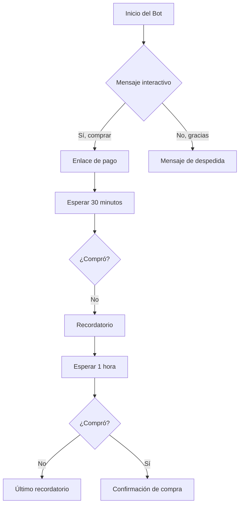

# Cómo crear un chatbot de WhatsApp gratis sin código

<Callout type="tip">
**Resumen rápido:** Esta guía te mostrará cómo crear un chatbot de WhatsApp usando la plataforma de E-SMART360, todo sin necesidad de escribir una sola línea de código. Primero conectas tu número de WhatsApp usando Meta (Facebook Business Manager), luego construyes el chatbot con el constructor visual de flujos.
</Callout>

La creación de chatbots solía requerir conocimientos avanzados de programación y largas horas de desarrollo. Hoy en día, cualquier negocio puede crear un asistente conversacional automatizado para WhatsApp con herramientas visuales de arrastrar y soltar, sin conocimientos técnicos.

En esta guía aprenderás a conectar tu cuenta de WhatsApp Business API, diseñar flujos conversacionales completos, configurar respuestas automatizadas y poner tu chatbot en funcionamiento. Ya sea que quieras atender consultas de clientes, capturar leads o mejorar tu tiempo de respuesta, este método te permite lanzar un chatbot funcional en muy poco tiempo.

<Callout type="info">
**Última actualización:** 2 de abril de 2026
</Callout>

---

## ¿Qué es un chatbot de WhatsApp sin código?

Un chatbot de WhatsApp sin código es un asistente automatizado que puedes crear utilizando herramientas visuales. En lugar de escribir código, usas un constructor de flujos donde arrastras y sueltas componentes para diseñar las conversaciones.

Puedes configurar mensajes de bienvenida, respuestas automáticas, flujos de atención al cliente, botones interactivos, listas dinámicas y mucho más. El chatbot responderá automáticamente a tus clientes las 24 horas del día, los 7 días de la semana, sin intervención manual.

Las plataformas modernas como E-SMART360 ofrecen estos constructores visuales integrados directamente con la API de WhatsApp Business, lo que hace que todo el proceso sea accesible para cualquier persona, sin importar su nivel técnico.

---

## Paso 1: Inicia sesión y conecta tu cuenta de WhatsApp

### 1.1 Regístrate o inicia sesión

1. Visita el panel de E-SMART360.
2. Haz clic en el botón **"Comenzar gratis"** o en **"Iniciar sesión"** .
3. Completa los campos del formulario de registro.
4. Haz clic en **"Registrarse"** o si ya tienes cuenta, simplemente inicia sesión.

### 1.2 Conecta tu cuenta de WhatsApp Business API

Una vez dentro del **Panel de control**, sigue estos pasos:

1. Haz clic en el menú **"Conectar cuenta"** .
2. Ingresa tu **ID de cuenta de negocio** y el **Token de acceso** en los campos correspondientes.
3. Haz clic en el botón **"Conectar"** .

<Callout type="warning">
**Recomendación importante:** No utilices el token de acceso temporal que genera Meta por defecto. Siempre genera un token permanente desde tu Business Manager para evitar que la conexión caduque inesperadamente.
</Callout>

Si no sabes cómo obtener tu ID de cuenta de negocio y Token de acceso, puedes consultar la guía sobre cómo configurar WhatsApp Cloud API.

Verás un mensaje de notificación exitosa si tu ID y token son válidos.

---

## Paso 2: Accede al lienzo del constructor de flujos

Desde el **Panel de control**:

1. Haz clic en el menú **"Gestor de Bots"** .
2. En **"Gestor de Bots de WhatsApp"** , selecciona la cuenta de bot deseada.
3. Haz clic en el botón **"Respuesta del Bot"** .
4. Haz clic en el botón **"Crear"** .

<Callout type="info">
Al hacer clic en "Crear", serás llevado a la página de edición llamada **"Lienzo del Constructor de Flujo Visual"** , junto con el **Menú de Documentos** que contiene 11 componentes en el lado izquierdo del lienzo.
</Callout>

Los once componentes del Menú de Documentos son:

| Componente | Función |
|---|---|
| **Texto** | Envía mensajes de texto al usuario |
| **Imagen** | Envía imágenes al chat |
| **Audio** | Reproduce mensajes de audio |
| **Video** | Comparte videos |
| **Archivo** | Adjunta documentos |
| **Interactivo** | Crea botones y listas interactivas |
| **Condición** | Aplica lógica condicional al flujo |
| **Nueva Secuencia** | Inicia una secuencia de seguimiento |
| **Flujo de Entrada** | Captura datos ingresados por el usuario |
| **Disparador** | Define palabras clave para activar el bot |
| **Postback** | Maneja acciones posteriores a un clic |

En la parte superior derecha del lienzo hay cinco botones: **Probar**, **Volver**, **Reorganizar**, **Guardar** y **Número de negocio**.

<Tabs>
<Tab title="Componentes esenciales">
Los componentes más utilizados al crear un chatbot básico son: Texto, Imagen, Interactivo, Disparador y Condición. Con estos cinco puedes cubrir la mayoría de los casos de uso comunes.
</Tab>
<Tab title="Componentes avanzados">
Para flujos más complejos, utiliza Nueva Secuencia (para seguimientos automáticos), Flujo de Entrada (para capturar datos del usuario) y Postback (para acciones posteriores a botones).
</Tab>
</Tabs>

---

## Paso 3: Configura el bot en el lienzo visual

En esta sección exploraremos varios componentes del **Menú de Documentos**.

### 3.1 Nombra tu bot

Cuando llegues al Constructor de Flujo Visual, verás el componente **"Iniciar Flujo del Bot"** . Para asignarle un nombre a tu bot:

1. Haz doble clic en el componente "Iniciar Flujo del Bot".
2. Aparecerá un modal **"Configurar Referencia"** en la parte superior derecha del lienzo.
3. Ingresa un nombre en el campo **"Título"** .
4. Opcionalmente, elige un nivel y selecciona una secuencia.
5. Haz clic en **"Aceptar"** para guardar.

### 3.2 Agrega componentes al flujo

Arrastra el cursor desde el conector **"Siguiente"** del componente "Iniciar Flujo del Bot" y suéltalo en el área del lienzo. Aparecerá una lista de componentes.

<Steps>
<Step title="Selecciona un componente">
De la lista de componentes, puedes seleccionar Imagen, Audio, Video, Archivo, Texto, etc. Por ejemplo, selecciona "Imagen" y aparecerá un componente de imagen en el lienzo.
</Step>
<Step title="Configura el componente">
Haz doble clic en el componente y se abrirá un formulario de configuración que debes completar. Puedes agregar botones de postback, acciones, interfaz de usuario y más.
</Step>
<Step title="Agrega más componentes">
Continúa agregando componentes para hacer tu bot tan grande como necesites. Cada componente se conecta al siguiente arrastrando desde su conector "Siguiente".
</Step>
<Step title="Conecta un disparador">
Debes conectar un componente de disparador al conector "Disparador" del componente "Iniciar Flujo del Bot".
</Step>
</Steps>

### 3.3 Configura el disparador por palabra clave

1. Desde el menú de documentos, selecciona el componente **"Disparador"** .
2. Arrástralo al lienzo y suéltalo.
3. **Haz doble clic** en el disparador.
4. Aparecerá el modal "Configurar Referencia".
5. Ingresa una palabra clave como "Hola", "Hola", "Inicio", etc.
6. Guarda la configuración.
7. Conecta el disparador al componente "Iniciar Flujo del Bot".

<Callout type="success">
**Tip de coincidencia:** Puedes configurar la coincidencia exacta (el bot solo se activa con esa palabra específica) o coincidencia de cadena (el bot se activa si la palabra clave está contenida en cualquier frase, por ejemplo "Hola, necesito ayuda" activará el bot si la palabra clave es "Hola").
</Callout>

### 3.4 Configuración de componentes multimedia

De manera similar, puedes configurar los formularios de los componentes de Audio, Video y Archivo:

- **Audio:** Sube un archivo de audio MP3 o OGG y agrega un mensaje de texto opcional.
- **Video:** Comparte un video con tus clientes con un texto descriptivo.
- **Archivo:** Adjunta PDF, documentos o cualquier archivo relevante.

<Callout type="warning">
**Límites de archivos multimedia de WhatsApp:**
- Imágenes: hasta 5 MB (formato JPEG, PNG, WebP)
- Videos: hasta 16 MB
- Audio: hasta 16 MB (formato AAC, AMR, MP3, OGG)
- Documentos: hasta 100 MB (formato PDF, DOC, XLS, PPT, TXT, etc.)
</Callout>

En resumen: arrastra cualquier componente del menú de documentos y suéltalo en el lienzo. Luego, para configurarlo, haz doble clic. Tras completar los campos del formulario de configuración, haz clic en **"Aceptar"** . 

Puedes mantener tu bot como un bot simple o crear un bot completo tan grande como lo necesites. Después de agregar un disparador al componente "Iniciar Flujo del Bot", finalmente **guarda** tu trabajo.

<Callout type="tip">
**¿Necesitas ayuda visual?** Puedes consultar los tutoriales en video disponibles en el canal de YouTube oficial de E-SMART360 para ver demostraciones detalladas de cada componente.
</Callout>

---

## Paso 4: Prueba el bot creado

Una vez que has configurado tu bot, es momento de probarlo para asegurarte de que funciona correctamente.

### 4.1 Agrega un suscriptor de prueba

1. Ve a tu panel de control y haz clic en **"Gestor de Suscriptores"** .
2. Haz clic en el botón **"Opciones"** y selecciona **"Suscriptor Manual"** .
3. Aparecerá un formulario.
4. Ingresa un nombre en el campo **"NOMBRE"** y un número de teléfono en el campo **"NÚMERO DE TELÉFONO"** .

<Callout type="warning">
**Precaución importante:** El número de teléfono debe incluir el código de país **sin el signo +** . Por ejemplo, para un número de España escribe 346XXXXXXXXX, no +346XXXXXXXXX.
</Callout>

5. Haz clic en el botón **"Guardar"** .

### 4.2 Envía un mensaje de prueba

1. En el lienzo del constructor de flujos, haz clic en el botón **"Probar"** .
2. Selecciona el suscriptor que acabas de agregar.
3. Haz clic en el botón **"Enviar"** .
4. Espera unos minutos.
5. Revisa la cuenta de WhatsApp del suscriptor de destino.

Si el bot se creó correctamente, el mensaje aparecerá en el chat de WhatsApp del suscriptor.

### 4.3 Prueba con palabras clave

Otra forma de verificar el bot:

1. Desde un teléfono o cuenta de WhatsApp externa, escribe la palabra clave que configuraste (por ejemplo, "Hola").
2. Espera unos minutos.
3. La conversación automatizada basada en tu bot se mostrará como respuesta.

Si obtienes la respuesta correspondiente, es una señal de que la creación del bot fue exitosa.

<Callout type="info">
**Solución de problemas comunes:**
- ¿El bot no responde? Verifica que el disparador esté correctamente conectado al componente "Iniciar Flujo del Bot".
- ¿No aparecen los botones? Asegúrate de que estén vinculados a un componente interactivo.
- ¿No se guardan los cambios? Siempre haz clic en el botón **Guardar** antes de salir del constructor visual.
</Callout>

---

## Paso 5: Analiza y mejora tu bot

La creación del bot es solo el comienzo. Para maximizar su efectividad, debes analizar su rendimiento y mejorarlo continuamente.

### 5.1 Recopila retroalimentación

- Pide a tus clientes que califiquen la atención recibida.
- Revisa los mensajes donde el bot no supo responder correctamente.
- Identifica las preguntas más frecuentes que el bot está manejando.

### 5.2 Monitorea el rendimiento

- Revisa el número de conversaciones iniciadas por el bot.
- Mide el porcentaje de preguntas respondidas automáticamente.
- Analiza los tiempos de respuesta.

### 5.3 Mejora el diseño del bot

Basándote en los datos recopilados:

- Agrega nuevas palabras clave y disparadores.
- Expande los flujos conversacionales.
- Añade más opciones interactivas.
- Incluye seguimientos automáticos para leads que no completaron una compra.

<Callout type="success">
Puedes modificar y mejorar el bot tantas veces como quieras, según las necesidades de tu negocio. No hay límites para la optimización.
</Callout>

---

## Cómo construir un chatbot de seguimiento automático

Una vez que dominas la creación de chatbots básicos, puedes llevar tu automatización al siguiente nivel con chatbots de seguimiento automático.

<Callout type="tip">
**¿Qué es un chatbot de seguimiento?** Es un sistema automatizado que envía mensajes de recordatorio a usuarios que han interactuado con tu chatbot pero no han completado una acción deseada, como realizar una compra o registrarse. Ayuda a mantener el compromiso con clientes potenciales y mejora las tasas de conversión.
</Callout>

### Beneficios del seguimiento automático

- Ahorra tiempo al automatizar recordatorios.
- Aumenta las ventas y conversiones.
- Asegura que los usuarios no olviden tu oferta.
- Funciona 24/7 sin esfuerzo manual.

### Configuración del flujo de seguimiento

1. Crea un flujo de chatbot estándar como se explicó anteriormente.
2. Agrega un bloque interactivo con opciones como "Sí, me interesa" y "No, gracias".
3. Si el usuario selecciona "Sí", proporciónale un enlace de compra.
4. Si selecciona "No", finaliza la conversación cortésmente.
5. **Aplica etiquetas** para rastrear las acciones del usuario. Por ejemplo, cuando un usuario haga clic en "Comprar ahora", aplica una etiqueta llamada "ComprarAhora".
6. Usa el conector "Suscribir a Secuencia" desde el botón para iniciar una secuencia de seguimiento.
7. Configura una condición para verificar si el usuario completó la compra.
8. Si es **falso**, envía un mensaje de recordatorio.

<CodeGroup>
<CodeGroupItem title="Ejemplo de flujo de seguimiento">

</CodeGroupItem>
</CodeGroup>

<Callout type="info">
**Sobre el límite de 24 horas:** WhatsApp permite enviar mensajes de seguimiento ilimitados dentro de la ventana de 24 horas después de la última interacción del usuario. Después de 24 horas, solo puedes enviar mensajes con plantillas preaprobadas.
</Callout>

---

## Preguntas frecuentes

<Expandable title="¿Cómo puedo crear un chatbot de WhatsApp gratis sin necesidad de programar?">
Puedes crear un chatbot de WhatsApp gratis utilizando plataformas visuales como E-SMART360. Simplemente conecta tu cuenta de WhatsApp Business API, usa el constructor de arrastrar y soltar para diseñar los flujos de conversación y configura las respuestas automáticas. No se requieren habilidades de programación.
</Expandable>

<Expandable title="¿Necesito la API de WhatsApp Business para construir un chatbot?">
Sí, para crear un chatbot de WhatsApp escalable necesitas acceso a la API de WhatsApp Business. E-SMART360 te ayuda a conectar tu número a través de Meta Business Manager y maneja toda la automatización sin necesidad de configuración técnica compleja.
</Expandable>

<Expandable title="¿Realmente es posible construir un chatbot de WhatsApp gratis?">
Sí, muchas plataformas de chatbot ofrecen planes gratuitos o periodos de prueba que te permiten construir y probar un chatbot de WhatsApp. Sin embargo, algunas funciones avanzadas o volúmenes altos de mensajes pueden requerir un plan de pago.
</Expandable>

<Expandable title="¿Cuánto tiempo se tarda en configurar un chatbot de WhatsApp?">
Puedes configurar un chatbot básico en tan solo unos minutos usando una plataforma visual. Los flujos más avanzados con condiciones y automatizaciones pueden tomar algunas horas para completarse.
</Expandable>

<Expandable title="¿Qué puede hacer un chatbot de WhatsApp por mi negocio?">
Un chatbot de WhatsApp puede automatizar respuestas, responder preguntas frecuentes, capturar leads, enviar notificaciones, recuperar carritos abandonados y proporcionar atención al cliente 24/7. Todo esto te ayuda a ahorrar tiempo y aumentar las conversiones.
</Expandable>

<Expandable title="¿Qué hago si el bot no responde a las palabras clave?">
Verifica que la palabra clave esté correctamente configurada en el componente Disparador. Revisa si estás usando coincidencia exacta o coincidencia de cadena. Asegúrate de que el disparador esté correctamente conectado al conector "Disparador" del componente "Iniciar Flujo del Bot". También verifica que hayas guardado todos los cambios antes de salir del constructor visual.
</Expandable>

---

## Ejemplos prácticos

<Columns cols="2">
<Card title="🛒 Tienda de e-commerce">
**Caso:** Una tienda de ropa quiere automatizar la atención al cliente en WhatsApp.

**Solución:** Crean un chatbot con las siguientes funcionalidades:
- Mensaje de bienvenida con catálogo de productos.
- Botones interactivos para categorías (Hombre, Mujer, Niños).
- Flujo de preguntas frecuentes sobre tallas y envíos.
- Seguimiento automático para carritos abandonados.
- Notificaciones de estado de pedido.

**Resultado:** Reducción del 70% en consultas repetitivas y aumento del 25% en ventas por recuperación de carritos abandonados.
</Card>

<Card title="🏥 Consultorio médico">
**Caso:** Un consultorio dental quiere gestionar citas por WhatsApp.

**Solución:** Crean un chatbot que:
- Responde con los horarios disponibles.
- Permite agendar citas mediante botones.
- Envía recordatorios automáticos 24 horas antes.
- Ofrece información sobre servicios y precios.
- Captura datos del paciente para la ficha médica.

**Resultado:** Reducción del 60% en llamadas telefónicas y disminución del 40% en ausencias a citas gracias a los recordatorios automáticos.
</Card>
</Columns>

---

## Conclusión

Crear un chatbot de WhatsApp sin código es un proceso accesible para cualquier negocio. Con las herramientas visuales de E-SMART360, puedes:

1. **Conectar** tu cuenta de WhatsApp Business API en minutos.
2. **Diseñar** flujos conversacionales completos arrastrando y soltando componentes.
3. **Automatizar** respuestas, seguimientos y notificaciones.
4. **Analizar** el rendimiento y mejorar continuamente tu bot.

La automatización de conversaciones no solo mejora la eficiencia operativa de tu negocio, sino que también ofrece una experiencia superior a tus clientes, que reciben respuestas inmediatas las 24 horas del día.

<Callout type="success">
**¡Comienza hoy!** No necesitas experiencia técnica, solo una cuenta de WhatsApp Business y las ganas de automatizar tu negocio. Regístrate en E-SMART360 y crea tu primer chatbot en cuestión de minutos.
</Callout>

---

## Configuración de etiquetas y campos personalizados

Para sacar el máximo provecho de tu chatbot, puedes utilizar etiquetas y campos personalizados que te permitan segmentar y rastrear el comportamiento de tus suscriptores.

### ¿Qué son las etiquetas?

Las etiquetas son marcadores que puedes asignar a tus suscriptores para categorizarlos según sus intereses, acciones o cualquier criterio que definas. Por ejemplo:

- **Etiqueta "Interesado":** Cuando un usuario hace clic en "Ver producto", se le asigna esta etiqueta.
- **Etiqueta "Compró":** Cuando completa una compra, se le asigna esta etiqueta.
- **Etiqueta "Lead caliente":** Para usuarios que han interactuado múltiples veces.

### ¿Qué son los campos personalizados?

Los campos personalizados te permiten almacenar información específica de cada suscriptor, como:

- Nombre completo
- Correo electrónico
- Teléfono alternativo
- Producto de interés
- Fecha de última compra
- Ciudad o ubicación

<Callout type="success">
**Beneficio clave:** Combinando etiquetas y campos personalizados puedes crear flujos de chatbot hiperpersonalizados. Por ejemplo, un mensaje que diga "¡Hola {{nombre}}! ¿Te gustaría recibir ofertas especiales para {{producto_interés}}?"
</Callout>

### Cómo configurar campos personalizados

1. Ve al **Gestor de Suscriptores** en el panel de control.
2. Selecciona la opción **Campos Personalizados**.
3. Haz clic en **Agregar nuevo campo**.
4. Define el nombre del campo (por ejemplo, "ciudad") y el tipo de dato (texto, número, fecha).
5. Guarda los cambios.

Una vez creados, puedes usar estos campos en las respuestas de tu chatbot insertando variables como `{{ciudad}}`, `{{nombre}}` o `{{email}}`.

---

## Integración con Google Sheets

Una de las funcionalidades más potentes es la capacidad de conectar tu chatbot con Google Sheets para almacenar y procesar datos.

### ¿Para qué sirve?

- Guardar automáticamente los datos de los leads capturados por el chatbot.
- Almacenar respuestas de encuestas y formularios.
- Sincronizar información de pedidos y clientes.
- Usar datos de hojas de cálculo como fuente para respuestas dinámicas.

### Pasos para la integración

1. Abre **Google Sheets** y crea una nueva hoja de cálculo.
2. Ve al menú **Integraciones** en el panel de E-SMART360.
3. Selecciona **Google Sheets**.
4. Autoriza la conexión con tu cuenta de Google.
5. Selecciona la hoja de cálculo que deseas usar.
6. Configura las columnas que corresponden a los campos de tu chatbot.

<Callout type="tip">
Puedes usar Google Sheets como base de datos dinámica para tu chatbot. Por ejemplo, si tienes un catálogo de productos en una hoja de cálculo, el chatbot puede consultarla en tiempo real para mostrar precios y disponibilidad.
</Callout>

---

## Uso de listas dinámicas en mensajes interactivos

Las listas dinámicas son una funcionalidad avanzada que permite mostrar opciones personalizadas dentro de un mensaje de WhatsApp.

### ¿Cómo funcionan?

En lugar de escribir las opciones manualmente, puedes configurar una lista que se genere automáticamente a partir de:

- Datos de Google Sheets
- Respuestas de APIs externas
- Campos personalizados de los suscriptores
- Catálogos de productos

### ¿Cuándo usarlas?

- **Catálogos de productos:** Mostrar productos disponibles con precios actualizados.
- **Sucursales:** Listar sucursales cercanas según la ubicación del cliente.
- **Horarios:** Mostrar horarios disponibles para agendar citas.
- **Promociones:** Enviar ofertas personalizadas según el historial del cliente.

<Callout type="warning">
Recuerda que las listas interactivas de WhatsApp tienen un límite de 10 opciones por mensaje. Si necesitas mostrar más opciones, considera usar múltiples mensajes en secuencia.
</Callout>

---

## Configuración de respuestas para palabras no reconocidas

Es importante configurar una respuesta para cuando el usuario envía un mensaje que el bot no reconoce. Esto evita que el cliente se quede sin respuesta.

### Cómo configurar "No Match Reply"

1. Ve al **Gestor de Bots** y selecciona tu bot.
2. Busca la opción **Respuesta sin coincidencia (No Match Reply)** .
3. Actívala y escribe un mensaje genérico como:

> "Lo siento, no entendí tu mensaje. Por favor, escribe 'Hola' para ver las opciones disponibles o 'Ayuda' para hablar con un agente."

### Frecuencia de respuesta

Puedes configurar la frecuencia con la que se envía esta respuesta para evitar molestar al usuario:

- **Una vez:** El mensaje de "no match" se envía solo una vez por conversación.
- **Cada cierto tiempo:** Puedes configurar un intervalo (por ejemplo, cada 30 minutos) para reenviar el mensaje.
- **Desactivado:** No se envía ningún mensaje si el bot no reconoce la entrada.

<Callout type="info">
Es recomendable configurar una frecuencia limitada para la respuesta "no match", ya que enviarla repetidamente puede resultar frustrante para el usuario y afectar tu calificación de calidad en WhatsApp.
</Callout>

---

## Cómo agregar botones CTA (Call to Action)

Los botones CTA mejoran significativamente la experiencia del usuario al permitir interacciones rápidas sin necesidad de escribir texto.

### Tipos de botones disponibles

| Tipo de botón | Descripción |
|---|---|
| **Enviar mensaje** | Envía un mensaje predefinido al hacer clic |
| **Visitar sitio web** | Abre una URL en el navegador del usuario |
| **Llamar teléfono** | Inicia una llamada al número configurado |
| **Iniciar flujo** | Activa otro flujo de chatbot |
| **Postback** | Envía datos a un webhook externo |
| **Acción del sistema** | Ejecuta acciones del sistema como copy to clipboard |

### Cómo agregar botones a tu chatbot

1. En el constructor de flujos, agrega un componente **Interactivo**.
2. Configura el mensaje principal (texto, encabezado, footer).
3. Desde el conector de **botón** del componente interactivo, arrastra un nuevo componente **Botón en línea**.
4. Haz doble clic y configura:
   - **Texto del botón** (máximo 20 caracteres)
   - **Acción del botón** (selecciona entre las opciones anteriores)
5. Repite para agregar más botones (máximo 3 botones por mensaje en WhatsApp).
6. Guarda los cambios.

<Expandable title="¿Cuántos botones puedo agregar por mensaje?">
WhatsApp permite un máximo de 3 botones por mensaje interactivo. Si necesitas más opciones, considera usar listas interactivas (hasta 10 opciones) o dividir las opciones en varios mensajes.
</Expandable>

---

## Exportación e importación de flujos de chatbot

Una funcionalidad muy útil es la capacidad de exportar tus flujos de chatbot para compartirlos o respaldarlos.

### Cómo exportar un flujo

1. Abre el bot en el **Constructor de Flujo Visual**.
2. Busca el botón de **Exportar** en la barra superior.
3. Haz clic y el sistema descargará un archivo JSON con la configuración completa del flujo.
4. Puedes compartir este archivo con otros usuarios o guardarlo como respaldo.

### Cómo importar un flujo

1. En el **Gestor de Bots**, haz clic en **Crear** o selecciona un bot existente.
2. Busca la opción **Importar**.
3. Selecciona el archivo JSON que exportaste previamente.
4. El sistema reconstruirá automáticamente todo el flujo.

<Callout type="success">
**Ideal para agencias:** Si manejas múltiples clientes, puedes crear flujos base y exportarlos para usarlos como plantillas, ahorrando horas de trabajo en cada nuevo proyecto.
</Callout>

---

## Mejores prácticas para tu chatbot de WhatsApp

Para maximizar la efectividad de tu chatbot, sigue estas recomendaciones:

### 1. Diseña conversaciones naturales

- Escribe los mensajes como si fueran de un humano, no de un robot.
- Usa un tono conversacional y amigable.
- Incluye emojis con moderación para humanizar la experiencia.

### 2. Ofrece siempre una salida

- Siempre incluye una opción para hablar con un agente humano.
- Configura palabras clave como "Ayuda", "Agente" o "Humano" para escalar la conversación.
- Nunca dejes al usuario atrapado en un bucle sin salida.

### 3. Respeta los límites de WhatsApp

- Las plantillas de mensajes deben ser aprobadas por Meta antes de usarse.
- Respeta la ventana de 24 horas para mensajes gratuitos.
- No envíes mensajes masivos sin consentimiento.
- Mantén una calificación de calidad alta (verde o amarilla).

### 4. Prueba antes de publicar

- Usa la función de prueba incorporada.
- Prueba desde varios dispositivos.
- Verifica que todos los botones funcionen.
- Comprueba que los mensajes multimedia se vean correctamente.

### 5. Monitorea y optimiza

- Revisa las estadísticas del bot semanalmente.
- Identifica las preguntas más frecuentes y mejora las respuestas.
- Ajusta las palabras clave según el comportamiento de los usuarios.
- Añade nuevos flujos basados en las necesidades detectadas.

<Callout type="danger">
**Importante:** Nunca compartas información sensible como contraseñas, datos bancarios o información personal a través de chatbots no seguros. Siempre verifica que tu conexión con WhatsApp Cloud API sea segura.
</Callout>

---

## Solución de problemas comunes

<Expandable title="El bot no responde después de configurarlo">
1. Verifica que la cuenta de WhatsApp esté correctamente conectada.
2. Comprueba que el token de acceso no haya caducado.
3. Asegúrate de que el disparador esté conectado al componente "Iniciar Flujo del Bot".
4. Verifica que hayas guardado todos los cambios.
5. Revisa que el número de teléfono del suscriptor de prueba tenga el código de país correcto sin el signo +.
</Expandable>

<Expandable title="Los mensajes no se entregan">
1. Confirma que el número de destino esté registrado en WhatsApp.
2. Verifica que no estés usando un token de acceso temporal.
3. Revisa que el bot haya sido publicado correctamente.
4. Comprueba que el usuario no haya bloqueado el número de negocio.
5. Verifica la calificación de calidad de tu número de WhatsApp.
</Expandable>

<Expandable title="Los botones o listas no aparecen">
1. Verifica que estés usando el componente **Interactivo** y no solo el de texto.
2. Asegúrate de que los botones estén correctamente vinculados al componente interactivo.
3. WhatsApp no permite más de 3 botones por mensaje.
4. Si usas listas, verifica que no excedan las 10 opciones.
5. Algunos tipos de botones requieren configuración adicional (URLs, números de teléfono válidos).
</Expandable>

<Expandable title="El bot responde dos veces al mismo mensaje">
1. Revisa que no hayas creado dos disparadores con la misma palabra clave.
2. Verifica que no tengas dos bots diferentes configurados para el mismo número.
3. Comprueba las reglas de "No Match Reply" y "Frecuencia de respuesta".
4. Asegúrate de que el flujo no tenga bucles infinitos.
</Expandable>

---

## Recursos adicionales

- **Guía de integración de WooCommerce:** Aprende a conectar tu tienda WooCommerce con WhatsApp para notificaciones de pedidos.
- **Automatización con Google Sheets:** Descubre cómo usar datos de hojas de cálculo en las respuestas de tu chatbot.
- **Chatbot para Messenger:** Crea un chatbot para Facebook Messenger siguiendo pasos similares.
- **Asistente de IA:** Entrena a tu chatbot con IA usando preguntas frecuentes, archivos y URLs.
- **Integración de Shopify:** Automatiza las notificaciones de tu tienda Shopify directamente en WhatsApp.
- **WhatsApp Flows:** Crea formularios nativos dentro de WhatsApp para capturar información estructurada.
- **Catálogo de productos:** Aprende a mostrar y vender productos directamente desde el chat de WhatsApp.
