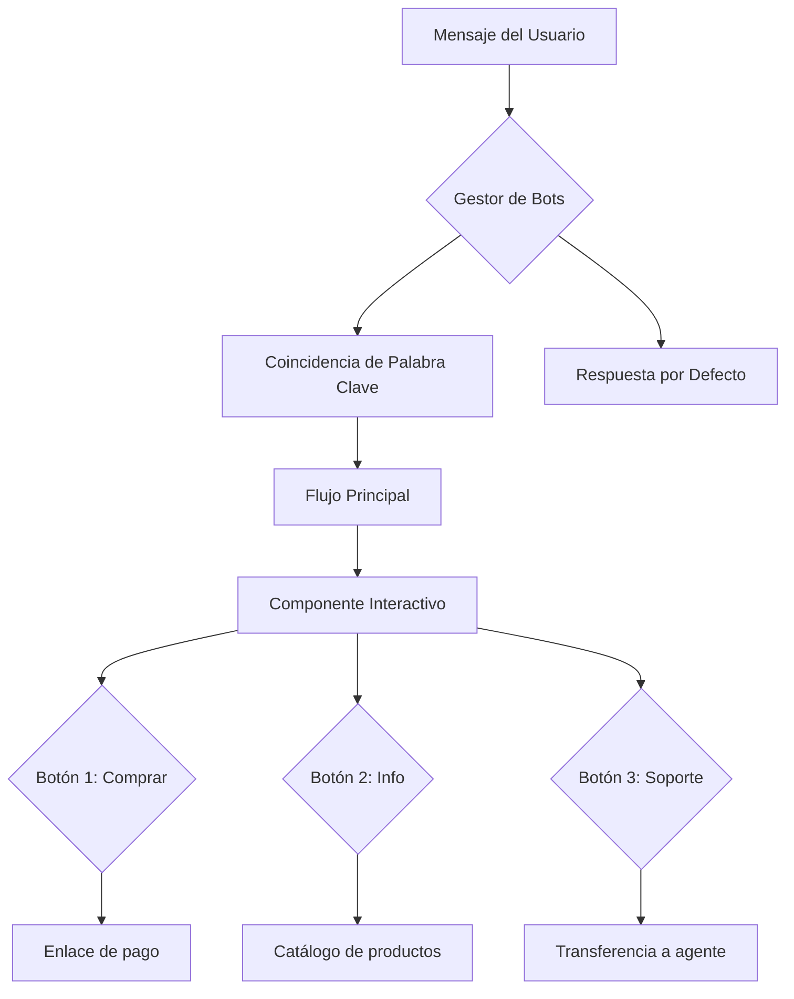

import { Callout, Steps, Step, Expandable, Columns, Card, Tabs, Tab, CodeGroup, CodeGroupItem, Update } from '/src/components/ui';

<Update title="Última actualización" date="2026-05-06">
  Esta guía ha sido actualizada con los últimos cambios en la API de WhatsApp Cloud API y el constructor visual de bots de E-SMART360.
</Update>

## ¿Qué es un Chatbot de WhatsApp y por qué lo necesitas?

Un chatbot de WhatsApp es una tecnología que automatiza las conversaciones con tus clientes. Tú decides qué, cuándo, por qué y cuánto va a decir. En esencia, es una herramienta de automatización empresarial que trabaja 24/7 para ti sin descanso.

Los chatbots de WhatsApp registran una tasa de apertura de mensajes del 98% y un aumento verificable del 156% en las tasas de conversión en comparación con los canales tradicionales. Así es como las marcas modernas están convirtiendo chats en ingresos de forma consistente.

<Callout type="info">
  **Estadísticas que importan:**
  - **98%** de tasa de apertura de mensajes en WhatsApp
  - **156%** más de conversiones vs. canales tradicionales
  - **3x** más efectivo que campañas de email marketing
  - **67%** de usuarios se sienten más seguros comprando desde WhatsApp
  - **20-30%** es la tasa de apertura típica del email (comparativamente mucho menor)
</Callout>

Desde una simple consulta hasta la compra del producto deseado, para un cliente ese proceso completo es todo un viaje. Piensa en lo que sucede físicamente en una tienda: recibir al cliente, responder sus preguntas, mostrarle diferentes productos que coincidan con sus preferencias y finalmente cerrar la venta. Replicar todos esos pasos de forma confiable en línea es un gran desafío, especialmente cuando manejas un alto volumen de clientes. La respuesta es simple: un chatbot de WhatsApp.

<Columns cols="2">
  <Card title="📊 Datos Clave del Mercado">
    - El 67% de los usuarios se sienten más seguros comprando de empresas a las que pueden contactar por WhatsApp
    - Las tasas de conversión en WhatsApp son típicamente 3 veces más altas que las campañas de email
    - Grandes corporaciones como Nivea, Unilever y Flamingo ya usan chatbots de WhatsApp
    - La adopción de chatbots crece a un ritmo exponencial año tras año
  </Card>
  <Card title="🎯 Beneficios Clave para tu Negocio">
    - Atención al cliente automatizada 24/7 sin descanso
    - Automatización completa de ventas y soporte
    - Respuestas instantáneas y altamente personalizadas
    - Integración nativa con catálogos, pagos y bases de datos
    - Reducción drástica de costos operativos
  </Card>
</Columns>

## Requisitos Técnicos Completos

Antes de sumergirte en la construcción de tu chatbot, es importante entender todos los requisitos técnicos y preparativos necesarios para garantizar una implementación exitosa.

### Cuenta de WhatsApp Business API (WABA)

La Cuenta de WhatsApp Business API (WABA) es el núcleo de tu infraestructura de chatbot. Sin ella, no es posible acceder a las capacidades avanzadas de automatización.

<Expandable title="¿Qué es exactamente una WABA?">
  Una Cuenta de WhatsApp Business API (WABA) es una cuenta empresarial que te permite acceder a la API oficial de WhatsApp para negocios. A diferencia de la aplicación gratuita WhatsApp Business, la API te permite:
  - Enviar mensajes programáticos y automatizados a gran escala
  - Manejar múltiples agentes en una misma cuenta simultáneamente
  - Acceder a métricas detalladas de rendimiento de cada mensaje
  - Usar plantillas de mensajes aprobadas por Meta para comunicación fuera de la ventana de 24 horas
  - Integrarte con sistemas CRM, ERP y plataformas de e-commerce
  - Escalar tu comunicación desde decenas hasta millones de usuarios
</Expandable>

<Expandable title="¿Cómo obtener tu WABA?">
  Puedes obtener una WABA de dos formas principales:
  
  **Opción 1 - Integración en un solo clic con E-SMART360 (Recomendada):**
  Es la forma más rápida y sencilla. E-SMART360 gestiona todo el proceso de registro y verificación automáticamente. Solo necesitas tu cuenta de Facebook Business Manager y seleccionar la opción de integración rápida desde el panel de control.
  
  **Opción 2 - Registro manual en Meta Business Suite:**
  Puedes crear tu WABA directamente desde el panel de developers de Meta y luego conectarla manualmente con E-SMART360. Este proceso es más lento pero te da más control sobre cada paso.
</Expandable>

### Meta Business Manager

El Meta Business Manager (anteriormente Facebook Business) es el centro de administración de todos tus activos empresariales de Meta. Es necesario para gestionar permisos y cuentas.

<Steps>
  <Step title="Crea tu cuenta de Business Manager">
    Ve a business.facebook.com y crea una cuenta empresarial. Necesitarás un correo electrónico corporativo válido y acceso a la página de Facebook de tu empresa (si tienes una). El proceso toma aproximadamente 5 minutos.
  </Step>
  <Step title="Agrega tu cuenta de WhatsApp">
    Dentro de Business Manager, navega a Configuración → Cuentas → WhatsApp y agrega tu número de teléfono empresarial. Recibirás un código de verificación por SMS o llamada.
  </Step>
  <Step title="Verifica tu empresa con Meta">
    Meta requiere verificación empresarial para desbloquear límites más altos de mensajería. El proceso incluye la verificación de documentos legales de tu empresa (RFC, acta constitutiva, comprobante de domicilio fiscal).
  </Step>
  <Step title="Concede permisos a E-SMART360">
    Como proveedor de soluciones (BSP), E-SMART360 necesita permisos para gestionar tu WABA en tu nombre. Durante la integración de un solo clic, este proceso se completa automáticamente sin intervención manual adicional.
  </Step>
</Steps>

### Configuración del Perfil de WhatsApp Business

Una vez conectada tu cuenta, es importante configurar correctamente tu perfil empresarial para generar confianza en tus clientes:

<Columns cols="2">
  <Card title="Campos del Perfil Empresarial">
    - **Nombre de la empresa**: Visible para todos los clientes
    - **Descripción breve**: Texto conciso sobre tu negocio (máx. 256 caracteres)
    - **Dirección física**: Ubicación de tu negocio (campo opcional)
    - **Correo electrónico**: Para notificaciones administrativas
    - **Sitio web**: Enlace a tu página principal
    - **Horario de atención**: Días y horas laborales
    - **Categoría empresarial**: Industria o rubro específico
  </Card>
  <Card title="Recomendaciones de Configuración">
    - Usa un logo profesional en alta calidad (recomendado 400x400 px)
    - La descripción debe ser clara, directa y en el idioma de tus clientes
    - Verifica que el sitio web esté activo y cargue correctamente
    - El nombre debe coincidir exactamente con tu registro comercial o marca registrada
    - Actualiza el horario de atención si cambia por temporadas o días festivos
  </Card>
</Columns>

<Callout type="tip">
  Un perfil completo y profesional genera significativamente más confianza en tus clientes potenciales. Dedica al menos 15 minutos a configurarlo correctamente desde el principio. Los perfiles incompletos tienen tasas de conversión hasta un 30% más bajas.
</Callout>

## Construye tu Primer Chatbot de WhatsApp en Menos de 10 Minutos

Veamos al grano: qué tan rápido puedes construir un chatbot incluso si no eres un experto en tecnología. Principalmente necesitarás dos cosas:

<Steps>
  <Step title="1. Una Cuenta de WhatsApp Business Verificada (WABA)">
    Si aún no la tienes configurada, puedes instalar WhatsApp Business y verificarla con tu número de móvil. El proceso es sencillo y no requiere conocimientos técnicos avanzados.
  </Step>
  <Step title="2. Un Proveedor de Servicios Sin Código (BSP)">
    E-SMART360 actúa como tu BSP (Business Service Provider). Regístrate gratis y activa tu cuenta para empezar a construir tu chatbot de inmediato.
  </Step>
</Steps>

<Callout type="success">
  **Resumen de requisitos previos:**
  - Una cuenta de Meta Business Suite con acceso de administrador
  - Una cuenta WABA vinculada a tu Meta Business Suite o página de perfil
  - Una cuenta activa en E-SMART360 (registro gratuito disponible)
  - Un número de teléfono verificable para recibir el código SMS
</Callout>

### Conexión de tu Cuenta de WhatsApp paso a paso

Ahora, abre tu cuenta de E-SMART360 en el navegador y sigue estos pasos desde el menú lateral:

1. Selecciona **Conectar Cuenta → Conectar WhatsApp**
2. Verás dos opciones disponibles — selecciona la opción de **integración en un solo clic** (es la más rápida)
3. Serás redirigido a una página de inicio de sesión de Facebook. Ingresa la información de la cuenta que tenga acceso de administrador a tu Meta Business Suite
4. Sigue las instrucciones adicionales en pantalla
5. Haz clic en **Guardar** y confirma la vinculación

<Callout type="tip">
  La integración en un solo clic es la forma más rápida y segura de conectar tu WhatsApp. La segunda opción (configuración manual) requiere más tiempo e implica crear una aplicación de Facebook, configurar webhooks y gestionar tokens de acceso. Recomendamos usar siempre la opción de un solo clic a menos que tengas necesidades muy específicas de personalización.
</Callout>

Una vez verificado, E-SMART360 finalizará la vinculación automáticamente. Después verifica en tu panel de control que tu cuenta de WhatsApp esté conectada correctamente. Verás un indicador verde de "Conectado" junto al número.

### Diseñando tu Bot sin Escribir una Sola Línea de Código

Ahora viene la parte más interesante: diseñarás exactamente cómo el chatbot interactuará con tus clientes sin escribir una sola línea de código. Es momento de conocer el **Gestor de Bots**.

Desde el panel de control principal:

1. Haz clic en **Gestor de Chatbots** en el menú lateral izquierdo
2. Navega al submenú **Bot de WhatsApp**
3. Haz clic en la sección **Respuesta del Bot**
4. Finalmente, haz clic en el botón **Crear**

Instantáneamente aparecerá el lienzo del **Constructor Visual de Flujos** (Visual Flow Bot Builder). Este es el corazón de la plataforma. La interfaz muestra una serie de componentes que puedes arrastrar, soltar y conectar visualmente para construir el comportamiento de tu chatbot.

<Callout type="info">
  El constructor visual de E-SMART360 usa un sistema de arrastrar y soltar intuitivo. Una vez que te familiarices con la interfaz, serás imparable. No hay nada que tu bot no pueda manejar: desde preguntas frecuentes y soporte al cliente hasta campañas de venta completas con múltiples ramas y condiciones.
</Callout>

Aquí tienes una vista general de los componentes principales disponibles:

| Componente | Función Principal | Caso de Uso Típico |
|---|---|---|
| **Inicio de Flujo** | Punto de entrada del bot con configuración de trigger | Definir palabra clave y nombre del bot |
| **Mensaje de Texto** | Envía un mensaje de texto simple al usuario | Respuestas informativas, confirmaciones |
| **Componente Interactivo** | Mensaje con botones de acción | Ofrecer opciones como "Ver productos" o "Hablar con agente" |
| **Botón en Línea** | Botón individual configurable | CTA específico como "Comprar ahora" o "Ver más" |
| **Componente de Imagen** | Envía una imagen al chat | Catálogo visual, infografías, capturas |
| **Componente de Video** | Envía un video | Tutoriales, demostraciones de productos |
| **Componente de Documento** | Envía archivos como PDF | Facturas, catálogos, manuales |
| **Condición** | Crea ramas lógicas en el flujo | "Si el usuario eligió A, ve a X; si eligió B, ve a Y" |
| **Retardo** | Pausa temporal entre mensajes | Simular escritura humana o dar tiempo al usuario |
| **Secuencia** | Programa mensajes futuros | Seguimientos post-compra, recordatorios |
| **Acción HTTP** | Llama a APIs y servicios externos | Consultar stock, crear tickets, enviar datos |
| **Google Sheets** | Lee y escribe datos en hojas de cálculo | Personalización masiva con datos reales de clientes |

#### Creando tu Primer Mensaje de Bienvenida

Vamos a empezar con algo simple: un mensaje de bienvenida que se active cuando un usuario escriba "Hola".

1. Localiza el componente **Iniciar Flujo del Bot** (es el primer componente que aparece en el lienzo)
2. Haz doble clic para abrir el modal **Configurar Referencia**
3. Ingresa un nombre descriptivo para tu chatbot (por ejemplo, "Bot de Bienvenida Principal")
4. En el campo de palabra clave, escribe "Hola" (puedes agregar múltiples palabras clave separadas por comas)
5. Opcionalmente, selecciona una etiqueta de color y una secuencia predefinida
6. Haz clic en **Guardar** para confirmar la configuración inicial

<CodeGroup>
  <CodeGroupItem title="Configuración del trigger de ejemplo">
  ```
  Palabra clave: "Hola", "Inicio", "Menú", "Ayuda"
  Tipo de coincidencia: Parcial (detecta la palabra en cualquier contexto)
  Mensaje de respuesta: "¡Bienvenido! Soy el asistente virtual de [Tu Empresa]. ¿En qué puedo ayudarte hoy?"
  ```
  </CodeGroupItem>
</CodeGroup>

7. Arrastra una conexión desde la salida **Siguiente** del componente de inicio
8. Suéltala en el lienzo y, del menú que aparece, selecciona el **Componente Interactivo**
9. En el modal de configuración, completa:
   - **Encabezado**: "¡Bienvenido!"
   - **Cuerpo**: "Gracias por contactarnos. Soy el asistente virtual de [Tu Empresa]. ¿Cómo puedo ayudarte el día de hoy?"
   - **Pie**: "Elige una opción del menú:"
10. Establece un tiempo de retardo de 1-2 segundos si deseas simular escritura natural
11. Haz clic en **OK** para guardar el componente

#### Añadiendo Botones Interactivos a tu Chatbot

Para hacer tu chatbot más útil y conversacional, puedes agregar botones interactivos que el usuario puede tocar para navegar:

1. Arrastra un conector desde la salida de botones del Componente Interactivo que acabas de crear
2. Aparecerá automáticamente un **Componente de Botón en Línea**
3. Haz doble clic sobre él para abrir la configuración
4. Ingresa el texto del botón (por ejemplo: "Ver productos", "Hablar con agente", "Promociones")
5. Selecciona el tipo de acción para el botón
6. Haz clic en **Guardar** y repite el proceso para agregar más botones

<Callout type="tip">
  **Ideas de botones probadas que funcionan:**
  - "🛒 Ver catálogo completo" → Enlace directo a tu tienda online
  - "💬 Hablar con un agente humano" → Transferencia a soporte en vivo
  - "📦 Estado de mi pedido" → Consulta automatizada de seguimiento
  - "💰 Ofertas y promociones" → Muestra descuentos activos
  - "📍 Sucursales" → Mapa y direcciones
  - "📅 Agendar cita" → Calendario de reservas
</Callout>

7. Después de configurar todos los botones, conecta cada uno a su respectivo flujo
8. Para el mensaje de cierre, agrega un **Componente de Texto** al final del flujo principal
9. Haz clic en el botón **Guardar** en la esquina superior derecha del lienzo

#### Probando tu Chatbot

Ahora es momento de la verdad: probar si todo funciona correctamente.

1. Abre WhatsApp en tu teléfono
2. Escribe la palabra clave "Hola" y envíala al número de tu empresa
3. Observa la respuesta del chatbot: debe responder con el mensaje de bienvenida y mostrar los botones
4. Prueba cada uno de los botones para verificar que dirijan al flujo correcto
5. Si algo no funciona, vuelve al constructor visual y ajusta las conexiones

<Callout type="success">
  ¡Felicidades! Has construido tu primer chatbot de WhatsApp funcional sin escribir una sola línea de código. Pero esto es solo el comienzo. A continuación exploraremos funciones más potentes para llevar tu chatbot al siguiente nivel.
</Callout>

## Uso Avanzado de Palabras Clave para Activar tu Chatbot

Una de las formas más efectivas de controlar el comportamiento de tu chatbot es mediante disparadores por palabras clave. Este sistema permite que diferentes palabras o frases activen diferentes flujos de conversación.

### Cómo Configurar Palabras Clave Paso a Paso

<Steps>
  <Step title="Accede al Gestor de Bots">
    En el panel de E-SMART360, navega a **Gestor de Bots → Respuesta del Bot**. Selecciona la cuenta de bot que deseas configurar de la lista desplegable.
  </Step>
  <Step title="Crea un Nuevo Chatbot o Edita uno Existente">
    Haz clic en el botón **Crear** para un nuevo chatbot, o haz clic en el icono de edición junto a un chatbot existente. El lienzo del Constructor Visual de Flujos se abrirá automáticamente.
  </Step>
  <Step title="Configura el Nombre y el Trigger Inicial">
    Localiza el componente **Iniciar Flujo del Bot**. Haz doble clic para abrir el modal de configuración. Aquí puedes:
    - Ingresar un nombre descriptivo (ej: "Bot de Productos")
    - Elegir una etiqueta de color para organización visual
    - Seleccionar una secuencia predefinida si aplica
  </Step>
  <Step title="Establece la Palabra Clave de Activación">
    En el campo **Palabra Clave**, ingresa el término que activará este flujo específico. Por ejemplo: "Productos", "Catálogo" o "Tienda".
  </Step>
  <Step title="Elige el Tipo de Coincidencia">
    El sistema ofrece dos modos de coincidencia:
    - **Coincidencia exacta**: El bot solo se activa si el mensaje del usuario es exactamente la palabra clave (ej: solo "Productos" activa el flujo)
    - **Coincidencia parcial (recomendada)**: El bot se activa si la palabra clave aparece en cualquier parte del mensaje (ej: "Quiero ver productos" también activa el flujo porque contiene "productos")
  </Step>
  <Step title="Configura el Mensaje de Respuesta">
    Arrastra una conexión desde la salida **Siguiente** del componente de inicio. Selecciona el **Componente Interactivo** del menú de opciones. Configura el encabezado, cuerpo y pie del mensaje. El cuerpo del mensaje es obligatorio.
  </Step>
  <Step title="Agrega Botones y Acciones">
    Conecta botones en línea al componente interactivo. Cada botón puede tener una acción diferente: enviar un mensaje, iniciar otro flujo, abrir un enlace externo, o transferir a un agente humano.
  </Step>
  <Step title="Guarda tu Progreso">
    Después de configurar todos los componentes, haz clic en **Guardar**. Siempre guarda antes de salir del constructor visual para no perder tus cambios.
  </Step>
  <Step title="Prueba Exhaustivamente">
    Abre WhatsApp, envía diferentes variaciones de tu palabra clave y verifica que el chatbot responda correctamente. Prueba también palabras que NO deberían activar el bot para confirmar que los filtros funcionan.
  </Step>
</Steps>

### Solución de Problemas Comunes con Palabras Clave

<Callout type="warning">
  **Problemas frecuentes y sus soluciones:**
  
  - **La palabra clave no activa respuestas**: Verifica que esté correctamente escrita en el Componente de Disparo. Revisa mayúsculas, minúsculas y espacios.
  
  - **El bot se activa con palabras incorrectas**: Cambia el modo de coincidencia de "parcial" a "exacta" para ser más restrictivo.
  
  - **Los botones no aparecen en el chat**: Asegúrate de que los botones estén vinculados correctamente a un componente interactivo, no a un componente de texto simple.
  
  - **El bot se queda en silencio después de responder**: Verifica que hayas agregado un Componente de Texto final en cada rama del flujo.
  
  - **Los cambios no se guardan**: Siempre haz clic en el botón **Guardar** (esquina superior derecha) antes de cerrar o salir del constructor visual.
</Callout>

## Automatización de Seguimientos Inteligentes con Chatbots

Un chatbot de seguimiento (follow-up) es un sistema automatizado que envía mensajes recordatorios a usuarios que han interactuado con tu chatbot pero no han completado una acción deseada, como realizar una compra o registrarse en un servicio.

### ¿Por Qué Usar un Sistema de Seguimiento Automatizado?

<Columns cols="2">
  <Card title="✅ Beneficios Comprobados">
    - Ahorra horas de trabajo manual enviando recordatorios automáticos
    - Aumenta las tasas de conversión entre un 20% y 40%
    - Asegura que ningún cliente potencial quede olvidado
    - Funciona 24/7 sin intervención humana
    - Personaliza la comunicación según las acciones de cada usuario
    - Escala sin esfuerzo a miles de clientes simultáneamente
  </Card>
  <Card title="🔄 Tipos de Secuencias de Seguimiento">
    - **Bienvenida**: Mensajes de saludo para nuevos suscriptores
    - **Soporte**: Seguimiento a tickets de soporte abiertos
    - **Lead nurturing**: Secuencia educativa sobre productos/servicios
    - **Ventas**: Embudo progresivo hacia la compra
    - **Onboarding**: Guía para nuevos usuarios
    - **Promocional**: Ofertas y descuentos por tiempo limitado
    - **Carrito abandonado**: Recordatorio de compra no completada
    - **Re-engagement**: Reactivación de clientes inactivos
  </Card>
</Columns>

### Construyendo tu Chatbot de Seguimiento Automático

1. Ve a **Panel de control → Gestor de Bots → Respuesta del Bot → Crear**
2. Asigna un nombre reconocible como "Bot de Seguimiento de Ventas"
3. Configura el mensaje interactivo inicial preguntando: "_¿Te interesaría nuestro producto?_" con botones **Sí** y **No** como opciones
4. Si el usuario selecciona **Sí**, proporciónale un enlace directo de compra o un catálogo
5. Si selecciona **No**, agradece su tiempo y ofrece asistencia adicional si cambia de opinión
6. Opcionalmente, pregunta el motivo del desinterés para mejorar tu oferta

#### Sistema de Etiquetas para Rastrear Acciones

El sistema de etiquetas es fundamental para el seguimiento inteligente:

- Cuando un usuario hace clic en "Comprar ahora", el sistema aplica automáticamente una etiqueta llamada **Intención de compra**
- Si el usuario no hace clic en ningún botón de compra, permanece sin esa etiqueta
- Las etiquetas permiten segmentar tu audiencia para campañas específicas
- Puedes crear tantas etiquetas como necesites para diferentes acciones

#### Configuración de la Secuencia de Seguimiento

1. Arrastra el conector desde la opción **Suscribir a Secuencia** del botón "Comprar ahora"
2. Configura el tiempo de espera deseado (recomendado: 30 minutos a 2 horas para máxima efectividad)
3. Agrega un componente de **Condición** para verificar si el usuario ya completó la compra
4. Si la condición es falsa (aún no compró), envía el mensaje de recordatorio personalizado
5. Incluye nuevamente el botón de compra directa en el mensaje de seguimiento
6. Opcionalmente, agrega un segundo recordatorio después de 24 horas (usando plantilla aprobada)

<Callout type="info">
  **Límites de tiempo en WhatsApp:**
  - Dentro de las primeras **24 horas** de la última interacción del usuario: puedes enviar mensajes de seguimiento ilimitados sin restricciones
  - Después de 24 horas: solo puedes enviar mensajes utilizando **plantillas de mensajes preaprobadas** por Meta
  - Programa tus recordatorios estratégicamente para maximizar el impacto dentro de la ventana de 24 horas
</Callout>

### Exportación y Respaldo de Flujos de Chatbot

Una funcionalidad muy útil es la capacidad de exportar el flujo completo de tu chatbot. Esto te permite:

- Compartir flujos con tu equipo de trabajo para colaboración
- Crear una biblioteca de plantillas reutilizables para diferentes campañas
- Hacer respaldos de seguridad antes de realizar cambios mayores
- Importar flujos en otras cuentas de E-SMART360

<Callout type="tip">
  Te recomendamos exportar y respaldar tus flujos de chatbot al menos una vez al mes, o cada vez que realices cambios significativos en la estructura de conversación.
</Callout>

## Secuencias de Mensajes para Ventas y Marketing

Una secuencia de mensajes es una serie automatizada de respuestas del chatbot activadas por acciones del usuario o eventos predefinidos. Es una herramienta poderosa para mejorar el compromiso del cliente, automatizar tareas de marketing y nutrir leads de manera consistente.

### Ideas Probadas para Secuencias de Mensajes

- **Secuencias de bienvenida**: Atrae a nuevos suscriptores con una serie de mensajes de saludo personalizados que presenten tu marca, valores y oferta principal
- **Secuencias de soporte técnico**: Automatiza respuestas a las consultas más comunes con una serie de pasos de diagnóstico
- **Secuencias de nutrición de leads (lead nurturing)**: Educa gradualmente a los prospectos sobre tus productos o servicios con contenido de valor
- **Secuencias de ventas**: Guía a los clientes potenciales a través del embudo de conversión paso a paso
- **Secuencias de onboarding**: Ayuda a los nuevos usuarios a familiarizarse con tu plataforma o servicio
- **Secuencias promocionales**: Anuncia nuevos productos, descuentos especiales o eventos próximos
- **Secuencias educativas**: Proporciona contenido valioso y tips relacionados con tu industria

### Beneficios Medibles de las Secuencias de Mensajes

| Beneficio | Impacto | Explicación |
|---|---|---|
| Experiencia del cliente mejorada | Alto | Respuestas instantáneas y coherentes en todo momento |
| Mayor eficiencia operativa | Muy alto | Reduce la carga de trabajo manual automatizando tareas repetitivas |
| Mejores tasas de conversión | Alto | Nutre leads gradualmente hasta la decisión de compra |
| Compromiso continuo | Medio-Alto | Mantiene a los usuarios interesados con seguimientos oportunos |
| Optimización basada en datos | Alto | Monitorea rendimiento y refina secuencias según análisis en tiempo real |
| Escalabilidad | Muy alto | Atiende a miles de clientes simultáneamente sin aumentar costos |

### Cómo Configurar una Campaña de Secuencia Exitosa

1. **Planifica tu secuencia**: Define el objetivo, la audiencia objetivo y los mensajes clave
2. **Crea la secuencia en el constructor**: Navega al **Constructor de Flujos** y selecciona **Nueva Secuencia**
3. **Configura los tiempos**: Establece intervalos entre cada mensaje (ej: Día 1, Día 3, Día 7)
4. **Diseña cada mensaje**: Combina texto, imágenes, videos y llamadas a la acción estratégicas
5. **Configura condiciones**: Define reglas para avanzar, pausar o cancelar la secuencia según las acciones del usuario
6. **Activa y monitorea**: Lanza la secuencia y revisa las métricas de rendimiento semanalmente
7. **Optimiza continuamente**: Ajusta mensajes, tiempos y segmentación según los resultados obtenidos

<Callout type="warning">
  **Requisito importante para secuencias:** Para mensajes enviados fuera de la ventana de 24 horas, WhatsApp exige el uso de **plantillas de mensajes preaprobadas por Meta**. Asegúrate de tener tus plantillas creadas y aprobadas antes de lanzar campañas de secuencia que excedan este límite. El proceso de aprobación puede tomar entre 24 horas y una semana.
</Callout>

## El Constructor Visual de Flujos en Profundidad

El corazón tecnológico de E-SMART360 es su **Constructor Visual de Flujos** (Visual Flow Bot Builder). Se trata de una interfaz gráfica drag-and-drop que te permite diseñar conversaciones multicapa sin necesidad de conocimientos de programación.

### Arquitectura del Constructor



### Conexión y Organización de Componentes

Cada componente en el constructor tiene **conectores** (sockets) de entrada y salida. Para construir tu flujo:

1. Arrastra desde el conector de salida de un componente hasta el siguiente componente
2. Puedes crear múltiples ramas conectando varios componentes a una sola salida
3. Los componentes se organizan visualmente en el lienzo y puedes moverlos libremente
4. Usa los botones de zoom para ver el flujo completo o enfocarte en detalles
5. La cuadrícula del lienzo ayuda a alinear los componentes de forma ordenada

<Callout type="alert">
  **Errores críticos que debes evitar al conectar componentes:**
  
  ❌ **No cerrar todas las ramas del flujo**: Cada rama debe terminar en un componente (mensaje, acción o fin). Las ramas abiertas causan que el bot se quede en silencio.
  
  ❌ **Conectar en orden incorrecto**: Asegúrate de que el flujo tenga una secuencia lógica. Por ejemplo, el mensaje de bienvenida debe ir después del trigger, no antes.
  
  ❌ **Olvidar el componente de cierre**: Siempre agrega un mensaje final o componente de acción al final de cada rama para que el usuario sepa que el flujo terminó.
  
  ❌ **Bucles infinitos**: Si creas un bucle, asegúrate de incluir una condición de salida clara para evitar que el bot repita el mismo mensaje indefinidamente.
</Callout>

## Estrategias de Mensajería Avanzadas

### Mensajes con Imágenes y Multimedia

Enriquecer tus conversaciones con contenido multimedia aumenta significativamente el engagement y las tasas de conversión. Puedes incluir:

- **Imágenes**: Fotos de productos, infografías, capturas de pantalla
- **Videos**: Tutoriales, demostraciones, testimonios en video
- **Documentos**: Catálogos PDF, fichas técnicas, manuales de usuario
- **Audio**: Mensajes de voz explicativos, podcasts cortos

<Callout type="info">
  **Límites de WhatsApp para archivos multimedia:**
  - Imágenes: Hasta 5 MB
  - Videos: Hasta 16 MB
  - Documentos: Hasta 100 MB
  - Audio: Hasta 16 MB
</Callout>

### Personalización con Variables Dinámicas

E-SMART360 permite usar variables en los mensajes para crear conversaciones verdaderamente personalizadas:

<CodeGroup>
  <CodeGroupItem title="Ejemplo de mensaje personalizado">
  ```text
  ¡Hola {{nombre}}!
  
  Gracias por tu interés en {{producto}}.
  
  Tu pedido #{{pedido_id}} está siendo procesado actualmente.
  Te notificaremos cuando esté listo para envío.
  
  Monto total: {{monto}}
  Fecha estimada de entrega: {{fecha_entrega}}
  
  ¿Necesitas ayuda con algo más?
  ```
  </CodeGroupItem>
</CodeGroup>

#### Variables Disponibles en E-SMART360

| Variable | Fuente de Datos | Ejemplo de Valor |
|---|---|---|
| {{nombre}} | Perfil de WhatsApp del usuario | "María García" |
| {{telefono}} | Número telefónico del usuario | "521234567890" |
| {{fecha}} | Fecha actual del sistema | "06/05/2026" |
| {{hora}} | Hora
 actual del sistema | "14:30" |
| {{producto}} | Catálogo o Google Sheets | "Zapatos deportivos" |
| {{pedido_id}} | WooCommerce o Shopify | "ORD-12345" |
| {{monto}} | Pasarela de pago | "$450.00 MXN" |
| {{fecha_entrega}} | Sistema de envíos | "10/05/2026" |

## Integración con Pasarelas de Pago

Procesa pagos directamente desde la conversación de WhatsApp.

<Expandable title="Pasarelas de pago compatibles">
  E-SMART360 soporta más de 20 métodos de pago populares:
  - PayPal: Pagos internacionales
  - Stripe: Tarjetas de crédito y débito
  - Razorpay: Popular en India y Asia
  - Mercado Pago: Ideal para Latinoamérica
  - OpenPay: Procesamiento local en México
  - PayU: Presencia global
  - WhatsApp Pay: Pagos nativos dentro de WhatsApp
</Expandable>

### Cómo Configurar Pagos en tu Chatbot

1. Conecta tu pasarela en Configuración → Pagos
2. En el constructor de flujos, agrega un componente de **Pago**
3. Configura monto, descripción y moneda
4. Define acciones post-pago exitoso (enviar recibo, actualizar inventario)
5. Define acciones para pagos fallidos (reintentar con otro método)

<Callout type="success">
  **Caso de uso real:** Una tienda de muebles implementó pagos por WhatsApp con E-SMART360 y redujo el abandono de carrito en un 40%. Los clientes podían ver el producto en el catálogo, seleccionarlo y pagar sin salir de la aplicación.
</Callout>

## Análisis y Métricas

<Columns cols="3">
  <Card title="📈 Métricas de Conversación">
    - Total de conversaciones iniciadas
    - Tasa de finalización del flujo
    - Tiempo promedio de interacción
    - Mensajes enviados vs. recibidos
    - Usuarios únicos atendidos
  </Card>
  <Card title="🎯 Métricas de Conversión">
    - Clics en botones de compra
    - Tasa de conversión por flujo
    - Ingresos generados por chatbot
    - Leads capturados
    - Ventas completadas
  </Card>
  <Card title="⚙️ Métricas Técnicas">
    - Tasa de error del bot
    - Tiempo de respuesta promedio
    - Usuarios que escalaron a humano
    - Palabras clave más usadas
    - Horas pico de actividad
  </Card>
</Columns>

### Cómo Interpretar los Datos

1. **Alta tasa de abandono** → El flujo es muy largo o confuso. Simplifícalo.
2. **Muchos escalamientos a humano** → El bot no resuelve consultas clave. Agrega más respuestas.
3. **Baja interacción con botones** → Los botones no son atractivos. Cambia el texto o las opciones.
4. **Pico de actividad nocturna** → El bot funciona bien como soporte 24/7.
5. **Palabras clave recurrentes** → Identifica temas populares y crea flujos dedicados.

## Casos de Uso por Industria

<Columns cols="3">
  <Card title="🛒 E-commerce">
    - Catálogo de productos interactivo
    - Notificaciones de envío y seguimiento
    - Carrito abandonado: recuperación automática
    - Recomendaciones personalizadas
    - Soporte post-venta automatizado
  </Card>
  <Card title="🏥 Salud">
    - Agenda de citas médicas
    - Recordatorios de medicación
    - Consultas de síntomas básicas
    - Resultados de laboratorio
    - Información de farmacia y horarios
  </Card>
  <Card title="🏨 Hotelería y Turismo">
    - Reservas de habitaciones
    - Check-in y check-out automatizados
    - Información de servicios del hotel
    - Recomendaciones turísticas
    - Gestión de quejas y solicitudes
  </Card>
</Columns>

## Impacto Real de los Chatbots en el Mundo

El mundo empresarial se mueve a velocidad vertiginosa. Si un cliente dice "hola" y no recibe atención inmediata, se pierde en un instante. WhatsApp es actualmente la plataforma de comunicación más popular y efectiva.

<Columns cols="3">
  <Card title="🏆 Nivea">
    ### 207% del objetivo de alcance
    Lanzaron la Campaña Cocoa Shades con un chatbot de WhatsApp. Los usuarios enviaban una foto y recibían una versión estilizada única. La campaña alcanzó un **207% del objetivo de alcance**.
  </Card>
  <Card title="🏆 Unilever">
    ### 14x más ventas
    Crearon MadameBot, un chatbot que ofrecía consejos personalizados de cuidado de productos. Colocaron 1000 carteles en São Paulo. Los clientes que interactuaban recibían descuentos y envíos gratis. **14 veces más ventas**.
  </Card>
  <Card title="🏆 Flamingo">
    ### Automatización total
    Adoptaron chatbots para manejar consultas a gran escala. Redujeron tiempos de respuesta y aumentaron la satisfacción del cliente en más del **40%**.
  </Card>
</Columns>

## Mejores Prácticas para tu Chatbot de WhatsApp

### Consejos para Maximizar Resultados

1. **Personaliza las interacciones**: Usa datos del cliente para hacer cada conversación relevante
2. **Programa estratégicamente**: Envía mensajes en momentos óptimos para tu audiencia
3. **Mantén los mensajes concisos**: La brevedad mejora las tasas de engagement
4. **Usa plantillas aprobadas**: Para comunicación fuera de la ventana de 24 horas
5. **Analiza y refina**: Monitorea métricas y ajusta continuamente tus flujos
6. **Ofrece opciones claras**: Los botones facilitan la navegación del usuario
7. **Incluye siempre una salida**: Permite que el usuario hable con un humano si lo necesita

<Callout type="success">
  ¿Sabías que...? La tasa de apertura de mensajes en WhatsApp supera el 98%, comparada con el 20-30% del email marketing. Esto significa que prácticamente todos tus mensajes serán vistos por tus clientes.
</Callout>

### Errores Comunes que Debes Evitar

- ❌ No probar el chatbot antes de lanzarlo
- ❌ Mensajes demasiado largos o complejos
- ❌ Ignorar la ventana de 24 horas de WhatsApp
- ❌ No tener un plan de escalamiento a humano
- ❌ No usar análisis para mejorar el rendimiento

## Uso de Google Sheets e Integraciones

Tu chatbot puede integrarse con herramientas externas:

<Tabs>
  <Tab title="Google Sheets">
    Usa datos de Google Sheets para personalizar respuestas. Por ejemplo: enviar mensajes personalizados con el nombre del cliente, historial de compras o estado del pedido.
  </Tab>
  <Tab title="Zapier">
    Conecta E-SMART360 con más de 3000 aplicaciones. Automatiza flujos como agregar leads a tu CRM o enviar notificaciones al equipo cuando se completa una venta.
  </Tab>
  <Tab title="Catálogo de Productos">
    Integra tu catálogo directamente en WhatsApp. Los clientes pueden navegar productos, ver precios y realizar pedidos sin salir de la conversación.
  </Tab>
</Tabs>

## Conceptos Avanzados

### Mensajes de Bienvenida Automáticos

Configura mensajes de bienvenida que se activen cuando un cliente te escriba por primera vez o después de inactividad.

### Respuesta por Defecto (No Match)

Define qué pasa cuando un usuario envía algo que no coincide con ninguna palabra clave:

<Steps>
  <Step title="Accede a la configuración de No Match">
    Gestor de Bots → Respuesta del Bot → Configuración de Respuesta por Defecto
  </Step>
  <Step title="Configura el mensaje genérico">
    "No entendí tu mensaje. ¿Podrías intentar con las opciones del menú principal?"
  </Step>
  <Step title="Define la frecuencia">
    Configura cada cuánto se envía si el usuario sigue enviando mensajes no reconocidos (ej: cada 60 segundos).
  </Step>
  <Step title="Ofrece una salida">
    Incluye un botón o indicación para contactar a un agente humano si el bot no puede resolver la consulta.
  </Step>
</Steps>

### Transferencia a Agente Humano (Handover)

Configura tu chatbot para transferir conversaciones complejas a un agente humano cuando sea necesario.

<Callout type="alert">
  **Recuerda:** Un chatbot no reemplaza completamente el servicio humano. Los mejores resultados se logran combinando automatización con atención personalizada.
</Callout>

## Seguridad y Cumplimiento Normativo

<Callout type="danger">
  El manejo de datos de clientes conlleva responsabilidades legales. Asegúrate de cumplir con:
  - **GDPR** (Reglamento General de Protección de Datos) para clientes europeos
  - **LGPD** (Lei Geral de Proteção de Dados) para clientes brasileños
  - **LFPDPPP** (Ley Federal de Protección de Datos) para México
  - Regulaciones locales de cada país donde operes
</Callout>

### Buenas Prácticas de Seguridad

- Nunca almacenes contraseñas o datos bancarios en los flujos del bot
- Usa conexiones HTTPS para todas las integraciones
- Implementa autenticación de dos factores en tu cuenta
- Revisa periódicamente los permisos de acceso de tu equipo
- Configura alertas de actividad sospechosa
- Realiza copias de seguridad de tus flujos regularmente

## Migración desde Otras Plataformas

<Steps>
  <Step title="Exporta tus flujos actuales">
    Guarda copias de tus flujos, palabras clave y plantillas de la plataforma anterior.
  </Step>
  <Step title="Conecta tu WABA existente">
    Puedes migrar tu número de WhatsApp Business sin perder historial ni configuración de Meta.
  </Step>
  <Step title="Reconstruye tus flujos en E-SMART360">
    Usa el constructor visual para recrear tus flujos. Muchos conceptos son similares entre plataformas.
  </Step>
  <Step title="Prueba exhaustivamente">
    Prueba todos los flujos antes de desactivar tu plataforma anterior para evitar duplicidad.
  </Step>
  <Step title="Desactiva la plataforma anterior">
    Confirma que todo funciona correctamente y desactiva la plataforma anterior.
  </Step>
</Steps>

## Conclusión

En ventas y marketing, un chatbot de WhatsApp no es solo una puerta de entrada: es la apertura que automatiza el potencial empresarial en ganancias tangibles. Una vez que lo implementes, te sorprenderá la escala de posibilidades.

Como dice el refrán: "De pequeños robles crecen grandes encinas". Este chatbot tiene el poder de cambiar fundamentalmente la trayectoria de tu negocio. Los principales actores ya lo están demostrando. Dudar en adoptar esta tecnología significa dejar atrás una ventaja competitiva masiva.

Piensa en esta guía como un abrebocas. Para tus próximos pasos, explora:

- **Broadcasting en WhatsApp**: Envía mensajes masivos a todos tus suscriptores
- **Regla de las 24 horas**: Cómo cumplir efectivamente con las políticas de WhatsApp
- **Anuncios Click-to-WhatsApp**: Haz que cada clic cuente
- **Integración de catálogos**: Vende productos directamente desde WhatsApp

<Callout type="info">
  ¿Listo para empezar? Regístrate en E-SMART360 y comienza a construir tu chatbot hoy mismo. No necesitas conocimientos técnicos ni experiencia en programación. Solo las ganas de transformar tu negocio.
</Callout>

## Preguntas Frecuentes

<Expandable title="¿Qué necesito para construir un chatbot de WhatsApp?">
  Necesitas una cuenta de WhatsApp Business verificada (WABA), una cuenta de Meta Business Manager con acceso de administrador y una cuenta en E-SMART360. No se requieren conocimientos de programación.
</Expandable>

<Expandable title="¿Cuánto tiempo toma configurar un chatbot de WhatsApp?">
  Típicamente toma entre 10 y 15 minutos configurar un chatbot básico. Con E-SMART360, el proceso es aún más rápido gracias a la integración en un solo clic y el constructor visual.
</Expandable>

<Expandable title="¿El chatbot de E-SMART360 es gratuito?">
  E-SMART360 ofrece un modelo freemium. Puedes registrarte gratis y acceder a funciones básicas, junto con varios planes de pago según tu uso y necesidades.
</Expandable>

<Expandable title="¿El chatbot puede enviar mensajes masivos a todos mis clientes a la vez?">
  Sí, usando la función de Broadcasting de WhatsApp. Debes cumplir con las políticas de WhatsApp y usar plantillas aprobadas cuando sea necesario.
</Expandable>

<Expandable title="¿Puedo integrar mi catálogo de productos o Google Sheets con el chatbot?">
  Sí, E-SMART360 permite integración con catálogos de productos, Google Sheets, Zapier y muchas otras herramientas sin requerir programación.
</Expandable>

<Expandable title="¿Qué pasa si el chatbot no entiende la consulta de un cliente?">
  Puedes configurar un mensaje de "No Match" que ofrezca opciones del menú, solicite reformular la pregunta o transfiera a un agente humano.
</Expandable>

<Expandable title="¿Es WhatsApp mejor que Messenger o Email para automatización?">
  Sí, WhatsApp cuenta con una tasa de conversión 3 veces más alta que el email y Messenger, con una tasa de apertura del 98%.
</Expandable>

<Expandable title="¿Puedo tener múltiples chatbots para diferentes propósitos?">
  Sí, puedes crear tantos chatbots como necesites, cada uno con sus propias palabras clave, flujos y configuraciones independientes.
</Expandable>

<Expandable title="¿Qué soporte de pago ofrece E-SMART360?">
  Soporta más de 20 métodos de pago incluyendo PayPal, Stripe, Mercado Pago, Razorpay, WhatsApp Pay y muchos más.
</Expandable>

<Expandable title="¿Cómo gestiono los límites de mensajes de WhatsApp?">
  E-SMART360 te ayuda a gestionar los límites de mensajería y a solicitar aumentos cuando sea necesario a través de Meta.
</Expandable>

<Expandable title="¿Se puede usar el chatbot en diferentes idiomas?">
  Sí, el chatbot puede configurarse en cualquier idioma. E-SMART360 soporta múltiples idiomas para los mensajes.
</Expandable>

## Ejemplos Prácticos

### Tienda de E-commerce

Una tienda de ropa implementó un chatbot de WhatsApp:

1. **Saludo automático**: "¡Bienvenido a TiendaModa! ¿En qué podemos ayudarte?"
2. **Botones**: "Ver nueva colección" | "Estado de pedido" | "Guía de tallas"
3. **Seguimiento**: Si el usuario ve productos pero no compra, a las 2 horas recibe un mensaje de ayuda
4. **Resultado**: Aumento del 34% en tasa de conversión y reducción del 60% en consultas repetitivas

### Restaurante con Reservas

Un restaurante local usa el chatbot para gestionar reservas:

1. **Menú interactivo**: "📅 Reservar mesa" | "🍽️ Ver menú" | "📍 Cómo llegar"
2. **Flujo de reserva**: El chatbot pregunta fecha, hora, comensales y preferencias
3. **Confirmación**: Automática y recordatorio 2 horas antes
4. **Resultado**: Reducción del 70% en llamadas telefónicas y aumento del 25% en reservas

### Agencia Inmobiliaria

Una agencia usa el chatbot para calificar leads:

1. **Trigger**: "Quiero comprar" o "Busco departamento"
2. **Preguntas**: Presupuesto, zona, número de habitaciones
3. **Clasificación**: El bot clasifica los leads según sus respuestas y envía propiedades matching
4. **Resultado**: +50% leads calificados, -40% visitas innecesarias

<Callout type="success">
  **Resumen final:** Los chatbots de WhatsApp representan la evolución natural de la comunicación empresarial. Con E-SMART360, cualquier negocio puede implementar esta tecnología sin complicaciones técnicas y empezar a ver resultados inmediatos en ventas, soporte y satisfacción del cliente. ¡Empieza hoy!
</Callout>
