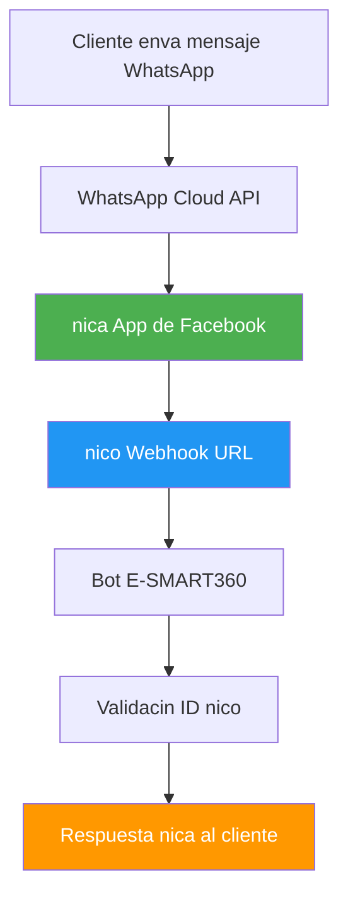

import { Callout, Steps, Step, Expandable, Columns, Card, Tabs, Tab, CodeGroup, CodeGroupItem, Update } from '@components';

# Cómo Solucionar Respuestas Duplicadas en un Bot de WhatsApp

<Callout type="warning" title="Problema frecuente en bots de WhatsApp">
Si tu bot de WhatsApp está enviando respuestas duplicadas a tus clientes, no estás solo. Este es uno de los problemas más comunes al configurar un chatbot, pero afortunadamente tiene una solución clara y directa. En esta guía te explicamos paso a paso por qué ocurre y cómo resolverlo definitivamente.
</Callout>

## ¿Por qué ocurre el problema de respuestas duplicadas?

La causa principal de las respuestas duplicadas es la configuración de **múltiples aplicaciones de Facebook** utilizando la **misma URL de webhook**. Veamos cómo sucede esto en la práctica:

<Callout type="info" title="¿Sabías que...?">
La API de WhatsApp Business permite gestionar varios números de teléfono bajo una sola aplicación de Facebook. Sin embargo, muchos usuarios, al querer configurar bots para múltiples números, crean aplicaciones separadas para cada uno, lo que genera el conflicto.
</Callout>

### Desglose del problema

<Steps>
<Step title="Creación de múltiples apps de Facebook">
Muchos usuarios que desean configurar bots de WhatsApp para varios números de teléfono crean aplicaciones de Facebook independientes para cada número. Esto parece lógico a primera vista, pero tiene una consecuencia no deseada.
</Step>

<Step title="Misma URL de webhook en todas las apps">
Al configurar estas aplicaciones, el usuario utiliza la misma URL de webhook para todas ellas. Esto suele ocurrir porque el panel del chatbot proporciona una única URL de webhook que se copia y pega en cada aplicación.
</Step>

<Step title="Disparo múltiple del webhook">
Cuando un cliente envía un mensaje al bot, ese mensaje se entrega a través de la API de WhatsApp Cloud. Como hay múltiples aplicaciones de Facebook configuradas con la misma URL de webhook, **cada una de ellas dispara el webhook por separado**. El resultado: el bot recibe el mismo mensaje varias veces y responde otras tantas.
</Step>
</Steps>

<Callout type="danger" title="Consecuencia directa">
El cliente recibe 2, 3 o más copias idénticas de la misma respuesta. Esto genera una mala experiencia de usuario, confusión y puede dañar la reputación de tu negocio.
</Callout>

## Cómo evitar las respuestas duplicadas

<Callout type="tip" title="La regla de oro">
**Nunca crees múltiples aplicaciones de Facebook** para cada número de WhatsApp Business. En su lugar, agrega todos tus números de teléfono a una **sola aplicación de Facebook**.
</Callout>

### ¿Por qué funciona esta solución?

La API de WhatsApp Business permite gestionar **múltiples números de teléfono** bajo una misma aplicación de Facebook. Al utilizar una sola aplicación:

- Solo necesitas **configurar una única URL de webhook**
- El webhook se dispara **una sola vez** por cada mensaje entrante
- Eliminas por completo la posibilidad de respuestas duplicadas
- Simplificas la gestión de tu infraestructura técnica

<Callout type="success" title="Beneficio adicional">
Además de solucionar el problema de duplicados, centralizar todo en una sola app reduce la complejidad de tu configuración y facilita el mantenimiento futuro.
</Callout>

## Pasos para agregar múltiples números a una sola aplicación de Facebook

Sigue estos pasos con cuidado para consolidar todos tus números en una única aplicación:

<Tabs>
<Tab title="Facebook Developer">

<Steps>
<Step title="Accede a tu cuenta de Facebook Developer">
Ve a developers.facebook.com e inicia sesión con tu cuenta de Facebook. Asegúrate de usar la misma cuenta asociada a tu administrador de negocio de Meta.
</Step>

<Step title="Selecciona la aplicación de WhatsApp">
En el panel de desarrollador, busca y selecciona la aplicación que ya has creado para WhatsApp. Si tienes varias, elige la que quieras usar como principal.
</Step>

<Step title="Navega a la configuración de WhatsApp">
En el menú lateral, busca la sección de **WhatsApp** y haz clic en ella. Aquí verás la configuración actual de tu integración con WhatsApp Cloud API.
</Step>

<Step title="Agrega números adicionales">
Busca la opción para agregar números de teléfono. Verás un campo donde puedes añadir nuevos números de WhatsApp Business. Ingresa cada número adicional que desees gestionar.
</Step>

<Step title="Configura una sola URL de webhook">
Asegúrate de que **solo una URL de webhook** esté configurada para esta aplicación. Verifica que no haya URLs duplicadas o redundantes en otras aplicaciones.
</Step>
</Steps>

</Tab>
<Tab title="Panel E-SMART360">

<Steps>
<Step title="Accede a la configuración de canales">
Desde tu panel de E-SMART360, ve a la sección **Canales > WhatsApp** y revisa la configuración actual de tu conexión.
</Step>

<Step title="Vincula tu aplicación de Facebook">
Si ya tienes una aplicación de Facebook configurada, asegúrate de que todos tus números de WhatsApp estén vinculados a ella. Desde el panel puedes gestionar esta vinculación.
</Step>

<Step title="Verifica el webhook activo">
En la configuración del canal WhatsApp, revisa la URL del webhook. Debe ser la misma para todos los números. Si ves más de una URL activa, corrige la configuración para mantener solo una.
</Step>

<Step title="Prueba la conexión">
Utiliza la herramienta de prueba integrada para enviar un mensaje de prueba y confirmar que solo recibes una respuesta. El sistema te indicará si detecta configuraciones duplicadas.
</Step>
</Steps>

</Tab>
</Tabs>

## ¿Qué hacer si ya estás sufriendo el problema?

Si ya estás experimentando respuestas duplicadas, no te preocupes. Sigue estos pasos para resolverlo:

### 1. Revisa tus aplicaciones de Facebook

<Callout type="warning" title="Primero, diagnostica el alcance del problema">
Antes de hacer cambios, identifica todas las aplicaciones de Facebook que tienes configuradas. Es posible que hayas creado varias a lo largo del tiempo y hayas olvidado algunas.
</Callout>

Accede a tu cuenta de Facebook Developer y revisa **todas** las aplicaciones que has creado. Presta especial atención a:

- Aplicaciones que tienen configurado el producto WhatsApp
- Aplicaciones que contienen la misma URL de webhook
- Aplicaciones antiguas que ya no utilizas pero siguen activas

<Callout type="danger" title="Cuidado con las apps olvidadas">
Es muy común encontrar aplicaciones de prueba, versiones antiguas o configuraciones abandonadas que siguen activas y disparando webhooks. Revísalas todas.
</Callout>

### 2. Elimina los webhooks redundantes

Una vez que hayas identificado qué aplicación usarás como principal:

1. **Decide la app principal**: Elige la aplicación que seguirás utilizando. Idealmente, la que tenga la configuración más completa.
2. **Elimina webhooks de las demás apps**: En cada aplicación que no vayas a usar, elimina la URL del webhook de la configuración de WhatsApp.
3. **Mantén activo solo un webhook**: Verifica que solo la aplicación principal tenga la URL del webhook configurada.

<Callout type="info" title="IMPORTANTE - Orden de operaciones">
Siempre elimina primero los webhooks redundantes en las apps secundarias antes de hacer cualquier otro cambio. Esto evita que durante el proceso de migración se sigan generando respuestas duplicadas.
</Callout>

### 3. Prueba tu bot

Después de hacer los cambios, realiza una prueba completa:

```bash
# Envía un mensaje de prueba desde un número real
# Verifica que solo recibes UNA respuesta del bot
# Repite la prueba con diferentes palabras clave
```

<Steps>
<Step title="Prueba básica">
Envía un mensaje de "Hola" desde un número de WhatsApp que no sea el tuyo y verifica que recibas exactamente una respuesta.
</Step>

<Step title="Prueba de flujo completo">
Ejecuta un flujo completo de conversación (saludo, pregunta, respuesta) y confirma que no hay mensajes duplicados en ningún paso.
</Step>

<Step title="Prueba con múltiples números">
Si gestionas varios números, envía mensajes de prueba a cada uno y verifica que todos funcionan correctamente sin duplicados.
</Step>

<Step title="Monitoreo continuo">
Durante las primeras 24-48 horas después del cambio, monitorea activamente tus conversaciones para asegurarte de que el problema no reaparece.
</Step>
</Steps>

## Diagnóstico avanzado con webhooks y logs

Si después de seguir los pasos anteriores el problema persiste, es posible que haya configuraciones adicionales que revisar. E-SMART360 proporciona herramientas de diagnóstico avanzadas para estos casos.

<Callout type="warning" title="Problemas persistentes">
Si el problema continúa después de eliminar los webhooks redundantes, puede haber otras causas como: proxies inversos mal configurados, balanceadores de carga, o sistemas de caché que reenvían peticiones múltiples.
</Callout>

### Revisión de logs de webhook

Puedes revisar los registros de actividad de tu webhook para identificar si está recibiendo peticiones duplicadas:

<Steps>
<Step title="Accede a los logs de webhook">
Desde el panel de E-SMART360, ve a la sección **Configuración > Webhooks > Logs de actividad**.
</Step>

<Step title="Filtra por endpoint">
Busca todas las entradas correspondientes a la URL de tu webhook de WhatsApp. Revisa la frecuencia con la que se reciben las peticiones.
</Step>

<Step title="Identifica patrones de duplicación">
Si ves que por cada mensaje entrante aparecen 2 o más entradas en el log con marcas de tiempo muy cercanas (menos de 500ms de diferencia), confirmas que hay disparos múltiples.
</Step>
</Steps>

### Implementa un identificador único por mensaje

Una técnica avanzada para evitar respuestas duplicadas es utilizar identificadores únicos (ID de mensaje) para detectar y descartar peticiones repetidas:

<CodeGroup>
<CodeGroupItem title="Ejemplo de validación">

```javascript
// Pseudocódigo: Validación de ID único de mensaje
const processedMessages = new Set();

function handleIncomingMessage(message) {
  const messageId = message.entry[0].changes[0].value.messages[0].id;
  
  // Si ya procesamos este mensaje, lo descartamos
  if (processedMessages.has(messageId)) {
    console.log(`Mensaje duplicado detectado: ${messageId}`);
    return;
  }
  
  // Registramos el ID como procesado
  processedMessages.add(messageId);
  
  // Procesamos el mensaje normalmente
  return processMessage(message);
}
```

</CodeGroupItem>
</CodeGroup>

## Arquitectura recomendada para evitar duplicados

Para una configuración robusta y a prueba de duplicados, te recomendamos la siguiente arquitectura:



<Callout type="success" title="Arquitectura limpia - Una sola app, un solo webhook, una sola respuesta">
Este diagrama muestra la configuración ideal: un solo flujo desde el mensaje del cliente hasta la respuesta del bot, sin bifurcaciones que generen duplicados.
</Callout>

## El papel del webhook en la entrega de mensajes

El webhook es el mecanismo mediante el cual WhatsApp Cloud API notifica a tu bot cuando recibe un mensaje entrante. Es el **punto de entrada** de todos los mensajes y, por tanto, el punto crítico donde se originan los duplicados.

<Callout type="info" title="¿Qué es un webhook?">
Un webhook es una llamada HTTP que un servicio (en este caso, WhatsApp Cloud API) hace a una URL específica (tu bot) cuando ocurre un evento (un nuevo mensaje). Es como una notificación en tiempo real.
</Callout>

### Cómo configurar correctamente un webhook en E-SMART360

<Steps>
<Step title="Obtén tu URL de webhook">
En el panel de E-SMART360, navega a **Canales > WhatsApp > Configuración de webhook**. Copia la URL única que se te proporciona.
</Step>

<Step title="Configura en Facebook Developer">
Ve a tu aplicación de Facebook, selecciona el producto WhatsApp y pega la URL en el campo de webhook. Selecciona los eventos que deseas recibir (generalmente `messages`).
</Step>

<Step title="Verifica el token de verificación">
Facebook Developer enviará una solicitud GET de verificación a tu URL. E-SMART360 maneja esto automáticamente, pero asegúrate de que el token de verificación coincida.
</Step>

<Step title="Suscríbete a los campos requeridos">
En la configuración del webhook, suscríbete al menos al campo `messages`. También puedes suscribirte a `message_deliveries`, `message_reads` y otros según tus necesidades.
</Step>
</Steps>

<Callout type="important" title="CRUCIAL: Verifica los pasos 1 y 2">
Si ya tienes webhooks configurados en otras aplicaciones de Facebook con la misma URL, **debes eliminarlos**. Cada URL de webhook debe estar configurada en **exactamente una** aplicación de Facebook para evitar duplicados.
</Callout>

## Gestión de conversaciones y agentes múltiples

Cuando tienes múltiples agentes atendiendo conversaciones, es importante diferenciar entre respuestas automáticas duplicadas (el problema que resolvemos aquí) y la asignación manual de agentes.

<Callout type="tip" title="No confundir agentes con apps">
Tener múltiples agentes humanos atendiendo conversaciones desde el mismo panel de E-SMART360 no causa respuestas duplicadas. El problema ocurre solo cuando hay múltiples aplicaciones de Facebook que disparan el mismo webhook.
</Callout>

E-SMART360 permite gestionar equipos de atención al cliente con funciones como:

<Columns cols="3">
<Card title="Asignacin de agentes">
Cada agente puede atender conversaciones específicas sin interferir con los demás. El sistema garantiza que solo un agente responda a la vez.
</Card>
<Card title="Firma de mensajes">
Cada agente puede configurar una firma personalizada para que el cliente sepa quién le está atendiendo.
</Card>
<Card title="Notas internas">
Los agentes pueden dejar notas visibles solo para el equipo, facilitando la colaboración sin afectar la experiencia del cliente.
</Card>
</Columns>

## Configuración avanzada: Respuesta por no coincidencia

Un problema relacionado con los duplicados ocurre cuando el bot no reconoce un mensaje y termina respondiendo múltiples veces sin sentido. Para evitarlo, E-SMART360 incluye un sistema de **Respuesta por No Coincidencia** (No Match Reply).

<Callout type="info" title="¿Qué es la respuesta por no coincidencia?">
Es un mensaje que se envía cuando el mensaje de un cliente no coincide con ninguna palabra clave configurada en tu chatbot. En lugar de dejar el mensaje sin respuesta, el bot ofrece una alternativa útil.
</Callout>

### Configuración de la frecuencia de respuesta

Para evitar que el bot envíe la misma respuesta de "no coincidencia" una y otra vez, puedes ajustar la frecuencia:

<Tabs>
<Tab title="Responder siempre">
El bot responde cada vez que recibe un mensaje no reconocido. Útil cuando quieres asegurarte de que ningún mensaje quede sin respuesta, pero puede generar respuestas repetitivas si el cliente insiste con la misma frase.
</Tab>
<Tab title="Una vez al da">
El bot responde solo una vez al día con el mensaje de no coincidencia, independientemente de cuántos mensajes no reconocidos envíe el cliente. Así evitas la sensación de "respuesta duplicada" cuando el cliente escribe frases que el bot no entiende.
</Tab>
</Tabs>

### Pasos para configurar la respuesta por no coincidencia

<Steps>
<Step title="Accede al Gestor de Bot">
Desde el panel de E-SMART360, navega a **Canales > WhatsApp > Gestor de Bot**.
</Step>

<Step title="Selecciona la plantilla de No Coincidencia">
Haz clic en **Acciones** y selecciona **Plantilla de respuesta por no coincidencia**. Esto abrirá el editor visual de flujos.
</Step>

<Step title="Edita la respuesta">
Personaliza el texto de respuesta. Puedes añadir imágenes, botones o contenido interactivo. Por ejemplo: "Lo siento, no entendí tu mensaje. ¿Puedes reformularlo o seleccionar una opción del menú principal?"
</Step>

<Step title="Configura la frecuencia">
Ve a **Configuración del Bot**. Activa la opción **Respuesta por no coincidencia** y selecciona la frecuencia deseada: **Cada vez** o **Una vez al día**.
</Step>

<Step title="Guarda los cambios">
Haz clic en **Guardar configuración**. El bot comenzará a usar la nueva respuesta de no coincidencia con la frecuencia seleccionada.
</Step>
</Steps>

<Callout type="success" title="Diferencia clave">
Mientras que el problema de respuestas duplicadas por múltiples webhooks duplica TODAS las respuestas del bot, la respuesta por no coincidencia configura cómo manejar mensajes NO RECONOCIDOS. Configurar ambas correctamente garantiza una experiencia completa y libre de repeticiones.
</Callout>

## Integración con API HTTP para validación avanzada

Para usuarios con necesidades técnicas más avanzadas, E-SMART360 permite integrar APIs HTTP externas dentro del flujo del bot. Esto puede utilizarse como una capa adicional de validación para prevenir respuestas duplicadas.

<Callout type="info" title="¿Cómo ayuda una API externa?">
Puedes configurar tu bot para que, antes de responder, consulte un servicio externo que verifique si ese mensaje ya fue procesado. Esto es especialmente útil si tienes múltiples instancias del bot o una infraestructura compleja.
</Callout>

### Configuración de validación externa

<Steps>
<Step title="Crea el endpoint de validación">
En tu servidor, crea un endpoint que reciba el ID del mensaje de WhatsApp y devuelva si ya fue procesado. Puedes usar una base de datos en memoria como Redis para alta velocidad.
</Step>

<Step title="Configura la acción HTTP en el flujo del bot">
En el editor visual de flujos de E-SMART360, agrega una acción **HTTP API** entre la recepción del mensaje y el envío de la respuesta.
</Step>

<Step title="Define la petición">
Configura el método POST, la URL de tu endpoint de validación, y el cuerpo de la petición incluyendo el ID del mensaje (disponible como variable {{message_id}}).
</Step>

<Step title="Maneja la respuesta">
Configura condiciones en el flujo: si la API responde que el mensaje ya fue procesado, no envías respuesta. Si es un mensaje nuevo, continúas con el flujo normal.
</Step>
</Steps>

## Control de frecuencia de mensajes (Frequency Capping)

Meta implementa restricciones de frecuencia para evitar que los usuarios reciban demasiados mensajes promocionales. Aunque no está directamente relacionado con los duplicados técnicos, un mal manejo de la frecuencia puede hacer que tu bot parezca repetitivo.

<Callout type="tip" title="El capping de frecuencia de Meta">
Meta limita la cantidad de mensajes promocionales que un usuario puede recibir para proteger su experiencia. Esta limitación se aplica de forma dinámica y puede afectar la entrega de tus mensajes si no gestionas adecuadamente la frecuencia.
</Callout>

### Mejores prácticas para evitar el capping de frecuencia

<Columns cols="2">
<Card title="Calidad sobre cantidad">
- Espacia tus mensajes promocionales
- Crea contenido valioso y relevante
- Monitorea las tasas de entrega
- Espera 24-48 horas antes de reenviar mensajes fallidos
</Card>
<Card title="Consentimiento y preferencias">
- Obtén consentimiento explícito del usuario
- Ofrece opciones claras de cancelación
- Segmenta tu audiencia por intereses
- Respeta las preferencias de comunicación
</Card>
</Columns>

<Callout type="info" title="¿Afecta el capping a los mensajes de servicio?">
El capping de frecuencia de Meta afecta principalmente a los mensajes promocionales o de marketing. Los mensajes de servicio (confirmaciones de pedidos, actualizaciones de envío, atención al cliente) no se ven afectados por esta restricción.
</Callout>

## Matriz de resolución rápida de problemas

<Callout type="warning" title="Guía rápida de diagnóstico">
Usa esta tabla para identificar rápidamente qué tipo de problema de duplicados o respuestas múltiples estás experimentando y cómo resolverlo.
</Callout>

| Sntoma | Causa probable | Solucin | Tiempo estimado |
|--------|---------------|----------|-----------------|
| El cliente recibe 2-3 copias exactas del mismo mensaje | Múltiples apps de Facebook con el mismo webhook | Consolidar en una sola app y eliminar webhooks redundantes | 15-30 minutos |
| El cliente recibe respuestas repetitivas pero no idénticas | Configuración de No Match Reply sin límite de frecuencia | Activar frecuencia "Una vez al día" en No Match Reply | 5 minutos |
| El cliente recibe el mismo mensaje después de mucho tiempo | El webhook se reenvió por timeout | Verificar tiempo de respuesta del servidor y configurar idempotencia | 30-60 minutos |
| Respuestas duplicadas intermitentes (a veces sí, a veces no) | Balanceador de carga o proxy reenviando peticiones | Revisar configuración de Nginx, Apache o Cloudflare | 1-2 horas |
| Solo algunos números reciben respuestas duplicadas | Esos números están en apps separadas con webhook compartido | Migrar todos los números a una sola app de Facebook | 15 minutos |
| Duplicados después de una actualización del bot | Webhook reconfigurado automáticamente | Revisar configuración post-actualización y eliminar webhooks sobrantes | 10 minutos |

## Bandeja compartida: gestión de conversaciones en equipo

Cuando operas un equipo de atención al cliente, una causa común de confusión es que múltiples agentes respondan al mismo cliente. E-SMART360 ofrece una bandeja compartida con herramientas para evitar esto.

<Callout type="tip" title="Diferencia importante">
Las respuestas duplicadas técnicas (por webhook) son diferentes a que dos agentes respondan al mismo tiempo. La bandeja compartida resuelve el segundo problema, mientras que la consolidación de apps resuelve el primero. Para una operación impecable, necesitas resolver AMBOS.
</Callout>

### Funciones clave de la bandeja compartida

<Columns cols="3">
<Card title="Asignacin de agentes">
Asigna cada conversación a un agente específico. Los demás miembros del equipo ven que la conversación ya tiene un responsable, evitando respuestas múltiples.
</Card>
<Card title="Etiquetas y filtros">
Organiza las conversaciones por estado, prioridad o categoría. Filtra fácilmente para ver solo las conversaciones asignadas a ti.
</Card>
<Card title="Notas internas">
Deja notas visibles solo para el equipo. Coordina estrategias de respuesta sin que el cliente vea la comunicación interna.
</Card>
</Columns>

### Cómo evitar que dos agentes respondan al mismo cliente

<Steps>
<Step title="Activa la asignación automática">
Configura la bandeja compartida para que asigne automáticamente nuevas conversaciones a los agentes disponibles según su carga de trabajo.
</Step>

<Step title="Usa la sección Mis chats">
Cada agente debe trabajar desde la vista **Mis chats** en lugar de **Todos los chats**. Así solo ven las conversaciones que les fueron asignadas.
</Step>

<Step title="Pausa el bot cuando sea necesario">
Si un agente está atendiendo una conversación, puede pausar temporalmente las respuestas automáticas del bot para esa conversación específica desde el panel de acciones.
</Step>

<Step title="Establece protocolos de handover">
Define un procedimiento claro para transferir conversaciones entre agentes. Usa la función de **firma de mensaje** para que el cliente sepa quién le está atendiendo.
</Step>
</Steps>

## Bandeja de entrada y gestión de suscriptores

Cuando gestionas múltiples conversaciones, una bandeja de entrada bien organizada te ayuda a evitar confusiones que podrían llevar a respuestas duplicadas.

### Funciones de organización

- **Búsqueda de suscriptores**: Encuentra rápidamente cualquier conversación por nombre o número de teléfono.
- **Filtros avanzados**: Filtra por etiquetas, secuencias, respuesta reciente del suscriptor o comunicación reciente del agente.
- **Secciones organizadas**: La bandeja se divide en Mis chats, Todos los chats, No leídos, Archivados, Bloqueados y Resueltos.
- **Recordatorios de seguimiento**: Programa recordatorios para hacer seguimiento a conversaciones pendientes.

### Traducción y asistencia AI

La bandeja compartida incluye herramientas que ayudan a los agentes a responder de manera consistente:

- **Traducción automática**: Traduce mensajes de clientes a tu idioma preferido con un solo clic.
- **Reescritura con IA**: Mejora la redacción de tus respuestas antes de enviarlas.
- **Respuestas prefabricadas**: Usa respuestas predefinidas para preguntas frecuentes, asegurando consistencia y evitando que diferentes agentes den información contradictoria.
- **Firma del agente**: Al unirte a una conversación, una firma automática le indica al cliente qué agente lo está atendiendo.

## Ejemplos prácticos

### Ejemplo 1: Configuración correcta vs incorrecta

<Columns cols="2">
<Card title="Configuracin INCORRECTA">
**App 1 de Facebook** -> Webhook URL `https://tu-bot.com/webhook`
**App 2 de Facebook** -> Webhook URL `https://tu-bot.com/webhook`
**App 3 de Facebook** -> Webhook URL `https://tu-bot.com/webhook`

Cliente enva "Hola" -> webhook se dispara 3 veces -> bot responde 3 veces
</Card>
<Card title="Configuracin CORRECTA">
**App nica de Facebook** -> Webhook URL `https://tu-bot.com/webhook`
Nmero 1: +34 612 345 678
Nmero 2: +34 698 765 432
Nmero 3: +34 677 888 999

Cliente enva "Hola" -> webhook se dispara 1 vez -> bot responde 1 vez
</Card>
</Columns>

### Ejemplo 2: Migración de configuración antigua a nueva

Una empresa tenía 3 números de WhatsApp configurados en 3 aplicaciones diferentes de Facebook. Estaban recibiendo respuestas triplicadas de su bot.

<Steps>
<Step title="Situación inicial">
3 aplicaciones de Facebook, cada una con el mismo webhook. Cada mensaje entrante generaba 3 respuestas idénticas.
</Step>

<Step title="Paso 1: Identificar la app principal">
Seleccionaron la App A como principal, ya que contenía la configuración más completa del bot.
</Step>

<Step title="Paso 2: Migrar números a la app principal">
Desde Facebook Developer, agregaron los números de las Apps B y C a la App A.
</Step>

<Step title="Paso 3: Eliminar webhooks redundantes">
En las Apps B y C, eliminaron la URL del webhook de la configuración de WhatsApp.
</Step>

<Step title="Resultado">
Una sola aplicación, un solo webhook, los 3 números funcionando sin duplicados. Tiempo total de la migración: 15 minutos.
</Step>
</Steps>

### Ejemplo 3: Escenario de e-commerce con múltiples canales

Una tienda online que vende por WhatsApp, Instagram y Facebook Messenger configuró un bot centralizado con E-SMART360. Al integrar los tres canales, notaron que los clientes que escribían por WhatsApp recibían respuestas duplicadas.

**El problema**: Aunque los tres canales usaban la misma plataforma de bot, cada canal tenía su propia aplicación de Facebook. Las apps de Instagram y Facebook Messenger también estaban disparando el webhook de WhatsApp accidentalmente.

**Solución aplicada:**

1. Se identificaron 3 aplicaciones de Facebook: una para WhatsApp, una para Instagram y una para Facebook Messenger
2. Se verificó que solo la app de WhatsApp tuviera el webhook de WhatsApp configurado
3. Se eliminaron las URLs de webhook de WhatsApp de las apps de Instagram y Facebook
4. Se consolidaron los números de teléfono en la app principal de WhatsApp
5. Resultado: cero duplicados, los tres canales funcionando independientemente

### Ejemplo 4: Empresa con múltiples sucursales

Una empresa con 5 sucursales, cada una con su propio número de WhatsApp, experimentaba respuestas duplicadas en todas ellas. La causa: cada sucursal había creado su propia aplicación de Facebook con el mismo webhook.

**Solución aplicada:**

<Steps>
<Step title="Centralización">
Se creó una sola aplicación de Facebook corporativa. Todos los 5 números se agregaron a esta aplicación.
</Step>

<Step title="Configuración unificada">
Se configuró un único webhook apuntando al bot de E-SMART360. Se eliminaron los webhooks de las 4 apps restantes.
</Step>

<Step title="Personalización por sucursal">
Se utilizaron las etiquetas y campos personalizados de E-SMART360 para identificar a qué sucursal pertenecía cada cliente según el número al que escribió.
</Step>

<Step title="Resultado">
Sin duplicados. Cada sucursal mantiene su identidad y número, pero toda la operación está centralizada en una sola plataforma.
</Step>
</Steps>

## Preguntas frecuentes

<Expandable title="Puedo tener dos webhooks diferentes para el mismo bot?">
No se recomienda. Tener dos webhooks configurados para el mismo bot significa que cada mensaje entrante se enviará dos veces a tu sistema, lo que probablemente generará respuestas duplicadas. Si necesitas enviar los datos a dos sistemas diferentes, utiliza un sistema de encadenamiento (un webhook que luego reenvíe a los demás destinos).
</Expandable>

<Expandable title="Qu pasa si necesito dos aplicaciones de Facebook por algn motivo tcnico?">
En casos muy específicos donde necesites dos aplicaciones separadas, asegúrate de que cada una tenga su **propia URL de webhook única**. Puedes configurar endpoints diferentes en tu bot (por ejemplo, `/webhook/app1` y `/webhook/app2`) para que cada app dispare un webhook distinto.
</Expandable>

<Expandable title="El problema de duplicados puede ocurrir tambin con Instagram o Facebook Messenger?">
Sí, el mismo principio aplica a cualquier canal que use la infraestructura de Facebook Developer. Si configuras múltiples aplicaciones con el mismo webhook para Instagram o Facebook Messenger, experimentarás el mismo problema de respuestas duplicadas. La solución es idéntica: consolida todo en una sola aplicación.
</Expandable>

<Expandable title="Cunto tiempo tarda en reflejarse el cambio despus de eliminar un webhook?">
Los cambios en la configuración de webhooks en Facebook Developer son prácticamente inmediatos. Una vez que eliminas la URL del webhook de una aplicación, esa aplicación deja de enviar peticiones a tu bot. Recomendamos esperar 2-3 minutos y luego realizar una prueba.
</Expandable>

<Expandable title="Las respuestas duplicadas afectan mi lmite de mensajes de WhatsApp?">
Sí, cada respuesta duplicada cuenta como un mensaje adicional dentro de tu límite de mensajes de WhatsApp. Si estás en un tier de mensajería limitado, los duplicados pueden consumir tu cuota rápidamente y provocar que alcances el límite antes de tiempo. Por eso es importante solucionar este problema no solo por la experiencia del usuario, sino también por eficiencia de costos.
</Expandable>

<Expandable title="E-SMART360 detecta automticamente configuraciones duplicadas?">
E-SMART360 incluye un monitor de configuración que analiza los patrones de mensajes entrantes. Si detecta que un mismo mensaje está llegando múltiples veces en un período corto de tiempo (lo que indica webhooks duplicados), mostrará una alerta en el panel de administración. Sin embargo, la corrección debe hacerse desde Facebook Developer como se describe en esta guía.
</Expandable>

<Expandable title="Cmo afecta la regla de las 24 horas de WhatsApp a los duplicados?">
La regla de las 24 horas de WhatsApp establece que las empresas pueden enviar mensajes dentro de una ventana de 24 horas después del último mensaje del cliente. Si tienes respuestas duplicadas y superas esta ventana, algunos mensajes podrían no entregarse. Además, los duplicados consumen innecesariamente esta ventana de conversación, reduciendo el tiempo disponible para interacciones útiles.
</Expandable>

<Expandable title="Puedo tener un nico webhook pero apuntar a dos bots diferentes?
Sí, técnicamente es posible, pero no se recomienda tener un solo webhook apuntando a dos bots diferentes porque ambos procesarán el mismo mensaje y generarán respuestas duplicadas para el cliente. Si necesitas que dos sistemas reciban los mensajes, la arquitectura correcta es que UN bot reciba el webhook y luego distribuya los datos internamente a los otros sistemas.
</Expandable>

<Expandable title="Qu es un token de verificacin de webhook y cmo se configura?">
El token de verificación es una cadena secreta que configuras tanto en Facebook Developer como en tu bot para confirmar que eres el propietario del webhook. En E-SMART360, este token se genera automáticamente y se muestra en la configuración del canal WhatsApp. Solo debes copiarlo y pegarlo en Facebook Developer durante la configuración inicial del webhook.
</Expandable>

<Expandable title="Las respuestas duplicadas pueden ocurrir dentro de un mismo flujo del bot?">
Sí, aunque menos común, si tu flujo del bot tiene bifurcaciones mal diseñadas (por ejemplo, dos caminos que llevan al mismo nodo de envío de mensaje sin una condición excluyente), un solo mensaje entrante podría generar múltiples respuestas. Revisa la lógica de tu flujo en el editor visual de E-SMART360 para asegurarte de que cada condición sea mutuamente excluyente.
</Expandable>

## Conclusión

El problema de las respuestas duplicadas en un bot de WhatsApp parece complejo, pero su solución es sorprendentemente simple: **una sola aplicación de Facebook, un solo webhook**. Al consolidar todos tus números de WhatsApp Business en una única aplicación de Facebook, eliminas la causa raíz del problema.

<Callout type="success" title="Beneficios de una configuración correcta">
- **Experiencia del cliente**: Tus clientes reciben exactamente una respuesta por cada mensaje que envían
- **Eficiencia de costos**: No malgastas mensajes de tu cuota de WhatsApp en respuestas duplicadas
- **Mantenimiento simplificado**: Gestionas un solo webhook, una sola configuración
- **Tranquilidad**: Una vez configurado correctamente, el problema no volverá a aparecer
</Callout>

Además, complementar tu configuración con buenas prácticas como la respuesta por no coincidencia con frecuencia controlada, la validación de ID único de mensaje, y una bandeja compartida bien organizada, garantiza una operación impecable de tu bot de WhatsApp.

<Callout type="tip" title="La clave del éxito">
**Una sola aplicación de Facebook, un solo webhook.** Esta simple regla eliminará para siempre el problema de respuestas duplicadas en tu bot de WhatsApp.
</Callout>

<Update title="Nueva funcionalidad: Monitor de webhooks en vivo" date="8 de mayo de 2026">
E-SMART360 ha implementado una nueva herramienta de monitoreo de webhooks en tiempo real. Ahora puedes ver cada petición entrante a tu webhook con su ID único, marca de tiempo y origen. Esto facilita enormemente la detección de configuraciones duplicadas. Accede desde **Configuración > Webhooks > Monitor en vivo**.
</Update>

---

## Recursos adicionales

- [Guía de configuración de WhatsApp Cloud API](/recursos/configuracion-whatsapp-cloud-api)
- [Solución de errores comunes en WhatsApp API](/recursos/errores-comunes-whatsapp-api)
- [Optimización de flujos de bot para evitar respuestas múltiples](/recursos/optimizacion-flujos-bot)
- [Gestión de equipos y agentes en la bandeja compartida](/recursos/bandeja-compartida-agentes)
- [Configuración de respuesta por no coincidencia](/recursos/respuesta-no-coincidencia)
- [Integración de APIs externas en flujos de bot](/recursos/api-externa-flujos)
