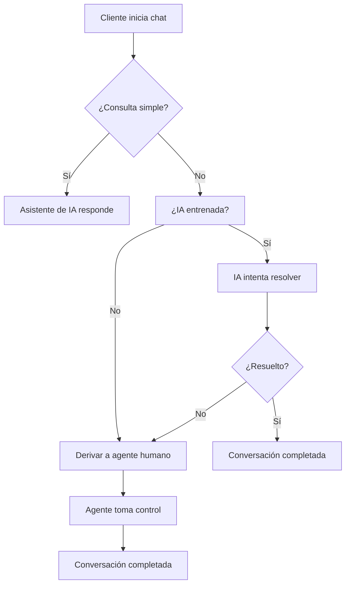

# Cómo Usar el Asistente de IA en el Chat Web para Soporte al Cliente

En el mundo del comercio digital actual, la satisfacción del cliente lo es todo. Implementar un asistente de IA en tu chat web puede marcar la diferencia entre un negocio que crece y uno que se queda atrás. En esta guía exploraremos cómo usar el asistente de IA en el chat web para generar más leads, aumentar las ventas, mantener a tus clientes enganchados y construir relaciones duraderas con ellos.

<Callout type="info">
  En cualquier negocio en línea, la satisfacción del cliente es primordial. Lograr el éxito empresarial en cualquier industria es posible si mantienes a tus clientes felices y satisfechos. No hay mejor forma de mantener a un cliente contento que brindándole el mejor soporte posible.
</Callout>

## Problemas del Soporte al Cliente en los Negocios en Línea

Uno de los problemas más grandes que enfrentan los negocios en línea es la capacidad de ayudar a sus clientes de manera oportuna. A continuación, algunos de los desafíos más comunes:

- Largos tiempos de espera en llamadas telefónicas o respuestas por correo electrónico
- Falta de disponibilidad fuera del horario laboral
- Calidad de atención inconsistente según el agente que atienda
- Oportunidades perdidas para recopilar comentarios de los clientes
- Dificultad para escalar el soporte a medida que el negocio crece

Por todo esto, contar con un chat web nativo en tu sitio web es una necesidad absoluta para brindar un mejor soporte al cliente.

<Callout type="tip">
  Un dato revelador: según estudios del sector, los clientes que usan chat en vivo tienen tres veces más probabilidades de realizar una compra que aquellos que no lo usan.
</Callout>

## ¿Qué es el Chat Web?

El chat web es una herramienta de comunicación en tiempo real que permite a los visitantes de tu sitio web interactuar con tus representantes de servicio al cliente u otros miembros del equipo a través de mensajería directa desde tu página. Generalmente aparece como una superposición en el sitio web, permitiendo a los visitantes iniciar conversaciones fácilmente y recibir asistencia inmediata.

### Chat Web desde la Perspectiva del Empresario

Cuando usas el chat web para hablar con tus clientes, obtienes múltiples beneficios:

- **Clientes más satisfechos**: Reciben ayuda rápida sin complicaciones adicionales
- **Más ventas**: Puedes responder preguntas y guiar a los clientes a través de tu embudo de ventas
- **Ahorro de costos**: Puedes configurar chatbots de IA personalizados que hablen con muchos clientes simultáneamente, reduciendo la necesidad de más agentes de soporte
- **Datos valiosos**: Aprendes cómo se comportan tus clientes para organizar mejor tu tienda
- **Fidelización de marca**: Al ofrecer chat web, demuestras que te preocupas por tus clientes

### Chat Web desde la Perspectiva del Cliente

Imagina poder hablar con un negocio directamente en su sitio web. El chat web es súper fácil y ahorra tiempo porque:

- No tienes que esperar en una llamada en espera
- No necesitas escribir correos largos y esperar respuestas
- Puedes hablar con un agente que te ayude de inmediato
- Puedes llevar la conversación a tu propio ritmo: detenerte, pensar, investigar y hacer más preguntas cuando quieras
- Es ideal para personas que tienen dificultades para hablar por teléfono

<Columns cols="2">
  <Card title="Para el negocio">
    - Mayor satisfacción del cliente
    - Incremento en ventas
    - Reducción de costos operativos
    - Datos e insights valiosos
  </Card>
  <Card title="Para el cliente">
    - Atención inmediata
    - Sin tiempos de espera
    - Conversación a su propio ritmo
    - Accesible desde cualquier dispositivo
  </Card>
</Columns>

## ¿Qué es un Asistente de IA?

Un Asistente de IA es una funcionalidad avanzada que utiliza inteligencia artificial para hacer que tu chat web, WhatsApp, Facebook Messenger, Instagram DM y Telegram sean más inteligentes y útiles. Al usar la función de Asistente de IA, tus chatbots pueden:

- **Entender lenguaje natural**: Procesar preguntas tal como las formularía un humano
- **Responder consultas de forma más humana**: Incluso preguntas complejas o fuera de las plantillas del bot
- **Personalizar interacciones**: Adaptar las respuestas según el contexto y el historial del cliente
- **Automatizar tareas**: Como responder FAQs, agendar citas e integrarse con flujos de trabajo existentes

<Callout type="success">
  Lo único que necesitas hacer es entrenar adecuadamente tu Asistente de IA. Esto mejora la experiencia del cliente con respuestas precisas y relevantes, liberando tiempo de tu equipo y haciendo que tu chatbot sea más escalable para negocios de todos los tamaños.
</Callout>

## ¿Cómo Funciona el Chat Web con un Asistente de IA?

Es muy fácil de usar. Solo necesitas seguir algunos pasos, hacer algunas configuraciones y estarás listo. Aquí tienes los pasos a seguir:

### Paso 1: Crear un Widget de Chat y Conectarlo con tu Sitio Web

Cuando quieras usar el chat web, necesitas crear un widget de chat. La plataforma te proporcionará un enlace que puedes pegar en la sección de pie de página de tu sitio web. Puedes personalizar tu widget de chat de varias formas:

<Steps>
  <Step title="Personaliza la apariencia del widget">
    - Tema de fondo
    - Color del tema
    - Fondo de la burbuja de chat
    - Logotipo de la marca
    - Posición de la caja de chat (izquierda/derecha)
  </Step>
  <Step title="Obtén el código de integración">
    La plataforma generará automáticamente un fragmento de código JavaScript o un enlace de integración.
  </Step>
  <Step title="Inserta el código en tu sitio web">
    - Si usas WordPress: puedes usar plugins o insertar el código directamente en el footer
    - Si usas HTML plano: pega el código antes de la etiqueta `</body>`
    - Si usas otros CMS: busca la sección de "scripts" o "código personalizado"
  </Step>
  <Step title="Verifica la instalación">
    Visita tu sitio web y confirma que el widget de chat aparece correctamente en la posición elegida.
  </Step>
</Steps>

<Callout type="tip">
  Para integrar el chat web con WordPress, puedes agregar el código de integración en el archivo footer.php de tu tema o utilizando un plugin de inserción de scripts como Insert Headers and Footers.
</Callout>

### Paso 2: Entrenar al Asistente de IA con los Datos de tu Negocio

Una vez que has creado el chat web y lo has conectado con tu sitio web, tus clientes pueden iniciar una conversación sobre cualquier duda que tengan acerca de productos o servicios. Cuando un cliente envía un mensaje a través del chat web, puedes verlo desde la bandeja de chat en vivo de la plataforma.

<Callout type="warning">
  **Limitaciones de los chatbots básicos**: Un chatbot básico solo puede proporcionar respuestas de soporte según cómo construiste la plantilla del bot. Pero cuando integras un Asistente de IA, este puede manejar cualquier tipo de pregunta de tus clientes.
</Callout>

#### Entrenamiento del Asistente de IA

Básicamente, entrenas al Asistente de IA con la misma información que usarías para entrenar a un agente de soporte humano. La plataforma te permite entrenar al Asistente de IA de las siguientes formas:

<Tabs>
  <Tab title="Capacitación con FAQs">
    <Steps>
      <Step title="Crear una campaña de entrenamiento">
        Ve a Panel de Control > Configuración > Campaña de Entrenamiento de IA. Haz clic en "Crear" para iniciar una nueva campaña. Ingresa un nombre y un mensaje de instrucción (prompt).
      </Step>
      <Step title="Ajustar el prompt por defecto">
        Define el rol y tono del bot. Por ejemplo: "Eres un agente de soporte amigable y profesional que representa a [nombre de la empresa]".
      </Step>
      <Step title="Agregar preguntas frecuentes">
        Haz clic en el botón Más (+) debajo de la campaña. Elige entre "Resumen" (respuestas ricas en contexto, más tokens) o "FAQs" (estructuradas y económicas). Sube el contenido en el formato requerido y guarda.
      </Step>
    </Steps>
  </Tab>
  <Tab title="Capacitación con URL">
    <Steps>
      <Step title="Agregar una URL">
        Haz clic en "Nuevo" bajo la sección de entrenamiento por URL. Ingresa la URL de la página web que contiene información relevante para tu negocio.
      </Step>
      <Step title="Seleccionar el tipo de selector">
        Elige entre ID o Clase según la estructura de la página web. Opcionalmente, elimina contenido innecesario como anuncios o encabezados.
      </Step>
      <Step title="Generar respuestas">
        Haz clic en "Generar FAQ" o "Generar Respuesta Cruda" y guarda los resultados.
      </Step>
    </Steps>
  </Tab>
  <Tab title="Capacitación con Archivos">
    <Steps>
      <Step title="Subir un archivo">
        Ve a Configuración de Archivos y haz clic en "Nuevo". Sube un archivo en formato PDF, Word (.doc) o TXT.
      </Step>
      <Step title="Elegir modo de procesamiento">
        - **Respuesta Cruda**: Proporciona una respuesta completa y detallada (mayor uso de tokens).
        - **FAQ**: Divide el contenido en preguntas frecuentes estructuradas (menor uso de tokens).
      </Step>
      <Step title="Guardar y finalizar">
        Guarda el archivo y finaliza el entrenamiento.
      </Step>
    </Steps>
  </Tab>
</Tabs>

#### Configuración del Comportamiento del Chatbot con IA

Una vez entrenado el asistente, debes configurar cómo se comportará:

1. **Configuración de Respuesta "Sin Coincidencia"**: Si el chatbot no puede emparejar una consulta, debe responder basándose en los datos entrenados. Ve a Gestor de Bot > Botones de Acción > Sin Coincidencia. Selecciona "Respuesta IA" y enlaza la campaña de IA entrenada. Activa la respuesta "Sin Coincidencia" en Configuración.

2. **Activación del Asistente de IA**: Ve al Gestor de Bot y activa "Habilitar Asistente de IA". Selecciona la campaña deseada y elige el modo de respuesta:
   - **Asistente de IA para Todas las Consultas**: La IA maneja absolutamente todas las preguntas de los clientes.
   - **IA como Respaldo Solamente**: La IA interviene solo cuando las reglas predefinidas del bot fallan.

<Callout type="success">
  La opción "IA como Respaldo Solamente" es ideal si ya tienes un flujo de bot bien definido y solo quieres que la IA atrape las preguntas que tu bot básico no puede responder.
</Callout>

### Paso 3: Automatizar Conversaciones Complejas con el Flujo de Entrada de Usuario

El Flujo de Entrada de Usuario es una funcionalidad avanzada que permite a los chatbots recopilar respuestas de los usuarios de manera estructurada. En lugar de enviar respuestas genéricas, tu chatbot puede:

- Hacer preguntas específicas en secuencia
- Almacenar las respuestas de los usuarios
- Utilizar los datos recopilados para personalizar conversaciones futuras

Esto ayuda a las empresas a automatizar el soporte, calificar leads y brindar un mejor servicio sin necesidad de agentes humanos todo el tiempo.

#### Características Clave del Flujo de Entrada de Usuario

- **Entrada de Usuario Dinámica**: Recopila y almacena información del cliente.
- **Rutas de Conversación Personalizadas**: Diseña interacciones del chatbot basadas en las respuestas del usuario.
- **Recopilación de Datos en Tiempo Real**: Usa las entradas del cliente de inmediato para proporcionar respuestas personalizadas.

<Callout type="tip">
  El Flujo de Entrada de Usuario no solo mejora la experiencia de soporte, sino que también ayuda a calificar leads de forma automática. Puedes preguntar por nombre, presupuesto, preferencias y mucho más, todo dentro de la conversación.
</Callout>

#### Casos de Uso del Flujo de Entrada de Usuario

- **Soporte al Cliente**: Guía a los usuarios paso a paso a través de la resolución de problemas.
- **Calificación de Leads**: Solicita detalles como nombre, presupuesto y preferencias antes de asignar a un agente.
- **Reserva de Citas**: Automatiza la programación de servicios y reuniones.
- **Asistencia en Comercio Electrónico**: Recomienda productos según las preferencias del usuario.

#### Cómo Configurar el Flujo de Entrada de Usuario

<Steps>
  <Step title="Accede al Gestor de Bot">
    Inicia sesión en la plataforma y ve a la sección Gestor de Bot. Selecciona el chatbot al que deseas añadir el flujo de entrada.
  </Step>
  <Step title="Navega a Flujo de Entrada">
    Dentro del chatbot, busca y selecciona la opción "Flujo de Entrada" o "Input Flow" en el menú de configuración.
  </Step>
  <Step title="Crea y diseña tu flujo">
    Haz clic en "Crear" y diseña el flujo de preguntas que deseas que el chatbot realice. Puedes definir preguntas abiertas, de opción múltiple o de selección.
  </Step>
  <Step title="Guarda y prueba">
    Guarda la configuración y prueba el chatbot para asegurarte de que todo funcione correctamente. Los datos recopilados se pueden ver en el Gestor de Suscriptores.
  </Step>
</Steps>

### Paso 4: Gestionar Conversaciones desde el Panel de Chat en Vivo

Una vez que has conectado el chat web con tu sitio web y has activado el Asistente de IA con el chatbot, ya estás listo. Ahora, cuando tus clientes visiten tu sitio web y necesiten asistencia, pueden simplemente enviar un mensaje en el chat web y tu chatbot de IA se encargará.

Puedes revisar la conversación completa desde el chat en vivo de la plataforma. El panel de chat en vivo se divide en tres secciones principales:

#### Sección 1: Lista de Suscriptores

Aquí verás todos tus suscriptores de chat web, WhatsApp y otros canales. Puedes:

- **Buscar suscriptores** por nombre usando la barra de búsqueda
- **Filtrar por etiquetas** para ver solo clientes de categorías específicas
- **Filtrar por secuencias** para ver suscriptores en flujos automatizados
- **Ordenar por respuesta reciente** o **comunicación reciente** para priorizar

Las opciones de visualización incluyen:

- **Mis chats**: Solo las conversaciones asignadas al agente actual
- **Todos los chats**: Todas las conversaciones sin filtrar
- **No leídos**: Mensajes que aún no has visto
- **Archivados**: Conversaciones antiguas guardadas para referencia futura
- **Bloqueados**: Mensajes de spam o abusivos
- **Resueltos**: Problemas de clientes que ya fueron solucionados

#### Sección 2: Ventana de Chat

Esta es el área donde conversas directamente con los clientes. Incluye funcionalidades avanzadas:

- **Marcar como no leído o archivar**: Organiza tus conversaciones según su estado
- **Recordatorio de seguimiento**: Programa una fecha y hora para responder cuando no puedas hacerlo de inmediato
- **Traducción de mensajes**: Traduce mensajes al idioma que prefieras con un solo clic
- **Mensajes de firma**: Antes de unirte a un chat, activa esta opción para que el cliente sepa qué agente lo está atendiendo
- **Reescribir con IA**: Mejora la redacción o corrige la gramática de tus mensajes automáticamente
- **Enviar plantillas o flujos**: Usa mensajes predefinidos o flujos de bot directamente desde el chat
- **Respuestas rápidas**: Inserta respuestas preescritas para preguntas frecuentes
- **Compartir archivos**: Arrastra y suelta múltiples archivos (imágenes, documentos) para enviarlos instantáneamente
- **Reproducción de audio y video**: Comparte y reproduce contenido multimedia directamente en la ventana de chat

<Callout type="info">
  La función "Reescribir con IA" es especialmente útil para equipos de soporte que manejan múltiples conversaciones en diferentes idiomas. Puedes escribir un borrador rápido y dejar que la IA lo refine antes de enviarlo.
</Callout>

#### Sección 3: Acciones de Chat

Esta sección te ayuda a gestionar conversaciones y colaborar con tu equipo:

- **Suscriptor / Dar de baja**: Controla el estado de suscripción de cada cliente
- **Pausar / Reanudar bot**: Toma el control manual de la conversación pausando temporalmente el chatbot
- **Restablecer flujo de entrada**: Reinicia todos los flujos de entrada del usuario con un solo clic
- **Limpiar historial**: Borra el historial de chat de tu vista (el cliente conserva el suyo)
- **Salir del chat**: Cuando termines de ayudar, puedes abandonar la conversación
- **Asignar agente**: Asigna la conversación a un miembro específico del equipo, quien recibirá una notificación
- **Añadir etiquetas**: Clasifica a los clientes por categorías para mejor organización
- **Campos personalizados**: Recolecta datos importantes del cliente como dirección, teléfono o preferencias
- **Notas internas**: Guarda información relevante sobre el cliente visible solo para tu equipo
- **Ventana de 24 horas**: Temporizador que muestra cuánto tiempo queda para responder antes de que el chat cierre según las reglas de WhatsApp

<Callout type="success">
  La colaboración en equipo es clave. Con la asignación de agentes, las notas internas y las etiquetas, todo tu equipo puede estar sincronizado y brindar una atención consistente.
</Callout>

Puedes revisar la conversación completa desde el chat en vivo de la plataforma. El panel de chat en vivo te permite:

- **Ver todas las conversaciones activas** en tiempo real, organizadas por estado
- **Tomar el control manual** de cualquier conversación cuando sea necesario
- **Asignar conversaciones** a otros miembros del equipo
- **Revisar el historial completo** de cada cliente para dar contexto
- **Usar mensajes de firma** para identificar qué agente atendió cada conversación

<Callout type="info">
  **Escalado inteligente**: El Asistente de IA puede detectar cuándo un usuario necesita ayuda humana (por ejemplo, frases como "Necesito hablar con una persona") y transferir automáticamente la conversación al miembro del equipo adecuado. Esto garantiza que ningún problema quede sin resolver.
</Callout>

#### Transferencia Eficiente de Conversaciones

La funcionalidad de transferencia de chat permite que los agentes humanos tomen el control cuando el chatbot de IA no puede resolver una consulta:

1. El Asistente de IA detecta la intención del cliente de hablar con un humano
2. La conversación se asigna automáticamente a un agente disponible
3. El agente recibe el contexto completo de la conversación
4. El agente continúa desde donde lo dejó la IA, sin necesidad de que el cliente repita información

<Callout type="success">
  Esta transferencia sin fricciones es clave para mantener la satisfacción del cliente. Nadie quiere repetir su problema una y otra vez. Con la integración entre IA y agentes humanos, el cliente siempre recibe una experiencia fluida.
</Callout>

## Beneficios del Chat Web Potenciado por IA

Conectar un chat web potenciado por IA puede beneficiarte a ti y a tu negocio de diversas maneras:

### Satisfacción del Cliente
El chat web proporciona tiempos de respuesta más rápidos. Ofrece disponibilidad 24/7, lo que significa que tus clientes recibirán asistencia incluso cuando no sea horario laboral o tus agentes de soporte estén ocupados con otras tareas importantes. Esto lleva a una mayor satisfacción del cliente porque a nadie le gusta esperar.

### Conveniencia
El chat web con IA ofrece una forma conveniente y accesible de obtener ayuda, sin necesidad de esperar en una llamada o programar una cita. Los clientes simplemente abren la caja de chat e inician una conversación para obtener una respuesta instantánea.

### Mayor Eficiencia
Puedes automatizar las tareas rutinarias de tus agentes de soporte y proporcionar respuestas instantáneas a las FAQs, liberando a los agentes humanos para que se enfoquen en problemas más complejos. Esto hará que tu equipo de soporte sea mucho más eficiente.

### Reducción de Costos de Soporte
Al usar el chat web con IA para el soporte al cliente, puedes reducir significativamente los costos de operación. Antes podrías necesitar 10-20 agentes humanos para tu equipo de soporte. Ahora, con el chat web potenciado por IA, puedes reducir ese costo a la mitad o incluso más, porque la IA puede encargarse de la mayoría de las consultas por sí misma.

### Autoatención
Los chatbots capacitan a los clientes para autogestionarse y resolver problemas de forma independiente, aumentando su autonomía. Esto no solo mejora la experiencia del cliente, sino que también reduce la carga de trabajo de tu equipo.

### Soporte Multilingüe
Los chatbots de IA pueden proporcionar soporte en múltiples idiomas. Solo necesitas entrenarlos adecuadamente. Esto facilita que las empresas lleguen a una audiencia global sin necesidad de contratar agentes multilingües.

### Recopilación de Datos
Puedes usar chatbots potenciados por IA para recopilar datos de clientes mediante diversos métodos, incluyendo:
- Recopilación explícita de datos a través de formularios y encuestas integrados
- Preguntas abiertas
- Menús interactivos
- Análisis del historial de conversaciones
- Seguimiento del comportamiento del usuario
- Análisis de sentimiento para proporcionar respuestas adecuadas

<Callout type="success">
  La IA puede analizar conversaciones de clientes para identificar el sentimiento y las emociones. Esta información se puede usar para mejorar la satisfacción del cliente, personalizar las interacciones y capacitar a los agentes humanos con información sobre los puntos débiles comunes de los clientes.
</Callout>

## Ejemplos de Casos de Uso Reales de Chat Web con IA

Estos son algunos ejemplos de grandes marcas que están aprovechando los chatbots con IA:

### Sephora — Chat de Asesoría de Belleza Personalizada

Sephora usa el chat web como parte de su servicio Beauty Chat, que permite a los clientes recibir asesoría de belleza personalizada y recomendaciones de productos en tiempo real de la mano de expertos. También integran herramientas impulsadas por IA como Sephora Virtual Artist, que utiliza realidad aumentada para permitir a los clientes probarse maquillaje virtualmente y recibir sugerencias personalizadas.

<Callout type="info">
  **Impacto empresarial**: el 50% de los consumidores espera que las empresas ofrezcan experiencias personalizadas. Sephora ha visto mejoras significativas tanto en la participación como en las ventas, contribuyendo a un aumento del 12% en el crecimiento de ventas y una tasa de retención de clientes superior al promedio.
</Callout>

### H&M — Optimización del Servicio al Cliente con Chatbot

H&M integra el chat web en su página de servicio al cliente para proporcionar asistencia en tiempo real a los compradores en línea. Los clientes pueden preguntar sobre disponibilidad de productos, verificar el estado de sus pedidos o resolver otros problemas a través del chat en vivo. H&M también usa chatbots para consultas más básicas, agilizando el proceso para sus clientes.

<Callout type="info">
  **Impacto empresarial**: el equipo de servicio al cliente de H&M reporta una reducción del 50% en los tiempos de respuesta gracias al uso del chat en vivo. Han visto tasas de conversión más altas y un aumento del 10-15% en la satisfacción del cliente.
</Callout>

### Lego — Compromiso con el Cliente y Creación de Comunidad

Lego usa el chat web para fomentar una conexión más profunda con los clientes, proporcionando soporte en tiempo real, facilitando la retroalimentación e impulsando la participación en su sitio de comercio electrónico.

<Callout type="info">
  **Impacto empresarial**: el compromiso de Lego con el servicio al cliente en tiempo real ha contribuido a un aumento del 25% en las ventas de comercio electrónico. Han logrado un 30% más de compras repetidas gracias a las recomendaciones de productos y la mayor participación.
</Callout>

## ¿Por Qué Usar el Asistente de IA y el Chat Web de E-SMART360?

El Asistente de IA de E-SMART360 es una funcionalidad de IA muy potente que puedes usar para entrenar tu IA utilizando FAQs, archivos y enlaces de sitios web, y conectar el Asistente de IA con el chat web. Puede mejorar significativamente la satisfacción del cliente, la conveniencia y la eficiencia de tu negocio.

<Columns cols="3">
  <Card title="Soporte Multicanal">
    Funciona en WhatsApp, Messenger, Instagram, Telegram y sitios web desde una sola plataforma unificada.
  </Card>
  <Card title="Disponibilidad 24/7">
    Asegura atención al cliente las 24 horas del día, los 7 días de la semana, sin importar husos horarios ni días festivos.
  </Card>
  <Card title="Escalable y Rentable">
    Automatiza el soporte sin costos adicionales de personal. Escala tu atención al cliente sin límites.
  </Card>
</Columns>

### Capacitación Multicanal del Asistente de IA

El Asistente de IA de E-SMART360 no se limita al chat web. Puedes entrenarlo una sola vez y desplegarlo en todos tus canales de comunicación simultáneamente. Esto significa que el mismo conocimiento y la misma personalidad del bot estarán disponibles en:

- **Chat web** en tu sitio
- **WhatsApp** con número verificado
- **Facebook Messenger** en tu página de negocio
- **Instagram DM** para consultas directas
- **Telegram** para comunidades técnicas

<Callout type="success">
  Entrenas una vez, despliegas en todos lados. Esto garantiza una experiencia de marca consistente sin importar el canal que elija tu cliente.
</Callout>

### Tipos de Contenido para Entrenamiento

El Asistente de IA puede procesar diferentes tipos de contenido para aprender sobre tu negocio:

<Tabs>
  <Tab title="Documentos PDF">
    Sube manuales de productos, guías de usuario, políticas de devolución o catálogos en formato PDF. El asistente extraerá la información relevante y la usará para responder preguntas relacionadas.
  </Tab>
  <Tab title="Archivos Word (.doc)">
    Si tienes documentación interna en Word, puedes subirla directamente. Ideal para procedimientos operativos, descripciones de productos y guías de servicio.
  </Tab>
  <Tab title="Archivos TXT">
    Para contenido simple o bases de conocimiento ya estructuradas en texto plano. Rápido de procesar y económico en tokens.
  </Tab>
  <Tab title="Páginas Web (URLs)">
    El asistente puede extraer información directamente desde las URLs de tu sitio web. Simplemente ingresa la dirección y selecciona el tipo de selector (ID o Clase) para definir qué sección capturar.
  </Tab>
  <Tab title="Preguntas Frecuentes (FAQs)">
    El formato más eficiente. Crea pares de pregunta-respuesta estructurados para que el asistente responda con precisión usando menos tokens.
  </Tab>
</Tabs>

<Callout type="tip">
  Para maximizar la eficiencia, combina diferentes tipos de entrenamiento. Por ejemplo, usa FAQs para las preguntas más comunes y documentos PDF para información detallada de productos. De esta forma, el asistente puede dar respuestas rápidas y precisas para consultas simples, y profundizar cuando sea necesario.
</Callout>

### Consejos para un Entrenamiento Efectivo

La calidad del entrenamiento determina la calidad de las respuestas de tu asistente. Sigue estos consejos para obtener los mejores resultados:

1. **Define un prompt claro**: Indica al asistente quién es, qué tono debe usar y cuáles son los límites de su conocimiento.
2. **Usa datos actualizados**: La información desactualizada puede generar respuestas incorrectas y erosionar la confianza del cliente.
3. **Segmenta por temas**: Crea campañas de entrenamiento separadas para diferentes áreas (ventas, soporte técnico, facturación).
4. **Prueba y ajusta**: Revisa periódicamente las conversaciones reales para identificar áreas donde el asistente necesita mejorar.
5. **Actualiza regularmente**: A medida que tu negocio evoluciona, mantén actualizada la base de conocimiento del asistente.

## Automatización Inteligente con el Chat Web

La combinación del chat web con un asistente de IA permite crear flujos automatizados que optimizan cada interacción con el cliente. A continuación, exploramos cómo funciona esta automatización en la práctica.

### Activación del Asistente de IA

El asistente de IA se puede activar de dos formas, dependiendo de las necesidades de tu negocio:

<Tabs>
  <Tab title="IA para Todas las Consultas">
    En este modo, el Asistente de IA maneja absolutamente todas las preguntas que recibe el chat web. Es ideal para:
    
    - Negocios que recién comienzan con la automatización
    - Empresas con alto volumen de preguntas frecuentes
    - Negocios que quieren ofrecer soporte 24/7 sin intervención humana
    
    El asistente responde cada consulta basándose en los datos con los que fue entrenado (FAQs, archivos, URLs).
  </Tab>
  <Tab title="IA como Respaldo">
    En este modo, el chatbot sigue primero las reglas predefinidas de tu flujo de bot. La IA interviene solo cuando:
    
    - El chatbot no encuentra una coincidencia en sus reglas
    - El cliente hace una pregunta fuera de las opciones predefinidas
    - Se necesita una respuesta más contextual y natural
    
    Es ideal si ya tienes flujos de bot bien establecidos y solo quieres que la IA complemente cuando sea necesario.
  </Tab>
</Tabs>

### Configuración de Respuesta "Sin Coincidencia"

Cuando un chatbot no puede emparejar la pregunta de un cliente con ninguna regla predefinida, se activa la respuesta "Sin Coincidencia". Para configurarla con IA:

1. Ve al Gestor de Bot > Botones de Acción > Sin Coincidencia.
2. Selecciona "Respuesta IA" como tipo de respuesta.
3. Enlaza la campaña de entrenamiento de IA que hayas creado previamente.
4. Activa la respuesta "Sin Coincidencia" en la Configuración General.

<Callout type="warning">
  Si no configuras correctamente la respuesta "Sin Coincidencia", tu chatbot podría quedarse en silencio cuando reciba preguntas inesperadas, lo que resultaría en una mala experiencia para el cliente.
</Callout>

### Gestión de Frecuencia y Límites de Mensajes

Es importante configurar la frecuencia de respuestas para evitar que el chatbot sature al cliente con demasiados mensajes:

- **Límite de mensajes por conversación**: Define cuántos mensajes puede enviar el bot en una sesión.
- **Intervalo entre respuestas**: Establece un tiempo de espera mínimo entre mensajes del bot.
- **Horarios de atención**: Configura el chatbot para que responda de manera diferente dentro y fuera del horario laboral.

<Callout type="info">
  Una buena gestión de frecuencia evita que los clientes se sientan abrumados y mejora la percepción de tu marca.
</Callout>

### Análisis de Conversaciones con el Panel de Chat en Vivo

El panel de chat en vivo no solo te permite ver las conversaciones, sino también analizarlas:

- **Historial completo**: Accede a todas las interacciones pasadas de cada cliente.
- **Filtros avanzados**: Filtra por fecha, agente, canal, estado y más.
- **Exportación de datos**: Descarga conversaciones para análisis externo.
- **Notificaciones en tiempo real**: Recibe alertas cuando un cliente necesita atención urgente.

<Columns cols="2">
  <Card title="Análisis de Sentimiento">
    La IA puede analizar el tono y las emociones de cada conversación, identificando clientes frustrados o satisfechos para priorizar la atención.
  </Card>
  <Card title="Métricas de Rendimiento">
    Obtén reportes automáticos sobre tiempo de respuesta, tasa de resolución, satisfacción del cliente y más indicadores clave.
  </Card>
</Columns>

## Preguntas Frecuentes

<Expandable title="¿Cuáles son ejemplos del uso de inteligencia artificial en el servicio al cliente?">
  **Chatbots con IA**: Los chatbots impulsados por IA como el de E-SMART360 pueden manejar una amplia gama de consultas, desde responder FAQs hasta proporcionar recomendaciones personalizadas de productos.
  
  **Asistentes Virtuales**: Estos asistentes impulsados por IA pueden entender y responder a las solicitudes de los clientes a través de voz o texto, ofreciendo soporte en varios canales.
  
  **Análisis de Sentimiento**: Los algoritmos de IA pueden analizar las interacciones con los clientes para entender sus emociones, permitiendo a las empresas identificar áreas de mejora.
  
  **Analítica Predictiva**: La IA puede predecir el comportamiento del cliente y anticipar sus necesidades, permitiendo un soporte proactivo al cliente.
</Expandable>

<Expandable title="¿Cómo se usa la IA generativa para el servicio al cliente?">
  La IA generativa potencia a los chatbots para:
  
  - **Generar respuestas similares a las humanas**: Crear conversaciones más naturales y atractivas con los clientes.
  - **Personalizar interacciones**: Adaptar las respuestas a las necesidades y preferencias individuales de cada cliente.
  - **Resumir conversaciones**: Comprender rápidamente los puntos clave de las interacciones con los clientes.
  - **Traducir idiomas**: Proporcionar soporte multilingüe para una base de clientes global.
</Expandable>

<Expandable title="¿Cuál es el mejor chatbot de soporte al cliente a un precio razonable?">
  E-SMART360 se destaca por su combinación de potentes funciones de IA e integración multicanal de chatbots. Ofrece una interfaz fácil de usar, capacidades robustas de IA y un modelo de precios flexible para adaptarse a diversas necesidades empresariales. Todo desde una plataforma unificada que simplifica la gestión de la comunicación con tus clientes.
</Expandable>

<Expandable title="¿Cómo funciona un chatbot de base de conocimiento gratuito?">
  Un chatbot de base de conocimiento gratuito típicamente se basa en reglas y scripts predefinidos para responder preguntas comunes de los clientes. Tiene capacidades limitadas de IA y puede no ser capaz de manejar consultas complejas o matizadas. En cambio, un asistente de IA completo como el de E-SMART360 utiliza inteligencia artificial avanzada para entender el contexto, aprender de las interacciones y proporcionar respuestas verdaderamente inteligentes y personalizadas.
</Expandable>

<Expandable title="¿Cuáles son las mejores prácticas para un chatbot de servicio al cliente?">
  - **Comunicación clara y concisa**: Usa un lenguaje simple y evita la jerga técnica.
  - **Personalización**: Adapta las respuestas a las necesidades y preferencias individuales.
  - **Disponibilidad 24/7**: Asegúrate de que tu chatbot esté disponible todo el día.
  - **Transferencia sin fricciones a agentes humanos**: Proporciona una transición suave para problemas complejos.
  - **Monitoreo y mejora continua**: Analiza el rendimiento del chatbot y haz los ajustes necesarios periódicamente.
</Expandable>

<Expandable title="¿Cómo pueden las empresas usar la IA para el servicio al cliente hoy?">
  - **Automatizando tareas rutinarias**: Responder FAQs, agendar citas y proporcionar información básica de productos.
  - **Mejorando la satisfacción del cliente**: Con soporte 24/7, interacciones personalizadas y tiempos de respuesta más rápidos.
  - **Reduciendo costos**: Automatizando tareas y minimizando la necesidad de agentes humanos.
  - **Obteniendo información valiosa**: Analizando datos de clientes para entender sus necesidades y preferencias.
</Expandable>

<Expandable title="¿Cuánto tiempo se tarda en entrenar un asistente de IA?">
  El tiempo de entrenamiento depende de la cantidad y el tipo de contenido que subas:
  
  - **FAQs estructuradas**: De 5 a 15 minutos. Simplemente crea los pares de pregunta-respuesta y el asistente está listo.
  - **Documentos PDF o Word**: De 15 a 30 minutos, dependiendo del tamaño del archivo.
  - **URLs**: De 10 a 20 minutos por página web, más el tiempo de revisión de los datos extraídos.
  
  En la mayoría de los casos, puedes tener un asistente funcional en menos de una hora.
</Expandable>

<Expandable title="¿Puedo usar el asistente de IA en WhatsApp además del chat web?">
  Sí, absolutamente. El Asistente de IA de E-SMART360 está diseñado para funcionar en múltiples canales simultáneamente. Una vez que entrenas al asistente con los datos de tu negocio, puedes activarlo en:
  
  - Chat web de tu sitio
  - WhatsApp Business API
  - Facebook Messenger
  - Instagram DM
  - Telegram
  
  La misma base de conocimiento se aplica a todos los canales, garantizando respuestas consistentes.
</Expandable>

<Expandable title="¿Cómo maneja el asistente preguntas para las que no tiene respuesta?">
  Cuando el asistente no encuentra una respuesta en su base de conocimiento:
  
  1. **Modo automático**: Responde con un mensaje amable indicando que no tiene la información y ofrece derivar a un agente humano.
  2. **Derivación inteligente**: Detecta automáticamente que necesita intervención humana y asigna la conversación al agente disponible.
  3. **Aprendizaje continuo**: Puedes revisar estas consultas no resueltas y agregar las respuestas faltantes al entrenamiento para mejorar el asistente.
</Expandable>

<Expandable title="¿Qué métricas puedo obtener del chat web con IA?">
  El panel de análisis te proporciona:
  
  - **Volumen de conversaciones**: Cuántas conversaciones maneja el asistente por día/semana/mes.
  - **Tasa de resolución**: Porcentaje de conversaciones que el asistente resolvió sin intervención humana.
  - **Tiempo promedio de respuesta**: Cuánto tarda el asistente en responder a los clientes.
  - **Satisfacción del cliente**: Encuestas post-conversación y análisis de sentimiento.
  - **Temas más consultados**: Identifica los temas que generan más preguntas para mejorar tu contenido.
</Expandable>

## Conclusión

El Asistente de IA combinado con el chat web representa una de las herramientas más poderosas para cualquier negocio en línea. No solo mejora la experiencia del cliente con respuestas instantáneas y personalizadas, sino que también reduce drásticamente los costos operativos y libera a tu equipo para enfocarse en lo que realmente importa.

Ya sea que tengas una tienda de comercio electrónico, un negocio de servicios o una empresa B2B, implementar un asistente de IA en tu chat web te dará una ventaja competitiva significativa. La capacidad de ofrecer soporte 24/7, en múltiples idiomas, con respuestas inteligentes y contextuales, es hoy un diferenciador clave en el mercado.

<Callout type="success">
  **Empieza hoy**: Configura tu chat web con asistente de IA y transforma la forma en que te comunicas con tus clientes. La inteligencia artificial está al alcance de cualquier negocio, y los resultados hablan por sí solos: más ventas, clientes más felices y un equipo más eficiente.
</Callout>

## Mejores Prácticas para Optimizar tu Chat Web con IA

Para aprovechar al máximo tu asistente de IA en el chat web, sigue estas mejores prácticas:

### Diseño de la Conversación

- **Saludo inicial claro**: Configura un mensaje de bienvenida que indique claramente lo que el chatbot puede hacer. Por ejemplo: "¡Hola! Soy el asistente virtual de [Empresa]. Puedo ayudarte con información de productos, seguimiento de pedidos y más. ¿En qué puedo ayudarte?"
- **Opciones rápidas**: Ofrece botones de opciones rápidas para guiar al usuario hacia las consultas más comunes.
- **Lenguaje natural**: Usa un tono conversacional y amigable. Evita respuestas robóticas.

### Gestión de Expectativas

- **Sé transparente**: Informa al cliente que está hablando con un asistente de IA y que puede solicitar hablar con un humano en cualquier momento.
- **Tiempo de respuesta**: Configura respuestas automáticas para tiempos de espera, indicando que el agente humano está en camino.

### Monitoreo y Mejora Continua

- **Revisa conversaciones semanalmente**: Identifica patrones de preguntas que el asistente no pudo responder bien.
- **Actualiza el entrenamiento**: Agrega nuevas FAQs y contenido según las consultas reales de los clientes.
- **Mide la satisfacción**: Implementa encuestas breves al final de cada conversación para obtener retroalimentación.

### Integración con Herramientas Externas

El chat web con IA se puede potenciar aún más mediante integraciones:

- **Google Sheets**: Sincroniza datos de clientes y conversaciones directamente con hojas de cálculo para análisis.
- **Zapier / Make / N8N**: Conecta el chat web con cientos de aplicaciones para automatizar flujos de trabajo completos.
- **API HTTP**: Integra el chat web con sistemas CRM, ERP o cualquier plataforma personalizada.
- **WooCommerce / Shopify**: Conecta tu tienda en línea para consultar pedidos, inventario y más desde el chat.

<Callout type="info">
  La integración con herramientas externas permite que el chatbot no solo responda preguntas, sino que también ejecute acciones reales como crear tickets de soporte, actualizar pedidos o registrar leads en tu CRM.
</Callout>

### Escalabilidad

A medida que tu negocio crece, el chat web con IA escala contigo:

1. **Fase inicial**: Asistente básico con FAQs para responder preguntas comunes.
2. **Fase intermedia**: Agrega entrenamiento con documentos y URLs para cubrir más temas.
3. **Fase avanzada**: Implementa flujos de entrada de usuario, integraciones con APIs y análisis de sentimiento.
4. **Fase experta**: Automatización completa con IA para todas las consultas, transferencia inteligente a humanos solo para casos excepcionales.

<Callout type="success">
  La clave del éxito está en empezar con una base sólida de entrenamiento e ir iterando según el feedback real de tus clientes. El chat web con IA no es un proyecto de una sola vez, sino un proceso de mejora continua.
</Callout>

## Resumen

El chat web potenciado por un asistente de IA es una herramienta indispensable para cualquier negocio moderno. Sus beneficios son claros:

<Columns cols="2">
  <Card title="Para tu negocio">
    - Reducción de costos operativos
    - Mayor eficiencia del equipo
    - Disponibilidad 24/7 sin interrupciones
    - Datos valiosos sobre tus clientes
    - Escalabilidad sin límites
    - Soporte multicanal unificado
  </Card>
  <Card title="Para tus clientes">
    - Respuestas inmediatas sin esperas
    - Atención personalizada y contextual
    - Soporte en su idioma preferido
    - Disponibilidad a cualquier hora
    - Resolución rápida de problemas comunes
    - Transferencia sin fricciones a humanos
  </Card>
</Columns>

La implementación es sencilla, el entrenamiento es rápido y los resultados son inmediatos. No importa el tamaño de tu negocio ni la industria en la que operes: el chat web con IA puede transformar tu servicio al cliente.

<Callout type="success">
  **¿Listo para empezar?** Configura tu chat web con asistente de IA hoy mismo y descubre por qué miles de empresas confían en E-SMART360 para potenciar su atención al cliente.
</Callout>
