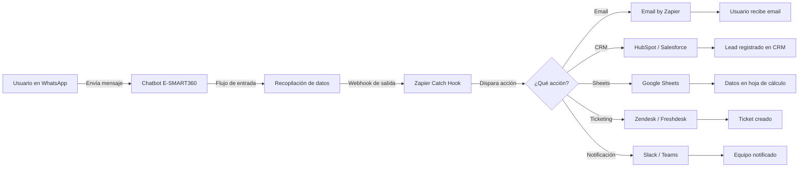

# Cómo Conectar Zapier con E-SMART360 para Enviar Datos Recopilados en WhatsApp

<Callout type="info">
TL;DR: E-SMART360 te permite enviar datos recopilados desde chatbots de WhatsApp —como entradas de usuario, direcciones de correo electrónico, números de teléfono y detalles de suscriptores— a Zapier mediante un webhook de salida. Al crear un flujo de entrada de usuario en E-SMART360 y conectarlo a un disparador "Catch Hook" de Zapier, puedes enviar automáticamente datos de WhatsApp a Zapier e integrarlos con cientos de aplicaciones de terceros. Esta guía te lleva paso a paso por la construcción del flujo de entrada, la creación de un webhook de salida, las pruebas del webhook en Zapier y el uso de los datos recopilados para acciones como el envío de correos electrónicos o la activación de flujos de trabajo.
</Callout>

<Update title="Última actualización" date="2026-02-09" />

En este artículo te mostraré cómo conectar Zapier con E-SMART360 para enviar datos recopilados a través de WhatsApp desde E-SMART360 a Zapier.

También hemos creado un video tutorial sobre cómo conectar Zapier con E-SMART360 para enviar datos recopilados desde WhatsApp a Zapier. Puedes consultarlo en nuestro canal de YouTube.

Puedes enviar los datos de WhatsApp de E-SMART360 o los datos del flujo de entrada de usuario a cualquier aplicación de terceros, como Zapier, para su procesamiento.

Podemos enviar la información recopilada por el chatbot de WhatsApp a Zapier integrando E-SMART360 con Zapier.

Veamos cómo puedes hacerlo.

## Crear una Campaña de Flujo de Entrada de Usuario

El primer paso es crear una campaña de **Flujo de Entrada de Usuario (User Input Flow)** en E-SMART360.

<Steps>
<Step title="Accede al Administrador de Bots">
Desde el panel de control de E-SMART360, haz clic en el menú **Bot Manager** (dentro de la sección de WhatsApp) en la barra lateral izquierda.
</Step>

<Step title="Selecciona Input Flow">
Aparecerá la página del administrador de bots de WhatsApp. Ahora haz clic en la opción **Input Flow**. Inmediatamente aparecerán las configuraciones del flujo de entrada con un botón de **Crear**.
</Step>

<Step title="Abre el editor de flujo">
Haz clic en el botón **Crear**. Inmediatamente aparecerá el editor del constructor de flujo con los componentes **Start Bot Flow** y **User Input Flow** ya conectados entre sí.
</Step>

<Step title="Configura el User Input Flow">
Haz doble clic en el componente **User Input Flow**. Aparecerá una barra lateral derecha llamada "Configurar flujo de entrada de usuario". En el campo de flujo de entrada de usuario, selecciona la opción **Añadir nuevo flujo de entrada**. Proporciona un nombre en el campo de nombre de campaña.
</Step>

<Step title="Configura el Start Bot Flow">
Aparecerá un nuevo componente de pregunta en el editor conectado al Start Flow Campaign. Haz doble clic en el componente **Start Bot Flow**. Aparecerá la barra lateral "Configurar referencia" con campos como Título, Elegir Etiqueta y Elegir Secuencia. Proporciona un título. Elegir etiqueta y secuencia es opcional.
</Step>

<Step title="Configura la pregunta">
Haz doble clic en el componente de nueva pregunta. Aparecerá la barra lateral "Configurar nueva pregunta". Selecciona **Entrada de teclado libre**. Aparecerán varios campos. En el campo de pregunta, escribe una pregunta —por ejemplo, "Por favor, proporciona tu dirección de correo electrónico". Luego selecciona el tipo de respuesta como **Email**. Haz clic en **OK**.
</Step>

<Step title="Añade una respuesta final">
Para proporcionar una respuesta final, arrastra el cursor desde el conector de respuesta final de la nueva pregunta y suéltalo en el editor. Aparecerá un nuevo componente postback conectado al componente de pregunta. Haz doble clic en el nuevo postback. Proporciona un título (etiqueta y secuencia son opcionales). Haz clic en **OK**.
</Step>

<Step title="Añade un componente de texto">
Arrastra el cursor desde el conector "siguiente" del nuevo postback y suéltalo en el editor. Aparecerá una lista de componentes. Selecciona el componente de **Texto**. Configúralo con un mensaje de confirmación. Haz clic en **OK**.
</Step>

<Step title="Guarda el bot">
Añade el componente disparador si es necesario para que sea un bot completamente funcional. Haz clic en el botón **Guardar** para guardar el bot.
</Step>
</Steps>

### Prueba el Bot

Escribe la palabra clave en WhatsApp. El bot preguntará por tu correo electrónico. Proporciona tu dirección de correo electrónico para verificar que el flujo funciona correctamente.

<Callout type="tip">
Puedes personalizar las preguntas del flujo de entrada para recopilar cualquier tipo de dato: nombres completos, números de teléfono, direcciones, preferencias de productos, o cualquier información que tu negocio necesite.
</Callout>

## Crear un Webhook de Salida

Ahora, si queremos enviar esta dirección de correo electrónico o cualquier dato que recopilemos del chatbot de WhatsApp a Zapier o a cualquier aplicación de terceros, necesitamos crear un **webhook de salida**.

<Steps>
<Step title="Actualiza la página del Bot Manager">
Refresca la página del administrador de bots de WhatsApp. Luego haz clic en la opción **Outbound Webhook**.
</Step>

<Step title="Crea un nuevo webhook">
Aparecerán las configuraciones del webhook de salida con un botón **Crear**. Haz clic en **Crear**. Aparecerá un formulario modal de webhook de salida.
</Step>

<Step title="Configura el webhook">
Proporciona un nombre en el campo **Nombre del webhook modal**. Luego proporciona la URL del webhook de salida en el campo **URL del webhook de salida**. (Esta URL la obtendrás de Zapier en los siguientes pasos). Selecciona los campos a enviar: Nombre del suscriptor, Número de teléfono y Datos del flujo de entrada. Haz clic en **Guardar Webhook**.
</Step>
</Steps>

## Obtener la URL del Webhook desde Zapier

Ahora necesitamos ir a Zapier para obtener la URL que recibirá los datos.

<Steps>
<Step title="Ve a Zapier">
Inicia sesión en tu cuenta de Zapier y haz clic en el botón **Create Zap**.
</Step>

<Step title="Selecciona Webhook by Zapier">
En el campo de evento de la aplicación, selecciona **Webhook by Zapier**.
</Step>

<Step title="Configura Catch Hook">
En el campo **Evento**, elige **Catch Hook**. Luego haz clic en **Continuar**.
</Step>

<Step title="Copia la URL del Webhook">
Aparecerá la URL del webhook. Cópiala.
</Step>
</Steps>

<Callout type="warning">
La URL del webhook de Zapier es única para cada Zap. No la compartas ni la expongas públicamente, ya que cualquiera con esa URL podría enviar datos a tu Zap.
</Callout>

## Conectar Zapier con E-SMART360

Regresa a E-SMART360 y pega la URL del webhook en el campo **URL del webhook de salida** en la configuración del webhook que creaste anteriormente. Luego haz clic en **Guardar Webhook**.

## Enviar Datos de Prueba a Zapier

<Steps>
<Step title="Activa el bot en WhatsApp">
Ve al chatbot de WhatsApp. Escribe la palabra clave para activar el bot con el flujo de entrada de usuario.
</Step>

<Step title="Proporciona los datos solicitados">
El bot te pedirá tu dirección de correo electrónico. Proporciónala.
</Step>

<Step title="Prueba en Zapier">
Regresa a Zapier y haz clic en el botón **Test Trigger**. Verás que Zapier ha recolectado los datos: el nombre del usuario, el ID del chat (número de teléfono) y los datos del flujo de entrada de usuario.
</Step>
</Steps>

## Configurar Zapier para Enviar Notificaciones por Correo Electrónico

Una vez que los datos llegan a Zapier, podemos configurar una acción para enviar un correo electrónico con esos datos.

<Steps>
<Step title="Selecciona Email by Zapier">
Haz clic en **Continuar** en Zapier. Aparecerá un formulario de selección de evento de aplicación. Selecciona **Email by Zapier**.
</Step>

<Step title="Configura la acción">
En el campo **Evento**, selecciona **Send Outbound Email**. Luego haz clic en **Continuar**.
</Step>

<Step title="Completa los detalles del correo">
En el campo **Para**, selecciona el dato de entrada de usuario que contiene la dirección de correo electrónico. Escribe un asunto para el correo. Luego escribe el cuerpo del correo. Puedes usar los datos recopilados en el cuerpo del mensaje —por ejemplo, el nombre del usuario.
</Step>

<Step title="Prueba la acción">
Haz clic en **Continuar** y luego en **Test Action**. Revisa tu bandeja de entrada para confirmar que el correo ha llegado.
</Step>
</Steps>

<Callout type="success">
¡El correo ha llegado correctamente! Esto confirma que la integración entre E-SMART360 y Zapier funciona perfectamente.
</Callout>

## Publicar el Zap

Una vez que todo funciona correctamente:

1. Regresa a Zapier.
2. Haz clic en **Publish Zap**.
3. Luego haz clic en **Publish and Turn On**.
4. ¡Tu Zap está publicado y funcionando!

<Callout type="info">
De la misma manera, puedes integrar E-SMART360 con otras aplicaciones de terceros como Pabbly, Make, N8N y cualquier plataforma que acepte webhooks. La flexibilidad del sistema de webhooks de salida te permite conectar prácticamente cualquier plataforma.
</Callout>

## Integración HTTP API Directa (Alternativa)

Además de Zapier, E-SMART360 ofrece una integración HTTP API directa que te permite conectar el chatbot con APIs externas sin intermediarios.

<Steps>
<Step title="Accede a la sección HTTP API">
Navega a **Integración > HTTP API** en el panel de control de E-SMART360. Haz clic en **Crear** para iniciar una nueva conexión API.
</Step>

<Step title="Configura los detalles de conexión">
Proporciona un nombre reconocible para la API (ej. "Crear usuario en WordPress"), selecciona el método HTTP (GET, POST, etc.), ingresa la URL del endpoint externo y un ID de suscriptor de prueba.
</Step>

<Step title="Configura los encabezados de la solicitud">
Define los encabezados necesarios como Content-Type (application/json) y Authorization (Bearer Token u otras credenciales).
</Step>

<Step title="Configura el cuerpo de la solicitud">
Añade los campos requeridos para la solicitud API (ej. nombre de usuario, email). Puedes usar valores estáticos o dinámicos basados en la entrada del usuario. Selecciona el formato: JSON, Form Data o X-WWW-FORM-URLENCODED.
</Step>

<Step title="Verifica la conexión">
Haz clic en **Verify Connection** para enviar una solicitud de prueba. Si es exitosa, haz clic en **Save API** para finalizar la configuración.
</Step>

<Step title="Mapea los datos de respuesta">
Mapea los campos de respuesta de la API a variables de E-SMART360. Por ejemplo, si la API devuelve un user_id o email, puedes mapearlo de vuelta al perfil del suscriptor.
</Step>

<Step title="Úsalo en el Flow Builder">
Añade un elemento **HTTP API** en cualquier parte del flujo del chatbot. Configura cuándo y cómo debe llamarse la API según las interacciones del usuario.
</Step>
</Steps>

<Callout type="tip">
La integración HTTP API directa es ideal cuando necesitas una comunicación en tiempo real con sistemas propietarios o cuando quieres evitar la dependencia de plataformas intermediarias como Zapier para reducir latencia.
</Callout>

## Casos de Uso Prácticos

<Tabs>
<Tab title="Captura de Leads">
Configura un flujo de entrada que recopile nombre, email y teléfono. Conecta el webhook de salida a Zapier para añadir automáticamente cada lead a tu CRM (HubSpot, Salesforce, Pipedrive) y enviar un correo de bienvenida personalizado.
</Tab>
<Tab title="Soporte al Cliente">
Crea un flujo donde el usuario describa su problema. Los datos se envían a Zapier, que crea un ticket en Zendesk o Freshdesk y asigna el caso al agente correspondiente, todo sin intervención manual.
</Tab>
<Tab title="Notificaciones de Pedidos">
Integra con Shopify o WooCommerce: cuando un cliente hace un pedido, los datos se envían a Zapier, que actualiza una hoja de Google Sheets, envía un correo de confirmación al cliente y notifica al equipo de logística por Slack.
</Tab>
<Tab title="Encuestas y Feedback">
Diseña un flujo de preguntas múltiples. Cada respuesta se envía a Zapier, que almacena los resultados en Google Sheets y envía un resumen semanal por correo electrónico al equipo de producto.
</Tab>
</Tabs>

<Columns cols="2">
<Card title="Ejemplo: Recuperación de Carritos Abandonados">
Un cliente agrega productos al carrito pero no completa la compra. E-SMART360 envía los datos del carrito abandonado a Zapier. Zapier activa un correo automatizado de recuperación con un descuento del 10%, y si el cliente no responde en 24 horas, envía un mensaje de WhatsApp de seguimiento directamente desde el chatbot.
</Card>
<Card title="Ejemplo: Automatización de Marketing">
Un usuario se suscribe a través de un anuncio Click-to-WhatsApp. El chatbot recopila su nombre y correo electrónico. E-SMART360 envía estos datos a Zapier. Zapier añade el contacto a Mailchimp, lo etiqueta como "Nuevo lead - WhatsApp", envía un email de bienvenida y crea una tarea en Asana para que el equipo de ventas haga seguimiento en los próximos 30 minutos.
</Card>
</Columns>

## Preguntas Frecuentes

<Expandable title="¿Cuál es el propósito de conectar E-SMART360 con Zapier?">
Conectar E-SMART360 con Zapier te permite enviar automáticamente los datos recopilados por tu chatbot de WhatsApp a Zapier y utilizarlos con miles de aplicaciones de terceros para automatización, procesamiento e integraciones.
</Expandable>

<Expandable title="¿Qué tipo de datos se pueden enviar desde E-SMART360 a Zapier?">
Puedes enviar: nombre del suscriptor, número de teléfono (ID del chat), datos del flujo de entrada de usuario (correo electrónico, respuestas, respuestas de formularios) y etiquetas u otros metadatos relacionados con el chatbot.
</Expandable>

<Expandable title="¿Necesito conocimientos de programación para integrar E-SMART360 con Zapier?">
No. La integración es completamente sin código y se realiza mediante la función de webhook de salida de E-SMART360 y el disparador "Webhooks by Zapier". Cualquier persona puede configurarla siguiendo los pasos de esta guía.
</Expandable>

<Expandable title="¿Qué disparador de Zapier debo usar para esta integración?">
Debes usar **Webhooks by Zapier** con el evento **Catch Hook** para recibir los datos enviados desde E-SMART360.
</Expandable>

<Expandable title="¿Qué acciones puedo realizar en Zapier después de recibir datos de E-SMART360?">
Puedes realizar innumerables acciones como: enviar correos electrónicos, añadir contactos a CRMs, crear tareas, actualizar Google Sheets, activar automatizaciones de marketing, conectar con cualquier aplicación compatible con Zapier (más de 5,000 aplicaciones).
</Expandable>

<Expandable title="¿Esta integración está limitada solo a Zapier?">
No. E-SMART360 admite integración con otras plataformas de terceros como Pabbly, Make, N8N y cualquier sistema que acepte datos a través de HTTP API o webhook. También puedes usar la integración HTTP API directa descrita en esta guía.
</Expandable>

<Expandable title="¿Qué hago si la prueba del webhook falla?">
Verifica que la URL del webhook de Zapier esté correctamente copiada y pegada en E-SMART360. Asegúrate de que el bot de flujo de entrada esté activo y publicado. Comprueba que hayas introducido los datos solicitados por el chatbot antes de hacer clic en "Test Trigger" en Zapier. Si el problema persiste, revisa la configuración del webhook en ambas plataformas.
</Expandable>

<Expandable title="¿Puedo enviar múltiples campos de datos a Zapier?">
Sí. En la configuración del webhook de salida puedes seleccionar el nombre del suscriptor, el número de teléfono y los datos del flujo de entrada. Si necesitas enviar campos adicionales, puedes diseñar tu flujo de entrada para recopilar más información y esta se incluirá automáticamente en el payload enviado a Zapier.
</Expandable>

## Conclusión

La integración de E-SMART360 con Zapier abre un mundo de posibilidades para la automatización de tu negocio. Desde la captura y gestión de leads hasta el soporte al cliente y las notificaciones automatizadas, las combinaciones son prácticamente ilimitadas.

Al combinar el poder del chatbot de WhatsApp de E-SMART360 con las más de 5,000 aplicaciones que Zapier puede conectar, puedes crear flujos de trabajo automatizados que ahorran tiempo, reducen errores y mejoran la experiencia del cliente.

<Callout type="info">
¿Listo para empezar? Crea tu cuenta en E-SMART360, configura tu primer flujo de entrada de usuario y conéctalo con Zapier siguiendo los pasos de esta guía. La automatización de tu negocio está a solo unos clics de distancia.
</Callout>

## Mejores Prácticas para la Integración

Para aprovechar al máximo la integración entre E-SMART360 y Zapier, ten en cuenta las siguientes recomendaciones:

### Diseño del Flujo de Entrada

- **Preguntas claras y concisas**: Formula preguntas que el usuario pueda responder en una sola línea. Evita preguntas abiertas demasiado amplias.
- **Validación de datos**: Utiliza los tipos de respuesta adecuados (email, número de teléfono, texto libre) para que el chatbot valide la información antes de enviarla a Zapier.
- **Mensajes de confirmación**: Siempre incluye un mensaje de agradecimiento o confirmación después de que el usuario proporcione sus datos.

### Gestión de Webhooks

- **Nombres descriptivos**: Asigna nombres claros a tus webhooks de salida para identificarlos fácilmente cuando tengas múltiples integraciones activas.
- **Pruebas incrementales**: Prueba cada webhook individualmente antes de combinarlos en flujos complejos.
- **Monitoreo periódico**: Revisa periódicamente que los webhooks sigan activos y que Zapier esté recibiendo los datos correctamente.

### Optimización en Zapier

- **Filtros inteligentes**: Utiliza los filtros de Zapier para procesar solo los datos que cumplan ciertas condiciones. Por ejemplo, solo enviar correos si el email es válido.
- **Formateo de datos**: Aprovecha las herramientas de formateo de Zapier para limpiar y estructurar los datos antes de enviarlos a la aplicación de destino.
- **Zaps en cadena**: Divide flujos complejos en múltiples Zaps para facilitar el mantenimiento y la depuración.

## Arquitectura del Flujo de Datos

El siguiente diagrama muestra cómo fluye la información desde el usuario de WhatsApp hasta las aplicaciones de terceros a través de E-SMART360 y Zapier:

## Solución de Problemas Comunes

<Expandable title="El webhook no recibe datos después de configurarlo">
**Causas posibles:**
- La URL del webhook no se copió correctamente desde Zapier. Vuelve a copiarla y pégala en E-SMART360.
- El bot de flujo de entrada no se ha guardado o no está publicado. Verifica que el bot esté activo.
- La palabra clave no coincide con la configurada en el bot. Revisa el disparador del flujo de entrada.

**Solución:** Sigue nuevamente los pasos 1-3 de la sección "Enviar Datos de Prueba a Zapier" y verifica cada configuración.
</Expandable>

<Expandable title="Zapier muestra 'No data received' al hacer clic en Test Trigger">
**Causas posibles:**
- No has enviado un mensaje de prueba desde WhatsApp después de guardar el webhook.
- El formato del payload no es compatible con Zapier.

**Solución:** Asegúrate de activar el bot en WhatsApp y proporcionar los datos solicitados DESPUÉS de haber configurado y guardado el webhook. Luego espera unos segundos y haz clic en "Test Trigger".
</Expandable>

<Expandable title="Los datos llegan incompletos a Zapier">
**Causas posibles:**
- No seleccionaste todos los campos en la configuración del webhook (nombre, teléfono, datos de flujo de entrada).
- El flujo de entrada no recopiló toda la información esperada.

**Solución:** Revisa la configuración del webhook de salida en E-SMART360 y asegúrate de que todas las casillas estén marcadas. Verifica también que el flujo de entrada esté solicitando todos los datos necesarios.
</Expandable>

<Expandable title="El correo de prueba no llega al destinatario">
**Causas posibles:**
- La configuración de Email by Zapier no está correctamente vinculada al campo de datos correcto.
- El campo "Para" no está usando la variable de datos de entrada de usuario que contiene la dirección de correo.

**Solución:** Revisa que en el campo "Para" hayas seleccionado el dato de entrada de usuario (user input data) que contiene la dirección de email, no un valor estático.
</Expandable>

## Recursos Adicionales

Para profundizar en las capacidades de integración de E-SMART360, te recomendamos explorar los siguientes recursos:

- **Guía de Webhook Workflow**: Aprende a automatizar procesos de negocio completos usando webhooks en WhatsApp.
- **Integración HTTP API Externa**: Conecta E-SMART360 directamente con APIs externas sin necesidad de intermediarios.
- **Integración con Google Sheets**: Automatiza el envío de datos desde WhatsApp a hojas de cálculo de Google.
- **Conexión con Shopify y WooCommerce**: Recibe notificaciones de pedidos y gestiona tu tienda desde WhatsApp.

<Callout type="info">
¿Listo para empezar? Crea tu cuenta en E-SMART360, configura tu primer flujo de entrada de usuario y conéctalo con Zapier siguiendo los pasos de esta guía. La automatización de tu negocio está a solo unos clics de distancia.
</Callout>
