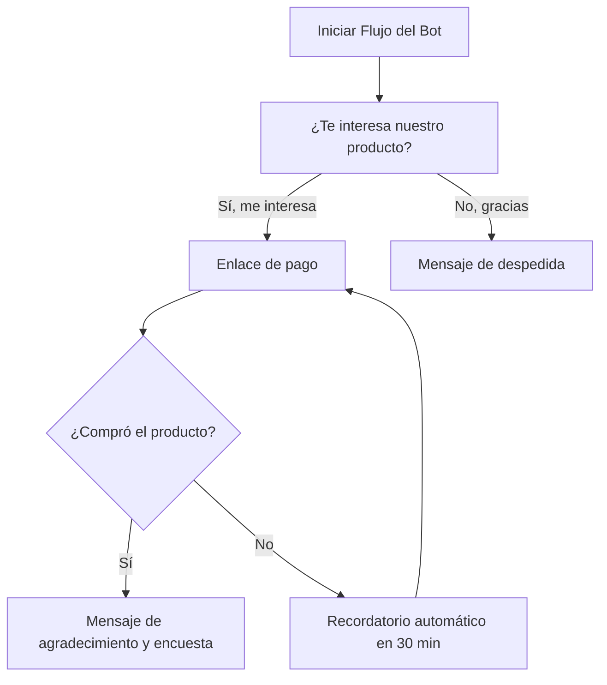

<Callout type="info">
Esta guía te mostrará cómo crear un chatbot de WhatsApp usando E-SMART360, todo sin necesidad de programar.
</Callout>

TL;DR

Esta guía te mostrará cómo crear un chatbot de WhatsApp usando E-SMART360, todo sin necesidad de programar.

Primero, conecta tu número de WhatsApp usando Meta (Facebook Business Manager). Una vez verificado y vinculado tu número, puedes empezar a construir el chatbot en E-SMART360.

A continuación, usa el método de arrastrar y soltar para desarrollar el flujo en el constructor visual y automatizar conversaciones. Por ejemplo, configura mensajes de bienvenida, respuestas automáticas o flujos de atención al cliente simplemente haciendo clic y conectando bloques.

También puedes añadir disparadores y condiciones para que el bot responda de forma diferente según lo que los usuarios digan o hagan. Esto ayuda a las empresas a gestionar preguntas frecuentes, capturar leads y enviar transmisiones automatizadas.

Una vez que todo esté listo, solo publicas el bot y empieza a funcionar al instante, respondiendo a los clientes 24/7 sin esfuerzo manual adicional.

Puedes crear uno usando plataformas de chatbot sin código que te permiten construir conversaciones automatizadas con herramientas simples de arrastrar y soltar, sin necesidad de programación.

En esta guía aprenderás a conectar tu cuenta de WhatsApp, diseñar flujos de chatbot y automatizar respuestas paso a paso. Ya sea que quieras gestionar consultas de clientes, capturar leads o mejorar los tiempos de respuesta, este método te ayudará a lanzar un chatbot de WhatsApp funcional de forma rápida y sencilla.

---

## Paso 1: Inicia sesión y conecta tu cuenta de WhatsApp

1. Visita [E-SMART360](https://esmart360.com) e ingresa a tu panel.
2. Haz clic en el botón **"Comenzar gratis"** o en **"Iniciar sesión"**.
3. Completa los campos del formulario de registro.
4. Haz clic en **"Registrarse"** o en **"Iniciar sesión"**.

<Callout type="tip">
Si ya tienes una cuenta registrada, simplemente inicia sesión con tu cuenta existente.
</Callout>

Ahora, desde el **Panel de control**, sigue estas instrucciones:

1. Haz clic en el menú de navegación **"Conectar cuenta"**.
2. Ingresa tu **ID de cuenta de negocio** y **Access Token** en los campos correspondientes.
3. Haz clic en el botón **"Conectar"**.

Aparecerá un mensaje de notificación exitosa si tu ID y token son válidos.

<Callout type="warning">
**Recomendación importante:** No uses el token de acceso temporal. Utiliza siempre un token de acceso permanente para evitar interrupciones en el servicio.
</Callout>

Si no sabes cómo obtener tu ID de cuenta de negocio y Access Token, consulta nuestra guía sobre cómo configurar WhatsApp Cloud API.

<Steps>
<Step title="Obtén tu Access Token permanente">
1. Ve a tu **Facebook Business Manager**.
2. Accede a la sección de **Cuentas de WhatsApp**.
3. Selecciona tu cuenta y genera un token permanente desde la configuración del sistema.
4. Copia el token y pégalo en el campo correspondiente en E-SMART360.
</Step>
</Steps>

---

## Paso 2: Accede al lienzo del constructor visual de bots

1. Haz clic en el menú **"Gestor de Bots"**.
2. Desde el **"Gestor de Bots de WhatsApp"**, selecciona la cuenta de bot deseada.
3. Haz clic en el botón **"Respuesta del Bot"**.
4. Haz clic en el botón **"Crear"**.

<Callout type="info">
Después de hacer clic en "Crear", serás enviado a la página de edición llamada **"Lienzo del Constructor Visual de Flujos"**. Allí encontrarás el **"Menú de Documentos"** con 11 componentes en el lado izquierdo del lienzo.
</Callout>

Los once componentes del Menú de Documentos son:

- **Texto**
- **Imagen**
- **Audio**
- **Video**
- **Archivo**
- **Interactivo**
- **Condición**
- **Nueva Secuencia**
- **Flujo de Entrada de Usuario**
- **Disparador**
- **Nuevo Postback**

En la parte superior derecha del lienzo hay cinco botones: **Probar**, **Volver**, **Reordenar**, **Guardar** y **Número de negocio** (en ese orden de izquierda a derecha).

---

## Paso 3: Configura un bot en el lienzo visual

En esta sección, veremos varios componentes del **Menú de Documentos**. Cuando llegues al Constructor Visual de Flujos, verás el componente "**Iniciar Flujo del Bot**". Para darle un nombre a tu bot, haz doble clic sobre él. Aparecerá un modal **"Configurar Referencia"** en la parte superior derecha del lienzo.

1. Asigna un nombre en el campo **"Título"**.
2. Opcionalmente, elige un nivel y selecciona una secuencia.
3. Haz clic en el botón **"Ok"** para guardar.

Si arrastras el cursor desde el conector **"Siguiente"** del componente "Iniciar Flujo del Bot" y lo sueltas en el área del lienzo, aparecerá una lista de componentes.

<Callout type="tip">
Desde la lista de componentes puedes seleccionar Imagen, Audio, Video, Archivo, etc. Por ejemplo, si seleccionas el menú "Imagen", aparecerá un componente de imagen. Haz doble clic para configurarlo.
</Callout>

### Configurar un disparador (Trigger)

Es necesario conectar un componente **Disparador** al conector "Disparador" del componente "**Iniciar Flujo del Bot**".

1. Selecciona el componente **"Disparador"** desde el menú de documentos.
2. Arrástralo al lienzo y suéltalo.
3. **Haz doble clic** en el disparador.

Aparecerá un modal **"Configurar Referencia"**. Ingresa una palabra clave como "**Hola**", "**Hola**", "**Inicio**", etc. y guárdala.

Luego, conecta este disparador con el componente "Iniciar Flujo del Bot".

<Callout type="info">
Puedes elegir entre dos tipos de coincidencia:

- **Coincidencia exacta**: el bot solo se activa con la palabra clave específica.
- **Coincidencia parcial**: el bot se activa si la frase contiene la palabra clave, por ejemplo, "Hola, necesito ayuda" activaría un disparador con la palabra "Hola".
</Callout>

### Configurar mensajes multimedia

De la misma forma, puedes configurar los formularios de los componentes Audio, Video y Archivo. Arrastra cualquier componente desde el menú de documentos, suéltalo en el lienzo, haz doble clic para configurarlo, completa los campos y haz clic en **"Ok"**.

Puedes mantener tu bot como un bot simple o hacerlo tan completo como necesites. Después de añadir un disparador al componente "Iniciar Flujo del Bot", **guarda los cambios**.

### Configurar botones interactivos

Si deseas añadir botones interactivos a tu chatbot (como "Ver productos", "Hablar con agente", "Más información"), sigue estos pasos:

1. Arrastra un conector desde el componente **Interactivo** hacia el lienzo.
2. Aparecerá un **Componente de Botón en Línea**.
3. Haz doble clic y escribe el texto del botón.
4. Selecciona una **Acción del Botón** (Enviar mensaje, Iniciar un flujo, Acción predeterminada del sistema, etc.).
5. Haz clic en **Guardar**.
6. Repite el proceso para añadir más botones.

<Callout type="success">
Los botones interactivos mejoran la experiencia del usuario y facilitan que los clientes realicen acciones sin tener que escribir nada.
</Callout>

---

## Paso 4: Prueba el bot creado

Ahora debes probar el bot. Ve a tu panel de control y haz clic en **"Gestor de Suscriptores"**. Luego, haz clic en el botón **"Opciones"** y selecciona la opción **"Suscriptor Manual"**.

Aparecerá un formulario. Ingresa un nombre en el campo **"NOMBRE"** y un número de teléfono en el campo **"NÚMERO DE TELÉFONO"**.

<Callout type="warning">
**Precaución:** El número de teléfono debe incluir el código de país **sin** el signo más (+). Por ejemplo: 521234567890 en lugar de +521234567890.
</Callout>

Haz clic en el botón **"Guardar"**.

Para verificar tu bot:

1. Vuelve al lienzo del constructor de flujos.
2. Haz clic en el botón **"Probar"**.
3. Selecciona un suscriptor de la lista.
4. Haz clic en el botón **"Enviar"**.
5. Espera unos minutos.

Si el bot se creó correctamente, el suscriptor objetivo recibirá los mensajes.

<Callout type="info">
**Otra forma de probar:** Simplemente escribe la palabra clave (por ejemplo, "Hola") desde la cuenta de WhatsApp de un cliente y espera unos minutos. Si ves la respuesta correspondiente, es una señal de que el bot se creó correctamente.
</Callout>

---

## Paso 5: Analiza y mejora tu bot

Para analizar el bot, puedes recopilar comentarios de los usuarios. Monitoreando tu negocio también puedes mejorar el diseño del bot. Puedes cambiar y mejorar el bot tanto como quieras, según las necesidades de tu negocio.

<Steps>
<Step title="Revisa las métricas de rendimiento">
Accede al panel de análisis de E-SMART360 para ver cuántas interacciones ha tenido tu bot, qué mensajes generan más respuestas y dónde abandonan los usuarios.
</Step>
<Step title="Identifica oportunidades de mejora">
Busca patrones en las conversaciones. Si los usuarios hacen preguntas que el bot no responde bien, añade nuevos disparadores y respuestas.
</Step>
<Step title="Actualiza el flujo del bot">
Vuelve al Constructor Visual de Flujos y arrastra nuevos componentes para cubrir las preguntas o situaciones no previstas. Guarda los cambios después de cada modificación.
</Step>
</Steps>

---

## Añade flujos de entrada de usuario para conversaciones complejas

<Callout type="info">
El **Flujo de Entrada de Usuario** es una funcionalidad avanzada que te permite crear conversaciones ramificadas donde el bot puede hacer preguntas y actuar según las respuestas del usuario.
</Callout>

El Flujo de Entrada de Usuario permite que el chatbot haga una pregunta y espere una respuesta antes de continuar. Dependiendo de lo que el usuario responda, el bot puede seguir diferentes caminos dentro del flujo conversacional.

### Características clave del Flujo de Entrada de Usuario

- **Captura de datos en tiempo real**: El bot puede preguntar nombre, correo, teléfono o cualquier otro dato y almacenar la respuesta.
- **Validación de respuestas**: Puedes configurar reglas para verificar que la respuesta sea válida (por ejemplo, formato de correo electrónico o número de teléfono).
- **Ramificación condicional**: Según lo que responda el usuario, el bot puede desviarse a diferentes flujos.
- **Integración con otros sistemas**: Los datos capturados pueden enviarse a Google Sheets, CRM, webhooks o cualquier otra herramienta.

### Cómo configurar un Flujo de Entrada de Usuario

1. Dentro del Constructor Visual de Flujos, selecciona el componente **"Flujo de Entrada de Usuario"** desde el Menú de Documentos.
2. Arrástralo al lienzo y conéctalo después de un componente de mensaje.
3. Haz doble clic en el componente para abrir la configuración.
4. Define la **pregunta** que el bot hará (ej: "¿Cuál es tu correo electrónico?").
5. Configura el **tipo de validación** si es necesario (texto libre, número, email, booleano).
6. Conecta los caminos de respuesta: uno para cuando el usuario responde y otro para cuando no responde (timeout).
7. Guarda los cambios.

<Expandable title="Ejemplo práctico: Capturar datos de un lead">
Imagina que quieres capturar el nombre y correo de un cliente potencial:
1. El bot envía: "¡Hola! Para darte un presupuesto personalizado, necesito algunos datos."
2. El **Flujo de Entrada de Usuario** pregunta: "¿Cuál es tu nombre?"
3. El usuario responde y el bot almacena el nombre en una variable.
4. El siguiente Flujo de Entrada pregunta: "¿Cuál es tu correo electrónico?"
5. El usuario responde y se almacena el correo.
6. Finalmente, el bot puede enviar estos datos a través de un webhook a tu CRM.
</Expandable>

<Callout type="success">
Los Flujos de Entrada de Usuario son ideales para formularios de contacto, encuestas rápidas, soporte técnico escalonado y procesos de calificación de leads sin necesidad de páginas web externas.
</Callout>

---

## Usa secuencias para automatizar seguimientos

Las **secuencias de mensajes** son una serie de respuestas automatizadas que se envían a los suscriptores según disparadores y horarios predefinidos. Ayudan a mantener el compromiso, nutrir leads y automatizar respuestas de manera eficiente.

### Ideas para secuencias de mensajes

- **Secuencias de bienvenida**: Atrae a nuevos suscriptores con saludos personalizados.
- **Secuencias de atención al cliente**: Automatiza respuestas a consultas comunes.
- **Secuencias de nutrición de leads**: Educa a los prospectos sobre tus productos o servicios.
- **Secuencias de ventas**: Guía a los clientes potenciales a través del embudo de ventas.
- **Secuencias de incorporación**: Ayuda a los nuevos usuarios a comenzar.
- **Secuencias promocionales**: Anuncia nuevos productos, descuentos o eventos.
- **Secuencias educativas**: Proporciona contenido valioso a los suscriptores.

<Callout type="info">
E-SMART360 permite configurar y gestionar campañas de secuencia automatizadas de manera eficiente. Estas campañas se pueden adaptar a audiencias específicas, garantizando mensajes oportunos y contextualmente relevantes.
</Callout>

### Beneficios de usar secuencias de mensajes

- **Mejora la experiencia del cliente**: Las respuestas automatizadas garantizan una atención instantánea.
- **Aumenta la eficiencia**: Reduce la carga de trabajo manual automatizando tareas repetitivas.
- **Mejora las conversiones**: Nutre leads y mejora las tasas de conversión de ventas.
- **Mayor compromiso**: Mantiene a los usuarios interesados con seguimientos oportunos.
- **Optimización basada en datos**: Realiza un seguimiento del rendimiento y refina las secuencias según los análisis.

---

## Envía mensajes masivos con campañas de broadcasting

Las campañas de **broadcasting** te permiten enviar mensajes masivos a tus suscriptores de WhatsApp de forma controlada y segura. Es ideal para promociones, anuncios importantes, recordatorios y comunicaciones periódicas.

### Prerrequisitos

- Tu cuenta de WhatsApp Business API debe estar conectada a E-SMART360.
- Debes tener un número de WhatsApp Business API activo.
- Tu lista de contactos debe estar limpia y actualizada.

### Paso 1: Prepara tu lista de suscriptores

1. Asegúrate de tener una lista de contactos limpia y lista para importar.
2. Prepara una hoja de cálculo con los datos necesarios (nombre, número de teléfono, etc.).
3. Asegúrate de que la columna de número de teléfono esté formateada correctamente (código de país sin signo +).
4. Descarga la hoja de cálculo como archivo CSV con codificación UTF-8.

### Paso 2: Importa tus suscriptores

1. Ve al **Gestor de Suscriptores** en tu panel de E-SMART360.
2. Haz clic en **"Opciones"** y selecciona **"Importar Suscriptores"**.
3. Sube el archivo CSV o importa directamente desde Google Sheets.
4. Mapea los datos para alinear las columnas correctamente.

<Callout type="tip">
Puedes importar desde Google Sheets directamente, lo que facilita la sincronización automática con tus listas de contactos existentes.
</Callout>

### Paso 3: Crea una plantilla de mensaje

1. Ve a **Gestor de Bots > Plantillas de Mensaje**.
2. Haz clic en **"Crear Nueva Plantilla"** y selecciona el tipo de plantilla.
3. Completa los detalles requeridos:
   - **Contenido del mensaje:** Crea la plantilla incluyendo campos personalizados y botones de llamada a la acción (CTA).
   - **Nombre de la plantilla:** Usa minúsculas y reemplaza espacios con guiones bajos.
4. Guarda y envía la plantilla a Meta para su aprobación (la aprobación puede tardar unos minutos).

<Callout type="warning">
Existen dos tipos de plantillas de mensaje:
- **Transaccionales (Utilidad, Auth/OTP):** Para confirmaciones de envío, recibos de pago, códigos de verificación.
- **Marketing:** Para promocionar tus productos o servicios. Estas requieren aprobación más rigurosa.
</Callout>

### Paso 4: Configura la campaña de broadcasting

1. Ve a **Broadcasting** en tu panel de E-SMART360.
2. Haz clic en **"Crear Nueva Campaña"**.
3. Nombra tu campaña (ej: "Campaña de Marketing - Mayo 2026").
4. Selecciona tu audiencia objetivo usando segmentos o etiquetas.
   - **Ventana de 24 horas:** Mensajes gratuitos para usuarios que interactuaron en las últimas 24 horas.
   - **En cualquier momento:** Usa una plantilla aprobada para alcanzar a todos los suscriptores.
5. Filtra tu audiencia usando etiquetas (incluir o excluir etiquetas específicas).
6. Elige enviar la campaña inmediatamente o programarla para una fecha posterior.
7. Ajusta la zona horaria para una entrega óptima.
8. Guarda y ejecuta tu campaña.

<Callout type="success">
Las campañas de broadcasting son una herramienta poderosa cuando se usan correctamente. Respeta los límites de WhatsApp, envía contenido relevante y segmenta adecuadamente para evitar bloqueos.
</Callout>

---

## Límites y restricciones de medios en WhatsApp

Al crear mensajes para tu chatbot, es importante conocer los límites de medios permitidos por WhatsApp para garantizar que tus mensajes se entreguen correctamente.

| Tipo de medio | Límite de tamaño | Formato |
|---------------|------------------|--------|
| Imagen | 5 MB | JPG, PNG |
| Audio | 16 MB | MP3, OGG, AAC, AMR |
| Video | 16 MB | MP4 |
| Documento | 100 MB | PDF, DOC, XLS, PPT, etc. |
| Texto | 4096 caracteres por mensaje | Texto plano |
| Botones | 3 botones por mensaje | Interactivo |
| Botones de lista | 10 opciones por lista | Interactivo |

<Callout type="info">
Los límites de tamaño pueden variar según la región y las políticas de WhatsApp. Siempre es recomendable optimizar los archivos multimedia antes de subirlos para asegurar una entrega rápida y exitosa.
</Callout>

---

## Preguntas frecuentes

<Expandable title="¿Cómo puedo crear un chatbot de WhatsApp gratis sin codificar?">
Puedes crear un chatbot de WhatsApp gratuito usando plataformas sin código como E-SMART360. Simplemente conecta tu cuenta de WhatsApp, usa el constructor de arrastrar y soltar para diseñar flujos de conversación y configura respuestas automáticas. No se requieren conocimientos de programación.
</Expandable>

<Expandable title="¿Necesito la API de WhatsApp Business para construir un chatbot?">
Sí, para crear un chatbot de WhatsApp escalable necesitas acceso a la API de WhatsApp Business. E-SMART360 te ayuda a conectar tu número a través de Meta y gestionar la automatización fácilmente sin configuración técnica compleja.
</Expandable>

<Expandable title="¿Realmente es posible construir un chatbot de WhatsApp gratis?">
Sí, muchas plataformas de chatbot ofrecen planes gratuitos o pruebas que te permiten construir y probar un chatbot de WhatsApp. Sin embargo, algunas funciones avanzadas o volúmenes altos de mensajes pueden requerir un plan de pago. E-SMART360 ofrece un plan gratuito para empezar.
</Expandable>

<Expandable title="¿Cuánto tiempo se tarda en configurar un chatbot de WhatsApp?">
Puedes configurar un chatbot básico de WhatsApp en cuestión de minutos usando una plataforma sin código. Los flujos más avanzados con condiciones y automatización pueden llevar unas horas. La mayoría de los usuarios tienen su primer bot funcionando en menos de 15 minutos.
</Expandable>

<Expandable title="¿Puedo personalizar la sincronización de los mensajes en secuencia?">
Sí, E-SMART360 te permite configurar retrasos y horarios específicos para cada mensaje en una secuencia. Puedes programar mensajes para que se envíen minutos, horas o días después de una interacción.
</Expandable>

<Expandable title="¿Necesito plantillas de mensaje de WhatsApp para las secuencias?">
Sí, para los mensajes enviados fuera de la ventana de 24 horas, WhatsApp requiere el uso de plantillas de mensaje preaprobadas. E-SMART360 te ayuda a gestionar y sincronizar estas plantillas con la API de WhatsApp.
</Expandable>

---

## Ejemplos prácticos y casos de uso

<Columns cols="2">
<Card title="🛒 Tienda de e-commerce">
Un negocio de ropa online configuró un chatbot que:
1. Da la bienvenida con un saludo y un catálogo de productos.
2. Pregunta talla y color mediante Flujo de Entrada de Usuario.
3. Muestra opciones de pago con botones interactivos.
4. Envía confirmación del pedido por mensaje automático.
**Resultado**: 40% más de consultas resueltas sin intervención humana y 25% de aumento en conversiones.
</Card>

<Card title="🏥 Clínica dental">
Una clínica odontológica implementó:
1. Un mensaje de bienvenida con opciones: Agendar cita / Consultar horarios / Ubicación.
2. Un Flujo de Entrada para capturar nombre, teléfono y síntoma principal.
3. Confirmación automática de cita con fecha y hora.
4. Recordatorio 24 horas antes vía WhatsApp.
**Resultado**: Reducción del 60% en llamadas telefónicas y 35% menos inasistencias a citas.
</Card>
</Columns>

<Callout type="tip">
Estos ejemplos son solo el comienzo. Puedes adaptar estos flujos a cualquier industria: restaurantes, inmobiliarias, escuelas, gimnasios, servicios profesionales, etc. El límite es tu creatividad.
</Callout>

---

## Cómo construir un chatbot de seguimiento automático

Un **chatbot de seguimiento** es un sistema automatizado que envía mensajes de recordatorio a usuarios que han interactuado con tu chatbot pero no han completado una acción deseada, como realizar una compra o registrarse. Ayuda a las empresas a mantenerse comprometidas con los clientes potenciales y mejora las tasas de conversión.

### ¿Por qué usar un sistema de seguimiento automatizado?

- **Ahorra tiempo** automatizando recordatorios.
- **Aumenta ventas y conversiones** al mantener tu oferta presente.
- **Garantiza que los usuarios no olviden tu oferta** con mensajes oportunos.
- **Funciona 24/7** sin esfuerzo manual.

### Cómo construir el flujo del chatbot de seguimiento

1. Ve al **Panel de control > Gestor de Bots > Respuesta del Bot > Crear**.
2. Nombra el chatbot de forma reconocible, por ejemplo "Bot de Seguimiento".
3. Guarda el chatbot y asegúrate de que se active cuando un usuario interactúe con un mensaje relacionado con productos.

### Configurar mensajes interactivos

1. Añade un bloque interactivo a tu chatbot.
2. Crea un mensaje como: *"¿Te interesaría nuestro producto?"* con botones **Sí** y **No**.
3. Si el usuario selecciona **Sí**, proporciónale un enlace de pago o checkout.
4. Si el usuario selecciona **No**, finaliza la conversación u ofrece asistencia adicional.

### Aplicar etiquetas para rastrear acciones del usuario

Las etiquetas (labels) te permiten categorizar a los suscriptores según sus acciones. Por ejemplo:

1. Cuando un usuario haga clic en **"Comprar ahora"**, aplícale una etiqueta llamada **Interesado**.
2. Si el usuario no hace clic en el botón, no recibe esta etiqueta.
3. Usa esta etiqueta para determinar quién necesita un recordatorio de seguimiento.

### Configurar la secuencia de seguimiento

1. Arrastra y suelta el conector desde la opción **"Suscribir a Secuencia"** del botón **Comprar ahora** para iniciar una secuencia de seguimiento.
2. Configura la secuencia para que envíe un mensaje de recordatorio si el usuario no compra dentro de un tiempo definido (por ejemplo, 30 minutos).
3. Añade una **condición** para hacer seguimiento basado en si seleccionaron el botón **Comprar ahora** o no.
4. Si la condición es **Falsa**, envía el mensaje de seguimiento con el botón **Comprar ahora** incluido.
5. Repite el proceso para enviar otro recordatorio si aún no han comprado.

<Callout type="info">
WhatsApp permite enviar mensajes de seguimiento ilimitados dentro de la ventana de 24 horas. Después de 24 horas, solo se pueden enviar mensajes con plantillas preaprobadas.
</Callout>

### Programar mensajes para máximo compromiso

- Programa los recordatorios estratégicamente para evitar saturar a los usuarios.
- Usa la funcionalidad de **retraso inteligente (Smart Delay)** que permite espaciar los mensajes hasta 24 horas.
- Define un intervalo mínimo entre seguimientos (ej: primera vez a los 30 min, segunda a las 2 horas, tercera al día siguiente).

### Exportar e importar flujos de chatbot

Una funcionalidad muy útil de E-SMART360 es la posibilidad de **exportar tus flujos de chatbot** y compartirlos con otros usuarios o agencias. Esto permite:

- Compartir flujos completos con tu equipo de trabajo.
- Importar flujos prediseñados de la comunidad.
- Hacer copias de seguridad de tus configuraciones.
- Transferir flujos entre diferentes cuentas.

<Steps>
<Step title="Exportar un flujo">
1. Abre el flujo en el Constructor Visual.
2. Busca la opción **Exportar** en la barra superior de herramientas.
3. Selecciona el formato de exportación disponible.
4. Descarga el archivo con la configuración completa del flujo.
</Step>
<Step title="Importar un flujo">
1. En el Constructor Visual, haz clic en la opción **Importar**.
2. Selecciona el archivo de flujo previamente exportado desde tu computadora.
3. El flujo se cargará automáticamente en el lienzo con todas sus conexiones.
4. Revisa que los componentes estén correctamente conectados y guarda los cambios.
</Step>
</Steps>

---

## Uso de condiciones avanzadas

El componente **Condición** te permite crear ramificaciones lógicas en tu chatbot. Puedes configurar reglas como:

- **Si el usuario dijo "Sí"** → Ir al flujo de ventas.
- **Si el usuario dijo "No"** → Ir al flujo de despedida.
- **Si el usuario ya tiene la etiqueta "Cliente"** → Mostrar opciones exclusivas para clientes recurrentes.
- **Si pasaron más de 24 horas desde el último mensaje** → Enviar plantilla de mensaje aprobada por WhatsApp.

<Callout type="tip">
Las condiciones son el corazón de un chatbot inteligente. Úsalas para crear experiencias personalizadas que se adapten a cada usuario automáticamente sin intervención manual.
</Callout>

### Cómo configurar una condición paso a paso

1. Arrastra el componente **Condición** desde el Menú de Documentos al lienzo del constructor.
2. Conéctalo después de un componente de mensaje o de un flujo de entrada de usuario.
3. Haz doble clic sobre el componente para abrir el panel de configuración.
4. Selecciona el tipo de condición:
   - **Por etiqueta**: Verifica si el usuario tiene una etiqueta específica.
   - **Por respuesta**: Evalúa si la respuesta del usuario coincide con un valor esperado.
   - **Por variable**: Comprueba el valor de una variable almacenada.
   - **Por tiempo**: Evalúa si ha pasado un tiempo determinado desde la última interacción.
5. Define el valor esperado para la condición.
6. Configura los caminos de salida:
   - Camino **Verdadero**: lo que sucede si la condición se cumple.
   - Camino **Falso**: lo que sucede si la condición no se cumple.
7. Conecta cada camino al siguiente componente correspondiente en el flujo.
8. Guarda los cambios.

---

## Respuestas sin coincidencia (No Match Reply)

Cuando un usuario envía un mensaje que no coincide con ninguno de tus disparadores configurados, entra en juego la **respuesta sin coincidencia**. Esta funcionalidad te permite:

- Enviar un mensaje genérico como: *"Lo siento, no entendí tu mensaje. ¿Puedes intentar de nuevo?"*
- Redirigir al usuario a opciones principales: *"Puedes escribir 'Hola' para ver el menú principal"*.
- Derivar la conversación a un agente humano cuando el bot no pueda resolver la consulta.

### Cómo configurar la respuesta No Match

1. Ve al **Gestor de Bots** y selecciona tu bot desde la lista.
2. Busca la sección **"Respuesta sin coincidencia"** o **"No Match Reply"** en la configuración.
3. Configura el mensaje que se enviará cuando no haya coincidencia con ningún disparador.
4. Establece la **frecuencia**: cada cuántos mensajes sin coincidencia se enviará esta respuesta (por ejemplo, cada 3 intentos fallidos).
5. Activa la opción de **derivar a agente** si deseas que después de cierto número de intentos la conversación pase a un humano.
6. Guarda los cambios.

<Callout type="warning">
Configurar una frecuencia para el No Match es importante para evitar enviar el mismo mensaje repetitivamente a un usuario que está insistiendo con consultas no reconocidas. Una frecuencia de 3 suele ser un buen equilibrio.
</Callout>

---

## Solución de problemas comunes

<Expandable title="Mi palabra clave no activa el bot">
- Verifica que la palabra clave esté correctamente configurada en el componente **Disparador**.
- Asegúrate de que el tipo de coincidencia sea el adecuado (exacta o parcial según tu caso).
- Revisa que el disparador esté correctamente conectado al componente **Iniciar Flujo del Bot**.
- Comprueba que el bot esté **publicado** y no en modo borrador.
- Confirma que el número de WhatsApp esté correctamente conectado y verificado.
</Expandable>

<Expandable title="Los botones no aparecen en WhatsApp">
- Asegúrate de que los botones estén correctamente vinculados a un componente interactivo.
- Verifica que la API de WhatsApp Business soporte botones interactivos (requiere aprobación de Meta).
- Revisa que el mensaje no exceda los límites de caracteres permitidos para botones (máximo 20 caracteres por botón).
- Comprueba que el límite de botones no supere los 3 por mensaje.
</Expandable>

<Expandable title="El mensaje final no se envía">
- Comprueba que el componente de texto final esté añadido y correctamente configurado.
- Verifica que todas las conexiones entre componentes estén establecidas correctamente.
- Asegúrate de haber hecho clic en el botón **Guardar** antes de salir del constructor visual.
- Revisa que la secuencia de componentes tenga un flujo lógico completo desde Inicio hasta el final.
</Expandable>

<Expandable title="Los cambios no se guardan">
- Siempre haz clic en el botón **Guardar**, ubicado en la esquina superior derecha del lienzo, antes de salir.
- Revisa que no haya componentes sin configurar que estén bloqueando el guardado del flujo.
- Prueba recargar la página del navegador y volver a intentar la configuración.
- Si el problema persiste, contacta al soporte técnico de E-SMART360.
</Expandable>

<Expandable title="El mensaje no se entrega al suscriptor">
- Verifica que el número de teléfono del suscriptor esté correctamente formateado (con código de país, sin el signo +).
- Comprueba que el número esté registrado y activo en WhatsApp.
- Revisa la **calidad de la cuenta** en Meta Business Manager — las cuentas con baja calidad pueden tener restricciones de envío.
- Asegúrate de no haber excedido los límites de mensajes de tu tier de mensajería actual.
- Confirma que el suscriptor no haya bloqueado tu número de negocio.
</Expandable>

<Expandable title="¿Qué es la ventana de 24 horas y cómo funciona?">
La **regla de 24 horas** de WhatsApp significa que puedes enviar mensajes ilimitados a un usuario dentro de las 24 horas posteriores a su último mensaje. Después de ese período, solo puedes enviar mensajes usando **plantillas de mensaje preaprobadas** por Meta. E-SMART360 te ayuda a gestionar ambas situaciones automáticamente, enviando mensajes libres dentro de la ventana y usando plantillas fuera de ella.
</Expandable>

<Expandable title="¿Cómo sé si mi bot está funcionando correctamente?">
- Usa la función **Probar** desde el Constructor Visual seleccionando un suscriptor manual.
- Envía la palabra clave desde tu WhatsApp personal y verifica la respuesta que recibes.
- Revisa el panel de análisis de E-SMART360 para ver estadísticas de interacción.
- Configura un suscriptor de prueba para validar todos los caminos del flujo antes de publicar.
- Activa las notificaciones de error para recibir alertas si el bot deja de responder.
</Expandable>

<Expandable title="¿Puedo tener múltiples bots para diferentes propósitos?">
Sí. E-SMART360 te permite crear múltiples bots dentro de la misma cuenta. Puedes tener un bot para ventas, otro para soporte técnico y otro para captación de leads, todos funcionando simultáneamente en el mismo número de WhatsApp.
</Expandable>

<Expandable title="¿Cómo gestiono las etiquetas de mis suscriptores?">
Las etiquetas se gestionan desde el **Gestor de Suscriptores**. Puedes:
1. Asignar etiquetas manualmente desde el perfil de cada suscriptor.
2. Configurar el bot para que aplique etiquetas automáticas según las acciones del usuario.
3. Filtrar suscriptores por etiquetas para enviar campañas segmentadas.
4. Crear etiquetas personalizadas según las necesidades de tu negocio.
</Expandable>

<Expandable title="¿Cuántos suscriptores puedo tener?">
El número de suscriptores depende del plan que tengas en E-SMART360. Los planes gratuitos suelen tener un límite inicial, mientras que los planes de pago ofrecen capacidad ilimitada o superior. Consulta la página de precios para más detalles.
</Expandable>

<Expandable title="¿Puedo integrar el chatbot con mi CRM?">
Sí, E-SMART360 permite integrar tu chatbot con sistemas externos mediante webhooks, Google Sheets y APIs REST. Puedes enviar datos capturados por el bot directamente a tu CRM, base de datos o herramienta de marketing automation.
</Expandable>

---

## Buenas prácticas para crear chatbots efectivos

1. **Define objetivos claros**: ¿Quieres vender, dar soporte o capturar leads? Diseña tu bot en función de ese objetivo principal.
2. **Usa un tono conversacional**: Los usuarios prefieren respuestas naturales y amigables en lugar de texto robótico.
3. **Limita las opciones**: No abrumes al usuario con demasiados botones. Máximo 3-4 opciones por mensaje interactivo.
4. **Ofrece salida a un humano**: Siempre proporciona una opción para hablar con un agente real cuando el bot no pueda resolver la consulta.
5. **Prueba exhaustivamente**: Antes de lanzar al público, prueba todos los caminos posibles del flujo con diferentes escenarios.
6. **Monitorea y mejora continuamente**: Revisa las conversaciones reales semanalmente y ajusta tu bot según lo que los usuarios preguntan.
7. **Respeta los límites de WhatsApp**: No envíes mensajes masivos sin consentimiento explícito y respeta la ventana de 24 horas.
8. **Personaliza las respuestas**: Usa variables para incluir el nombre del usuario y otros datos relevantes (ej: "Hola {{nombre}}, gracias por tu interés").
9. **Incluye un mensaje de bienvenida claro**: Explica brevemente qué puede hacer el bot y cómo usarlo.
10. **Mide y optimiza**: Revisa métricas como tasa de respuesta, tasa de finalización de flujo y conversiones para mejorar continuamente.

---

## Conclusión

Crear un chatbot de WhatsApp sin código es más fácil de lo que parece. Con E-SMART360, puedes tener un bot funcional en cuestión de minutos. Desde la conexión inicial hasta los flujos conversacionales avanzados con entrada de usuario, condiciones, seguimientos automáticos y exportación de flujos, tienes todas las herramientas necesarias para automatizar tu comunicación empresarial.

No importa si eres propietario de un pequeño negocio, un marketer digital o el responsable de atención al cliente de una empresa grande: las herramientas visuales de E-SMART360 están diseñadas para que cualquier persona pueda crear chatbots profesionales sin escribir una sola línea de código.

Con las funcionalidades avanzadas como Flujo de Entrada de Usuario, condiciones lógicas, etiquetas inteligentes, seguimientos automáticos y respuesta por palabra clave, puedes construir experiencias conversacionales sofisticadas que impulsen las ventas, mejoren la atención al cliente y automaticen los procesos repetitivos de tu negocio.

<Callout type="success">
**¿Listo para empezar?** Regístrate gratis en E-SMART360 y crea tu primer chatbot de WhatsApp hoy mismo.

Con las herramientas visuales, la flexibilidad de los flujos conversacionales y la potencia de la automatización inteligente, puedes transformar la comunicación con tus clientes y hacer crecer tu negocio sin necesidad de conocimientos técnicos de programación.
</Callout>
