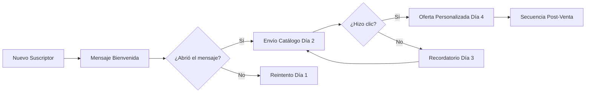

# Cómo Enviar Mensajes Masivos de WhatsApp Usando Listas de Difusión

La difusión en WhatsApp es una herramienta increíblemente poderosa que permite a las empresas conectar con miles de clientes de forma sencilla. Aunque las personas usan WhatsApp principalmente para comunicaciones personales, las empresas encuentran difícil llegar a múltiples contactos al mismo tiempo de manera eficiente. Para los profesionales, especialmente aquellos que trabajan en organizaciones grandes, resulta un desafío contactar a todos los clientes en el momento oportuno. La difusión de WhatsApp llega al rescate, permitiendo enviar mensajes comerciales críticos sin esfuerzo.

Con una impresionante tasa de apertura de mensajes del 80 % en WhatsApp —diez veces superior a la del correo electrónico y SMS— y tasas de conversión del 45 al 60 %, veinte veces más efectivas que el email, está claro que el marketing tradicional por correo y SMS ya no es tan efectivo.

En esta guía, revelaremos los secretos para aprovechar las difusiones de WhatsApp para el éxito de tu negocio. Sigue leyendo mientras exploramos formas de aprovechar todo el potencial de esta poderosa herramienta de comunicación.

<Callout type="info">
**¿Sabías que...?** Según estudios recientes, el 90 % de los mensajes de WhatsApp se leen en los primeros 3 minutos después de ser recibidos. Esto convierte a WhatsApp en el canal con la mayor tasa de apertura y velocidad de respuesta entre todas las plataformas de mensajería.
</Callout>

## ¿Qué es una Difusión en WhatsApp?

La función de difusión en WhatsApp te permite enviar un mensaje que puede llegar a varios contactos a la vez, ahorrando tiempo de comunicación sin necesidad de crear chats grupales. Es aplicable para diferentes propósitos: anuncios, promociones comerciales o incluso compartir actualizaciones personales con amigos cercanos. Existen dos métodos principales para enviar una difusión:

### WhatsApp Business App

Para enviar mensajes de difusión, los destinatarios deben tener tu número guardado en sus contactos. Cada lista de difusión puede incluir hasta 256 personas. La pregunta es: ¿cómo puedes enviar un mensaje de difusión a contactos que no tienen guardado tu número?

### WhatsApp Cloud API

No te preocupes. E-SMART360 tiene la solución. Somos una plataforma de chatbot con IA y herramientas de marketing para WhatsApp y Telegram que te permite enviar mensajes de difusión a personas ilimitadas mediante la WhatsApp Cloud API.

<Callout type="success">
**Ventaja clave:** Mientras que la WhatsApp Business App tiene un límite de 256 contactos por lista de difusión y exige que los destinatarios tengan tu número guardado, E-SMART360 elimina ambas restricciones por completo al operar a través de la WhatsApp Cloud API oficial.
</Callout>

## Cómo Crear una Lista de Difusión en la WhatsApp Business App

Crear una lista de difusión en WhatsApp es sencillo y te permite enviar el mismo mensaje a un grupo de destinatarios sin crear un chat grupal. Así se hace tanto en Android como en iPhone:

<Steps>
<Step title="En Android">
1. Abre WhatsApp y ve a la pestaña **Chats**.
2. Toca el botón **Más opciones** (tres puntos en la esquina superior derecha).
3. Selecciona **Nueva difusión**.
4. Busca o desplázate por tus contactos para encontrar las personas que deseas agregar. Puedes elegir hasta 256 contactos.
5. Toca la marca de verificación junto a cada contacto que quieras agregar.
6. Toca **Crear** cuando hayas terminado de agregar contactos.
7. Puedes nombrar tu lista de difusión tocando el ícono del lápiz junto al nombre actual.
</Step>
<Step title="En iPhone">
1. Abre WhatsApp y ve a la pestaña **Chats**.
2. Toca el ícono **"+"** en la esquina superior derecha para ir a Nuevo Chat.
3. Toca **Nueva difusión** al final.
4. Busca o desplázate por tus contactos para encontrar las personas que deseas agregar. Puedes elegir hasta 256 contactos.
5. Toca el botón Seleccionar junto a cada contacto que quieras agregar.
6. Toca **Crear** cuando hayas terminado de agregar contactos.
7. Puedes nombrar tu lista de difusión tocando el título en la parte superior de la lista.
</Step>
</Steps>

## Cómo Enviar un Mensaje de Difusión en la WhatsApp Business App

WhatsApp Business es una buena opción para enviar mensajes de difusión a pequeñas empresas porque es gratuita y fácil de configurar.

Así puedes enviar mensajes de difusión en WhatsApp Business:

<Steps>
<Step title="Paso 1">
Abre la aplicación WhatsApp Business.
</Step>
<Step title="Paso 2">
Toca **"Más opciones"** (ícono de tres puntos) y selecciona **"Nueva difusión"**.
</Step>
<Step title="Paso 3">
Busca o selecciona los contactos que deseas agregar a la lista de difusión.
</Step>
<Step title="Paso 4">
Toca la marca de verificación para confirmar y crear la lista de difusión.
</Step>
<Step title="Paso 5">
Escribe tu mensaje y envíalo.
</Step>
</Steps>

## Diferencia entre un Mensaje Grupal y un Mensaje de Difusión en WhatsApp

La diferencia clave entre un grupo de WhatsApp y una difusión radica en la interacción y la visibilidad de los mensajes:

### 1. Propósito y Caso de Uso

**Mensaje Grupal:** Un grupo de WhatsApp se establece para discusión continua entre varios participantes. Es ideal para debates, colaboración e intercambio de información donde todos los participantes pueden interactuar entre sí.

**Mensaje de Difusión:** Un mensaje de difusión está destinado a la comunicación unidireccional del remitente a una gran cantidad de destinatarios. Es ideal para anuncios, promociones o actualizaciones donde el remitente no requiere retroalimentación de los destinatarios.

### 2. Interacción del Destinatario

**Mensaje Grupal:** Todos los miembros de un grupo pueden ver las respuestas de los demás, y cualquiera puede responder a un grupo, manteniendo así un entorno colaborativo.

**Mensaje de Difusión:** Cada destinatario recibe el mensaje directamente y no sabe quién más lo recibió. Pueden responder al remitente original pero no pueden ver las respuestas de otros destinatarios.

### 3. Visibilidad de los Destinatarios

**Mensaje Grupal:** Todos los miembros del grupo pueden ver la lista de personas que respondieron y sus mensajes.

**Mensaje de Difusión:** Los destinatarios no saben quiénes son los otros destinatarios, y el mensaje se mantiene privado para cada contacto.

### 4. Control y Gestión

**Mensaje Grupal:** Los administradores del grupo pueden gestionar la configuración, agregar o eliminar miembros y controlar quién puede enviar mensajes.

**Mensaje de Difusión:** El remitente tiene control total sobre la lista de difusión, pero el mensaje, una vez enviado, no se puede modificar ni eliminar para todos los de la lista.

### 5. Limitaciones

**Mensaje Grupal:** Un grupo de WhatsApp tiene un máximo de 1024 miembros (al momento de esta publicación).

**Mensaje de Difusión:** Máximo 256 contactos por lista de difusión.

### 6. Comportamiento de Notificaciones

**Mensaje Grupal:** Todos los miembros del grupo reciben notificaciones de nuevos mensajes, lo que puede generar un entorno ruidoso.

**Mensaje de Difusión:** Los destinatarios reciben las notificaciones como si hubieran recibido un mensaje directo, lo que resulta menos intrusivo.

<Tabs>
<Tab title="Comparativa Rápida">
| Aspecto | Grupo de WhatsApp | Difusión de WhatsApp |
|---|---|---|
| Propósito | Discusión grupal | Comunicación uno a muchos |
| Interacción | Todos ven y responden | Respuesta solo al remitente |
| Visibilidad | Todos ven a los miembros | Privado por contacto |
| Límite | Hasta 1024 miembros | Hasta 256 destinatarios (Business App) |
| Notificaciones | Ruidosas, múltiples | Como mensaje directo |
</Tab>
<Tab title="Cuándo Usar Cada Una">
**Usa Grupos cuando:** Necesites discusiones colaborativas, equipos de trabajo, comunidades donde todos interactúan, o sesiones de lluvia de ideas.

**Usa Difusiones cuando:** Necesites enviar anuncios, promociones, recordatorios, actualizaciones de productos, o cualquier comunicación que no requiera respuesta colectiva.
</Tab>
</Tabs>

## Limitaciones de los Mensajes de Difusión en la WhatsApp Business App

Si bien la aplicación WhatsApp Business tiene muchos beneficios, también presenta limitaciones importantes. De hecho, si eres un empresario que busca hacer crecer su negocio, no puedes depender únicamente de la WhatsApp Business App. Veamos sus limitaciones:

<Callout type="warning">
**Limitaciones de la WhatsApp Business App para difusiones:**

- **Límite de contactos:** Máximo 256 contactos por lista de difusión.
- **Requisito del destinatario:** Los destinatarios deben tener el número del remitente guardado en sus contactos.
- **Comunicación unidireccional:** Los mensajes de difusión se envían como comunicación de una sola vía.
- **Sin interacción grupal:** Los destinatarios no saben quién más recibió el mensaje.
- **Sin edición posterior:** Una vez enviado, el mensaje no se puede editar ni eliminar para todos.
- **Restricciones de contenido:** Límites en el tipo de contenido que se puede difundir.
- **Analíticas limitadas:** La app no ofrece analíticas sofisticadas para medir el rendimiento.
</Callout>

Como puedes ver, no es sostenible usar la WhatsApp Business App cuando estás haciendo crecer tu negocio o ya tienes un negocio de tamaño mediano. Para manejar una gran cantidad de clientes, necesitas una forma de enviar difusiones ilimitadas sin restricciones. Ahí es donde entra E-SMART360.

<Callout type="success">
"E-SMART360 te permite enviar mensajes de difusión ilimitados en WhatsApp"
</Callout>

## Elimina Todas las Limitaciones: Envía Difusiones Ilimitadas con E-SMART360 (Usando WhatsApp Cloud API)

E-SMART360 es la mejor opción para tu negocio porque te permite enviar mensajes de difusión ilimitados a tus clientes, resolviendo una de las mayores desventajas de la WhatsApp Business App.

La plataforma permite enviar mensajes de difusión ilimitados a todos tus clientes simultáneamente, manteniéndolos actualizados sobre nuevas ofertas y servicios. No necesitas crear cientos de listas de difusión como en la WhatsApp Business App, porque puedes seleccionar todos tus clientes a la vez y enviar el mensaje, ahorrando mucho esfuerzo y tiempo.

### Panel de Analíticas

E-SMART360 cuenta con un impresionante panel de analíticas donde puedes consultar los datos de crecimiento de suscriptores y también las analíticas de mensajes de difusión. Aspectos como el "conteo de mensajes enviados" y el "conteo de mensajes pendientes" se pueden verificar fácilmente en este panel.

### Automatización con IA

Además, puedes configurar un Asistente de IA en tu cuenta de WhatsApp para que tu negocio funcione completamente automatizado en tu ausencia. E-SMART360 te permite construir estos potentes chatbots que pueden chatear, tomar pedidos e incluso realizar transacciones por sí solos.

<Expandable title="¿Cómo funciona la automatización con IA en las difusiones?">
Una vez que configuras tu asistente de IA, este puede manejar las respuestas de los clientes que contestan a tus mensajes de difusión. Por ejemplo, si envías una difusión sobre una oferta especial, los clientes que respondan con preguntas recibirán respuestas automáticas personalizadas. El asistente puede calificar leads, agendar citas, proporcionar información de productos y escalar conversaciones complejas a un agente humano cuando sea necesario.
</Expandable>

## Cómo Preparar tu Lista de Suscriptores para una Campaña de Difusión

Antes de lanzar cualquier campaña de difusión, necesitas tener una lista de contactos limpia y bien organizada. Sigue estos pasos:

<Steps>
<Step title="Prepara tu hoja de cálculo">
Asegúrate de tener una lista de contactos limpia y lista para importar. Prepara una hoja de cálculo con los datos necesarios (nombre, número de teléfono, etc.). Asegúrate de que la columna de números de teléfono sea precisa y esté formateada correctamente.
</Step>
<Step title="Descarga como CSV">
Descarga la hoja de cálculo como un archivo CSV desde Google Sheets (se requiere codificación UTF-8).
</Step>
<Step title="Importa tus suscriptores">
Ve al Gestor de Suscriptores en tu panel de E-SMART360. Selecciona la cuenta de WhatsApp que vas a usar. Haz clic en "Opciones" y selecciona "Importar Suscriptores". Sube el archivo CSV o importa directamente desde Google Sheets.
</Step>
<Step title="Mapea los datos">
Cuando hayas importado tu archivo, mapea los datos para alinear las columnas correctamente. En el campo "Encabezado del Archivo", selecciona el nombre de la columna del CSV. En el "Campo de Datos", asigna el campo de suscriptor correspondiente.
</Step>
</Steps>

## Tipos de Plantillas de Mensajes

Existen dos tipos de categorías de plantillas de mensajes en E-SMART360:

- **Plantillas transaccionales (Utilidad, Auth/OTP):** Se usan para enviar mensajes relacionados con una transacción específica, como una confirmación de envío o un recibo de pago.
- **Plantillas de marketing:** Se usan para enviar mensajes que promocionan tus productos o servicios.

## Cómo Crear una Plantilla de Mensaje

<Steps>
<Step title="Accede a las plantillas">
Ve a **Gestor de Bot > Plantillas de Mensajes** en tu panel de E-SMART360.
</Step>
<Step title="Crea una nueva plantilla">
Haz clic en **Crear Nueva Plantilla** y selecciona entre la lista de tipos de plantillas disponibles.
</Step>
<Step title="Completa los detalles requeridos">
- **Contenido del mensaje:** Crea el texto de la plantilla, incluyendo personalización con campos personalizados y botones de llamada a la acción (CTA) opcionales.
- **Nombre de la plantilla:** Usa minúsculas y reemplaza los espacios con guiones bajos.
</Step>
<Step title="Guarda y envía a revisión">
Guarda y envía tu plantilla a Meta para su aprobación. La aprobación puede tomar algunos minutos.
</Step>
</Steps>

## Cómo Configurar una Campaña de Difusión

<Steps>
<Step title="Navega a la sección de difusión">
Ve a **Difusión** en tu panel de E-SMART360.
</Step>
<Step title="Crea una nueva campaña">
Haz clic en **Crear Nueva Campaña** y asígnale un nombre (por ejemplo, "Campaña de Marketing de Prueba").
</Step>
<Step title="Selecciona tu audiencia objetivo">
Puedes elegir entre dos opciones:
- **Ventana de 24 horas:** Envía mensajes gratuitos a usuarios que interactuaron contigo en las últimas 24 horas.
- **Mensajería en cualquier momento:** Usa una plantilla aprobada para llegar a todos los suscriptores.
</Step>
<Step title="Filtra por etiquetas">
Usa etiquetas (Label IDs) para incluir o excluir segmentos específicos de tu audiencia. Por ejemplo: "Nuevo Lead", "Interesado en Demo", "Prueba Gratuita".
</Step>
<Step title="Programa o envía inmediatamente">
Elige entre enviar la campaña inmediatamente o programarla para una fecha posterior. Ajusta la zona horaria para una entrega óptima.
</Step>
<Step title="Guarda y ejecuta">
Nombra tu flujo de bot, guarda la configuración y ejecuta la campaña. El estado se actualizará en el panel de control.
</Step>
</Steps>

## Mensajes de Difusión con Datos Variables Personalizados

Una de las funcionalidades más poderosas de E-SMART360 es la capacidad de personalizar cada mensaje de difusión con datos variables. Esto significa que cada destinatario recibe un mensaje único con su nombre, información relevante y ofertas personalizadas.

<Columns cols="2">
<Card title="Beneficios de la Personalización">
- **Mayor engagement:** Dirigirse a los destinatarios por su nombre e incluir información relevante aumenta las tasas de respuesta.
- **Mejor experiencia del cliente:** La personalización hace que las interacciones se sientan más humanas y centradas en el cliente.
- **Mejores tasas de conversión:** Los mensajes dirigidos generan resultados de marketing más efectivos.
</Card>
<Card title="Datos que Puedes Personalizar">
- Nombre del contacto
- Última compra realizada
- Carrito abandonado
- Ubicación del cliente
- Productos recomendados
- Fecha de cumpleaños
- Historial de interacciones
</Card>
</Columns>

### Cómo Usar Variables Personalizadas en tus Plantillas

<Steps>
<Step title="Crea campos personalizados">
Ve al Gestor de Suscriptores de WhatsApp. Selecciona "Gestionar" → "Gestionar Campos Personalizados". Haz clic en "Crear", proporciona un nombre de campo, elige un tipo y guárdalo.
</Step>
<Step title="Importa tu lista con datos extendidos">
Al importar tu lista de suscriptores, incluye columnas adicionales para los campos personalizados. Asegúrate de mapear correctamente cada columna con su campo correspondiente.
</Step>
<Step title="Crea la plantilla con variables">
En el cuerpo del mensaje, incorpora las variables personalizadas usando la sintaxis adecuada (por ejemplo, {{nombre}}, {{ultima_compra}}, {{ciudad}}).
</Step>
<Step title="Verifica y lanza la campaña">
Antes de enviar, verifica que la plantilla esté aprobada y que los datos variables se estén insertando correctamente revisando una vista previa.
</Step>
</Steps>

## Entendiendo los Límites de Difusión de WhatsApp

WhatsApp asigna a las empresas diferentes niveles de mensajería según su uso y calidad. Conocer estos niveles te ayudará a planificar tus campañas de manera efectiva.

<mermaid>
graph TD
    A[Trial: 250 usuarios/día] --> B[Tier 1: 1,000 usuarios/día]
    B --> C[Tier 2: 10,000 usuarios/día]
    C --> D[Tier 3: 100,000 usuarios/día]
    D --> E[Tier 4: Ilimitado]
    style A fill:#f9f,stroke:#333,stroke-width:1px
    style E fill:#9f9,stroke:#333,stroke-width:2px
</mermaid>

### Requisitos de Progresión

Para avanzar a un nivel superior, debes:

- Mantener una calificación de calidad alta en tus mensajes.
- Enviar mensajes al menos al 50 % del límite de tu nivel actual.
- Mantener un compromiso constante con los usuarios.
- Conservar una calificación de calidad Media o Alta.

### Ruta de Actualización

- **De Trial a Tier 1:** Envía mensajes a al menos 1,000 usuarios únicos en un plazo de 30 días, manteniendo una calificación de calidad verde.
- **De Tier 1 a Tier 2:** Envía mensajes a al menos 500 usuarios únicos.
- **De Tier 2 a Tier 3:** Envía mensajes a al menos 5,000 usuarios únicos.
- **De Tier 3 a Tier 4:** Mantén la consistencia y la calidad para alcanzar el nivel ilimitado.

<Callout type="tip">
**Pro tip para una progresión rápida:** La actualización a un nivel superior generalmente ocurre dentro de los 7 días posteriores a cumplir con los criterios requeridos. WhatsApp actualiza automáticamente los niveles según el rendimiento de tu cuenta; no puedes solicitar una actualización manualmente.
</Callout>

### ¿Qué Sucede si Superas tu Límite?

Si intentas enviar mensajes más allá de tu nivel permitido, puedes ver un mensaje de error que indica "El tamaño de la audiencia excede la cuota restante". Algunos mensajes pueden fallar en la entrega. En ese caso, deberás reducir el tamaño de tu audiencia para mantenerte dentro de tu límite actual.

### Consejos para una Progresión Sin Problemas

- **Enfócate en la calidad del mensaje:** Evita contenido similar al spam.
- **Mantén un compromiso constante:** Mantén a los usuarios interesados con mensajes relevantes.
- **Monitorea las interacciones:** Haz un seguimiento de las respuestas y ajusta las estrategias según sea necesario.
- **Evita el envío masivo excesivo:** Mantén una reputación saludable como remitente.

## Reglas de Difusión en WhatsApp para Evitar Ser Bloqueado

Para garantizar que tus campañas de difusión sean exitosas y tu número no sea bloqueado o restringido, sigue estas reglas fundamentales:

<Callout type="danger">
**Regla #1: Nunca compres listas de contactos.** El uso de listas de contactos compradas o no verificadas es la causa principal de bloqueos en WhatsApp. Meta tiene sistemas avanzados de detección de spam que identifican patrones de mensajes enviados a números que no han dado su consentimiento.
</Callout>

- **Obtén consentimiento explícito:** Asegúrate de que cada contacto haya aceptado recibir mensajes tuyos.
- **Usa siempre la WhatsApp Cloud API oficial:** Evita soluciones no oficiales que violen los términos de servicio.
- **Respeta los límites de frecuencia:** No satures a tus contactos con mensajes excesivos.
- **Monitorea tu calidad de mensajes:** Meta califica cada mensaje como Alto, Medio o Bajo según las interacciones de los usuarios.
- **Incluye siempre una opción para darse de baja:** Ofrece a los usuarios una manera clara de dejar de recibir tus mensajes.
- **Mantén contenido relevante y útil:** Tus mensajes deben aportar valor real al destinatario.

<Callout type="info">
**¿Sabías que Meta utiliza tecnología de IA para detectar comportamientos de spam?** Si muchos destinatarios marcan tus mensajes como spam o bloquean tu número, tu calificación de calidad bajará y podrías ser restringido o bloqueado permanentemente. Por eso es fundamental mantener una lista limpia y contenido relevante.
</Callout>

## Preguntas Frecuentes sobre Difusiones en WhatsApp

<Expandable title="¿Qué pasa si mi plantilla de mensaje es rechazada por Meta?">
Revisa el contenido para asegurarte de que cumple con las directrices de WhatsApp y vuelve a enviarla. Las causas más comunes de rechazo incluyen: lenguaje promocional excesivo, falta de claridad en el propósito del mensaje, ausencia de opción para darse de baja, o contenido que podría considerarse engañoso. Corrige estos aspectos y vuelve a enviar tu plantilla para su revisión.
</Expandable>

<Expandable title="¿Puedo enviar mensajes de difusión sin usar una plantilla?">
Solo puedes enviar mensajes sin plantilla dentro de la ventana de 24 horas posterior a la interacción del usuario. Fuera de esa ventana, es obligatorio utilizar una plantilla de mensaje aprobada por Meta. Esta regla aplica para todos los mensajes de marketing y utilidad iniciados por la empresa.
</Expandable>

<Expandable title="¿Cuánto tiempo tarda en aprobarse una plantilla de mensaje?">
Generalmente, la aprobación puede tomar desde unos minutos hasta algunas horas. Sin embargo, en algunos casos puede demorar hasta 24-48 horas. E-SMART360 te notificará automáticamente cuando tu plantilla sea aprobada o rechazada. Si tu plantilla está pendiente por más de 48 horas, puedes contactar a soporte para verificar el estado.
</Expandable>

<Expandable title="¿Puedo enviar mensajes de difusión a números internacionales?">
Sí, siempre que tengas el consentimiento de esos contactos. Ten en cuenta que los costos de mensajería pueden variar según el país del destinatario. La WhatsApp Cloud API de Meta cobra tarifas diferentes según la región geográfica del número de teléfono del destinatario.
</Expandable>

<Expandable title="¿Cómo puedo medir el éxito de mis campañas de difusión?">
E-SMART360 ofrece un panel de analíticas completo donde puedes monitorear: mensajes enviados, mensajes entregados, mensajes leídos, tasa de clics en botones CTA, respuestas recibidas, tasa de cancelación de suscripción y crecimiento de tu lista de suscriptores. Utiliza estos datos para optimizar tus campañas futuras.
</Expandable>

<Expandable title="¿Qué diferencia hay entre un mensaje de marketing y uno de utilidad?">
Los mensajes de **utilidad** facilitan una transacción o brindan información sobre una compra o cuenta existente (confirmaciones de pedido, facturas, alertas de entrega). Los mensajes de **marketing** promocionan productos o servicios (ofertas, descuentos, lanzamientos). Los mensajes de marketing tienen costos más altos y requisitos de consentimiento más estrictos que los de utilidad.
</Expandable>

## Ejemplos Prácticos de Campañas de Difusión

<Columns cols="2">
<Card title="Caso 1: Tienda de Ropa - Lanzamiento de Colección">
**Objetivo:** Anunciar una nueva colección de temporada a 15,000 suscriptores.

**Estrategia:**
- Segmentar por historial de compras
- Personalizar con el nombre del cliente
- Incluir imágenes de la colección usando plantilla multimedia
- Agregar botón CTA "Ver Colección"

**Resultado:** 78% de tasa de apertura, 12% de clics en CTA, incremento del 23% en ventas durante la primera semana.
</Card>
<Card title="Caso 2: Restaurante - Ofertas de Fin de Semana">
**Objetivo:** Incrementar reservas los fines de semana.

**Estrategia:**
- Enviar difusión cada jueves a las 11:00 AM
- Ofrecer descuento del 15% para reservas antes del sábado
- Incluir enlace directo al sistema de reservas
- Usar datos variables con el nombre del cliente

**Resultado:** Aumento del 40% en reservas de fin de semana, 65% de los cupones canjeados dentro de las 48 horas.
</Card>
</Columns>

### Paso a Paso: Ejemplo de Campaña de Bienvenida Automatizada

Imagina que un nuevo suscriptor se une a tu lista. Con E-SMART360, puedes configurar una secuencia automatizada:

<Steps>
<Step title="Paso 1: Captura del Lead">
Un usuario visita tu sitio web y se suscribe a través de un formulario de WhatsApp integrado. E-SMART360 captura automáticamente su número, nombre y cualquier otro dato proporcionado.
</Step>
<Step title="Paso 2: Mensaje de Bienvenida Personalizado">
Inmediatamente después de la suscripción, el sistema envía un mensaje de bienvenida personalizado: "¡Gracias por suscribirte, [Nombre]! 🎉 Como bienvenida, aquí tienes un 10% de descuento en tu primera compra. Usa el código: BIENVENIDO10"
</Step>
<Step title="Paso 3: Secuencia de Seguimiento">
- **Día 1:** Mensaje con enlace al catálogo de productos más populares.
- **Día 3:** Mensaje de utilidad preguntando si necesita ayuda con algo.
- **Día 7:** Oferta especial limitada para nuevos suscriptores.
</Step>
<Step title="Paso 4: Analítica y Optimización">
Revisa las tasas de apertura, clics y conversión de cada paso de la secuencia. Ajusta los mensajes según el comportamiento de tus suscriptores para maximizar resultados.
</Step>
</Steps>

## Artículos Relacionados

- [Chatbot Multicanal para WhatsApp, Messenger, Instagram, Telegram y WebChat](/recursos/chatbot-multicanal)
- [Cómo Enviar Mensajes de Difusión a Suscriptores de WhatsApp Usando Plantillas](/recursos/difusion-plantillas-whatsapp)
- [Cómo Crear un Mensaje de Difusión Personalizado con Datos Variables en WhatsApp](/recursos/difusion-personalizada-variables)
- [Cómo Usar el Asistente de IA en Atención al Cliente](/recursos/asistente-ia-atencion-cliente)
- [Detección de Intenciones con IA para Mejorar la Eficiencia del Chatbot](/recursos/deteccion-intenciones-ia-chatbot)
- [Cómo Enviar Mensajes de Difusión a Suscriptores de Telegram](/recursos/difusion-telegram)
- [Difunde Automáticamente tus Nuevas Entradas de WordPress a Suscriptores de WhatsApp](/recursos/difusion-automatica-wordpress-whatsapp)

## Estrategias Avanzadas de Segmentación para tus Difusiones

Una de las claves del éxito en las campañas de difusión es la segmentación correcta de tu audiencia. No todos tus suscriptores deben recibir los mismos mensajes. Una segmentación bien planificada puede duplicar o triplicar tus tasas de conversión.

### Criterios de Segmentación Recomendados

| Criterio | Descripción | Ejemplo de Uso |
|---|---|---|
| Comportamiento de compra | Basado en compras anteriores o carritos abandonados | Enviar oferta de descuento a quienes no completaron su compra |
| Ubicación geográfica | Según país, ciudad o región | Promocionar eventos locales o envíos gratuitos a ciertas zonas |
| Interacción previa | Según apertura de mensajes anteriores o clics | Re-enviar oferta a quienes no abrieron el primer mensaje |
| Etapa del ciclo de vida | Nuevo lead, cliente activo, cliente inactivo | Campaña de reactivación para clientes que no han comprado en 3 meses |
| Intereses declarados | Según preferencias indicadas al suscribirse | Enviar contenido específico de la categoría de producto favorita |

### Cómo Crear Segmentos en E-SMART360

<Steps>
<Step title="Accede al Gestor de Suscriptores">
Desde el panel principal de E-SMART360, navega a la sección de Suscriptores. Aquí verás una lista completa de todos tus contactos.
</Step>
<Step title="Crea etiquetas personalizadas">
Selecciona la opción "Gestionar Etiquetas" y crea las categorías que necesitas: "Nuevo Lead", "Cliente VIP", "Carrito Abandonado", "Interesado en Producto X", etc.
</Step>
<Step title="Asigna etiquetas a tus contactos">
Puedes hacerlo de forma manual, mediante importación CSV (incluyendo una columna de etiquetas) o mediante flujos automatizados que asignen etiquetas según las respuestas de los usuarios.
</Step>
<Step title="Usa las etiquetas en tus campañas">
Al crear una nueva campaña de difusión, selecciona las etiquetas que deseas incluir o excluir en la sección de "Filtros de Audiencia".
</Step>
</Steps>

<Callout type="tip">
**Mejora tu targeting:** E-SMART360 te permite crear reglas de segmentación dinámicas. Por ejemplo, puedes crear una etiqueta automática "Alto Valor" que se asigne a cualquier suscriptor que haya realizado más de 3 compras o haya gastado más de $500 en total. Esto te permite enviar ofertas exclusivas a tus mejores clientes sin esfuerzo manual.
</Callout>

## Cómo Enviar Mensajes de Difusión con Imágenes y Videos

Las plantillas multimedia enriquecen tus campañas y las hacen más atractivas. WhatsApp permite incluir imágenes, videos y documentos en tus mensajes de difusión a través de plantillas multimedia.

### Tipos de Plantillas Multimedia

- **Plantillas con imagen:** Incluyen una imagen principal (máximo 5 MB, formatos JPG/PNG) acompañada de texto y botones CTA.
- **Plantillas con video:** Incluyen un video (máximo 16 MB, formato MP4) con texto descriptivo y botones.
- **Plantillas con documento:** Permiten adjuntar archivos PDF para enviar catálogos, folletos o facturas.
- **Plantillas carrusel:** Incluyen múltiples tarjetas deslizables, cada una con su propia imagen, título, descripción y botón.

### Límites de Caracteres para Plantillas Multimedia

| Tipo de Plantilla | Límite de Caracteres |
|---|---|
| Cuerpo de texto | Hasta 1,024 caracteres |
| Encabezado (Header) | Hasta 60 caracteres |
| Pie de página (Footer) | Hasta 60 caracteres |
| Botón CTA | Hasta 20 caracteres por botón |
| Título en carrusel | Hasta 200 caracteres |
| Descripción en carrusel | Hasta 2,000 caracteres |

<Expandable title="¿Cómo crear una plantilla carrusel paso a paso?">
1. Ve a **Gestor de Bot > Plantillas de Mensajes**.
2. Haz clic en **Crear Nueva Plantilla**.
3. Selecciona el tipo **Carrusel**.
4. Completa el nombre de la plantilla y el idioma.
5. Agrega cada tarjeta del carrusel con su imagen, título, descripción y botón.
6. Puedes agregar hasta 10 tarjetas por carrusel.
7. Guarda y envía a aprobación de Meta.
</Expandable>

## Buenas Prácticas para Campañas de Difusión Exitosas

Para garantizar el éxito de tus campañas y mantener una reputación saludable con Meta, aplica estas buenas prácticas:

<Columns cols="2">
<Card title="✅ Lo que DEBES Hacer">
- Obtener consentimiento explícito de cada contacto
- Personalizar los mensajes con el nombre del destinatario
- Incluir siempre una opción clara para darse de baja
- Enviar contenido relevante y de valor
- Mantener una frecuencia moderada (máximo 4-6 campañas al mes)
- Monitorear las métricas de calidad de tus mensajes
- Segmentar tu audiencia adecuadamente
- Probar diferentes horarios de envío
</Card>
<Card title="❌ Lo que NO DEBES Hacer">
- Comprar listas de contactos
- Enviar mensajes a números que no han dado consentimiento
- Usar lenguaje engañoso o clickbait
- Enviar mensajes con demasiada frecuencia (más de 1-2 por semana)
- Ignorar las respuestas de los clientes
- Usar URLs acortadas que parezcan sospechosas
- Enviar contenido irrelevante para el segmento objetivo
</Card>
</Columns>

## Interpretación de Métricas de Calidad de WhatsApp

Meta asigna una calificación de calidad a cada número de teléfono empresarial. Esta calificación es crucial porque determina tus límites de mensajería y la capacidad de llegar a nuevos clientes.

### Niveles de Calidad

<Callout type="info">
**Calificación Alta (Green):** Tus mensajes son bien recibidos. Los usuarios interactúan positivamente, no bloquean tu número ni reportan spam. Puedes escalar a niveles superiores sin problemas.

**Calificación Media (Yellow):** Algunos usuarios están reportando tus mensajes o bloqueando tu número. Debes revisar tu estrategia de contenido y frecuencia.

**Calificación Baja (Red):** Problemas serios. Muchos usuarios están reportando spam. Tu número corre riesgo de ser restringido o bloqueado permanentemente.
</Callout>

### Factores que Afectan tu Calificación

| Factor | Impacto | Cómo Mejorarlo |
|---|---|---|
| Bloqueos de usuarios | Alto | Envía solo contenido relevante y permite darse de baja fácilmente |
| Reportes de spam | Alto | Revisa que tus mensajes cumplan las políticas de WhatsApp |
| Tasa de conversación iniciada | Medio | Anima a los usuarios a responder tus mensajes |
| Tasa de clics en CTA | Medio | Usa llamados a la acción claros y atractivos |
| Quejas formales a Meta | Crítico | Responde rápidamente y resuelve los problemas de los clientes |

## Cómo Migrar de WhatsApp Business App a E-SMART360

Si actualmente usas la WhatsApp Business App y deseas escalar tus operaciones, migrar a E-SMART360 es un proceso sencillo:

<Steps>
<Step title="Crea tu cuenta en E-SMART360">
Regístrate y selecciona el plan que mejor se adapte a tu volumen de mensajes.
</Step>
<Step title="Conecta tu número de WhatsApp">
Utiliza el proceso de Embedded Signup para conectar tu número a la WhatsApp Cloud API a través de E-SMART360.
</Step>
<Step title="Importa tus contactos">
Exporta tus contactos desde la WhatsApp Business App (puedes usar herramientas de respaldo) e impórtalos en E-SMART360 mediante CSV o Google Sheets.
</Step>
<Step title="Crea tus plantillas">
En lugar de usar mensajes simples como en la Business App, crea plantillas profesionales aprobadas por Meta para tus campañas.
</Step>
<Step title="Configura tu primera campaña">
Utiliza el panel de Broadcasting de E-SMART360 para lanzar tu primera campaña a todos tus contactos sin límite de 256 personas.
</Step>
</Steps>

## Automatización de Campañas con Disparadores Inteligentes

E-SMART360 te permite automatizar tus campañas de difusión para que se activen en función de eventos específicos:

### Disparadores Disponibles

| Disparador | Cuándo se Activa | Ejemplo |
|---|---|---|
| Nuevo suscriptor | Cuando alguien se suscribe | Enviar serie de bienvenida de 3 mensajes |
| Cumpleaños | En la fecha de cumpleaños del contacto | Enviar oferta especial de cumpleaños |
| Carrito abandonado | Cuando un usuario abandona productos en el carrito | Enviar recordatorio con descuento |
| Compra realizada | Después de una compra exitosa | Enviar encuesta de satisfacción y cross-selling |
| Inactividad | Cuando un cliente no abre mensajes en X días | Enviar campaña de reactivación |
| Aniversario | Al cumplirse 1 año desde la primera compra | Enviar mensaje de agradecimiento con oferta exclusiva |

<CodeGroup>
<CodeGroupItem title="Ejemplo Flujo Automatizado">

</CodeGroupItem>
</CodeGroup>

## Preguntas Frecuentes Adicionales

<Expandable title="¿Puedo usar E-SMART360 para difusiones en Telegram también?">
Sí. E-SMART360 es una plataforma multicanal que admite tanto WhatsApp como Telegram. Puedes crear campañas de difusión para ambas plataformas desde el mismo panel de control, ahorrando tiempo y esfuerzo en la gestión de múltiples herramientas.
</Expandable>

<Expandable title="¿Cuánto cuesta enviar mensajes de difusión a través de E-SMART360?">
Los costos varían según el plan que elijas y el volumen de mensajes. WhatsApp Cloud API cobra por conversación iniciada, y los precios varían según la región del destinatario. E-SMART360 ofrece planes con precios transparentes sin markup adicional en los costos de la API de WhatsApp. Consulta nuestra página de precios para más detalles.
</Expandable>

<Expandable title="¿E-SMART360 ofrece soporte para migrar desde otra plataforma?">
Sí. Contamos con un equipo de soporte dedicado que puede ayudarte a migrar tus contactos, plantillas y configuraciones desde otras plataformas como WATI, ChatRace, Twilio u otras. El proceso de migración está diseñado para ser fluido y minimizar el tiempo de inactividad.
</Expandable>

<Expandable title="¿Qué pasa si mi número ya fue restringido por enviar difusiones desde la Business App?">
Si tu número fue restringido por violaciones de políticas, puede ser difícil reactivarlo. Recomendamos obtener un nuevo número y seguir todas las mejores prácticas desde el principio con E-SMART360. Si la restricción fue leve, puedes contactar a soporte de Meta para solicitar una revisión.
</Expandable>

<Expandable title="¿Puedo programar campañas recurrentes automáticas?">
Sí. E-SMART360 permite crear campañas recurrentes. Por ejemplo, puedes programar un boletín semanal que se envíe automáticamente cada lunes a las 10:00 AM a un segmento específico de tu audiencia. Las campañas recurrentes se configuran fácilmente desde el panel de Broadcasting.
</Expandable>

<Expandable title="¿Se pueden enviar difusiones con variables dinámicas desde Google Sheets?">
Absolutamente. E-SMART360 se integra directamente con Google Sheets para que puedas tener datos actualizados en tiempo real. Por ejemplo, puedes tener una hoja de cálculo con el estado de los pedidos y la campaña de difusión enviará automáticamente el mensaje correcto a cada cliente según el estado de su pedido.
</Expandable>

## Ejemplo Completo: Campaña de Reactivación de Clientes Inactivos

Veamos un ejemplo práctico completo de cómo configurar una campaña para recuperar clientes que no han comprado en los últimos 90 días:

<Columns cols="3">
<Card title="📊 Paso 1: Segmentación">
Identifica clientes con:
- Última compra > 90 días
- No han cancelado suscripción
- Calificación de calidad Alta

**Segmento objetivo:** 5,000 contactos
</Card>
<Card title="📝 Paso 2: Creación de Plantillas">
**Plantilla 1:** "¡Te extrañamos, {{nombre}}!"
- Oferta especial de 20% descuento
- Botón "Ver Oferta"
- Válido por 7 días

**Plantilla 2:** "Últimos días {{nombre}}"
- Recordatorio de oferta
- Botón "Aprovechar Ahora"
- Válido por 3 días más
</Card>
<Card title="🚀 Paso 3: Campaña">
**Día 1:** Enviar Plantilla 1 a todo el segmento
**Día 4:** A quienes NO abrieron, reenviar con asunto diferente
**Día 7:** Enviar Plantilla 2 a quienes abrieron pero no compraron
**Día 14:** Analizar resultados
</Card>
</Columns>

## Comienza Hoy con E-SMART360

Las difusiones de WhatsApp representan una de las herramientas más poderosas para la comunicación empresarial en la actualidad. Con tasas de apertura del 80 % y un potencial de conversión incomparable, ninguna empresa puede darse el lujo de ignorar este canal.

E-SMART360 te ofrece la plataforma completa para aprovechar todo el potencial de las difusiones de WhatsApp sin las limitaciones de la WhatsApp Business App. Mensajes ilimitados, analíticas en tiempo real, personalización avanzada y automatización con IA están a solo unos clics de distancia.

<Callout type="success">
**¿Listo para escalar tu comunicación?** Crea tu cuenta gratuita en E-SMART360 y comienza a enviar difusiones ilimitadas a tus clientes hoy mismo. Sin restricciones de contactos, sin necesidad de que te tengan guardado en la agenda, con analíticas en tiempo real y el respaldo de la WhatsApp Cloud API oficial de Meta.
</Callout>
