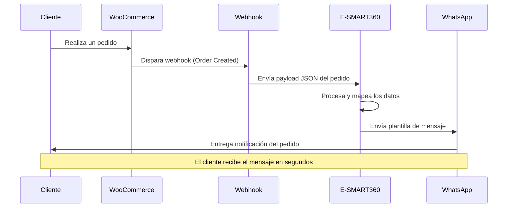

# Enviar Notificaciones de Pedidos de WooCommerce a WhatsApp con Webhook Workflow

<Callout type="success">
  **Resumen ejecutivo:** Esta guía explica cómo enviar notificaciones de pedidos de WooCommerce a los clientes a través de WhatsApp utilizando E-SMART360. Al crear una plantilla de mensaje de WhatsApp con variables (Lista de Productos, Precio Total, Fecha de Entrega Estimada), configurar un Webhook Workflow en E-SMART360 y conectarlo a WooCommerce mediante un webhook, las empresas pueden notificar automáticamente a los clientes por WhatsApp en el momento en que se realiza un nuevo pedido. Esta automatización mejora la comunicación con el cliente, aumenta la transparencia y optimiza la experiencia posterior a la compra sin necesidad de programación.
</Callout>

<Update title="Última actualización" date="15 de febrero de 2026" />

---

## Introducción

Enviar la información del pedido a los clientes es una parte esencial para confirmarles su compra. Antiguamente, el correo electrónico y los SMS eran los métodos más utilizados. Pero eso ya quedó en el pasado. El correo electrónico es aburrido y la gente lo abre raramente. Los SMS tampoco son adecuados para contenido enriquecido ni para una comunicación bidireccional. Aquí es donde WhatsApp se convierte en un factor revolucionario. WhatsApp es el canal de comunicación más apropiado para este propósito.

En este artículo, te mostraré cómo enviar notificaciones de pedidos a los clientes de WooCommerce por WhatsApp desde E-SMART360.

---

## Lo que Necesitas Antes de Empezar

<Callout type="tip">
  **Requisitos previos:** Asegúrate de tener lo siguiente antes de comenzar:
</Callout>

- Una **Cuenta de WhatsApp Business** conectada a E-SMART360.
- **Acceso a WhatsApp Cloud API** (para sincronizar plantillas desde WhatsApp Manager si es necesario).
- **Una tienda WooCommerce activa** con acceso al panel de administración de WordPress.
- **Una idea clara del contenido de tu mensaje**, incluyendo las variables, botones o pies de página que necesites.
- **Un plugin de webhook funcional** o acceso a la configuración de webhooks de WooCommerce.

Una vez que tengas todo esto listo, puedes seguir los pasos que se describen a continuación.

---

## Paso 1: Crear una Plantilla de Mensaje de WhatsApp

Para que WhatsApp pueda enviar mensajes a los clientes de WooCommerce, primero debes crear una plantilla de mensaje. La plantilla será la que se envíe como notificación de pedido.

### 1.1 Acceder al Gestor de Bot

Para crear una plantilla de mensaje, ve al **Panel de control** de E-SMART360. Haz clic en el menú **Bot Manager** en la barra lateral izquierda del panel. Instantáneamente, aparecerá la página del gestor del bot de WhatsApp.

### 1.2 Navegación en el Panel de Control de E-SMART360

El panel de control de E-SMART360 está diseñado para ser intuitivo. Cuando accedas por primera vez, verás las siguientes secciones principales en la barra lateral izquierda:

- **Dashboard:** Resumen general de tu actividad, estadísticas de mensajes, estados de plantillas y uso de la API.
- **Bot Manager:** El corazón de la automatización. Aquí gestionas plantillas de mensaje, variables, respuestas del bot y flujos conversacionales.
- **Webhook Workflow:** Donde configuras las conexiones entre E-SMART360 y plataformas externas como WooCommerce, Shopify o Google Sheets.
- **Broadcasting:** Para enviar campañas de mensajes masivos a tus suscriptores.
- **Live Chat:** Bandeja de entrada compartida para gestionar conversaciones en tiempo real con clientes.
- **Subscriber Manager:** Gestión de contactos, etiquetas, campos personalizados y listas de suscriptores.
- **Reportes:** Estadísticas detalladas de entregas, lecturas, clics y rendimiento de campañas.

Para lo que nos ocupa, usaremos principalmente **Bot Manager** y **Webhook Workflow**.

### 1.3 Crear Variables de Plantilla

Antes de crear la plantilla de mensaje, debes crear las variables que contendrán la información dinámica del pedido. Las variables son marcadores de posición que E-SMART360 reemplazará automáticamente con datos reales de WooCommerce cuando se envíe el mensaje.

En la parte inferior de la página del Bot Manager, verás la sección **Template variable** (Variable de plantilla).

Para crear una variable, haz clic en el botón **Create**. Aparecerá un formulario emergente con un campo llamado **variable name**. Proporciona un nombre para la variable en el campo y haz clic en el botón **Save**. Repite este proceso para cada variable que necesites.

<Steps>
  <Step title="Crear la variable Lista de Productos">
    Crea la primera variable con el nombre: `Product list`
    
    Esta variable mostrará los productos que el cliente ha comprado, incluyendo nombre, cantidad y precio unitario si así lo configuras.
  </Step>
  <Step title="Crear la variable Precio Total">
    Crea la segunda variable con el nombre: `Total price`
    
    Esta variable contiene el monto total del pedido, incluyendo impuestos, envío y descuentos aplicados.
  </Step>
  <Step title="Crear la variable Fecha de Entrega Estimada">
    Crea la tercera variable con el nombre: `Estimated delivery date`
    
    Esta variable muestra la fecha estimada en la que el cliente recibirá su pedido. Se calcula a partir de la fecha de creación del pedido más el tiempo de procesamiento y envío configurado en tu tienda.
  </Step>
  <Step title="Verificar que las variables aparecen en la lista">
    Una vez creadas, las variables aparecerán listadas en la sección Template variable. Puedes editarlas o eliminarlas si es necesario. Cada variable creada estará disponible para usarse en cualquier plantilla de mensaje.
  </Step>
</Steps>

<Expandable title="💡 Consejo: Nombres de variables y buenas prácticas">
  Los nombres de las variables deben ser descriptivos pero concisos. Una buena práctica es usar nombres en inglés si planeas usar la plantilla con datos internacionales. E-SMART360 reemplazará estos nombres de variable con los datos reales del pedido cuando se envíe el mensaje.

  **Consejos adicionales:**
  - No uses espacios ni caracteres especiales en los nombres de variables (usa guiones bajos si es necesario).
  - Limita el número de variables a las realmente necesarias. Demasiadas variables pueden hacer que la plantilla sea confusa.
  - Las variables pueden reutilizarse en múltiples plantillas, así que créalas pensando en todos los escenarios posibles.
</Expandable>

### 1.3 Crear la Plantilla de Mensaje

Ahora puedes crear la plantilla de mensaje que se enviará como notificación de pedido de WooCommerce.

Para crear una plantilla, haz clic en el botón **Create** en la sección **Message template settings**. Aparecerá un formulario modal llamado **Message template**. Debes completar el formulario:

1. **Template Name** — Proporciona un nombre para la plantilla (ej. `pedido_confirmado_woocommerce`).
2. **Message Body** — Escribe el mensaje que se enviará. Aquí es donde usarás las variables que creaste.
3. **Footer Text (Opcional)** — Añade un texto de pie de página si lo deseas.
4. **Quick Reply (Opcional)** — Selecciona respuestas rápidas si son necesarias.
5. **Button Text** — Añade texto para botones si los necesitas.

**Ejemplo de cuerpo del mensaje:**

```
¡Hola {{1}}!

Gracias por tu compra en Nuestra Tienda. 🎉

Aquí están los detalles de tu pedido:

━━━━━━━━━━━━━━━━━━
🛒 Productos:
{{Product list}}

💰 Total pagado: {{Total price}}
📅 Fecha estimada de entrega: {{Estimated delivery date}}
━━━━━━━━━━━━━━━━━━

Si tienes alguna pregunta sobre tu pedido, responde a este mensaje y nuestro equipo te atenderá.

¡Gracias por confiar en nosotros!
```

Después de escribir el mensaje, puedes añadir opcionalmente:

- **Footer Text:** Un texto pequeño al final del mensaje, como "Tienda Online © 2026".
- **Quick Reply:** Botones de respuesta rápida como "Ver mi pedido" o "Hablar con soporte".
- **Button Text:** Botones con acciones como "Rastrear pedido" o "Visitar tienda". Estos botones pueden incluir URLs dinámicas usando variables.

Haz clic en el botón **Save** para guardar la plantilla.

<Callout type="tip">
  **Consejo de formato:** WhatsApp admite texto enriquecido básico. Puedes usar *asteriscos* para **negritas**, _guiones bajos_ para *cursivas*, ~tildes~ para ~~tachado~~ y ``` Triple backticks para código ```. Úsalos para dar énfasis a la información importante como precios o fechas.
</Callout>

<Callout type="warning">
  **Importante:** Después de guardar la plantilla, debes verificar su estado. Haz clic en el botón **Check status** para ver el estado de la plantilla. Solo cuando el estado sea **approved** podrás usar la plantilla. El proceso de aprobación puede tomar desde unos minutos hasta varias horas, dependiendo de la revisión de Meta.

  **¿Por qué las plantillas necesitan aprobación?** Meta revisa todas las plantillas de mensaje para garantizar que cumplan con sus políticas de calidad y contenido. Las plantillas de categoría "Utility" (como notificaciones de pedidos) suelen aprobarse más rápido que las de categoría "Marketing". Para notificaciones de WooCommerce, usa siempre la categoría **Utility** ya que contienen información transaccional del cliente.
</Callout>

### 1.4 Usos Alternativos de las Plantillas

<Expandable title="¿Para qué más puedo usar las plantillas de mensaje?">
  Además de las notificaciones de pedidos, las plantillas de mensaje de WhatsApp pueden utilizarse para:

  - **Transmisiones (Broadcasting):** Enviar mensajes masivos a tus suscriptores.
  - **Chat en vivo:** Responder a clientes con plantillas predefinidas.
  - **Notificaciones de Shopify** y otros sistemas de e-commerce.
  - **Mensajes de seguimiento** post-venta.
  - **Recuperación de carritos abandonados** (lo cubrimos más adelante en esta guía).
  - **Confirmaciones de citas** y recordatorios.
  - **Notificaciones de estado de envío** con números de seguimiento.

  E-SMART360 también permite crear **plantillas tipo carrusel** con imágenes y botones para mostrar múltiples productos en un solo mensaje.
</Expandable>

---

## Paso 2: Configurar un Webhook Workflow

Una vez que la plantilla esté aprobada, debes crear un Webhook Workflow. El Webhook Workflow es el motor que conecta WooCommerce con E-SMART360 para que los datos del pedido se envíen automáticamente.

### 2.1 Crear el Workflow

Para crear un Webhook Workflow, haz clic en el menú **Webhook Workflow** en la barra lateral izquierda del panel de control.

Aparecerá la página de Webhook Workflow con un botón **Create**. Haz clic en **Create** para crear un nuevo workflow. Instantáneamente, aparecerá una sección llamada **New workflow** en la parte inferior de la página.

<Steps>
  <Step title="Asignar un nombre al workflow">
    Proporciona un nombre en el campo **Workflow name** (ej. `Notificaciones WooCommerce`).
  </Step>
  <Step title="Seleccionar la plantilla de mensaje">
    Selecciona la plantilla de mensaje que creaste anteriormente para enviarla como notificación de pedido de WooCommerce.
  </Step>
  <Step title="Seleccionar la cuenta de WhatsApp">
    Elige la cuenta de WhatsApp desde la cual se enviarán los mensajes.
  </Step>
  <Step title="Guardar el workflow">
    Haz clic en el botón **Save workflow**.
  </Step>
</Steps>

### 2.2 Obtener la URL del Webhook

Después de guardar el workflow, aparecerá una **URL de callback de webhook**.

<Callout type="info">
  Esta URL es única para tu workflow. Es la dirección a la que WooCommerce enviará los datos del pedido cada vez que ocurra un evento (como un nuevo pedido). **Copia esta URL** porque la necesitarás en el siguiente paso.
</Callout>

Ejemplo de cómo se ve la URL:

```
https://app.esmart360.com/webhook/callback/abc123def456
```

---

## Paso 3: Integrar el Webhook con WooCommerce

Ahora debes ir a tu tienda WooCommerce y configurar el webhook para que envíe los datos del pedido a E-SMART360.

### 3.1 Acceder a la Configuración de WooCommerce

Ve a tu **panel de administración de WordPress**. Luego:

1. Ve al plugin **WooCommerce**.
2. Haz clic en **Settings** (Configuración).
3. Haz clic en la pestaña **Advanced** (Avanzado).
4. Aparecerán las configuraciones avanzadas. Haz clic en la opción **Webhooks**.

### 3.2 Añadir un Nuevo Webhook

Aparecerá una página con un botón **Add webhook**. Al hacer clic en **Add webhook**, puedes añadir un nuevo webhook.

Completa los siguientes campos:

<Columns cols="2">
  <Card title="Campos del Webhook">
    - **Name:** Proporciona un nombre descriptivo (ej. `Notificación WhatsApp`).
    - **Status:** Selecciona **Active** como estado.
    - **Topic:** Selecciona **Order Created** (Pedido creado). Este evento se activa cuando un cliente completa una compra.
    - **Delivery URL:** Pega la URL de callback del webhook que copiaste de E-SMART360.
  </Card>
  <Card title="Consejos importantes">
    - Asegúrate de que el estado sea "Active", de lo contrario el webhook no funcionará.
    - El tópico "Order Created" es el más común para notificaciones, pero también puedes usar "Order Updated" para cambios de estado.
    - WooCommerce admite HTTP Basic Auth en los webhooks si necesitas seguridad adicional.
  </Card>
</Columns>

Haz clic en el botón **Save Webhook**.

<Callout type="tip">
  **API REST de WooCommerce:** WooCommerce expone los datos del pedido a través de su API REST. Cuando se activa el webhook, WooCommerce envía un payload JSON completo con toda la información del pedido, incluyendo datos de facturación, productos, totales y más. E-SMART360 procesa este JSON automáticamente.
</Callout>

---

## Paso 4: Configurar el Mapeo de Respuesta del Webhook

Ahora necesitas proporcionar datos de muestra para el mapeo. El mapeo le indica a E-SMART360 qué campos del JSON de WooCommerce deben asignarse a cada variable de la plantilla.

### 4.1 Capturar la Respuesta del Webhook

En E-SMART360, haz clic en **Capture Webhook Response**. Aparecerá la página **Webhook Response Mapping** con datos sin procesar (raw data).

<Callout type="info">
  Estos son **datos de muestra** generados automáticamente por WooCommerce cuando se añade un webhook. Sin embargo, para un mapeo preciso, necesitas usar **datos reales** de un pedido verdadero.
</Callout>

### 4.2 Obtener Datos Reales

Ignora los datos de muestra por ahora. Necesitas enviar datos reales al webhook. Para hacerlo:

1. Ve a tu **tienda WooCommerce**.
2. Haz clic en **Preview Store** (Vista previa de la tienda).
3. En la tienda en vista previa, **realiza un pedido** como si fueras un cliente.
4. Introduce un número de teléfono real (ya que lo usarás para el mapeo).
5. Completa el proceso hasta llegar a la página de pago (no es necesario completar el pago si usas una orden de prueba).

### 4.3 Ver los Datos Reales en E-SMART360

Regresa a E-SMART360 y haz clic en el botón **Connection details**. Espera unos momentos para recibir los datos reales recopilados del pedido. Es posible que tengas que esperar un poco hasta que aparezcan.

### 4.4 Configurar el Mapeo

Ahora tienes los datos reales. Debes configurar el **Webhook Response Mapping**.

<Steps>
  <Step title="Mapear el número de teléfono">
    Busca el número de teléfono en los datos sin procesar (raw data). Lo encontrarás en la sección **billing** del JSON.

    Haz clic en el campo del número de teléfono. Aparecerá una lista desplegable con diferentes opciones. Selecciona la opción **billing → phone**.

    <Callout type="warning">
      **Importante:** WhatsApp no puede enviar mensajes a un número de teléfono que tenga un signo "+" antes del número. A continuación te mostramos cómo solucionarlo.
    </Callout>
  </Step>
  <Step title="Crear un formateador para eliminar el signo +">
    Debes crear un formateador para eliminar el signo "+" del número de teléfono.

    En E-SMART360, ve a la sección **Data Formatters**. Haz clic en **New** para crear un nuevo formateador:

    - **Action:** Selecciona **Trim Left**.
    - **Trim Field:** Ingresa `+`.

    Haz clic en **Save**. Luego selecciona este formateador para el campo del número de teléfono en el mapeo.
  </Step>
  <Step title="Mapear la lista de productos">
    En el campo **Product list variable**, selecciona la opción **line_items** de los datos sin procesar.

    Luego crea un formateador para la lista de productos. Este formateador convertirá el array de productos en un texto legible (ej. "Producto 1 x2, Producto 2 x1").
  </Step>
  <Step title="Mapear el precio total">
    En el campo **Total price variable**, selecciona la opción **total** de los datos sin procesar.

    Selecciona o crea un formateador para el precio total si es necesario (ej. para darle formato de moneda).
  </Step>
  <Step title="Mapear la fecha estimada de entrega">
    En el campo **Estimated delivery date**, selecciona la opción **date_created** de los datos sin procesar.

    Selecciona un formateador para la fecha si deseas mostrar solo la fecha sin la hora.
  </Step>
</Steps>

<Expandable title="📋 Estructura del JSON de WooCommerce (Referencia)">
  Cuando WooCommerce envía los datos del webhook, la estructura JSON incluye (entre otros) estos campos útiles:

  ```json
  {
    "id": 1234,
    "status": "processing",
    "currency": "USD",
    "date_created": "2026-02-15T10:30:00",
    "total": "150.00",
    "billing": {
      "first_name": "Juan",
      "last_name": "Pérez",
      "phone": "+521234567890"
    },
    "line_items": [
      {
        "name": "Producto 1",
        "quantity": 2,
        "total": "100.00"
      },
      {
        "name": "Producto 2",
        "quantity": 1,
        "total": "50.00"
      }
    ],
    "shipping": {
      "address_1": "Calle Principal 123"
    }
  }
  ```

  Utiliza esta estructura como referencia para localizar los campos que necesitas mapear.
</Expandable>

### 4.5 Guardar el Workflow

Una vez que hayas completado todos los campos de mapeo, haz clic en el botón **Save workflow**. Instantáneamente, verás un mensaje de éxito indicando que la configuración del webhook se ha completado.

---

## Paso 5: Probar y Verificar la Configuración

### 5.1 Realizar un Pedido de Prueba

Ahora verifica cómo funciona con datos reales. Realiza un nuevo pedido en tu tienda WooCommerce como prueba. Después de realizar el pedido, deberías recibir un mensaje de WhatsApp.

### 5.2 Verificar el Reporte del Webhook

Regresa a E-SMART360 para verificar el reporte del webhook. El webhook tarda unos momentos en procesar los datos.

1. Ve a la sección **Webhook Reports**.
2. Busca el workflow que creaste.
3. Verás que el estado cambia de **Pending** a **Completed** después de unos segundos.

### 5.3 Confirmar la Recepción del Mensaje

Revisa la cuenta de WhatsApp para confirmar que el mensaje ha llegado.

![Ejemplo de notificación de pedido en WhatsApp]

<Callout type="success">
  **¡Listo!** Así es como puedes enviar mensajes de WhatsApp como notificaciones de pedidos de WooCommerce a tus clientes. El proceso es completamente automático: cada vez que un cliente realiza un pedido, recibirá una notificación instantánea en WhatsApp con los detalles de su compra.
</Callout>

---

## Automatización Avanzada: Recuperación de Carritos Abandonados

Además de las notificaciones de pedidos, E-SMART360 te permite recuperar **carritos abandonados** de WooCommerce mediante WhatsApp. Los carritos abandonados representan ingresos perdidos, pero con E-SMART360 puedes enviar recordatorios automáticos que incluyan cupones de descuento o enlaces directos para completar la compra. Esta función por sí sola puede aumentar tus ingresos hasta en un 30% sin inversión adicional en publicidad.

### ¿Cuándo se Considera un Carrito Abandonado?

WooCommerce no tiene una función integrada de carrito abandonado, pero un carrito se considera abandonado cuando un cliente:

1. Añade productos a su carrito.
2. Introduce sus datos de contacto (incluyendo número de teléfono) en la página de checkout.
3. Abandona la página sin completar el pago.

Cuando esto ocurre, el plugin de carrito abandonado de E-SMART360 detecta el abandono y dispara automáticamente un recordatorio por WhatsApp. Puedes configurar el tiempo de espera antes de enviar el recordatorio (por ejemplo, 30 minutos, 1 hora, 24 horas).

### Configurar la Recuperación de Carritos Abandonados

<Steps>
  <Step title="Crear una plantilla de marketing para carritos abandonados">
    Ve a **WhatsApp Bot Manager → Message Templates → Create**.

    Parámetros de la plantilla:
    - **Template Name:** `carrito_abandonado_recuperacion`
    - **Locale:** `es_MX` (o el que corresponda a tu audiencia)
    - **Category:** **Marketing** (importante: las plantillas de recuperación de carritos son consideradas marketing por Meta)

    **Ejemplo de cuerpo del mensaje:**
    ```
    ¡Hola {{1}}! 🙌

    Vimos que dejaste algunos productos en tu carrito:

    {{Product list}}
    
    💰 Total de tu carrito: {{Total price}}
    
    🔥 **¡Completa tu compra ahora y obtén un 10% DE DESCUENTO!**
    
    Usa el código: **VUELVE10**
    O haz clic en el botón de abajo para continuar.
    
    ¡No dejes pasar esta oportunidad! 🚀
    ```
    
    Añade un **botón con llamada a la acción** (Call to Action) con la URL dinámica de recuperación del carrito.
  </Step>
  <Step title="Configurar un nuevo Webhook Workflow para carritos abandonados">
    Ve a **Webhook Workflow → Create** en el panel de E-SMART360.

    - **Workflow name:** `Recuperación de carritos abandonados`
    - **WhatsApp Account:** Selecciona la cuenta desde la que se enviarán los mensajes.
    - **Message Template:** Selecciona la plantilla `carrito_abandonado_recuperacion` que acabas de crear.

    Haz clic en **Save workflow** y copia la URL de callback generada.
  </Step>
  <Step title="Instalar el plugin de carrito abandonado de WooCommerce">
    En E-SMART360, ve a **Integrations → E-Commerce**. Haz clic en **Download WooCommerce Abandoned Cart Webhook Plugin**. Se descargará un archivo .zip.

    En tu panel de administración de WordPress:
    
    1. Ve a **Plugins → Añadir nuevo → Subir plugin**.
    2. Selecciona el archivo .zip descargado.
    3. Haz clic en **Instalar ahora** y luego en **Activar**.
    4. Ve a **Settings → Abandoned Cart Webhook Setting**.
    5. Pega la URL del webhook que copiaste en el campo **Webhook URL**.
    6. Configura el tiempo de abandono (ej. 30 minutos) en el campo **Cart Abandonment Time**.
    7. Haz clic en **Save Changes**.

    <Callout type="info">
      El plugin monitorea los carritos en tiempo real. Cuando un cliente abandona el proceso de compra durante más tiempo del configurado, el plugin envía automáticamente los datos del carrito a E-SMART360 a través del webhook.
    </Callout>
  </Step>
  <Step title="Capturar y mapear datos de muestra">
    Vuelve a E-SMART360 y haz clic en **Capture Webhook Response**.

    En WordPress, dentro de la página de configuración del plugin, haz clic en **Send Sample Webhook** para enviar datos de prueba.

    Cuando aparezcan los datos en E-SMART360, realiza el mapeo:
    
    | Campo en E-SMART360 | Campo en JSON de WooCommerce |
    |---------------------|-----------------------------|
    | Phone Number | billing → phone |
    | Product List | line_items |
    | Total Price | total |
    | Customer Name | billing → first_name |

    <Callout type="warning">
      Recuerda que los números de teléfono pueden incluir el signo "+". Deberás crear un formateador Trim Left para eliminarlo, igual que en el Paso 4.4.
    </Callout>
  </Step>
  <Step title="Guardar, probar y monitorear">
    Guarda el workflow haciendo clic en **Save workflow**.

    Para probar:
    1. Ve a tu tienda WooCommerce como visitante.
    2. Añade productos al carrito.
    3. Inicia el proceso de checkout e ingresa un número de teléfono.
    4. Abandona la página antes de completar el pago.
    5. Espera el tiempo configurado (ej. 30 minutos).
    6. Revisa el teléfono: deberías recibir el recordatorio de WhatsApp.

    Monitorea los resultados en **Webhook Reports** dentro de E-SMART360. Allí podrás ver cuántos recordatorios se enviaron, cuántos se entregaron y cuántos clientes hicieron clic en el enlace de recuperación.
  </Step>
</Steps>

<Callout type="success">
  **Estadísticas del sector:** Las campañas de recuperación de carritos abandonados por WhatsApp tienen una tasa de conversión promedio del 20-30%, comparada con el 5-10% del email. Con la configuración adecuada, puedes recuperar una parte significativa de tus ventas perdidas.
</Callout>

### Buenas Prácticas para Mensajes de Recuperación de Carritos

<Columns cols="2">
  <Card title="✅ Haz esto">
    - Envía el primer recordatorio dentro de la primera hora.
    - Ofrece un descuento genuino (5-15%) o envío gratis.
    - Incluye un enlace directo al carrito (un solo clic).
    - Usa un tono amigable y personalizado.
    - Limita a 2-3 recordatorios máximo para evitar molestias.
  </Card>
  <Card title="❌ No hagas esto">
    - No envíes más de 3 recordatorios (puede considerarse spam).
    - No uses descuentos falsos o precios inflados originalmente.
    - No olvides incluir el enlace directo al carrito.
    - No envíes el recordatorio inmediatamente después del abandono (espera al menos 30 minutos).
  </Card>
</Columns>

---

## Casos de Uso y Ejemplos Prácticos

<Columns cols="2">
  <Card title="📦 Notificación de Nuevo Pedido">
    **Escenario:** Un cliente llamado María compra 3 productos en tu tienda WooCommerce.

    **Resultado:** María recibe al instante un mensaje de WhatsApp con la lista de productos, el total pagado y la fecha estimada de entrega. La comunicación es clara, inmediata y profesional.

    **Beneficio:** Reducción de llamadas de seguimiento y mayor satisfacción del cliente.
  </Card>
  <Card title="🛒 Recuperación de Carrito Abandonado">
    **Escenario:** Un cliente añade productos al carrito pero abandona antes de pagar.

    **Resultado:** Después de 1 hora, recibe un WhatsApp: "¡Te tenemos una sorpresa! Completa tu compra de los siguientes productos y obtén un 10% de descuento. [Enlace al carrito]"

    **Beneficio:** Las tasas de recuperación de carritos abandonados pueden aumentar hasta un 30% con recordatorios personalizados por WhatsApp.
  </Card>
  <Card title="📱 Actualización de Estado del Pedido">
    **Escenario:** Una orden cambia de "Procesando" a "Enviado".

    **Resultado:** El cliente recibe una notificación automática: "✅ Tu pedido #1234 ha sido enviado. Número de seguimiento: TRACK567. ¡Gracias por tu compra!"

    **Beneficio:** Mantienes a tus clientes informados en cada etapa, reduciendo ansiedad y consultas al soporte.
  </Card>
  <Card title="🎯 Notificación de Pago Verificado (COD)">
    **Escenario:** Usas el sistema de verificación de pedidos COD (Contra Entrega).

    **Resultado:** Cuando verificas manualmente un pedido COD, el cliente recibe un mensaje de confirmación con los detalles del pedido y un enlace para rastrear su entrega.

    **Beneficio:** Reducción de fraudes en pedidos COD y mayor confianza del cliente.
  </Card>
</Columns>

---

## Preguntas Frecuentes (FAQ)

<Expandable title="¿Por qué debería enviar notificaciones de pedidos de WooCommerce por WhatsApp?">
  Las notificaciones por WhatsApp tienen tasas de apertura significativamente más altas que el correo electrónico (superiores al 90% en los primeros minutos). Proporcionan una confirmación instantánea al cliente, lo que mejora la confianza, el compromiso y la experiencia post-compra. Además, WhatsApp permite comunicación bidireccional, por lo que el cliente puede responder si tiene preguntas.
</Expandable>

<Expandable title="¿Qué se necesita para enviar notificaciones de WooCommerce por WhatsApp?">
  Necesitas:

  1. Una **plantilla de mensaje de WhatsApp** aprobada por Meta.
  2. Un **Webhook Workflow** configurado en E-SMART360.
  3. Un **webhook de WooCommerce** configurado para el evento "Order Created".
  4. Un **mapeo de datos** correcto dentro de E-SMART360 que asigne los campos del JSON a las variables de la plantilla.
</Expandable>

<Expandable title="¿Qué variables debería incluir en la plantilla de mensaje?">
  Las variables más comunes y recomendadas son:

  - **Product List** (Lista de productos): Muestra los artículos comprados con cantidades.
  - **Total Price** (Precio total): Muestra el monto total del pedido.
  - **Estimated Delivery Date** (Fecha estimada de entrega): Muestra cuándo llegará el pedido.
  - **Order ID** (ID del pedido): Útil para referencias y seguimiento.
  - **Customer Name** (Nombre del cliente): Personaliza el saludo del mensaje.

  Estas variables insertan dinámicamente los detalles del pedido en el mensaje de WhatsApp.
</Expandable>

<Expandable title="¿Cómo envía WooCommerce los datos del pedido a E-SMART360?">
  WooCommerce envía los datos del pedido a través de un **webhook** configurado en: **WordPress Dashboard → WooCommerce → Settings → Advanced → Webhooks**. Cuando se crea un nuevo pedido (evento "Order Created"), WooCommerce envía un payload JSON con todos los detalles a la URL de callback que generó E-SMART360.
</Expandable>

<Expandable title="¿Qué tópico de webhook de WooCommerce debo seleccionar?">
  Para notificaciones de nuevos pedidos, debes seleccionar **Order Created**. Este evento se dispara cuando un cliente completa exitosamente una compra. Si también deseas notificar cambios de estado (como "enviado" o "entregado"), puedes crear webhooks adicionales con el tópico **Order Updated**.
</Expandable>

<Expandable title="¿Puedo probar el webhook antes de activarlo en producción?">
  Sí. Puedes realizar un **pedido de prueba** en WooCommerce (usando la vista previa de la tienda o un producto de prueba) y luego usar la función **Capture Webhook Response** en E-SMART360 para verificar y mapear los datos. También puedes usar **Send Test Notification** desde la configuración de webhooks de WooCommerce para enviar datos de muestra.
</Expandable>

<Expandable title="¿Cuánto tiempo tarda en enviarse el mensaje de WhatsApp después del pedido?">
  Después de realizar un pedido, el webhook de WooCommerce envía los datos casi instantáneamente. El procesamiento en E-SMART360 toma unos segundos. Una vez procesado, la notificación de WhatsApp se envía automáticamente. En total, el cliente suele recibir el mensaje en menos de 30 segundos.
</Expandable>

<Expandable title="¿Qué hago si el webhook no captura la respuesta?">
  Si el webhook no está capturando la respuesta, verifica lo siguiente:

  1. Asegúrate de que la **URL del webhook** esté correctamente copiada en WooCommerce.
  2. Haz clic en **Send Test Notification** nuevamente en WooCommerce.
  3. Refresca la página del **Webhook Workflow** en E-SMART360 y verifica si aparecen nuevas respuestas.
  4. Confirma que el webhook en WooCommerce tenga el estado **Active**.
</Expandable>

<Expandable title="¿Puedo ampliar esta automatización a otros escenarios?">
  Sí. Además de las notificaciones de pedidos, puedes automatizar:

  - **Actualizaciones de estado del pedido** (enviado, en tránsito, entregado).
  - **Recuperación de carritos abandonados** (con cupones de descuento).
  - **Verificación de pedidos contra entrega (COD)**.
  - **Seguimientos post-venta** para solicitar reseñas o valoraciones.
  - **Notificaciones de reabastecimiento** de productos agotados.
  - **Alertas de pago** y recordatorios de facturas pendientes.
  - **Mensajes de cumpleaños** con ofertas especiales para clientes recurrentes.

  E-SMART360 también se integra con **Shopify**, **Google Sheets**, **Zapier**, y más de 20 plataformas adicionales.
</Expandable>

<Expandable title="¿Qué sucede si la notificación no se envía a WhatsApp?">
  Verifica los siguientes puntos:

  1. Confirma que la **cuenta de WhatsApp** esté correctamente vinculada a E-SMART360.
  2. Verifica que el **Webhook Workflow** esté activo.
  3. Comprueba que la **plantilla de mensaje** esté aprobada por Meta.
  4. Revisa que el número de teléfono del cliente no tenga el signo "+" (usa el formateador Trim Left).
  5. Consulta la sección **Webhook Reports** en E-SMART360 para ver si hay errores.

  Para más ayuda, consulta nuestra guía de [solución de problemas y códigos de error comunes](/recursos/solucion-de-problemas-whatsapp-api).
</Expandable>

<Expandable title="¿Necesito una API de WhatsApp de pago para esto?">
  Sí. E-SMART360 utiliza la **WhatsApp Business API** oficial, que requiere una cuenta verificada de WhatsApp Business. La API de WhatsApp tiene costos asociados por conversación, pero E-SMART360 no aplica márgenes adicionales en las tarifas de la API. Consulta nuestra [guía de precios](/recursos/precios-explicados) para más detalles.
</Expandable>

---

## Diagrama del Flujo de Trabajo



---

## Solución de Problemas Comunes

<Expandable title="Error: "El mensaje no se entrega para mantener un ecosistema saludable"">
  Este error ocurre cuando tu cuenta de WhatsApp tiene una **calidad baja** o excede ciertos límites de mensajes salientes.

  **Soluciones:**
  - Reduce el volumen de mensajes salientes temporalmente.
  - Revisa tu **Quality Rating** en el panel de Meta Business Manager.
  - Asegúrate de que los destinatarios hayan optado por recibir mensajes.
  - Evita enviar mensajes a números que hayan reportado spam.
  - Espera 24-48 horas para que el indicador de calidad se restablezca.
</Expandable>

<Expandable title="Error 130472: El número de teléfono de este usuario es parte de un experimento">
  Este error de WhatsApp indica que el número de teléfono del destinatario está participando en un experimento de Meta y no puede recibir mensajes a través de la API.

  **Soluciones:**
  - No hay una solución directa desde E-SMART360, ya que es una restricción de Meta.
  - Pide al cliente que intente más tarde.
  - Como alternativa, utiliza otro canal como SMS o correo electrónico para contactar a ese cliente.
</Expandable>

<Expandable title="Error 131026: Mensaje no entregable">
  Este error significa que el mensaje no pudo ser entregado al destinatario.

  **Causas comunes:**
  - El número de teléfono no está registrado en WhatsApp.
  - El destinatario bloqueó tu número de negocio.
  - El destinatario cambió su número o desactivó su cuenta.
  - Problemas de conectividad temporal en WhatsApp.

  **Soluciones:**
  - Verifica que el número de teléfono sea válido y tenga WhatsApp activo.
  - Revisa si el cliente ha solicitado no recibir mensajes.
  - Espera unos minutos e intenta nuevamente.
</Expandable>

<Expandable title="Mi plantilla fue rechazada. ¿Qué hago?">
  Las plantillas de mensaje pueden ser rechazadas por Meta por varias razones. Las causas más comunes incluyen:

  1. **Contenido engañoso:** El mensaje promete algo que no puede cumplir.
  2. **Falta de claridad:** El propósito del mensaje no es evidente para el destinatario.
  3. **Categoría incorrecta:** Usaste "Marketing" cuando debería ser "Utility" o viceversa.
  4. **Formato incorrecto:** Las variables no están bien formateadas.
  5. **Idioma inconsistente:** El mensaje contiene mezcla de idiomas.

  **Soluciones:**
  - Edita la plantilla y vuelve a enviarla para revisión.
  - Asegúrate de que el mensaje sea claro y directo.
  - Usa la categoría correcta según el propósito.
  - Consulta nuestra guía de [políticas de plantillas](/recursos/politicas-plantillas-whatsapp).
  - Si el rechazo persiste, contacta al soporte de E-SMART360 para revisión adicional.
</Expandable>

<Expandable title="El webhook no envía datos después de crear un pedido">
  Si el webhook de WooCommerce no parece estar enviando datos a E-SMART360:

  1. **Verifica el estado del webhook en WooCommerce:** Ve a WooCommerce → Settings → Advanced → Webhooks. Asegúrate de que el estado sea "Active" y no "Disabled" o "Paused".
  2. **Activa el registro de logs:** En WooCommerce, activa el logging de webhooks para ver si se están disparando correctamente.
  3. **Firewall o red:** Asegúrate de que tu servidor WordPress pueda hacer peticiones HTTP salientes a la URL de E-SMART360.
  4. **Permalinks:** Asegúrate de que los permalinks de WordPress estén configurados como "Post name" y no como "Plain". Los webhooks de WooCommerce no funcionan con permalinks en modo "Plain".
  5. **Versión de WooCommerce:** El webhook requiere WooCommerce 3.0 o superior.
</Expandable>

---

## Estadísticas y Métricas Clave

<Columns cols="3">
  <Card title="📊 98% de tasa de apertura">
    Los mensajes de WhatsApp tienen una tasa de apertura del 98% en los primeros 3 minutos, comparado con el 20-30% del correo electrónico. Esto garantiza que tus notificaciones de pedidos sean vistas casi instantáneamente.
  </Card>
  <Card title="📈 +30% en carritos recuperados">
    Las campañas de recuperación de carritos abandonados por WhatsApp pueden aumentar las conversiones hasta en un 30% en comparación con campañas de email tradicionales.
  </Card>
  <Card title="⏱️ 30 segundos de configuración">
    Una vez que el webhook está configurado, el tiempo entre que el cliente realiza el pedido y recibe la notificación de WhatsApp es de aproximadamente 30 segundos.
  </Card>
</Columns>

---

## Conclusión

La integración de WooCommerce con WhatsApp a través de E-SMART360 transforma la forma en que te comunicas con tus clientes después de la compra. Al automatizar las notificaciones de pedidos y la recuperación de carritos abandonados, no solo mejoras la experiencia del cliente, sino que también aumentas tus ventas y reduces la carga de trabajo de tu equipo de soporte.

**Beneficios clave de esta integración:**

1. **Automatización completa:** Olvídate de enviar notificaciones manualmente. Todo el proceso se ejecuta automáticamente.
2. **Comunicación instantánea:** Tus clientes reciben la información en segundos, no en horas o días.
3. **Sin conocimientos técnicos:** No necesitas saber programar. Todo se configura desde la interfaz visual de E-SMART360.
4. **Multiplataforma:** Además de WooCommerce, E-SMART360 se integra con Shopify, Google Sheets, Zapier y más de 20 plataformas.
5. **Recuperación de ingresos:** Convierte carritos abandonados en ventas concretadas automáticamente.
6. **Escalabilidad:** Desde 10 pedidos al día hasta miles, el sistema escala sin problemas.
7. **Atención al cliente mejorada:** Los clientes valoran la transparencia y la inmediatez en la comunicación post-compra.

Con E-SMART360, puedes empezar a enviar notificaciones de WhatsApp a los clientes de WooCommerce de forma automática sin necesidad de conocimientos técnicos avanzados. El proceso es sencillo, rápido y altamente efectivo.

<Callout type="success">
  **¿Listo para empezar?** Configura tu primer Webhook Workflow hoy mismo y ofrece a tus clientes la experiencia de comunicación que se merecen.
</Callout>

---

## Próximos Pasos

Una vez que hayas dominado las notificaciones básicas de pedidos, puedes explorar estas automatizaciones avanzadas:

<ul>
  <li><strong>Secuencias post-venta:</strong> Crea flujos de varios pasos: confirmación → seguimiento → reseña → oferta recurrente.</li>
  <li><strong>Integración con Google Sheets:</strong> Exporta datos de pedidos automáticamente a una hoja de cálculo para análisis.</li>
  <li><strong>Zapier y Pabbly:</strong> Conecta E-SMART360 con más de 2000 aplicaciones adicionales.</li>
  <li><strong>WhatsApp Flows:</strong> Crea formularios interactivos dentro del chat de WhatsApp para encuestas de satisfacción o preferencias de entrega.</li>
  <li><strong>AI Agent:</strong> Entrena un asistente de IA que responda preguntas frecuentes sobre pedidos y envíos automáticamente.</li>
</ul>

---

## Recursos Relacionados

- [Cómo crear plantillas de mensaje de WhatsApp en E-SMART360](/recursos/crear-plantillas-mensaje-whatsapp)
- [Integración de WooCommerce con E-SMART360](/recursos/integracion-woocommerce)
- [Guía de solución de problemas de webhooks](/recursos/solucion-de-problemas-webhook)
- [Recuperación de carritos abandonados en WooCommerce](/recursos/recuperacion-carritos-abandonados-woocommerce)
- [Notificaciones de Shopify a WhatsApp mediante Webhook Workflow](/recursos/notificaciones-shopify-whatsapp-webhook)
- [Guía completa de plantillas de mensaje WhatsApp](/recursos/guia-plantillas-mensaje-whatsapp)
- [Políticas y límites de mensajería de WhatsApp](/recursos/politicas-mensajeria-whatsapp-api)
- [Guía de formateadores y mapeo de datos](/recursos/formateadores-mapeo-datos-webhook)
- [Automatización de marketing con WhatsApp API](/recursos/automatizacion-marketing-whatsapp)
