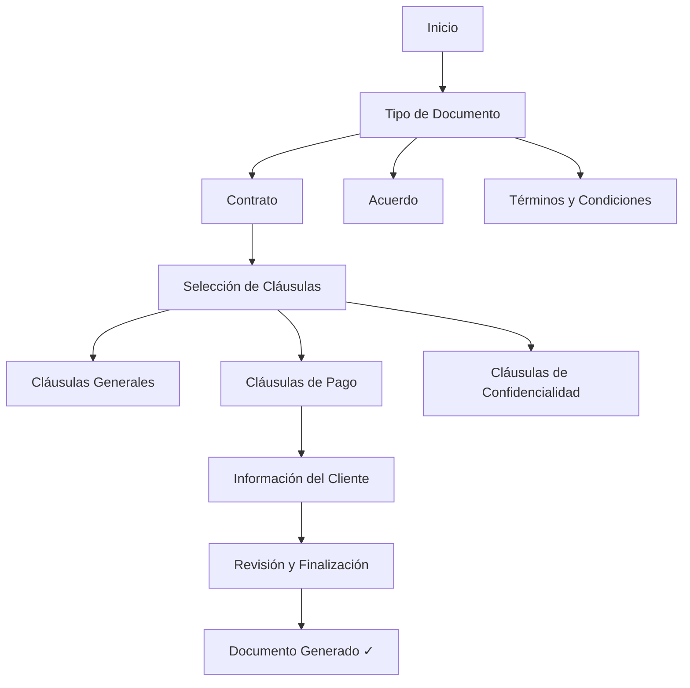

<Update title="Guía actualizada" date="7 de abril de 2026" />

Los chatbots están cambiando rápidamente. Ya no son solo para conversaciones básicas o alertas simples. Hoy en día, estas herramientas inteligentes ayudan a muchas empresas diferentes de formas nuevas e innovadoras.

En esta guía, verás cómo los chatbots resuelven problemas del mundo real. Te mostraremos por qué son tan útiles y aprenderás a construir tu propio chatbot desde cero, sin conocimientos de programación.

<Callout type="info">
**TL;DR:** Ha llegado el momento de los chatbots personalizados. Los chatbots que responden de forma genérica ya no impulsan el crecimiento real. Para que un bot realmente genere resultados, debe hablar el "lenguaje comercial" único de tu industria. Esta guía te muestra exactamente cómo lograrlo.
</Callout>

## El Versátil Mundo de los Chatbots

Los chatbots han evolucionado hasta convertirse en herramientas versátiles con aplicaciones reales en múltiples industrias. Su impacto transformador demuestra su capacidad para optimizar procesos, brindar asistencia personalizada y mejorar la experiencia general del usuario.

### Caso de Uso 1: Asistente Nacional de Salud NHS Reino Unido

En el sector salud, cada segundo es vital. La velocidad salva vidas. Así es como un chatbot ayuda a los pacientes.

#### ¿Para quién es?

Esta herramienta está diseñada para cualquier persona que necesite consejos médicos o quiera agendar una cita médica.

#### Cómo funciona

El NHS utiliza una herramienta llamada 'Ask A&E' que funciona como un asistente médico digital. Puedes hablar con ella o enviarle un mensaje de texto. Pregunta sobre tus síntomas y ofrece consejos rápidos.

#### Lo que puede hacer

- Encontrar clínicas cercanas.
- Reservar tu próxima visita médica.
- Recordarte tomar tus medicamentos.
- Ofrecer consejos de salud mental.
- Ayudar con reclamaciones de seguros médicos.

#### Por qué es especial

El bot se conecta a tus archivos médicos. Esto ayuda a los doctores a ver tu historial rápidamente y tomar las decisiones correctas para tu cuidado.

#### Ejemplo real: El NHS

El NHS es el servicio de salud principal del Reino Unido. Utilizan un chatbot llamado "Ask A&E" que facilita las cosas a los pacientes. Ayuda a las personas a reservar visitas y ofrece consejos claros sobre atención de emergencia, eliminando el estrés de buscar ayuda.

El Reino Unido está invirtiendo fuertemente en tecnología para el sector salud. Reportes recientes indican que destinaron más de 50 millones de libras para inteligencia artificial, demostrando su compromiso con la tecnología para mejorar la calidad de vida de las personas.

<Callout type="tip">
**Para tu negocio:** Si trabajas en el sector salud, puedes crear un chatbot similar con E-SMART360 que gestione citas, envíe recordatorios de medicamentos y responda preguntas frecuentes de pacientes, todo desde WhatsApp.
</Callout>

### Caso de Uso 2: Chatbot de Nutrición Nestlé

#### ¿Para quién es?

Este bot es para cualquier persona que quiera comer mejor. Es perfecto para quienes necesitan ideas de recetas o consejos de salud.

#### Cómo funciona

Nestlé creó un chatbot llamado Ella. Puedes hablar con Ella o enviarle un mensaje de texto. Cuéntale qué te gusta comer y qué quieres evitar. Ella te dará un plan de comidas que se adapte a tu vida, ayudándote a elegir alimentos saludables y planificar tus menús.

#### Por qué es inteligente

Ella usa inteligencia artificial para aprender sobre ti. Cuanto más hablas con ella, mejores son sus recomendaciones. También te envía consejos rápidos para ayudarte a mantenerte en el camino correcto con tu dieta.

#### Uso en el mundo real

Nestlé utiliza Ella para ayudar a sus clientes a mantenerse saludables. Es un gran ejemplo de cómo una gran empresa usa la tecnología para brindar asesoramiento experto desde casa.

## Cómo Construir tu Propio Chatbot con E-SMART360

En esta sección, te guiaremos a través del proceso completo de creación de un chatbot personalizado. Usaremos como ejemplo un **Generador de Documentos Legales** con E-SMART360.

### Primeros pasos: Elegir la plataforma adecuada

El primer paso para aprovechar el poder de tu chatbot es elegir el constructor adecuado para tu proyecto. E-SMART360 ofrece una plataforma completa que te permite:

- **Crear chatbots visualmente** con un constructor de flujos de arrastrar y soltar.
- **Conectar múltiples canales** como WhatsApp, Facebook Messenger, Instagram, Telegram y Web Chat desde un solo panel.
- **Integrar con cientos de aplicaciones** como WooCommerce, Shopify, Google Sheets, Zapier y más.
- **Entrenar con inteligencia artificial** para conversaciones naturales y contextuales.

### Planificación y diseño de conversaciones

Antes de comenzar a construir tu chatbot, es fundamental planificar cómo serán las interacciones. Todo chatbot exitoso comienza con un buen diseño conversacional.

<Callout type="info">
**Dato clave:** El 80% de los consumidores reportan tener experiencias positivas con chatbots cuando estos entienden el contexto y responden adecuadamente. La planificación previa marca la diferencia entre un chatbot útil y uno frustrante.
</Callout>

#### Define los objetivos y las metas del usuario

Antes de sumergirte en el proceso de creación, es esencial definir los objetivos. Pregúntate:

- ¿Qué problema va a resolver mi chatbot?
- ¿Quiénes son los usuarios que lo usarán?
- ¿Qué acciones quiero que los usuarios completen?
- ¿Cómo mediré el éxito del chatbot?

En nuestro caso del generador LegalBot, el objetivo es claro: crear un acuerdo legal personalizado de manera eficiente para ahorrar tiempo a los consultores legales y sus clientes.

#### Crea un diagrama de flujo de conversación

Para garantizar una interacción fluida, es recomendable crear un diagrama de flujo que describa las diversas etapas del proceso. Para el LegalBot, esto incluye:

### Creación paso a paso en el constructor visual

Veamos exactamente cómo funciona el constructor visual de E-SMART360 para crear el LegalBot.

### Caso de Uso 3 — Generador de Documentos Legales

Imaginemos a Lisa, una consultora legal que necesita crear acuerdos personalizados para sus clientes de forma rápida y eficiente.

#### Paso 1: Comenzar con el Constructor Visual

El primer paso es acceder al constructor de chatbots de E-SMART360. No necesitas saber programar. Todo se hace mediante un editor visual de arrastrar y soltar.

<Steps>
<Step title="Selecciona el tipo de chatbot">
Dentro del panel de control de E-SMART360, ve al gestor de bots y selecciona "Crear nuevo bot". Nombra tu bot (por ejemplo, "LegalBot").
</Step>
<Step title="Define los objetivos">
Antes de comenzar, define claramente los objetivos. En este caso: crear un acuerdo legal personalizado de manera eficiente.
</Step>
<Step title="Diseña el flujo de conversación">
Crea un diagrama de flujo que incluya las etapas del proceso:

- **Tipo de documento**
- **Selección de cláusulas**
- **Información del cliente**
- **Revisión y finalización**
</Step>
</Steps>

#### Ejemplo de conversación del LegalBot

**Usuario (Lisa):** Hola, LegalBot. Necesito crear un acuerdo legal personalizado para un cliente.

**LegalBot:** ¡Hola, Lisa! Puedo ayudarte con eso. Por favor, elige una de las siguientes opciones:

[Tipo de Documento] | [Selección de Cláusulas] | [Información del Cliente]

**Lisa:** [Hace clic en "Tipo de Documento"]

**LegalBot:** ¡Excelente! Comencemos seleccionando el tipo de documento legal que necesitas:

[Contrato] | [Acuerdo] | [Términos y Condiciones]

**Lisa:** [Hace clic en "Contrato"]

**LegalBot:** ¡Perfecto! Ahora seleccionemos las cláusulas específicas para tu contrato:

[Cláusulas Generales] | [Cláusulas de Pago] | [Cláusulas de Confidencialidad]

**Lisa:** [Hace clic en "Cláusulas de Pago"]

**LegalBot:** Aquí tienes algunas cláusulas relacionadas con pagos que puedes incluir:

[Términos de Pago] | [Penalizaciones por Pago Tardío] | [Métodos de Pago]

**Lisa:** [Hace clic en "Términos de Pago"]

**LegalBot:** Ahora, recopilemos información específica del cliente para personalizar el contrato:

[Nombre del Cliente] | [Dirección del Cliente] | [Información de Contacto]

**Lisa:** [Proporciona la información del cliente]

**LegalBot:** Gracias, Lisa. Tenemos toda la información. Revisemos el borrador de tu contrato personalizado:

[Muestra el borrador con las cláusulas seleccionadas y la información del cliente]

**Lisa:** ¡Todo se ve bien! Por favor, finaliza el contrato.

**LegalBot:** ¡Maravilloso! Tu contrato personalizado está listo. Puedes usar este formato con tu cliente.

<Callout type="success">
Así es como se ve el proceso de creación del bot generador de documentos legales dentro del constructor visual de flujos de E-SMART360, con su interfaz de arrastrar y soltar que facilita la creación sin necesidad de código.
</Callout>

#### Paso 2: Configurar mensajes de seguimiento automático

Una vez que el chatbot interactúa con los usuarios, puedes configurar **secuencias de seguimiento automático** para mantener el compromiso. Por ejemplo, si un cliente potencial interactúa con LegalBot pero no completa la solicitud, el sistema puede enviar recordatorios programados.

<Steps>
<Step title="Crea una secuencia de seguimiento">
Dentro del constructor de flujos, selecciona "Nueva Secuencia". Nombra la secuencia, por ejemplo, "Seguimiento LegalBot".
</Step>
<Step title="Define el disparador">
Configura la secuencia para que se active cuando un usuario interactúe con opciones clave como "Tipo de Documento" pero no complete el proceso.
</Step>
<Step title="Programa los mensajes">
Establece intervalos de tiempo entre mensajes. Por ejemplo, envía un primer recordatorio a los 30 minutos, un segundo a las 24 horas y un tercero a los 3 días.
</Step>
<Step title="Agrega contenido de valor">
Cada mensaje de la secuencia debe aportar valor: un dato útil, un enlace a una guía legal o un recordatorio amable de los beneficios del servicio.
</Step>
</Steps>

### Configuración avanzada: Condiciones para seguimiento

Una de las funcionalidades más potentes es la capacidad de configurar condiciones en el seguimiento. Puedes hacer que el chatbot actúe de manera diferente según si el usuario completó o no una acción específica.

**Ejemplo con LegalBot:**

1. Cuando un usuario hace clic en "Comprar Servicio", se le asigna una etiqueta llamada "Interesado en Servicio".
2. Si el usuario NO hace clic en el botón, no recibe esta etiqueta.
3. La secuencia de seguimiento verifica: ¿El usuario tiene la etiqueta "Interesado en Servicio"?
4. **Si es Falso**: Envía un mensaje de seguimiento con un recordatorio y el botón de compra nuevamente.
5. **Si es Verdadero**: No envía seguimiento porque el usuario ya completó la acción.

Este sistema inteligente asegura que solo recibas seguimiento aquellos usuarios que realmente lo necesitan, evitando mensajes molestos a quienes ya convirtieron.

<Callout type="warning">
**Importante sobre los límites de WhatsApp:** WhatsApp permite enviar mensajes de seguimiento ilimitados dentro de la ventana de 24 horas desde la última interacción del usuario. Después de 24 horas, solo se pueden enviar mensajes que utilicen plantillas de mensaje previamente aprobadas por Meta. Planifica tus secuencias teniendo en cuenta esta restricción.
</Callout>

### Exportación de flujos de chatbot

E-SMART360 te permite exportar tus flujos de chatbot completos para compartirlos con otros usuarios o hacer copias de seguridad. Esto es especialmente útil si:

- Trabajas en equipo y necesitas compartir el diseño del chatbot.
- Quieres reutilizar un flujo exitoso en otro proyecto.
- Necesitas documentar el flujo conversacional para tu empresa.

Para exportar un flujo, simplemente ve a la sección de flujos en el panel de control, selecciona el bot deseado y haz clic en la opción "Exportar". El sistema generará un archivo que podrás importar en cualquier otra cuenta de E-SMART360.

### El poder de las secuencias de mensajes

Una secuencia de mensajes es una serie automatizada de respuestas del chatbot que se activan según acciones del usuario o eventos predefinidos. Ayuda a las empresas a mejorar el compromiso del cliente, automatizar tareas de marketing y nutrir leads de manera efectiva.

#### ¿Qué es exactamente una secuencia de mensajes?

Una secuencia de mensajes es un conjunto preconfigurado de mensajes automatizados que se envían a los suscriptores según disparadores y horarios predefinidos. Estos mensajes ayudan a mantener el compromiso, nutrir leads y automatizar respuestas de manera eficiente. Puedes pensar en ellas como campañas de email marketing, pero en WhatsApp y en tiempo real.

#### Tipos de secuencias según su objetivo

- **Secuencias de bienvenida**: Atrae a nuevos suscriptores con saludos personalizados. Cuando alguien interactúa por primera vez con tu chatbot, recibe una secuencia cálida de bienvenida que lo introduce a tu negocio.
- **Secuencias de soporte al cliente**: Automatiza respuestas a consultas comunes. Resuelve problemas frecuentes sin intervención humana.
- **Secuencias de nutrición de leads**: Educa a los clientes potenciales sobre productos o servicios con información valiosa a lo largo del tiempo.
- **Secuencias de ventas**: Guía a los clientes potenciales a través del embudo de ventas, desde el interés inicial hasta la compra.
- **Secuencias de incorporación (onboarding)**: Ayuda a los nuevos usuarios a comenzar con tu producto o servicio, paso a paso.
- **Secuencias promocionales**: Anuncia nuevos productos, descuentos o eventos especiales de forma programada.
- **Secuencias educativas**: Proporciona contenido valioso a los suscriptores, como consejos, tutoriales o guías.

#### Beneficios comprobados de usar secuencias de mensajes

1. **Experiencia del cliente mejorada**: Las respuestas automatizadas garantizan un compromiso instantáneo. Los clientes nunca esperan.
2. **Mayor eficiencia operativa**: Reduce la carga de trabajo manual al automatizar tareas repetitivas como responder preguntas frecuentes o enviar recordatorios.
3. **Mejores tasas de conversión**: Nutrir leads con secuencias estratégicas puede aumentar las conversiones hasta en un 40%, según estudios de la industria.
4. **Compromiso mejorado**: Mantén a los usuarios interesados con seguimientos oportunos y contenido relevante.
5. **Optimización basada en datos**: Realiza un seguimiento del rendimiento de cada mensaje y refina las secuencias según las analíticas.

#### Requisitos técnicos para secuencias en WhatsApp

Para implementar secuencias de mensajes en WhatsApp necesitas:

1. Una cuenta activa en E-SMART360.
2. Una configuración verificada de WhatsApp Business API.
3. Plantillas de mensaje aprobadas por Meta para mensajes fuera de la ventana de 24 horas.

<Callout type="tip">
**Consejo clave:** WhatsApp permite enviar mensajes de seguimiento ilimitados dentro de la ventana de 24 horas desde la última interacción del usuario. Aprovecha al máximo esta ventana para interactuar de forma natural y conversacional con tus clientes sin necesidad de usar plantillas aprobadas.
</Callout>

## Integración con Plataformas

Para maximizar el alcance de tu chatbot, E-SMART360 ofrece integraciones nativas con las plataformas más populares. Esto te permite centralizar todas tus comunicaciones y automatizaciones desde un solo panel de control.

### Canales de Mensajería Soportados

<Columns cols="2">
<Card title="WhatsApp Business API">
Transforma tu negocio de comercio electrónico con la automatización de WhatsApp: aumenta las ventas, interactúa con clientes y optimiza campañas de marketing usando la API oficial de Meta.

**Capacidades:**
- Mensajes de marketing y notificaciones
- Catálogo de productos integrado
- Pagos directamente en el chat
- Plantillas de mensaje aprobadas
- Chat en vivo con bandeja compartida
</Card>
<Card title="Facebook Messenger">
Aprovecha las funciones avanzadas para bots de Facebook Messenger: conecta, recopila datos e interactúa con respuestas de IA y flujos condicionales.

**Capacidades:**
- Respuestas automáticas en la página
- Generación de leads desde anuncios
- Seguimiento de conversaciones
- Integración con el equipo de ventas
</Card>
</Columns>

<Columns cols="2">
<Card title="Instagram DM">
Obtén el bot de Instagram DM de E-SMART360: responde instantáneamente, genera leads y automatiza la gestión del embudo de ventas para una interacción fluida con los clientes.

**Capacidades:**
- Respuestas automáticas a mensajes directos
- Gestión de consultas de productos
- Seguimiento de leads desde Instagram
- Programación de respuestas
</Card>
<Card title="Telegram">
Mejora tu experiencia en Telegram: chatbot de E-SMART360 para crear bots fácilmente y gestionar grupos avanzados.

**Capacidades:**
- Creación de bots desde cero
- Gestión avanzada de grupos
- Broadcast a suscriptores
- Comandos personalizados
</Card>
</Columns>

<Card title="Web Chat">
Eleva la interacción de tu sitio web: solución de chat web para soporte instantáneo y compromiso en tiempo real. Integra el chatbot directamente en tu página web con solo copiar y pegar un código.

**Capacidades:**
- Widget personalizable con los colores de tu marca
- Captura de leads antes de que abandonen el sitio
- Respuestas automáticas basadas en el comportamiento del usuario
- Transferencia a agente humano cuando sea necesario
</Card>

### Integración Web y Comercio Electrónico

E-SMART360 se conecta con las plataformas de comercio electrónico más populares para automatizar todo tu flujo de ventas.

<Columns cols="2">
<Card title="Integración con WooCommerce">
Mejora las operaciones integrando WooCommerce para una gestión fluida de pedidos y pagos.

- Notificaciones automáticas de nuevos pedidos
- Confirmaciones de pago en tiempo real
- Envío de facturas por WhatsApp
- Recordatorios de carrito abandonado
- Actualizaciones de estado de envío
</Card>
<Card title="Integración con Shopify">
Integra Shopify con E-SMART360 para notificaciones de pedidos mejoradas y satisfacción del cliente.

- Alertas de nuevos pedidos
- Notificaciones de cumplimiento
- Respuestas automatizadas a consultas de productos
- Seguimiento post-venta
- Gestión de devoluciones
</Card>
</Columns>

### Integraciones con Herramientas de Productividad

<Columns cols="2">
<Card title="Google Sheets">
Automatiza el envío de mensajes de WhatsApp directamente desde datos de Google Sheets, agilizando la comunicación con leads y simplificando las operaciones comerciales. Ideal para:
- Campañas de marketing basadas en datos
- Notificaciones personalizadas con variables
- Sincronización de contactos
</Card>
<Card title="Zapier / Webhooks">
Conecta E-SMART360 con más de 3000 aplicaciones a través de Zapier o mediante webhooks personalizados. Puedes:
- Enviar datos recopilados a tu CRM
- Disparar acciones en otras apps cuando alguien escribe
- Crear flujos de trabajo complejos sin programación
</Card>
</Columns>

<Columns cols="2">
<Card title="Formularios (WPForms, Google Forms, Elementor)">
Conecta formularios de WordPress y Google para recopilar datos y enviar mensajes automáticos a través del chatbot de WhatsApp. Perfecto para:
- Confirmaciones de envío de formularios
- Agradecimientos automáticos
- Seguimiento de leads capturados
</Card>
<Card title="Pasarelas de Pago">
E-SMART360 es compatible con más de 20 métodos de pago populares, incluyendo PayPal, Stripe, Razor Pay y WhatsApp Pay. Los clientes pueden pagar directamente dentro de la conversación del chatbot.
</Card>
</Columns>

### Integraciones API

Para desarrolladores y negocios con necesidades específicas, E-SMART360 ofrece:

- **API HTTP externa**: Permite la comunicación entre el chatbot y aplicaciones de terceros a través del protocolo HTTP, lo que posibilita el intercambio de datos y el acceso a funcionalidades mediante endpoints definidos.
- **Webhook Workflow**: Transforma la comunicación empresarial en WhatsApp para lograr una interacción fluida con los clientes y la excelencia operativa.
- **API Endpoints nativos**: Permite a los desarrolladores acceder a las API nativas de E-SMART360 para integrar la plataforma con otras aplicaciones.

<Callout type="info">
**¿Sabías que...?** El asistente de IA de E-SMART360 puede entrenarse con archivos, URLs, preguntas frecuentes y hojas de Google para responder preguntas de forma inteligente y contextual. Esto significa que tu chatbot no solo sigue flujos predefinidos, sino que puede entender preguntas abiertas y responder con conocimiento real de tu negocio.
</Callout>

## Beneficios de Usar un Chatbot para tu Negocio

Los chatbots ofrecen beneficios medibles para empresas de todos los tamaños. Estos son los principales:

<Columns cols="2">
<Card title="✅ Atención 24/7">
Tu chatbot nunca duerme. Atiende a tus clientes a cualquier hora del día, los 365 días del año, sin importar festivos ni fines de semana. Los clientes pueden hacer preguntas a la 1 de la madrugada y recibir respuestas inmediatas.
</Card>
<Card title="⚡ Respuestas Instantáneas">
Los clientes reciben respuestas en milisegundos, no en minutos u horas. Esto mejora drásticamente la satisfacción del cliente. En la era de la inmediatez, la velocidad de respuesta es un diferenciador competitivo clave.
</Card>
<Card title="📊 Escalabilidad sin Límites">
Un chatbot puede atender a miles de clientes simultáneamente sin necesidad de contratar más personal. Escala tu negocio sin escalar costos operativos. Mientras un humano puede atender una conversación a la vez, un chatbot puede gestionar miles.
</Card>
<Card title="💰 Reducción de Costos">
Automatiza tareas repetitivas como responder preguntas frecuentes, agendar citas y procesar solicitudes simples, liberando a tu equipo para tareas de mayor valor. Las empresas reportan ahorros de hasta un 30% en costos de atención al cliente.
</Card>
</Columns>

### Más allá de la automatización: valor estratégico

Los chatbots no solo reducen costos, también generan ingresos:

- **Captura de leads 24/7**: Mientras tu equipo duerme, el chatbot sigue calificando leads y agendando citas.
- **Ventas por conversación**: Guía a los clientes a través del embudo de ventas con recomendaciones personalizadas.
- **Retención de clientes**: El seguimiento automático y las secuencias de nutrición aumentan la lealtad del cliente.
- **Recuperación de carritos abandonados**: Envía recordatorios automáticos a quienes abandonaron su compra.
- **Cross-selling y upselling**: Recomienda productos complementarios basados en las preferencias del usuario.

## Cómo Construir Chatbots de Seguimiento Automático en WhatsApp

Una de las aplicaciones más poderosas de los chatbots es el **seguimiento automático**. Este tipo de chatbot envía mensajes de recordatorio a usuarios que han interactuado con tu bot pero no han completado una acción deseada, como realizar una compra o registrarse.

### ¿Qué es un chatbot de seguimiento?

Un chatbot de seguimiento es un sistema automatizado que envía mensajes de recordatorio a usuarios que han interactuado con tu chatbot pero no han completado una acción deseada. Ayuda a las empresas a mantenerse comprometidas con clientes potenciales y mejora las tasas de conversión.

### ¿Por qué usar un sistema de seguimiento automatizado?

- **Ahorra tiempo** al automatizar los recordatorios manuales.
- **Aumenta las ventas y conversiones**, especialmente en productos de consideración.
- **Asegura que los usuarios no olviden tu oferta**.
- **Funciona 24/7** sin esfuerzo manual.

### Cómo construir tu chatbot de seguimiento

#### Paso 1: Crear el flujo del chatbot

1. Accede al panel de control de E-SMART360 > Gestor de Bots > Respuesta de Bot > Crear.
2. Nombra el chatbot de forma reconocible, por ejemplo "Bot de Seguimiento".
3. Guarda el chatbot y asegúrate de que se active cuando un usuario interactúe con un mensaje relacionado con un producto.

#### Paso 2: Configurar mensajes interactivos

Agrega un bloque interactivo a tu chatbot con un mensaje como:

> "¡Hola! ¿Te interesaría nuestro producto?"

Con botones de "Sí" y "No".

- Si el usuario selecciona **Sí**, proporciónale un enlace de pago o más información.
- Si el usuario selecciona **No**, finaliza la conversación u ofrece asistencia alternativa.

#### Paso 3: Aplicar etiquetas para rastrear acciones

1. Cuando un usuario hace clic en el botón de compra, aplícale una etiqueta como "Comprador".
2. Si el usuario no hace clic en el botón, no recibe esta etiqueta.
3. Usa esta etiqueta para determinar quién necesita un recordatorio de seguimiento.

#### Paso 4: Configurar la secuencia de seguimiento

1. Arrastra y suelta el conector desde la opción del botón de compra hacia "Suscribir a Secuencia".
2. Crea una nueva secuencia que enviará un mensaje de recordatorio si el usuario no compra dentro de un período específico (por ejemplo, 30 minutos).
3. Agrega una condición que verifique si el usuario seleccionó el botón de compra o no.
4. Si la condición es **falsa** (no compró), envía el mensaje de seguimiento.
5. Puedes incluir nuevamente el botón de compra en el mensaje de seguimiento.
6. Repite el proceso para enviar múltiples recordatorios si es necesario.

#### Paso 5: Programar mensajes para máximo impacto

- WhatsApp permite enviar mensajes de seguimiento ilimitados dentro de la ventana de 24 horas.
- Después de 24 horas, solo se pueden enviar mensajes con plantillas aprobadas.
- Programa tus recordatorios estratégicamente para evitar saturar a los usuarios.

### Exportación de flujos de chatbot

E-SMART360 te permite exportar el flujo completo de tu chatbot para compartirlo con otros o hacer copias de seguridad. Esto es útil para:
- Compartir diseños exitosos con tu equipo.
- Reutilizar patrones de conversación en múltiples proyectos.
- Documentar flujos para auditorías internas.

<Callout type="success">
Ahora ya sabes cómo construir un chatbot de seguimiento automatizado para WhatsApp. Este sistema asegura que los clientes potenciales recuerden su interés en tu producto, aumentando la probabilidad de venta. Implementa estos pasos y refina la secuencia según el comportamiento de los usuarios.
</Callout>

## Testing y Refinamiento

Antes de lanzar tu bot a los clientes, realiza pruebas exhaustivas para garantizar interacciones fluidas y una generación precisa de documentos.

<Steps>
<Step title="Prueba con casos reales">
Simula diferentes escenarios de conversación para asegurarte de que el bot responde correctamente en cada situación. Crea una lista de al menos 10 preguntas o situaciones que los clientes podrían tener y verifica que el chatbot responda adecuadamente a cada una.
</Step>
<Step title="Verifica los flujos condicionales">
Revisa que las ramificaciones del chatbot funcionen exactamente como esperas. Prueba todas las combinaciones posibles de botones y respuestas para asegurarte de que no hay caminos rotos o bucles infinitos.
</Step>
<Step title="Recibe feedback">
Comparte el bot con colegas o un grupo de prueba reducido antes del lanzamiento oficial. Pídeles que intenten "romper" el chatbot haciendo preguntas inesperadas o siguiendo rutas poco comunes.
</Step>
<Step title="Monitorea y mejora">
Una vez lanzado, utiliza las analíticas integradas de E-SMART360 para identificar dónde los usuarios se quedan atascados o abandonan la conversación. Optimiza esos puntos específicos. Revisa los informes semanalmente durante el primer mes.
</Step>
</Steps>

### Indicadores clave de rendimiento (KPIs) para tu chatbot

Para medir el éxito de tu chatbot, monitorea estas métricas:

- **Tasa de finalización de conversación**: ¿Cuántos usuarios completan el flujo deseado?
- **Tasa de abandono**: ¿En qué punto se van los usuarios?
- **Tasa de transferencia a humano**: ¿Cuántas conversaciones requieren intervención humana?
- **Tiempo promedio de resolución**: ¿Qué tan rápido resuelve el chatbot las consultas?
- **Satisfacción del usuario**: Utiliza encuestas rápidas al final de las interacciones.

<Callout type="warning">
**Error común:** Muchos negocios lanzan su chatbot y nunca lo revisan nuevamente. Un chatbot no es un proyecto de una sola vez. Requiere mantenimiento continuo, actualización de contenido y optimización basada en datos reales de conversación.
</Callout>

## El Futuro de los Chatbots: Posibilidades Ilimitadas

El panorama de los chatbots en 2026 es más prometedor que nunca. La inteligencia artificial generativa ha llevado la capacidad de los chatbots a un nivel completamente nuevo, permitiendo conversaciones más naturales, contextuales y útiles.

### Estadísticas que Respaldan el Crecimiento

Según un estudio realizado por la plataforma de marketing de ubicación Uberall, se revelaron estadísticas interesantes sobre la percepción de los chatbots por parte de los consumidores:

<Columns cols="2">
<Card title="80%" tone="success">
**de los consumidores** reportaron haber tenido experiencias positivas con chatbots.
</Card>
<Card title="40%" tone="info">
**expresaron interés** en experiencias con chatbots de parte de sus marcas favoritas.
</Card>
</Columns>

El **38%** de los consumidores cree que las marcas deberían utilizar chatbots para ofrecer ofertas, cupones y promociones, y el **65%** de los usuarios prefiere enviar un mensaje a llamar por teléfono para consultas sencillas.

### Tendencias para 2026 y Más Allá

1. **IA Generativa en chatbots**: Los chatbots con IA generativa pueden mantener conversaciones naturales, entender contexto y matices, y generar respuestas coherentes sin necesidad de flujos predefinidos para cada posible pregunta.

2. **Chatbots omnicanal**: Los clientes esperan una experiencia unificada sin importar si están en WhatsApp, Facebook, Instagram o el sitio web. E-SMART360 ya ofrece esta capacidad desde un solo panel.

3. **Pagos dentro del chat**: Cada vez más negocios procesan pagos directamente dentro de la conversación con el chatbot, eliminando la fricción de redirigir al cliente a una página externa.

4. **Hiperpersonalización**: Los chatbots usarán el historial de conversaciones, preferencias y datos de comportamiento para ofrecer experiencias verdaderamente personalizadas.

5. **Automatización predictiva**: Los chatbots anticiparán las necesidades del cliente basándose en patrones de comportamiento y ofrecerán soluciones antes de que el cliente las solicite.

## Casos de Uso de Chatbots por Industria en 2026

Los chatbots están transformando industrias enteras. A continuación, exploramos casos de uso específicos para diferentes sectores en 2026.

### Salud y Bienestar
- **Qué automatizar**: Agenda de citas, recordatorios de medicamentos, preguntas frecuentes sobre síntomas, clasificación de pacientes.
- **Ejemplo**: El NHS "Ask A&E" para clasificación de pacientes.
- **Valor añadido**: Reduce la carga del personal médico y mejora la experiencia del paciente.
- **Tendencias 2026**: Chatbots con IA capaces de realizar triage médico básico, recordatorios de medicación personalizados y seguimiento de pacientes crónicos.

### Comercio Electrónico y Retail
- **Qué automatizar**: Notificaciones de pedidos, seguimiento de envíos, recomendaciones de productos, carritos abandonados.
- **Ejemplo**: Chatbots que muestran catálogos de productos y procesan pedidos completos dentro de la conversación.
- **Valor añadido**: Aumenta las ventas con recomendaciones personalizadas 24/7 y reduce el abandono de carrito.
- **Tendencias 2026**: Integración con pasarelas de pago nativas, recomendaciones basadas en IA y ventas conversacionales completas.

### Servicios Legales
- **Qué automatizar**: Generación de documentos, consultas iniciales, seguimiento de casos, recordatorios de plazos.
- **Ejemplo**: El generador de documentos legales "LegalBot" que crea contratos en minutos.
- **Valor añadido**: Reduce horas facturables en tareas repetitivas, permitiendo a los abogados centrarse en trabajo de alto valor.

### Educación
- **Qué automatizar**: Inscripciones, recordatorios de clases, preguntas frecuentes, entrega de materiales.
- **Valor añadido**: Mejora la retención de estudiantes con comunicación constante y personalizada.
- **Ejemplo**: Universidades que usan chatbots para gestionar consultas de admisión de miles de solicitantes.

### Bienes Raíces
- **Qué automatizar**: Programación de visitas, consultas sobre propiedades, seguimiento de leads, cálculos de hipoteca.
- **Valor añadido**: Captura leads calificados las 24 horas sin intervención humana. Los agentes solo intervienen cuando el lead está calificado.
- **Ejemplo**: Un chatbot que muestra propiedades por rango de precio, programa visitas y envía seguimientos automáticos.

### Restaurantes y Alimentos
- **Qué automatizar**: Reservas, pedidos para llevar, consultas sobre menú, programas de fidelidad.
- **Valor añadido**: Aumenta los pedidos directos sin comisiones de apps de terceros (UberEats, Rappi, etc.).
- **Ejemplo**: Una pizzería que recibe pedidos completos por WhatsApp, desde la selección de ingredientes hasta el pago.

### Agencias de Marketing
- **Qué automatizar**: Captura de leads, calificación de prospectos, informes de rendimiento, comunicación con clientes.
- **Valor añadido**: Automatiza la comunicación con docenas de clientes simultáneamente.
- **Ejemplo**: Una agencia que usa chatbots para reportar métricas semanales a cada cliente automáticamente.

### Hotelería y Turismo
- **Qué automatizar**: Reservas de habitaciones, check-in/check-out, recomendaciones locales, servicio a la habitación.
- **Valor añadido**: Mejora la experiencia del huésped con respuestas instantáneas y personalizadas.
- **Ejemplo**: Un hotel que permite hacer check-in, pedir servicio a la habitación y reservar el spa desde WhatsApp.

<Callout type="warning">
**Importante:** Para crear un chatbot exitoso, comienza identificando los casos de uso relevantes para tu industria específica. Adapta las ideas a funcionalidades prácticas y asegúrate de que el flujo conversacional, el diseño y el contenido estén alineados con tus objetivos comerciales. No intentes automatizar todo de golpe: comienza con un caso de uso específico y ve expandiendo.
</Callout>

## Cómo Configurar una Campaña de Secuencia de Mensajes

Las secuencias de mensajes automatizadas son una de las herramientas más poderosas para mantener el compromiso con tus clientes. Aquí te mostramos cómo configurarlas paso a paso:

<Steps>
<Step title="Accede al constructor de flujos">
Desde el panel de control de E-SMART360, navega a la sección de bots. Dentro de las opciones de cada bot, busca "Secuencias" y selecciona "Nueva Secuencia".
</Step>
<Step title="Configura el nombre y la temporización">
Nombra tu secuencia de forma descriptiva (ej. "Bienvenida Clientes", "Seguimiento Post-Venta"). Configura los intervalos de tiempo entre cada mensaje de la secuencia.
</Step>
<Step title="Estructura tus mensajes">
Cada mensaje puede incluir texto, imágenes o botones de llamado a la acción. Diseña cada paso pensando en el valor que aporta al usuario en ese momento específico del recorrido.
</Step>
<Step title="Activa la secuencia">
Una vez que hayas configurado todos los pasos, activa la secuencia. El sistema comenzará a enviar los mensajes automáticamente según la programación definida.
</Step>
<Step title="Monitorea el rendimiento">
Utiliza las analíticas integradas para hacer seguimiento de métricas como tasas de apertura, clics en botones y conversiones. Ajusta la secuencia según los resultados.
</Step>
</Steps>

### Mejores prácticas para secuencias de mensajes

- Mantén los mensajes **concisos y relevantes**. Nadie quiere leer párrafos largos en una conversación de chat.
- **Personaliza las interacciones** usando los datos del usuario (nombre, preferencias, historial).
- **Programa los mensajes estratégicamente** para mantener el compromiso sin ser intrusivo.
- **Usa plantillas de mensaje aprobadas** por WhatsApp para comunicaciones fuera de la ventana de 24 horas.
- **Analiza y refina continuamente** las secuencias basándote en los datos de rendimiento.

### Ejemplo práctico: Secuencia de bienvenida para una tienda de ropa

1. **Mensaje 1 (inmediato)**: "¡Hola [Nombre]! Bienvenido a [Tienda] 🎉 Estamos encantados de tenerte aquí. ¿Te gustaría ver nuestras novedades de esta semana?"
2. **Mensaje 2 (24 horas)**: "Hola [Nombre], ¿sabías que tenemos un 15% de descuento en tu primera compra? Usa el código BIENVENIDO15 🛍️"
3. **Mensaje 3 (3 días)**: "¡Últimos días! Tu descuento del 15% sigue disponible. Tenemos envío gratis en pedidos superiores a $50. ¿Necesitas ayuda para elegir tu talla?"
4. **Mensaje 4 (7 días)**: "Queremos conocerte mejor. ¿Qué tipo de ropa prefieres? [Casual] [Formal] [Deportiva]"

<Callout type="info">
**¿Sabías que...?** Las secuencias de mensajes bien diseñadas pueden aumentar las tasas de conversión hasta en un 40%. La clave está en segmentar correctamente a tu audiencia y ofrecer contenido relevante en cada etapa del recorrido del cliente.
</Callout>

## Cómo Entrenar tu Chatbot con IA

Una de las funcionalidades más potentes de E-SMART360 es la capacidad de entrenar a tu chatbot con inteligencia artificial para que entienda el contexto de las conversaciones y responda de forma natural.

<Tabs>
<Tab title="Entrenar con FAQ">
Puedes cargar una lista de preguntas frecuentes con sus respuestas. El chatbot aprenderá de este contenido y responderá automáticamente cuando los clientes hagan preguntas similares, incluso si no usan las palabras exactas.
</Tab>
<Tab title="Entrenar con URLs">
Proporciona la URL de tu sitio web, blog o documentación. El asistente IA leerá y procesará todo el contenido para responder preguntas basadas en esa información.
</Tab>
<Tab title="Entrenar con archivos">
Sube archivos PDF, Word o documentos de texto con información de tu negocio. La IA analizará estos archivos y utilizará el conocimiento para responder consultas de los clientes.
</Tab>
<Tab title="Entrenar con Google Sheets">
Conecta tu Google Sheets y el chatbot podrá acceder a datos actualizados como precios, inventario o información de contacto para responder con precisión.
</Tab>
</Tabs>

## Preguntas Frecuentes

<Expandable title="¿Qué industrias se benefician más de los chatbots?">
Los chatbots benefician a muchas industrias, incluyendo comercio minorista, salud, finanzas, educación, servicios legales, bienes raíces, restaurantes y atención al cliente. Cualquier negocio que maneje consultas recurrentes o procesos repetitivos puede obtener valor de un chatbot. En E-SMART360 hemos visto casos de éxito en más de 15 industrias diferentes.
</Expandable>

<Expandable title="¿Cuál es el beneficio de un constructor de chatbots sin código?">
Un constructor sin código permite a los dueños de negocio crear flujos de automatización complejos visualmente, sin necesidad de contratar desarrolladores. Esto reduce significativamente el costo y el tiempo de lanzamiento. Con E-SMART360, puedes tener tu primer chatbot funcionando en menos de una hora.
</Expandable>

<Expandable title="¿Cómo ayudan los chatbots en el sector salud y legal?">
En el sector salud, los chatbots gestionan la programación de citas, recordatorios para pacientes y preguntas frecuentes sobre síntomas o tratamientos. En el sector legal, pueden manejar preguntas iniciales de admisión, automatizar la recopilación de documentos y generar documentos legales estándar, como contratos y acuerdos.
</Expandable>

<Expandable title="¿Cuáles son los pasos básicos para construir un chatbot?">
Los pasos básicos incluyen: 1) Definir los objetivos del chatbot, 2) Seleccionar la plataforma adecuada, 3) Diseñar los flujos de conversación, 4) Integrar con los canales deseados (WhatsApp, web, etc.), 5) Realizar pruebas exhaustivas, y 6) Monitorear el rendimiento para realizar mejoras continuas.
</Expandable>

<Expandable title="¿Puedo personalizar el tiempo entre mensajes de una secuencia?">
Sí, E-SMART360 te permite configurar retrasos y horarios específicos para cada mensaje en una secuencia. Puedes definir intervalos desde minutos hasta días, asegurando que tus comunicaciones lleguen en el momento más oportuno para cada etapa del recorrido del cliente.
</Expandable>

<Expandable title="¿Necesito plantillas de mensaje aprobadas para las secuencias?">
Sí. Para mensajes enviados fuera de la ventana de 24 horas de conversación activa, WhatsApp requiere el uso de plantillas de mensaje previamente aprobadas. E-SMART360 te guía en el proceso de creación y envío de estas plantillas para su aprobación por Meta.
</Expandable>

<Expandable title="¿Qué tan seguro es usar chatbots para mi negocio?">
Los chatbots de E-SMART360 operan sobre la API oficial de WhatsApp Business (Cloud API), que cumple con los más altos estándares de seguridad y cifrado de extremo a extremo. Además, todos los datos se manejan conforme a las regulaciones de privacidad aplicables.
</Expandable>

## Ejemplos Prácticos Adicionales

<Columns cols="3">
<Card title="🏥 Clínica Dental">
Un chatbot para clínica dental que agenda citas, envía recordatorios 24 horas antes, responde preguntas sobre tratamientos y procedimientos, y recolecta información preliminar del paciente antes de su primera visita. Reduce las ausencias en un 30%.
</Card>
<Card title="🏢 Inmobiliaria">
Un chatbot inmobiliario que muestra propiedades disponibles según el presupuesto del cliente, programa visitas, responde preguntas sobre financiamiento y hace seguimiento automático a leads que no concretaron la compra en los primeros 7 días.
</Card>
<Card title="🍕 Restaurante">
Un chatbot para restaurante que permite hacer pedidos para llevar o delivery directamente desde WhatsApp, muestra el menú del día, confirma pedidos y envía promociones semanales a suscriptores. Aumenta los pedidos directos sin comisiones de apps externas.
</Card>
</Columns>

## Cómo Empezar: De la Inspiración a la Acción

Para crear un chatbot exitoso, sigue este proceso:

<Steps>
<Step title="Identifica casos de uso relevantes">
Analiza tu negocio y encuentra las áreas donde un chatbot puede aportar más valor. Pregunta a tu equipo de atención al cliente cuáles son las preguntas más repetitivas que reciben.
</Step>
<Step title="Elige el tipo de chatbot adecuado">
Decide si necesitas: un chatbot con flujos predefinidos (basado en botones), un chatbot con IA (que entiende lenguaje natural) o una combinación de ambos.
</Step>
<Step title="Personaliza el chatbot">
Ajusta el flujo conversacional, el diseño y el contenido para alinearlos con los objetivos de tu negocio. Usa el tono de voz de tu marca.
</Step>
<Step title="Agrega innovación">
Experimenta con nuevas funciones y tecnologías. Prueba la integración con IA, añade pagos en el chat o implementa secuencias de seguimiento avanzadas.
</Step>
<Step title="Mejora continua">
Un chatbot nunca está terminado. Revisa las conversaciones, identifica oportunidades de mejora y actualiza el contenido regularmente.
</Step>
</Steps>

## Tabla Comparativa de Tipos de Chatbot

| Tipo de Chatbot | Ideal para | Complejidad | Ejemplo |
|---|---|---|---|
| Basado en Botones | Flujos simples, menús | Baja | LegalBot: seleccionar tipo de documento |
| Basado en Palabras Clave | Preguntas frecuentes | Baja | Responder "horario" con el horario |
| Con IA Generativa | Conversaciones abiertas | Alta | Atención al cliente general |
| Híbrido (Botones + IA) | Lo mejor de ambos mundos | Media | Chatbot que ofrece menús pero entiende texto libre |
| Secuencia Automatizada | Campañas de marketing | Media | Secuencia de bienvenida de 5 mensajes |

## Programas Partner de E-SMART360

E-SMART360 ofrece programas de asociación para expandir tu negocio:

- **Programa de Revendedores**: Descubre un mundo de oportunidades con recursos exclusivos, herramientas y soporte diseñados para mejorar tu viaje de ventas. Ideal para agencias y consultores.
- **Programa de Afiliados**: Únete al programa de afiliados y gana comisiones recurrentes. Maximiza tu potencial de ingresos pasivos asociándote con E-SMART360.
- **Programa AI Startup**: En E-SMART360 creemos que el futuro de la automatización de chats está en las conversaciones impulsadas por IA. Ofrecemos tokens de IA gratuitos para nuestra comunidad de revendedores y usuarios premium.

## Conclusión

Los chatbots han evolucionado hasta convertirse en herramientas versátiles con aplicaciones reales que abarcan salud, nutrición, atención al cliente, servicios legales y muchas otras industrias. Su impacto transformador demuestra su capacidad para optimizar procesos, brindar asistencia personalizada y mejorar la experiencia general del usuario.

A medida que la tecnología continúa avanzando, los chatbots están llamados a desempeñar un papel cada vez más fundamental en la forma en que las empresas se comunican con sus clientes. Ya sea que trabajes en salud, comercio electrónico, servicios legales o cualquier otra industria, los chatbots tienen un rol que desempeñar para optimizar tus operaciones.

<Callout type="success">
**Comienza hoy:** Crea tu cuenta gratuita en E-SMART360 y experimenta el poder de la automatización inteligente. No necesitas conocimientos técnicos ni experiencia en programación. Solo necesitas la voluntad de transformar la forma en que te comunicas con tus clientes. Regístrate ahora y únete a la revolución de los chatbots.
</Callout>
