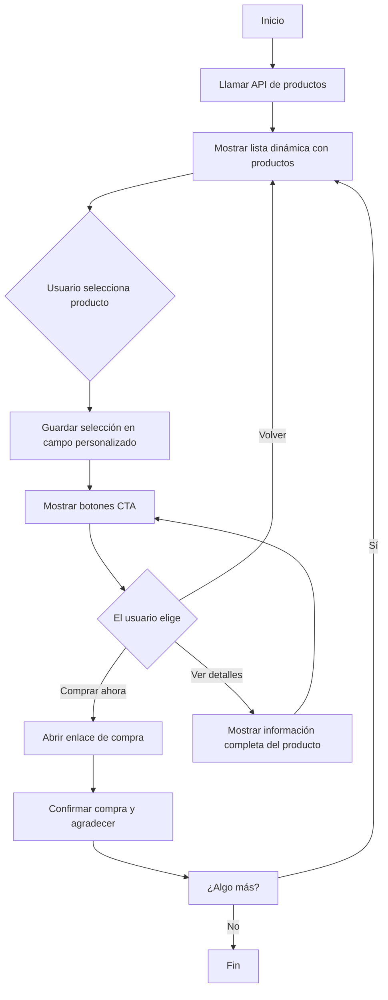

# Listas Dinámicas en Mensajes Interactivos de WhatsApp

Las listas dinámicas en E-SMART360 te permiten crear mensajes interactivos de WhatsApp que generan filas automáticamente usando datos almacenados en campos personalizados. Estas listas se basan en objetos JSON, donde cada fila (título, descripción y valores) se completa especificando las claves correspondientes (como `product_name`, `price` y otras).

Esta guía te llevará paso a paso por la configuración y uso de esta función, usando un catálogo de productos como ejemplo práctico.

<Callout type="info">
**¿Qué son las listas dinámicas?** Son filas en mensajes interactivos que se generan automáticamente a partir de datos JSON almacenados en un campo personalizado. Al especificar las claves adecuadas, puedes crear filas personalizadas sin definir cada una manualmente. El objeto JSON se guarda por cada suscriptor usando una llamada HTTP API dentro del flujo del bot.
</Callout>

---

## ¿Qué Son las Listas Dinámicas?

Las listas dinámicas son una funcionalidad avanzada dentro del **Flow Builder** de E-SMART360 que permite poblar mensajes interactivos de WhatsApp con información variable obtenida desde fuentes externas. En lugar de escribir manualmente cada opción que el usuario puede seleccionar, defines la estructura una vez y el sistema completa los datos automáticamente.

### Puntos Clave
- Una lista dinámica extrae datos de un objeto JSON almacenado en un campo personalizado.
- Cada fila se rellena con información como nombres de producto, precios o descripciones.
- Puedes usar una llamada HTTP API para obtener datos y almacenarlos en un campo personalizado.
- La selección del usuario se guarda en otro campo personalizado para usarla posteriormente en el flujo.

<Callout type="tip">
Las listas dinámicas hacen que los mensajes de WhatsApp sean más atractivos al obtener y mostrar contenido automáticamente. Son ideales para catálogos de productos, selección de citas, menús de servicios y cualquier escenario donde necesites mostrar opciones variables.
</Callout>

### Diferencia entre Listas Estáticas y Dinámicas

| Característica | Lista Estática | Lista Dinámica |
|---|---|---|
| Definición de filas | Manual, una por una | Automática desde datos JSON |
| Actualización de contenido | Requiere editar el flujo | Se actualiza al llamar la API |
| Escalabilidad | Limitada a lo que escribas | Ilimitada (sujeta al límite de 10 por mensaje de WhatsApp) |
| Personalización | Misma para todos los usuarios | Puede variar por usuario según datos externos |
| Mantenimiento | Alto (editar manualmente) | Bajo (solo mantener la API) |

---

## Limitaciones de los Mensajes con Listas Interactivas

Al mostrar filas dentro de mensajes interactivos de WhatsApp, existe una limitación impuesta por la plataforma:

<Callout type="warning">
**Límite de WhatsApp:** Solo se pueden incluir **10 productos o filas** en un solo mensaje interactivo. Si necesitas mostrar más de 10 filas, deberás enviar múltiples mensajes interactivos. Por ejemplo, el primer mensaje puede mostrar 10 filas y los mensajes siguientes el resto.
</Callout>

Además del límite de filas, ten en cuenta estas otras restricciones:

- **Caracteres en el título de cada fila:** Máximo 24 caracteres.
- **Caracteres en la descripción de cada fila:** Máximo 72 caracteres.
- **Caracteres en el botón del mensaje de lista:** Máximo 20 caracteres.
- **Caracteres en el encabezado del mensaje:** Máximo 60 caracteres.
- **Caracteres en el cuerpo del mensaje:** Máximo 1024 caracteres.

---

## Caso de Uso: Catálogo de Productos

Imagina que deseas enviar un catálogo de productos a un usuario. Tu respuesta de API podría verse así:

```json
[
  {
    "product_name": "Apple iPhone 15 Pro",
    "price": "$999",
    "description": "El Apple iPhone 15 Pro cuenta con un potente chip A17 Pro, sistema de cámara de 48MP y un elegante diseño de titanio para máximo rendimiento y durabilidad.",
    "buy_link": "https://www.apple.com/iphone-15-pro/"
  },
  {
    "product_name": "Samsung Galaxy S24 Ultra",
    "price": "$1,199",
    "description": "El Samsung Galaxy S24 Ultra ofrece una impresionante pantalla AMOLED de 6.8 pulgadas, una cámara de 200MP y rendimiento de vanguardia con el procesador Snapdragon más reciente.",
    "buy_link": "https://www.samsung.com/galaxy-s24-ultra/"
  },
  {
    "product_name": "Google Pixel 8 Pro",
    "price": "$899",
    "description": "El Google Pixel 8 Pro destaca por su cámara computacional, inteligencia artificial integrada y actualizaciones garantizadas por 7 años.",
    "buy_link": "https://store.google.com/product/pixel_8_pro"
  },
  {
    "product_name": "OnePlus 12",
    "price": "$799",
    "description": "El OnePlus 12 combina un procesador Snapdragon 8 Gen 3, carga ultrarrápida de 100W y una pantalla Fluid AMOLED de 120Hz.",
    "buy_link": "https://www.oneplus.com/oneplus-12"
  }
]
```

Usando esta función, cada producto genera dinámicamente una fila con su respectivo título, descripción y acción asociada.

---

## Guía Paso a Paso

### Prerrequisitos

Antes de comenzar, asegúrate de tener lo siguiente:

1. Una cuenta activa en E-SMART360 con acceso al Flow Builder.
2. Un endpoint API funcional que devuelva datos en formato JSON (puede ser tu propia API, WooCommerce, Shopify, etc.).
3. Un campo personalizado creado para almacenar los datos JSON (ej: `ProductCatalog`).
4. Un campo personalizado para guardar la selección del usuario (ej: `SelectedProduct`).

<Callout type="info">
**¿Cómo crear campos personalizados?** Ve a **Gestión de Suscriptores > Campos Personalizados** en el panel de control. Allí puedes crear nuevos campos de tipo "Texto" o "List Items" para almacenar la información que necesites.
</Callout>

### Paso 1: Obtener Datos Usando HTTP API

**1.1 Configura la solicitud API:**

1. Ve a **Integración HTTP API** en el panel de E-SMART360.
2. Haz clic en **Crear** para iniciar una nueva conexión API.
3. Completa los siguientes campos:
   - **Nombre de la API:** Proporciona un nombre reconocible (ej: "Catálogo de Productos").
   - **Método:** Selecciona el método HTTP (GET, POST, etc.).
   - **URL del Endpoint:** Ingresa la URL de la API externa (ej: `https://tu-tienda.com/api/productos`).
   - **ID de suscriptor de prueba:** Copia un ID de suscriptor desde el Gestor de Suscriptores. Esto ayuda con las pruebas y el paso dinámico de datos.
4. **Configurar cabeceras de la solicitud:**
   - `Content-Type`: Establécelo como `application/json` u otro tipo según las especificaciones de la API.
   - `Authorization`: Agrega las credenciales necesarias (ej: Bearer Token).
5. **Configurar cuerpo de la solicitud (opcional):** Agrega los campos requeridos para la solicitud API (ej: username, email). Elige entre valores estáticos o dinámicos según la entrada del usuario. Selecciona el formato: JSON, Form Data o X-WWW-FORM-URLENCODED según los requisitos de la API.
6. **Guardar y verificar conexión:** Haz clic en **Verificar Conexión** para enviar una solicitud de prueba. Si es exitosa, haz clic en **Guardar API** para finalizar la configuración.
7. **Mapear datos de respuesta de la API:** Mapea los campos de respuesta de la API a variables de E-SMART360. Por ejemplo, si la API devuelve un `product_id` o `price`, puedes mapearlo al perfil del suscriptor. También puedes guardar elementos de lista como JSON para usarlos en mensajes interactivos.

**1.2 Guarda la respuesta de la API en un campo personalizado:**

1. Asigna la respuesta de la API a un campo personalizado (por ejemplo, `ProductCatalog`).
2. El valor mapeado debe ser **List Items**.
3. La respuesta debe estar en formato JSON que contenga un arreglo de objetos.

<Callout type="info">
**Detalle técnico:** El campo personalizado almacena el arreglo JSON completo. Cada objeto dentro del arreglo representa una fila que se mostrará en el mensaje interactivo de WhatsApp. Puedes almacenar hasta 10 objetos por mensaje (límite de WhatsApp).
</Callout>

### Paso 2: Configurar Filas Dinámicas en el Flow Builder

Una vez que el campo personalizado está poblado con la respuesta de la API, configura las filas dinámicas en tu mensaje interactivo.

**2.1 Crear el mensaje interactivo:**

1. Abre el **Flow Builder** y agrega un nuevo bloque **Interactivo**.
2. Selecciona el tipo **Lista** como formato de mensaje.

**2.2 Configurar los elementos del mensaje:**

1. **Encabezado:** Escribe un título descriptivo (ej: "Nuestros productos destacados").
2. **Cuerpo del mensaje:** Redacta el texto principal explicando el contexto (ej: "Selecciona un producto para ver más detalles").
3. **Botón de lista:** Personaliza el texto del botón que abre la lista (ej: "Ver productos").
4. **Pie de página (opcional):** Agrega un texto adicional (ej: "Equipo de E-SMART360").

**2.3 Configurar las filas dinámicas:**

1. **Método de generación de filas:** Selecciona **Dinámico** para habilitar filas basadas en datos del campo personalizado.
2. **Campo personalizado para filas dinámicas:** Selecciona el campo personalizado que contiene los datos JSON (por ejemplo, `ProductCatalog`).
3. **Clave/Índice para el título de la fila dinámica:** Especifica la clave del objeto JSON que se usará como título de la fila.
   - Ejemplo: Usa `product_name` para mostrar dinámicamente valores como "Apple iPhone 15 Pro" o "Samsung Galaxy S24 Ultra".
4. **Formato de descripción de la fila:** Define la descripción usando múltiples claves del objeto JSON.
   - Formato: `#custom_field->key#`
   - Ejemplo: `#ProductCatalog->price# - #ProductCatalog->description#` mostrará:
   ```
   $999 - El Apple iPhone 15 Pro cuenta con un potente chip A17 Pro...
   ```
5. **Guardar selección en campo personalizado:** Elige un campo personalizado donde se almacenará la selección del usuario (por ejemplo, `SelectedProduct`).
6. **Clave/Índice para el valor guardado:** Especifica la clave del objeto JSON cuyo valor debe guardarse en el campo personalizado.
   - Ejemplo: Usa `buy_link` para guardar el enlace de compra del producto (ej: `https://www.apple.com/iphone-15-pro/`).

<Steps>
<Step title="Crear un nuevo bloque interactivo">
  En el Flow Builder, arrastra y suelta un nuevo bloque y selecciona "Interactive Block". Esto te permitirá crear un mensaje con elementos interactivos como botones o listas.
</Step>
<Step title="Personalizar los elementos del mensaje">
  Escribe una descripción para explicar el contexto. Puedes personalizar el cuerpo del mensaje con opciones de nombre y campo personalizado. También puedes agregar un pie de página (ej: "Equipo E-SMART360") y establecer un retardo de mensaje opcional para simular un tiempo de respuesta más natural.
</Step>
<Step title="Agregar el elemento de lista dinámica">
  Dentro del bloque interactivo, selecciona el tipo "Lista". Luego configura las filas como "Dinámicas" y vincula el campo personalizado con los datos JSON. Define las claves para título y descripción según la estructura de tu JSON.
</Step>
<Step title="Configurar la acción de guardado">
  Especifica que cuando el usuario seleccione una fila, el sistema guarde el valor de la clave definida (ej: `buy_link`) en el campo personalizado de destino. Este campo podrás usarlo más adelante en el flujo para enviar el enlace al usuario o redirigirlo.
</Step>
</Steps>

### Paso 3: Probar Tu Lista Dinámica

1. **Vista previa del mensaje:** Abre el Flow Builder y previsualiza tu lista dinámica. Verifica que las filas se generen correctamente según la respuesta de la API.
2. **Simula la interacción del usuario:** Interactúa con el mensaje como si fueras un usuario y selecciona una fila. Confirma que el valor seleccionado se guarde en el campo personalizado designado.

<Callout type="success">
**Prueba recomendada:** Crea un flujo de prueba que incluya la llamada API, el mensaje con lista dinámica y un paso de confirmación que muestre el valor seleccionado. Así podrás verificar que todo el pipeline funciona correctamente desde la obtención de datos hasta la interacción del usuario.
</Callout>

### Paso 4: Rastrear Interacciones con Google Sheets y Webhooks

Para llevar un registro de las selecciones de los usuarios, puedes integrar tu flujo con herramientas externas:

1. **Configurar integración con Google Sheets:**
   - Ve a **Integraciones > Google Sheets** en el panel de control.
   - Conecta tu cuenta de Google y selecciona o crea un libro de trabajo.
   - Define las columnas para almacenar los datos de interacción.
   - Configura el flujo para enviar los datos automáticamente cada vez que un usuario selecciona un producto.

2. **Usar Webhooks:**
   - Accede a **Integraciones > Webhook Workflow**.
   - Configura la URL del webhook apuntando a tu sistema CRM o aplicación externa.
   - Define el payload JSON que se enviará con los datos de la selección del usuario.
   - El webhook se activará automáticamente cuando el usuario complete una selección.

3. **Asignar etiquetas a los usuarios:**
   - Usa la acción "Asignar Etiqueta" en el Flow Builder para categorizar usuarios según sus elecciones.
   - Ejemplos de etiquetas: "Interesado en iPhones", "Lead calificado", "Carrito abandonado".
   - Si es necesario, puedes dar de baja a usuarios de secuencias una vez que completen una acción.
   - También puedes asignar conversaciones a miembros específicos del equipo para seguimiento manual.

<Callout type="tip">
**Seguimiento avanzado:** Combina Google Sheets para almacenamiento histórico con webhooks para notificaciones en tiempo real. Así podrás analizar tendencias a largo plazo mientras recibes alertas inmediatas de nuevas oportunidades.
</Callout>

### Paso 5: Crear Flujos Multinivel

Las listas dinámicas se pueden combinar en flujos de varios pasos para crear experiencias más completas:

1. **Clonar bloques:** Usa la función de clonar (clic derecho sobre cualquier bloque) para duplicar y modificar bloques existentes. Esto acelera la creación de flujos complejos con múltiples listas dinámicas.

2. **Agregar bloques interactivos anidados:** Puedes agregar un bloque interactivo dentro de otro para crear conversaciones estructuradas y anidadas. Por ejemplo, después de que el usuario selecciona una categoría, se muestra otra lista con los productos de esa categoría.

3. **Agregar botones para las opciones:** Combina listas dinámicas con botones CTA para ofrecer acciones adicionales como "Comprar ahora", "Ver detalles" o "Agregar al carrito".

4. **Cerrar bloques de botones:** Los bloques de botones no pueden quedar solos; deben cerrarse con un bloque de texto para mantener la estructura válida del flujo.

<Callout type="tip">
**Optimización de flujos multinivel:** Al diseñar flujos con múltiples listas dinámicas, asegúrate de mantener un estado coherente usando campos personalizados. Por ejemplo, si el usuario navega entre categorías y productos, usa un campo para almacenar la categoría actual y otro para el producto seleccionado.
</Callout>

---

## Ejemplos de Configuración JSON

### Ejemplo 1: Catálogo de Productos (Arreglo de Objetos Simple)

**JSON de ejemplo:**

```json
[
  {
    "product_name": "Apple iPhone 15 Pro",
    "price": "$999",
    "description": "Potente chip A17 Pro y cámara de 48MP.",
    "buy_link": "https://www.apple.com/iphone-15-pro/"
  },
  {
    "product_name": "Samsung Galaxy S24 Ultra",
    "price": "$1,199",
    "description": "Pantalla AMOLED de 6.8 pulgadas y cámara de 200MP.",
    "buy_link": "https://www.samsung.com/galaxy-s24-ultra/"
  }
]
```

**Configuración dinámica:**

| Parámetro | Valor |
|---|---|
| Campo personalizado | ProductCatalog |
| Título de fila (Clave) | `product_name` |
| Descripción de fila | `#ProductCatalog->price# - #ProductCatalog->description#` |
| Guardar selección en | SelectedProduct |
| Valor guardado (Clave) | `buy_link` |

### Ejemplo 2: Fechas de Citas (Arreglo Unidimensional)

Supón que tienes guardado el siguiente JSON en el campo personalizado `AppointmentDateList`:

```json
{
    "0": "07-01-2025",
    "1": "08-01-2025",
    "2": "09-01-2025"
}
```

**Configuración dinámica:**

1. **Método de generación de filas:** Dinámico.
2. **Campo personalizado:** `#AppointmentDateList#`.
3. **Clave para título de fila:** DÉJALA EN BLANCO (el sistema itera automáticamente sobre los valores cuando no hay un índice asociativo).
4. **Formato de descripción:** No requerido, o escribe un texto estático (ej: "Fecha disponible").
5. **Guardar selección en:** Mapea la selección a `AppointmentDate`.
6. **Clave para valor guardado:** DÉJALA EN BLANCO para guardar el valor elegido directamente en el campo personalizado.

Esta configuración itera automáticamente los valores JSON para poblar las filas dinámicamente. El sistema usará automáticamente los valores "07-01-2025", "08-01-2025", "09-01-2025" como elementos seleccionables de la lista.

<Callout type="info">
**¿Por qué dejar la clave en blanco?** En arreglos unidimensionales donde los índices son numéricos (0, 1, 2...), no hay un nombre de clave descriptivo. Al dejar la clave en blanco, el sistema entiende que debe iterar directamente sobre los valores del objeto JSON, no sobre claves asociativas.
</Callout>

### Ejemplo 3: JSON Anidado (Fechas Dentro de un Objeto)

Cuando la API devuelve una estructura más compleja:

```json
{
    "success": true,
    "available_dates": {
        "0": "07-01-2025",
        "1": "08-01-2025"
    }
}
```

**Configuración dinámica:**

1. **Método de generación de filas:** Dinámico.
2. **Campo personalizado:** `#AppointmentDateList#`.
3. **Clave para título de fila:** Usa `available_dates`.
4. **Formato de descripción:** Déjalo en BLANCO o usa texto estático como "Fecha disponible para agendar".
5. **Guardar selección en:** Mapea a `#AppointmentDate#`.

Esta configuración obtendrá las fechas dinámicamente desde la clave `available_dates` del objeto JSON, ignorando la clave `success`.

### Ejemplo 4: Servicios con Categorías (Objetos con Arrays Anidados)

```json
[
  {
    "category": "Corte de Cabello",
    "services": [
      {"name": "Corte Clásico", "price": "$15", "duration": "30 min"},
      {"name": "Corte Moderno", "price": "$25", "duration": "45 min"}
    ]
  },
  {
    "category": "Tratamientos",
    "services": [
      {"name": "Hidratación", "price": "$35", "duration": "60 min"},
      {"name": "Botox Capilar", "price": "$50", "duration": "90 min"}
    ]
  }
]
```

**Para este caso, necesitas un flujo de dos niveles:**

1. **Primera lista dinámica:** Muestra las categorías usando la clave `category`. Guarda la selección en `SelectedCategory`.
2. **Segunda lista dinámica:** Después de seleccionar una categoría, muestra los servicios de esa categoría. Aquí necesitarías una segunda llamada API o filtrar los datos existentes usando el valor de `SelectedCategory`.

<Callout type="tip">
Este patrón de dos niveles es muy común en negocios de servicios como salones de belleza, clínicas dentales y talleres mecánicos, donde primero se selecciona una categoría y luego un servicio específico dentro de ella.
</Callout>

---

## Manejo de JSON Anidados y Estructuras Complejas

Cuando trabajes con APIs que devuelven estructuras JSON complejas con objetos anidados, es importante entender cómo navegar por las diferentes capas de datos. E-SMART360 te permite acceder a propiedades anidadas especificando la ruta completa dentro de la clave.

<Expandable title="¿Cómo acceder a propiedades dentro de objetos anidados?">
Si tu JSON tiene una estructura como esta:

```json
[
  {
    "product": {
      "name": "Laptop Pro",
      "specs": {
        "ram": "16GB",
        "storage": "512GB SSD"
      }
    },
    "pricing": {
      "regular": "$1,299",
      "sale": "$999"
    }
  }
]
```

Puedes usar la **notación de punto** para acceder a propiedades anidadas. Por ejemplo:
- **Título:** `product.name` → "Laptop Pro"
- **Descripción:** `#ProductCatalog->pricing.sale# - RAM: #ProductCatalog->product.specs.ram#` → "$999 - RAM: 16GB"
- **Valor guardado:** `pricing.sale` → "$999"

Esta flexibilidad te permite trabajar con cualquier estructura JSON que tu API devuelva, sin necesidad de aplanar los datos manualmente.
</Expandable>

<Expandable title="¿Qué hago si la API devuelve un arreglo dentro de un objeto?">
Si tu estructura JSON tiene los datos relevantes dentro de una clave específica:

```json
{
  "status": "ok",
  "count": 5,
  "data": [
    {"id": 1, "title": "Producto A", "price": 100},
    {"id": 2, "title": "Producto B", "price": 200}
  ]
}
```

Para usar los datos en una lista dinámica, debes configurar la llamada HTTP API para extraer específicamente el contenido de `data`. Esto se logra mapeando la respuesta al campo personalizado usando la clave `data`. Luego, en la configuración dinámica, el título sería `title`, la descripción `#Campo->price#` y el valor guardado sería `id` según tu necesidad. Si no puedes modificar el mapeo, considera usar una transformación en tu API para devolver solo el arreglo relevante.
</Expandable>

<Expandable title="¿Puedo usar condicionales para mostrar diferentes listas según el usuario?">
Sí. Puedes crear flujos condicionales en el Flow Builder que evalúen campos del suscriptor (como ubicación, idioma, tipo de cliente) y muestren diferentes listas dinámicas según esos valores. Por ejemplo, puedes tener una API que devuelva productos en español o inglés según el idioma del suscriptor, o mostrar diferentes catálogos de precios según el tipo de membresía del cliente.
</Expandable>

---

## Integración con Botones CTA

Las listas dinámicas se complementan perfectamente con los botones CTA (Call-to-Action). Aquí te mostramos cómo combinarlos para crear experiencias más completas.

### Configuración de Botones CTA en tu Flujo

Después de que el usuario selecciona un producto de la lista dinámica, puedes mostrar un bloque interactivo con botones que ofrezcan acciones específicas:

1. **Botón "Comprar ahora":** Redirige al enlace de compra guardado en el campo personalizado.
2. **Botón "Más información":** Muestra una descripción detallada del producto seleccionado.
3. **Botón "Volver al catálogo":** Regresa a la lista dinámica para seleccionar otro producto.

### Tipos de Acciones para Botones

Cada botón que agregues puede desencadenar diferentes acciones:

- **Enviar mensaje:** Muestra un nuevo mensaje cuando se hace clic en el botón. Puede ser un mensaje de texto, otra lista o un mensaje multimedia.
- **Asignar etiqueta:** Categoriza a los usuarios según su interacción para segmentarlos en campañas posteriores.
- **Inscribir en secuencia:** Agrega usuarios a una secuencia de mensajes de seguimiento automatizados.
- **Abrir URL:** Redirige al usuario a un enlace externo (producto, formulario, oferta especial).
- **Asignar conversación:** Transfiere la conversación a un agente humano para atención personalizada.

<Callout type="info">
**Límite de botones:** Puedes agregar hasta 3 botones por bloque interactivo en WhatsApp. Asegúrate de que el texto de cada botón sea conciso (máximo 20 caracteres) para evitar errores de validación de la API de WhatsApp.
</Callout>

### Ejemplo de Flujo Combinado: Lista + Botones CTA



### Seguimiento de Interacciones con Etiquetas

Usa las etiquetas para segmentar a los usuarios según sus elecciones en las listas dinámicas:

1. **Interés en productos específicos:** Asigna etiquetas como "Interesado en iPhones" o "Interesado en Samsung" según el producto seleccionado.
2. **Estado del proceso de compra:** Usa etiquetas como "Nuevo lead", "En seguimiento", "Carrito iniciado", "Compra completada" para rastrear el progreso.
3. **Segmentación de campañas de marketing:** Agrupa usuarios por categoría de producto para enviarles campañas de marketing específicas y relevantes.
4. **Nivel de interés:** Etiqueta a los usuarios como "Caliente", "Tibio" o "Frío" según su nivel de interacción y engagement.

---

## Buenas Prácticas

- **Asegúrate de que las respuestas API estén bien formateadas:** La respuesta de la API debe ser un arreglo JSON de objetos válido. Si la API devuelve errores, el sistema no podrá generar las filas.
- **Usa claves y descripciones claras:** Mantén tus claves intuitivas y las descripciones amigables para el usuario. Recuerda que los títulos tienen un límite de 24 caracteres y las descripciones de 72.
- **Prueba antes de implementar:** Verifica que las filas se generen dinámicamente y que las selecciones se guarden correctamente en el campo personalizado de destino.
- **Maneja el límite de 10 filas:** Si tu catálogo tiene más de 10 productos, diseña tu flujo para enviar múltiples mensajes interactivos con opciones de navegación entre páginas.
- **Usa nombres descriptivos para campos personalizados:** Nombra tus campos de forma que sea fácil identificar su propósito (ej: `ProductCatalog`, `SelectedDate`, `ServiceMenu`).
- **Implementa manejo de errores:** Agrega validación para casos donde la API no responda o devuelva datos vacíos. Puedes enviar un mensaje alternativo informando al usuario que el servicio no está disponible en ese momento.
- **Configura reintentos automáticos:** En la integración HTTP API, puedes configurar reintentos automáticos para manejar fallos temporales de conexión.

<Callout type="tip">
**Optimización:** Si tu lista de productos cambia con frecuencia, usa un endpoint API que siempre devuelva datos actualizados. El chatbot siempre mostrará la información más reciente sin necesidad de reconfigurar el flujo. Además, considera implementar caché del lado de la API para mejorar los tiempos de respuesta.
</Callout>

---

## Ejemplos Prácticos y Casos de Uso

<Columns cols="2">
<Card title="🛒 E-commerce: Recomendación de Productos">
  Un cliente consulta sobre "auriculares inalámbricos". El bot llama a una API de productos con el término de búsqueda, filtra los resultados y muestra una lista dinámica con los 10 auriculares mejor valorados. Al seleccionar uno, el bot ofrece opciones de agregar al carrito, ver reseñas o ver más productos similares. Cada selección se guarda en campos personalizados para seguimiento posterior.
</Card>
<Card title="📅 Sistema de Reserva de Citas">
  Una clínica dental permite a los pacientes elegir un horario disponible. El bot consulta la agenda vía API, muestra las próximas 10 franjas horarias como lista dinámica y confirma la cita. Al seleccionar la fecha, el bot solicita confirmación y sincroniza la reserva con el sistema de gestión mediante una segunda llamada API.
</Card>
</Columns>

<Columns cols="2">
<Card title="🍽️ Menú Interactivo de Restaurante">
  Un restaurante muestra su menú del día mediante listas dinámicas categorizadas. Primero el cliente selecciona la categoría (entradas, platos fuertes, postres), luego el plato específico. El bot registra el pedido completo y lo envía directamente a la cocina a través de una integración API con el sistema de pedidos del restaurante.
</Card>
<Card title="🏨 Servicios de Hotel">
  Un hotel ofrece servicios adicionales (spa, tours, restaurante) mediante listas dinámicas. El huésped selecciona los servicios deseados y el bot confirma la reserva y los cargos. Cada selección activa un flujo diferente: confirmación de horario, disponibilidad en tiempo real y cálculo de precios según el servicio elegido.
</Card>
</Columns>

<Columns cols="2">
<Card title="🏋️ Membresías de Gimnasio">
  Un gimnasio muestra sus planes de membresía (básico, premium, familiar) mediante una lista dinámica. Al seleccionar un plan, el bot solicita los datos del usuario, procesa el pago y envía el comprobante. Los precios y beneficios se obtienen en tiempo real desde el sistema de gestión de membresías.
</Card>
<Card title="🎓 Plataforma de Cursos Online">
  Una plataforma educativa lista los cursos disponibles según la categoría seleccionada por el usuario. El usuario navega por categorías (tecnología, negocios, diseño), selecciona un curso y se inscribe automáticamente. La lista dinámica muestra el nombre del curso, duración, precio y nivel, todo consultado desde la base de datos de cursos.
</Card>
</Columns>

---

---

## Solución de Problemas Comunes

A continuación, los problemas más frecuentes al configurar listas dinámicas y cómo resolverlos:

| Problema | Posible Causa | Solución |
|---|---|---|
| Las filas no se generan | El campo personalizado está vacío | Verifica que la llamada HTTP API se ejecutó correctamente y que los datos se guardaron |
| Títulos incorrectos | La clave especificada no existe en el JSON | Revisa la estructura del JSON y corrige la clave |
| Descripciones truncadas | El texto supera los 72 caracteres permitidos por WhatsApp | Acorta las descripciones o usa abreviaturas |
| Error al guardar selección | El campo personalizado de destino no existe | Crea el campo personalizado antes de configurar el flujo |
| La API no responde | Endpoint incorrecto o servidor caído | Verifica la URL y la conectividad; configura reintentos automáticos |
| Formato JSON inválido | La API devuelve datos mal formateados | Valida el JSON con herramientas externas; corrige la API |
| Solo se muestra 1 fila en lugar de varias | El JSON no es un arreglo de objetos | Asegúrate de que la respuesta sea un arreglo `[...]` y no un objeto `{...}` |

<Callout type="danger">
**Error crítico:** Si el sistema no puede parsear el JSON almacenado en el campo personalizado, todo el flujo se detendrá. Siempre valida la estructura JSON antes de implementar en producción.
</Callout>

### Checklist de Depuración

Si algo no funciona, sigue esta lista de verificación:

1. ✅ La llamada HTTP API se ejecuta sin errores.
2. ✅ El campo personalizado contiene datos JSON válidos después de la llamada API.
3. ✅ Las claves especificadas (título, descripción, valor) existen en el JSON.
4. ✅ Los títulos tienen 24 caracteres o menos.
5. ✅ Las descripciones tienen 72 caracteres o menos.
6. ✅ El campo personalizado de destino para la selección existe y está correctamente nombrado.
7. ✅ El bloque de lista dinámica está conectado correctamente al flujo.
8. ✅ Se ha probado el flujo completo desde el inicio hasta la selección.

---

## Integración con WooCommerce y Shopify

Las listas dinámicas son especialmente útiles cuando se combinan con plataformas de e-commerce. Aquí te explicamos cómo configurarlas con las integraciones más populares:

### WooCommerce

1. **Configurar el webhook de WooCommerce:**
   - Ve a WooCommerce > Ajustes > Avanzado > Webhooks.
   - Crea un webhook que envíe datos de productos a E-SMART360.
   - Configura el tema como "product.created" o "product.updated" para mantener el catálogo sincronizado.

2. **Crear la integración HTTP API en E-SMART360:**
   - Usa la API REST de WooCommerce (ej: `https://tutienda.com/wp-json/wc/v3/products`).
   - Configura la autenticación con Consumer Key y Consumer Secret.
   - Mapea la respuesta para guardar los productos en un campo personalizado.

3. **Mostrar productos en WhatsApp:**
   - Crea un flujo con una lista dinámica que use el catálogo de WooCommerce.
   - Configura las claves: título = `name`, descripción = `#Campo->price# - #Campo->short_description#`, valor = `permalink`.

### Shopify

1. **Obtener el token de acceso a la API de Shopify:**
   - Ve a Configuración > Aplicaciones y desarrolladores > Tokens de acceso API.
   - Crea un token con permisos de lectura para `products`.

2. **Configurar la llamada HTTP API:**
   - URL: `https://tutienda.myshopify.com/admin/api/2024-01/products.json`.
   - Cabecera: `X-Shopify-Access-Token: tu_token_aqui`.

3. **Mapear la respuesta:**
   - La API de Shopify devuelve los productos dentro de `{ "products": [...] }`.
   - Mapea específicamente la clave `products` al campo personalizado.

<Callout type="success">
**Beneficio clave:** Al integrar WooCommerce o Shopify con listas dinámicas, tus clientes pueden explorar tu catálogo completo directamente desde WhatsApp, seleccionar productos y completar compras sin salir de la aplicación de mensajería. Esto aumenta significativamente las tasas de conversión.
</Callout>

---

## Preguntas Frecuentes

<Expandable title="¿Puedo usar listas dinámicas en otros canales además de WhatsApp?">
Actualmente las listas dinámicas con selección interactiva están diseñadas específicamente para WhatsApp, ya que aprovechan el formato de "Interactive List Messages" de la API de WhatsApp Business. En otros canales como el Webchat integrado en sitios web, puedes usar estructuras similares como menús persistentes o botones que simulan una experiencia comparable. Sin embargo, la funcionalidad completa de listas dinámicas con selección y guardado de valores está optimizada para WhatsApp.
</Expandable>

<Expandable title="¿Qué sucede si la API no devuelve datos o devuelve un error?">
Si la llamada HTTP API falla o devuelve datos vacíos, el mensaje interactivo no podrá generar las filas dinámicas y se producirá un error en el flujo. Es muy recomendable agregar un paso de validación antes del mensaje interactivo: usa un bloque condicional para verificar si el campo personalizado contiene datos. Si no hay datos, puedes enviar un mensaje de texto alternativo como "Lo sentimos, el catálogo no está disponible en este momento. Por favor, intenta más tarde." También configura reintentos automáticos en la integración HTTP API para manejar fallos temporales de conexión sin interrumpir la experiencia del usuario.
</Expandable>

<Expandable title="¿Cómo actualizo los datos de una lista dinámica sin reconfigurar el flujo?">
No necesitas modificar el flujo si obtienes los datos mediante una llamada HTTP API. Cada vez que un usuario ejecuta el flujo, el bot realiza una nueva llamada a la API y obtiene los datos más recientes. Solo debes asegurarte de que el endpoint API devuelva información actualizada. Si usas datos estáticos guardados manualmente en un campo personalizado, deberás actualizarlos manualmente cuando el contenido cambie.
</Expandable>

<Expandable title="¿Puedo combinar listas dinámicas con botones CTA en el mismo mensaje?">
No exactamente en el mismo mensaje, pero sí en el mismo flujo. WhatsApp no permite mezclar listas y botones en un solo mensaje interactivo. Sin embargo, puedes diseñar un flujo donde primero muestras una lista dinámica para que el usuario seleccione un producto, y en el siguiente paso muestras botones CTA con acciones como "Comprar ahora", "Ver detalles" o "Agregar al carrito". E-SMART360 permite combinar ambos tipos de interactividad en pasos consecutivos del mismo flujo para crear experiencias de usuario completas y fluidas.
</Expandable>

<Expandable title="¿Cómo manejo listas con más de 10 elementos? ¿Mejores prácticas?">
La mejor estrategia es segmentar los datos en grupos de 10 y usar paginación. Por ejemplo, si tienes 25 productos, puedes enviar 3 mensajes: el primero con los primeros 10, el segundo con los siguientes 10 y el tercero con los últimos 5. Implementa un sistema de paginación con campos personalizados que almacenen el índice actual. Agrega opciones de navegación como "Ver siguiente página" (→) o "Volver a la página anterior" (←) al final de cada mensaje. También puedes incluir una opción "Salir" para que el usuario termine la navegación en cualquier momento.
</Expandable>

<Expandable title="¿Qué formatos de fecha y hora puedo usar en las listas dinámicas?">
Puedes usar cualquier formato de fecha y hora que devuelva tu API. Los formatos más comunes incluyen:
- **ISO 8601:** "2025-01-07T10:30:00Z"
- **Formato local:** "07/01/2025" o "01/07/2025" según tu región
- **Formato legible:** "7 de enero de 2025"
- **Con hora incluida:** "07-01-2025 10:30 AM"

El sistema mostrará exactamente lo que reciba del JSON, así que puedes transformar las fechas en tu API antes de enviarlas al chatbot para que se muestren en el formato más amigable para tus usuarios.
</Expandable>

<Expandable title="¿Puedo usar variables del suscriptor en las descripciones de las filas dinámicas?">
Sí. Puedes combinar datos del JSON con variables del suscriptor en las descripciones. Por ejemplo, si tu JSON tiene un campo `price` y quieres mostrar el nombre del suscriptor, puedes usar: `#ProductCatalog->price# - Oferta especial para #nombre#`. También puedes usar campos como `#ciudad#`, `#membresia#`, o cualquier otro campo personalizado del suscriptor. Esto te permite personalizar aún más la experiencia de cada usuario y hacer que las ofertas sean más relevantes.
</Expandable>

<Expandable title="¿Cómo soluciono si las filas no se muestran correctamente en la vista previa?">
Si las filas no se muestran correctamente, verifica lo siguiente:
1. **Formato JSON:** Asegúrate de que el JSON almacenado en el campo personalizado sea válido. Puedes usar herramientas como JSONLint para validarlo.
2. **Nombre del campo:** Verifica que el nombre del campo personalizado coincida exactamente con el que seleccionaste en la configuración dinámica.
3. **Claves correctas:** Confirma que las claves que usas para título, descripción y valor guardado existan en el objeto JSON.
4. **Límite de caracteres:** Revisa que los títulos no superen 24 caracteres y las descripciones no superen 72 caracteres.
5. **API funcional:** Asegúrate de que la llamada HTTP API se haya ejecutado correctamente y que el campo personalizado contenga datos antes de llegar al bloque de lista dinámica.
</Expandable>

<Expandable title="¿Puedo tener múltiples listas dinámicas en un mismo flujo?">
Sí, puedes tener tantas listas dinámicas como necesites en un mismo flujo. Cada lista puede usar un campo personalizado diferente y tener su propia configuración de claves. Esto es útil para flujos complejos como:
- Primero seleccionar una categoría de productos
- Luego seleccionar un producto dentro de esa categoría
- Finalmente seleccionar una variante (talla, color, etc.)
Cada paso usa su propia lista dinámica con su propio campo personalizado.
</Expandable>

<Expandable title="¿Las listas dinámicas funcionan con la integración de WooCommerce o Shopify?">
Sí. E-SMART360 se integra nativamente con WooCommerce y Shopify. Puedes configurar webhooks o usar la integración HTTP API para obtener los productos de tu tienda y mostrarlos como listas dinámicas en WhatsApp. Cada vez que un cliente consulta por productos, el bot puede llamar a la API de tu tienda, obtener el catálogo actualizado y mostrarlo como una lista interactiva. Cuando el cliente selecciona un producto, puedes incluso procesar el pedido directamente desde WhatsApp usando las APIs de tu plataforma de e-commerce.
</Expandable>

---

## Resumen y Próximos Pasos

Las listas dinámicas en E-SMART360 transforman la manera en que tus clientes interactúan con tu negocio a través de WhatsApp. Al reemplazar menús estáticos con contenido generado dinámicamente desde APIs externas, puedes ofrecer experiencias personalizadas y actualizadas en tiempo real sin necesidad de modificar constantemente tus flujos de chatbot.

### Beneficios Clave

- **Automatización inteligente:** Los datos se obtienen y despliegan automáticamente desde tus sistemas existentes.
- **Experiencia mejorada:** Los usuarios navegan por opciones relevantes sin salir de WhatsApp.
- **Mantenimiento reducido:** Actualiza tu catálogo en tu sistema y el chatbot lo refleja automáticamente.
- **Integración flexible:** Funciona con cualquier API REST, WooCommerce, Shopify o sistemas personalizados.
- **Seguimiento completo:** Cada selección del usuario se guarda y puede rastrearse para análisis posteriores.
- **Personalización escalable:** Cada usuario puede ver contenido diferente según su perfil o historial.

### Próximos Pasos Recomendados

1. **Configura tu primera integración HTTP API** conectando tu catálogo de productos o sistema de reservas.
2. **Crea un flujo de prueba** con una lista dinámica simple para validar la funcionalidad.
3. **Expande con flujos multinivel** combinando listas dinámicas y botones CTA.
4. **Implementa seguimiento** con Google Sheets o webhooks para monitorear las interacciones.
5. **Analiza los resultados** revisando qué productos o servicios tienen más selecciones.
6. **Optimiza la experiencia** ajustando la oferta y los mensajes según los datos recolectados.

<Callout type="success">
**¡Comienza hoy!** Configura tu primera lista dinámica y descubre cómo E-SMART360 puede transformar la comunicación con tus clientes en WhatsApp. Tus clientes podrán explorar productos, seleccionar opciones y completar acciones sin salir de la conversación.
</Callout>

---

## Recursos Relacionados

- [Cómo mostrar productos de WooCommerce dentro de WhatsApp](/recursos/woocommerce-productos-whatsapp)
- [Integración HTTP API en flujos de bot](/recursos/http-api-integracion)
- [Guía de integración de WooCommerce con E-SMART360](/recursos/woocommerce-integracion)
- [Cómo configurar mensajes con botones CTA en WhatsApp](/recursos/botones-cta-whatsapp)
- [Automatización de respuestas con Google Sheets](/recursos/google-sheets-automatizacion)
- [Creación de flujos multinivel en el Flow Builder](/recursos/flujos-multinivel)
- [Guía completa de la API HTTP de E-SMART360](/recursos/api-http-completa)
- [Segmentación de usuarios con etiquetas dinámicas](/recursos/etiquetas-dinamicas)
- [Guía para crear plantillas de mensajes en WhatsApp](/recursos/plantillas-mensajes-whatsapp)
- [Configuración de Google Sheets para almacenar interacciones](/recursos/google-sheets-interacciones)
- [Webhooks: cómo enviar datos a sistemas externos](/recursos/webhooks-externos)
- [Guía de Flow Builder para principiantes](/recursos/flow-builder-principiantes)

<Callout type="info">
**¿Necesitas ayuda?** Si tienes dudas sobre la configuración de listas dinámicas o cualquier otra funcionalidad de E-SMART360, consulta nuestra base de conocimiento o contacta a nuestro equipo de soporte técnico. Estamos aquí para ayudarte a sacar el máximo provecho de tu chatbot de WhatsApp.
</Callout>