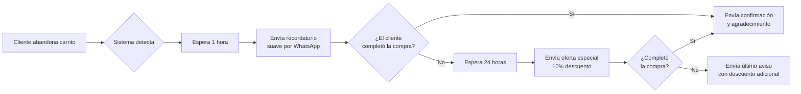

# Marketing en WhatsApp y Telegram: La Guía Completa

¿Sabías que puedes gestionar todo tu marketing en WhatsApp y Telegram desde un solo lugar? Con E-SMART360, tu negocio puede automatizar campañas, interactuar con clientes y escalar operaciones sin necesidad de ser un experto en tecnología.

<Callout type="info">
**Punto clave**: E-SMART360 proporciona una plataforma completa para crear, gestionar y automatizar chatbots en WhatsApp y Telegram, combinando lo mejor de ambos mundos: comunicación sin esfuerzo y automatización poderosa.
</Callout>

---

## ¿Qué es E-SMART360?

E-SMART360 es la plataforma integral que permite a las empresas crear y gestionar chatbots para WhatsApp y Telegram. Ofrece un amplio conjunto de funcionalidades diseñadas para optimizar la comunicación y el marketing digital.

<Callout type="tip">
**¿Sabías que...?** Con E-SMART360 puedes gestionar tanto WhatsApp como Telegram desde un solo panel de control unificado, ahorrando tiempo y recursos.
</Callout>

### Constructor Visual de Chatbots Drag-and-Drop

El corazón de E-SMART360 es su constructor visual de chatbots, que permite diseñar flujos de conversación complejos simplemente arrastrando y soltando bloques. No necesitas escribir ni una línea de código.

- **Interfaz intuitiva**: Arrastra y conecta bloques para crear respuestas automáticas
- **Flujos condicionales**: Crea ramificaciones según las respuestas del usuario
- **Integración multimedia**: Añade imágenes, videos, GIFs y documentos a tus conversaciones
- **Variables dinámicas**: Personaliza cada interacción con datos del usuario

### Chat en Vivo (Live Chat)

La funcionalidad de chat en vivo es crucial para supervisar y gestionar las interacciones entre usuarios y chatbots. Sin esta función, resulta difícil revisar o supervisar las conversaciones que tienen lugar.

- **Monitoreo de conversaciones**: Observa en tiempo real cómo interactúan los usuarios con tu chatbot
- **Intervención humana**: Cuando el chatbot encuentra dificultades o se necesita una respuesta más personalizada, un agente humano puede intervenir directamente
- **Soporte en tiempo real**: Los agentes pueden resolver consultas complejas al instante
- **Historial completo**: Accede al registro completo de cada conversación para análisis posterior

<Expandable title="¿Cómo funciona la intervención de agentes humanos?">
Cuando el chatbot detecta que no puede resolver una consulta o el usuario solicita hablar con un humano, la conversación se transfiere automáticamente al panel de chat en vivo. Allí, un agente puede tomar el control, responder directamente y, una vez resuelto el problema, devolver el control al chatbot. Esto garantiza una experiencia fluida sin perder el contexto de la conversación.
</Expandable>

### Broadcasting: Campañas Masivas Inteligentes

Envía mensajes dirigidos a tus suscriptores de WhatsApp y Telegram cuando necesites lanzar una campaña promocional. Pero no se trata solo de enviar mensajes masivos: la clave está en hacerlo de forma inteligente.

<Steps>
<Step title="Prepara tu lista de suscriptores">
Asegúrate de tener una lista de contactos limpia y lista para importar. Prepara una hoja de cálculo con los datos necesarios (nombre, número de teléfono, etc.). Asegúrate de que la columna de números de teléfono sea precisa y tenga el formato correcto.
</Step>
<Step title="Importa los suscriptores">
Accede al Gestor de Suscriptores en tu panel de E-SMART360. Selecciona "Importar Suscriptores" y sube tu archivo CSV. También puedes importar directamente desde Google Sheets. Una vez importado el archivo, mapea los datos para alinear las columnas correctamente.
</Step>
<Step title="Crea una plantilla de mensaje">
Las plantillas de mensaje son mensajes predefinidos que puedes usar para enviar a tus suscriptores. Ve a Gestor de Bot > Plantillas de Mensaje. Haz clic en "Crear Nueva Plantilla" y completa los detalles requeridos:
- Contenido del mensaje (con personalización mediante campos personalizados)
- Botones de llamada a la acción (CTA) opcionales
- Nombre de la plantilla (usa minúsculas y reemplaza espacios con guiones bajos)
</Step>
<Step title="Configura la campaña de broadcasting">
Navega a "Broadcasting" en tu panel de E-SMART360. Haz clic en "Crear Nueva Campaña" y asígnale un nombre descriptivo.
</Step>
<Step title="Selecciona tu audiencia objetivo">
Elige entre dos opciones de audiencia:
- **Ventana de 24 horas**: Envía mensajes gratuitos a usuarios que interactuaron contigo en las últimas 24 horas
- **Mensajería en cualquier momento**: Usa una plantilla aprobada para llegar a todos los suscriptores

Filtra tu audiencia usando etiquetas: incluye o excluye etiquetas específicas como "Nuevo Lead", "Interesado en Demo", "Cliente Recurrente", etc.
</Step>
<Step title="Programa o envía la campaña">
Revisa el contenido y la audiencia seleccionada. Programa el envío para una fecha futura o envíalo de inmediato. El sistema procesará los mensajes respetando los límites de la API de WhatsApp para evitar bloqueos.
</Step>
</Steps>

<Callout type="warning">
**Importante**: Para hacer broadcasting en WhatsApp debes usar plantillas de mensaje aprobadas por Meta. Los mensajes con fines promocionales requieren una plantilla de tipo "Marketing". Los mensajes transaccionales (confirmaciones de pedido, recibos de pago) usan plantillas de tipo "Utilidad". El uso incorrecto puede resultar en el rechazo de tu plantilla o la restricción de tu número.
</Callout>

### Diferencias entre Plantillas de Utilidad y Marketing

Entender la diferencia entre estos tipos de plantillas es fundamental para cumplir con las políticas de WhatsApp y evitar bloqueos.

<Tabs>
<Tab title="Plantillas de Utilidad">
Las plantillas de utilidad son mensajes preaprobados diseñados para actualizaciones transaccionales: confirmaciones, cambios o suspensiones relacionados con una transacción o suscripción específica.

**Ejemplos:**
- Confirmación de pedido: "Tu pedido #12345 ha sido confirmado. Recibirás una actualización de seguimiento pronto."
- Recibo de pago: "Tu pago de $50 se ha procesado exitosamente. ¡Gracias por tu compra!"
- Recordatorio de cita: "Recordatorio: Tu cita con el Dr. García está programada para el 15 de marzo a las 10 AM. Responde para confirmar."

Los mensajes de utilidad deben ser funcionales y no promocionales. Si una plantilla contiene contenido tanto de utilidad como de marketing, será clasificada como plantilla de marketing.
</Tab>
<Tab title="Plantillas de Marketing">
Las plantillas de marketing ofrecen mayor flexibilidad y se usan para mensajes que no están relacionados con una transacción específica.

**Ejemplos:**
- Oferta promocional: "¡Oferta exclusiva! Obtén un 20% de descuento en tu próxima compra. Usa el código AHORRO20 al finalizar."
- Reenganche de clientes: "Te extrañamos! Disfruta de envío gratis en tu próximo pedido. Toca abajo para comprar ahora."
- Invitación a evento: "Únete a nuestro próximo seminario web sobre tendencias de marketing digital. ¡Regístrate ahora!"
</Tab>
</Tabs>

<Callout type="success">
**Consejo clave**: Para mantener una alta tasa de entrega y evitar que tu número sea marcado como spam, alterna entre mensajes de utilidad y marketing. Una buena práctica es enviar máximo un mensaje de marketing por semana a cada suscriptor y complementar con mensajes de utilidad cuando ocurran transacciones reales.
</Callout>

### Automatización Inteligente

E-SMART360 automatiza tareas repetitivas para que tu equipo pueda enfocarse en lo que realmente importa:

- **Respuestas a preguntas frecuentes**: Configura respuestas automáticas para las consultas más comunes
- **Calificación de leads**: Los chatbots pueden hacer preguntas y calificar prospectos automáticamente
- **Secuencias de mensajes**: Crea secuencias automatizadas para nurturing de leads
- **Recordatorios y seguimientos**: Programa mensajes de seguimiento automáticos

<Expandable title="Ejemplo: Automatización de atención al cliente">
Imagina que tienes una tienda de ropa online. Configuras tu chatbot para responder preguntas frecuentes como:
1. "¿Cuál es el tiempo de envío?" → Respuesta automática: "El envío estándar tarda 3-5 días hábiles"
2. "¿Cómo puedo cambiar mi talla?" → Respuesta automática con instrucciones paso a paso
3. "¿Tienen descuentos?" → Respuesta automática con el código de descuento actual

Si el cliente pregunta algo que el chatbot no puede responder, la conversación se transfiere automáticamente a un agente humano. Esto reduce el tiempo de respuesta en un 80%.
</Expandable>

### Integraciones Poderosas

Conecta E-SMART360 con otras herramientas para potenciar tus flujos de trabajo:

<Columns cols="3">
<Card title="Sistemas CRM">
Conecta tu CRM favorito para sincronizar leads y contactos automáticamente. Los datos recopilados por el chatbot se transfieren directamente a tu sistema de gestión de relaciones con clientes.
</Card>
<Card title="Plataformas de Email Marketing">
Recopila correos electrónicos a través del chatbot y envíalos directamente a tu plataforma de email marketing para campañas de correo electrónico.
</Card>
<Card title="Google Sheets">
Sincroniza datos de tus conversaciones directamente con Google Sheets para llevar un registro organizado de todas las interacciones.
</Card>
</Columns>

### Automatización para E-commerce

E-SMART360 revoluciona la verificación de pedidos en tiendas online. La plataforma confirma instantáneamente pedidos de Shopify y WooCommerce a través de WhatsApp, eliminando pedidos falsos y aumentando la confianza del cliente.

<Steps>
<Step title="Configura la integración con tu tienda">
Conecta E-SMART360 con tu tienda Shopify o WooCommerce desde el panel de integraciones. El proceso es guiado y no requiere conocimientos técnicos.
</Step>
<Step title="Personaliza los mensajes de verificación">
Crea mensajes personalizados que se enviarán automáticamente cuando se realice un pedido. Puedes incluir el nombre del producto, el monto total, el número de pedido y un botón para confirmar.
</Step>
<Step title="Los clientes verifican con un clic">
Cuando llega un pedido nuevo, el cliente recibe un mensaje de WhatsApp con un botón para confirmar. Simplemente toca el botón y el pedido queda verificado al instante.
</Step>
<Step title="Disfruta de la automatización completa">
Una vez configurado, todo el proceso funciona automáticamente. Los pedidos falsos se detectan al instante y solo los pedidos verificados pasan a procesamiento.
</Step>
</Steps>

<Callout type="success">
**Beneficio real**: Empresas que usan E-SMART360 para verificación de pedidos reportan una reducción de hasta un 95% en pedidos falsos y un aumento del 40% en la confianza del cliente al recibir confirmaciones instantáneas por WhatsApp.
</Callout>

### Gestión de Grupos de Telegram

E-SMART360 transforma la administración de grupos de Telegram con funciones avanzadas:

- **Filtrado de spam en tiempo real**: Detecta y elimina automáticamente mensajes no deseados
- **Controles granulares de mensajes**: Define reglas específicas para cada grupo
- **Tareas automatizadas**: Programa mensajes automáticos, bienvenidas y recordatorios
- **Información de actividad de usuarios**: Obtén métricas detalladas sobre la participación
- **Reglas de moderación personalizables**: Adapta la moderación a las necesidades de tu comunidad

<Expandable title="¿Cómo configurar la moderación automática en Telegram?">
1. Conecta tu bot de Telegram a E-SMART360
2. Ve a la sección de "Gestión de Grupos"
3. Activa el filtro de spam y define palabras clave prohibidas
4. Configura acciones automáticas: eliminar mensaje, advertir al usuario, o restringirlo temporalmente
5. Establece límites de mensajes por minuto para evitar flooding
6. Guarda los cambios y el sistema comenzará a moderar automáticamente

Esto es especialmente útil para grupos grandes donde la moderación manual resulta imposible.
</Expandable>

---

## ¿Por qué Elegir E-SMART360 para tu Marketing en WhatsApp y Telegram?

### Alcance masivo

WhatsApp y Telegram suman miles de millones de usuarios activos en todo el mundo. Con E-SMART360, puedes llegar a una audiencia global desde una sola plataforma.

<Columns cols="2">
<Card title="WhatsApp">
- Más de 2.500 millones de usuarios activos mensuales
- Tasa de apertura del 98%
- Ideal para marketing B2C y atención al cliente
- Catálogo de productos integrado
- Pagos directos en el chat
</Card>
<Card title="Telegram">
- Más de 900 millones de usuarios activos mensuales
- Broadcasting ilimitado a suscriptores
- Gestión avanzada de grupos y comunidades
- Canales de difusión masiva
- Bots personalizables sin restricciones estrictas
</Card>
</Columns>

### Tasas de Engagement Excepcionales

A diferencia del email marketing tradicional (que tiene tasas de apertura del 20-30%), los mensajes de WhatsApp y Telegram tienen tasas de apertura superiores al 90%. Esto significa que tu mensaje no solo llega, sino que es leído.

<Callout type="info">
**Comparativa**: Mientras que un email marketing típico tiene una tasa de apertura del 22% y una tasa de clics del 3%, un mensaje de WhatsApp tiene una tasa de apertura del 98% y una tasa de clics del 15-20%. Esto hace que el marketing por chat sea 5-7 veces más efectivo que el email tradicional.
</Callout>

### Personalización al Máximo

Los chatbots de E-SMART360 aprenden de cada interacción y pueden:

- Saludar al usuario por su nombre
- Recomendar productos basados en compras anteriores
- Enviar ofertas personalizadas según el comportamiento
- Recordar preferencias y ajustar respuestas futuras

### Disponibilidad 24/7

Tu negocio nunca cierra. El chatbot está disponible las 24 horas del día, los 7 días de la semana, para:

- Responder preguntas frecuentes a cualquier hora
- Recibir pedidos incluso cuando duermes
- Proporcionar soporte básico sin intervención humana
- Calificar leads en tiempo real

### Costo-Efectividad

En lugar de contratar un equipo grande de atención al cliente, un chatbot de E-SMART360 puede manejar el 80% de las consultas de forma automática. Esto se traduce en:

- Reducción de costos operativos hasta en un 60%
- Mayor eficiencia del equipo humano
- Escalabilidad sin aumentar la plantilla
- Retorno de inversión medible en semanas

---

## Cómo Empezar con E-SMART360

Comenzar es sencillo. Simplemente visita el sitio web de E-SMART360 y regístrate para una prueba gratuita. Una vez que hayas creado tu cuenta, puedes empezar a construir tu chatbot.

<Steps>
<Step title="Regístrate en E-SMART360">
Crea tu cuenta gratuita en la plataforma. No necesitas tarjeta de crédito para empezar. El proceso de registro toma menos de 2 minutos.
</Step>
<Step title="Conecta tu canal">
- **WhatsApp**: Conecta tu número de WhatsApp Business API mediante el proceso guiado de Embedded Signup. Solo necesitas tu número de teléfono y una cuenta de Facebook Business Manager.
- **Telegram**: Crea un bot en Telegram a través de @BotFather y conéctalo a E-SMART360 usando el token proporcionado.
</Step>
<Step title="Construye tu chatbot">
Usa el constructor visual drag-and-drop para diseñar tus flujos de conversación. Puedes empezar con plantillas prediseñadas para casos comunes como:
- Atención al cliente
- Generación de leads
- Confirmación de pedidos
- FAQ automatizado
</Step>
<Step title="Prueba y optimiza">
Antes de lanzar, prueba tu chatbot desde el panel de vista previa. Simula conversaciones completas para asegurarte de que todos los flujos funcionan correctamente. Analiza las métricas y ajusta según sea necesario.
</Step>
<Step title="Lanza y escala">
Una vez que todo funciona correctamente, activa tu chatbot para el público. Monitorea el rendimiento desde el panel de analytics y escala agregando más canales o funcionalidades según crezca tu negocio.
</Step>
</Steps>

<Callout type="info">
Para obtener instrucciones detalladas, consulta nuestra guía paso a paso sobre cómo crear un bot de Telegram y conectarlo a E-SMART360, disponible en nuestra sección de recursos.
</Callout>

---

## Casos de Uso Prácticos

### Caso 1: Tienda de Ropa Online

Una tienda de ropa implementó E-SMART360 para:

1. **Chatbot de atención al cliente**: Responde automáticamente preguntas sobre tallas, envíos y devoluciones
2. **Catálogo interactivo**: Muestra productos disponibles directamente en el chat con imágenes y precios
3. **Verificación de pedidos**: Los clientes confirman pedidos contra reembolso con un solo clic
4. **Campañas de marketing**: Envían ofertas semanales a suscriptores segmentados por preferencias

**Resultados**: Reducción del 70% en llamadas al servicio al cliente, aumento del 35% en ventas recurrentes.

<Columns cols="2">
<Card title="Indicador" card_style="info">
- Chatbot activo 24/7
- Respuesta en < 2 segundos
- 85% de consultas resueltas automáticamente
</Card>
<Card title="Indicador" card_style="info">
- 40% más de pedidos verificados
- 95% menos pedidos falsos
- 3x retorno de inversión en 2 meses
</Card>
</Columns>

### Caso 2: Agencia de Marketing Digital

Una agencia que gestiona múltiples cuentas de clientes utilizó E-SMART360 para:

1. **Gestión multi-cuenta**: Administrar chatbots de diferentes clientes desde un solo panel
2. **Generación de leads**: Capturar prospectos calificados automáticamente mediante preguntas inteligentes
3. **Reportes automatizados**: Enviar informes semanales de rendimiento a cada cliente por WhatsApp
4. **Integración con CRM**: Sincronizar todos los leads capturados directamente con HubSpot

**Resultados**: Gestión de 15 clientes simultáneamente con solo 3 personas en el equipo, ahorrando 40 horas semanales.

### Caso 3: Restaurante con Sistema de Reservas

Un restaurante implementó:

- **Reservas por chat**: Los clientes reservan mesa directamente desde WhatsApp
- **Recordatorios automáticos**: Envían recordatorios 24 horas antes de la reserva
- **Menú interactivo**: Muestran el menú del día con imágenes y precios
- **Encuestas de satisfacción**: Después de la visita, envían una encuesta rápida

**Resultados**: Reducción del 60% en no-shows, aumento del 25% en reservas semanales.

---

## Preguntas Frecuentes

<Expandable title="¿Puedo gestionar tanto WhatsApp como Telegram en un solo lugar?">
Sí. E-SMART360 proporciona un panel de control unificado que te permite crear bots, enviar broadcasts y gestionar suscriptores tanto de WhatsApp como de Telegram simultáneamente. No necesitas cambiar entre plataformas.
</Expandable>

<Expandable title="¿Cuáles son los beneficios de usar un bot de Telegram para marketing?">
Los bots de Telegram permiten broadcasting ilimitado de mensajes a suscriptores, soporte automatizado al cliente, y la capacidad de gestionar comunidades grandes sin las limitaciones estrictas del SMS tradicional. Además, Telegram no tiene las mismas restricciones de plantillas que WhatsApp, lo que permite mayor flexibilidad creativa.
</Expandable>

<Expandable title="¿E-SMART360 es una plataforma sin código?">
Absolutamente. E-SMART360 está diseñado para que profesionales de marketing y dueños de negocio puedan crear potentes flujos de automatización para WhatsApp y Telegram usando una interfaz visual de arrastrar y soltar. No se requieren conocimientos de programación.
</Expandable>

<Expandable title="¿Cómo ayuda E-SMART360 a mejorar el engagement con la audiencia?">
Con funciones como automatización de campañas, personalización de mensajes, bandeja de entrada compartida y analytics detallados, E-SMART360 ayuda a los equipos a enviar mensajes dirigidos que aumentan las tasas de respuesta y conversión. Además, la segmentación por etiquetas permite enviar el mensaje correcto a la persona correcta en el momento correcto.
</Expandable>

<Expandable title="¿Qué límites tiene el broadcasting en WhatsApp?">
WhatsApp establece límites de mensajes según el nivel de calidad de tu número. Los números con alta calidad (calificación verde) pueden enviar hasta 250,000 mensajes por día. Es importante mantener una baja tasa de bloqueos y reportes de spam para conservar o mejorar tu límite. E-SMART360 te permite monitorear estos indicadores desde el panel principal.
</Expandable>

<Expandable title="¿Puedo enviar mensajes personalizados con datos variables?">
Sí. E-SMART360 soporta variables personalizadas en las plantillas de mensaje. Puedes insertar campos como el nombre del cliente, el número de pedido, la fecha de entrega y cualquier otro dato que tengas en tu base de suscriptores. Esto permite campañas altamente personalizadas a escala.
</Expandable>

<Expandable title="¿Cuánto tiempo toma aprobar una plantilla de mensaje en WhatsApp?">
El tiempo de aprobación de Meta puede variar desde unos minutos hasta 24-48 horas en casos complejos. La mayoría de las plantillas bien estructuradas se aprueban en menos de 2 horas. Las causas más comunes de rechazo incluyen: contenido promocional disfrazado de utilidad, falta de opción de exclusión voluntaria y formato incorrecto.
</Expandable>

<Expandable title="¿E-SMART360 ofrece soporte para la regla de 24 horas de WhatsApp?">
Sí. La plataforma gestiona automáticamente la ventana de 24 horas de WhatsApp. Puedes enviar mensajes gratuitos dentro de la ventana de 24 horas posteriores a la última interacción del usuario. Para mensajes fuera de esta ventana, la plataforma utiliza automáticamente las plantillas aprobadas correspondientes. Esto asegura el cumplimiento de las políticas de WhatsApp sin intervención manual.
</Expandable>

---

## Conclusión

E-SMART360 es una plataforma potente que puede ayudar a empresas de todos los tamaños a mejorar sus esfuerzos de marketing multicanal. Los beneficios clave incluyen:

<Callout type="info">
- **Fácil de usar**: Diseñado para usuarios sin experiencia en programación.
- **Asequible**: Varios planes de precios que se adaptan a tu presupuesto.
- **Escalable**: Crece junto con tu negocio, desde pequeña empresa hasta corporación.
</Callout>

E-SMART360 es una plataforma relativamente nueva, pero ya ha ganado seguidores leales gracias a su facilidad de uso y potentes funcionalidades. Definitivamente vale la pena probarla si quieres adelantarte a la competencia.

<Callout type="success">
**¿Listo para empezar?** Regístrate hoy para una prueba gratuita y descubre cómo E-SMART360 puede transformar la comunicación de tu negocio en WhatsApp y Telegram.
</Callout>

## Recursos Adicionales

<Columns cols="2">
<Card title="Guía de Conexión de Telegram">
Aprende paso a paso cómo crear un bot de Telegram y conectarlo a E-SMART360 para empezar a automatizar tu comunidad.
</Card>
<Card title="Plantillas de Mensajes">
Descarga nuestra guía de mejores prácticas para crear plantillas de mensaje que se aprueben rápidamente y maximicen el engagement.
</Card>
</Columns>

---

## Estrategias Avanzadas de Marketing en WhatsApp

### Segmentación Avanzada de Audiencias

La clave del éxito en marketing por chat no está solo en enviar mensajes, sino en enviar el mensaje correcto a la persona correcta. E-SMART360 permite una segmentación avanzada que va más allá de etiquetas simples.

<Tabs>
<Tab title="Segmentación por Comportamiento">
Agrupa a tus suscriptores según sus interacciones previas:
- Usuarios que hicieron clic en el catálogo de productos
- Clientes que abandonaron el carrito de compra
- Suscriptores que respondieron a campañas anteriores
- Leads que solicitaron información de un producto específico

Esta segmentación permite enviar mensajes altamente relevantes. Por ejemplo, a un usuario que vio zapatos deportivos pero no compró, puedes enviarle una oferta especial del 10% de descuento en esa categoría.
</Tab>
<Tab title="Segmentación Demográfica">
Utiliza los datos que tus suscriptores han compartido:
- Ubicación geográfica
- Rango de edad
- Género
- Profesión o industria

Ideal para campañas localizadas como "¡Visítanos en nuestra sucursal de Madrid este fin de semana!" o eventos específicos por región.
</Tab>
<Tab title="Segmentación por Ciclo de Vida">
Clasifica a tus contactos según su etapa en el customer journey:
- **Nuevo lead**: Acaba de suscribirse, necesita contenido educativo
- **Lead caliente**: Ha mostrado interés, necesita una oferta
- **Cliente nuevo**: Primera compra, necesita onboarding
- **Cliente recurrente**: Compras frecuentes, merece beneficios exclusivos
- **Cliente inactivo**: No ha comprado en 3 meses, campaña de reenganche
</Tab>
</Tabs>

### Automatización de Seguimiento de Leads

Configura flujos automáticos que nutran a tus leads sin intervención manual:

<Steps>
<Step title="Captura inicial">
Un usuario hace clic en un anuncio de Click-to-WhatsApp o escanea un código QR. El chatbot saluda, recopila el nombre y el motivo de la consulta.
</Step>
<Step title="Cualificación automática">
El chatbot hace preguntas calificadoras: "¿Qué tipo de producto buscas?", "¿Cuál es tu presupuesto aproximado?", "¿Cuándo planeas comprar?"
</Step>
<Step title="Asignación y seguimiento">
Según las respuestas, el lead se etiqueta automáticamente y se asigna al agente correspondiente. Si el lead no está listo para comprar, se programa una secuencia de seguimiento:
- Día 1: Enviar brochure informativo
- Día 3: Compartir testimonio de cliente
- Día 7: Oferta especial por tiempo limitado
- Día 14: Último aviso con descuento adicional
</Step>
</Steps>

### Campañas de Carrito Abandonado

Recupera ventas perdidas automatizando mensajes para carritos abandonados. E-SMART360 se integra directamente con WooCommerce y Shopify para detectar carritos abandonados y enviar recordatorios personalizados.

<Callout type="tip">
**Dato**: Las campañas de recuperación de carrito abandonado por WhatsApp tienen una tasa de conversión del 15-30%, comparado con el 3-5% del email. Esto se debe a la inmediatez y alta tasa de apertura del canal.
</Callout>

### Estrategia de Contenido para Chat Marketing

El contenido que envías a través de WhatsApp y Telegram debe ser diferente al que usas en email o redes sociales. Aquí tienes una guía rápida:

<Columns cols="3">
<Card title="Contenido Educativo">
- Tips rápidos (3-5 líneas)
- Infografías en imagen
- Videos cortos (< 1 min)
- Checklists descargables
- Links a tutoriales
</Card>
<Card title="Contenido Promocional">
- Ofertas flash (24h)
- Códigos de descuento exclusivos
- Lanzamientos de productos
- Eventos y webinars
- Concursos y sorteos
</Card>
<Card title="Contenido Transaccional">
- Confirmaciones de pedido
- Actualizaciones de envío
- Recordatorios de pago
- Encuestas post-compra
- Solicitudes de reseña
</Card>
</Columns>

<Callout type="warning">
**Regla de oro del chat marketing**: El 70% de tus mensajes deberían ser de valor (educativo o transaccional) y solo el 30% promocional. Si inviertes esta proporción, tus suscriptores comenzarán a bloquearte o reportarte como spam.
</Callout>

### Medición y Analytics

Para mejorar continuamente tus campañas, E-SMART360 proporciona métricas detalladas:

| Métrica | Qué mide | Benchmark recomendado |
|---------|----------|----------------------|
| Tasa de entrega | Mensajes entregados vs enviados | > 95% |
| Tasa de apertura | Mensajes abiertos vs entregados | > 80% |
| Tasa de clics (CTR) | Clics en botones CTA vs entregados | > 10% |
| Tasa de conversión | Conversiones vs clics | > 5% |
| Tasa de bloqueo | Usuarios que bloquean el número | < 0.1% |
| Tasa de respuesta | Usuarios que responden al mensaje | > 15% |

<Callout type="success">
**Mejora continua**: Revisa estas métricas semanalmente. Si la tasa de bloqueo supera el 0.1%, reduce la frecuencia de tus envíos. Si el CTR baja, prueba diferentes tipos de contenido o llamadas a la acción. El éxito está en la iteración constante.
</Callout>

## Buenas Prácticas para Evitar Bloqueos en WhatsApp

Mantener una reputación saludable en WhatsApp es fundamental para el éxito a largo plazo de tus campañas. Sigue estas recomendaciones:

1. **Siempre obtén consentimiento explícito**: Nunca agregues números sin permiso. Usa doble confirmación (opt-in) cuando sea posible.
2. **Respeta la frecuencia de envío**: No envíes más de 2-3 mensajes por semana a cada suscriptor.
3. **Incluye opción de baja**: Cada mensaje debe tener una forma clara de dejar de recibir comunicaciones.
4. **Personaliza tus mensajes**: Los mensajes genéricos tienen mayor probabilidad de ser reportados como spam.
5. **Monitorea tu calidad**: Revisa regularmente la calificación de calidad de tu número en el panel de E-SMART360.
6. **Alterna tipos de mensaje**: No envíes solo mensajes promocionales. Combínalos con mensajes de utilidad y servicio.
7. **Responde rápido**: Los mensajes entrantes de clientes deben responderse en menos de 24 horas para mantener la ventana de conversación abierta.

<Expandable title="¿Qué hacer si mi número es bloqueado en WhatsApp?">
Si tu número de WhatsApp es bloqueado o restringido:

1. **No entres en pánico**: La mayoría de las restricciones son temporales.
2. **Identifica la causa**: Revisa qué mensajes causaron reportes de spam.
3. **Detén todas las campañas**: Pausa cualquier envío masivo inmediatamente.
4. **Contacta a soporte**: Usa el formulario de Meta para apelar la restricción.
5. **Implementa correcciones**: Ajusta tus estrategias según las recomendaciones de WhatsApp.
6. **Espera**: Las restricciones suelen levantarse en 24-72 horas si corriges el comportamiento.
7. **Prevención futura**: Usa E-SMART360 para monitorear tu calificación de calidad en tiempo real y ajustar antes de que ocurran problemas.
</Expandable>

## Integraciones Adicionales

### Google Sheets para Automatización de Datos

Conecta E-SMART360 con Google Sheets para automatizar el envío de mensajes directamente desde los datos de tu hoja de cálculo. Esto es ideal para:

1. **Notificaciones de nuevas filas**: Cuando se añade una nueva fila, se envía un mensaje automático
2. **Actualizaciones de estado**: Cambia el estado de un pedido en Sheets y el cliente recibe la notificación
3. **Sincronización bidireccional**: Las respuestas de los clientes se registran automáticamente en Sheets

<Callout type="info">
**Caso práctico**: Un negocio de delivery usa Google Sheets conectado a E-SMART360. Cada nuevo pedido se registra en Sheets y automáticamente se envían tres mensajes: confirmación al cliente, notificación al cocinero y alerta al repartidor. Todo sin intervención manual.
</Callout>

### Zapier y Automatización Multi-App

Conecta E-SMART360 con más de 5,000 aplicaciones a través de Zapier para flujos de trabajo avanzados:

- **Nuevo lead en Facebook Ads** → Enviar mensaje de bienvenida por WhatsApp
- **Nuevo pago en Stripe** → Enviar recibo por WhatsApp
- **Nuevo ticket en Zendesk** → Notificar al equipo por Telegram
- **Nuevo suscriptor en Mailchimp** → Agregar a lista de broadcasting en WhatsApp

## Migración desde Otras Plataformas

Si ya estás usando otra herramienta de marketing por chat, migrar a E-SMART360 es sencillo:

<Steps>
<Step title="Exporta tus datos">
Exporta tu lista de suscriptores desde tu plataforma actual en formato CSV. Incluye todos los campos personalizados que hayas configurado.
</Step>
<Step title="Importa a E-SMART360">
Usa el importador de suscriptores de E-SMART360. Mapea los campos de tu CSV a los campos correspondientes en la plataforma.
</Step>
<Step title="Recrea tus flujos">
Usa el constructor visual para recrear tus chatbots y automatizaciones. Aprovecha la oportunidad para mejorarlos con las funcionalidades avanzadas de E-SMART360.
</Step>
<Step title="Verifica y lanza">
Prueba todos los flujos con usuarios de prueba antes de migrar completamente. Una vez verificado, desconecta la plataforma anterior.
</Step>
</Steps>

## Preguntas Frecuentes Adicionales

<Expandable title="¿E-SMART360 soporta mensajes multimedia?">
Sí completamente. Puedes enviar imágenes, videos, GIFs, documentos PDF, audio y stickers tanto en WhatsApp como en Telegram. Para WhatsApp, es importante tener en cuenta los límites de tamaño: imágenes hasta 5MB, videos hasta 16MB, documentos hasta 100MB.
</Expandable>

<Expandable title="¿Puedo tener múltiples números de WhatsApp en una cuenta?">
Sí. E-SMART360 permite gestionar múltiples números de WhatsApp desde una sola cuenta. Esto es especialmente útil para agencias que manejan varias marcas o para negocios con diferentes departamentos (ventas, soporte, postventa).
</Expandable>

<Expandable title="¿Qué tipo de reportes ofrece E-SMART360?">
El panel de analytics ofrece reportes detallados sobre:
- Mensajes enviados, entregados y leídos
- Tasa de conversión por campaña
- Rendimiento por canal (WhatsApp vs Telegram)
- Crecimiento de suscriptores
- Horas pico de interacción
- Rendimiento de cada chatbot y flujo
- Calidad del número de WhatsApp
Los reportes pueden exportarse en PDF o CSV para compartir con tu equipo.
</Expandable>

<Expandable title="¿E-SMART360 es compatible con WhatsApp Business API oficial?">
Sí. E-SMART360 está construido sobre la API oficial de WhatsApp Business de Meta, lo que garantiza cumplimiento total con las políticas de WhatsApp. Esto significa que tus mensajes tienen la mejor tasa de entrega posible y tu número está protegido bajo las reglas oficiales.
</Expandable>

<Expandable title="¿Cómo gestiono el consentimiento de los usuarios?">
E-SMART360 incluye herramientas para gestionar el consentimiento:
- Mensajes de opt-in con doble confirmación
- Botón de "Cancelar suscripción" en cada mensaje
- Historial de consentimiento por usuario
- Cumplimiento con GDPR y leyes de privacidad
- Exportación de datos de consentimiento para auditorías
</Expandable>

<Expandable title="¿Puedo crear chatbots para Messenger e Instagram?">
Sí. Además de WhatsApp y Telegram, E-SMART360 te permite crear chatbots para Facebook Messenger e Instagram DM. Todos los canales se gestionan desde el mismo panel unificado, lo que te permite ofrecer una experiencia omnicanal consistente.
</Expandable>

<Expandable title="¿Cuánto cuesta E-SMART360?">
E-SMART360 ofrece varios planes de precios que se adaptan a diferentes necesidades:
- **Plan gratuito**: Funcionalidades básicas para empezar
- **Plan básico**: Ideal para pequeñas empresas con un solo canal
- **Plan profesional**: Para negocios en crecimiento con múltiples canales
- **Plan enterprise**: Soluciones personalizadas para grandes volúmenes

Visita nuestra página de precios para ver los detalles actualizados.
</Expandable>

---

*Este artículo fue actualizado por última vez el 29 de marzo de 2026.*
