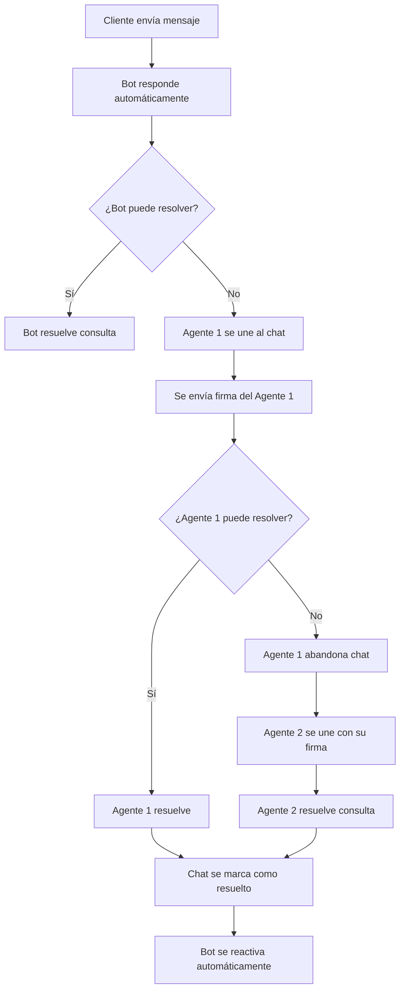

# Configurar Mensajes de Firma en la Bandeja de Entrada Compartida del Equipo

<Callout type="tip">
**¿Sabías que...?** Un mensaje de firma bien configurado refuerza la identidad de tu marca y agrega un toque humano a cada interacción con el cliente. En una bandeja de entrada compartida donde múltiples agentes colaboran, es la clave para mantener profesionalismo y consistencia en todas las conversaciones.
</Callout>

## Introducción

En el mundo actual de la atención al cliente omnicanal, la **consistencia** y el **profesionalismo** son dos pilares fundamentales para construir relaciones duraderas con los clientes. Cuando múltiples agentes colaboran en una misma bandeja de entrada para gestionar conversaciones a través de WhatsApp, Facebook, Instagram, Telegram y Chat Web, mantener una comunicación coherente puede convertirse en un desafío.

E-SMART360 resuelve este desafío con los **Mensajes de Firma**, una funcionalidad poderosa que permite a cada agente presentarse de manera profesional y consistente en cada interacción. Esta guía completa te enseñará todo lo que necesitas saber sobre esta función, desde su configuración básica hasta las mejores prácticas avanzadas.

<Callout type="info">
**Público objetivo**: Esta guía está dirigida a administradores de cuentas, líderes de equipos de soporte, agentes de atención al cliente y cualquier persona que gestione conversaciones en la plataforma E-SMART360.
</Callout>

## ¿Qué es un Mensaje de Firma en E-SMART360?

Un **Mensaje de Firma** en E-SMART360 es un mensaje predefinido que se agrega automáticamente al final de las conversaciones. Puede incluir el nombre del agente, su cargo y otros detalles personalizados para hacer que las interacciones sean más profesionales y cercanas.

La interfaz de E-SMART360 te permite crear, personalizar y gestionar estos mensajes de forma sencilla. Los mensajes de firma se pueden configurar en todos los canales disponibles:

<Columns cols="2">
<Card title="WhatsApp">
Garantiza una comunicación personalizada en la plataforma de mensajería más utilizada del mundo. Cada respuesta lleva la identificación del agente que está atendiendo.
</Card>
<Card title="Facebook">
Agrega despedidas profesionales a las respuestas enviadas a través de Facebook Messenger. Mantén la coherencia de marca en cada interacción.
</Card>
<Card title="Instagram">
Mantén la consistencia de tu marca en las respuestas a mensajes directos de Instagram, asegurando que cada conversación refleje la profesionalidad de tu equipo.
</Card>
<Card title="Telegram">
Mejora las interacciones con los clientes en Telegram usando firmas personalizadas que identifiquen claramente a cada agente.
</Card>
<Card title="Chat Web">
Agrega un toque profesional al soporte en tiempo real de tu sitio web, haciendo que cada agente sea fácilmente identificable.
</Card>
</Columns>

## ¿Qué es la Bandeja de Entrada Compartida?

La **bandeja de entrada compartida** de E-SMART360 es una herramienta centralizada que permite a todo tu equipo gestionar conversaciones de clientes desde un único lugar. A diferencia de las bandejas de entrada individuales, donde cada agente solo ve sus propias conversaciones, la bandeja compartida ofrece una vista unificada de todas las interacciones, independientemente del canal del que provengan.

### Características principales de la bandeja compartida

- **Vista unificada**: Todas las conversaciones de WhatsApp, Facebook, Instagram, Telegram y Chat Web en un solo lugar.
- **Colaboración en tiempo real**: Los agentes pueden ver qué conversaciones están siendo atendidas por otros miembros del equipo.
- **Asignación de conversaciones**: Asigna chats específicos a agentes concretos para una distribución equitativa de la carga de trabajo.
- **Historial completo**: Accede al historial completo de cada cliente, incluyendo interacciones previas con otros agentes.
- **Notificaciones en tiempo real**: Recibe alertas instantáneas cuando un cliente envía un nuevo mensaje.

### ¿Cómo mejora la bandeja compartida la atención al cliente?

Cuando múltiples agentes colaboran en una misma bandeja de entrada, la coordinación es fundamental. Los Mensajes de Firma juegan un papel crucial aquí porque:

1. **Eliminan la confusión**: El cliente sabe instantáneamente quién le está respondiendo.
2. **Evitan respuestas duplicadas**: Los agentes pueden ver quién está atendiendo cada conversación.
3. **Facilitan las transferencias**: Cuando un agente necesita escalar un caso, el nuevo agente se presenta automáticamente con su firma.
4. **Mantienen la continuidad**: El cliente experimenta una transición suave entre agentes sin tener que repetir información.

## Beneficios de Usar Mensajes de Firma en tu Bandeja Compartida

<Callout type="info">
Una bandeja de entrada compartida es una forma organizada de brindar soporte a los clientes a través de chat en vivo. Cuando un agente se une a una conversación, los demás pueden ver quién se ha unido, lo que permite una colaboración fluida y mejora significativamente la experiencia de soporte en vivo para tus clientes.
</Callout>

Usar una bandeja de entrada compartida con mensajes de firma aporta múltiples beneficios:

1. **Profesionalismo consistente**: Todos los agentes se presentan de manera uniforme, fortaleciendo la imagen corporativa.
2. **Responsabilidad y trazabilidad**: Cada agente que responde queda registrado con su firma, lo que permite saber quién atendió cada conversación.
3. **Transparencia para el cliente**: El cliente sabe en todo momento con qué agente está hablando, lo que genera confianza.
4. **Colaboración eficiente**: Los agentes pueden unirse y salir de las conversaciones según sea necesario, manteniendo el flujo de trabajo limpio y organizado.
5. **Reducción de respuestas duplicadas**: Al saber quién está atendiendo, se evita que varios agentes respondan al mismo tiempo.

Si es necesario, los agentes también tienen la opción de abandonar el chat una vez que sus tareas están completas, lo que agiliza aún más el flujo de trabajo.

<Callout type="warning">
**Importante:** Al activar la función de Mensaje de Firma en E-SMART360, también se activa la opción **Unirse al Chat**. Esto significa que solo los agentes que se hayan unido al chat pueden responder mensajes. Sin unirse, los agentes pueden ver pero no responder directamente, lo que garantiza responsabilidad y comunicación organizada.
</Callout>

## Diferencias entre Mensajes de Firma y Respuestas Predefinidas

Es importante no confundir los Mensajes de Firma con las **Respuestas Predefinidas** (también conocidas como respuestas rápidas o respuestas enlatadas). Aunque ambas herramientas ayudan a agilizar la comunicación, tienen propósitos diferentes:

| Característica | Mensajes de Firma | Respuestas Predefinidas |
|---|---|---|
| **Propósito** | Identificar al agente al final de cada mensaje | Responder rápidamente a preguntas frecuentes |
| **Activación** | Automática al unirse al chat | Manual, el agente selecciona la respuesta |
| **Contenido** | Nombre, cargo, datos de contacto del agente | Soluciones a preguntas comunes |
| **Personalización** | Por agente individual | Globales para todo el equipo |
| **Canales** | Todos los canales compatibles | Todos los canales compatibles |
| **Frecuencia** | Se agrega a cada mensaje enviado | Solo cuando el agente la selecciona |

<Callout type="info">
**Mejores prácticas**: Combina ambas herramientas para una atención al cliente óptima. Usa Mensajes de Firma para la presentación profesional y Respuestas Predefinidas para agilizar las respuestas a consultas recurrentes como horarios, direcciones o políticas de devolución.
</Callout>

## Guía Paso a Paso para Configurar Mensajes de Firma

A continuación te mostramos cómo configurar los mensajes de firma en E-SMART360 de manera rápida y sencilla.

### 1. Accede al Panel de Configuración

Para comenzar, inicia sesión en tu cuenta de E-SMART360 y navega hasta la sección de **Configuración** desde el gestor de bots:

<Steps>
<Step title="Ve al Gestor de Bots">
Desde el panel principal, haz clic en la opción **Gestor de Bots** en el menú lateral.
</Step>
<Step title="Selecciona la pestaña Configuración">
Dentro del Gestor de Bots, busca y selecciona la pestaña **Configuración** en el menú superior.
</Step>
<Step title="Busca la sección de firma">
Localiza la sección **Configuración de Mensaje de Firma** dentro del panel de opciones.
</Step>
</Steps>

### 2. Activa los Mensajes de Firma

Una vez en el panel de Configuración:

<Steps>
<Step title="Ubica el interruptor">
Busca el interruptor de **Activar Mensaje de Firma** en la sección correspondiente.
</Step>
<Step title="Activa la función">
Cambia el interruptor a la posición de activado para habilitar la función de mensajes de firma.
</Step>
</Steps>

### 3. Agrega un Mensaje de Firma Predeterminado

Después de activar la función, puedes configurar tu mensaje predeterminado:

<Steps>
<Step title="Escribe tu firma">
En el campo **Mensaje de Firma Predeterminado**, ingresa la firma que deseas usar. Por ejemplo:

```
Hola, soy [Nombre], agente de soporte de E-SMART360. ¿Cómo puedo ayudarte hoy?
```
</Step>
<Step title="Usa campos dinámicos">
Utiliza el marcador de posición dinámico `[Nombre]` para que se autocomplete automáticamente con el nombre del agente en cada respuesta.
</Step>
</Steps>

### 4. Personaliza las Firmas de Cada Agente

Cada agente puede personalizar su propia firma para incluir información específica como su cargo o un saludo personalizado:

<Steps>
<Step title="Accede a la Configuración del Miembro">
Cada agente debe ir a **Configuración de Miembro** desde su cuenta, haciendo clic en el icono de su perfil en la esquina superior derecha y luego en **Cuenta**.
</Step>
<Step title="Edita el campo de firma">
En la sección de configuración de la cuenta, busca el campo de **Firma** y edítalo para incluir información específica como su rol o un saludo personalizado.

Ejemplos de firmas personalizadas:
- *"Hola, soy [Nombre], ejecutivo de ventas de E-SMART360. Estoy aquí para ayudarte."*
- *"Saludos, soy [Nombre] del departamento de soporte técnico. ¿En qué puedo asistirte?"*
- *"Bienvenido, soy [Nombre], tu asesor comercial. Cuéntame cómo puedo ayudarte."*
</Step>
</Steps>

### 5. Indicador de Escritura

Puedes activar el **Indicador de Escritura** en la configuración de Mensajes de Firma de la Bandeja Compartida. Esta función muestra automáticamente "escribiendo..." en WhatsApp cuando:

- Un agente comienza a redactar una respuesta.
- Un agente hace clic en la bandeja de entrada del chat (incluso antes de empezar a escribir).
- Tu bot prepara una respuesta para el cliente.

<Callout type="success">
Este indicador les comunica proactivamente a los clientes que un agente está comprometido con la conversación, lo que resulta especialmente útil durante las transferencias entre agentes. Señala actividad incluso si hay una breve pausa antes de la respuesta.
</Callout>

### 6. Guarda los Cambios

Después de configurar tu mensaje de firma:

<Steps>
<Step title="Revisa la configuración">
Verifica que todos los campos estén correctamente completados.
</Step>
<Step title="Guarda los cambios">
Haz clic en el botón **Guardar Cambios** para aplicar tu configuración.
</Step>
</Steps>

## Configuración Avanzada: Campos Personalizados y Etiquetas

Para maximizar el potencial de tu bandeja de entrada compartida, combina los Mensajes de Firma con otras herramientas de organización:

### Campos Personalizados

Los **campos personalizados** te permiten recopilar datos específicos de cada cliente directamente desde el panel de chat en vivo. Puedes crear campos como:

- **Dirección de envío**: Para negocios de ecommerce que necesitan confirmar direcciones.
- **Número de pedido**: Para hacer seguimiento de órdenes específicas.
- **Preferencia de contacto**: Si el cliente prefiere llamada telefónica o WhatsApp.
- **Tipo de consulta**: Ventas, soporte técnico, facturación, etc.

### Etiquetas (Labels)

Las etiquetas funcionan como categorías visuales que puedes asignar a cada conversación. Ejemplos de etiquetas útiles:

- 🟢 **Nuevo cliente**: Primera interacción con el cliente.
- 🟡 **Seguimiento pendiente**: Cliente que necesita una respuesta posterior.
- 🔴 **Urgente**: Caso que requiere atención prioritaria.
- 🔵 **Escalado**: Conversación que ha sido transferida a otro agente.
- ⚪ **Resuelto**: Problema solucionado.

<Callout type="tip">
Combina etiquetas con firmas personalizadas para que, cuando un agente se una a un chat etiquetado como "Urgente", su firma pueda incluir un tono más empático: *"Hola, soy [Nombre] y he priorizado tu caso. Estoy aquí para resolverlo rápidamente."
</Callout>

## Funciones Opcionales para Personalización Avanzada

### Campos Dinámicos

E-SMART360 permite el uso de campos dinámicos como `[Nombre]` para autocompletar detalles en el mensaje de firma. También puedes usar:

- `[Cargo]` — Muestra el cargo del agente
- `[Departamento]` — Muestra el departamento asignado
- `[Email]` — Muestra el correo electrónico del agente
- `[Teléfono]` — Muestra el número de contacto del agente

### Control de Respuestas del Bot

Puedes deshabilitar las respuestas automáticas del bot cuando los Mensajes de Firma están activados para garantizar interacciones más humanas. Esto es útil cuando:

- Un agente humano ya está manejando la conversación.
- Se necesita una atención personalizada y el bot podría interferir.
- Durante transferencias entre departamentos.

### Temporizador de Reactivación Automática

Configura el tiempo de reactivación automática del bot para asegurar seguimientos oportunos con los clientes. Puedes establecer:

- **Tiempo de espera**: Cuánto tiempo debe pasar antes de que el bot retome la conversación automáticamente.
- **Notificaciones**: Recibir alertas cuando el bot esté por reactivarse.
- **Prioridades**: Definir qué tipos de conversaciones deben ser manejadas prioritariamente por humanos.

<Expandable title="¿Cómo funciona la reactivación automática del bot?">
Cuando un agente humano finaliza su intervención, el bot puede reactivarse automáticamente después de un período de inactividad configurable. Esto asegura que ningún cliente quede sin respuesta, incluso si el agente se olvida de transferir la conversación de vuelta al bot. Por ejemplo, si configuras 5 minutos de tiempo de espera, después de 5 minutos sin actividad del agente, el bot retomará automáticamente la conversación.
</Expandable>

## Buenas Prácticas para Mensajes de Firma

Para sacar el máximo provecho de los Mensajes de Firma, considera estas recomendaciones:

### 1. Sé claro y conciso

La firma debe ser breve pero informativa. Incluye solo la información esencial:

- ✅ *"Hola, soy Ana del equipo de soporte técnico."*
- ❌ *"Hola, soy Ana María García López, Licenciada en Administración de Empresas con especialización en atención al cliente y más de 10 años de experiencia en el sector."*

### 2. Usa un tono consistente

Todas las firmas del equipo deben mantener un tono uniforme que refleje la personalidad de tu marca. Si tu marca es formal, todas las firmas deben ser formales. Si es casual, todas deben ser casuales.

### 3. Incluye información de contacto relevante

Dependiendo del contexto, puede ser útil incluir:

- Extensión telefónica
- Horario de atención
- Enlace a la base de conocimientos

### 4. Actualiza las firmas periódicamente

Revisa y actualiza las firmas de los agentes cuando:

- Un agente cambie de departamento o cargo.
- La empresa actualice su imagen de marca.
- Se agreguen nuevos canales de comunicación.

### 5. Capacita a tu equipo

Asegúrate de que todos los agentes entiendan:

- Cómo personalizar su propia firma.
- Cuándo y cómo usar la función "Unirse al Chat".
- La importancia de abandonar el chat cuando terminan su intervención.
- Cómo activar o desactivar el indicador de escritura según el contexto.

### 6. Monitorea la efectividad

Revisa métricas como:

- Tiempo promedio de respuesta.
- Satisfacción del cliente después de las transferencias entre agentes.
- Número de chats que requieren múltiples transferencias.

## Cómo Usar Mensajes de Firma al Unirte a un Chat

Cuando un agente necesita unirse a una conversación existente, el proceso es simple pero importante para mantener la calidad del servicio:

<Steps>
<Step title="Selecciona el chat">
En la bandeja de entrada compartida, selecciona la conversación a la que deseas unirte.
</Step>
<Step title="Activa "Enviar Mensaje de Firma"">
Antes de unirte al chat, marca la opción **Enviar Mensaje de Firma**. Esto le permite al cliente saber qué agente lo está atendiendo.
</Step>
<Step title="Únete al chat">
Haz clic en el botón **Unirse al Chat** y el panel se recargará automáticamente. El cliente recibirá tu mensaje de firma como introducción.
</Step>
<Step title="Comienza a responder">
Una vez dentro, puedes comenzar a escribir tu respuesta. El indicador de escritura se mostrará automáticamente si lo tienes activado.
</Step>
<Step title="Abandona el chat cuando termines">
Cuando hayas finalizado tu intervención, usa la opción **Abandonar Chat** para salir de la conversación y permitir que otro agente tome el control si es necesario.
</Step>
</Steps>

## Cómo Usar el Panel de Chat en Vivo (Live Chat Dashboard)

La bandeja de entrada compartida de E-SMART360 se divide en tres secciones principales para gestionar conversaciones de manera eficiente:

### Sección de Lista de Suscriptores

Aquí es donde ves todos tus suscriptores de WhatsApp. Puedes:

- **Buscar un suscriptor**: Usa la barra de búsqueda para encontrar rápidamente a cualquier suscriptor por su nombre.
- **Filtros avanzados**:
  - **Etiquetas**: Filtra suscriptores por etiquetas predefinidas para segmentar tu audiencia.
  - **Secuencias**: Filtra por secuencias automatizadas de mensajes.
  - **Ordenar por**: Elige entre "Respuesta reciente del suscriptor" o "Comunicación reciente" para priorizar las conversaciones activas.
- **Gestionar chats**: 
  - **Míos**: Chats asignados a agentes específicos.
  - **Todos los chats**: Todas las conversaciones de clientes.
  - **No leídos**: Mensajes pendientes de lectura.
  - **Archivados**: Conversaciones antiguas guardadas para referencia futura.
  - **Bloqueados**: Mensajes de spam o abusivos.
  - **Resueltos**: Problemas de clientes ya solucionados.

<Callout type="tip">
La función de colaboración en equipo de E-SMART360 permite asignar agentes específicos para manejar clientes particulares. Puedes crear múltiples agentes para diferentes chats. Una vez asignado un agente, puede ver sus chats en la sección "Míos" de la lista de suscriptores.
</Callout>

### Sección de Ventana de Chat

Aquí es donde chateas con los clientes. Funcionalidades clave:

- **Marcar un chat**: Puedes marcar cualquier chat como no leído o archivarlo para organizar tu flujo de trabajo.
- **Recordatorio de seguimiento**: Programa un recordatorio para responder a un cliente cuando no puedas hacerlo de inmediato.
- **Traducir mensaje**: Traduce cualquier mensaje a tu idioma preferido con un solo clic.
- **Mensajes de firma**: Antes de unirte a un chat, selecciona "Enviar Mensaje de Firma" para que el cliente sepa qué agente lo atiende.
- **Reescribir con IA**: Escribe un mensaje y haz clic en "Reescribir con IA" para corregir la gramática o mejorar el texto.
- **Enviar plantillas o flujos**: Usa mensajes predefinidos o bots en las conversaciones de chat en vivo.
- **Respuestas predefinidas**: Inserta respuestas rápidas para preguntas frecuentes.
- **Compartir archivos**: Envía múltiples archivos simultáneamente usando la función de arrastrar y soltar.
- **Reproducción de audio y video**: Comparte y reproduce archivos multimedia directamente en la ventana de chat.

### Sección de Acciones del Chat

Esta sección te ayuda a gestionar conversaciones y colaborar con tu equipo:

- **Botón de Acción**: Suscribe o cancela suscripción de clientes, pausa respuestas del bot temporalmente y restablece flujos de entrada de usuario.
- **Asignar agente**: Asigna un agente específico a un suscriptor.
- **Agregar etiquetas**: Categoriza clientes con etiquetas personalizadas.
- **Campos personalizados**: Recopila datos esenciales del cliente para brindar una asistencia más personalizada.
- **Agregar notas**: Guarda información importante sobre el cliente.
- **Ventana de 24 horas**: Verifica el temporizador de cuenta regresiva que muestra cuánto tiempo tienes para responder antes de que el chat se cierre según las reglas de WhatsApp.

<Expandable title="¿Qué opciones tengo en el botón de Acción?">
El botón de Acción te permite:
- **Suscribir / Cancelar suscripción**: Controla si un cliente recibe o no tus comunicaciones.
- **Reanudar / Pausar respuesta del bot**: Toma el control manual de la conversación cuando sea necesario.
- **Restablecer flujo de entrada**: Reinicia todos los flujos de entrada configurados para el cliente.
- **Borrar historial del chat**: Elimina el historial de tu chat en vivo (el cliente conserva su historial).
- **Abandonar chat**: Sal de la conversación cuando hayas terminado de asistir al cliente.
</Expandable>

## Solución de Problemas Comunes

<Expandable title="El mensaje de firma no aparece en las respuestas">
**Causas posibles y soluciones:**
1. La función de Mensaje de Firma no está activada en Configuración. Ve a Gestor de Bot > Configuración y verifica que el interruptor esté en ON.
2. El agente no se ha unido al chat correctamente. Asegúrate de que el agente use el botón "Unirse al Chat" antes de responder.
3. La firma del agente está vacía. Revisa la Configuración del Miembro y asegúrate de que el campo de firma tenga contenido.
4. Los cambios no se guardaron. Vuelve a Configuración y haz clic en "Guardar Cambios".
</Expandable>

<Expandable title="El indicador de escritura no se muestra">
**Causas posibles y soluciones:**
1. La función "Indicador de Escritura" no está activada en la configuración de Mensajes de Firma.
2. El canal no soporta indicadores de escritura (solo disponible en WhatsApp Cloud API).
3. Hay un problema de conectividad con la API de WhatsApp. Verifica el estado de tu conexión.
4. El agente está usando una versión desactualizada del navegador. Actualiza a la última versión.
</Expandable>

<Expandable title="No puedo unirme a un chat">
**Causas posibles y soluciones:**
1. Otro agente ya está en el chat. Espera a que abandone la conversación o coordina con él.
2. La función "Unirse al Chat" no está activada. Esto ocurre automáticamente al activar los Mensajes de Firma.
3. Problemas de permisos de la cuenta. Verifica con el administrador que tu cuenta tenga los permisos necesarios.
4. El chat está archivado o resuelto. Desarchiva o reabre la conversación primero.
</Expandable>

<Expandable title="Error al guardar la configuración de firma">
**Causas posibles y soluciones:**
1. El campo de firma excede el límite de caracteres permitidos. Acorta el mensaje.
2. Hay caracteres no válidos en la firma. Usa solo texto plano sin emojis o caracteres especiales si el sistema no los soporta.
3. Problema temporal del servidor. Intenta guardar nuevamente después de unos minutos.
4. Sesión expirada. Cierra sesión y vuelve a iniciarla.
</Expandable>

## Probando tu Mensaje de Firma

Antes de implementarlo en producción, es crucial probar la configuración:

<Steps>
<Step title="Únete a un chat como agente">
Selecciona cualquier conversación activa y usa la función "Unirse al Chat".
</Step>
<Step title="Envía un mensaje de prueba">
Redacta y envía un mensaje de prueba para verificar que el Mensaje de Firma se agrega correctamente.
</Step>
<Step title="Verifica en todos los canales">
Prueba la firma en diferentes canales (WhatsApp, Facebook, Instagram, Telegram, chat web) para asegurarte de que funciona correctamente en cada uno.
</Step>
<Step title="Confirma con otro agente">
Pide a otro miembro del equipo que revise la conversación para verificar que la firma se muestra correctamente desde su perspectiva.
</Step>
</Steps>

## Personalización Avanzada de Firmas con Variables Dinámicas

E-SMART360 te permite usar variables dinámicas en tus mensajes de firma para una personalización aún más profunda. Estas variables se reemplazan automáticamente con los datos reales del agente cuando se envía el mensaje.

### Variables disponibles

| Variable | Descripción | Ejemplo de salida |
|----------|-------------|-------------------|
| `[Nombre]` | Nombre del agente | María García |
| `[Cargo]` | Cargo o puesto del agente | Ejecutiva de Ventas |
| `[Departamento]` | Departamento asignado | Soporte Técnico |
| `[Email]` | Correo electrónico del agente | maria@miempresa.com |
| `[Teléfono]` | Teléfono de contacto | +52 55 1234 5678 |
| `[Empresa]` | Nombre de la empresa | Mi Empresa S.A. |
| `[Hora]` | Hora actual del agente | 14:30 |

### Ejemplos de combinaciones

**Firma formal**:
```
Hola, soy [Nombre], [Cargo] del departamento de [Departamento]. Estoy aquí para ayudarte con tu consulta.
```
*Salida: "Hola, soy María García, Ejecutiva de Ventas del departamento de Soporte Técnico. Estoy aquí para ayudarte con tu consulta."*

**Firma casual**:
```
¡Hola! Soy [Nombre] de [Empresa] ¿En qué puedo ayudarte hoy?
```
*Salida: "¡Hola! Soy Carlos López de Mi Empresa S.A. ¿En qué puedo ayudarte hoy?"*

**Firma técnica**:
```
Hola, te habla [Nombre], [Departamento]. Puedes contactarme en [Email] para cualquier duda técnica.
```
*Salida: "Hola, te habla Roberto Ruiz, Soporte Técnico. Puedes contactarme en roberto@miempresa.com para cualquier duda técnica."*

### Buenas prácticas con variables

1. **Prueba todas las variables**: Antes de implementar una firma, verifica que todas las variables se reemplacen correctamente enviando un mensaje de prueba.
2. **No abuses de las variables**: Demasiadas variables pueden hacer que la firma se vea sobrecargada. Mantén un equilibrio entre personalización y claridad.
3. **Mantén los datos actualizados**: Asegúrate de que los agentes mantengan actualizados sus datos de perfil (nombre, cargo, email) para que las variables funcionen correctamente.

## Configuración del Indicador de Escritura

El indicador de escritura es una funcionalidad complementaria que mejora la experiencia del cliente al mostrar cuándo un agente está redactando una respuesta. Veamos en detalle cómo configurarlo:

### Pasos para activar el indicador de escritura

<Steps>
<Step title="Accede a Configuración de Firma">
Desde el Gestor de Bots, ve a Configuración > Configuración de Mensaje de Firma.
</Step>
<Step title="Busca la opción de indicador">
Localiza el interruptor "Indicador de Escritura" dentro de la sección de configuración de firma.
</Step>
<Step title="Actívalo">
Cambia el interruptor a la posición activada.
</Step>
<Step title="Guarda los cambios">
Haz clic en "Guardar Cambios" para aplicar la configuración.
</Step>
</Steps>

<Callout type="warning">
**Importante**: El indicador de escritura solo funciona con WhatsApp Cloud API. No está disponible para otros canales como Facebook Messenger, Instagram, Telegram o Chat Web en este momento. Asegúrate de tener configurada correctamente la API de WhatsApp Cloud para que esta función opere sin problemas.
</Callout>

### Cuándo se activa el indicador de escritura

El indicador "escribiendo..." se muestra al cliente cuando:

1. **El agente comienza a escribir**: En el momento en que el agente coloca el cursor en el campo de texto.
2. **El agente hace clic en la bandeja de entrada**: Incluso antes de empezar a escribir, si el agente interactúa con el área de texto.
3. **El bot prepara una respuesta**: Cuando el bot automatizado está generando una respuesta para el cliente.

### Beneficios del indicador de escritura

- **Reduce la ansiedad del cliente**: El cliente sabe que alguien está trabajando en su consulta.
- **Mejora la percepción de velocidad**: Aunque la respuesta tome unos segundos, el cliente siente que el proceso ya comenzó.
- **Facilita las transferencias**: Durante un handover entre agentes, el indicador confirma que el nuevo agente ya está activo.
- **Aumenta la tasa de retención**: Los clientes tienen menos probabilidades de abandonar la conversación si ven actividad.

## Ejemplo de Flujo de Trabajo Multiagente

Para entender mejor cómo funciona la bandeja compartida con mensajes de firma en un entorno real, imagina el siguiente escenario en una empresa de comercio electrónico:

### Situación inicial

Un cliente llamado Pedro escribe a las 10:30 AM preguntando sobre el estado de su pedido #7890. El bot responde automáticamente con la información básica de seguimiento.

### Transferencia a agente humano

Pedro no queda satisfecho con la respuesta del bot y escribe "Quiero hablar con un agente". Laura, agente de soporte, ve la conversación en la sección "Todos los chats" y decide unirse.

```
Mensaje de Firma de Laura:
"Hola, soy Laura, agente de soporte al cliente de [Empresa]. Revisaré tu caso personalmente."
```

### Escalado a otro departamento

Laura identifica que el problema es de logística y necesita escalarlo. Abandona el chat. Roberto, del equipo de logística, se une:

```
Mensaje de Firma de Roberto:
"Hola Pedro, soy Roberto del departamento de logística. Laura me ha informado sobre tu caso y lo resolveré yo mismo."
```

### Resolución y cierre

Roberto localiza el paquete y resuelve el problema. El chat se marca como "Resuelto" y el bot se reactiva automáticamente después de 5 minutos para futuras consultas.

<Callout type="success">
**Resultado**: Pedro recibió una atención personalizada en todo momento, supo con quién estaba hablando en cada etapa, y el problema se resolvió en menos de 30 minutos gracias a la coordinación eficiente del equipo.
</Callout>

## Casos de Uso y Escenarios Prácticos

<Columns cols="2">
<Card title="🛒 Soporte post-venta en ecommerce">
**Escenario**: María, agente de soporte, recibe una consulta sobre el estado de un pedido. Al unirse al chat, su firma dice: *"Hola, soy María del equipo de post-venta. Estoy revisando tu pedido #12345."* El cliente se siente atendido por una persona real y el equipo sabe exactamente quién está gestionando ese caso. Si María necesita escalar el caso a logística, el nuevo agente usa su propia firma al unirse.
</Card>
<Card title="🏥 Consultorio médico con múltiples especialistas">
**Escenario**: Un consultorio usa E-SMART360 para gestionar citas. Cuando un paciente escribe, primero recibe respuestas automáticas. Si necesita hablar con un especialista, el agente de recepción se une con la firma: *"Hola, soy Carlos de recepción. Te transferiré con la Dra. García."* Luego la doctora se une con su firma: *"Hola, soy la Dra. García. ¿En qué puedo ayudarte?"*
</Card>
</Columns>

## Integración con otras funcionalidades de E-SMART360

Los Mensajes de Firma se integran perfectamente con otras herramientas de la plataforma para crear un ecosistema de atención al cliente completo:

### Webhook Workflow

Puedes combinar los Mensajes de Firma con los flujos de trabajo de Webhook para:

- Enviar notificaciones automáticas cuando un agente se une a un chat.
- Registrar en tu CRM qué agente atendió cada conversación.
- Disparar acciones específicas basadas en la firma del agente (por ejemplo, enviar un email de resumen al cliente).

### Asistente de IA

El Asistente de IA de E-SMART360 puede ayudar a los agentes a redactar firmas más efectivas usando:

- **Sugerencias de tono**: La IA puede recomendar el tono más apropiado según el contexto de la conversación.
- **Traducción automática**: Si atiendes clientes en múltiples idiomas, la IA puede traducir la firma al idioma del cliente.
- **Optimización de texto**: La IA puede sugerir mejoras para hacer la firma más profesional y efectiva.

### Panel de Análisis

Las métricas del panel de análisis te permiten:

- Ver qué agentes están usando correctamente las firmas.
- Medir el tiempo promedio que los agentes permanecen en cada chat.
- Identificar cuellos de botella en las transferencias entre agentes.
- Evaluar la satisfacción del cliente en relación con la claridad de las transiciones.

## Comparativa: Chat con y sin Mensajes de Firma

### Sin Mensajes de Firma

- El cliente no sabe quién le está respondiendo.
- Dificultad para identificar al responsable de una conversación.
- Menos profesionalismo en la comunicación.
- Riesgo de que múltiples agentes respondan simultáneamente.

### Con Mensajes de Firma

- El cliente sabe exactamente con quién está hablando.
- Cada agente es responsable de sus respuestas.
- Comunicación profesional y consistente.
- Solo el agente que se ha unido al chat puede responder.

## Preguntas Frecuentes

<Expandable title="¿Puedo usar diferentes firmas para diferentes agentes?">
Sí, absolutamente. Cada agente puede configurar su propia firma personalizada en la sección de Configuración del Miembro. Esto permite que cada miembro del equipo tenga una presentación única que puede incluir su nombre, cargo y cualquier otra información relevante.
</Expandable>

<Expandable title="¿Puedo actualizar la firma después de haberla configurado?">
¡Por supuesto! Puedes modificar el Mensaje de Firma en cualquier momento desde el panel de Configuración o desde la Configuración del Miembro. Los cambios se aplican inmediatamente después de guardarlos.
</Expandable>

<Expandable title="¿El Mensaje de Firma funciona en todos los canales de comunicación?">
Sí, el Mensaje de Firma funciona perfectamente en todos los canales compatibles con E-SMART360: WhatsApp, Facebook Messenger, Instagram, Telegram y Chat Web. Esto garantiza una comunicación consistente en todas las plataformas donde interactúas con tus clientes.
</Expandable>

<Expandable title="¿Qué sucede cuando activo los Mensajes de Firma?">
Al activar los Mensajes de Firma, también se activa la opción **Unirse al Chat**. Esto requiere que los agentes se unan a un chat antes de poder enviar respuestas. Esto asegura que solo los agentes responsables puedan participar en las conversaciones, mientras que otros pueden monitorear sin interferir.
</Expandable>

<Expandable title="¿Puede un agente abandonar un chat si es necesario?">
Sí, los agentes tienen la opción de abandonar el chat una vez que su parte en la conversación está completa. Esto asegura que el chat se mantenga ordenado y permite que otros agentes tomen el control si es necesario.
</Expandable>

<Expandable title="¿El indicador de escritura funciona en todos los canales?">
El indicador de escritura funciona específicamente en WhatsApp a través de WhatsApp Cloud API. Cuando está activado, muestra automáticamente "escribiendo..." cuando un agente comienza a redactar, cuando hace clic en la bandeja de entrada o cuando el bot prepara una respuesta. Esto es especialmente útil durante las transferencias entre agentes.
</Expandable>

<Expandable title="¿Qué hago si los mensajes no se envían?">
Si los mensajes no se envían, verifica lo siguiente: 1) Tu conexión a internet. 2) Que el cliente esté dentro de la ventana de 24 horas de respuesta. 3) Que el agente se haya unido al chat correctamente. 4) Que el número de teléfono del cliente sea válido y esté registrado en WhatsApp.
</Expandable>

<Expandable title="¿Puedo reasignar chats a diferentes agentes?">
Sí, usa la opción "Asignar agente" en la sección de Acciones del Chat. Puedes seleccionar cualquier agente del menú desplegable y guardar los cambios. El agente asignado recibirá una notificación inmediata de que se le ha asignado ese cliente.
</Expandable>

## Ejemplo Práctico: Flujo Completo de Atención al Cliente

A continuación, un ejemplo de cómo funciona el flujo completo de atención con mensajes de firma en un negocio de venta online:



## Resumen y Conclusión

Configurar Mensajes de Firma en E-SMART360 es un proceso sencillo que mejora significativamente la comunicación de tu equipo. Con solo unos pasos, puedes garantizar profesionalismo, consistencia y un toque personal en cada interacción con el cliente.

<Callout type="success">
Esto es particularmente importante en una **bandeja de entrada compartida**, donde mantener un tono unificado y una marca consistente es esencial para brindar una experiencia de cliente de primera calidad.
</Callout>

### Checklist de Implementación

- [ ] Activar la función de Mensajes de Firma en Configuración
- [ ] Configurar un mensaje de firma predeterminado para el equipo
- [ ] Personalizar las firmas de cada agente
- [ ] Activar el indicador de escritura (opcional)
- [ ] Configurar el temporizador de reactivación automática del bot (opcional)
- [ ] Probar la firma en todos los canales disponibles
- [ ] Capacitar al equipo sobre cómo unirse y abandonar chats correctamente
- [ ] Revisar periódicamente las firmas para mantenerlas actualizadas

<Callout type="info">
**¿Listo para optimizar tu atención al cliente?** Inicia sesión en tu cuenta de E-SMART360 y configura tus Mensajes de Firma hoy mismo. Tu equipo y tus clientes notarán la diferencia.
</Callout>
