<Callout type="info">
  El programa de afiliados de E-SMART360 te permite convertir tu influencia y
  conocimientos en marketing en una fuente de ingresos pasivos. Sin inversión
  inicial, sin complicaciones y con resultados que perduran. Miles de afiliados
  en todo el mundo ya están generando ingresos recurrentes recomendando nuestra
  plataforma.
</Callout>

El programa de afiliados de E-SMART360 está diseñado para marketers, creadores
de contenido, agencias y cualquier persona que quiera generar ingresos
adicionales promoviendo una plataforma líder en automatización de marketing por
chat. Hemos desarrollado este programa como una forma de agradecer a todas
aquellas personas que recomiendan E-SMART360 a sus amigos, seguidores y
clientes.

Como afiliado, recibirás una comisión por cada cuenta premium o revendedor que
se registre a través de tu enlace de afiliado, así como por cualquier usuario
gratuito que posteriormente actualice a un plan pago. Esto significa que incluso
si alguien se registra inicialmente en el plan gratuito y meses después decide
actualizar a un plan premium, tú recibirás tu comisión correspondiente.

<Callout type="success">
  **🎯 ¿Sabías que...?** Ser socio afiliado de E-SMART360 es una de las formas
  más rápidas de aumentar tus ingresos y tu impacto en la industria del
  marketing por chatbot, una industria que crece a doble dígito año tras año.
  Según proyecciones del sector, el mercado de chatbots crecerá a más de $15
  mil millones para 2028, lo que representa una oportunidad enorme para los
  afiliados que se posicionen hoy.
</Callout>

## Gana el 25% de Comisión Recurrente por Cada Referencia. De por Vida.

Tomamos muy en serio tu posición como afiliado. Trabajas en marketing. Tú
mueves las cosas. Tienes influencia. Puedes comunicarte con las personas en tu
entorno mucho más efectivamente de lo que nosotros podríamos hacerlo. Eres un
prescriptor de confianza y eso tiene un valor incalculable.

Por eso tratamos excelentemente a nuestros afiliados:

<Callout type="tip">
  **💡 Modelo de ingresos:** Recibes el 25% de la tarifa mensual de cada
  usuario que se registre a través de tu referencia. Mientras ellos sigan
  pagando sus suscripciones mensuales, tú seguirás recibiendo tu comisión. Sin
  límite de tiempo. Sin límite de ingresos. No hay un tope máximo ni un número
  límite de referidos que puedas tener activos simultáneamente.
</Callout>

<Expandable title="¿Cómo se calcula exactamente mi comisión?">
  Aquí tienes ejemplos concretos para que visualices tu potencial de ingresos:

  - Si un usuario se suscribe a un plan premium de $49 USD/mes a través de tu
    enlace de afiliado, recibirás **$12.25 USD cada mes** ($49 × 25%).
  - Si refieres a 10 clientes en planes similares, eso son **$122.50 USD
    mensuales** de forma recurrente.
  - Si en un año refieres a 30 clientes en planes que promedian $79/mes,
    estarías generando **$592.50 USD/mes** en ingresos completamente pasivos.
  - Acumulando referencias durante varios años, tus ingresos pueden escalar a
    varios miles de dólares mensuales sin esfuerzo adicional de tu parte.

  La clave está en la recurrencia: a diferencia de programas de afiliados
  tradicionales que pagan una comisión única, aquí recibes el 25% mes tras mes
  mientras tu referido siga siendo cliente activo.

```mermaid
flowchart LR
    A[Creador de Contenido] -->|Comparte enlace de afiliado| B[Audiencia]
    B -->|Hace clic| C[Cookie de 1 año]
    C -->|Se registra| D[Cuenta Gratuita]
    D -->|Actualiza a plan pago| E[Suscripción Premium]
    E -->|Genera| F[Comisión del 25%]
    F -->|Cada mes| G[Ingreso Recurrente]
    G --> H[+ Escalamiento con más referidos]
    style G fill:#4CAF50,color:white
    style H fill:#2196F3,color:white
```

</Expandable>

## Gran Retorno por tu Esfuerzo

¿Qué tan difícil es conseguir una referencia? Probémoslo: publicar en un grupo
de Facebook, enviar un correo electrónico o colocar un enlace en LinkedIn.

Cualquiera de estas acciones puede generar referencias y activar un flujo
constante de dinero. La recompensa es enorme considerando el mínimo esfuerzo
requerido. No necesitas ser un experto en ventas ni tener un gran presupuesto
publicitario. Lo único que necesitas es una audiencia —grande o pequeña— que
confíe en tus recomendaciones.

### Formas Sencillas de Compartir tu Enlace

<Steps>
  <Step title="Comparte tu enlace en redes sociales">
    Publica en grupos de Facebook, LinkedIn, Twitter o Instagram. Incluso un
    solo post puede generar múltiples referencias si tu audiencia está
    interesada en automatización de WhatsApp y marketing digital. Recomendamos
    publicar en horarios de alta actividad (9-11 AM y 6-9 PM en la zona horaria
    de tu audiencia).
  </Step>
  <Step title="Incluye tu enlace en tu firma de correo">
    Cada correo que envías es una oportunidad. Agrega tu enlace de afiliado en
    la firma de tu correo electrónico para maximizar la exposición sin esfuerzo
    adicional. Plataformas como Gmail y Outlook te permiten configurar firmas
    con múltiples enlaces.
  </Step>
  <Step title="Crea contenido de valor">
    Graba un video tutorial, escribe un artículo de blog o graba un podcast
    sobre cómo E-SMART360 ayuda a las empresas a automatizar su marketing. Al
    final, incluye tu enlace de afiliado. El contenido perdurable (evergreen)
    sigue generando clics meses después de haberlo publicado.
  </Step>
  <Step title="Recomienda directamente a colegas y clientes">
    Si conoces negocios que necesitan automatizar sus ventas y atención al
    cliente por WhatsApp, una recomendación directa es la forma más efectiva de
    generar una conversión. Las recomendaciones personales tienen una tasa de
    conversión hasta 5 veces mayor que el tráfico orgánico.
  </Step>
  <Step title="Responde preguntas en foros y comunidades">
    Plataformas como Reddit, Quora, grupos de Facebook especializados y foros
    de marketing digital son excelentes lugares para compartir tu conocimiento
    y, cuando sea relevante, recomendar E-SMART360 con tu enlace de afiliado.
  </Step>
  <Step title="Crea una landing page comparativa">
    Desarrolla una página sencilla donde compares diferentes herramientas de
    automatización de WhatsApp. Si colocas a E-SMART360 como tu recomendación
    principal con tu enlace de afiliado, puedes captar tráfico de búsqueda
    orgánica de personas que están investigando opciones.
  </Step>
</Steps>

<Callout type="tip">
  **📊 Estrategia avanzada:** Si eres agencia o consultor, puedes integrar
  E-SMART360 como parte de tu oferta de servicios. Cada cliente que onboardees
  en la plataforma se convierte en una fuente de ingresos recurrentes para ti.
  No solo ganas por tus servicios profesionales de configuración y gestión,
  sino también por las suscripciones que ellos pagan mes a mes. Esto crea un
  modelo de negocio híbrido extremadamente rentable.
</Callout>

## Métodos de Pago y Reglas

Puedes solicitar un retiro en cuanto el saldo de tu cuenta de afiliado alcance
los **$50 USD**. El pago se procesará en un máximo de **5 días hábiles** desde
tu solicitud.

### Tabla Comparativa de Métodos de Pago

| Método | Cobertura | Velocidad de Procesamiento | Comisiones | Monto Mínimo |
|--------|-----------|----------------------------|------------|--------------|
| PayPal | Global (200+ países) | 1-3 días hábiles | Sin comisiones para el afiliado | $50 USD |
| bKash | Bangladesh solamente | 24-48 horas | Sin comisiones para el afiliado | $50 USD (equivalente en BDT) |

### Detalles de cada método:

<Tabs>
  <Tab title="PayPal">
    **Disponibilidad:** Afiliados de cualquier país del mundo.
    **Ventajas:** Retiro a tu cuenta bancaria, uso en compras online, ampliamente
    aceptado. **Procesamiento:** 1 a 3 días hábiles después de la solicitud.
    Recibirás el pago directamente en tu cuenta de PayPal registrada.
  </Tab>
  <Tab title="bKash">
    **Disponibilidad:** Exclusivo para afiliados en Bangladesh.
    **Ventajas:** Método local, rápido y sin complicaciones, ampliamente utilizado
    en Bangladesh. **Procesamiento:** 24 a 48 horas después de la solicitud.
    El pago se acredita directamente a tu número de bKash registrado.
  </Tab>
</Tabs>

<Expandable title="¿Puedo cambiar mi método de pago después de registrarme?">
  Sí, desde tu panel de afiliado puedes actualizar tu método de pago en
  cualquier momento. Solo asegúrate de hacerlo antes de solicitar un retiro
  para evitar demoras en el procesamiento. El cambio es inmediato y no requiere
  aprobación adicional.
</Expandable>

<Expandable title="¿Qué pasa si mi saldo no alcanza los $50 USD?">
  No hay problema. El saldo se acumula mes a mes. Puedes tener $10 USD de
  comisiones en enero, $25 USD en febrero, $20 USD en marzo, y al alcanzar los
  $55 USD en marzo, podrás solicitar tu primer retiro. No hay fecha de
  expiración para tus comisiones acumuladas, así que nunca pierdes lo que has
  ganado.
</Expandable>

## ¿Cómo Registrarme como Afiliado?

Primero debes solicitar un enlace de afiliado. Se te emitirá una cuenta y un
enlace después de la verificación. Para confirmar tu estatus como afiliado,
podríamos solicitarte cierta información como tu nombre completo, país de
residencia, y cómo planeas promocionar la plataforma.

### Proceso de Registro Paso a Paso

<Steps>
  <Step title="Inicia sesión o regístrate en E-SMART360">
    Ingresa a tu panel de control desde el portal de E-SMART360. Si aún no
    tienes una cuenta, puedes crearla de forma gratuita. No necesitas tener un
    plan pago para ser afiliado.
  </Step>
  <Step title="Accede al Programa de Afiliados">
    Una vez en tu panel de control, busca y haz clic en la opción "Programa de
    Afiliados". Generalmente se encuentra en el menú lateral o en el menú
    desplegable de la esquina superior derecha.
  </Step>
  <Step title="Completa el formulario de solicitud">
    Se te presentará un formulario con los siguientes campos típicamente:
    - Nombre completo
    - Correo electrónico asociado a tu cuenta
    - País de residencia
    - Breve descripción de cómo planeas promocionar E-SMART360
    - Redes sociales o sitio web (opcional pero recomendado)
    Proporciona información precisa para agilizar la revisión.
  </Step>
  <Step title="Espera la aprobación">
    El equipo de E-SMART360 revisará tu solicitud en un plazo máximo de **24
    horas hábiles**. Recibirás una notificación automática por correo
    electrónico cuando tu solicitud sea aprobada o si necesitan información
    adicional.
  </Step>
  <Step title="Obtén tu panel y enlace de afiliado">
    Una vez aprobado, tendrás acceso a tu panel de afiliado donde podrás ver
    tus estadísticas, enlaces personalizados y comisiones en tiempo real. Tu
    enlace de afiliado único se generará automáticamente y podrás copiarlo para
    comenzar a promocionar de inmediato.
  </Step>
</Steps>

<Callout type="info">
  **📝 Importante:** El equipo de E-SMART360 se reserva el derecho de solicitar
  información adicional para verificar tu identidad y asegurar que el programa
  sea utilizado de manera legítima. Este proceso protege tanto a los afiliados
  como a la plataforma, asegurando que todas las partes cumplan con los
  términos y condiciones establecidos.
</Callout>

### ¿Qué verás en tu Panel de Afiliado?

Tu panel de afiliado es tu centro de comando. Desde allí podrás monitorear y
gestionar toda tu actividad como afiliado:

| Sección del Panel | Información que Muestra |
|-------------------|-------------------------|
| Resumen General | Total de clics, registros, conversiones y comisiones generadas |
| Enlaces de Afiliado | Tus enlaces personalizados para copiar y compartir |
| Comisiones por Referido | Desglose detallado de cada referido y su contribución mensual |
| Historial de Pagos | Registro completo de todos tus retiros y su estado |
| Material Promocional | Banners, imágenes y plantillas para usar en tus campañas |
| Estadísticas Gráficas | Gráficos de rendimiento semanal, mensual y anual |

### Atribución: ¿Qué método de "clic ganador" usamos?

**Método del último clic.** Esto significa que el último afiliado que haya
generado un clic será el que reciba la comisión cuando el visitante se
registre. Es el método más justo y transparente, utilizado por los programas
de afiliados más grandes del mundo.

**Vigencia de la cookie:** **1 año** de validez desde el momento del clic en
tu enlace. Esto significa que si alguien hace clic en tu enlace hoy y se
registra hasta 12 meses después, la comisión será tuya. Esto te da una
tranquilidad absoluta: no necesitas que el usuario se registre en el momento
exacto de hacer clic.

<Expandable title="¿Qué significa exactamente 'vigencia de cookie de 1 año'?">
  Cuando un usuario hace clic en tu enlace de afiliado, se almacena una cookie
  en su navegador con una duración de 12 meses. Si ese usuario visita el sitio
  de E-SMART360 varias veces durante ese año y finalmente se registra (ya sea
  al día siguiente o 11 meses después), el sistema reconocerá que fue tu
  referencia y te acreditará la comisión.

  **Ejemplo práctico:** Un lead hace clic en tu enlace en enero, pero decide
  no registrarse en ese momento. En agosto, 7 meses después, recuerda la
  recomendación y finalmente se registra. La cookie sigue activa y la comisión
  es tuya. Esto te da tranquilidad porque no necesitas que el usuario se
  registre inmediatamente.
</Expandable>

## ¿Quién Puede Unirse al Programa de Afiliados?

El programa de afiliados está abierto a personas de todo el mundo. No hay
restricciones geográficas ni límites de edad (siendo mayor de edad). Este
programa es ideal para:

<Columns cols="3">
  <Card title="Marketers Digitales">
    Especialistas en marketing que buscan monetizar su audiencia y recomiendan
    herramientas de automatización a sus seguidores. Pueden integrar el enlace
    en sus embudos de ventas y campañas de email marketing.
  </Card>
  <Card title="Revisores de SaaS">
    Creadores de contenido que reseñan herramientas de software y generan
    ingresos pasivos a través de enlaces de afiliados. Una reseña honesta y
    detallada puede generar referencias durante meses o años.
  </Card>
  <Card title="Blogueros y YouTubers">
    Cualquier creador de contenido que enseñe sobre marketing digital,
    WhatsApp Business, chatbots o automatización. El contenido en video tiene
    altas tasas de conversión para programas de afiliados.
  </Card>
  <Card title="Dueños de Agencias">
    Agencias de marketing digital que quieren integrar E-SMART360 en su
    portafolio de servicios y generar ingresos recurrentes adicionales a sus
    honorarios profesionales.
  </Card>
  <Card title="Consultores de Chatbots">
    Profesionales que asesoran a negocios en la implementación de chatbots y
    automatización de ventas. Cada implementación que recomienden E-SMART360
    les genera ingresos pasivos mensuales.
  </Card>
  <Card title="Influencers en Automatización">
    Personas con influencia en el nicho de automatización empresarial,
    ecommerce o transformación digital. Su recomendación tiene un alto impacto
    en las decisiones de compra de su audiencia.
  </Card>
</Columns>

<Callout type="success">
  **✅ ¿Hay algún costo para unirse?** No. Unirse al programa de afiliados de
  E-SMART360 es completamente **GRATIS**. No hay cuotas de inscripción, ni
  costos ocultos, ni membresías obligatorias. No necesitas tener un plan pago
  para participar. Solo necesitas una cuenta gratuita en E-SMART360.
</Callout>

## Estrategias para Maximizar tus Comisiones como Afiliado

Convertirte en afiliado es solo el primer paso. Para maximizar tus ingresos,
necesitas una estrategia sólida. Aquí te compartimos tácticas probadas que
nuestros afiliados más exitosos utilizan:

### Crea Contenido que Eduque

Las personas no compran porque les vendan; compran porque entienden el valor.
Crea contenido que eduque a tu audiencia sobre temas relevantes:

- Cómo automatizar respuestas en WhatsApp con chatbots inteligentes
- Cómo recuperar carritos abandonados en WooCommerce o Shopify automáticamente
- Cómo enviar campañas de marketing masivo en WhatsApp sin ser bloqueado
- Cómo configurar un catálogo de productos interactivo dentro de WhatsApp
- Cómo usar flujos de WhatsApp (WhatsApp Flows) para capturar datos sin formularios
- Cómo integrar Google Sheets con WhatsApp para automatizar notificaciones

Al final de cada contenido, incluye tu enlace de afiliado con una invitación
natural a probar la plataforma. Por ejemplo: "Si quieres implementar esto en tu
negocio, te recomiendo E-SMART360. Puedes empezar gratis desde aquí [enlace]".

### Aprovecha el Embudo de Ventas Automatizado

<Columns cols="2">
  <Card title="Captación de Leads">
    Usa E-SMART360 para crear un chatbot que capture leads interesados en
    automatización para negocios. El chatbot puede calificar leads haciendo
    preguntas básicas sobre su negocio. Una vez que el lead muestra interés
    genuino, puedes compartir tu enlace de afiliado como siguiente paso
    natural: "Para automatizar todo esto, te recomiendo esta plataforma...".
  </Card>
  <Card title="Seguimiento Automático">
    Configura secuencias de seguimiento automáticas usando el bot de
    seguimiento de E-SMART360: si un lead mostró interés pero no se registró,
    programa recordatorios cada 3, 7 y 14 días con información de valor y tu
    enlace de afiliado. El seguimiento automatizado puede aumentar tus
    conversiones hasta en un 40%.
  </Card>
</Columns>

### Usa Email Marketing con Segmentación

Si tienes una lista de correos, segmenta a tus suscriptores por intereses.
Aquellos que han mostrado interés en marketing digital, automatización o
herramientas SaaS son tu audiencia ideal. Envía newsletters periódicas con
casos de uso, novedades de la plataforma, y por supuesto, tu enlace de
afiliado. El email marketing tiene un ROI promedio de $42 por cada $1
invertido, lo que lo convierte en un canal extremadamente rentable para
afiliados.

### Colabora con Otros Afiliados

Forma alianzas con otros afiliados en nichos complementarios. Por ejemplo, si
tú eres experto en marketing de contenidos y otro afiliado es experto en
ecommerce, pueden cruzarse audiencias y compartir enlaces. El método del
último clic asegura que quien convierta, gane. Esta estrategia de
co-marketing puede duplicar tu alcance sin invertir más tiempo.

### Crea Contenido en Diferentes Formatos

| Formato | Plataforma | Potencial de Conversión | Esfuerzo |
|---------|------------|-------------------------|----------|
| Video tutorial | YouTube | Alto | Medio |
| Artículo de blog | Sitio propio / Medium | Medio | Alto |
| Post en redes sociales | LinkedIn / Twitter / Facebook | Bajo-Medio | Bajo |
| Podcast | Spotify / Apple Podcasts | Alto | Alto |
| Webinar en vivo | YouTube / Zoom | Muy Alto | Alto |
| Ebook o guía descargable | Landing page | Alto | Muy Alto |

<Callout type="warning">
  **⚠️ Buenas prácticas para afiliados exitosos:**
  - No hagas spam. Comparte tu enlace donde sea relevante, no en todos lados.
    El spam daña tu reputación y la de la plataforma.
  - Sé transparente. Revela que eres afiliado cuando recomiendes la plataforma.
    La transparencia genera confianza y mejora las tasas de conversión.
  - Aporta valor antes de pedir el clic. Educa a tu audiencia primero. Muestra
    el "por qué" antes del "cómo".
  - Monitorea tus estadísticas. El panel de afiliado te muestra qué estrategias
    funcionan mejor para que puedas optimizar tus esfuerzos.
  - Actualiza tu contenido periódicamente. A medida que E-SMART360 suma
    funciones, actualiza tus reseñas para mantenerlas relevantes y útiles.
  - Sé paciente. Los ingresos por afiliados son un juego a largo plazo. Los
    primeros meses pueden ser lentos, pero el efecto compuesto con el tiempo
    es extraordinario.
</Callout>

## Políticas del Programa de Afiliados

Es importante que conozcas las políticas que rigen el programa para asegurar
una experiencia positiva para todos los participantes:

### Prácticas Permitidas
- Compartir tu enlace en redes sociales, blogs, YouTube, podcasts y otros canales
- Usar anuncios pagados (Google Ads, Facebook Ads) para promocionar tu enlace
- Recomendar E-SMART360 a clientes y colegas
- Crear contenido comparativo y tutoriales
- Usar materiales promocionales proporcionados en tu panel de afiliado

### Prácticas No Permitidas
- Hacer spam en comunidades, foros o comentarios
- Usar el nombre de marca E-SMART360 en dominios o URLs engañosas
- Promocionar en sitios con contenido ilegal o inapropiado
- Auto-referencias o crear cuentas falsas para generar comisiones
- Modificar el enlace de afiliado para ocultar su naturaleza

<Expandable title="¿Qué pasa si violo las políticas del programa?">
  El incumplimiento de las políticas puede resultar en la desactivación de tu
  cuenta de afiliado y la pérdida de comisiones no pagadas. Recomendamos leer
  detenidamente los términos completos del programa en la política de afiliados
  disponible en nuestro sitio web.
</Expandable>

## Preguntas Frecuentes

<Expandable title="¿Cuánto tiempo tarda en aprobarse mi solicitud de afiliado?">
  Normalmente, el equipo de E-SMART360 revisa y aprueba las solicitudes en un
  plazo máximo de 24 horas hábiles. En la mayoría de los casos, la aprobación
  ocurre en menos de 12 horas. Recibirás una notificación automática por correo
  electrónico cuando tu solicitud sea aprobada y podrás acceder inmediatamente
  a tu panel de afiliado.
</Expandable>

<Expandable title="¿Puedo ser afiliado si vivo fuera de los países principales?">
  Sí. El programa de afiliados de E-SMART360 está abierto a personas de
  cualquier país del mundo. No hay restricciones geográficas. Los pagos se
  realizan vía PayPal, que tiene cobertura global en más de 200 países y 25
  monedas. Solo los afiliados en Bangladesh tienen la opción adicional de
  cobrar por bKash, un método de pago local ampliamente utilizado.
</Expandable>

<Expandable title="¿Qué sucede si un referido deja de pagar su suscripción?">
  Si un usuario referido cancela su suscripción, simplemente dejarás de recibir
  la comisión mensual de ese usuario. No hay penalizaciones ni cargos de ningún
  tipo. Si el usuario reactiva su cuenta en el futuro, tu comisión se reanudará
  automáticamente desde el momento de la reactivación, sin necesidad de que tú
  hagas nada.
</Expandable>

<Expandable title="¿Puedo promocionar mi enlace de afiliado en anuncios pagados?">
  Sí, puedes utilizar anuncios pagados como Google Ads, Facebook Ads, LinkedIn
  Ads o cualquier otra plataforma publicitaria para promocionar tu enlace de
  afiliado. Solo asegúrate de cumplir con las políticas de cada plataforma
  publicitaria y no utilices prácticas engañosas. Recomendamos revisar la
  política de afiliados completa para conocer los términos detallados sobre
  publicidad pagada.
</Expandable>

<Expandable title="¿Existe un límite de cuánto puedo ganar como afiliado?">
  No. No hay límite máximo de ingresos. Mientras más referencias de calidad
  generes, más comisiones recibirás. Dado que las comisiones son recurrentes,
  tus ingresos crecen de forma acumulativa con el tiempo —como un efecto de
  interés compuesto. Algunos de nuestros afiliados más activos generan varios
  miles de dólares al mes. Todo depende de tu estrategia y dedicación.
</Expandable>

<Expandable title="¿Qué herramientas tengo disponibles en el panel de afiliado?">
  Tu panel de afiliado incluye las siguientes herramientas y secciones:
  - **Estadísticas en tiempo real:** clics, registros, conversiones y comisiones
  - **Desglose de comisiones:** cada referido con su contribución mensual
  - **Enlaces de afiliado:** enlaces personalizados listos para copiar y compartir
  - **Historial de pagos:** todos tus retiros con su estado actual
  - **Material promocional:** banners, imágenes, plantillas de correo y guías
  - **Gráficos de rendimiento:** visualiza tu progreso semanal, mensual y anual
</Expandable>

<Expandable title="¿Puedo tener múltiples enlaces de afiliado para diferentes campañas?">
  Sí, tu panel de afiliado te permite generar múltiples enlaces con diferentes
  parámetros de seguimiento. Esto es útil si quieres medir el rendimiento de
  distintas campañas o canales (redes sociales vs. email vs. blog). Podrás ver
  las estadísticas de cada enlace por separado para identificar qué canal te
  está dando mejores resultados.
</Expandable>

<Expandable title="¿Cómo puedo verificar que una referencia se acreditó correctamente?">
  Tu panel de afiliado se actualiza en tiempo real. Cuando un usuario hace clic
  en tu enlace, verás incrementarse el contador de clics. Cuando ese usuario se
  registra, verás la nueva referencia aparecer en tu lista. Y cuando realice su
  primer pago, verás la comisión acreditada en tu saldo. Todo el proceso es
  transparente y trazable desde tu panel.
</Expandable>

## Ejemplos Prácticos de Afiliados Exitosos

<Columns cols="2">
  <Card title="Caso 1: Agencia de Marketing Digital">
    
<strong>Perfil:</strong> Agencia con 15 clientes activos en México

    
<strong>Estrategia:</strong> Ofrecer E-SMART360 como parte del paquete
    de servicios a cada cliente nuevo. La agencia configura la plataforma para
    sus clientes como valor agregado.

    
<strong>Tiempo de ejecución:</strong> 6 meses

    
<strong>Resultado:</strong> 12 clientes referidos. Con un plan promedio
    de $79/mes y comisión del 25%, la agencia genera <strong>$237 USD/mes</strong>
    en ingresos pasivos recurrentes — sin contar lo que factura por sus
    servicios profesionales. Proyección a 12 meses: $474 USD/mes.

  </Card>
  <Card title="Caso 2: YouTuber de Tecnología">
    
<strong>Perfil:</strong> Canal de YouTube con 25,000 suscriptores en
    España, nicho de marketing digital

    
<strong>Estrategia:</strong> Video tutorial "Cómo automatizar tu negocio
    en WhatsApp en 2025" con enlace de afiliado en descripción

    
<strong>Tiempo de ejecución:</strong> 3 meses desde la publicación

    
<strong>Resultado:</strong> 45 referidos. Con ingresos recurrentes de
    <strong>$551.25 USD/mes</strong>, el YouTuber ha creado una fuente de
    ingresos pasivos que sigue creciendo con cada video nuevo que publica.

  </Card>
</Columns>

### Proyección de Ingresos a Largo Plazo

La siguiente tabla muestra cómo crecen tus ingresos con el tiempo si refieres
5 clientes nuevos por mes (con un plan promedio de $49 USD/mes y sin contar
cancelaciones para simplificar el ejemplo):

| Mes | Clientes Nuevos | Clientes Acumulados | Ingreso Mensual |
|-----|-----------------|---------------------|-----------------|
| Mes 1 | 5 | 5 | $61.25 |
| Mes 3 | 5 | 15 | $183.75 |
| Mes 6 | 5 | 30 | $367.50 |
| Mes 9 | 5 | 45 | $551.25 |
| Mes 12 | 5 | 60 | $735.00 |
| Mes 24 | 5 | 120 | $1,470.00 |

Como puedes ver, el poder de las comisiones recurrentes combinado con la
constancia en la generación de referencias produce un crecimiento exponencial
de tus ingresos con el tiempo.

## ¿Listo para Comenzar?

El programa de afiliados de E-SMART360 es tu oportunidad de convertir tu
audiencia, tu conocimiento y tu influencia en un flujo constante de ingresos
pasivos. Sin inversión inicial, sin riesgo y con el respaldo de una plataforma
que tus referidos agradecerán.

### ¿Qué esperar después de registrarte?

1. **Día 1:** Solicitud enviada. Comienza la revisión.
2. **Día 2 (aprox.):** Solicitud aprobada. Acceso al panel de afiliado.
3. **Semana 1:** Compartes tu enlace por primera vez. Empiezas a ver clics.
4. **Semana 2-4:** Primeros registros a través de tu enlace.
5. **Mes 2:** Primeros usuarios gratuitos que actualizan a plan pago.
6. **Mes 2-3:** Primer pago de comisión recibido. ¡Tu primer ingreso pasivo!
7. **Mes 6+:** Varias fuentes de ingresos activas. Crecimiento compuesto.

<Callout type="info">
  **🔗 ¿Tienes dudas?** Si tienes alguna pregunta antes de registrarte, no
  dudes en contactar a nuestro equipo de soporte. Estaremos encantados de
  resolver todas tus inquietudes para que comiences con tranquilidad y plena
  confianza en el programa.
</Callout>

## Beneficios Exclusivos para Afiliados de E-SMART360

Al unirte al programa de afiliados, no solo obtienes acceso a comisiones
recurrentes. También recibes beneficios adicionales diseñados para ayudarte a
tener éxito:

### Acceso Anticipado a Funciones

Como afiliado, recibirás noticias y acceso anticipado a las nuevas funciones de
la plataforma antes que el público general. Esto te permite crear contenido
novedoso y posicionarte como autoridad en tu nicho.

### Material Promocional Exclusivo

Tu panel de afiliado incluye acceso a:

- **Banners publicitarios** en múltiples tamaños para tu sitio web o blog
- **Imágenes para redes sociales** optimizadas para Facebook, Instagram, LinkedIn y Twitter
- **Plantillas de correo electrónico** listas para usar en tus campañas de email marketing
- **Infografías educativas** sobre automatización de WhatsApp que puedes compartir con tu audiencia
- **Guías y casos de estudio** para respaldar tus recomendaciones con datos concretos

### Soporte Prioritario

Los afiliados tienen acceso a un canal de soporte prioritario. Si tienes dudas
sobre la plataforma, estadísticas o necesitas materiales específicos para una
campaña, nuestro equipo estará encantado de ayudarte.

### Comunidad Exclusiva de Afiliados

Forma parte de una comunidad privada de afiliados donde puedes:

- Compartir estrategias y tácticas con otros afiliados exitosos
- Participar en sorteos y promociones especiales
- Recibir tips semanales directamente del equipo de E-SMART360
- Colaborar en proyectos conjuntos con otros afiliados

## Preguntas Frecuentes Adicionales

<Expandable title="¿Puedo usar el logo de E-SMART360 en mis materiales promocionales?">
  Sí, puedes usar el logo de E-SMART360 siempre que sea para promocionar la
  plataforma de manera legítima y positiva. En tu panel de afiliado encontrarás
  los archivos oficiales del logo en diferentes formatos (PNG, SVG) y variantes
  de color para que los uses en tus materiales. No está permitido modificar,
  distorsionar o usar el logo de manera que pueda confundir a los usuarios o
  dañar la marca.
</Expandable>

<Expandable title="¿Qué sucede si un referido cambia de plan (sube o baja)?">
  Si un referido sube a un plan superior, tu comisión aumenta proporcionalmente.
  Si baja a un plan inferior, tu comisión se reduce. En ambos casos, el cambio
  es automático y no requiere ninguna acción de tu parte. Tu panel de afiliado
  reflejará el cambio en tu próxima actualización de comisiones.
</Expandable>

<Expandable title="¿Cómo puedo reportar un problema técnico con mi panel de afiliado?">
  Si experimentas algún problema técnico con tu panel de afiliado, puedes
  contactar a nuestro equipo de soporte técnico a través del centro de ayuda.
  Incluye una captura de pantalla del problema y una breve descripción para que
  podamos ayudarte de manera más eficiente. El tiempo de respuesta típico es de
  2 a 4 horas hábiles.
</Expandable>

<Expandable title="¿Puedo tener mi propio sub-programa de afiliados como revendedor?">
  Los afiliados individuales no pueden crear sub-programas de afiliados. Sin
  embargo, si estás interesado en tener tu propio programa de afiliados con tu
  marca, te recomendamos explorar nuestro programa de revendedores (white
  label), que te permite operar la plataforma como si fuera tuya y establecer
  tus propias políticas de afiliados y precios.
</Expandable>

<Expandable title="¿Cómo afectan los impuestos a mis comisiones de afiliado?">
  Eres responsable de declarar y pagar los impuestos correspondientes a tus
  comisiones de afiliado según las leyes fiscales de tu país. E-SMART360
  proporciona un historial detallado de pagos que puedes descargar desde tu
  panel de afiliado para facilitar tu declaración de impuestos. Recomendamos
  consultar con un contador o asesor fiscal local para asegurarte de cumplir
  con todas tus obligaciones tributarias.
</Expandable>

<Expandable title="¿Puedo participar si soy una empresa registrada?">
  Sí, las empresas y negocios registrados son bienvenidos en el programa de
  afiliados. De hecho, muchas agencias participan como entidades legales. Al
  registrarte, asegúrate de usar la información fiscal de tu empresa para que
  los pagos se emitan correctamente. Si tu empresa requiere factura, contacta
  a nuestro equipo de soporte para conocer los requisitos específicos.
</Expandable>

<Expandable title="¿Qué tasa de conversión promedio puedo esperar?">
  La tasa de conversión varía según el canal y la estrategia. En promedio,
  nuestros afiliados experimentan:
  - Tráfico orgánico (blog, YouTube): 2-5% de conversión de clic a registro
  - Recomendaciones directas: 10-20% de conversión
  - Redes sociales: 1-3% de conversión
  - Email marketing: 3-8% de conversión
  - Anuncios pagados: 2-6% de conversión
  Estos números son referenciales y pueden variar según la calidad de tu
  audiencia y la relevancia de tu contenido.
</Expandable>

## Testimonios de Afiliados

<Columns cols="3">
  <Card title="María G. — México">
    "Empecé compartiendo mi enlace en un grupo de Facebook de marketing digital
    donde participo activamente. En 4 meses ya tengo 8 referidos activos y
    genero $180 USD al mes sin hacer nada adicional. Es el mejor programa de
    afiliados en el que me he inscrito."
  </Card>
  <Card title="Carlos R. — Colombia">
    "Como consultor de marketing, integré E-SMART360 en mi oferta de servicios.
    Ahora cada cliente nuevo que configuro me genera ingresos pasivos. En mi
    primer año, las comisiones de afiliado representaron el 25% de mis ingresos
    totales."
  </Card>
  <Card title="Ana L. — España">
    "Tengo un blog sobre herramientas para emprendedores. Escribí un artículo
    detallado sobre E-SMART360 y lo posicioné en Google. 8 meses después, sigue
    generando entre 3 y 5 referidos cada mes sin que yo tenga que hacer nada.
    Es el verdadero ingreso pasivo."
  </Card>
</Columns>

## Diferencias entre Afiliado y Revendedor

Es común que surjan dudas sobre las diferencias entre el programa de afiliados
y el programa de revendedores (white label). Aquí te explicamos las principales
diferencias:

| Aspecto | Afiliado | Revendedor (White Label) |
|---------|----------|--------------------------|
| Ingresos | 25% comisión recurrente | 100% del precio que establezcas |
| Marca | Promocionas E-SMART360 | Operas con tu propia marca |
| Inversión inicial | Gratis | Plan de revendedor requerido |
| Soporte | Tú refieres, nosotros soportamos | Tú das soporte a tus clientes |
| Ideal para | Creadores de contenido, influencers | Agencias, emprendedores SaaS |

<Callout type="info">
  **💡 ¿Cuál elegir?** Si tienes una audiencia y quieres monetizarla
  recomendando una plataforma que ya funciona, el programa de afiliados es
  perfecto para ti. Si quieres construir tu propio negocio de software como
  servicio con tu marca y tus precios, el programa de revendedor es el camino
  indicado. Algunos partners incluso combinan ambos programas.
</Callout>

<Update title="Actualización del Programa de Afiliados — Abril 2026" date="2026-04-15">
  Se ha actualizado el proceso de verificación de afiliados para agilizar las
  aprobaciones. Ahora el tiempo estimado máximo es de 24 horas hábiles (antes
  era de 48 horas). Además, se ha mejorado el panel de afiliados con
  estadísticas más detalladas, nuevos materiales promocionales (banners,
  infografías y plantillas de correo), y un sistema de notificaciones en
  tiempo real para que sepas al instante cuando recibes un nuevo referido o
  comisión.
</Update>
