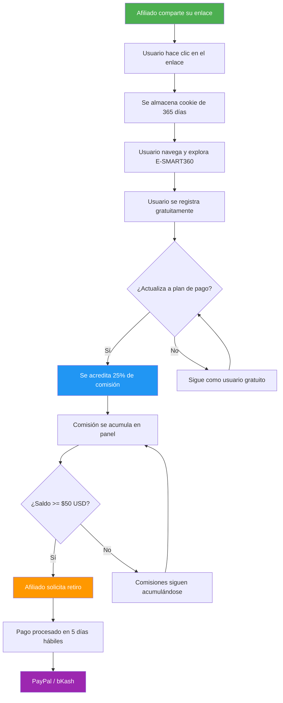

# Programa de Afiliados de E-SMART360

Última actualización: 15 de abril de 2026

Nos complace anunciar la apertura del Programa de Afiliados de E-SMART360. Lo hemos desarrollado como una forma de agradecer a todos los marketers que dedican su tiempo a recomendar E-SMART360 a sus amigos y seguidores. Como afiliado, recibirás comisiones por cada nueva cuenta premium o revendedora que se registre a través de tu enlace, así como por cualquier usuario de registro gratuito que posteriormente actualice a un plan premium o de revendedor.

Ser un socio afiliado de E-SMART360 es uno de los métodos más rápidos para aumentar tus ingresos y tu impacto en la industria del marketing con chatbots y automatización de WhatsApp.

<Callout type="info">
  **¿Sabías que...?** El Programa de Afiliados está disponible para cualquier persona mayor de 18 años, sin importar su país de residencia. Solo necesitas una cuenta activa en E-SMART360 y ganas de compartir la plataforma con tu audiencia. No hay costo de inscripción y puedes comenzar a generar comisiones desde el primer día.
</Callout>

## Gana el 25% de comisión recurrente por cada recomendación. De por vida.

Hablamos en serio sobre tu posición. Trabajas en marketing. Mueves cosas. Tienes influencia. Puedes comunicarte con las personas en tu círculo mucho más efectivamente de lo que nosotros podríamos.

Esto explica por qué tratamos bien a nuestros afiliados. Recibes un 25% de participación de la tarifa mensual por cada usuario que se registre a través de tu recomendación. Recibirás tu comisión de referencia mientras ellos sigan pagando sus suscripciones mensuales. No importa si es el mes 1 o el mes 60: mientras el cliente siga activo, tú sigues ganando.

<Callout type="success">
  **Ejemplo práctico:** Si recomiendas a 10 clientes que se suscriben a un plan de $79/mes cada uno, estarías ganando aproximadamente **$197.50 USD al mes** solo de esas referencias. En un año, eso son **$2,370 USD** en ingresos pasivos. ¡Y mientras ellos sigan siendo clientes, tú sigues ganando!
</Callout>

### ¿Cómo se calcula tu comisión?

| Tipo de referencia | Precio mensual | Tu comisión (25%) | 10 referidos | 50 referidos |
|-------------------|---------------|-------------------|-------------|-------------|
| Plan Premium | $79/mes | $19.75/mes | $197.50/mes | $987.50/mes |
| Plan Profesional | $149/mes | $37.25/mes | $372.50/mes | $1,862.50/mes |
| Plan Revendedor | $299/mes | $74.75/mes | $747.50/mes | $3,737.50/mes |
| Plan Enterprise | Personalizado | 25% del valor | Variable | Variable |

<Callout type="tip">
  **Estrategia recomendada:** Enfócate en recomendar a negocios que puedan escalar. Un cliente que comienza con un plan básico y luego migra a Enterprise te genera comisiones cada vez mayores sin necesidad de esfuerzo adicional de tu parte.
</Callout>

## Gran retorno por tu esfuerzo

¿Qué tan difícil es conseguir una recomendación?

Probemos esto: publicar en un grupo de Facebook, enviar un correo electrónico, o colocar un enlace en LinkedIn.

Cualquiera de estas actividades tiene el potencial de generar referidos y activar un flujo constante de dinero. La recompensa es enorme a pesar del mínimo esfuerzo.

### Escenarios de ingresos potenciales

Imagina que dedicas 5 horas a la semana a promocionar tu enlace de afiliado. En un escenario conservador, podrías generar:

- **Mes 1-3:** 3-5 referidos → $59.25 - $98.75/mes en comisiones
- **Mes 4-6:** 8-15 referidos → $158 - $296.25/mes en comisiones
- **Mes 7-12:** 20-40 referidos → $395 - $790/mes en comisiones
- **Año 2:** 50-100+ referidos → $987.50 - $1,975+/mes en comisiones

La clave está en la constancia y en la diversificación de canales.

<Tabs>
  <Tab title="Marketers digitales">
    Puedes incluir tu enlace de afiliado en tu firma de correo electrónico, en tus boletines informativos, en las descripciones de tus videos de YouTube o en tus publicaciones de blog. Cada clic puede convertirse en una comisión recurrente. También puedes crear landing pages dedicadas que comparen herramientas de automatización de WhatsApp y recomienden E-SMART360.
  </Tab>
  <Tab title="Agencias y consultores">
    Como agencia, puedes registrar a tus clientes bajo tu enlace de afiliado y generar ingresos pasivos mientras configuras y gestionas sus campañas de marketing por WhatsApp. Cada nuevo cliente que incorporas puede generar una comisión mensual sin esfuerzo adicional. Muchas agencias han convertido esto en su segunda fuente de ingresos más importante.
  </Tab>
  <Tab title="Creadores de contenido">
    Los reseñadores de SaaS, blogueros y youtubers pueden crear tutoriales, comparativas y guías que incluyan su enlace de afiliado, generando contenido valioso mientras monetizan su audiencia. Un solo video bien posicionado puede generar comisiones durante años gracias al sistema de cookies de 1 año.
  </Tab>
</Tabs>

<Expandable title="¿Puedo combinar el programa de afiliados con el programa de revendedores?">
  Sí. Muchos de nuestros partners comienzan como afiliados y luego migran al programa de revendedores cuando su volumen de clientes crece. El programa de revendedores ofrece márgenes más altos y la posibilidad de vender con tu propia marca (white label). Como revendedor, puedes personalizar la plataforma con tu logo, tu dominio y tus propios precios, lo que te permite construir tu propio negocio SaaS sin necesidad de desarrollar software desde cero. Consulta con nuestro equipo de partners para conocer los requisitos y beneficios de cada programa.
</Expandable>

## Métodos y reglas de pago

Puedes solicitar un retiro tan pronto como el saldo de tu cuenta de afiliado alcance los **$50 USD**. El pago se completará en un máximo de cinco días hábiles.

<Steps>
  <Step title="Acumula comisiones">
    Cada vez que alguien se registra a través de tu enlace y realiza un pago, el 25% se acredita automáticamente en tu panel de afiliado. Puedes monitorear tu saldo en tiempo real desde tu dashboard. Las comisiones se calculan sobre el pago neto recibido por E-SMART360, después de impuestos y tasas de procesamiento.
  </Step>
  <Step title="Alcanza el mínimo de pago">
    Cuando tu saldo llegue a $50 USD, el sistema te permitirá solicitar un retiro. No hay límite máximo de retiro, así que puedes acumular tus ganancias todo el tiempo que quieras si prefieres recibir pagos más grandes.
  </Step>
  <Step title="Solicita tu retiro">
    Desde tu panel de afiliado, haz clic en "Solicitar retiro". Verifica que tu información de pago esté correcta y confirma la solicitud. Recibirás un correo de confirmación.
  </Step>
  <Step title="Recibe tu pago">
    Procesamos los pagos en un plazo máximo de 5 días hábiles desde la solicitud. Recibirás una notificación por correo electrónico cuando el pago se haya completado. Los pagos se envían directamente a tu cuenta de PayPal o bKash, según tu método seleccionado.
  </Step>
</Steps>

<Callout type="info">
  **Ciclo de facturación y renovación:** Las comisiones se calculan al inicio de cada ciclo de facturación. Cuando un cliente referido renueva su suscripción mensual o anual, tu comisión se acredita automáticamente. No necesitas hacer nada para seguir ganando: el sistema lo maneja todo de forma automática.
</Callout>

Tus ganancias estarán disponibles para retiro a través de:

<Columns cols="2">
  <Card title="PayPal">
    Disponible para afiliados de cualquier país del mundo. Recibe tus comisiones directamente en tu cuenta de PayPal de forma rápida y segura. Los pagos se procesan en USD y pueden convertirse a tu moneda local según la tasa de cambio de PayPal.
  </Card>
  <Card title="bKash">
    Disponible exclusivamente para afiliados en Bangladesh. Método de pago local rápido y sin complicaciones. Ideal para afiliados que prefieren recibir sus comisiones en su cuenta móvil sin necesidad de cuentas bancarias internacionales.
  </Card>
</Columns>

<Callout type="warning">
  **Importante:** Asegúrate de que la información de tu cuenta de pago esté actualizada en tu panel de afiliado. Los pagos no procesados por datos incorrectos pueden retrasarse hasta el siguiente ciclo de pagos. Revisa tu información al menos una vez al mes.
</Callout>

### Preguntas frecuentes sobre pagos

<Expandable title="¿Puedo cambiar mi método de pago después de registrarme?">
  Sí. Puedes actualizar tu método de pago en cualquier momento desde la sección de configuración de tu panel de afiliado. Los cambios aplicarán para el siguiente ciclo de pago. Te recomendamos actualizar tu método de pago al menos 48 horas antes de solicitar un retiro para evitar demoras.
</Expandable>

<Expandable title="¿Qué sucede si no alcanzo los $50 USD en un mes?">
  No hay problema. Tu saldo se acumula mes tras mes hasta que alcances el mínimo de $50 USD. No hay fecha de caducidad para tus comisiones acumuladas, siempre que las referencias sigan activas. Puedes alcanzar el mínimo en tu primer mes si generas al menos 3 referidos a un plan premium.
</Expandable>

<Expandable title="¿Hay impuestos retenidos en los pagos?">
  Dependiendo de tu país de residencia, pueden aplicarse retenciones fiscales. E-SMART360 emite los reportes fiscales necesarios según las regulaciones aplicables. Te recomendamos consultar con un contador local para entender tus obligaciones fiscales como afiliado y asegurarte de declarar correctamente tus ingresos.
</Expandable>

<Expandable title="¿Las comisiones se pagan también por suscripciones anuales?">
  Sí. Si un referido elige un plan anual, recibirás el 25% del pago anual completo en el momento de la renovación anual. Esto significa que un referido a un plan Premium anual de $790 te generaría $197.50 USD en una sola transacción.
</Expandable>

## ¿Cómo me registro como socio afiliado?

Primero debes solicitar un enlace de afiliado; se te asignará una cuenta y un enlace después de la verificación. Podríamos solicitarte cierta información para confirmar tu estado como socio afiliado.

<Steps>
  <Step title="Inicia sesión o regístrate en E-SMART360">
    Accede a tu cuenta existente o crea una nueva cuenta gratuita. No necesitas tener un plan de pago para participar en el programa de afiliados. Una cuenta gratuita es suficiente para acceder al panel de afiliado y comenzar a generar tu enlace.
  </Step>
  <Step title="Accede a la sección de Afiliados">
    Desde tu panel de control, haz clic en la sección "Programa de Afiliados" que encontrarás en el menú superior derecho. Allí verás un formulario para enviar tu solicitud con los campos necesarios para la verificación.
  </Step>
  <Step title="Completa el formulario de solicitud">
    Proporciona la información solicitada: tus datos de contacto, cómo planeas promocionar E-SMART360, tus redes sociales o plataformas principales, y una breve descripción de tu audiencia. Cuanto más completa sea tu solicitud, más rápido será el proceso de aprobación.
  </Step>
  <Step title="Espera la aprobación">
    El equipo de E-SMART360 revisará tu solicitud en un plazo máximo de 24 horas hábiles. Recibirás una notificación automática por correo electrónico cuando tu cuenta sea aprobada. En algunos casos, podemos solicitar información adicional para verificar tu identidad.
  </Step>
  <Step title="Obtén tu enlace de afiliado">
    Una vez aprobado, accede a tu panel de afiliado. En la sección de configuración encontrarás tu enlace de afiliado único listo para compartir. Puedes copiarlo directamente o usar las herramientas de compartir integradas para redes sociales.
  </Step>
</Steps>

<Callout type="tip">
  **Consejo:** Prepara con anticipación una breve descripción de cómo piensas promocionar la plataforma. Las solicitudes que incluyen detalles específicos sobre estrategias de promoción tienden a procesarse más rápido. Menciona si tienes audiencia en YouTube, un blog con tráfico orgánico, o una lista de correos activa.
</Callout>

## Sistema de atribución de clics

**Método utilizado:** Último clic ganador (Last Click Wins). Esto significa que el último afiliado cuyo enlace fue clickeado por el visitante antes de registrarse recibe el crédito de la comisión.

**Vigencia de la cookie:** 1 año de validez desde el momento del clic. Si un usuario hace clic en tu enlace hoy y se registra hasta 12 meses después, ¡aún recibes la comisión!

<Callout type="info">
  **¿Cómo funciona la cookie de 1 año?** Cuando un usuario potencial hace clic en tu enlace de afiliado, se almacena una cookie en su navegador con una validez de 365 días. Esta cookie contiene un identificador único vinculado a tu cuenta de afiliado. Cuando ese usuario finalmente se registra (incluso meses después), el sistema detecta la cookie y te acredita la comisión automáticamente. No importa si el usuario no recuerda haber hecho clic en tu enlace: el sistema lo rastrea por ti.
</Callout>

### Estrategias para maximizar tus comisiones con la cookie de 1 año

- **Crea contenido perenne:** Un artículo de blog o un video tutorial puede seguir generando clics y referidos durante meses sin necesidad de actualizarlo. El contenido de tipo "guía completa" o "tutorial paso a paso" tiende a mantener su relevancia por más tiempo.
- **Usa múltiples canales:** No dependas de una sola plataforma. Combina LinkedIn, YouTube, tu blog y grupos de Facebook para diversificar tus fuentes de tráfico. Cada canal tiene su propia audiencia y dinámica.
- **Haz seguimiento:** Si alguien muestra interés pero no se registra, no pierdas la esperanza. La cookie de 1 año significa que pueden volver meses después y aún así recibirás la comisión. Puedes hacer un seguimiento amable ofreciendo más información o recursos gratuitos.
- **Ofrece valor primero:** Comparte guías, consejos y casos de uso reales. Cuando las personas obtienen valor gratuito de ti, confían más en tus recomendaciones y es más probable que usen tu enlace cuando estén listas para registrarse.

<Expandable title="¿Qué pasa si la cookie de otro afiliado es más reciente que la mía?">
  Con el modelo de "Último clic ganador", el afiliado cuyo enlace fue el último en ser clickeado antes del registro recibe la comisión. Si compartes tu enlace estratégicamente cerca del momento en que el prospecto está listo para registrarse, aumentas tus probabilidades de quedarte con la comisión. Por eso es recomendable compartir tu enlace en el momento justo, cuando el interés del prospecto está en su punto más alto.
</Expandable>

## Estrategias avanzadas de promoción para afiliados

### 1. Marketing de contenidos

El contenido educativo y útil atrae tráfico orgánico de alta calidad. Aquí tienes algunas ideas para crear contenido que convierta:

<Columns cols="3">
  <Card title="Tutoriales en video">
    Crea videos paso a paso mostrando cómo configurar un chatbot de WhatsApp con E-SMART360. Incluye tu enlace de afiliado en la descripción y en los comentarios fijados. Los tutoriales prácticos son el tipo de contenido que mejor convierte en el espacio SaaS.
  </Card>
  <Card title="Casos de éxito">
    Publica estudios de caso detallados mostrando cómo un negocio real aumentó sus ventas, mejoró su atención al cliente o automatizó sus procesos usando E-SMART360 gracias a tu recomendación. Incluye métricas concretas: aumento en tasa de conversión, reducción en tiempo de respuesta, etc.
  </Card>
  <Card title="Comparativas y reseñas">
    Los usuarios buscan activamente comparativas antes de comprar. Una reseña honesta y detallada de E-SMART360 puede convertirte en su referencia de confianza. Compara funcionalidades, precios, facilidad de uso y soporte con otras herramientas del mercado.
  </Card>
</Columns>

**Ejemplo de estructura para un artículo de blog efectivo:**

1. Título que capture la atención: "Cómo automatizar tus ventas por WhatsApp en 2026 [Guía Completa]"
2. Introducción que identifique el problema del lector
3. Solución paso a paso usando E-SMART360 (con capturas de pantalla)
4. Resultados y beneficios concretos
5. Llamado a la acción con tu enlace de afiliado
6. Sección de preguntas frecuentes para resolver objeciones comunes

### 2. Publicidad pagada

Si tienes experiencia en anuncios, puedes promocionar tu enlace de afiliado de forma rentable:

- **Anuncios en Google:** Palabras clave como "chatbot WhatsApp", "automatización WhatsApp marketing", "herramienta WhatsApp Business API" o "software de marketing para WhatsApp". El CPC (costo por clic) en estas keywords suele ser moderado y el ROI puede ser excelente si tu página de destino está bien optimizada.
- **Anuncios en redes sociales:** Facebook, Instagram y LinkedIn permiten segmentar audiencias interesadas en marketing digital, automatización y comercio electrónico. Puedes crear públicos personalizados basados en intereses específicos.
- **Campañas de retargeting:** Muestra anuncios a quienes ya visitaron tu contenido sobre E-SMART360 pero no se registraron. El retargeting suele tener tasas de conversión más altas que la publicidad fría.
- **Anuncios en YouTube:** Los anuncios in-stream pueden dirigir tráfico a tu video tutorial o reseña de E-SMART360.

<Callout type="warning">
  **Importante:** Revisa las políticas de publicidad de cada plataforma. Algunas redes sociales tienen restricciones sobre cómo promocionar enlaces de afiliado. Asegúrate de cumplir con sus términos de servicio y de revelar tu relación de afiliado cuando sea requerido por las regulaciones de cada país (como la FTC en Estados Unidos).
</Callout>

### 3. Email marketing y newsletters

Tu lista de correos es uno de tus activos más valiosos como afiliado:

- Incluye recomendaciones de E-SMART360 en tus newsletters regulares, pero hazlo de forma orgánica, no como un anuncio frío
- Crea una secuencia de emails automatizada para leads interesados en automatización de WhatsApp: día 1 (introducción), día 3 (beneficios), día 7 (caso de uso), día 14 (caso de éxito), día 21 (llamado a la acción)
- Ofrece bonificaciones exclusivas a tus suscriptores que se registren a través de tu enlace
- Segmenta tu lista: los leads que han mostrado interés en marketing digital o herramientas SaaS son los más propensos a convertir

<Expandable title="¿Puedo ofrecer bonificaciones adicionales a mis referidos?">
  Sí, siempre que no contradigan los términos del programa de afiliados. Por ejemplo, puedes ofrecer una plantilla gratuita de chatbot, una consultoría de 30 minutos, un ebook exclusivo sobre estrategias de WhatsApp marketing, o acceso a una comunidad privada como incentivo adicional para que las personas se registren a través de tu enlace. Las bonificaciones bien pensadas pueden aumentar significativamente tu tasa de conversión.
</Expandable>

### 4. Estrategia multicanal combinada

La estrategia más efectiva combina varios canales de forma sinérgica:

| Canal | Propósito | Frecuencia recomendada |
|-------|-----------|----------------------|
| Blog / YouTube | Atraer tráfico orgánico | 1-2 publicaciones por semana |
| Email marketing | Nutrir leads | 1-2 emails por semana |
| Redes sociales | Difusión y engagement | 3-5 publicaciones por semana |
| Publicidad pagada | Escalar resultados | Según presupuesto |
| Comunidades (grupos, foros) | Autoridad y confianza | Participación diaria |

<Callout type="success">
  **Dato relevante:** Los afiliados que utilizan al menos 3 canales diferentes para promocionar E-SMART360 generan en promedio 5 veces más comisiones que aquellos que usan un solo canal. La diversificación no solo aumenta tus ingresos, sino que también los hace más estables: si un canal deja de funcionar, los otros continúan generando.
</Callout>

## Panel de control del afiliado

Una vez aprobado, tendrás acceso a un panel de control completo donde podrás gestionar todo tu programa de afiliados desde un solo lugar:

| Característica | Descripción |
|---------------|-------------|
| **Enlace de afiliado** | Tu enlace único para compartir en cualquier plataforma. Puedes generar múltiples enlaces para rastrear el rendimiento de diferentes campañas. |
| **Estadísticas en tiempo real** | Número de clics, registros gratuitos, conversiones a pago y tasa de conversión general. Datos actualizados en tiempo real. |
| **Ganancias** | Saldo actual disponible, comisiones pendientes de aprobación, historial de pagos recibidos y proyecciones. |
| **Historial de referidos** | Lista completa de usuarios que se registraron a través de tu enlace, con estado de su suscripción y comisiones generadas. |
| **Configuración de pago** | Actualiza tu método de cobro (PayPal o bKash), datos fiscales y preferencias de notificación. |
| **Material promocional** | Banners en múltiples tamaños, imágenes para redes sociales, textos sugeridos para diferentes plataformas y gráficos comparativos. |

### Cómo interpretar tus estadísticas

- **Tasa de clics (CTR):** Porcentaje de personas que hacen clic en tu enlace respecto a las que lo ven. Un CTR saludable está entre 2% y 5%.
- **Tasa de conversión:** Porcentaje de personas que se registran (gratis o de pago) respecto a las que hacen clic. Una buena tasa de conversión está entre 5% y 15%.
- **Valor promedio por referido:** Calcula tus ganancias totales divididas por el número de referidos activos. Esto te ayuda a entender qué planes están generando más valor.
- **Período de retención:** Monitorea cuánto tiempo permanecen activos tus referidos. Una retención alta significa comisiones más estables a largo plazo.

<Callout type="tip">
  **Datapoint clave:** Revisa tu panel al menos una vez por semana. Identifica qué canales están generando más clics y conversiones, y enfoca tus esfuerzos en aquellos que muestren mejor rendimiento. No tengas miedo de dejar de invertir tiempo en canales que no están funcionando.
</Callout>

## Beneficios adicionales para afiliados activos

Los afiliados que mantienen un rendimiento constante pueden acceder a beneficios exclusivos:

- **Soporte prioritario:** Acceso a un canal de soporte dedicado para afiliados con respuestas en menos de 4 horas
- **Acceso anticipado a funciones:** Conoce y prueba las nuevas funcionalidades antes de que se lancen al público general
- **Bonificaciones por rendimiento:** Posibilidad de aumentar tu porcentaje de comisión al alcanzar ciertos umbrales de referidos mensuales
- **Invitaciones a eventos exclusivos:** Webinars, masterclasses y eventos de networking con otros afiliados top
- **Contenido promocional personalizado:** Material de marketing diseñado específicamente para tu audiencia y nicho

<Expandable title="¿Cuáles son los umbrales para aumentar mi comisión?">
  Actualmente, los afiliados que generan más de 20 referidos en un mes calendario pueden optar a un aumento de comisión del 25% al 30%. Para más de 50 referidos mensuales, la comisión puede llegar al 35%. Estos umbrales y beneficios están sujetos a revisión periódica. Consulta con tu gestor de afiliados para conocer las condiciones actuales.
</Expandable>

## ¿Quién debería unirse al programa?

Este programa es ideal para una amplia variedad de perfiles profesionales:

<Columns cols="2">
  <Card title="Marketers digitales">
    Especialistas en marketing que buscan diversificar sus fuentes de ingresos mientras recomiendan una herramienta de valor real para sus clientes y audiencia. Ideal para quienes ya trabajan con herramientas de automatización y pueden integrar E-SMART360 en sus recomendaciones habituales.
  </Card>
  <Card title="Reseñadores de SaaS">
    Creadores de contenido especializados en reseñas de software que pueden probar, evaluar y recomendar E-SMART360 con total credibilidad. El contenido de reseñas detalladas tiene una alta tasa de conversión porque los lectores ya están en modo de investigación de compra.
  </Card>
  <Card title="Blogueros y YouTubers">
    Cualquier creador de contenido que genere tutoriales, guías o análisis sobre herramientas de marketing, automatización o comercio electrónico. Un solo artículo o video bien posicionado puede generar tráfico y comisiones durante años.
  </Card>
  <Card title="Dueños de agencias">
    Agencias de marketing digital que pueden incluir E-SMART360 como parte de su stack tecnológico recomendado para clientes. Cada nuevo cliente de la agencia puede convertirse en una fuente de ingresos pasivos adicionales.
  </Card>
  <Card title="Consultores de chatbots y automatización">
    Expertos en automatización que asesoran a negocios y pueden generar ingresos recurrentes adicionales por cada implementación. La comisión del 25% se suma a tus honorarios de consultoría.
  </Card>
  <Card title="Influencers en automatización y negocios">
    Líderes de opinión en el espacio de automatización empresarial, marketing digital y comercio electrónico que buscan monetizar su influencia de forma ética y sostenible con ingresos recurrentes.
  </Card>
</Columns>

## Cómo integrar tu enlace de afiliado con herramientas de E-SMART360

Como afiliado, también puedes usar las propias herramientas de E-SMART360 para promocionar la plataforma de forma más efectiva:

<Steps>
  <Step title="Crea contenido automatizado con chatbots">
    Configura un chatbot en tu sitio web que responda preguntas sobre automatización de WhatsApp y al final recomiende E-SMART360 con tu enlace de afiliado incluido en el mensaje de despedida.
  </Step>
  <Step title="Usa la función de broadcasting">
    Si tienes una lista de contactos interesados en marketing digital, puedes enviarles un mensaje broadcast informativo (no spam) mencionando los beneficios de E-SMART360 con tu enlace de afiliado. Recuerda siempre obtener consentimiento y seguir las políticas de WhatsApp para broadcasting.
  </Step>
  <Step title="Automatiza seguimientos con workflows">
    Crea un workflow automatizado que envíe una serie de mensajes educativos sobre automatización de WhatsApp a lo largo de varios días, culminando con tu recomendación y enlace de afiliado.
  </Step>
  <Step title="Comparte tu enlace en tu firma de correo">
    Agrega tu enlace de afiliado en la firma de tu correo electrónico profesional. Cada correo que envías es una oportunidad de generar una comisión.
  </Step>
</Steps>

<Expandable title="¿Puedo crear contenido sobre funciones específicas de E-SMART360 para promocionar mi enlace?">
  Absolutamente. De hecho, recomendamos enfocarse en funciones específicas en lugar de promocionar la plataforma de forma genérica. Por ejemplo, puedes crear un tutorial sobre "Cómo automatizar el envío de facturas por WhatsApp" o "Cómo recuperar carritos abandonados automáticamente". El contenido específico suele tener mejor rendimiento porque atrae a personas que ya tienen una necesidad concreta.
</Expandable>

## Preguntas frecuentes

<Expandable title="¿Cuánta comisión puedo ganar con el Programa de Afiliados de E-SMART360?">
  Ganas el 25% de comisión recurrente de por vida por cada referencia exitosa a un plan premium o de revendedor que se registre a través de tu enlace de afiliado. Esto significa que mientras el cliente siga pagando su suscripción, tú sigues recibiendo tu comisión mes tras mes, año tras año.
</Expandable>

<Expandable title="¿Gano comisión si alguien se registra primero gratis?">
  Sí. Si un usuario se registra para una cuenta gratuita usando tu enlace y luego actualiza a un plan de pago (incluso meses después), igual recibirás la comisión correspondiente. La cookie de 1 año garantiza que tu referido quede registrado aunque la conversión a pago no sea inmediata.
</Expandable>

<Expandable title="¿Cuál es el monto mínimo de pago?">
  Puedes solicitar un retiro una vez que el saldo de tu cuenta de afiliado alcance los $50 USD. No hay límite máximo, así que puedes acumular todo lo que quieras antes de solicitar tu primer pago.
</Expandable>

<Expandable title="¿Cómo recibiré mi pago de afiliado?">
  Actualmente soportamos pagos a través de:
  - **PayPal** (disponible globalmente para afiliados de cualquier país)
  - **bKash** (solo para Bangladesh)
  
  Los pagos generalmente se procesan dentro de los 5 días hábiles posteriores a la solicitud. Recibirás una notificación por correo electrónico cuando el pago se haya completado.
</Expandable>

<Expandable title="¿Cómo me registro en el Programa de Afiliados?">
  Para unirte:
  1. Regístrate o inicia sesión en E-SMART360 (puedes usar una cuenta gratuita)
  2. Ve a la sección del Programa de Afiliados desde tu panel de control
  3. Completa el formulario de solicitud con tu información y estrategia de promoción
  4. Espera la aprobación del equipo (generalmente dentro de 24 horas hábiles)
  
  Una vez aprobado, recibirás tu panel de afiliado completo con tu enlace de referencia único.
</Expandable>

<Expandable title="¿Cómo funciona el seguimiento de referidos?">
  E-SMART360 utiliza un modelo de atribución de "Último clic ganador". Esto significa que el afiliado cuyo enlace fue clickeado más recientemente antes del registro recibe el crédito de la comisión. El sistema de tracking es automático y preciso, usando cookies y parámetros URL.
</Expandable>

<Expandable title="¿Cuánto dura la cookie de afiliado?">
  Las cookies de afiliado tienen una validez de 1 año completo (365 días). Esto significa que tus referidos se rastrean hasta por 12 meses después de que alguien hace clic en tu enlace. Es una de las ventanas de atribución más generosas del mercado.
</Expandable>

<Expandable title="¿Hay algún costo para unirse al programa de afiliados?">
  No. Unirse al Programa de Afiliados de E-SMART360 es completamente gratuito. No hay cuotas de inscripción, tarifas mensuales ni costos ocultos. Solo necesitas una cuenta gratuita en la plataforma para comenzar.
</Expandable>

<Expandable title="¿Puedo participar desde cualquier país?">
  Sí, el programa de afiliados está abierto a participantes de cualquier país del mundo. Sin embargo, los métodos de pago disponibles pueden variar según tu ubicación geográfica. PayPal está disponible globalmente, mientras que bKash es exclusivo para Bangladesh. Si tu país no tiene acceso a PayPal, por favor contáctanos para explorar opciones alternativas.
</Expandable>

<Expandable title="¿Puedo usar mi enlace de afiliado para registrarme a mí mismo?">
  No. Las autogeneraciones de referidos están prohibidas y cualquier intento de registrarse a sí mismo o crear cuentas falsas para generar comisiones resultará en la desactivación inmediata de tu cuenta de afiliado y la cancelación de todas las comisiones acumuladas. El programa está diseñado para recompensar la promoción genuina.
</Expandable>

<Expandable title="¿Qué sucede si un cliente referido cancela su suscripción?">
  Si un cliente referido cancela su suscripción, dejarás de recibir comisiones por ese cliente a partir del siguiente ciclo de facturación. Si el cliente se reincorpora posteriormente, tu comisión se reanudará automáticamente si aún está dentro del período de vigencia de tu cookie de afiliado.
</Expandable>

<Expandable title="¿Puedo promocionar mi enlace en plataformas de cupones y ofertas?">
  Generalmente no recomendamos plataformas de cupones, ya que tienden a atraer tráfico de baja calidad con poca intención de compra. Además, muchas plataformas de cupones tienen políticas que entran en conflicto con nuestros términos de afiliado. Es mejor enfocarse en contenido educativo y recomendaciones genuinas que atraigan leads calificados.
</Expandable>

<Expandable title="¿Puedo tener múltiples enlaces de afiliado para diferentes campañas?">
  Sí, desde tu panel de afiliado puedes generar múltiples enlaces con diferentes parámetros de seguimiento. Esto te permite rastrear el rendimiento de cada canal o campaña por separado y saber exactamente qué estrategias están funcionando mejor.
</Expandable>

## Aspectos legales y cumplimiento normativo

Como afiliado de E-SMART360, es importante que cumplas con las regulaciones aplicables en tu país:

### Divulgación de relación de afiliado

En muchos países (incluyendo Estados Unidos, Reino Unido y la Unión Europea), las leyes de protección al consumidor requieren que divulges tu relación de afiliado cuando promocionas productos a cambio de comisiones. Esto significa que debes informar claramente a tu audiencia cuando un enlace es un enlace de afiliado.

**Ejemplos de divulgación:**

- "Este enlace es un enlace de afiliado. Si realizas una compra a través de él, puedo recibir una comisión sin costo adicional para ti."
- "#afiliado" o "#ad" en redes sociales
- Un aviso al inicio de artículos de blog: "Este artículo contiene enlaces de afiliado."

### Prácticas prohibidas

- **Spam:** No está permitido enviar mensajes no solicitados (spam) promocionando tu enlace de afiliado.
- **Publicidad engañosa:** No puedes hacer afirmaciones falsas o exageradas sobre las capacidades de E-SMART360.
- **Uso de marcas registradas:** No puedes registrar dominios que incluyan "E-SMART360" o variaciones para redirigir tráfico.
- **Suplantación:** No puedes hacerte pasar por un representante oficial de E-SMART360.

<Callout type="warning">
  El incumplimiento de estas normas puede resultar en la desactivación inmediata de tu cuenta de afiliado sin derecho a reclamar comisiones pendientes. Promociona de forma ética y transparente.
</Callout>

## Plan de acción: De cero a tu primer pago en 30 días

Si estás comenzando desde cero, aquí tienes un plan paso a paso para obtener tu primer pago de $50 USD en los primeros 30 días:

### Semana 1: Preparación y configuración

- Regístrate en E-SMART360 y solicita tu enlace de afiliado
- Configura tu panel de afiliado y verifica tus datos de pago
- Identifica tu nicho y audiencia objetivo
- Prepara tu estrategia de contenido: elige 2-3 canales principales

### Semana 2: Creación de contenido inicial

- Publica tu primer artículo o video: "¿Por qué usar E-SMART360 para automatizar WhatsApp?"
- Comparte en 2-3 grupos o comunidades relevantes (con valor, no solo el enlace)
- Agrega tu enlace de afiliado a tu firma de correo electrónico
- Crea una publicación en LinkedIn o Twitter explicando tu experiencia

### Semana 3: Expansión y seguimiento

- Publica un segundo contenido más detallado (tutorial, caso práctico)
- Envía un email a tu lista (si tienes una) recomendando E-SMART360
- Participa en conversaciones en foros y grupos respondiendo preguntas sobre automatización
- Monitorea tus estadísticas en el panel de afiliado

### Semana 4: Optimización y escalado

- Identifica qué contenido está generando más clics y crea más contenido similar
- Si tienes presupuesto, prueba con una campaña pequeña de anuncios
- Haz seguimiento a leads interesados que aún no se han registrado
- Solicita tu primer pago si alcanzaste los $50 USD

<Callout type="success">
  **Meta realista:** Con 2-3 referidos a planes premium en tu primer mes, ya habrás alcanzado el mínimo de $50 USD para tu primer pago. Muchos afiliados logran esto en su primera semana si ya tienen una audiencia establecida.
</Callout>

## Términos de servicio del programa de afiliados

Es importante que conozcas y aceptes los términos que rigen el programa:

1. **Elegibilidad:** Debes ser mayor de 18 años y tener una cuenta activa en E-SMART360.
2. **Comisiones:** Se pagan mensualmente mientras el referido mantenga una suscripción activa y al día.
3. **Atribución:** Se utiliza el modelo de último clic ganador con cookies de 365 días.
4. **Pagos:** Se procesan dentro de 5 días hábiles después de la solicitud, una vez alcanzado el mínimo de $50 USD.
5. **Prohibiciones:** No spam, no autogeneración, no publicidad engañosa, no uso no autorizado de marcas.
6. **Modificaciones:** E-SMART360 se reserva el derecho de modificar los términos del programa con previo aviso.
7. **Rescisión:** Cualquier violación de los términos puede resultar en la terminación inmediata de la participación en el programa.

<Callout type="info">
  Para conocer los términos completos y actualizados del Programa de Afiliados, consulta la política oficial en nuestro sitio web. Te recomendamos leerla detenidamente antes de comenzar a promocionar.
</Callout>

## Recursos adicionales para afiliados

### Material promocional disponible

Como afiliado, tendrás acceso a:

- **Banners publicitarios** en múltiples tamaños (728x90, 300x250, 160x600, etc.)
- **Imágenes para redes sociales** optimizadas para Facebook, Instagram, LinkedIn y Twitter
- **Textos sugeridos** para diferentes plataformas y formatos
- **Logos y recursos gráficos** de E-SMART360 en alta resolución
- **Guías y tutorials** sobre cómo promocionar efectivamente

### Canales de soporte para afiliados

| Canal | Disponibilidad | Tiempo de respuesta |
|-------|---------------|-------------------|
| Email de soporte para afiliados | 24/7 | 24 horas hábiles |
| Chat en vivo (disponible en panel) | Horario laboral | Inmediato |
| Centro de ayuda para afiliados | 24/7 | Autoservicio |
| Comunidad de afiliados | 24/7 | Según participación |

## Conclusión

El Programa de Afiliados de E-SMART360 es una oportunidad única para generar ingresos pasivos recurrentes mientras ayudas a negocios y profesionales a descubrir una plataforma que puede transformar su comunicación con clientes a través de WhatsApp. Con un 25% de comisión recurrente de por vida, una cookie de atribución de 1 año y un proceso de registro simple y gratuito, es uno de los programas de afiliados más atractivos en el espacio de automatización de marketing.

Ya seas marketer digital, creador de contenido, dueño de agencia o consultor, el programa está diseñado para recompensar tu influencia y esfuerzo de manera justa y sostenible.

<Callout type="tip">
  **¿Listo para comenzar?** Regístrate hoy en E-SMART360, solicita tu enlace de afiliado y empieza a compartir con tu audiencia. Las primeras comisiones están más cerca de lo que crees. ¡Te esperamos en el programa!
</Callout>

## Tabla comparativa: Programa de Afiliados vs Otros Modelos de Ingreso

| Aspecto | Afiliado E-SMART360 | Marketing de Afiliados Tradicional | Venta de Productos Propios |
|---------|--------------------|-----------------------------------|--------------------------|
| Inversión inicial | $0 | $0 - $100+ | $500 - $10,000+ |
| Ingreso recurrente | ✅ 25% de por vida | ❌ Generalmente único | ✅ Depende del modelo |
| Esfuerzo inicial | Bajo-medio | Bajo-medio | Alto |
| Tiempo para primer ingreso | 1-4 semanas | 1-4 semanas | 3-12 meses |
| Soporte de producto | Incluido | No incluido | Debes crearlo tú |
| Riesgo | Mínimo | Mínimo | Alto |
| Escalabilidad | Alta | Alta | Media |

## Preguntas técnicas sobre el seguimiento de afiliados

<Expandable title="¿Qué tecnologías usa E-SMART360 para el tracking de afiliados?">
  Utilizamos un sistema de tracking basado en cookies HTTP con parámetros URL únicos. Cada enlace de afiliado contiene un identificador cifrado que el sistema reconoce cuando un usuario se registra. El sistema también soporta tracking a través de API para integraciones avanzadas con plataformas de terceros.
</Expandable>

<Expandable title="¿Los enlaces de afiliado funcionan en dispositivos móviles y apps?">
  Sí. Los enlaces de afiliado están optimizados para funcionar en todos los dispositivos: desktop, tablets y smartphones. También son compatibles con la mayoría de navegadores móviles y apps que abren enlaces web.
</Expandable>

<Expandable title="¿Puedo integrar mi enlace de afiliado con herramientas como Google Analytics?">
  Sí. Puedes usar Google Analytics, Bitly, o cualquier otra herramienta de seguimiento para monitorizar el rendimiento de tus campañas. Solo asegúrate de que el enlace final redirija a tu enlace de afiliado de E-SMART360 para que el tracking funcione correctamente.
</Expandable>

<Expandable title="¿El bloqueador de anuncios afecta el tracking de afiliados?">
  No. Nuestro sistema de tracking no depende de scripts de terceros ni de tecnologías que los bloqueadores de anuncios suelen bloquear. El tracking se realiza a través del parámetro URL y la cookie del navegador, que no son afectados por la mayoría de bloqueadores.
</Expandable>

## Actualizaciones y novedades del programa

<Update title="Mejora en panel de afiliados" date="2026-04-01">
  Se ha actualizado el panel de afiliados con nuevas métricas: tasa de conversión por canal, valor de vida estimado del cliente (LTV) y proyecciones de ingresos a 6 y 12 meses.
</Update>

<Update title="Nuevo material promocional" date="2026-03-15">
  Se agregaron 15 nuevos banners y 20 plantillas de publicaciones para redes sociales al repositorio de material promocional para afiliados.
</Update>

<Update title="Extensión de vigencia de cookie" date="2026-01-10">
  La vigencia de la cookie de afiliado se ha extendido de 6 meses a 1 año completo, dando a los afiliados más tiempo para convertir sus referidos.
</Update>

---

## Diagrama del ciclo de comisiones de afiliados

## Plantillas de mensajes promocionales para afiliados

Para ayudarte a comenzar, aquí tienes plantillas que puedes adaptar para diferentes plataformas:

### Plantilla para LinkedIn

> 📢 **Descubrí una herramienta increíble para automatizar WhatsApp**
> 
> Después de probar varias opciones, encontré E-SMART360, una plataforma que permite crear chatbots inteligentes, enviar broadcasting masivo y gestionar conversaciones de WhatsApp Business API todo desde un solo lugar.
> 
> Lo que más me gustó:
> ✅ Configuración sin código
> ✅ Integración con Shopify, WooCommerce y Google Sheets
> ✅ Chatbots con IA para atención 24/7
> ✅ Panel de control intuitivo
> 
> Si estás buscando automatizar tu comunicación por WhatsApp, te recomiendo probarlo. 👇
> [Tu enlace de afiliado]

### Plantilla para Twitter/X

> ¿Sigues respondiendo manualmente en WhatsApp? 🤯
> 
> Con E-SMART360 puedes automatizar tus respuestas, enviar campañas masivas y gestionar tu catálogo de productos. Todo desde una plataforma fácil de usar.
> 
> Pruébalo gratis aquí 👉 [Tu enlace de afiliado]

### Plantilla para grupos de Facebook

> **Recomendación:** Para los que manejan negocios con WhatsApp, les comparto E-SMART360. Es una plataforma que permite:
> 
> • Automatizar respuestas con chatbots
> • Enviar mensajes masivos sin ser bloqueado
> • Integrar catálogo de productos
> • Conectar con Shopify, WooCommerce y más
> • Usar IA para atención al cliente
> 
> Llevo usándolo un tiempo y los resultados son muy buenos. Tienen plan gratuito. 👇
> [Tu enlace de afiliado]

### Plantilla para Email Marketing (Newsletter)

> **Asunto:** La herramienta que está revolucionando el marketing por WhatsApp
> 
> Hola [Nombre],
> 
> Últimamente he estado probando E-SMART360 para automatizar la comunicación por WhatsApp de mis clientes, y quería compartirte mi experiencia.
> 
> **¿Qué hace E-SMART360?**
> Es una plataforma todo-en-uno que te permite crear chatbots, enviar broadcasting, gestionar tu catálogo de productos y atender clientes desde una bandeja compartida, todo integrado con WhatsApp Business API.
> 
> **Resultados que he visto:**
> • Reducción del 80% en tiempo de respuesta
> • Aumento del 35% en tasa de conversión
> • Ahorro de 15+ horas semanales en atención al cliente
> 
> **¿Quieres probarlo?** Tienen un plan gratuito y puedes empezar en 5 minutos.
> [Tu enlace de afiliado]
> 
> ¡Saludos,
> [Tu nombre]

## Guía de mejores prácticas para promocionar tu enlace

### 1. Sé transparente sobre tu relación de afiliado

La honestidad genera confianza. Cuando tu audiencia sabe que ganarás una comisión si se registran a través de tu enlace, confiarán más en tu recomendación porque entenderán que realmente crees en el producto.

### 2. Usa tu propia experiencia

Comparte casos reales de cómo has usado E-SMART360. La autenticidad vende más que cualquier guion de ventas. Si has resuelto un problema específico con la plataforma, compártelo.

### 3. Sé consistente, no agresivo

No necesitas publicar tu enlace todos los días. Enfócate en crear contenido valioso de forma consistente y tu enlace estará ahí cuando las personas estén listas para actuar.

### 4. Responde preguntas genuinas

Participa en comunidades y responde preguntas relacionadas con automatización de WhatsApp. Cuando alguien pregunte "¿qué herramienta recomiendas?", tendrás una oportunidad orgánica de compartir tu enlace.

### 5. Crea contenido comparativo

Las comparativas honestas entre E-SMART360 y otras herramientas son extremadamente efectivas porque ayudan a los usuarios indecisos a tomar una decisión informada.

<Columns cols="2">
  <Card title="Ejemplo: Contenido que funciona">
    "Cómo configuré un chatbot de WhatsApp para mi tienda online en 15 minutos usando E-SMART360 (tutorial paso a paso)"
    
    Este tipo de contenido es valioso porque:
    - Resuelve un problema específico
    - Muestra el producto en acción
    - Es educativo y útil independientemente
    - Incluye naturalmente el enlace de afiliado
  </Card>
  <Card title="Ejemplo: Contenido que NO funciona">
    "Gana dinero fácil con este enlace de afiliado"
    
    Este tipo de contenido no funciona porque:
    - No aporta valor real
    - Parece publicidad agresiva
    - No genera confianza
    - Baja tasa de clics y conversión
  </Card>
</Columns>

## Estrategias de promoción por tipo de audiencia

### Para audiencia de dueños de pequeños negocios

Los pequeños negocios buscan soluciones prácticas que ahorren tiempo. Enfócate en:

- Automatización de respuestas frecuentes (FAQ)
- Envío de notificaciones de pedidos por WhatsApp
- Recuperación de carritos abandonados
- Ahorro de tiempo en atención al cliente
- Integración sencilla con herramientas que ya usan (Shopify, WooCommerce)

**Mensaje clave:** "Automatiza tu WhatsApp en minutos sin necesidad de programar"

### Para audiencia de agencias y consultores

Este perfil busca escalar sus operaciones y ofrecer más valor a sus clientes. Enfócate en:

- Funcionalidades multi-cliente
- Panel de administración centralizado
- Capacidades de branding (white label)
- Reportes y analíticas avanzadas
- API y webhooks para integraciones personalizadas

**Mensaje clave:** "Ofrece automatización de WhatsApp a todos tus clientes desde un solo panel"

### Para audiencia de creadores de contenido digital

Los creadores buscan monetizar su contenido. Enfócate en:

- Ingresos pasivos recurrentes
- Facilidad de promoción (sin necesidad de soporte técnico)
- Comisiones atractivas (25% recurrente)
- Cookie de 1 año
- Material promocional listo para usar

**Mensaje clave:** "Convierte tu contenido en una máquina de ingresos pasivos"

### Para audiencia de empresas y medianos negocios

Las empresas necesitan soluciones robustas y escalables. Enfócate en:

- Cumplimiento con WhatsApp Business API oficial
- Soporte técnico prioritario
- Funcionalidades avanzadas (flows, catálogo, pagos)
- Seguridad y confiabilidad de la plataforma
- Capacidad de manejar alto volumen de mensajes

**Mensaje clave:** "La solución empresarial para comunicación por WhatsApp que estabas buscando"

## Métricas clave que debes monitorear como afiliado

### Indicadores principales

1. **Impresiones:** Cuántas personas ven tu contenido con el enlace
2. **Clics:** Cuántas personas hacen clic en tu enlace
3. **Tasa de clics (CTR):** (Clics / Impresiones) × 100. Ideal: 2-5%
4. **Registros gratuitos:** Cuántas personas se registran (no pagan aún)
5. **Conversiones a pago:** Cuántos registros gratuitos se convierten en clientes de pago
6. **Tasa de conversión:** (Conversiones / Clics) × 100. Ideal: 5-15%
7. **Ingreso por clic (EPC):** Ganancias totales / Número de clics
8. **Valor de vida del cliente (LTV):** Ingreso promedio generado por referido durante toda su vida como cliente

### Indicadores secundarios

9. **Retención de referidos:** Cuánto tiempo permanecen activos tus referidos
10. **Estacionalidad:** En qué épocas del año se registran más referidos
11. **Rendimiento por canal:** Qué plataforma genera mejores resultados
12. **Costo por adquisición (CPA):** Si usas publicidad pagada, cuánto gastas por cada referido que se convierte

<Callout type="success">
  **Consejo de experto:** Calcula tu EPC (ganancias por cada 100 clics). Si tu EPC es bajo, revisa tu contenido o tu audiencia. Un EPC saludable para programas de afiliados SaaS está entre $50 y $200 por cada 100 clics.
</Callout>

## Preguntas frecuentes adicionales

<Expandable title="¿Puedo promocionar E-SMART360 en eventos y conferencias?">
  Sí, y es una excelente estrategia. Puedes compartir tu enlace de afiliado en presentaciones, materiales impresos (tarjetas, folletos) o directamente en conversaciones durante eventos de networking. Recomendamos usar un acortador de enlaces personalizado para que sea más fácil de recordar y compartir.
</Expandable>

<Expandable title="¿Hay límite en la cantidad de comisiones que puedo ganar?">
  No, no hay límite. Puedes generar tantas comisiones como referidos puedas conseguir. No hay tope máximo de ganancias. Tu único límite es tu capacidad para llegar a más personas interesadas en E-SMART360.
</Expandable>

<Expandable title="¿El programa de afiliados está disponible para clientes existentes de E-SMART360?">
  Sí. Los usuarios existentes de E-SMART360 también pueden participar en el programa de afiliados. Puedes recomendar la plataforma a otros mientras la usas tú mismo. De hecho, los usuarios activos suelen ser los mejores afiliados porque hablan desde la experiencia real.
</Expandable>

<Expandable title="¿Recibiré notificaciones cuando alguien se registre a través de mi enlace?">
  Sí. Recibirás notificaciones por correo electrónico cada vez que un nuevo usuario se registre a través de tu enlace de afiliado. También puedes ver todas las actividades en tiempo real desde tu panel de afiliado.
</Expandable>

<Expandable title="¿Qué hago si mi enlace de afiliado no funciona?">
  Primero, verifica que estás copiando el enlace correctamente desde tu panel de afiliado. Si el problema persiste, contacta al soporte de afiliados a través del chat en tu panel o enviando un correo al equipo de partners. Generalmente respondemos en menos de 24 horas hábiles.
</Expandable>

<Expandable title="¿Puedo excluir ciertos países o regiones de mi promoción?">
  No puedes limitar geográficamente el enlace de afiliado, pero puedes elegir enfocar tus esfuerzos promocionales en regiones específicas. Nuestra plataforma acepta usuarios de todo el mundo, por lo que tu enlace funcionará independientemente de la ubicación del visitante.
</Expandable>

## Conclusión final

El Programa de Afiliados de E-SMART360 representa una oportunidad única en el espacio de automatización de WhatsApp marketing. Con un modelo de comisiones recurrentes del 25%, una ventana de atribución de 1 año y un proceso de registro simple y gratuito, está diseñado para recompensar genuinamente a quienes creen en la plataforma y la recomiendan a su red.

Ya seas un marketer digital experimentado, un creador de contenido emergente, una agencia establecida o un consultor independiente, el programa te ofrece una forma sostenible y escalable de generar ingresos pasivos mientras ayudas a otros a descubrir una herramienta que puede transformar su negocio.

<Callout type="tip">
  No esperes más. El mejor momento para comenzar es ahora. Cada día que pasas sin compartir tu enlace es un día de comisiones potenciales que estás dejando pasar. Regístrate hoy, obtén tu enlace y empieza a construir tu flujo de ingresos recurrentes.
</Callout>

---

*¿Listo para comenzar tu viaje como afiliado de E-SMART360? Regístrate hoy y obtén tu enlace de afiliado para empezar a generar comisiones recurrentes.*