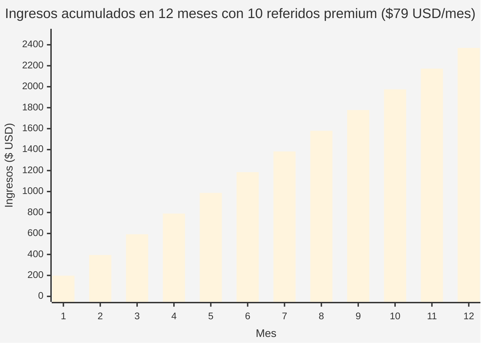

# Programa de Afiliados de E-SMART360

¿Eres marketer digital, creador de contenido, agencia o simplemente alguien con influencia en el mundo del marketing digital? El **Programa de Afiliados de E-SMART360** te permite convertir tu red de contactos en una fuente constante de ingresos pasivos.

<Callout type="success">
**Resumen ejecutivo:** El Programa de Afiliados de E-SMART360 permite a marketers, creadores y agencias ganar una **comisión recurrente del 25% de por vida** por cada referencia premium o revendedor. Puedes ganar tanto por registros de pago directo como por usuarios gratuitos que luego se actualicen. El programa incluye un proceso de registro sencillo, un panel de afiliados dedicado, seguimiento con **cookie de 1 año** y retiros desde **$50 USD** vía **PayPal** o **bKash** (Bangladesh).
</Callout>

<Update title="Programa de Afiliados E-SMART360" date="15 Abr 2026" />

Nos complace anunciar la apertura del Programa de Afiliados de E-SMART360. Lo hemos desarrollado como una forma de agradecer a todos los marketers que se toman el tiempo de recomendar E-SMART360 a sus amigos y seguidores. Como afiliado, recibirás comisiones por cada nueva cuenta premium o revendedor que se registre en E-SMART360, así como por aquellos usuarios gratuitos que posteriormente se actualicen a un plan premium o de revendedor.

Ser socio afiliado de E-SMART360 es uno de los métodos más rápidos para aumentar tus ingresos y tu impacto en la industria del marketing con chatbots.

## Gana el 25% de Ingresos Recurrentes por Cada Referido. De Por Vida.

Tomamos muy en serio tu posición. Trabajas en marketing. Mueves cosas. Tienes influencia. Puedes comunicarte con las personas en tu círculo mucho más efectivamente de lo que nosotros podríamos.

<Callout type="info">
Esto explica por qué tratamos bien a nuestros afiliados. Recibes una participación del 25% de la tarifa mensual por cada usuario que se registre a través de tu referencia. Seguirás recibiendo tu comisión de referencia mientras ellos sigan pagando sus suscripciones mensuales.
</Callout>

### ¿Cómo funciona el cálculo de comisiones?

La mecánica es simple y transparente:

<Steps>
<Step title="Compartes tu enlace único">
Cada vez que alguien hace clic en tu enlace de afiliado y se registra en E-SMART360, queda asociado a tu cuenta mediante una cookie de seguimiento con validez de **365 días**.
</Step>
<Step title="El usuario elige un plan">
Ya sea que comience con una cuenta gratuita o se registre directamente en un plan premium o de revendedor, tú recibirás crédito por esa referencia.
</Step>
<Step title="Recibes tu comisión mensual">
Mientras el usuario mantenga activa su suscripción, tú recibirás el **25% del pago mensual recurrente**. Sin límite de tiempo. Sin tope máximo.
</Step>
</Steps>

<Columns cols="2">
<Card title="Ejemplo práctico 1: Afiliado con blog de tecnología">
Imagina que tienes un blog sobre herramientas SaaS. Escribes un artículo titulado "Los 5 mejores chatbots de WhatsApp para tu negocio" e incluyes tu enlace de afiliado de E-SMART360. Si 10 lectores se registran en el plan premium de $79 USD/mes:
- **Ingreso mensual:** 10 × $79 × 25% = **$197.50 USD**
- **Ingreso anual:** $197.50 × 12 = **$2,370 USD**
- Y si ninguno cancela, seguirás ganando año tras año.
</Card>
<Card title="Ejemplo práctico 2: Agencia de marketing digital">
Tienes 5 clientes a los que gestionas sus campañas de marketing. Les recomiendas E-SMART360 y todos se registran en el plan premium de $79 USD/mes por tu enlace:
- **Ingreso mensual:** 5 × $79 × 25% = **$98.75 USD**
- **Ingreso anual solo de comisiones:** $1,185 USD
- Tus ingresos por servicios profesionales se mantienen intactos, ¡las comisiones son un extra!
</Card>
</Columns>

## Gran Retorno por tu Esfuerzo

¿Qué tan difícil es conseguir una referencia registrada?

Probemos algo. Publicar en un grupo de Facebook, enviar un correo electrónico o colocar un enlace en LinkedIn.

Cualquiera de estas actividades tiene el potencial de generar referencias y activar un flujo constante de dinero. La recompensa es enorme a pesar del mínimo esfuerzo.

<Callout type="tip">
**Estrategia probada:** Los afiliados más exitosos crean contenido de valor (tutoriales, comparativas, casos de uso) y colocan su enlace estratégicamente. No se trata de spam, sino de ser útil y estar presente cuando alguien busca exactamente lo que E-SMART360 ofrece.
</Callout>

### Estrategias recomendadas para maximizar tus comisiones

| Estrategia | Descripción | Potencial de ingresos |
|---|---|---|
| **Contenido SEO** | Artículos de blog comparativos o tutoriales | Alto (tráfico orgánico constante) |
| **Redes sociales** | Publicaciones en LinkedIn, Facebook, Twitter/X | Medio (alcance viral) |
| **Comunidades** | Grupos de WhatsApp, Telegram, Facebook especializados | Alto (público calificado) |
| **YouTube/TikTok** | Videos demostrativos de funcionalidades | Muy alto (autoridad y confianza) |
| **Email marketing** | Newsletters con recomendaciones | Alto (audiencia cautiva) |

<Expandable title="¿Cómo impulsar tus conversiones como afiliado?">
- **Usa testimonios reales:** Comparte historias de cómo E-SMART360 ha ayudado a otras empresas.
- **Ofrece bonos adicionales:** Algunos afiliados crean guías exclusivas o plantillas como valor añadido.
- **Aprovecha temporadas altas:** Black Friday, lanzamientos de productos, inicio de año (cuando las empresas invierten en marketing).
- **Segmenta tu audiencia:** No recomiendes a cualquiera; enfócate en dueños de negocios, agencias y marketers que ya están considerando automatización.
- **Actualiza tu contenido periódicamente:** La plataforma evoluciona; mantén tus artículos y videos actualizados.
</Expandable>

## Métodos y Reglas de Pago

Puedes solicitar un retiro tan pronto como el saldo de tu cuenta de afiliado alcance los **$50 USD**. El pago se completará en un máximo de cinco días hábiles.

Tus ganancias estarán disponibles para retiro a través de:

<Columns cols="2">
<Card title="PayPal">
Aceptado a nivel global. Ideal para afiliados internacionales que necesitan recibir sus pagos en su cuenta de PayPal.
</Card>
<Card title="bKash">
Disponible exclusivamente para afiliados en Bangladesh. Método local rápido y confiable.
</Card>
</Columns>

<Callout type="warning">
**Importante:** Asegúrate de que la información de tu cuenta de pago esté actualizada en tu panel de afiliado. Los pagos se procesan únicamente cuando el saldo mínimo de $50 ha sido alcanzado y verificamos que los datos sean correctos.
</Callout>

## ¿Cómo Registrarse como Socio Afiliado de E-SMART360?

Primero debes solicitar un enlace de afiliado. Se te emitirá una cuenta y un enlace después de la verificación. Para confirmar tu estatus como socio afiliado, podríamos solicitarte cierta información.

<Steps>
<Step title="Inicia sesión o regístrate en E-SMART360">
Ve a la plataforma y accede a tu cuenta. Si aún no tienes una, el registro es gratuito.
</Step>
<Step title="Accede a la sección de Afiliados">
Desde el menú superior derecho de tu panel de control, haz clic en **Programa de Afiliados**. Se abrirá un formulario para que envíes tu solicitud.
</Step>
<Step title="Completa el formulario de solicitud">
Proporciona la información requerida: tus datos personales, redes sociales o sitio web, y cómo planeas promocionar E-SMART360.
</Step>
<Step title="Espera la aprobación">
El equipo de E-SMART360 revisará tu solicitud en un plazo máximo de **24 horas hábiles**. Recibirás una notificación automática cuando tu cuenta sea aprobada.
</Step>
<Step title="¡Comienza a promocionar!">
Una vez aprobado, accede a tu panel de afiliado. En la sección de configuración encontrarás tu enlace de afiliado único. ¡Compártelo y empieza a generar comisiones!
</Step>
</Steps>

<Callout type="tip">
**Consejo:** Después de la aprobación, explora tu panel de afiliado. Encontrás estadísticas en tiempo real, enlaces promocionales, banners y materiales de marketing que puedes descargar para usar en tus campañas.
</Callout>

### Modelo de atribución: ¿Qué método sigue E-SMART360?

E-SMART360 utiliza el método **"Last Click Wins"** (Último Clic Gana). Esto significa que el último afiliado cuyo enlace fue clickeado recibe el crédito cuando el visitante se registra.

**Fecha de expiración de la cookie:** 1 año de validez para cada clic en el enlace.

<Expandable title="¿Qué significa 'Last Click Wins' en la práctica?">
Imagina que el Usuario A hace clic en tu enlace de afiliado hoy, pero no se registra. Dos semanas después, hace clic en el enlace de otro afiliado y se registra inmediatamente. En ese caso, el segundo afiliado recibe la comisión porque fue el último clic antes del registro.

Por eso es importante:
- **Hacer seguimiento** con tus leads potenciales
- **Recordarles tu enlace** antes de que se registren
- **Crear urgencia** con ofertas o contenido de valor que los motive a actuar
</Expandable>

## Beneficios Adicionales del Programa de Afiliados

Además de las comisiones recurrentes, el programa ofrece ventajas exclusivas:

<Columns cols="3">
<Card title="Panel en Tiempo Real">
Monitorea tus clics, registros, conversiones y comisiones desde un dashboard intuitivo. Sabrás exactamente cuánto estás ganando en cada momento.
</Card>
<Card title="Soporte Preferente">
Los afiliados tienen acceso a un canal de soporte dedicado. Resolvemos tus dudas sobre enlaces, pagos y estrategias de promoción.
</Card>
<Card title="Materiales Promocionales">
Accede a banners, imágenes, plantillas de correo y guías diseñadas profesionalmente para maximizar tus conversiones.
</Card>
</Columns>

## ¿Quién Debe Unirse al Programa de Afiliados de E-SMART360?

Este programa es ideal para:

| Perfil | Por qué funciona |
|---|---|
| **Marketers digitales** | Ya tienen audiencia y saben cómo promover productos |
| **Reviewers de SaaS** | Su contenido comparativo genera confianza y conversiones |
| **Blogueros y YouTubers** | El contenido tutorial y educativo atrae a compradores calificados |
| **Dueños de agencias** | Pueden revender y ganar comisiones al mismo tiempo |
| **Consultores de chatbots** | Conocen el valor del producto y pueden recomendarlo con autoridad |
| **Influencers** | Su alcance masivo puede traducirse en muchas referencias |
| **Emprendedores digitales** | Buscan fuentes de ingresos pasivos escalables |

<Callout type="info">
**¿Eres agencia?** El programa de afiliados es complementario al programa de revendedores (white label). Puedes participar en ambos y maximizar tus ingresos. Consulta con nuestro equipo las condiciones especiales para agencias.
</Callout>

## Preguntas Frecuentes

<Expandable title="¿Cuánta comisión puedo ganar con el Programa de Afiliados de E-SMART360?">
Ganas el 25% de comisión recurrente de por vida por cada referencia exitosa a un plan premium o de revendedor que se registre a través de tu enlace de afiliado. No hay límite máximo de ganancias.
</Expandable>

<Expandable title="¿Gano comisión si alguien se registra gratis primero y luego se actualiza?">
Sí. Si un usuario se registra para una cuenta gratuita usando tu enlace y posteriormente se actualiza a un plan de pago, igual recibirás tu comisión. La cookie de seguimiento de 1 año asegura que tu referencia quede registrada.
</Expandable>

<Expandable title="¿Cuál es el monto mínimo para solicitar un retiro?">
Puedes solicitar un retiro una vez que el saldo de tu cuenta de afiliado alcance los $50 USD. Los pagos se procesan en un máximo de 5 días hábiles después de la solicitud.
</Expandable>

<Expandable title="¿Cómo recibiré mis pagos de afiliado?">
Actualmente soportamos pagos a través de:
- **PayPal** (disponible globalmente)
- **bKash** (solo para afiliados en Bangladesh)
Los pagos se procesan generalmente dentro de los 5 días hábiles posteriores a la solicitud.
</Expandable>

<Expandable title="¿Cómo me uno al Programa de Afiliados?">
Para unirte: 1) Regístrate o inicia sesión en E-SMART360, 2) Ve a la sección del Programa de Afiliados desde tu panel, 3) Envía el formulario de solicitud, 4) Espera la aprobación (generalmente dentro de 24 horas hábiles). Una vez aprobado, recibirás tu panel de afiliado y tu enlace de referencia.
</Expandable>

<Expandable title="¿Cómo funciona el seguimiento de referidos?">
E-SMART360 utiliza un modelo de atribución "Last Click Wins". Esto significa que el afiliado cuyo enlace fue clickeado más recientemente antes del registro recibe el crédito. El seguimiento se mantiene mediante una cookie con validez de 1 año desde el momento del clic.
</Expandable>

<Expandable title="¿Por cuánto tiempo dura la cookie de afiliado?">
E-SMART360 ofrece una validez de cookie de **1 año completo** (365 días). Tus referencias potenciales serán rastreadas durante todo ese período desde que hacen clic en tu enlace, incluso si tardan meses en decidirse a registrarse.
</Expandable>

<Expandable title="¿Hay algún costo para unirse al programa de afiliados?">
No. Unirse al Programa de Afiliados de E-SMART360 es **completamente gratuito**. No hay costos de inscripción, cuotas mensuales ni cargos ocultos.
</Expandable>

<Expandable title="¿Puedo usar mis enlaces de afiliado en anuncios pagados?">
Sí, puedes usar tu enlace de afiliado en campañas de Google Ads, Facebook Ads, LinkedIn Ads y otras plataformas publicitarias. Sin embargo, recomendamos revisar las políticas de cada plataforma respecto a enlaces de afiliados para asegurarte de cumplir con sus términos de servicio.
</Expandable>

## Casos de Uso Reales: Estrategias de Afiliados Exitosos

<Columns cols="2">
<Card title="Caso 1: Del blog a los ingresos pasivos">
**María** tenía un blog sobre marketing digital con 5,000 visitas mensuales. Escribió una guía detallada sobre "Cómo automatizar ventas en WhatsApp" e incluyó su enlace de afiliado de E-SMART360. En 6 meses:
- **1,200 clics** en su enlace de afiliado
- **45 registros** en cuentas gratuitas
- **12 conversiones** a planes premium
- **$1,136 USD** en comisiones acumuladas
</Card>
<Card title="Caso 2: La agencia que duplicó sus ingresos">
**Carlos** dirige una agencia de marketing para pequeñas empresas. Recomienda E-SMART360 como herramienta estándar a todos sus clientes. Resultado en el primer año:
- **8 clientes** registrados con su enlace
- **$632 USD/mes** en comisiones recurrentes
- **$7,584 USD/año** sin ningún esfuerzo adicional
</Card>
</Columns>

## Consejos para Maximizar tus Ganancias

<Callout type="tip">
**El contenido educativo convierte mejor que la promoción directa.** Las personas buscan soluciones, no productos. Cuando creas contenido que resuelve problemas reales (cómo recuperar carritos abandonados, cómo enviar campañas masivas sin ser bloqueado, cómo configurar un chatbot de ventas), tu enlace de afiliado se vuelve una recomendación natural, no un anuncio.
</Callout>

<Expandable title="Estrategia avanzada: Secuencia de seguimiento para afiliados">
Una técnica poderosa es crear una secuencia de emails o mensajes para tus leads:

1. **Día 1:** Comparte el enlace con un caso de éxito breve
2. **Día 3:** Envía un tutorial en video de 2 minutos sobre una característica clave
3. **Día 7:** Ofrece un bono exclusivo (plantilla, guía, checklist) si se registran con tu enlace
4. **Día 14:** Resuelve objeciones comunes con un FAQ personalizado
5. **Día 30:** Comparte actualizaciones y nuevas funcionalidades de la plataforma

Esta secuencia mantiene tu enlace presente sin ser invasivo y aumenta significativamente la tasa de conversión.
</Expandable>

<Callout type="warning">
**⚠️ Prácticas prohibidas:** No está permitido usar bots, tráfico automatizado, clics falsos, o promocionar el enlace en sitios de cupones sin autorización. El incumplimiento de las políticas de afiliados puede resultar en la suspensión de tu cuenta y la pérdida de comisiones acumuladas.
</Callout>

---

## Diferencias entre el Programa de Afiliados y el Programa de Revendedores

E-SMART360 ofrece dos vías para que partners y creadores generen ingresos con la plataforma. Es importante entender sus diferencias para elegir la que mejor se adapte a ti, o incluso combinar ambas.

| Aspecto | Programa de Afiliados | Programa de Revendedores (White Label) |
|---|---|---|
| **Modelo** | Comisión del 25% recurrente | Margen sobre reventa con marca propia |
| **Marca** | Promocionas E-SMART360 | La plataforma se ve como tuya |
| **Panel** | Dashboard de afiliado | Panel de control white label completo |
| **Soporte** | Soporte al afiliado | Soporte al cliente final (tú gestionas) |
| **Inversión inicial** | $0 | Plan de revendedor (desde $X/mes) |
| **Ideal para** | Influencers, bloggers, marketers | Agencias, consultores, SaaS builders |
| **Ingreso potencial** | Comisión del 25% mensual | Margen completo que tú definas |

<Callout type="info">
Muchos partners comienzan como afiliados y, al ver el potencial de la plataforma, migran al programa de revendedores. No hay exclusividad: puedes estar en ambos programas simultáneamente.
</Callout>

## Estructura de Precios para Afiliados: Lo Que Necesitas Saber

Para maximizar tus comisiones, es importante conocer los planes que ofrece E-SMART360. La plataforma está diseñada con precios transparentes, sin márgenes ocultos sobre las tarifas oficiales de la API de WhatsApp.

### Planes Disponibles

| Plan | Ideal para | Características principales | Comisión mensual por referido |
|---|---|---|---|
| **Gratuito** | Prueba y exploración | Funcionalidades básicas | $0 (potencial de upgrade) |
| **Premium** | Pequeñas y medianas empresas | Broadcasts, chatbot, inbox compartido, CATÁLOGO | 25% del plan |
| **Empresarial** | Equipos grandes y agencias | Límites más altos, soporte premium, funciones avanzadas | 25% del plan |
| **Revendedor** | Agencias y SaaS builders | Marca blanca completa, multi-tenant | 25% del plan de revendedor |

<Callout type="success">
**Ventaja competitiva:** A diferencia de otras plataformas que añaden recargos del 20-40% sobre la API de WhatsApp, E-SMART360 mantiene precios transparentes sin markup. Esto significa que tus referidos obtienen mejor valor, y tú recibes comisiones sobre un precio justo — lo que reduce la tasa de cancelación.
</Callout>

## Calculadora de Ingresos: Proyecciones a 12 Meses

A continuación te mostramos un diagrama que ilustra cómo crecen tus ingresos pasivos con el tiempo a medida que acumulas referidos:



### Detalle de la proyección:

| Mes | Referidos activos | Comisión mensual | Ingreso acumulado |
|---|---|---|---|
| Mes 1 | 10 | $197.50 | $197.50 |
| Mes 2 | 10 | $197.50 | $395.00 |
| Mes 3 | 10 | $197.50 | $592.50 |
| Mes 4 | 10 | $197.50 | $790.00 |
| Mes 5 | 10 | $197.50 | $987.50 |
| Mes 6 | 10 | $197.50 | $1,185.00 |
| Mes 7 | 10 | $197.50 | $1,382.50 |
| Mes 8 | 10 | $197.50 | $1,580.00 |
| Mes 9 | 10 | $197.50 | $1,777.50 |
| Mes 10 | 10 | $197.50 | $1,975.00 |
| Mes 11 | 10 | $197.50 | $2,172.50 |
| Mes 12 | 10 | $197.50 | **$2,370.00** |

<Callout type="tip">
**Escenario realista:** No todos los referidos se quedarán para siempre. Si asumes una tasa de retención del 80% anual (2 de cada 10 cancelan), tu ingreso neto proyectado a 12 meses sería de aproximadamente **$1,896 USD**. ¡Sigue siendo un excelente retorno por compartir un enlace!
</Callout>

## Cómo Crear una Estrategia de Contenido como Afiliado

El contenido es el motor del marketing de afiliados. Aquí tienes una guía paso a paso para construir una estrategia que convierta:

### 1. Identifica tu nicho y audiencia

No intentes promocionar a todo el mundo. Los afiliados más exitosos se enfocan en un nicho específico:

- **E-commerce:** Dueños de tiendas Shopify, WooCommerce o Magento
- **Servicios profesionales:** Abogados, médicos, consultores que necesitan agendar citas
- **Marketing digital:** Agencias que buscan herramientas para sus clientes
- **Educación:** Creadores de cursos que quieren automatizar comunicación con alumnos
- **Inmobiliario:** Agentes que necesitan enviar propiedades y dar seguimiento

### 2. Crea contenido en 3 formatos clave

<Columns cols="3">
<Card title="📝 Contenido escrito">
- Artículos de blog comparativos
- Guías paso a paso
- Casos de estudio
- Listas y rankings

*Ejemplo:* "Cómo aumenté las ventas de mi tienda online un 40% con chatbots"
</Card>
<Card title="🎥 Contenido en video">
- Tutoriales en YouTube
- Demostraciones en vivo
- Reviews honestos
- Webinars educativos

*Ejemplo:* "Configura un chatbot de ventas en 10 minutos"
</Card>
<Card title="📱 Contenido social">
- Hilos en Twitter/X
- Posts en LinkedIn
- Stories en Instagram
- Tips en TikTok

*Ejemplo:* "3 funciones secretas de E-SMART360 que nadie te ha enseñado"
</Card>
</Columns>

### 3. Construye una lista de correos

El email marketing es el canal con mayor tasa de conversión para afiliados. Construye tu lista ofreciendo un lead magnet gratuito:

<Expandable title="Ejemplo de lead magnet: 'Checklist de 10 pasos para automatizar ventas en WhatsApp'">
Ofrece esta checklist a cambio del correo electrónico de tus visitantes. Luego, en tu secuencia de emails, incluye:

1. **Email 1:** Entrega la checklist y agrega valor inmediato
2. **Email 2:** Muestra cómo E-SMART360 resuelve cada punto de la checklist
3. **Email 3:** Caso de éxito detallado con resultados numéricos
4. **Email 4:** Enlace de afiliado con bono exclusivo (plantillas adicionales, guía extendida)
5. **Email 5:** Último recordatorio con testimonio en video

Tasa de conversión típica de esta estrategia: **3-8% sobre los suscriptores**
</Expandable>

### 4. Mide y optimiza

Utiliza tu panel de afiliado para rastrear:

```
📊 Métricas clave de afiliado:
- Tasa de clics (CTR): Cantidad de personas que hacen clic en tu enlace
- Tasa de conversión: % de clics que se convierten en registros
- Tasa de upgrade: % de registros gratuitos que se vuelven premium
- Ingreso por clic (EPC): Ganancias totales / número de clics
- Valor de por vida del referido (LTV): Ingreso total generado por referido
```

<Callout type="info">
**Benchmark:** Los mejores afiliados de E-SMART360 tienen un EPC (earnings per click) de $2.50-$5.00 USD. Si tu EPC es menor, prueba con diferentes tipos de contenido o segmenta mejor tu audiencia.
</Callout>

## El Poder del Ingreso Recurrente: Por Qué el 25% Cambia las Reglas del Juego

La mayoría de los programas de afiliados pagan una comisión única por venta. El programa de E-SMART360 paga **el 25% cada mes, mientras tu referido siga siendo cliente**. Esto se conoce como ingresos recurrentes de afiliado (recurring affiliate revenue) y es fundamentalmente diferente:

### Comparativa: Comisión única vs. Comisión recurrente

| Escenario | Comisión única (típica) | Comisión recurrente 25% E-SMART360 |
|---|---|---|
| 1 venta de $79 | $79 una sola vez | $19.75 cada mes |
| 10 ventas en un mes | $790 única vez | $197.50 cada mes |
| Acumulado a 12 meses (10 ventas) | $790 | $2,370 |
| Acumulado a 24 meses (10 ventas) | $790 | $4,740 |
| Acumulado a 36 meses (10 ventas) | $790 | $7,110 |

<Callout type="success">
**La magia del interés compuesto aplicado al marketing de afiliados:** Si consigues 2 referidos nuevos cada mes, después de 12 meses tendrás 24 referidos activos generando aproximadamente **$474 USD/mes** en comisiones. Y si mantienes ese ritmo durante 3 años, estarías ganando **$1,422 USD/mes** solo por recomendar una herramienta que ya usas y amas.
</Callout>

## Testimonios de Nuestros Afiliados

<Columns cols="2">
<Card title="⭐ Ana G. — Blogger de Tecnología">
"Empecé como afiliada de E-SMART360 sin muchas expectativas. En mi primer mes gané $98.75 con solo 5 referidos. Para el sexto mes, ya estaba ganando $450 USD mensuales. Lo mejor es que el esfuerzo fue mínimo: escribo un artículo al mes y el dinero llega solo."
</Card>
<Card title="⭐ Roberto M. — Consultor de Marketing">
"Recomiendo E-SMART360 a todos mis clientes de consultoría porque sé que es la mejor herramienta. Las comisiones son un extra bienvenido, pero lo que más valoro es la transparencia y el soporte que recibo como afiliado. Mi enlace está en la firma de mi correo y genera comisiones consistentes."
</Card>
</Columns>

## Preguntas Frecuentes Adicionales

<Expandable title="¿Puedo tener múltiples enlaces de afiliado para diferentes campañas?">
Actualmente, cada afiliado recibe un enlace único de seguimiento. Sin embargo, puedes utilizar parámetros UTM u otros sistemas de tracking externo para medir el rendimiento de cada campaña por separado. Consulta con nuestro equipo de soporte si necesitas capacidades avanzadas de tracking multicampaña.
</Expandable>

<Expandable title="¿Qué sucede si mi referido cancela su suscripción y luego se reactiva?">
Si un referido cancela su suscripción, las comisiones se detienen. Sin embargo, si ese mismo usuario se reactiva dentro del período de vigencia de la cookie (1 año desde su clic original), tu comisión se reanudará automáticamente. No necesitas hacer nada.
</Expandable>

<Expandable title="¿Recibo comisiones por los addons o servicios adicionales que compre mi referido?">
Las comisiones se calculan sobre el plan base (suscripción mensual) del referido. Los addons, tokens de IA, o servicios adicionales pueden tener condiciones específicas. Consulta los términos completos del programa de afiliados para conocer todos los detalles sobre qué compras generan comisión.
</Expandable>

<Expandable title="¿Existe un límite de cuánto puedo ganar como afiliado?">
No hay límite máximo de ganancias. Puedes generar referidos ilimitados y cada uno te pagará el 25% de su suscripción mensual mientras esté activo. Los únicos topes son los que tú mismo te pongas en cuanto a esfuerzo de promoción.
</Expandable>

<Expandable title="¿Puedo promover E-SMART360 en mercados internacionales?">
¡Absolutamente! De hecho, la plataforma soporta múltiples idiomas y regiones. Si tienes audiencia en Latinoamérica, Europa, Asia o cualquier otra región, tu enlace de afiliado funciona globalmente. Solo ten en cuenta que los pagos se realizan en USD a través de PayPal.
</Expandable>

## Próximos Pasos para Comenzar

<Steps>
<Step title="Regístrate en E-SMART360">
Crea tu cuenta gratuita. No necesitas un plan de pago para ser afiliado.
</Step>
<Step title="Solicita tu enlace de afiliado">
Completa el formulario de solicitud en la sección de afiliados de tu panel.
</Step>
<Step title="Prepara tu estrategia de contenido">
Elige los canales donde promocionarás tu enlace (blog, redes sociales, YouTube, email).
</Step>
<Step title="Empieza a compartir">
Publica tu primer contenido con tu enlace de afiliado.
</Step>
<Step title="Monitorea y optimiza">
Revisa tu panel de afiliado semanalmente y ajusta tu estrategia según los resultados.
</Step>
</Steps>

<Callout type="success">
**¡Felicidades por dar el primer paso hacia el ingreso pasivo!** El Programa de Afiliados de E-SMART360 está diseñado para recompensar tu influencia y esfuerzo. Con una comisión del 25% recurrente, seguimiento de 1 año y pagos desde $50 USD, tienes todo lo necesario para construir un flujo de ingresos sostenible.
</Callout>

---

## Entendiendo los Planes de Precios de E-SMART360 para Maximizar tus Comisiones

Para ser un afiliado efectivo, necesitas conocer a fondo los planes que promocionas. E-SMART360 ofrece una estructura de precios transparente diseñada para eliminar sorpresas:

### Sin Cargos Ocultos en la API de WhatsApp

Una de las ventajas clave de E-SMART360 es que **no aplicamos márgenes adicionales sobre las tarifas oficiales de la API de WhatsApp**. Mientras que otras plataformas añaden recargos del 20% al 40% sobre el costo real de las conversaciones de WhatsApp, E-SMART360 mantiene precios justos y transparentes.

**¿Por qué esto es importante para ti como afiliado?**

- Tus referidos obtienen el mejor precio del mercado
- La tasa de cancelación (churn) es menor porque los clientes no encuentran sorpresas en su factura
- Tus comisiones se mantienen estables porque los clientes permanecen más tiempo
- Es más fácil convencer a prospectos que comparan precios entre plataformas

### Planes de Suscripción

| Plan | Facturación mensual | Facturación anual (ahorro) | Ideal para |
|---|---|---|---|
| **Gratuito** | $0 | $0 | Prueba inicial, micro-negocios |
| **Starter** | $29 USD | $290 USD (~$24.17/mes) | Negocios pequeños, autónomos |
| **Premium** | $79 USD | $790 USD (~$65.83/mes) | PYMEs en crecimiento |
| **Business** | $149 USD | $1,490 USD (~$124.17/mes) | Equipos medianos |
| **Enterprise** | Desde $299 USD | Consultar | Grandes empresas y agencias |

<Callout type="tip">
**Consejo para afiliados:** Cuando un referido elige facturación anual, tu comisión se calcula sobre el total anual dividido entre 12. Por ejemplo, un plan Premium anual genera $65.83 × 25% = **$16.46 USD/mes** en comisión. El usuario ahorra, y tú sigues ganando mensualmente.
</Callout>

## El Proceso de Verificación de Afiliado: Paso a Paso Detallado

Para garantizar la calidad de nuestro programa, implementamos un proceso de verificación. Aquí te explicamos exactamente qué esperar:

### Fase 1: Solicitud Inicial

Cuando envías tu solicitud desde el panel de afiliados, necesitarás proporcionar:

1. **Información personal básica:** Nombre completo, correo electrónico, país
2. **Presencia en línea:** Sitio web, blog, canal de YouTube, perfiles de redes sociales
3. **Estrategia de promoción:** Breve descripción de cómo planeas promocionar E-SMART360
4. **Experiencia en marketing:** ¿Has participado en otros programas de afiliados? ¿Cuáles?

<Callout type="info">
**Nota:** No es obligatorio tener un sitio web o un canal grande. Aceptamos afiliados de todos los tamaños siempre que demuestren un enfoque legítimo y ético para la promoción.
</Callout>

### Fase 2: Revisión (24 Horas Hábiles)

Nuestro equipo revisa cada solicitud manualmente. Durante este proceso:

- Verificamos que la información proporcionada sea correcta
- Revisamos tu presencia en línea para entender tu alcance
- Evaluamos si tu enfoque de promoción está alineado con nuestros valores de marca
- Confirmamos que no tengas conflictos de interés con competidores directos

### Fase 3: Aprobación y Activación

Una vez aprobado:

- Recibirás una notificación automática por correo electrónico
- Tu panel de afiliado se activará con todas las funcionalidades
- Obtendrás tu enlace de afiliado único en la sección de configuración
- Podrás acceder a materiales promocionales descargables

### Fase 4: Seguimiento y Soporte Continuo

Como afiliado activo, recibirás:

- **Reportes mensuales:** Resumen de tu rendimiento y comisiones
- **Actualizaciones de producto:** Noticias sobre nuevas funcionalidades para compartir con tu audiencia
- **Soporte prioritario:** Acceso a nuestro equipo de soporte de afiliados
- **Bonos especiales:** Ocasionalmente ofrecemos bonos por alcanzar metas específicas

## Estrategias Avanzadas de Promoción para Afiliados

Una vez que dominas lo básico, estas estrategias avanzadas te ayudarán a escalar tus ingresos:

### Estrategia 1: El Embudo de Contenido + Email


### Estrategia 2: Colaboraciones y Joint Ventures

Asóciate con otros creadores de contenido en tu nicho para promocionar E-SMART360 de forma cruzada:

| Tipo de colaboración | Cómo funciona | Beneficio |
|---|---|---|
| **Webinar conjunto** | Dos creadores presentan un webinar sobre automatización de WhatsApp | Audiencia combinada, mayor credibilidad |
| **Intercambio de enlaces** | Se recomiendan mutuamente en newsletters o posts | Exposición a nuevas audiencias |
| **Paquete de bonos** | Cada uno ofrece un bono exclusivo por registrarse con el enlace del otro | Mayor incentivo para registrarse |
| **Contenido colaborativo** | Guía o video creado por múltiples autores | Contenido más rico, alcance multiplicado |

### Estrategia 3: Segmentación por Industria

En lugar de promocionar E-SMART360 como una herramienta genérica, crea contenido específico para cada industria:

<Tabs>
<Tab title="E-commerce">
**Ángulos de venta:**
- Recuperación de carritos abandonados
- Notificaciones automáticas de pedidos
- Catálogo de productos interactivo
- Chatbot de atención al cliente 24/7

**Contenido sugerido:** "Cómo reducir el abandono de carrito un 30% con chatbots de WhatsApp"
</Tab>
<Tab title="Servicios Profesionales">
**Ángulos de venta:**
- Sistema de reserva de citas
- Recordatorios automáticos de citas
- Seguimiento post-consulta
- Preguntas frecuentes automatizadas

**Contenido sugerido:** "Agenda y gestiona tus citas directamente desde WhatsApp: guía completa"
</Tab>
<Tab title="Educación">
**Ángulos de venta:**
- Envío automático de materiales de estudio
- Recordatorios de clases y exámenes
- Chatbot de dudas frecuentes
- Cobro de mensualidades por WhatsApp Pay

**Contenido sugerido:** "Automatiza la comunicación con tus alumnos usando WhatsApp"
</Tab>
<Tab title="Inmobiliario">
**Ángulos de venta:**
- Envío de catálogos de propiedades
- Chatbot calificador de leads
- Recordatorios de visitas
- Seguimiento post-visita automatizado

**Contenido sugerido:** "Chatbots inmobiliarios: califica leads 24/7 sin levantar un dedo"
</Tab>
</Tabs>

### Estrategia 4: Contenido Estacional
a
Aprovecha las temporadas clave donde las empresas buscan activamente soluciones de automatización:

| Temporada | Oportunidad | Contenido sugerido |
|---|---|---|
| **Enero** | Nuevos presupuestos, metas anuales | "Tu checklist de automatización para el nuevo año" |
| **Febrero-Marzo** | Preparación para ventas de primavera | "Automatiza tus campañas de San Valentín y Día de la Madre" |
| **Julio-Agosto** | Vacaciones, necesidad de atención automática | "Mantén tu negocio activo mientras estás de vacaciones" |
| **Noviembre-Diciembre** | Black Friday, Navidad, alta demanda | "Prepara tu chatbot para la temporada navideña" |

## Políticas y Términos del Programa de Afiliados

<Callout type="warning">
Es importante conocer y respetar las políticas del programa para mantener tu cuenta activa y tus comisiones seguras.
</Callout>

### Prácticas Aceptables
- Compartir tu enlace en redes sociales, blogs, videos y newsletters
- Usar tu enlace en firmas de correo electrónico
- Publicar reseñas honestas y tutoriales
- Promocionar en comunidades relevantes (con transparencia)
- Usar tu enlace en campañas de anuncios pagados (respetando políticas de cada plataforma)

### Prácticas Prohibidas
- Usar bots, scripts o tráfico automatizado para generar clics o registros
- Promocionar en sitios de cupones sin autorización expresa
- Realizar afirmaciones falsas o engañosas sobre E-SMART360
- Registrar tus propias cuentas con tu enlace de afiliado para generar comisiones
- Usar marcas registradas de E-SMART360 en campañas de anuncios sin permiso
- Spam en comentarios, foros o mensajes directos no solicitados

### Consecuencias del Incumplimiento

El incumplimiento de estas políticas puede resultar en:

1. **Advertencia formal** por primera infracción menor
2. **Retención temporal de comisiones** mientras se investiga
3. **Cancelación de la cuenta de afiliado** con pérdida de comisiones pendientes
4. **Prohibición permanente** de participar en el programa

<Callout type="info">
En E-SMART360 creemos en la transparencia y las relaciones a largo plazo. Si tienes dudas sobre si una estrategia específica está permitida, contáctanos antes de implementarla. Preferimos resolver dudas que lamentar infracciones.
</Callout>

## Guía de Materiales Promocionales

Como afiliado, tienes acceso a materiales diseñados profesionalmente para maximizar tus conversiones:

### Banners y Creativos

| Formato | Tamaño | Uso recomendado |
|---|---|---|
| Banner horizontal | 728×90 px | Cabecera de sitios web |
| Banner cuadrado | 300×250 px | Sidebars y widgets |
| Banner vertical | 160×600 px | Barras laterales |
| Banner móvil | 320×100 px | Versiones móviles |
| Imagen para redes | 1200×630 px | Facebook, LinkedIn, Twitter |

### Plantillas de Contenido

**Plantilla para publicación en LinkedIn:**

```
💡 ¿Sabías que puedes automatizar tus ventas por WhatsApp sin saber programar?

Presentamos E-SMART360, la plataforma líder en chatbots y marketing conversacional.

✅ Chatbots con IA
✅ Campañas de broadcasting
✅ Inbox compartido para equipos
✅ Catálogo de productos
✅ Sin markup en API de WhatsApp

Descubre más aquí 👉 [TU ENLACE DE AFILIADO]

#WhatsAppMarketing #Chatbots #Automatización #Ecommerce
```

**Plantilla para newsletter por correo:**

```
Asunto: La herramienta que está transformando el marketing en WhatsApp

Hola [NOMBRE],

Últimamente he estado probando E-SMART360 y honestamente me ha sorprendido. Es una plataforma completa para automatizar ventas y atención al cliente en WhatsApp.

Lo que más me gusta:
• No necesitas saber código
• Precios transparentes sin markup
• Comisiones de afiliado del 25% recurrente

Si estás buscando mejorar tu comunicación con clientes, te recomiendo que le des un vistazo:
[TU ENLACE DE AFILIADO]

Saludos,
[TU NOMBRE]
```

## Cómo Retirar tus Ganancias

El proceso de retiro está diseñado para ser simple y rápido:

<Steps>
<Step title="Acumula al menos $50 USD en tu balance">
Monitorea tu saldo desde el panel de afiliado. Las comisiones se acreditan mensualmente después de que los pagos de tus referidos son procesados.
</Step>
<Step title="Solicita el retiro desde tu panel">
En la sección de pagos, selecciona la opción "Solicitar retiro". Elige tu método de pago preferido.
</Step>
<Step title="Verifica tu información de pago">
Asegúrate de que tu dirección de PayPal o número de bKash estén correctos. Los pagos erróneos por datos incorrectos son responsabilidad del afiliado.
</Step>
<Step title="Recibe tu pago en 5 días hábiles">
Una vez aprobada la solicitud, procesamos el pago en un máximo de 5 días hábiles. Recibirás una notificación cuando el pago se haya completado.
</Step>
</Steps>

<Callout type="success">
**Consejo:** Programa retiros periódicos en lugar de esperar a acumular grandes cantidades. Esto te ayuda a mantener un flujo de caja constante y reduce el riesgo en caso de cualquier eventualidad.
</Callout>

## Preguntas Frecuentes - Sección Ampliada

<Expandable title="¿Puedo usar mi enlace de afiliado en YouTube? ">
Sí, puedes incluir tu enlace de afiliado en la descripción de tus videos de YouTube. De hecho, los tutoriales y las reviews honestas son uno de los métodos más efectivos. Solo asegúrate de revelar que es un enlace de afiliado según las políticas de YouTube y FTC.
</Expandable>

<Expandable title="¿Qué sucede si no tengo sitio web ni seguidores? ¿Puedo ser afiliado igual?">
Cada solicitud se evalúa de forma individual. Si bien tener presencia en línea ayuda, también consideramos otros factores como tu conocimiento del producto, experiencia en marketing digital y planes de promoción. Si eres nuevo, te recomendamos empezar creando contenido en redes sociales antes de solicitar.
</Expandable>

<Expandable title="¿Las comisiones se pagan sobre el monto con descuento o sobre el precio completo?">
Las comisiones se calculan sobre el monto real pagado por el referido. Si el referido obtiene un descuento promocional o paga anualmente con descuento, la comisión se calcula sobre el monto efectivamente pagado, dividido mensualmente.
</Expandable>

<Expandable title="¿Puedo referirme a mí mismo para obtener comisiones?">
No, está prohibido crear cuentas adicionales o registrarse con tu propio enlace de afiliado para generar comisiones. El programa está diseñado para recompensar la promoción genuina a terceros. Cualquier intento de auto-referencia resultará en la cancelación de la cuenta.
</Expandable>

<Expandable title="¿Cómo sé si un referido se registró usando mi enlace?">
Tu panel de afiliado muestra en tiempo real todas las estadísticas: clics, registros, conversiones y comisiones. Puedes ver el desglose detallado de cada referencia, incluyendo la fecha de registro, el plan elegido y las comisiones generadas.
</Expandable>

<Expandable title="¿El programa de afiliados está disponible en todos los países?">
Sí, aceptamos afiliados de prácticamente todos los países. Las únicas limitaciones son los métodos de pago disponibles: PayPal funciona globalmente y bKash solo para Bangladesh. Si tu país no tiene acceso a PayPal, contacta a nuestro equipo para explorar alternativas.
</Expandable>

<Expandable title="¿Puedo promocionar E-SMART360 en idiomas que no sean inglés o español?">
¡Por supuesto! E-SMART360 es una plataforma global. Si tienes audiencia en otros idiomas, te animamos a crear contenido en esos idiomas. De hecho, los afiliados que promocionan en mercados menos saturados suelen tener tasas de conversación más altas.
</Expandable>

<Expandable title="¿Existe un programa de referidos para afiliados? ¿Puedo invitar a otros a ser afiliados?">
Actualmente el programa está enfocado en referir usuarios finales que se convierten en clientes. Si conoces a alguien que podría ser un buen afiliado, pueden contactarnos directamente. No hay un sub-programa de comisiones por reclutar afiliados en este momento.
</Expandable>

<Expandable title="¿Qué tipo de soporte recibo como afiliado?">
Los afiliados tienen acceso a:
- **Soporte por correo electrónico** con respuesta en 24 horas
- **Base de conocimiento** con guías y materiales promocionales
- **Actualizaciones periódicas** sobre novedades del producto
- **Canal prioritario** para afiliados con alto rendimiento
</Expandable>

## Tabla Comparativa: E-SMART360 vs. Otros Programas de Afiliados

Para que puedas argumentar con datos frente a tus prospectos, aquí tienes una comparativa:

| Característica | E-SMART360 | Programas típicos de afiliados |
|---|---|---|
| Comisión recurrente | ✅ 25% de por vida | ❌ Suelen ser comisión única |
| Duración de cookie | ✅ 365 días (1 año) | ⚠️ 30-90 días típicamente |
| Pago mínimo | ✅ $50 USD | ⚠️ $50-$100 USD |
| Métodos de pago | ✅ PayPal + bKash | ✅ Generalmente PayPal |
| Panel en tiempo real | ✅ Dashboard completo | ⚠️ Varía según el programa |
| Materiales promocionales | ✅ Banners, plantillas, guías | ⚠️ Varía según el programa |
| Sin markup en API | ✅ Precios transparentes | ❌ Muchos añaden markup |
| Soporte a afiliados | ✅ Dedicado | ⚠️ Generalmente genérico |
| Auto-referencia | ❌ Prohibida | ⚠️ Varía según el programa |
| Promoción en anuncios | ✅ Permitida con condiciones | ⚠️ Varía según el programa |

<Callout type="success">
Esta tabla es una excelente herramienta de ventas. Cuando un prospecto está considerando múltiples herramientas, puedes mostrarle por qué E-SMART360 ofrece el mejor valor tanto para usuarios como para afiliados.
</Callout>

## Ejemplo de Plan de Acción para tu Primera Semana como Afiliado

| Día | Acción | Tiempo estimado |
|---|---|---|
| **Día 1** | Regístrate y solicita tu enlace de afiliado | 15 min |
| **Día 2** | Explora tu panel de afiliado y descarga materiales | 20 min |
| **Día 3** | Crea una publicación en LinkedIn o Facebook presentando E-SMART360 | 30 min |
| **Día 4** | Escribe un artículo corto en tu blog o Medium | 45 min |
| **Día 5** | Graba un video rápido de 3 minutos mostrando el panel | 60 min |
| **Día 6** | Agrega tu enlace a la firma de tu correo electrónico | 5 min |
| **Día 7** | Revisa tus estadísticas y planifica la próxima semana | 15 min |

<Callout type="info">
**Total de inversión en tu primera semana:** ~3 horas de trabajo. **Potencial de ingreso mensual recurrente:** ilimitado. El ROI de tu tiempo como afiliado de E-SMART360 es difícil de superar.
</Callout>

---

¿Listo para empezar? Regístrate hoy y comienza a construir tu flujo de ingresos pasivos con E-SMART360. Si tienes preguntas, no dudes en contactar a nuestro equipo de soporte de afiliados.
