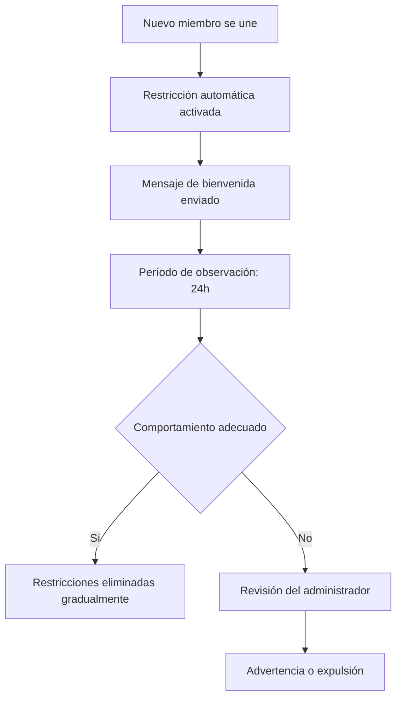

import { Callout, Steps, Expandable, Columns, Card, Tabs, Tab, Update } from '/src/components';

<Update title="Guía actualizada" date="2026-05-07" />
<Callout type="info">
  Automatizar las restricciones de miembros hace que la incorporación de nuevos usuarios a tu grupo de Telegram sea más fluida, protegiendo al mismo tiempo a tu comunidad del spam. Esta guía explica cómo configurar restricciones inteligentes para equilibrar la seguridad con una primera impresión profesional.
</Callout>

---

## Introducción

Dar la bienvenida a nuevos miembros a tu comunidad de Telegram es una oportunidad emocionante para expandir el alcance y la participación de tu grupo. Sin embargo, gestionar la afluencia de nuevos integrantes mientras se mantienen las normas del grupo puede ser un desafío constante.

Aquí es donde entra en juego la función de **Restricción de Nuevos Miembros** de E-SMART360. Esta potente herramienta permite a los administradores crear un proceso de incorporación fluido y seguro, garantizando que cada nuevo miembro reciba una experiencia acogedora y profesional desde el primer momento.

<Callout type="tip">
  **TL;DR**: Con E-SMART360 puedes automatizar la moderación de nuevos miembros, configurar mensajes de bienvenida personalizados y bloquear automáticamente actividades sospechosas como el envío masivo de enlaces o spam en tu grupo de Telegram.
</Callout>

---

## La Importancia de un Proceso de Onboarding Fluido

Una experiencia de incorporación acogedora define el tono del recorrido de un nuevo miembro dentro de tu comunidad de Telegram. Cuando los nuevos integrantes se sienten acogidos y guiados, es más probable que:

- **Participen activamente** en las discusiones del grupo.
- **Se comprometan a largo plazo** con la comunidad.
- **Sigan las reglas** y normas establecidas.

Un proceso de onboarding fluido también garantiza que los nuevos miembros sean introducidos a las reglas y pautas del grupo, minimizando las posibilidades de spam o comportamiento disruptivo. Sin un proceso estructurado, los grupos de Telegram pueden volverse rápidamente caóticos, especialmente cuando reciben oleadas de nuevos miembros simultáneamente.

<Columns cols="2">
  <Card title="✅ Con Restricciones">
    - Onboarding estructurado
    - Menos spam y bots
    - Membresía de calidad
    - Comunidad saludable
  </Card>
  <Card title="❌ Sin Restricciones">
    - Caos al llegar nuevos miembros
    - Aumento de spam y enlaces no deseados
    - Riesgo de bots maliciosos
    - Deserción de miembros valiosos
  </Card>
</Columns>

---

## La Restricción de Nuevos Miembros de E-SMART360

E-SMART360 ofrece una solución integral para que los administradores de grupos gestionen las actividades de los nuevos integrantes durante su período inicial en la comunidad. A continuación, exploramos las funcionalidades clave de esta herramienta.

### 1. Configuración de la Duración de la Restricción

Los administradores pueden definir el tiempo durante el cual los nuevos miembros estarán bajo restricción. Este período puede ir desde unos pocos minutos hasta varias horas, días o incluso más tiempo. La flexibilidad para elegir la duración garantiza que los nuevos miembros tengan tiempo suficiente para familiarizarse con la dinámica y las pautas del grupo.

<Callout type="success">
  **Recomendación**: Para grupos activos, un período de restricción de 24 a 48 horas suele ser suficiente para que los nuevos miembros observen la dinámica del grupo antes de participar activamente.
</Callout>

### 2. Introducción Gradual a las Actividades del Grupo

Durante el período de restricción, los nuevos miembros pueden ser introducidos gradualmente a las actividades del grupo. Por ejemplo:

- **Primera fase**: Solo acceso de lectura y visualización de contenido.
- **Segunda fase**: Permitir mensajes de texto, pero restringir el envío de enlaces y medios.
- **Tercera fase**: Acceso completo después del período de prueba.

Este enfoque gradual ayuda a prevenir el spam y anima a los nuevos miembros a observar las interacciones del grupo antes de participar activamente.

### 3. Reducción de Posibilidades de Disrupción

Al implementar un período de restricción, los administradores pueden reducir significativamente las posibilidades de comportamiento disruptivo por parte de los nuevos miembros. Restringir ciertas acciones durante la fase de incorporación previene:

- Envío masivo de enlaces maliciosos.
- Publicación de contenido inapropiado.
- Spam de bots automatizados.
- Uso indebido de las funciones del grupo.

### 4. Mensaje de Bienvenida Personalizable

E-SMART360 permite a los administradores configurar un mensaje de bienvenida personalizado para los nuevos miembros. Este saludo puede incluir:

- **Información esencial** sobre el propósito del grupo.
- **Reglas y pautas** del grupo.
- **Enlaces a recursos útiles** como FAQ o canales de soporte.
- **Instrucciones** para completar la verificación o presentarse.

El mensaje de bienvenida personalizado hace que los nuevos integrantes se sientan valorados e informados desde el momento en que entran a la comunidad.

### 5. Mejora de la Cohesión del Grupo

Con la función de Restricción de Nuevos Miembros, la comunidad del grupo puede continuar sus discusiones y actividades sin interrupciones por spam o contenido no relacionado. Esto fomenta un entorno cohesionado, permitiendo interacciones significativas entre los miembros existentes mientras los nuevos integrantes se adaptan a las normas del grupo.

<Callout type="success">
  **Dato clave**: Los grupos que implementan restricciones de nuevos miembros reportan hasta un 70% menos de incidentes de spam y una retención de miembros activos significativamente mayor.
</Callout>

---

## Bloqueo de Mensajes No Deseados: Protección Avanzada

Además de las restricciones para nuevos miembros, E-SMART360 ofrece capacidades avanzadas de bloqueo de mensajes no deseados para mantener tu bandeja de entrada de WhatsApp limpia y enfocada en conversaciones significativas. Estas herramientas complementan perfectamente las restricciones de Telegram.

### ¿Por qué Bloquear Usuarios?

- Detener mensajes de spam no deseados.
- Prevenir la acumulación de promociones comerciales no solicitadas.
- Mantener una comunicación profesional y relevante.
- Filtrar contenido irrelevante o molesto.

### Capacidades de Bloqueo

- **Bloquear mensajes entrantes** de contactos específicos.
- **Mantener la capacidad de enviar broadcasts** a usuarios bloqueados.
- **Control de comunicación unidireccional**: tú decides quién puede contactarte.

### Proceso de Bloqueo

**Paso 1: Identificar el contacto no deseado**
Revisa el historial de mensajes y reconoce aquellos repetitivos o irrelevantes. Selecciona el contacto específico que deseas bloquear.

**Paso 2: Bloquear mensajes entrantes**
Accede a la sección de Chat en Vivo de E-SMART360 y haz clic en el botón "Bloquear Usuario" en el perfil del usuario. Confirma la acción en la siguiente pantalla.

<Callout type="info">
  **¿Sabías que...?** Los usuarios bloqueados no reciben ninguna notificación de que han sido bloqueados. Esto permite mantener una gestión discreta y profesional de tu comunidad.
</Callout>

### ¿Qué Sucede Después del Bloqueo?

- **No recibirás mensajes entrantes** de usuarios bloqueados.
- **Podrás seguir enviando broadcasts** a estos usuarios si es necesario.
- **La comunicación unidireccional** se mantiene activa.
- **Puedes desbloquear** en cualquier momento si cambias de opinión.

---

## Pasos para Configurar Restricciones en Tu Grupo de Telegram

<Steps>
  <Step title="Accede al Panel de Control de E-SMART360">
    Inicia sesión en tu cuenta de E-SMART360 y navega hasta la sección de administración de bots de Telegram. Selecciona el grupo que deseas configurar.
  </Step>
  <Step title="Activa la Restricción de Nuevos Miembros">
    Busca la opción "Restricción de Nuevos Miembros" dentro de la configuración del bot. Actívala y establece la duración deseada para el período de prueba.
  </Step>
  <Step title="Configura los Permisos Graduales">
    Define qué acciones estarán permitidas durante cada fase del período de restricción. Puedes comenzar permitiendo solo lectura y luego habilitar progresivamente el envío de mensajes, medios y enlaces.
  </Step>
  <Step title="Personaliza el Mensaje de Bienvenida">
    Redacta un mensaje de bienvenida que incluya las reglas del grupo, enlaces útiles y una breve descripción del propósito de la comunidad. Activa el envío automático cuando un nuevo miembro se una.
  </Step>
  <Step title="Activa el Filtro Antispam">
    Habilita los filtros automáticos para detectar y bloquear patrones de spam comunes, como enlaces repetitivos, mensajes duplicados o actividad sospechosa de bots.
  </Step>
  <Step title="Monitorea y Ajusta">
    Revisa periódicamente los registros de actividad de nuevos miembros. Ajusta la duración de las restricciones y los permisos según sea necesario para optimizar la experiencia de onboarding.
  </Step>
</Steps>

<Callout type="warning">
  **Importante**: Las restricciones excesivamente largas pueden desalentar la participación de miembros genuinos. Encuentra un equilibrio entre seguridad y accesibilidad. Un período de 24 a 48 horas suele ser el punto óptimo para la mayoría de las comunidades.
</Callout>

---

## Estrategias Adicionales para una Comunidad Saludable

### Combinación con Filtros de Contenido

Además de las restricciones de nuevos miembros, E-SMART360 permite configurar filtros de contenido avanzados que pueden:

- Bloquear palabras clave específicas.
- Prevenir el envío de ciertos tipos de archivos.
- Limitar la frecuencia de mensajes por usuario.
- Detectar y eliminar automáticamente mensajes duplicados.

### Moderación Automatizada con Respuestas Inteligentes

Puedes configurar respuestas automáticas para guiar a los nuevos miembros durante su período de restricción:

### Gestión de Múltiples Grupos

Si administras varios grupos de Telegram, E-SMART360 te permite aplicar configuraciones de restricción de forma masiva, ahorrando tiempo y garantizando consistencia en todas tus comunidades.

---

## Preguntas Frecuentes

<Expandable title="¿Cuáles son los beneficios de un flujo de onboarding fluido en Telegram?">
  Un flujo de onboarding fluido reduce el spam mientras mantiene una experiencia acogedora para los usuarios reales. Permite a los administradores filtrar cuentas automatizadas sin interrumpir a los miembros genuinos que se unen al grupo. Además, mejora la retención de miembros y fomenta una comunidad más activa y comprometida.
</Expandable>

<Expandable title="¿Cómo detener automáticamente las invasiones de bots en mi grupo de Telegram?">
  Puedes usar las restricciones automáticas de miembros para silenciar a los nuevos usuarios o evitar que compartan enlaces, medios y otros contenidos hasta que completen un paso de verificación. E-SMART360 permite configurar reglas específicas que bloquean patrones de comportamiento típicos de bots, como el envío masivo de mensajes en segundos o la publicación de enlaces idénticos desde múltiples cuentas.
</Expandable>

<Expandable title="¿Puedo restringir acciones específicas para los nuevos miembros de Telegram?">
  Sí. Puedes configurar restricciones inteligentes para limitar acciones como el envío de enlaces, GIFs, stickers, encuestas o medios. Esto te da control total sobre cuánto acceso tienen los nuevos miembros durante el período de onboarding. Puedes establecer niveles progresivos de permisos que se habilitan automáticamente con el tiempo.
</Expandable>

<Expandable title="¿Los usuarios bloqueados saben que han sido bloqueados?">
  No. Cuando bloqueas a un usuario en E-SMART360, no se envía ninguna notificación al usuario bloqueado. La acción es completamente discreta. El usuario simplemente dejará de poder enviarte mensajes, pero no recibirá ninguna alerta sobre el bloqueo.
</Expandable>

<Expandable title="¿Puedo desbloquear a un usuario después de bloquearlo?">
  Sí, el bloqueo no es permanente. Puedes desbloquear a cualquier usuario en cualquier momento desde el panel de administración. Una vez desbloqueado, el usuario recuperará la capacidad de enviarte mensajes con normalidad, sin necesidad de realizar ninguna acción adicional.
</Expandable>

<Expandable title="¿Puedo seguir enviando broadcasts a usuarios bloqueados?">
  Sí. Una de las ventajas del sistema de bloqueo de E-SMART360 es que mantienes la capacidad de enviar mensajes broadcast a los usuarios bloqueados. Esto es útil si necesitas comunicar información importante a toda tu base de contactos, incluso a aquellos que has bloqueado por spam.
</Expandable>

---

## Casos de Uso Prácticos

<Columns cols="3">
  <Card title="🛡️ Comunidad de Soporte Técnico">
    Un grupo de soporte técnico con más de 5000 miembros implementó restricciones de 48 horas para nuevos miembros. Durante ese período, los nuevos usuarios solo podían leer mensajes existentes. El resultado fue una reducción del 80% en preguntas duplicadas y respuestas automáticas de bots de spam.
  </Card>
  <Card title="📢 Grupo de Marketing y Ventas">
    Un grupo de marketing utilizó la restricción gradual combinada con un mensaje de bienvenida que incluía enlaces a recursos y reglas. Los nuevos miembros pasaban por 3 fases en 72 horas: solo lectura → mensajes de texto → acceso completo. Esto mejoró la calidad de las discusiones en un 65%.
  </Card>
  <Card title="🎓 Comunidad Educativa">
    Un grupo educativo para estudiantes configuró restricciones de 24 horas con un mensaje de bienvenida que explicaba las pautas de participación y los canales de recursos. Los nuevos miembros debían responder al mensaje de bienvenida para acelerar su acceso completo. La tasa de finalización de los cursos aumentó un 40%.
  </Card>
</Columns>

---

## Conclusión

La función de **Restricción de Nuevos Miembros** de E-SMART360 permite a los administradores de grupos facilitar un proceso de incorporación fluido y atractivo para los nuevos integrantes. Al establecer duraciones de restricción, introducir gradualmente las actividades del grupo y proporcionar mensajes de bienvenida personalizados, los administradores pueden crear un ambiente acogedor que anime a los nuevos miembros a convertirse en participantes activos de la comunidad.

Combinado con las capacidades de bloqueo de mensajes no deseados y los filtros antispam avanzados, E-SMART360 te ofrece un conjunto completo de herramientas para mantener tus comunidades de Telegram y WhatsApp seguras, profesionales y libres de spam.

<Callout type="success">
  **¿Listo para mejorar la experiencia de onboarding de tu grupo de Telegram?** Implementa las restricciones de nuevos miembros de E-SMART360 y embárcate en un viaje de incorporación fluida y crecimiento comunitario sostenible.
</Callout>
